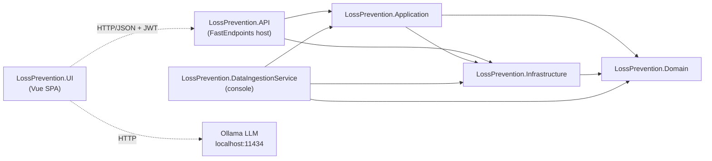
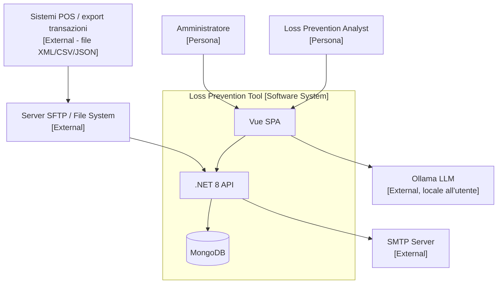

<!-- REVERSE-META
schema: 1
mode: how
step: 00_deep_dive
commit: 593f6decec3a642d5567754dd795b19560bb0afb
commit_short: 593f6de
branch: main
worktree: clean
baseline_date: 2026-10-05T10:14:05+00:00
generated_at: 2026-10-07T14:40:00Z
-->
# Deep Dive - Progetto LOSS_PREVENTION (Loss Prevention Tool)

> **Baseline commit:** `593f6de` (`main`) · worktree `clean`

**Data Analisi**: 2026-10-07
**Versione Codebase**: `593f6de` (`main`) — `593f6decec3a642d5567754dd795b19560bb0afb`
**Root analizzata**: `customspa-it-loss-prevention-d098a8b97860/` (sottocartella del repository `saristot/LOSS_PREVENTION`)
**Scenario REVERSE**: `how` — FULL (sostituisce integralmente l'output della run precedente del 2026-10-05)

---

## 1. Executive Summary

Il **Loss Prevention Tool** è un'applicazione web full-stack per l'analisi di transazioni retail (POS) orientata alla prevenzione delle perdite e all'individuazione di frodi. È composta da un **backend .NET 8** (FastEndpoints, 78 endpoint REST, MongoDB 8.x come unico datastore), un **job console .NET** per l'ingestione massiva di file XML e una **SPA Vue 3 + Vite + Vuetify** che contiene una parte molto rilevante della logica di business (motore statistico antifrode, integrazione LLM, report builder). Il codice applicativo misura **~25,2 KSLOC** (C# 10.143, Vue 10.720, TypeScript 3.868). L'architettura è un **monolite modulare a layer** (API → Application → Domain/Infrastructure) con un database documentale condiviso. Lo stack è **moderno**, ma il progetto è in stato **pre-produzione**: nessun test automatico, nessuna pipeline CI/CD, nessuna containerizzazione, CORS limitato a `localhost`, e diverse **vulnerabilità di sicurezza architetturali** (pipeline di aggregazione MongoDB arbitraria dal client, row-level security applicata solo nel browser, hash password restituiti dall'API, LLM chiamato direttamente dal browser su `localhost:11434`).

Le funzionalità "intelligenti" dichiarate nella documentazione del fornitore (`Docs/01_EXECUTIVE_OVERVIEW.md`) sono **presenti in forma parziale**: un rule-engine server-side semplice (confronto su singolo campo), un motore statistico euristico (percentili/deviazione standard, 30 tipologie) **eseguito interamente nel browser** senza persistenza dei risultati, un'analisi di similarità euclidea (nearest-neighbour, k=10) e un componente AI basato su **LLM locale Ollama (`qwen2.5:14b`)** usato solo per Natural-Language-Query e per generare template di report. Il dettaglio è in [§11](#11-critical-observations) e in [02_functional_overview.md §6](02_functional_overview.md#6-verifica-funzionalità-dichiarate-dal-fornitore).

---

## 2. Project Structure

### 2.1 Repository Organization

Monorepo con soluzione Visual Studio unica (`LossPrevention.sln`) + frontend npm nella stessa root.

```
customspa-it-loss-prevention-d098a8b97860/
├── LossPrevention.sln                     # 5 progetti .NET
├── LossPrevention.API/                    # Host ASP.NET Core + FastEndpoints (78 endpoint)
│   ├── Program.cs                         # composition root, JWT, CORS, DI, hosted service
│   ├── appsettings.json                   # Mongo, JWT, SMTP, retention
│   └── Endpoints/{Dashboard,Data,DataIngestion,FraudDetection,Groups,Mappings,
│                  Notifications,Rules,User/{Users,Roles,Permissions},Workspaces}
├── LossPrevention.Application/            # servizi, DTO, helper, mapping, validator
│   ├── Services/{Data,Data/Rules,DataIngestion,Users,Workspaces}
│   ├── Helpers/{BsonHelper,XmlToBsonConverterHelper,RuleHelper,DistanceHelper,...}
│   └── Handlers/{Requests,Responses}      # request/response model degli endpoint
├── LossPrevention.Domain/                 # entità (POCO) Mongo, eccezioni
├── LossPrevention.Infrastructure/         # MongoRepository<T>, DI repository, PasswordHasher, EmailService
├── LossPrevention.DataIngestionService/   # console app batch: XML da C:\xmlstore5\xml → Mongo
├── LossPrevention.UI/                     # Vue 3 + Vite + Vuetify + Pinia (SPA)
│   └── src/{components,stores,helpers,interfaces,router,api,plugins}
├── Data/
│   ├── LossPrevention/                    # dump mongodump (BSON) dell'intero DB di sviluppo
│   └── MongoDBScripts/                    # seed permessi, ruoli, regole antifrode
└── Docs/                                  # 17 documenti del fornitore (≈17.500 righe)
```

### 2.2 Build Artifacts

| Artefatto | Origine | Tipo |
|-----------|---------|------|
| `LossPrevention.API.dll` | `LossPrevention.API/01. LossPrevention.API.csproj` (SDK Web) | ASP.NET Core app (Kestrel) |
| `LossPrevention.DataIngestionService.exe` | `02. LossPrevention.DataIngestionService.csproj` (OutputType Exe) | Console app |
| Librerie | Application, Domain, Infrastructure | class library net8.0 |
| Bundle SPA | `LossPrevention.UI` → `vite build` | asset statici `dist/` |

Nessun Dockerfile, nessun manifest Kubernetes, nessun pacchetto di deploy versionato.

### 2.3 Branching Strategy

Il repository contiene **2 commit** (`08d0eed Initial commit`, `593f6de add codice`) di un unico autore: il codice è stato **importato in blocco**, la storia di sviluppo originale non è disponibile. `Docs/roadmap.txt` cita come attività futura "Branching Strategy for ease of development" → oggi non esiste una strategia formalizzata.

---

## 3. Technology Stack

### 3.1 Backend Stack

| Categoria | Tecnologia | Versione | Note |
|-----------|------------|----------|------|
| Runtime | .NET | 8.0 (`net8.0`) | LTS, fine supporto 10-nov-2026 → pianificare .NET 10 LTS |
| Linguaggio | C# | 12 (default .NET 8) | `Nullable` e `ImplicitUsings` abilitati |
| Web framework | FastEndpoints | 6.0.0 | REPR pattern, permessi via claim `permissions` |
| Security | FastEndpoints.Security + JwtBearer | 6.0.0 | HMAC-SHA256 simmetrico |
| API docs | FastEndpoints.Swagger (NSwag) | 6.0.0 | Solo in `Development` |
| Database driver | MongoDB.Driver / MongoDB.Bson | 3.4.0 | Accesso generico `MongoRepository<T>` |
| Validation | FluentValidation | 11.11.0 | Usato solo per Dashboard (2 validator) |
| SFTP | SSH.NET | 2025.1.0 | Ingestione da SFTP |
| JSON | Newtonsoft.Json + System.Text.Json | 13.0.3 | Doppia libreria |
| Hosting | Microsoft.Extensions.Hosting | 9.0.4 | Console ingestion + `BackgroundService` |
| Email | `System.Net.Mail.SmtpClient` | BCL | API sconsigliata da Microsoft per nuovi sviluppi (MailKit) |
| Logging | `Microsoft.Extensions.Logging` | default | Console provider; 6 `Console.WriteLine` residui |
| Test | — | — | **Nessun progetto di test** |

### 3.2 Frontend Stack

| Categoria | Tecnologia | Versione (lock) | Note |
|-----------|------------|----------|------|
| Linguaggio | TypeScript | 5.6.3 | `vue-tsc` presente ma non usato nello script `build` |
| Framework | Vue | 3.5.14 | Composition API / `<script setup>` |
| Build tool | Vite | 6.4.1 | `vite.config.js` minimale (alias `@`) |
| Meta-framework | Nuxt | 3.17.3 | **Dichiarato ma non usato**: `nuxt.config.ts` non è referenziato, l'app è montata con `createApp` in `src/main.ts` |
| UI library | Vuetify | 3.7.3 | + `@mdi/font` |
| State | Pinia | 2.2.4 | 15 store |
| Routing | vue-router | 4.6.3 | 17 route, guard basato su `localStorage.token` |
| HTTP | Axios | 1.13.1 | `src/api/api.ts`, baseURL da `VITE_API_BASE_URL` |
| Grid | AG Grid Community 35 + tabulator-tables 6.3 | | doppia libreria grid |
| Charting | Chart.js 4.5 + chartjs-chart-matrix 3 | | heatmap |
| Export | xlsx 0.18.5, papaparse, pdfmake | | `xlsx` npm non più mantenuto (CVE senza fix) |
| LLM | fetch → Ollama `http://localhost:11434/api/generate` | `qwen2.5:14b` | Chiamata diretta dal browser |
| Test | — | — | Nessun framework di test |
| Lint | — | — | Nessuna config ESLint/Prettier |

### 3.3 Database & Persistence

| Categoria | Tecnologia | Versione | Note |
|-----------|------------|----------|------|
| DBMS | MongoDB | 8.3.2 (da `Data/LossPrevention/prelude.json`, mongodump 100.13.0) | Unico datastore |
| Collezioni | 15 | — | `ReportData` (transazioni, schema-less) + 14 collezioni di configurazione |
| Schema management | — | — | Nessuna migrazione; script JS manuali in `Data/MongoDBScripts` |
| Retention | TTL index `ttl_BeginDateTime` | 180 gg (config) | Creato all'avvio da `DatabaseInitializationService` |
| Cache | `IMemoryCache` | in-process | Solo su `POST /data/report/query`, TTL 1 h |
| Connection | `MongoClient` | **registrato Scoped** | Anti-pattern: il client va registrato Singleton |
| Dapper | `DapperRepository.cs` | — | 204 righe **interamente commentate** (dead code) |

### 3.4 Infrastructure & DevOps

| Categoria | Tecnologia | Note |
|-----------|------------|------|
| Containerization | — | Assente |
| Orchestration | — | Assente |
| CI/CD | — | Assente (nessun `.github/workflows`, `azure-pipelines.yml`, ecc.) |
| Cloud provider | Azure (solo proposta) | `roadmap.txt` / `Docs/04_DEPLOYMENT_GUIDE.md` propongono Azure Functions/Container Apps + Cosmos (Mongo API) |
| IaC | — | Assente |
| Monitoring | — | Nessun health check, metriche o tracing |
| LLM runtime | Ollama | Deve girare su `localhost` della macchina dell'utente |

---

## 4. Architecture Overview

### 4.1 Application Architecture Pattern

**Monolite modulare a layer** con un processo batch separato. Dipendenze tra progetti:



`Application → Infrastructure` (anziché l'inverso) indica che non è una Clean Architecture "pura": i servizi applicativi dipendono direttamente da `IMongoRepository<T>` e dai builder del driver MongoDB.

C4 Level 1 (contesto):



### 4.2 Communication Patterns

- **Sincrono REST/JSON** tra SPA e API (Axios, Bearer JWT in `localStorage`).
- **Polling schedulato** interno: `DataIngestionBackgroundService` controlla ogni 60 s se avviare l'ingestione.
- **Nessun messaging** (no queue/broker), nessun WebSocket/SignalR: le "notifiche real-time" sono caricate all'avvio dell'app e su *Refresh*.
- **HTTP diretto browser → Ollama** per le funzioni AI.

### 4.3 Data Architecture

- **Shared database** unico (`LossPrevention`) per API, job console e background service.
- `ReportData` è una collezione **schema-less**: ogni file XML/CSV/JSON viene "appiattito" in BSON (`XmlToBsonConverterHelper`) e lo schema logico è descritto a posteriori nella collezione `Mappings` (nome, alias, tipo, visibilità) generata da `MappingService.ProcessMappings` campionando i documenti.
- Le query di report sono **pipeline di aggregazione MongoDB costruite dal frontend** (`helpers/queryUtils.ts`) ed eseguite così come arrivano.

### 4.4 Frontend Architecture

- **SPA** client-side (non SSR, nonostante README/Docs citino Nuxt 3 SSR).
- 41 componenti `.vue`, 15 store Pinia, 17 route con guard `requiresAuth`.
- Logica "fat client": `stores/aiStore.ts` (1.994 righe) e `components/reports/resultsGrid.vue` (2.271 righe) concentrano motore antifrode statistico, valutazione di espressioni (`eval`) ed export.

---

## 5. Project Metrics

| Metrica | Valore | Note |
|---------|--------|------|
| Total SLOC applicativo | **25.208** | C# + Vue + TS + JS + CSS + HTML (cloc 2.02, escl. `node_modules`, `.vite`, `docs`) |
| Backend SLOC (C#) | 10.143 | 232 file `.cs` |
| Frontend SLOC | 14.697 | Vue 10.720 (script 5.600 / template 4.043 / style 1.296) + TS 3.868 + CSS 96 + HTML 13 |
| Script DB (JS) | 368 | 5 script Mongo shell |
| Progetti .NET | 5 | API, Application, Domain, Infrastructure, DataIngestionService |
| File/tipi C# | 232 file (1 tipo/file prevalente) | 475 funzioni (lizard), CCN medio 2,5 |
| Componenti Vue / store | 41 / 15 | 569 funzioni FE, CCN medio 3,1 |
| API Endpoints | **78** | 24 POST · 27 GET · 11 PUT · 14 DELETE · 2 PATCH |
| Collezioni MongoDB | **15** | vedi [08_data.md](08_data.md) |
| Permessi RBAC | **37** | allineati 1:1 tra codice e seed (`01_CreatePermissions.js`); i Docs dichiarano "41+" |
| Test automatici | **0** | |

---

## 6. Team & Development Process

- Storia Git non significativa (import in un unico commit del 2026-10-05). Contributor visibili: 1.
- Nessun template PR, CODEOWNERS, quality gate, analisi statica o lint.
- `Docs/roadmap.txt` documenta lo stato per feature con marcatori `DONE`, `DONE, need to test`, `Left to do` → processo informale, nessun issue tracker referenziato.
- Il nome npm del progetto (`"name": "workflowbuilder"`) e il README template Vite indicano che il frontend deriva da uno scaffold riutilizzato.

---

## 7. Integrations & Dependencies

### 7.1 External Systems

| Sistema | Direzione | Meccanismo | Evidenza |
|---------|-----------|-----------|----------|
| Server SFTP | Inbound | SSH.NET, user/password, sposta file in `processed/` / `failed/` | `Services/DataIngestion/SftpFileProcessingService.cs` |
| File system locale | Inbound | `Directory.GetFiles(config.FileSystemPath, "*.<ext>")` | `FileProcessingCoordinator.cs` |
| File system batch | Inbound | Path hardcoded `C:\xmlstore5\xml` | `LossPrevention.DataIngestionService/Program.cs` |
| SMTP | Outbound | `SmtpClient`, `EnableSsl=false`, `UseDefaultCredentials=true` | `Infrastructure/Services/EmailService.cs` |
| Ollama LLM | Outbound (dal browser) | `fetch('http://localhost:11434/api/generate')`, modello `qwen2.5:14b` | `UI/src/stores/aiStore.ts:87-100` |

### 7.2 Third-Party Services

Nessun servizio SaaS integrato. Le opzioni cloud (Azure Functions, Cosmos DB vCore, MongoDB Atlas) sono solo proposte documentali.

---

## 8. Security & Compliance

### 8.1 Authentication & Authorization

- **JWT HS256** emesso da `POST /users/login` (`LoginEndpoint.cs`), scadenza `ExpiryHours=1`. Claim: `name`, `permissions` (uno per permesso dei ruoli), opzionali `LockField`/`LockValue`.
- **Permission-based access control**: ogni endpoint dichiara `Permissions("CAN_...")` (37 permessi); 4 endpoint anonimi (login, forgot/reset password, validate reset token).
- **Password**: PBKDF2-SHA256 600.000 iterazioni con salt 16 byte e upgrade trasparente degli hash legacy (10.000 iterazioni) → buona pratica.
- **Reset password**: token casuale, salvato come hash, scadenza 1 h, invalidazione dei token precedenti → buona pratica.
- **Anomalia**: `LoginEndpoint` non attende (`await`) `CreateTokenAsync`, quindi serializza un `Task<string>`; il frontend legge `response.data.token.result` (`loginStore.ts:78`) → funziona per coincidenza, contratto API fragile.

### 8.2 Data Protection

- **Row-level security ("UserLock") solo client-side**: `LockField/LockValue` sono nel JWT e applicati dal browser (`helpers/fieldLock.ts`). Il backend esegue qualsiasi pipeline ricevuta → un utente "bloccato" può leggere tutti i dati chiamando l'API direttamente.
- **Pipeline MongoDB arbitraria**: `POST /data/report/query` fa `BsonDocument.Parse` di ogni stage inviato dal client ed esegue l'aggregazione → possibili `$lookup` verso `Users` (hash password), `$out`/`$merge` (scrittura), `$unionWith`.
- `GET /users` restituisce `PasswordHash` e `PasswordSalt` (`GetUsersEndpoint.cs:36`).
- Password SFTP salvata in chiaro nella collezione `DataIngestionConfigurations`.
- Il dump `Data/LossPrevention/*.bson` è versionato: include `Users.bson` (con hash password) e ~3,5 MB di transazioni `ReportData`.
- `appsettings.json` versionato con **JWT SecretKey reale (36 caratteri)**, non un placeholder.
- In transito: nessun `UseHttpsRedirection`/HSTS; SMTP senza TLS.

### 8.3 Compliance Requirements

Dati di transazioni retail, identificativi dipendenti/cassieri e potenzialmente clienti (programmi fedeltà) → **GDPR** applicabile; se usato per il controllo dei dipendenti, in Italia rileva anche l'art. 4 L. 300/1970. **PCI-DSS** se i file POS contengono dati carta (le regole su `EntryMethod = Keyed` indicano dati di pagamento). Nessun audit log applicativo: requisito dichiarato nei Docs ma **non implementato** (`roadmap.txt`: "Logging/Auditing Section" in *Left to do*).

---

## 9. Deployment & Operations

### 9.1 Deployment Target
Non definito nel codice. CORS consente solo `http://localhost:5173/5174` (`Program.cs`) → configurazione di sviluppo. `launchSettings.json`: `http://localhost:5264`, `https://localhost:7110`.

### 9.2 Configuration Management
`appsettings.json` unico per API e uno per il job; nessun `appsettings.{Environment}.json`, nessun uso di Key Vault; il frontend usa `import.meta.env.VITE_API_BASE_URL` (file `.env` non versionato).

### 9.3 Monitoring & Observability
Nessun endpoint di health, nessuna metrica, logging su console (più 57 `console.log` nel frontend). Il background service logga gli esiti di ingestione via `ILogger`.

---

## 10. Documentation Inventory

| Documento | Path | Note |
|-----------|------|------|
| README root | `README.md` | Affermazioni non allineate al codice (Nuxt SSR, 41 permessi, path `docs/` minuscolo) |
| README UI | `LossPrevention.UI/README.md` | Template Vite di default |
| Docs fornitore (17 file, ≈17.500 righe) | `Docs/01..14_*.md`, `FRAUD_DETECTION_API.md`, `DISTANCE_ANALYSIS_QUICK_START.md` | Executive overview, architettura, API, DB, security, user manual, testing |
| Roadmap | `Docs/roadmap.txt` | Stato reale delle feature (fonte più affidabile dei Docs) |
| Elenco permessi | `Data/MongoDBScripts/PERMISSIONS_LIST.md` | |
| Swagger/OpenAPI | runtime `/swagger` | Solo ambiente Development |

---

## 11. Critical Observations

### 🔴 HIGH PRIORITY ISSUES

1. **Esecuzione di pipeline MongoDB arbitrarie dal client** (`GetReportDataEndpoint.cs`, `ReportDataservice.cs`): chiunque abbia `CAN_VIEW_REPORT` può leggere qualsiasi collezione (`$lookup`) e scrivere (`$out`/`$merge`). Impatto: data breach, manomissione dati.
2. **Row-level security solo nel browser** (`fieldLock.ts`): la funzionalità dichiarata "Field-level access control for data locking" non è una protezione reale.
3. **Esposizione di hash/salt password** in `GET /users` e `UserDTO`.
4. **Segreti e dati versionati**: JWT secret reale in `appsettings.json`; dump DB con utenti e transazioni in `Data/LossPrevention`.
5. **Motore antifrode statistico e AI interamente client-side**: risultati non persistiti, non verificabili, non riproducibili, nessun audit; le regole sono compilate con `new Function(...)` e le espressioni del report designer valutate con `eval(...)`.
6. **LLM su `localhost:11434` chiamato dal browser**: funziona solo se ogni postazione utente esegue Ollama con il modello `qwen2.5:14b`; in produzione multi-utente la funzione AI non è operativa senza modifiche.
7. **`POST /data/create-transactions` non persiste** i documenti (`ProcessAsync` non inserisce) e accede a `bson["_id"]` mai valorizzato → con alta probabilità l'endpoint solleva eccezione per ogni file (da confermare a runtime).
8. **Zero test automatici e zero CI/CD**.

### 🟠 MEDIUM PRIORITY CONCERNS

1. `RuleConfigurationService.ApplyRulesAsync` carica **tutta** `ReportData` in memoria e fa una `ReplaceOne` per documento (N round-trip); `UpdateRuleAsync` scrive il flag nella radice del documento (`$"{rule.RuleName}"`) invece che in `FraudFlags.<Rule>` e, in caso di rinomina, cerca la mapping con nome errato (senza prefisso `FraudFlags.`).
2. `MongoClient` registrato **Scoped** (un client/connection pool per request).
3. Cache report in-memory 1 h non invalidata dopo ingestione/applicazione regole e non partizionata per utente.
4. `DataIngestionBackgroundService`: `LastRunAt` aggiornato solo in memoria (mai persistito) e confronto con `DateTime.Now` locale → rischio di doppia esecuzione nella finestra ±1 min.
5. Verifica host key SFTP assente (nessun handler `HostKeyReceived`) → MITM possibile.
6. 71 vulnerabilità npm (6 critical, 46 high): `xlsx` senza fix upstream; `jspdf`/`jspdf-autotable` (critical) e `nuxt`/`@nuxt/devtools` sono **dipendenze non usate**.
7. 20 endpoint su 78 accedono direttamente a `IMongoRepository<T>` (Dashboard, Groups, Notifications, FraudDetection) bypassando il layer Application.
8. `GET /notifications` restituisce **tutte** le notifiche di tutti gli utenti (filtro `Empty`).

### 🟢 POSITIVE FINDINGS

1. Stack aggiornato (.NET 8, Vue 3.5, Vite 6, Mongo Driver 3.4).
2. Hashing password robusto (PBKDF2 600k) con migrazione trasparente; reset password con token hashati.
3. Autorizzazione granulare dichiarativa su tutti gli endpoint non anonimi; seed permessi coerente col codice.
4. Ingestione multi-formato (XML/CSV/JSON) via Strategy (`IFileProcessingService`) e tracciamento file processati (`ProcessedFiles`) con idempotenza per nome file.
5. Retention automatica tramite TTL index configurabile.
6. Complessità ciclomatica media bassa (2,5 BE / 3,1 FE): i problemi sono concentrati in pochi hotspot.

---

## 12. Technology Radar

### 🚨 EOL/Deprecated Technologies
- `xlsx@0.18.5` (SheetJS su npm): non più pubblicato su npm, CVE prototype pollution/ReDoS senza fix.
- `System.Net.Mail.SmtpClient`: sconsigliato da Microsoft per nuovi sviluppi.
- `Microsoft.AspNetCore.Http.Features 5.0.17` referenziato dall'Application: pacchetto dell'era .NET 5, deprecato.

### ⚠️ Near EOL
- **.NET 8 LTS**: fine supporto **10 novembre 2026** (circa 1 mese dalla data dell'analisi) → migrazione a .NET 10 LTS da pianificare subito.
- Pinia 2.x (Pinia 3 disponibile), Vuetify 3.7 (minor successive disponibili).

### ✅ Current
- Vue 3.5, Vite 6, TypeScript 5.6, MongoDB 8.x, FastEndpoints 6, MongoDB.Driver 3.4, SSH.NET 2025.1.

---

## 13. Next Steps

1. Verifica feature-by-feature delle funzionalità dichiarate: [02_functional_overview.md §6](02_functional_overview.md#6-verifica-funzionalità-dichiarate-dal-fornitore).
2. Effort per completare le feature "in sviluppo" e "pianificate": [19_modernization_estimation_spec.md §7](19_modernization_estimation_spec.md#7-effort-di-completamento-funzionalità-in-sviluppo-e-pianificate).
3. Quick win di sicurezza: [17_backend_deep_assessment.md](17_backend_deep_assessment.md), [16_frontend_deep_assessment.md](16_frontend_deep_assessment.md).
4. Validare a runtime (.NET 8 + MongoDB + dump `Data/LossPrevention`) i comportamenti marcati "da confermare".

---

## Appendix A: Tool Commands Used

```bash
# Metadati commit
git rev-parse HEAD; git rev-parse --abbrev-ref HEAD; git show -s --format=%cI HEAD
# SLOC
perl cloc-2.02.pl . --exclude-dir=node_modules,.vite,docs,.git
# Complessità
lizard LossPrevention.API LossPrevention.Application ... -l csharp
lizard LossPrevention.UI/src -l typescript -l vue -w
# Vulnerabilità frontend
npm audit --package-lock-only --json
# Endpoint, verbi e permessi
grep -oE '(Get|Post|Put|Delete|Patch)\("[^"]*"' -r LossPrevention.API/Endpoints
grep -oE 'Permissions\("CAN_[A-Z_]+' -r LossPrevention.API
```

Limite: la build .NET non è stata eseguita nell'ambiente di analisi (runtime .NET non avviabile nel sandbox); tutte le osservazioni derivano da analisi statica.

## Appendix B: File Paths Reference

```
Backend:
  - Solution:          LossPrevention.sln
  - API host:          LossPrevention.API/Program.cs
  - Config API:        LossPrevention.API/appsettings.json
  - DI repository:     LossPrevention.Infrastructure/InfrastructureServiceExtensions.cs
  - Rule engine:       LossPrevention.Application/Services/Data/Rules/RulesService.cs, Helpers/RuleHelper.cs
  - Distance (KNN):    LossPrevention.Application/Services/Data/DistanceDataservice.cs, Helpers/DistanceHelper.cs
  - Ingestion:         LossPrevention.Application/Services/DataIngestion/*.cs
  - Batch job:         LossPrevention.DataIngestionService/Program.cs
Frontend:
  - package.json:      LossPrevention.UI/package.json
  - Entry:             LossPrevention.UI/src/main.ts
  - AI + fraud engine: LossPrevention.UI/src/stores/aiStore.ts, fraudDetectionStore.ts
  - Report grid:       LossPrevention.UI/src/components/reports/resultsGrid.vue
Data:
  - Dump DB:           Data/LossPrevention/*.bson
  - Seed:              Data/MongoDBScripts/*.js, rules_export.json
```
