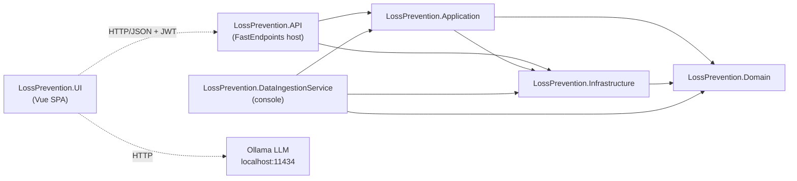
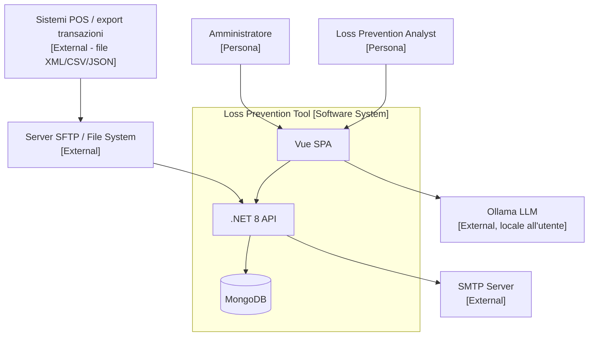

<!-- IMPACT-META
schema: 1
mode: how
step: 00_deep_dive
commit: fc7d820908b8b230fb47a2669920ba7efdb413a8
commit_short: fc7d820
branch: main
worktree: dirty
baseline_date: 2026-10-07T18:19:51+02:00
generated_at: 2026-10-08T09:33:09+02:00
-->
# Deep Dive - Progetto LOSS_PREVENTION (Loss Prevention Tool)

> **Baseline commit:** `fc7d820` (`main`) · worktree `dirty` (modifiche locali solo in `Docs/` e `.github/`; codice applicativo identico al commit)

**Data Analisi**: 2026-10-08  
**Versione Codebase**: `fc7d820` (`main`) — `fc7d820908b8b230fb47a2669920ba7efdb413a8`  
**Root analizzata**: `customspa-it-loss-prevention-d098a8b97860/` (unica sottocartella applicativa del repository Git `LOSS_PREVENTION`)  
**Versione documento**: 1.1 (verifica IMPACT del 2026-10-08)  
**Convenzioni**: i path sono relativi alla root analizzata; i riferimenti `file:riga` si riferiscono al commit baseline. La documentazione del fornitore (17 file) **non esiste alla baseline**: era presente solo nel commit `593f6de` ed è stata rimossa in `d768cd9`; ogni citazione è quindi storica ed è verificabile con `git show 593f6de:customspa-it-loss-prevention-d098a8b97860/Docs/<file>` (vedi [§10](#10-documentation-inventory)).

---

## 1. Executive Summary

Il **Loss Prevention Tool** è un'applicazione web full-stack per l'analisi delle transazioni retail (POS) finalizzata a individuare perdite e frodi. È composta da un backend **.NET 8 / FastEndpoints 6** (5 progetti, **78 endpoint REST**, 37 permessi `CAN_*`) su **MongoDB 8.x** come unico datastore (15 collezioni referenziate dal codice), da un job console .NET per l'ingestione massiva di file XML e da una **SPA Vue 3.5 + Vite 6 + Vuetify 3** (41 SFC, 15 store Pinia) che ospita una parte rilevante della logica di business (motore statistico antifrode con 30 euristiche, integrazione LLM Ollama, report designer). Il codice misura **≈25,3 KSLOC** (cloc 2.10: C# 10.143, Vue 10.773, TypeScript 3.868; dettaglio in [14_metrics.md](14_metrics.md)) ed è organizzato come **monolite modulare a layer** con database documentale condiviso. Lo stack è recente, ma .NET 8 LTS esce dal supporto il 10-11-2026; lo stato complessivo è **pre-produzione**: 0 test automatici, nessuna CI/CD né containerizzazione, CORS limitato a `localhost`, lockfile npm non sincronizzato (`npm ci` fallisce), 12 import con maiuscole/minuscole errate che rompono la build su Linux/macOS (più un import irrisolvibile nel componente orfano `ScheduleForm.vue`) e diverse vulnerabilità architetturali (pipeline MongoDB arbitraria inviata dal client, row-level security applicata solo nel browser, hash password restituiti dall'API, LLM su `localhost:11434` chiamato dal browser). Le funzionalità "intelligenti" dichiarate dal fornitore sono presenti solo in parte (rule-engine a campo singolo, statistica client-side non persistita, similarità euclidea top-10, LLM limitato a NLQ e generazione di template): dettagli in [§11](#11-critical-observations) e in [02_functional_overview.md](02_functional_overview.md) (sezione «Verifica funzionalità dichiarate dal fornitore»).

---

## 2. Project Structure

Questa sezione descrive come è organizzato il repository, cosa produce il build e quale storia/strategia di branching è osservabile in Git.

### 2.1 Repository Organization

**Monorepo**: backend .NET, frontend npm, dump/seed del database e documentazione convivono nello stesso repository Git. La root Git (`LOSS_PREVENTION/`) contiene solo `README.md` (1 riga, creato da `08d0eed Initial commit`) e la cartella applicativa.

```
customspa-it-loss-prevention-d098a8b97860/
├── LossPrevention.sln                     # 5 progetti .NET (nomi "01. ...API", "02. ...DataIngestionService")
├── README.md                              # README di prodotto (link a docs/ inesistenti, vedi §10)
├── .gitignore                             # template Visual Studio; riga 369 ignora .github/
├── LossPrevention.API/                    # Host ASP.NET Core + FastEndpoints (79 file .cs, 78 endpoint)
│   ├── Program.cs                         # composition root (132 righe): JWT, CORS, DI, Swagger, hosted service
│   ├── appsettings.json                   # Mongo (13 collezioni), JWT, SMTP, retention
│   ├── Properties/launchSettings.json     # profili http 5264 / https 7110 / IIS Express 55993
│   └── Endpoints/                         # Dashboard 5 · Data 3 · DataIngestion 8 · FraudDetection 3 · Groups 7
│                                          # Mappings 4 · Notifications 5 · Rules 6 · User/{Users 12, Roles 10,
│                                          # Permissions 10} · Workspaces 5
├── LossPrevention.Application/            # 121 file .cs: servizi, DTO, helper, mapping, validator
│   ├── Services/{Data,Data/Rules,DataIngestion,Users,Workspaces}
│   ├── Helpers/{BsonHelper,DistanceHelper,JsonHelper,MappingHelper,RuleHelper,XmlToBsonConverterHelper}.cs
│   ├── Handlers/{Requests,Responses}      # request/response model degli endpoint
│   ├── DTO/ · Interfaces/ · Mappings/ · Validators/
├── LossPrevention.Domain/                 # 21 file .cs (19 in Entities/), POCO con attributi MongoDB.Bson
├── LossPrevention.Infrastructure/         # 10 file .cs: MongoRepository<T>, DI repository, PasswordHasher,
│                                          # EmailService, DapperRepository (interamente commentato)
├── LossPrevention.DataIngestionService/   # console app batch (1 file): XML da C:\xmlstore5\xml → Mongo
├── LossPrevention.UI/                     # SPA Vue 3 + Vite + Vuetify + Pinia (npm, name "workflowbuilder")
│   ├── package.json · package-lock.json · vite.config.js · tsconfig.json · nuxt.config.ts (non usato)
│   └── src/{api,components/{ai,dashboard,manage,reports,workspace},helpers,interfaces,plugins,router,stores}
├── Data/
│   ├── LossPrevention/                    # mongodump (12 collezioni, 25 file incl. prelude.json)
│   └── MongoDBScripts/                    # 5 script ordinati 00..04 + rules_export.json + PERMISSIONS_LIST.md
└── Docs/                                  # documenti IMPACT (00..19 + index.md); i Docs del fornitore sono
                                           # stati rimossi in d768cd9
```

Artefatti di tooling versionati per errore: 5 file `*.csproj.lscache` e 2 file in `LossPrevention.UI/.vite/` (cache Vite).

### 2.2 Build Artifacts

| Artefatto | Origine | Tipo | Note |
|-----------|---------|------|------|
| `LossPrevention.API.dll` | `LossPrevention.API/01. LossPrevention.API.csproj` (`Microsoft.NET.Sdk.Web`) | ASP.NET Core app (Kestrel) | Nessuna proprietà `<Version>` nei csproj |
| `LossPrevention.DataIngestionService.exe` | `02. LossPrevention.DataIngestionService.csproj` (`OutputType Exe`) | Console app | Path sorgente hardcoded |
| Librerie | Application, Domain, Infrastructure | class library `net8.0` | — |
| Bundle SPA | `LossPrevention.UI` → `npm run build` = `vite build` | asset statici in `dist/` (ignorato da `.gitignore` UI) | Nessun type-check (`vue-tsc` non invocato); `version: 0.0.0` |

Nessun Dockerfile, manifest Kubernetes, pacchetto di deploy o pipeline che produca artefatti versionati.

### 2.3 Branching Strategy

Il repository ha **13 commit**, un solo branch (`main`, tracciato da `origin/main`) e **un solo autore** (`saristot`):

| Commit | Data | Contenuto |
|--------|------|-----------|
| `08d0eed` | 2026-10-05 | Initial commit (`README.md` di root) |
| `593f6de` | 2026-10-05 | "add codice": import in blocco dell'intero codice applicativo **e** dei 17 documenti fornitore in `Docs/` |
| `d768cd9` | 2026-10-07 | Rimozione della cartella `Docs/` del fornitore (17 file, 17.577 righe) |
| `5ea5bc9` … `fc7d820` | 2026-10-07 | 10 commit via interfaccia web GitHub ("Create …", "Add files via upload", "Delete … docs directory") che aggiungono/rimuovono soltanto documentazione IMPACT |

Il codice applicativo non è mai cambiato dopo `593f6de`: la storia di sviluppo originale **non è disponibile** e non si osserva alcuna strategia di branching (nessun feature branch, tag o release). La roadmap del fornitore (`Docs/roadmap.txt`, storica: presente solo in `593f6de`, rimossa in `d768cd9`) elenca tra le attività future "Branching Strategy for ease of development", confermando che una strategia non era stata formalizzata.

---

## 3. Technology Stack

Le versioni sono lette da `*.csproj`, `package.json` (range dichiarati) e `package-lock.json` (versioni effettivamente risolte, lockfile v3).

### 3.1 Backend Stack

| Categoria | Tecnologia | Versione | Note |
|-----------|------------|----------|------|
| Runtime | .NET | 8.0 (`net8.0` in tutti i 5 csproj) | LTS, fine supporto **10-11-2026** → pianificare .NET 10 LTS |
| Linguaggio | C# | 12 (default .NET 8) | `Nullable` e `ImplicitUsings` abilitati in tutti i progetti |
| Web framework | FastEndpoints | 6.0.0 | REPR pattern: 1 classe = 1 endpoint; permessi via claim `permissions` |
| Security | FastEndpoints.Security (JwtBearer) | 6.0.0 | JWT HMAC-SHA256 simmetrico (`Program.cs:73-74`) |
| API docs | FastEndpoints.Swagger (NSwag) | 6.0.0 | Abilitato solo in `Development` (`Program.cs:121-125`) |
| Database driver | MongoDB.Driver / MongoDB.Bson | 3.4.0 | Accesso generico `MongoRepository<T>`; MongoDB.Bson anche nel Domain |
| Validation | FluentValidation | 11.11.0 | Solo Dashboard: 4 classi `AbstractValidator` in 2 file (`CreateDashboardValidator.cs`, `UpdateDashboardValidator.cs`) |
| SFTP | SSH.NET | 2025.1.0 | `SftpFileProcessingService.cs:56` |
| JSON | Newtonsoft.Json + System.Text.Json | 13.0.3 / BCL | Doppia libreria JSON |
| Configurazione / DI | Microsoft.Extensions.* (Configuration, Binder, Options, DI.Abstractions, Hosting) | 9.0.4 | Pacchetti 9.x su runtime 8 |
| HTTP features | Microsoft.AspNetCore.Http.Features | 5.0.17 | **Obsoleto** (era .NET 5), referenziato dall'Application |
| Email | `System.Net.Mail.SmtpClient` | BCL | API sconsigliata da Microsoft per nuovi sviluppi (MailKit) |
| Logging | `Microsoft.Extensions.Logging` | default | Console provider; 6 `Console.WriteLine` residui (`DistanceDataservice.cs:86`, `MappingService.cs:336,421`, `DataIngestionService/Program.cs:80,108,122`) |
| Build tool | MSBuild / `dotnet` CLI, solution `LossPrevention.sln` | — | Nessun `Directory.Build.props`, nessun `global.json` |
| Test | — | — | **Nessun progetto di test** |

### 3.2 Frontend Stack

| Categoria | Tecnologia | Versione (lock) | Note |
|-----------|------------|-----------------|------|
| Linguaggio | TypeScript | 5.6.3 (range `^5.0.0`) | `tsconfig.json`: `strict: true`, alias `@/*` |
| Framework | Vue | 3.5.14 | Composition API / `<script setup>` |
| Build tool | Vite | 6.4.1 (range `^6.3.5`) | `vite.config.js` minimale (plugin vue + alias `@`) |
| Package manager | npm | lockfile v3 | **Lockfile non sincronizzato**: `npm ci` fallisce (`Missing: vue-tsc@2.2.12 from lock file`) |
| Meta-framework | Nuxt | 3.17.3 (range `^3.0.0`) | **Dichiarato ma non usato**: `nuxt.config.ts` (`ssr: true`) non è referenziato; l'app è montata con `createApp` (`src/main.ts:15,21`) e gli script sono solo Vite |
| UI library | Vuetify | 3.7.3 | + `@mdi/font` 7.4.47 |
| State management | Pinia | 2.2.4 | 15 store in `src/stores/` |
| Routing | vue-router | 4.6.3 | `createWebHistory`; 18 path (17 route con componente + 1 redirect alias `/dashboardsList`); guard `requiresAuth` |
| HTTP client | Axios | 1.13.1 | `src/api/api.ts:4` baseURL da `VITE_API_BASE_URL` |
| Forms | Componenti Vuetify | — | Nessuna libreria di form/validazione dedicata |
| Grid | AG Grid Community/Vue3 35.0.0 + tabulator-tables 6.3.1 | — | Doppia libreria grid |
| Layout dashboard | vue-grid-layout-v3 3.1.2 | — | `grid-layout-plus` e `vuedraggable` dichiarati ma mai importati |
| Charting | Chart.js 4.5.0 + chartjs-chart-matrix 3.0.0 | — | Heatmap |
| Export | xlsx 0.18.5, papaparse 5.5.3, pdfmake 0.2.20 | — | `xlsx` su npm non più mantenuto (CVE senza fix); `jspdf`/`jspdf-autotable` dichiarati ma mai importati |
| LLM | `fetch` → Ollama `http://localhost:11434/api/generate` | modello `qwen2.5:14b` | Chiamata diretta dal browser (`stores/aiStore.ts:8`, `:88`) |
| Test | — | — | Nessun framework di test, nessuno script `test` |
| Lint / format | — | — | Nessuna configurazione ESLint/Prettier; script npm solo `dev`/`build`/`preview` |

### 3.3 Database & Persistence

| Categoria | Tecnologia | Versione | Note |
|-----------|------------|----------|------|
| DBMS | MongoDB | 8.3.2 (da `Data/LossPrevention/prelude.json`, mongodump 100.13.0) | Unico datastore, database `LossPrevention` |
| Collezioni referenziate dal codice | 15 | — | 13 configurate in `appsettings.json` + `PasswordResetTokens` (hardcoded, `InfrastructureServiceExtensions.cs:83`) + `ProcessedFiles` (hardcoded, `FileProcessingCoordinator.cs:391,409`) |
| Dump versionato | 12 collezioni | — | 10 "vive" + `Mappings_old`, `ReportData_old`; `ReportData` 3.000 documenti (≈3,5 MB) |
| Schema management | — | — | Nessuno strumento di migrazione; script JS manuali in `Data/MongoDBScripts` (00..04) |
| Retention | TTL index `ttl_BeginDateTime` | 180 gg (`DataRetention.TransactionRetentionDays`) | Creato all'avvio da `DatabaseInitializationService.cs:97-101` |
| Connection pooling | Pool interno del driver MongoDB | — | `IMongoClient` registrato **Scoped** (`InfrastructureServiceExtensions.cs:33-36`): un client/pool per request (anti-pattern) |
| Cache layer | `IMemoryCache` | in-process | Solo su `POST /data/report/query`, TTL 1 h (`GetReportDataEndpoint.cs:81`) |
| Dapper | `Repositories/DapperRepository.cs` | — | 204 righe **interamente commentate** (dead code) |

### 3.4 Infrastructure & DevOps

| Categoria | Tecnologia | Versione | Note |
|-----------|------------|----------|------|
| Containerization | — | — | Nessun Dockerfile / compose |
| Orchestration | — | — | Assente |
| CI/CD | — | — | Assente (nessun `.github/workflows`, `azure-pipelines.yml`, `Jenkinsfile`); `.gitignore:369` esclude `.github/` dal versionamento |
| Cloud provider | Azure (solo proposta documentale) | — | `Docs/roadmap.txt` e `Docs/04_DEPLOYMENT_GUIDE.md` (storici, solo in `593f6de`) propongono Azure Functions/App Service + Cosmos DB (Mongo API) o MongoDB Atlas |
| IaC | — | — | Assente |
| Monitoring | — | — | Nessun health check, metrica o tracing |
| Logging centralizzato | — | — | Solo console provider |
| Service mesh / reverse proxy | — | — | N/A — non presente nel codice |
| LLM runtime | Ollama | modello `qwen2.5:14b` | Deve girare su `localhost` della postazione dell'utente |
| Sviluppo locale | Visual Studio / `dotnet`, Node.js ≥ 18 (requisito di Vite 6) / npm, MongoDB locale `mongodb://localhost:27017`, SMTP locale porta 25 (commento "smtp4dev") | — | Ricavato da `appsettings.json` e `EmailService.cs:64` |

---

## 4. Architecture Overview

Il sistema è un monolite modulare a layer con un processo batch separato, comunicazione sincrona REST/JSON e un database documentale condiviso; la SPA è un "fat client" che esegue anche logica di dominio.

### 4.1 Application Architecture Pattern

**Monolite modulare a layer** (API → Application → Domain/Infrastructure) + console di ingestione batch. Dipendenze tra progetti (da `ProjectReference` nei csproj):



Non è una Clean/Hexagonal Architecture "pura": `Application → Infrastructure` (anziché l'inverso) fa dipendere i servizi applicativi direttamente da `IMongoRepository<T>` e dai builder del driver MongoDB; il Domain dipende da `MongoDB.Bson` (attributi di persistenza nelle entità, 19 file su 21 con `using MongoDB.Bson`); 20 endpoint su 78 accedono direttamente a `IMongoRepository<T>` (Dashboard 5, Groups 7, Notifications 5, FraudDetection 3) bypassando l'Application. Non sono presenti event-driven architecture né CQRS.

C4 Level 1 (contesto):



### 4.2 Communication Patterns

| Pattern | Dove | Evidenza |
|---------|------|----------|
| Sincrono REST/JSON | SPA ↔ API (Axios, Bearer JWT; token in `localStorage`) | `src/api/api.ts:4`, `stores/loginStore.ts:92` |
| Polling schedulato interno | `DataIngestionBackgroundService` controlla ogni 60 s se avviare l'ingestione (`daily`/`weekly`/`monthly`; `one-time` escluso) | `DataIngestionBackgroundService.cs:13,55,129-140` |
| Batch console | `DataIngestionService` legge `C:\xmlstore5\xml` con `Parallel.ForEachAsync` e `InsertOneAsync` per documento | `DataIngestionService/Program.cs:76,85,102` |
| HTTP diretto browser → LLM | `fetch` verso Ollama | `stores/aiStore.ts:88` |
| Asincrono / messaging | **Assente**: nessuna coda/broker, nessun WebSocket/SignalR; le notifiche sono lette con `GET /notifications` al caricamento/refresh | `stores/notificationStore.ts:70-80` |
| gRPC / GraphQL | Assente | — |

### 4.3 Data Architecture

- **Shared database** unico (`LossPrevention`) usato da API, background service e console di ingestione (stessa connection string `mongodb://localhost:27017` in entrambi gli `appsettings.json`).
- `ReportData` è una collezione **schema-less**: ogni file XML/CSV/JSON viene "appiattito" in BSON (`XmlToBsonConverterHelper`) e lo schema logico è ricostruito a posteriori nella collezione `Mappings` (nome, alias, tipo, visibilità) da `MappingService.ProcessMappings` (`MappingService.cs:147`) campionando i documenti.
- Le query di report sono **pipeline di aggregazione MongoDB costruite dal frontend** (`helpers/queryUtils.ts`), deserializzate con `BsonDocument.Parse` (`GetReportDataEndpoint.cs:68`) ed eseguite da `ReportDataservice.cs:42,52`.
- Nessun modello read/write separato (no CQRS); cache solo in-process (`IMemoryCache`, 1 h).
- Nel dataset di esempio i campi temporali sono `TransactionDateTime`, mentre il TTL è definito su `BeginDateTime`, campo assente nei 3.000 documenti del dump: la retention è efficace solo se i file sorgente contengono `BeginDateTime` (da verificare sui dati reali).

### 4.4 Frontend Architecture

- **SPA** client-side (`createApp`, `createWebHistory`): non SSR/SSG, nonostante `README.md:31` e la documentazione fornitore citino "Nuxt 3 for SSR".
- 41 SFC `.vue` (40 in `components/` + `App.vue`), 15 store Pinia, 28 file `.ts`; 18 path di routing con guard `requiresAuth` che valida la scadenza del JWT a ogni navigazione (`router/index.ts:56-70`).
- Logica "fat client": `stores/aiStore.ts` (1.994 righe) e `components/reports/resultsGrid.vue` (2.271 righe) concentrano motore antifrode statistico (30 tipologie `fraudType` da `aiStore.ts:696`), compilazione di regole con `new Function(...)` (`aiStore.ts:1769`), valutazione di espressioni con `eval(...)` (`resultsGrid.vue:1377`) ed export.
- Row-level filter ("UserLock") applicato nel browser leggendo `LockField`/`LockValue` dal JWT (`helpers/fieldLock.ts:1-11`).
- Nessun microfrontend.

---

## 5. Project Metrics

Metriche calcolate al commit baseline escludendo `node_modules`, `.vite`, `bin`, `obj` e `Docs`.

| Metrica | Valore | Note |
|---------|--------|------|
| Total SLOC applicativo | **25.261** | cloc 2.10 (righe di codice, senza commenti/vuote): C# + Vue + TS + JS + CSS + HTML |
| Backend SLOC (C#) | **10.143** (cloc) · 10.760 righe non vuote | 232 file `.cs`: API 79 (4.347 righe non vuote), Application 121 (5.005), Domain 21 (519), Infrastructure 10 (784), DataIngestionService 1 (105); lizard NLOC 10.140 |
| Frontend SLOC | **14.761** (cloc) · 15.836 righe non vuote in `src/` | Vue 10.773 + TS 3.868 + CSS 96 + HTML 13 + JS 11 (vedi [14_metrics.md](14_metrics.md)); 69 file `.vue`/`.ts` in `src/` |
| Script DB (JS) | 368 | 5 script Mongo shell (357) + `vite.config.js` (11); nessuno script SQL |
| Configurazione (JSON/XML/TS config) | ≈350 righe non vuote | csproj, sln, appsettings, launchSettings, package.json, tsconfig, vite/nuxt config (escluso `package-lock.json`, 14.001 righe) |
| Progetti .NET (equivalente "Maven modules") | 5 | API, Application, Domain, Infrastructure, DataIngestionService |
| Pacchetti npm | 1 | `LossPrevention.UI` (`name: workflowbuilder`); 21 dipendenze + 12 devDependencies |
| File C# / funzioni | 232 file · 475 funzioni | lizard: CCN medio 2,5; 6 warning |
| Componenti Vue / store / funzioni FE | 41 / 15 / 569 | lizard: CCN medio 3,1; 14 warning |
| File > 1.000 righe | 2 | `resultsGrid.vue` 2.271, `aiStore.ts` 1.994 (max backend: `MappingService.cs` 428) |
| API Endpoints | **78** | 27 GET · 24 POST · 11 PUT · 14 DELETE · 2 PATCH; 4 `AllowAnonymous` |
| Collezioni MongoDB ("tabelle") | **15** referenziate dal codice | 12 nel dump; vedi [08_data.md](08_data.md) |
| Permessi RBAC | **37** usati dagli endpoint | = 37 creati da `01_CreatePermissions.js`; 41 distinti negli script `.js` (i 4 extra sono permessi obsoleti eliminati da `03_CleanupStalePermissions.js:12-16`); `PERMISSIONS_LIST.md` e `README.md:17` dichiarano 41 |
| Vulnerabilità npm | 71 | 6 critical · 46 high · 15 moderate · 4 low (`npm audit --package-lock-only`) |
| Test automatici | **0** | Nessun progetto/framework di test |

---

## 6. Team & Development Process

Le evidenze di processo sono minime perché il codice è stato importato in un unico commit.

| Aspetto | Evidenza | Valutazione |
|---------|----------|-------------|
| Commit history | 13 commit, tutti di `saristot`; codice in `593f6de` (2026-10-05), altri 11 commit del 2026-10-07 solo su documentazione | Storia di sviluppo originale non disponibile |
| Commit message style | Messaggi generati dall'interfaccia web GitHub ("Add files via upload", "Create 00_deep_dive.md", "Delete … directory") | Nessuna convenzione (es. Conventional Commits) |
| Contributors | 1 visibile in Git | Il team reale del fornitore: N/A — non ricavabile dal codice (storia importata) |
| Development workflow | Solo `main`; nessun feature branch, tag o PR | Nessun workflow osservabile |
| Code review | Nessun PR template, `CODEOWNERS`, branch protection versionata | Assente |
| Quality gates | Nessuna analisi statica, lint, SonarQube, coverage | Assenti |
| Gestione attività | `Docs/roadmap.txt` (storico, solo in `593f6de`) con marcatori `DONE`, `DONE, need to test`, `Left to do` | Processo informale, nessun issue tracker referenziato |
| Origine del frontend | `package.json` `"name": "workflowbuilder"`, `LossPrevention.UI/README.md` = template "Vue 3 + Vite", `index.html` `<title>Vite + Vue</title>` | Scaffold riutilizzato da un altro progetto |

---

## 7. Integrations & Dependencies

Il sistema ha poche integrazioni, tutte punto-punto e configurate localmente; non esistono identity provider esterni, payment gateway o message broker.

### 7.1 External Systems

| Sistema | Direzione | Meccanismo | Evidenza |
|---------|-----------|-----------|----------|
| Server SFTP | Inbound | SSH.NET, user/password; file spostati in `processed/` o `failed/` | `Services/DataIngestion/SftpFileProcessingService.cs:33-34,56` |
| File system locale/share | Inbound | `Directory.GetFiles(config.FileSystemPath, searchPattern)` | `FileProcessingCoordinator.cs:153` |
| File system batch | Inbound | Path hardcoded `C:\xmlstore5\xml` | `LossPrevention.DataIngestionService/Program.cs:76` |
| Upload manuale | Inbound | `POST /data/create-transactions` (multipart) | `Endpoints/Data/CreateTransactionEndpoint.cs` |
| SMTP | Outbound | `SmtpClient`, `EnableSsl=false`, `UseDefaultCredentials=true` (solo email di reset password) | `Infrastructure/Services/EmailService.cs:63-65` |
| Ollama LLM | Outbound (dal browser) | `fetch('http://localhost:11434/api/generate')`, modello `qwen2.5:14b` | `UI/src/stores/aiStore.ts:8`, `:88` |
| Identity provider | — | Nessuno: autenticazione interna con utenti in MongoDB | `LoginEndpoint.cs` |
| Payment gateway / message broker / reverse proxy | — | N/A — non presenti nel codice | — |

### 7.2 Third-Party Services

Nessun servizio SaaS integrato nel codice. Le opzioni cloud (Azure Functions/App Service, Cosmos DB con API Mongo, MongoDB Atlas, Container Apps) compaiono solo nella documentazione storica del fornitore (`Docs/roadmap.txt`, `Docs/04_DEPLOYMENT_GUIDE.md`: presenti solo in `593f6de`, rimossi in `d768cd9`).

---

## 8. Security & Compliance

Il modello di sicurezza è JWT + permessi granulari lato server, ma con lacune strutturali sulla protezione dei dati.

### 8.1 Authentication & Authorization

- **JWT HS256** emesso da `POST /users/login` (`LoginEndpoint.cs:48-81`), scadenza `ExpiryHours=1`. Claim: `name`, `permissions` (uno per permesso dei ruoli), opzionali `LockField`/`LockValue` (`LoginEndpoint.cs:52-68`).
- **Permission-based access control (PBAC)**: ogni endpoint non anonimo dichiara `Permissions("CAN_...")` (37 permessi distinti); 4 endpoint anonimi: `LoginEndpoint.cs:31`, `ForgotPasswordEndpoint.cs:19`, `ResetPasswordEndpoint.cs:19`, `ValidateResetTokenEndpoint.cs:24`. I ruoli sono contenitori di permessi (dump: 1 ruolo `Admin` con 37 permessi).
- **Password**: PBKDF2-SHA256 600.000 iterazioni, salt 16 byte, upgrade trasparente degli hash legacy a 10.000 iterazioni (`PasswordHasher.cs:7-10,21`; `UserService.cs:206-211`) → buona pratica.
- **Reset password**: token casuale (`RandomNumberGenerator`), salvato come SHA-256, scadenza 1 h, invalidazione dei token precedenti (`PasswordResetService.cs:50-65,148,158`) → buona pratica.
- **Anomalia**: `LoginEndpoint.cs:39` non attende (`await`) `CreateTokenAsync`, quindi serializza un `Task<string>`; il frontend legge `response.data.token.result` (`loginStore.ts:78`) → funziona per coincidenza, contratto API fragile.

### 8.2 Data Protection

- **Row-level security ("UserLock") solo client-side**: `LockField/LockValue` sono nel JWT e applicati dal browser (`helpers/fieldLock.ts`). Il backend esegue qualsiasi pipeline ricevuta → un utente "bloccato" può leggere tutti i dati chiamando l'API direttamente.
- **Pipeline MongoDB arbitraria**: `POST /data/report/query` (`GetReportDataEndpoint.cs:28-29,68`) fa `BsonDocument.Parse` di ogni stage inviato dal client ed esegue l'aggregazione → possibili `$lookup` verso `Users` (hash password), `$out`/`$merge` (scrittura), `$unionWith`.
- `GET /users` restituisce `PasswordHash` e `PasswordSalt` (`GetUsersEndpoint.cs:36`; anche `GetUserByIdEndpoint.cs:56`, `GetUserByUsernameEndpoint.cs:55`, `GetUserRolesPermissionEndpoint.cs:59`).
- Password SFTP in chiaro nell'entità `DataIngestionConfiguration.SftpPassword` (`DataIngestionConfiguration.cs:19`) e quindi nella collezione `DataIngestionConfigurations`.
- Il dump `Data/LossPrevention/*.bson` è versionato: include `Users.bson` (2 utenti con hash password) e 3.000 transazioni `ReportData` (≈3,5 MB) con numeri carta già troncati (6+4 cifre).
- `LossPrevention.API/appsettings.json` versionato con **JWT SecretKey reale (36 caratteri)**, non un placeholder.
- In transito: nessun `UseHttpsRedirection`/HSTS in `Program.cs:115-132`; SMTP senza TLS. A riposo: nessuna cifratura applicativa; dipende dalla configurazione MongoDB (non presente nel repository).
- **Secrets management**: assente (nessun Key Vault, user-secrets o variabili d'ambiente documentate).

### 8.3 Compliance Requirements

Dati di transazioni retail, identificativi di operatori/cassieri (`OperatorID`, `RegisterID`, `LocationID`) e dati di pagamento (`CardNumber` troncato, `EntryMethod`, `GiftCardNumber`) → **GDPR** applicabile; se usato per il controllo dei dipendenti, in Italia rileva anche l'art. 4 L. 300/1970. **PCI-DSS** rilevante se i file POS contenessero PAN completi (nel dump sono troncati). **Audit logging**: assente nel codice; la roadmap storica lo elenca in *Left to do* ("Logging/Auditing Section"), mentre `Docs/01_EXECUTIVE_OVERVIEW.md` (storico) dichiara "Comprehensive Audit Trail".

---

## 9. Deployment & Operations

Il codice contiene solo configurazione di sviluppo locale; target, strategia di rilascio e monitoraggio di produzione non sono definiti.

### 9.1 Deployment Target

Non definito nel codice. CORS consente solo `http://localhost:5173` e `http://localhost:5174` (`Program.cs:24-29`) → configurazione di sviluppo. `launchSettings.json`: `http://localhost:5264`, `https://localhost:7110`, IIS Express `http://localhost:55993`. La SPA usa `createWebHistory`: in produzione richiede un fallback del web server su `index.html`. Deployment strategy (blue-green/canary/rolling): N/A — non ricavabile dal codice (nessun artefatto di deploy).

### 9.2 Configuration Management

`appsettings.json` unico per l'API e uno per il job console; nessun `appsettings.{Environment}.json`, nessun Key Vault, nessuna variabile d'ambiente documentata. Il frontend usa `import.meta.env.VITE_API_BASE_URL` (`src/api/api.ts:4`) ma nel repository non esiste né `.env` né `.env.example`. Parametri operativi in configurazione: `DataRetention.TransactionRetentionDays=180`, `JwtSettings.ExpiryHours=1`, `Email.FrontendUrl=http://localhost:5173`.

### 9.3 Monitoring & Observability

Nessun endpoint di health/liveness/readiness, nessuna metrica, nessun tracing. Logging su console via `ILogger` (il background service registra esiti di ingestione, `DataIngestionBackgroundService.cs:66-91`), più 6 `Console.WriteLine` nel backend e 57 `console.log` nel frontend.

---

## 10. Documentation Inventory

Alla baseline `fc7d820` la documentazione disponibile nel repository è limitata a README, seed dei permessi e documenti IMPACT; la documentazione del fornitore è recuperabile solo dalla storia Git.

### 10.1 Documentazione presente alla baseline

| Documento | Path | Note |
|-----------|------|------|
| README di root Git | `../README.md` (root `LOSS_PREVENTION/`) | 1 riga, creato da `08d0eed` |
| README di prodotto | `README.md` | Affermazioni non allineate al codice: "Nuxt 3 for SSR" (`README.md:31`, falso), "41 granular permissions" (`:17`, `:144`; gli endpoint ne usano 37); tutti i link puntano a `docs/0X_*.md` (`:39`, `:103-137`) che **non esistono** (cartella `docs/` minuscola assente, documenti fornitore rimossi) |
| README UI | `LossPrevention.UI/README.md` | Template Vite di default ("Vue 3 + Vite") |
| Elenco permessi | `Data/MongoDBScripts/PERMISSIONS_LIST.md` | 41 permessi, di cui 8 non usati da alcun endpoint (es. `CAN_ANALYZE_DATA`, `CAN_CREATE_WORKSPACE`) |
| Seed / script DB | `Data/MongoDBScripts/00..04_*.js`, `rules_export.json` | Commenti in testa a ogni script (scopo e prerequisiti) |
| API documentation | Swagger/OpenAPI generato a runtime (FastEndpoints.Swagger) | Solo in ambiente `Development` (`Program.cs:121-125`); nessuna collection Postman |
| Documentazione IMPACT | `Docs/00_deep_dive.md` … `Docs/19_modernization_estimation_spec.md`, `Docs/index.md` | Prodotta dal reverse engineering (questo set) |
| Diagrammi architetturali, coding standard, runbook | — | Assenti nel codice alla baseline |

### 10.2 Documentazione storica del fornitore (non presente alla baseline)

I 17 file seguenti sono stati importati in `593f6de` ("add codice") e **rimossi in `d768cd9`** ("Delete customspa-it-loss-prevention-d098a8b97860/Docs directory"). Sono consultabili con `git show 593f6de:customspa-it-loss-prevention-d098a8b97860/Docs/<file>`. Righe da `git show --stat d768cd9` (totale 17.577).

| File storico | Righe | Contenuto / uso in questo documento |
|--------------|------:|-------------------------------------|
| `Docs/01_EXECUTIVE_OVERVIEW.md` | 195 | Feature dichiarate ("RBAC with 41+ permissions", "Field-level access control", "Nuxt 3 - Server-side rendering"), "Success Metrics" (30-50% riduzione perdite, ROI 6-12 mesi) |
| `Docs/02_SYSTEM_ARCHITECTURE.md` | 526 | Architettura dichiarata |
| `Docs/03_SETUP_INSTALLATION.md` | 654 | Setup sviluppo |
| `Docs/04_DEPLOYMENT_GUIDE.md` | 975 | Opzioni Azure (Functions/App Service, Cosmos DB Mongo API), MongoDB Atlas, on-premise, Docker/Kubernetes — solo proposte |
| `Docs/05_API_DOCUMENTATION.md` | 2.621 | Riferimento API |
| `Docs/06_DATABASE_DATA_MODEL.md` | 2.063 | Modello dati |
| `Docs/07_FRONTEND_ARCHITECTURE.md` | 1.190 | Architettura FE |
| `Docs/08_BACKEND_ARCHITECTURE.md` | 1.532 | Architettura BE |
| `Docs/09_SECURITY_DOCUMENTATION.md` | 700 | Sicurezza |
| `Docs/10_CONFIGURATION_REFERENCE.md` | 1.660 | Configurazione |
| `Docs/11_USER_MANUAL.md` | 2.751 | Manuale utente/amministratore |
| `Docs/12_MAINTENANCE_OPERATIONS.md` | 792 | Runbook operativi |
| `Docs/13_TESTING_QA.md` | 996 | Strategia di test (nessun test presente nel codice) |
| `Docs/14_CHANGELOG.md` | 351 | Changelog/roadmap |
| `Docs/DISTANCE_ANALYSIS_QUICK_START.md` | 170 | Guida analisi euclidea |
| `Docs/FRAUD_DETECTION_API.md` | 311 | Funzioni antifrode |
| `Docs/roadmap.txt` | 90 | Stato reale delle feature (`DONE`, `DONE, need to test`, `Left to do`): fonte più affidabile tra i documenti del fornitore |

---

## 11. Critical Observations

Le criticità sono ordinate per impatto; ciascuna riporta l'evidenza nel codice alla baseline.

### 🔴 HIGH PRIORITY ISSUES

1. **Esecuzione di pipeline MongoDB arbitrarie dal client** (`GetReportDataEndpoint.cs:68`, `ReportDataservice.cs:42,52`): chiunque abbia `CAN_VIEW_REPORT` può leggere qualsiasi collezione (`$lookup`) e scrivere (`$out`/`$merge`). Impatto: data breach, manomissione dati.
2. **Row-level security solo nel browser** (`helpers/fieldLock.ts`): la funzionalità dichiarata "Field-level access control for data locking" non è una protezione reale.
3. **Esposizione di hash/salt password** in `GET /users` (`GetUsersEndpoint.cs:36`) e in `UserDTO` (`UserDTO.cs:7`).
4. **Segreti e dati versionati**: JWT secret reale in `LossPrevention.API/appsettings.json`; dump DB con utenti e 3.000 transazioni in `Data/LossPrevention`.
5. **Motore antifrode statistico e AI interamente client-side**: risultati non persistiti, non verificabili, non riproducibili, nessun audit; regole compilate con `new Function(...)` (`aiStore.ts:1769`) ed espressioni del report designer valutate con `eval(...)` (`resultsGrid.vue:1377`).
6. **LLM su `localhost:11434` chiamato dal browser** (`aiStore.ts:88`): funziona solo se ogni postazione utente esegue Ollama con il modello `qwen2.5:14b`; in produzione multi-utente la funzione AI non è operativa senza modifiche.
7. **`POST /data/create-transactions` non persiste** i documenti: `XmlProcessingService.ProcessAsync` non inserisce (lo conferma il commento "processor does not insert" in `DataIngestionService/Program.cs:100`) e l'endpoint accede a `bson["_id"]` mai valorizzato (`CreateTransactionEndpoint.cs`) → con alta probabilità solleva eccezione per ogni file (da confermare a runtime).
8. **Build frontend non riproducibile**: `npm ci` fallisce per lockfile non sincronizzato; 12 import con maiuscole/minuscole diverse dal file reale (`workspaceStore`→`workspacestore.ts` in `dashboard.vue:123`, `dashboardsList.vue:132`, `tabularBlock.vue:43`, `queryBuilderTabs.vue:131`, `workspace.vue:58`, `home.vue:89`; `roleStore`→`rolestore.ts` in `roles.vue:96`, `users.vue:133`; `./chartBlock.vue` in `dashboardGrid.vue:85`; `./fraudSettingsDialog.vue` in `resultsGrid.vue:511`; `../stores/passwordResetStore` in `ForgotPassword.vue:49`, `ResetPassword.vue:86`) rompono `vite build` su file system case-sensitive (Linux/macOS, container).
9. **Zero test automatici e zero CI/CD**.

### 🟠 MEDIUM PRIORITY CONCERNS

1. `RuleConfigurationService.ApplyRulesAsync` (`RulesService.cs:32-58`) carica **tutta** `ReportData` in memoria e fa una `ReplaceOneAsync` per documento (N round-trip); `UpdateRuleAsync` scrive il flag nella radice del documento (`Update.Set($"{rule.RuleName}")`, `RulesService.cs:147`) invece che in `FraudFlags.<Rule>` e, in caso di rinomina, cerca la mapping con nome errato (senza prefisso `FraudFlags.`, `RulesService.cs:155`).
2. Regole antifrode **non applicate automaticamente all'ingestione** (la roadmap storica le indica "DONE, need to test"): `FileProcessingCoordinator.cs:108-109` esegue solo `ProcessMappings`/`FinalizeTypesAsync`; `ApplyRulesAsync` è invocato solo da `ApplyRulesEndpoint.cs:25`. Inoltre `IXmlEnrichmentRule` non ha alcuna implementazione: la pipeline di arricchimento è vuota.
3. `IMongoClient` registrato **Scoped** (`InfrastructureServiceExtensions.cs:33-36`): un client/connection pool per request.
4. Cache report in-memory 1 h (`GetReportDataEndpoint.cs:81`) non invalidata dopo ingestione/applicazione regole e non partizionata per utente.
5. `DataIngestionBackgroundService`: `LastRunAt` aggiornato solo in memoria (`:86`, con commento "You might want to save this back to the database") e confrontato con `DateTime.Now` locale (`:97-101`) → rischio di doppia esecuzione nella finestra di schedulazione.
6. Retention TTL su `BeginDateTime` (`DatabaseInitializationService.cs:97`), campo assente nei documenti di esempio (che usano `TransactionDateTime`) → retention potenzialmente inefficace.
7. Verifica host key SFTP assente (nessun handler `HostKeyReceived` in `SftpFileProcessingService.cs`) → MITM possibile.
8. 71 vulnerabilità npm (6 critical, 46 high): `xlsx` senza fix upstream; le critical dirette `jspdf`, `jspdf-autotable`, `@nuxt/devtools` riguardano **dipendenze non usate** (come `nuxt`, `grid-layout-plus`, `vuedraggable`).
9. 20 endpoint su 78 accedono direttamente a `IMongoRepository<T>` bypassando il layer Application.
10. `GET /notifications` restituisce **tutte** le notifiche di tutti gli utenti (`Builders<NotificationDocument>.Filter.Empty`, `ListNotificationsEndpoint.cs:30`).
11. Import non risolvibile su qualsiasi OS in `components/manage/ScheduleForm.vue:27` (`@/store/useDataIngestionStore`): il componente non è referenziato da nessun altro file (orfano), quindi non rompe `vite build`, ma farebbe fallire un type-check `vue-tsc`.

### 🟢 POSITIVE FINDINGS

1. Stack aggiornato (.NET 8, Vue 3.5, Vite 6, MongoDB Driver 3.4, FastEndpoints 6).
2. Hashing password robusto (PBKDF2-SHA256 600k) con migrazione trasparente; reset password con token hashati e monouso.
3. Autorizzazione granulare dichiarativa su tutti i 74 endpoint non anonimi; seed `01_CreatePermissions.js` allineato 1:1 ai 37 permessi usati.
4. Ingestione multi-formato (XML/CSV/JSON) via Strategy (`IFileProcessingService`, `Program.cs:102-104`) e tracciamento file processati (`ProcessedFiles`) con idempotenza per nome file.
5. Retention automatica tramite TTL index configurabile.
6. Complessità ciclomatica media bassa (2,5 BE / 3,1 FE): i problemi sono concentrati in pochi hotspot.

---

## 12. Technology Radar

Classificazione delle tecnologie per stato di supporto alla data dell'analisi (2026-10-08).

### 🚨 EOL/Deprecated Technologies
- `xlsx@0.18.5` (SheetJS su npm): non più pubblicato su npm, advisory GHSA-4r6h-8v6p-xvw6 (prototype pollution) e GHSA-5pgg-2g8v-p4x9 (ReDoS) senza fix (`fixAvailable: false`).
- `Microsoft.AspNetCore.Http.Features 5.0.17` referenziato dall'Application: pacchetto dell'era .NET 5, deprecato.
- `System.Net.Mail.SmtpClient`: sconsigliato da Microsoft per nuovi sviluppi.
- `nuxt.config.ts` con `buildModules` (sintassi Nuxt 2) e dipendenze Nuxt inutilizzate: da rimuovere.

### ⚠️ Near EOL
- **.NET 8 LTS**: fine supporto **10 novembre 2026** (circa 1 mese dalla data dell'analisi) → migrazione a .NET 10 LTS da pianificare subito.
- Pinia 2.x (Pinia 3 disponibile), Vite 6 (Vite 7 disponibile), `vue-tsc` 1.x nel lock (2.x richiesto dalla risoluzione corrente).

### ✅ Current
- Vue 3.5, TypeScript 5.6, Vuetify 3.7, MongoDB 8.x, FastEndpoints 6, MongoDB.Driver 3.4, SSH.NET 2025.1, FluentValidation 11.

---

## 13. Next Steps

Passi successivi consigliati e mappa dei documenti IMPACT che approfondiscono i temi di questo deep dive.

1. Verifica feature-by-feature delle funzionalità dichiarate: [02_functional_overview.md](02_functional_overview.md) (sezione «Verifica funzionalità dichiarate dal fornitore»).
2. Effort per completare le feature "in sviluppo" e "pianificate": [19_modernization_estimation_spec.md](19_modernization_estimation_spec.md) (sezione «Effort di completamento funzionalità in sviluppo e pianificate»).
3. Quick win di sicurezza e build: [17_backend_deep_assessment.md](17_backend_deep_assessment.md), [16_frontend_deep_assessment.md](16_frontend_deep_assessment.md).
4. Validare a runtime (.NET 8 + MongoDB + dump `Data/LossPrevention`) i comportamenti marcati "da confermare" (create-transactions, TTL, login).

| Documento IMPACT | Tema |
|------------------|------|
| [01_context.md](01_context.md) | Contesto business, utenti, landscape |
| [02_functional_overview.md](02_functional_overview.md) | Funzionalità, use case, verifica claim fornitore |
| [03_non_functional_overview.md](03_non_functional_overview.md) | Requisiti non funzionali |
| [04_constraints.md](04_constraints.md) | Vincoli |
| [05_principles.md](05_principles.md) | Principi architetturali |
| [06_software_architecture.md](06_software_architecture.md) | Architettura software |
| [07_code.md](07_code.md) | Struttura del codice |
| [08_data.md](08_data.md) | Modello dati MongoDB |
| [09_infrastructure_architecture.md](09_infrastructure_architecture.md) | Infrastruttura |
| [10_deployment.md](10_deployment.md) | Deployment |
| [11_development_environment.md](11_development_environment.md) | Ambiente di sviluppo |
| [12_operation_and_support.md](12_operation_and_support.md) | Esercizio e supporto |
| [13_decision_log.md](13_decision_log.md) | Decisioni architetturali |
| [14_metrics.md](14_metrics.md) | Metriche di codice |
| [15_fp_cocomo.md](15_fp_cocomo.md) | Function Point / COCOMO |
| [16_frontend_deep_assessment.md](16_frontend_deep_assessment.md) | Assessment frontend |
| [17_backend_deep_assessment.md](17_backend_deep_assessment.md) | Assessment backend |
| [18_antipattern_deep_dive.md](18_antipattern_deep_dive.md) | Anti-pattern |
| [19_modernization_estimation_spec.md](19_modernization_estimation_spec.md) | Stima di modernizzazione |

---

## Appendix A: Tool Commands Used

Comandi eseguiti (PowerShell su Windows, dalla root analizzata salvo diversa indicazione) per rendere riproducibili le metriche.

```powershell
# Metadati commit e storia
git rev-parse HEAD; git rev-parse --abbrev-ref HEAD; git show -s --format=%cI HEAD
git --no-pager log --format="%h %ad %an %s" --date=iso      # 13 commit, 1 autore
git --no-pager show --stat d768cd9                          # 17 file fornitore rimossi (17.577 righe)
git show 593f6de:customspa-it-loss-prevention-d098a8b97860/Docs/roadmap.txt

# File e righe C# per progetto (escl. bin/obj)
Get-ChildItem -Recurse -Include *.cs -Path LossPrevention.* | ? { $_.FullName -notmatch '\\(bin|obj)\\' } |
  Group { $_.FullName.Split('\')[4] } |
  % { "$($_.Name) $($_.Count) " + ($_.Group | % { (Get-Content $_.FullName | ? { $_.Trim() }).Count } | Measure -Sum).Sum }

# SLOC (cloc) e complessità (lizard)
perl cloc-2.02.pl . --exclude-dir=node_modules,.vite,Docs,.git
lizard LossPrevention.API LossPrevention.Application LossPrevention.Domain LossPrevention.Infrastructure LossPrevention.DataIngestionService -l csharp -x "*/bin/*" -x "*/obj/*"
lizard LossPrevention.UI/src -l typescript -l vue

# Endpoint, verbi, permessi
Get-ChildItem LossPrevention.API\Endpoints -Recurse -Filter *.cs | Select-String '^\s*(Get|Post|Put|Delete|Patch)\("' | % { $_.Matches[0].Groups[1].Value } | Group
Get-ChildItem LossPrevention.API\Endpoints -Recurse -Filter *.cs | Select-String 'CAN_[A-Z_]+' -AllMatches | % { $_.Matches.Value } | Sort -Unique

# Frontend: lockfile, vulnerabilità, versioni risolte
cd LossPrevention.UI
npm ci --dry-run --ignore-scripts          # fallisce: lockfile non sincronizzato
npm audit --package-lock-only --json       # 71 vulnerabilità
(Get-Content package-lock.json -Raw | ConvertFrom-Json -AsHashtable).packages['node_modules/vue'].version

# Dump MongoDB: numero documenti per collezione (lettura lunghezze BSON)
Get-ChildItem Data\LossPrevention -Filter *.bson
Get-Content Data\LossPrevention\prelude.json
```

Limite: la build .NET e l'avvio dell'applicazione non sono stati eseguiti; le osservazioni derivano da analisi statica, `npm ci --dry-run` e `npm audit`.

## Appendix B: File Paths Reference

```
Backend:
  - Solution:          LossPrevention.sln
  - API host:          LossPrevention.API/Program.cs
  - Config API:        LossPrevention.API/appsettings.json, Properties/launchSettings.json
  - DI repository:     LossPrevention.Infrastructure/InfrastructureServiceExtensions.cs
  - Password hashing:  LossPrevention.Infrastructure/Helpers/PasswordHasher.cs
  - Login / JWT:       LossPrevention.API/Endpoints/User/Users/LoginEndpoint.cs
  - Report query:      LossPrevention.API/Endpoints/Data/GetReportDataEndpoint.cs, Application/Services/Data/ReportDataservice.cs
  - Rule engine:       LossPrevention.Application/Services/Data/Rules/RulesService.cs, Helpers/RuleHelper.cs
  - Distance (top-10): LossPrevention.Application/Services/Data/DistanceDataservice.cs, Helpers/DistanceHelper.cs
  - Ingestion:         LossPrevention.Application/Services/DataIngestion/*.cs
  - DB init / TTL:     LossPrevention.Application/Services/DataIngestion/DatabaseInitializationService.cs
  - Batch job:         LossPrevention.DataIngestionService/Program.cs, appsettings.json
Frontend:
  - package.json:      LossPrevention.UI/package.json, package-lock.json
  - Build config:      LossPrevention.UI/vite.config.js, tsconfig.json (nuxt.config.ts non usato)
  - Entry:             LossPrevention.UI/src/main.ts
  - Router:            LossPrevention.UI/src/router/index.ts
  - HTTP client:       LossPrevention.UI/src/api/api.ts
  - AI + fraud engine: LossPrevention.UI/src/stores/aiStore.ts, fraudDetectionStore.ts
  - Report grid:       LossPrevention.UI/src/components/reports/resultsGrid.vue
  - UserLock:          LossPrevention.UI/src/helpers/fieldLock.ts
Data:
  - Dump DB:           Data/LossPrevention/*.bson, prelude.json
  - Seed:              Data/MongoDBScripts/00..04_*.js, rules_export.json, PERMISSIONS_LIST.md
```

---

## Change Log

| Versione | Data | Autore | Modifiche |
|----------|------|--------|-----------|
| 1.0 | 2026-10-07 | REVERSE how (FULL) | Creazione documento (sostituisce run 2026-10-05) |
| 1.1 | 2026-10-08 | IMPACT verify | Header `worktree: dirty`; storia Git aggiornata a 13 commit; documenti fornitore citati come storici (`593f6de`→`d768cd9`) con inventario completo; executive summary in un paragrafo; corretti route (17→18), riferimenti Ollama (`aiStore.ts:8`, `:88`), validator (2→4 classi), script JS (5 script + `vite.config.js`), dump (12 collezioni); aggiunti metriche per progetto, colonna versione in §3.4, tabelle comunicazione/processo, criticità build (lockfile, 12 import case-sensitive, `ScheduleForm.vue` orfano), TTL su campo assente, regole non applicate in ingestione, mappa documenti IMPACT |
