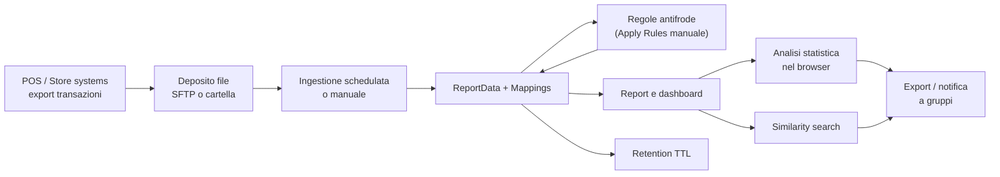
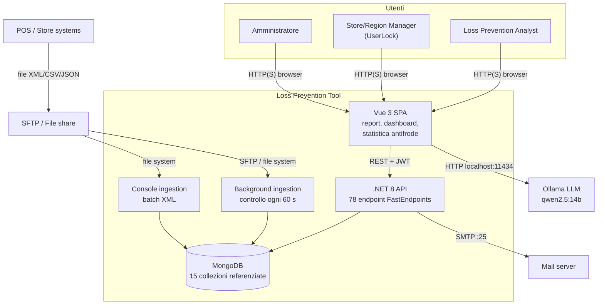

<!-- IMPACT-META
schema: 1
mode: how
step: 01_context
commit: fc7d820908b8b230fb47a2669920ba7efdb413a8
commit_short: fc7d820
branch: main
worktree: dirty
baseline_date: 2026-10-07T18:19:51+02:00
generated_at: 2026-10-08T09:37:27+02:00
-->
# Context - Progetto LOSS_PREVENTION (Loss Prevention Tool)

> **Baseline commit:** `fc7d820` (`main`) · worktree `dirty` (modifiche locali solo in `Docs/` e `.github/`; codice applicativo identico al commit)

**Data**: 2026-10-08  
**Versione**: 1.1  
**Autori**: Reverse engineering IMPACT (analisi statica del codice e della storia Git)  
**Audience**: Stakeholder tecnici e non tecnici, team di sviluppo, management

**Fonti e convenzioni**: path relativi alla root `customspa-it-loss-prevention-d098a8b97860/`; riferimenti `file:riga` al commit baseline. La documentazione del fornitore **non esiste alla baseline**: era presente solo nel commit `593f6de` ed è stata rimossa in `d768cd9`; ogni citazione è storica e verificabile con `git show 593f6de:customspa-it-loss-prevention-d098a8b97860/Docs/<file>`. Le informazioni non ricavabili da codice o storia sono marcate «N/A — non ricavabile dal codice».

---

## 1. Cos'è il Sistema?

Il Loss Prevention Tool è un'applicazione web di analisi per la prevenzione delle perdite nel retail: importa le transazioni di cassa e aiuta gli analisti a scoprire comportamenti anomali o fraudolenti.

### 1.1 Overview

**Elevator pitch (3 frasi)**
1. Il Loss Prevention Tool raccoglie in un unico archivio le transazioni dei punti vendita, ricevute come file XML, CSV o JSON da un server SFTP o da una cartella.
2. Gli analisti costruiscono da soli report e dashboard, applicano regole antifrode e cercano transazioni "simili" a una sospetta.
3. Funzioni assistite da un modello linguistico trasformano domande in linguaggio naturale in query e un'analisi statistica automatica evidenzia le transazioni anomale.

**Descrizione per non tecnici.** Nei negozi ogni scontrino, reso, storno o sconto genera una transazione. Le perdite dovute a frodi interne (ad esempio un cassiere che concede sconti non dovuti a conoscenti) o esterne (resi fittizi, uso anomalo di carte regalo) si nascondono in grandi volumi di dati. Il sistema importa periodicamente questi dati, li rende consultabili con un "report designer" simile a un foglio di calcolo avanzato e segnala le transazioni sospette tramite regole configurabili e statistiche (valori fuori norma rispetto ai colleghi o allo storico).

**Descrizione tecnica sintetica.** Il sistema è composto da una SPA Vue 3 (`LossPrevention.UI`), un'API .NET 8 basata su FastEndpoints con 78 endpoint (`LossPrevention.API`), un servizio in background che esegue l'ingestione schedulata (`DataIngestionBackgroundService`, controllo ogni minuto), una console di ingestione batch XML (`LossPrevention.DataIngestionService`) e un database MongoDB (dump di esempio in `Data/LossPrevention`, server 8.3.2 secondo `prelude.json`). Le funzioni AI usano un LLM Ollama (`qwen2.5:14b`) chiamato **direttamente dal browser** su `http://localhost:11434` (`LossPrevention.UI/src/stores/aiStore.ts:8`, `:88`). Lo stato di maturità è **pre-produzione**: nessun test automatico, nessuna pipeline CI/CD, CORS limitato a `localhost:5173/5174` (`LossPrevention.API/Program.cs:24-29`) e, secondo la roadmap storica del fornitore, dati reali del cliente ancora attesi ("Real world data to test with … - Waiting for Custom", `Docs/roadmap.txt:27` storico).

### 1.2 Dominio Applicativo

**Settore**: Retail — Loss Prevention / Fraud Analytics sulle transazioni POS (resi e rimborsi sospetti, storni/void, sconti eccessivi, *sweethearting*, transazioni fuori orario, frazionamenti, uso anomalo di gift card e carte digitate manualmente; elenco ricavato dai 30 tipi `fraudType` in `aiStore.ts`).  
**Tipo Sistema**: B2B Enterprise — strumento interno di analisi per i team Loss Prevention di un retailer (prodotto del fornitore esterno `customspa-it`, distribuito per cliente; la roadmap storica prevede *branding* e *multi-tenancy* futuri).  
**Criticità**: **Business-critical (supporto decisionale)**, non mission-critical: il sistema non è nel percorso operativo di vendita (le casse funzionano anche se è fermo), ma i suoi risultati possono fondare indagini e provvedimenti disciplinari. Classificazione inferita dal dominio: N/A — non ricavabile dal codice una classificazione formale del cliente.

### 1.3 Acronimi e Nomenclatura

| Acronimo / Termine | Significato | Note (contesto nel sistema) |
|--------------------|-------------|-----------------------------|
| LP | Loss Prevention | Dominio di business: prevenzione delle perdite (differenze inventariali, frodi) |
| POS | Point of Sale | Sistemi di cassa dei negozi che producono i file di transazioni |
| ReportData | Collezione delle transazioni | Collezione MongoDB principale; documenti a schema libero (es. `TransactionID`, `TransactionDateTime`, `TotalAmount`, `LineItem`, `Tender`) |
| Mapping | Metadati di un campo | Alias, tipo dato, visibilità di ogni campo di `ReportData` (collezione `Mappings`, 52 nel dump) |
| Rule / FraudFlags | Regola antifrode server-side | Esito salvato in `ReportData.FraudFlags.<RuleName>` (`RulesService.cs:46-55`) |
| Fraud thresholds | Soglie statistiche | Percentili/moltiplicatori del motore statistico client-side (collezione `FraudDetectionSettings`) |
| Workspace / Tab | Spazio di lavoro dei report | Ogni tab contiene una query e i campi selezionati |
| Distance / Similarity | Analisi di similarità | Distanza euclidea, restituisce le 10 transazioni più vicine (`DistanceDataservice.cs:119`) |
| KNN | K-Nearest Neighbors | Citato nella roadmap storica come da verificare; nel codice esiste solo il top-10 euclideo |
| NLQ | Natural Language Query | Domanda in linguaggio naturale tradotta in query dall'LLM |
| LLM | Large Language Model | Ollama con modello `qwen2.5:14b` (`aiStore.ts:8`) |
| UserLock | Restrizione dati per utente | Campi utente `LockField`/`LockValue` (es. `StoreID = 1083` nel dump); applicata **solo nel browser** (`helpers/fieldLock.ts`) |
| JWT | JSON Web Token | Token di autenticazione, durata 1 h (`appsettings.json` `ExpiryHours: 1`) |
| RBAC / permessi | Role-Based Access Control | 37 permessi `CAN_*` usati dagli endpoint, raggruppati in ruoli (nel dump un solo ruolo `Admin`) |
| SFTP | SSH File Transfer Protocol | Sorgente dei file transazioni (SSH.NET) |
| TTL | Time To Live | Indice MongoDB che elimina le transazioni oltre la retention (180 giorni da configurazione) |
| SPA | Single Page Application | Frontend Vue 3 + Vite |
| PAN | Primary Account Number | Numero di carta di pagamento; nel dump è troncato (prime 6 + ultime 4 cifre) |
| SMTP | Simple Mail Transfer Protocol | Usato solo per l'email di reset password (`PasswordResetService.cs:73`) |
| Sweethearting | Frode interna | Cassiere che favorisce conoscenti con sconti/storni non dovuti |
| Void | Storno | Annullamento di riga o transazione, indicatore tipico di frode |

---

## 2. Scope del Sistema

Questa sezione distingue ciò che il codice alla baseline realizza da ciò che è soltanto dichiarato o pianificato dal fornitore.

### 2.1 Funzionalità Principali (In Scope)

1. **Ingestione dati**: importazione di file XML/CSV/JSON da cartella o SFTP (`IFileProcessingService` ×3, `Program.cs:102-104`), manuale (`POST /api/data-ingestion/run`) o schedulata **giornaliera, settimanale o mensile** (`DataIngestionBackgroundService.cs:129-140`); tracciamento dei file processati (`ProcessedFiles`) e retention automatica con indice TTL. Stato roadmap storica: "DONE, need to test".
2. **Modello dati dinamico**: generazione automatica dei `Mappings` dai campi incontrati e finalizzazione dei tipi (`FileProcessingCoordinator.cs:108-109`).
3. **Report designer self-service**: workspace/tab, selezione campi, raggruppamenti e aggregazioni, condizioni annidate, campi calcolati, formattazione condizionale, heatmap con drill-down, export CSV/XLSX/PDF (eseguiti nel browser); le query sono inviate come pipeline MongoDB a `POST /data/report/query`.
4. **Dashboard**: griglia con grafici, tabelle, testo e immagini (5 endpoint `Dashboard`).
5. **Regole antifrode (server)**: CRUD regole e applicazione massiva **manuale** su tutte le transazioni (`ApplyRulesEndpoint.cs:25`). L'applicazione automatica all'ingestione, dichiarata "DONE, need to test" nella roadmap storica (`Docs/roadmap.txt:31`), **non è presente nel codice**.
6. **Analisi statistica antifrode (client)**: 30 euristiche su percentili/deviazioni, soglie configurabili (3 endpoint `FraudDetection`), eseguite **solo nel browser**; risultati non persistiti.
7. **Similarity search**: top-10 transazioni più simili a una data (euclidea).
8. **Funzioni AI**: NLQ → query e generazione di template di report antifrode via Ollama locale.
9. **Sicurezza e amministrazione**: login JWT, reset password via email, gestione utenti/ruoli/permessi (32 endpoint `User`), UserLock (solo client).
10. **Collaborazione**: gruppi di utenti e notifiche con risposta (`POST /notifications/{id}/reply`), senza push real-time; `GET /notifications` non filtra per destinatario (`ListNotificationsEndpoint.cs:30`).

### 2.2 Fuori Scope (Out of Scope)

Funzionalità assenti nel codice alla baseline; dove indicato, sono previste solo dalla roadmap storica (`Docs/roadmap.txt`, commit `593f6de`).

- **Case management / gestione indagini**: non implementato; roadmap "Case Management Tool - Need design" (`:83`). Responsabile alternativo: N/A — non ricavabile dal codice.
- **Workflow / blueprint e alerting automatico**: nessun motore di workflow o invio di alert; roadmap "Extend Functionality for Alerts and Notifications" (`:66`).
- **Multi-tenancy**: un solo database/configurazione; roadmap "Multi-Tenancy - Simplified Version" (`:68`).
- **SSO / identity provider esterno**: autenticazione solo locale username/password; roadmap "SSO" (`:76`).
- **Lookup tables**: assenti (flag `IsLookup` presente nei mapping ma senza logica); roadmap "Lookup Tables" (`:30`, `:69`).
- **Receipt view** (vista scontrino) e **KNN** completo: roadmap `:86-87`.
- **Audit trail** delle indagini e degli accessi: dichiarato in `Docs/01_EXECUTIVE_OVERVIEW.md` ("Comprehensive Audit Trail", storico) ma assente nel codice.
- **API per sistemi terzi / export verso altri sistemi**: nessun consumer applicativo; l'unica integrazione in uscita è l'email.
- **Machine learning addestrato**: le funzioni "intelligenti" sono euristiche statistiche e prompt LLM, non modelli addestrati.

### 2.3 System Boundaries

Il confine del sistema comprende SPA, API, servizi di ingestione e database; POS, SFTP, SMTP e Ollama sono esterni. Diagramma C4 Level 1 in forma testuale (il diagramma grafico è in [§6](#6-context-diagram)).

```
[Sistema Loss Prevention Tool]
  ↑ Input:
    - Analisti LP, Store/Region Manager, Amministratori (via SPA web, HTTP + JWT)
    - Sistemi POS / back-office negozi (file XML/CSV/JSON depositati su SFTP o cartella)
    - Server SFTP / file share (lettura file, spostamento in processed/failed)
    - Scheduler interno (trigger giornaliero/settimanale/mensile, controllo ogni 60 s)
    - Ollama LLM su localhost:11434 della postazione utente (risposte NLQ, chiamato dal browser)
  ↓ Output:
    - Mail server SMTP (email di reset password)
    - Utenti (report a video, export CSV/XLSX/PDF generati nel browser, dashboard, notifiche interne)
    - Server SFTP (spostamento file processati nella cartella processed/failed)
```

---

## 3. Contesto Organizzativo e Sistemico

Il sistema supporta il processo di individuazione delle perdite dalla raccolta dei dati POS fino alla condivisione dei sospetti; il contesto organizzativo è ricavabile solo in minima parte dal repository.

### 3.1 Processo Business Supportato

**Processo**: Individuazione e analisi delle perdite/frodi sulle transazioni di cassa (Retail Loss Prevention).

**Fasi del processo supportate**:
1. **Raccolta dati**: i sistemi POS esportano le transazioni come file su SFTP o cartella condivisa (fuori sistema).
2. **Ingestione**: importazione schedulata o manuale, normalizzazione dei campi, aggiornamento dei mapping, tracciamento dei file processati.
3. **Classificazione**: applicazione manuale delle regole antifrode (`FraudFlags`) e analisi statistica nel browser.
4. **Analisi**: report, dashboard, heatmap, similarity search, domande in linguaggio naturale.
5. **Condivisione**: export dei risultati e notifiche ai gruppi di utenti.
6. **Retention**: cancellazione automatica delle transazioni oltre la finestra configurata (TTL).



**Criticità Operativa**:
- **Downtime tolerance**: N/A — non ricavabile dal codice: non esistono SLA, health check o configurazioni di alta affidabilità.
- **Business impact downtime**: inferito dall'architettura — gli analisti non possono consultare report né applicare regole; l'ingestione schedulata salta l'esecuzione (`LastRunAt` è tenuto solo in memoria, `DataIngestionBackgroundService.cs:86`) e i file restano sul server SFTP fino al run successivo, quindi non si perdono dati. Le vendite non sono impattate.
- **Peak usage periods**: N/A — non ricavabile dal codice: nessun dato di utilizzo; la schedulazione configurata nel dump è l'unico indizio sui carichi batch.
- **Vincoli temporali rilevanti**: sessione JWT di 1 h senza refresh token; job di ingestione controllato ogni minuto (`DataIngestionBackgroundService.cs:13`).

### 3.2 Landscape Sistemico

#### Sistemi Upstream (Data Providers)

| Sistema | Dati Forniti | Protocollo | Frequenza | Criticità |
|---------|--------------|------------|-----------|-----------|
| Sistemi POS / back-office dei negozi | Transazioni (testata, righe `LineItem`, pagamenti `Tender`, operatore, negozio, registratore) | File XML/CSV/JSON (formato non vincolato: il converter appiattisce qualsiasi struttura) | Secondo schedulazione: giornaliera / settimanale / mensile, o manuale | High (unica fonte dati) |
| Server SFTP | File da importare; cartelle `processed`/`failed` (`SftpFileProcessingService.cs:33-34`) | SFTP (SSH.NET, autenticazione password, nessuna verifica host key) | Come sopra | High |
| File share / cartella locale | File da importare (`Directory.GetFiles`, `FileProcessingCoordinator.cs:153`; console batch su `C:\xmlstore5\xml`, `DataIngestionService/Program.cs:76`) | File system | Come sopra / esecuzione manuale della console | Medium (alternativa a SFTP) |

#### Sistemi Downstream (Data Consumers)

| Sistema | Dati Ricevuti | Protocollo | Frequenza | Criticità |
|---------|---------------|------------|-----------|-----------|
| Nessun sistema applicativo | — | — | — | Nessuna API o export automatico verso altri sistemi |
| Utenti finali (fuori sistema) | Export CSV/XLSX/PDF generati nel browser | Download file | On demand | Low |
| Server SFTP | Spostamento dei file elaborati in `processed`/`failed` | SFTP | A ogni ingestione | Low |

#### Sistemi Integrati (Peer-to-Peer)

| Sistema | Tipo Integrazione | Protocollo | SLA | Owner |
|---------|-------------------|------------|-----|-------|
| Ollama LLM (`qwen2.5:14b`) | NLQ e generazione report, chiamato dal browser | HTTP REST `localhost:11434` | N/A — non ricavabile (servizio locale sulla postazione utente) | Utente / IT del cliente (N/A — non ricavabile dal codice) |
| Mail server SMTP | Invio email di reset password | SMTP `localhost:25`, `EnableSsl = false` (`EmailService.cs:63-65`) | N/A — non ricavabile dal codice | IT del cliente (N/A — non ricavabile dal codice) |
| MongoDB | Persistenza di tutte le collezioni (15 referenziate dal codice) | MongoDB wire protocol (`mongodb://localhost:27017`) | N/A — non ricavabile (nessun deployment definito) | N/A — da definire (roadmap: Atlas, Cosmos DB Mongo API o infrastruttura del cliente) |

### 3.3 Contesto Organizzativo

**Ownership**:
- **Business Owner**: N/A — non ricavabile dal codice (il cliente finale non è nominato; la roadmap storica lo indica come "Custom"/"Customer").
- **Product Owner**: N/A — non ricavabile dal codice.
- **Technical Owner**: fornitore esterno identificato dal nome della cartella `customspa-it-loss-prevention-*` (inferenza); nessun file `CODEOWNERS`.

**Governance**:
- **Steering Committee**: N/A — non ricavabile dal codice.
- **Change Approval**: nessun processo tracciato nel repository: un solo branch (`main`), nessuna pull request, commit diretti; la roadmap storica prevede "Branching Strategy" e "DevOps" tra le attività a 3-6 mesi.
- **Budget**: N/A — non ricavabile dal codice.

**Team Structure**:
- **Development Team**: N/A — non ricavabile dal codice. La storia Git (13 commit, un solo autore `saristot`, codice importato in blocco nel commit `593f6de` del 2026-10-05) non rappresenta il team di sviluppo originale del fornitore.
- **Operations Team**: N/A — non ricavabile dal codice (nessuna infrastruttura come codice, runbook o monitoraggio).
- **Support Team**: N/A — non ricavabile dal codice; la documentazione storica (`Docs/01_EXECUTIVE_OVERVIEW.md`, sezione "Licensing & Support") cita "Professional services", "Training" e "Ongoing support and maintenance" del fornitore.

---

## 4. Utenti del Sistema

Gli utenti sono ricavati dai permessi `CAN_*` (37 usati dagli endpoint), dalle schermate della SPA e dagli utenti del dump; numeri e abitudini d'uso reali non sono ricavabili dal repository.

### 4.1 Utenti Primari

#### Utente Tipo 1: Loss Prevention Analyst

| Attributo | Valore |
|-----------|--------|
| **Numero utenti** | N/A — non ricavabile dal codice (il dump contiene solo 2 utenti di test: `admin` e `lockeddownuser`) |
| **Frequenza uso** | N/A — non ricavabile dal codice; inferenza: uso quotidiano/periodico dopo ogni ingestione |
| **Competenza tecnica** | Medium-High (costruisce query con condizioni annidate, campi calcolati, aggregazioni) |
| **Dispositivi** | Desktop (layout pensato per schermi ampi: un solo `@media` in tutta la SPA, `home.vue:423`) |
| **Location** | N/A — non ricavabile dal codice; vincolo tecnico: le funzioni AI richiedono Ollama sulla propria postazione |
| **Lingua UI** | Inglese (`index.html` `lang="en"`, etichette dei componenti in inglese) |
| **Permessi tipici** | `CAN_VIEW_REPORT`, `CAN_VIEW_WORKSPACES`, `CAN_MANAGE_WORKSPACES`, `CAN_VIEW_DASHBOARD`, `CAN_VIEW_RULE`, `CAN_APPLY_RULE`, `CAN_VIEW_FRAUD_SETTINGS` |

**Obiettivi Principali**:
1. Individuare transazioni, operatori e negozi sospetti senza estrazioni manuali.
2. Approfondire un caso trovando transazioni simili (similarity top-10) e filtrando per `FraudFlags`.
3. Produrre report ed export (CSV/XLSX/PDF) e condividerli con i gruppi tramite notifiche.

**Pain Points da Evitare** (osservati nel codice):
- Perdita dei risultati dell'analisi statistica a fine sessione (calcolo e risultati solo nel browser).
- Lentezza su dataset grandi: l'analisi statistica è eseguita nel browser; `ApplyRulesAsync` carica tutta `ReportData` in memoria; cache report di 1 h non invalidata dopo nuove ingestioni (`GetReportDataEndpoint.cs:81`), quindi dati potenzialmente non aggiornati.
- Sessione che scade dopo 1 h senza rinnovo automatico.
- Funzioni AI non disponibili se Ollama non è installato in locale.

**User Journey Tipico**:
```
1. Login (username/password, JWT 1 h) → 2. Apre un Workspace e una tab di report →
3. Seleziona campi, filtri e raggruppamenti (o pone una domanda in linguaggio naturale) →
4. Lancia l'analisi statistica antifrode / filtra per FraudFlags → 5. Apre una transazione e cerca quelle simili →
6. Esporta il risultato o invia una notifica a un gruppo
```

---

#### Utente Tipo 2: Store/Region Manager (utente con UserLock)

| Attributo | Valore |
|-----------|--------|
| **Numero utenti** | N/A — non ricavabile dal codice (nel dump 1 utente di esempio, `lockeddownuser`, con `LockField = StoreID`, `LockValue = 1083`) |
| **Frequenza uso** | N/A — non ricavabile dal codice |
| **Competenza tecnica** | Low-Medium (consulta dashboard e report predisposti) |
| **Dispositivi** | Desktop |
| **Location** | N/A — non ricavabile dal codice (inferenza: negozio o sede regionale) |

**Obiettivi Principali**:
1. Consultare indicatori e transazioni sospette del proprio negozio/regione.
2. Ricevere e rispondere alle notifiche del team LP.

**Pain Points da Evitare**:
- **Restrizione dei dati solo apparente**: il filtro `LockField/LockValue` è applicato nel browser (`helpers/fieldLock.ts`); chiamando direttamente l'API l'utente può leggere i dati di tutti i negozi.
- Il campo di blocco del dump (`StoreID`) non compare nelle transazioni di esempio, che usano `LocationID`: con questi dati il filtro non restituirebbe risultati coerenti.

**User Journey Tipico**:
```
1. Login → 2. Apre la dashboard assegnata → 3. Consulta report filtrati sul proprio negozio →
4. Legge le notifiche e risponde al team LP
```

---

### 4.2 Utenti Secondari

- **Amministratore applicativo**: gestisce utenti, ruoli e permessi (32 endpoint `User`), gruppi, mapping dei campi, regole antifrode, configurazione e schedulazione dell'ingestione, soglie statistiche antifrode. Nel dump esiste un solo ruolo, `Admin`, con tutti i 37 permessi.
- **Amministratore IT**: installa e configura MongoDB, API, SMTP, SFTP e Ollama sulle postazioni; esegue gli script di seed `Data/MongoDBScripts/00..04_*.js`. Nessun runbook è presente alla baseline.
- **Management / Responsabile LP**: fruitore di dashboard e report; il sistema non offre KPI di efficacia antifrode (il "ROI Tracking" dichiarato nella documentazione storica non è implementato).

### 4.3 External Actors

- **Sistemi esterni**: POS/back-office (tramite file), server SFTP, mail server SMTP, runtime Ollama.
- **Attore temporale**: `DataIngestionBackgroundService` (controllo ogni 60 s, trigger giornaliero/settimanale/mensile).
- **Destinatari email**: utenti che richiedono il reset password (unica email inviata dal sistema).
- **API consumer esterni**: nessuno (tutti gli endpoint, tranne 4 anonimi di login/reset, richiedono JWT e permessi).

---

## 5. Motivazione e Valore

La motivazione è dichiarata solo nella documentazione storica del fornitore; il codice permette di verificare cosa è realmente realizzato, non i benefici economici.

### 5.1 Business Drivers

**Problema Risolto**: centralizzare dati POS eterogenei (formati e schemi diversi per catena o negozio) e dare ai team LP strumenti self-service per individuare perdite e frodi senza dipendere dall'IT per ogni estrazione. Il modello a schema libero (MongoDB + `Mappings` generati automaticamente) è la risposta tecnica alla variabilità dei formati.

**Metriche del problema**: N/A — non ricavabile dal codice: il repository non contiene dati sulla situazione precedente (perdite, tempi di indagine, volumi).

**Valore Aggiunto (ROI) dichiarato dal fornitore** — fonte storica: `Docs/01_EXECUTIVE_OVERVIEW.md`, sezione "Success Metrics" (righe 178-185; presente solo nel commit `593f6de`, rimosso in `d768cd9`; `git show 593f6de:customspa-it-loss-prevention-d098a8b97860/Docs/01_EXECUTIVE_OVERVIEW.md`):

| KPI dichiarato | Target del fornitore | Verificabilità nel codice |
|----------------|---------------------|---------------------------|
| Perdite legate a frodi | −30-50% | Non verificabile: nessun dato di baseline né misurazione |
| Tempo di indagine | −70% | Non verificabile: nessun case management né tracciamento tempi |
| Tempo di reportistica manuale | −60% | Plausibile (report designer self-service presente), non misurato |
| Soddisfazione utenti self-service | 90% | Non verificabile |
| ROI | 6-12 mesi | Non verificabile: nessun dato economico |

Queste metriche sono **affermazioni commerciali**: non esistono nel repository dati, test o benchmark a supporto e la roadmap storica indica che il prodotto non è stato ancora provato su dati reali (`Docs/roadmap.txt:27`). Alcuni benefici dichiarati nella stessa fonte (sezione "Business Value": "Comprehensive Audit Trail", "Audit logs … meet regulatory requirements", "Identify suspicious transactions in real-time") **non trovano riscontro nel codice**. La verifica puntuale è in [02_functional_overview.md](02_functional_overview.md), sezione «Verifica funzionalità dichiarate dal fornitore».

**Alternative Considerate**: N/A — non ricavabile dal codice: nessun documento di scelta. Alternative di mercato tipiche, indicate come riferimento per la valutazione (non documentate dal fornitore): suite commerciali di loss prevention/exception-based reporting per retail; BI generiche (Power BI, Qlik) con regole SQL su un data warehouse. Il valore distintivo dichiarato è la combinazione di schema dinamico, antifrode configurabile e AI.

### 5.2 Technical Drivers

**Modernizzazione Tecnologica**:
- .NET 8 LTS termina il supporto il **10-11-2026**: migrazione a .NET 10 LTS necessaria a breve.
- Dipendenze frontend da aggiornare/rimuovere: 71 vulnerabilità npm (6 critical, 46 high), `xlsx@0.18.5` senza fix, pacchetti Nuxt/jsPDF non usati; lockfile non sincronizzato (`npm ci` fallisce).

**Scalability Requirements**:
- La documentazione storica indica tra le attività "in sviluppo" l'ottimizzazione per dataset grandi (`Docs/01_EXECUTIVE_OVERVIEW.md`, sezione "Current Status (As of February 2026)") e la roadmap prevede possibili ottimizzazioni "of the back of" dati reali (`Docs/roadmap.txt:27`).
- Retention per contenere i volumi: roadmap "We should look at TTL for expiring documents (after say 3 months)" (`Docs/roadmap.txt:39`); il codice imposta 180 giorni (`appsettings.json` `TransactionRetentionDays`), con indice TTL sul campo `BeginDateTime` (`DatabaseInitializationService.cs:97`) assente nei dati di esempio.
- Crescita attesa di utenti/negozi: N/A — non ricavabile dal codice.

**Integration Needs**:
- Ingestione da SFTP/file system per formati XML/CSV/JSON (realizzata).
- SSO e multi-tenancy (pianificati, roadmap `:68`, `:76`).
- Deployment cloud proposto: Azure Functions, Cosmos DB Mongo API (vCore) o MongoDB Atlas, oppure infrastruttura del cliente; ambienti separati Sales/UAT/Production (`Docs/roadmap.txt:51-56`) — nessuna di queste opzioni è implementata nel repository.

### 5.3 Compliance e Regulatory Drivers

**Normative Applicabili** (identificate dall'analisi in base ai dati trattati; nessun riferimento normativo nel codice):

| Normativa | Rilevanza per il sistema | Stato nel codice alla baseline |
|-----------|--------------------------|--------------------------------|
| **GDPR (Reg. UE 2016/679)** | Dati personali di dipendenti (operatori di cassa) e clienti; profilazione comportamentale | Assenti audit log, minimizzazione, controllo accessi server-side ai dati (UserLock solo client), gestione della retention efficace; hash password esposti da `GET /users` (`GetUsersEndpoint.cs:36`) |
| **Statuto dei Lavoratori, L. 300/1970 art. 4** (Italia, come modificato dal D.Lgs. 151/2015) | Strumenti da cui deriva il controllo a distanza dell'attività dei lavoratori | Richiede accordo sindacale o autorizzazione dell'Ispettorato e informativa ai dipendenti; nessun supporto nel sistema (es. tracciamento delle finalità) |
| **PCI DSS** | Se i file POS contengono dati di carta | Nel dump `CardNumber` è troncato (6+4 cifre); nessun controllo applicativo impedisce l'import di PAN completi né cifra i dati |
| **AI Act (Reg. UE 2024/1689)** | Sistemi AI usati per monitorare e valutare il comportamento dei lavoratori rientrano tra i casi ad alto rischio (Allegato III) | Funzioni AI senza governance, log o supervisione documentata; LLM eseguito sulla postazione utente |

**Impact Compliance** (in caso di non conformità):
- Sanzioni GDPR fino a 20 M€ o al 4% del fatturato mondiale annuo.
- Inutilizzabilità delle evidenze raccolte in violazione dell'art. 4 dello Statuto dei Lavoratori in procedimenti disciplinari o giudiziari, con rischio di contenzioso.
- Data breach: l'esecuzione di pipeline MongoDB arbitrarie (`GetReportDataEndpoint.cs:68`) e il segreto JWT versionato in `appsettings.json` espongono a letture/scritture non autorizzate.
- Impossibilità di andare in produzione presso clienti soggetti ad audit (assenza di audit trail).

---

## 6. Context Diagram

Il diagramma C4 Level 1 mostra il sistema, i suoi utenti e i sistemi esterni con cui scambia dati.



Nota: `BG` è ospitato nel processo dell'API (`AddHostedService`); `JOB` è un eseguibile separato (`LossPrevention.DataIngestionService`). L'LLM non è un servizio centrale: è chiamato dal browser di ogni utente.

---

## 7. Considerazioni Finali

Il sistema è un prodotto funzionalmente ricco ma in stato pre-produzione; prima dell'uso con dati reali servono interventi di sicurezza, build e validazione.

### 7.1 Punti di Attenzione

- **Maturità**: nessun test automatico, nessuna CI/CD, nessun hardening (CORS solo localhost, nessun HTTPS redirection/HSTS in `Program.cs`), build frontend non riproducibile (`npm ci` fallisce; 12 import con maiuscole/minuscole errate rompono la build su file system case-sensitive).
- **Divario dichiarato vs realizzato**: audit trail, field-level access control, applicazione automatica delle regole in ingestione e "Nuxt 3 SSR" (`README.md:31`) non trovano riscontro nel codice; il README dichiara 41 permessi, gli endpoint ne usano 37.
- **Dipendenza da LLM locale**: le funzioni AI richiedono Ollama e `qwen2.5:14b` su ogni postazione.
- **Sicurezza dei dati**: pipeline MongoDB arbitrarie dal client, row-level security solo nel browser, hash password esposti, segreti e dump con dati versionati.
- **Dati reali non ancora disponibili** (roadmap storica): rischio di rework su mapping, performance e regole; i dati di esempio non contengono i campi usati da TTL (`BeginDateTime`) e UserLock (`StoreID`).
- **Piattaforma**: .NET 8 a fine supporto il 10-11-2026.
- **Contesto organizzativo non documentato**: owner, governance, SLA e team sono N/A nel repository e vanno raccolti con il cliente/fornitore.

### 7.2 Success Criteria

**KPI di Progetto** (proposti dall'analisi; date e budget non ricavabili dal codice):
1. **Go-Live entro**: N/A — non ricavabile dal codice (nessuna pianificazione nel repository); prerequisito minimo: migrazione a .NET 10 prima del 10-11-2026 o accettazione formale del rischio.
2. **Budget rispettato**: N/A — non ricavabile dal codice; stima dell'effort in [19_modernization_estimation_spec.md](19_modernization_estimation_spec.md).
3. **User Adoption**: ≥ 80% degli utenti LP abilitati che esegue almeno un report a settimana dopo 3 mesi (misurabile solo dopo l'introduzione di log di utilizzo, oggi assenti).
4. **Performance**: P95 di `POST /data/report/query` < 3 s su 1 milione di transazioni; applicazione regole su 1 milione di transazioni < 10 min.
5. **Quality**: 0 vulnerabilità critical/high aperte (oggi 6 critical + 46 high npm) e copertura test ≥ 60% sui servizi Application (oggi 0%) prima del go-live; < 10 bug critici nei 6 mesi successivi.
6. **Sicurezza dati**: filtro UserLock e controllo delle pipeline applicati lato server, verificati da test automatici.
7. **Validazione**: almeno 3 dataset reali del cliente importati e analizzati con esiti confermati dal team LP.

---

## 8. Reference Documents

Documenti IMPACT del set (stessa cartella `Docs/`), documentazione storica del fornitore e riferimenti normativi.

**Documenti IMPACT**

| Documento | Contenuto |
|-----------|-----------|
| [00_deep_dive.md](00_deep_dive.md) | Deep Dive Analysis: inventario tecnico, metriche, criticità |
| [01_context.md](01_context.md) | Questo documento |
| [02_functional_overview.md](02_functional_overview.md) | Funzionalità, use case, verifica dei claim del fornitore |
| [03_non_functional_overview.md](03_non_functional_overview.md) | Requisiti non funzionali |
| [04_constraints.md](04_constraints.md) | Vincoli |
| [05_principles.md](05_principles.md) | Principi architetturali |
| [06_software_architecture.md](06_software_architecture.md) | Architettura software |
| [07_code.md](07_code.md) | Struttura del codice |
| [08_data.md](08_data.md) | Modello dati MongoDB |
| [09_infrastructure_architecture.md](09_infrastructure_architecture.md) | Architettura infrastrutturale |
| [10_deployment.md](10_deployment.md) | Deployment |
| [11_development_environment.md](11_development_environment.md) | Ambiente di sviluppo |
| [12_operation_and_support.md](12_operation_and_support.md) | Esercizio e supporto |
| [13_decision_log.md](13_decision_log.md) | Decision log |
| [14_metrics.md](14_metrics.md) | Metriche |
| [15_fp_cocomo.md](15_fp_cocomo.md) | Function Point e COCOMO |
| [16_frontend_deep_assessment.md](16_frontend_deep_assessment.md) | Assessment frontend |
| [17_backend_deep_assessment.md](17_backend_deep_assessment.md) | Assessment backend |
| [18_antipattern_deep_dive.md](18_antipattern_deep_dive.md) | Anti-pattern |
| [19_modernization_estimation_spec.md](19_modernization_estimation_spec.md) | Stima di modernizzazione |

**Documentazione storica del fornitore** (presente solo nel commit `593f6de`, rimossa in `d768cd9`; consultabile con `git show 593f6de:customspa-it-loss-prevention-d098a8b97860/Docs/<file>`):
- `Docs/01_EXECUTIVE_OVERVIEW.md` — Business Value, Current Status, Success Metrics.
- `Docs/roadmap.txt` — stato delle feature, attività residue, deployment suggerito, roadmap 3-6 mesi.
- `Docs/04_DEPLOYMENT_GUIDE.md`, `Docs/11_USER_MANUAL.md` — opzioni di deployment e manuale utente.
- Inventario completo dei 17 file in [00_deep_dive.md](00_deep_dive.md), sezione «Documentation Inventory».

**Altri riferimenti richiesti dal template**:
- **Business Requirements**: N/A — non ricavabile dal codice (nessun documento di requisiti nel repository).
- **User Research**: N/A — non ricavabile dal codice (nessuna intervista o persona documentata).
- **Competitive Analysis**: N/A — non ricavabile dal codice (vedi §5.1, «Alternative Considerate»).

**Regulatory References**:
- GDPR — Regolamento (UE) 2016/679: https://eur-lex.europa.eu/eli/reg/2016/679/oj
- AI Act — Regolamento (UE) 2024/1689: https://eur-lex.europa.eu/eli/reg/2024/1689/oj
- Statuto dei Lavoratori — Legge 20 maggio 1970, n. 300, art. 4 (testo vigente su https://www.normattiva.it)
- PCI DSS — PCI Security Standards Council: https://www.pcisecuritystandards.org

---

## Change Log

| Versione | Data | Autore | Modifiche |
|----------|------|--------|-----------|
| 1.0 | 2026-10-07 | REVERSE how (FULL) | Creazione documento (sostituisce run 2026-10-05) |
| 1.1 | 2026-10-08 | IMPACT verify | Header `worktree: dirty`; documenti fornitore citati come storici (`593f6de`→`d768cd9`) con comando `git show`; aggiunti Settore/Tipo Sistema/Criticità, acronimi a 3 colonne, funzionalità numerate con evidenze (schedulazione anche mensile, regole solo manuali), out of scope motivato, boundary Input/Output, fasi e criticità operativa, tabelle upstream/downstream/peer, ownership/governance/team (N/A motivati), tabelle attributi e journey per utente, KPI fornitore con verificabilità, technical drivers (TTL "after say 3 months" vs 180 giorni, .NET 8 EOL), impatto compliance, success criteria misurabili, Reference Documents completi (00-19, storici, normativi) |
