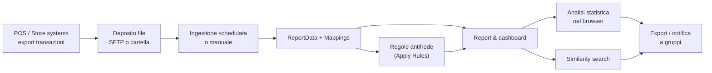
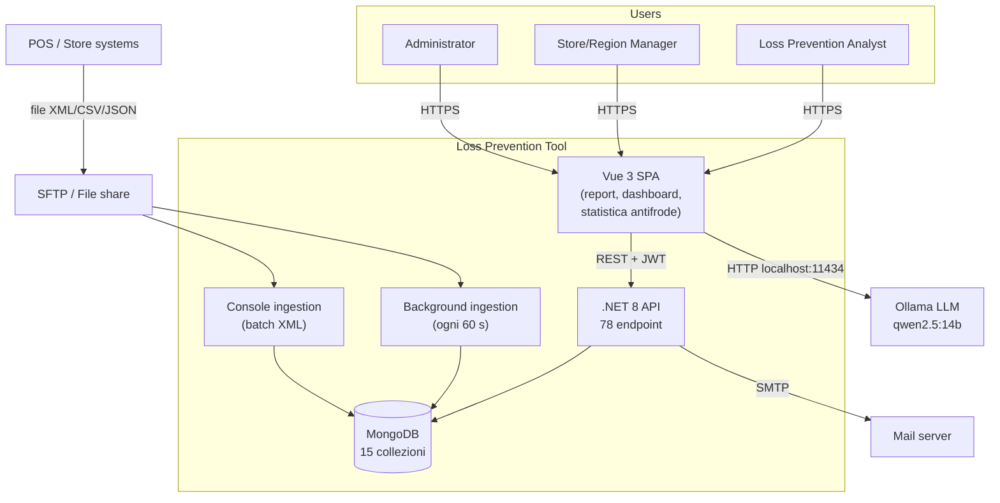

<!-- REVERSE-META
schema: 1
mode: how
step: 01_context
commit: 593f6decec3a642d5567754dd795b19560bb0afb
commit_short: 593f6de
branch: main
worktree: clean
baseline_date: 2026-10-05T10:14:05+00:00
generated_at: 2026-10-07T14:40:00Z
-->
# Context - Progetto LOSS_PREVENTION (Loss Prevention Tool)

> **Baseline commit:** `593f6de` (`main`) · worktree `clean`

**Data**: 2026-10-07 · **Versione**: 1.0 · **Autori**: Reverse engineering (analisi statica del codice) · **Audience**: stakeholder business e tecnici

---

## 1. Cos'è il Sistema?

### 1.1 Overview (elevator pitch)

1. Il Loss Prevention Tool raccoglie le transazioni dei punti vendita (file XML, CSV o JSON da SFTP o cartella) in un unico archivio.
2. Permette agli analisti di costruire report e dashboard self-service, applicare regole antifrode e cercare transazioni "simili" a una sospetta.
3. Offre funzioni assistite da un modello linguistico (domande in linguaggio naturale → query) e un'analisi statistica automatica che evidenzia le transazioni anomale.

### 1.2 Dominio Applicativo

**Retail Loss Prevention / Fraud Analytics**: individuazione di comportamenti anomali di cassieri, clienti e punti vendita (resi e rimborsi sospetti, storni/void, sconti eccessivi, "sweethearting", transazioni fuori orario, frazionamenti, uso anomalo di gift card e carte digitate manualmente).

### 1.3 Acronimi e Nomenclatura

| Termine | Significato nel codice |
|---------|------------------------|
| ReportData | Collezione Mongo delle transazioni importate |
| Mapping | Metadati di un campo di `ReportData` (alias, tipo, visibilità) |
| Rule / FraudFlags | Regola server-side; risultato salvato in `ReportData.FraudFlags.<RuleName>` |
| Fraud thresholds | Parametri statistici (percentili, moltiplicatori) usati dal motore client-side |
| Workspace / Tab | Contenitore di report; ogni tab è una query + campi selezionati |
| Distance | Analisi di similarità euclidea tra transazioni |
| NLQ | Natural Language Query via LLM |
| UserLock | `LockField`/`LockValue` dell'utente: restrizione dei dati visibili |
| Sweethearting | Cassiere che favorisce conoscenti (sconti/void non dovuti) |

---

## 2. Scope del Sistema

### 2.1 Funzionalità Principali (In Scope, verificate nel codice)

| Area | Funzionalità | Stato nel codice |
|------|-------------|------------------|
| Data ingestion | XML/CSV/JSON da file system o SFTP, schedulazione giornaliera/settimanale, tracciamento file processati, retention TTL | Implementata (roadmap: "DONE, need to test") |
| Data model dinamico | Generazione automatica `Mappings` + finalizzazione tipi | Implementata |
| Report designer | Workspace/tab, selezione campi, group-by/aggregazioni, condizioni annidate, campi calcolati (expression), prefix/suffix, conditional formatting, heatmap con drill-down, export CSV/XLSX/PDF | Implementata (client) |
| Dashboard | Grid layout con chart, tabelle, testo, immagini | Implementata |
| Fraud – rule engine | CRUD regole + applicazione massiva manuale | Implementata (semplice) |
| Fraud – statistica | 30 euristiche su percentili/σ, configurabili | Implementata **solo nel browser** |
| Similarity | Top-10 transazioni più vicine (euclidea) | Implementata |
| AI | NLQ → query; generazione template di report antifrode | Implementata, dipende da Ollama locale |
| Sicurezza | Login JWT, reset password via email, utenti/ruoli/permessi, UserLock | Implementata (UserLock solo client) |
| Collaborazione | Gruppi, notifiche con risposta | Implementata (no real-time, no filtro per destinatario) |

### 2.2 Fuori Scope (Out of Scope, assenti nel codice)

Case management/investigazioni, workflow/blueprint, multi-tenancy, SSO, receipt view, lookup tables effettive, audit trail, alerting automatico, ML addestrato, API per sistemi terzi (oltre al caricamento file).

### 2.3 System Boundaries

- **Dentro**: SPA Vue, API .NET, background ingestion, console di ingestione, database MongoDB.
- **Fuori**: sistemi POS che producono i file, server SFTP, SMTP, runtime LLM Ollama (installato separatamente sulla macchina dell'utente).

---

## 3. Contesto Organizzativo e Sistemico

### 3.1 Processo Business Supportato

### 3.2 Landscape Sistemico

#### Sistemi Upstream (Data Providers)
- Sistemi POS/back-office dei negozi (formato non vincolato: il converter appiattisce qualsiasi XML; nei dati di esempio campi come `TransactionDateTime`, `TotalAmount`, `TransactionType`, `LineItem.*`, `Tender.*`, `EntryMethod`).
- Server SFTP o share di rete.

#### Sistemi Downstream (Data Consumers)
- Nessuno via API. Output verso utenti: export CSV/XLSX/PDF, email (solo reset password).

#### Sistemi Integrati (Peer-to-Peer)
- Ollama (LLM) — chiamato dal browser.
- SMTP — invio email di reset.

### 3.3 Contesto Organizzativo

Fornitore: team esterno (dominio `customspa-it` nel nome cartella; Docs firmati "Loss Prevention System"). La roadmap prevede deploy su Azure o su infrastruttura del cliente; ambienti separati Sales/UAT/Production sono solo proposti. Lo stato "Waiting for Custom[er]" sui dati reali indica che il prodotto **non è ancora stato validato su dati di produzione**.

---

## 4. Utenti del Sistema

### 4.1 Utenti Primari

#### Utente Tipo 1: Loss Prevention Analyst
- **Obiettivi**: individuare transazioni e dipendenti sospetti, produrre report per store/regione.
- **Funzioni usate**: workspace/report, fraud analysis, distance, NLQ, export, dashboard.
- **Permessi tipici**: `CAN_VIEW_REPORT`, `CAN_MANAGE_WORKSPACES`, `CAN_VIEW_DASHBOARD`, `CAN_VIEW_RULE`, `CAN_APPLY_RULE`.
- **Pain point risolti**: niente più estrazioni manuali/Excel.
- **Pain point aperti**: risultati dell'analisi statistica persi a fine sessione; tempi lunghi su dataset grandi (analisi pagina per pagina nel browser).

#### Utente Tipo 2: Store/Region Manager (utente "bloccato")
- Vede solo i dati del proprio negozio/regione tramite `LockField/LockValue`. **Nota**: la restrizione è applicata solo nell'interfaccia.

### 4.2 Utenti Secondari
- **Amministratore applicativo**: utenti, ruoli, permessi, gruppi, mapping, regole, configurazione ingestione e soglie antifrode.
- **Amministratore IT**: installazione MongoDB, API, Ollama, SMTP.

### 4.3 External Actors
- Server SFTP (sistema), SMTP (sistema), Ollama (sistema), job schedulato interno (tempo).

---

## 5. Motivazione e Valore

### 5.1 Business Drivers

**Problema risolto**: centralizzare dati POS eterogenei e fornire strumenti self-service per scoprire perdite e frodi senza dipendere dall'IT.

**Valore dichiarato dal fornitore** (`Docs/01_EXECUTIVE_OVERVIEW.md` → "Success Metrics"): riduzione perdite 30-50%, indagini 70% più rapide, ROI 6-12 mesi. **Non verificabile**: non esistono nel repository dati, test o benchmark a supporto; il prodotto non risulta ancora testato su dati reali (`roadmap.txt`). Vanno trattati come affermazioni commerciali.

**Alternative di mercato** (non documentate nel repository): suite di loss prevention commerciali o BI generiche (Power BI/Qlik) + regole SQL. Il valore distintivo dichiarato è la combinazione di schema dinamico + antifrode + AI.

### 5.2 Technical Drivers
- Ingestione di formati POS non standardizzati (schema-less MongoDB).
- Volumi crescenti: la roadmap stessa indica la necessità di ottimizzare per dataset grandi e prevede TTL 3-6 mesi.
- Deploy cloud (Azure) e multi-tenant pianificati.

### 5.3 Compliance e Regulatory Drivers

| Normativa | Rilevanza | Stato |
|-----------|-----------|-------|
| GDPR (Reg. UE 2016/679) | Dati di dipendenti e clienti, profilazione comportamentale | Mancano audit log, data minimization, gestione accessi lato server |
| Statuto dei Lavoratori art. 4 (IT) | Controllo a distanza dell'attività dei dipendenti | Richiede accordo sindacale/autorizzazione e informativa |
| PCI-DSS | Se i file contengono dati carta | Nel dump i PAN sono troncati (6+4); nessun mascheramento/cifratura applicativa |
| AI Act (Reg. UE 2024/1689) | Uso di AI per valutare lavoratori può rientrare nei casi ad alto rischio | Nessuna governance AI |

**Impatto non-compliance**: sanzioni GDPR fino a 20 M€ o 4% del fatturato; inutilizzabilità probatoria delle evidenze raccolte.

---

## 6. Context Diagram

---

## 7. Considerazioni Finali

### 7.1 Punti di Attenzione
- **Maturità**: prodotto pre-produzione (nessun test, CI/CD, hardening; CORS solo localhost).
- **Divario dichiarato vs realizzato** sulle funzioni "intelligenti" (vedi 02 §6).
- **Dipendenza da LLM locale** per le funzioni AI.
- **Sicurezza dei dati**: row-level security e query arbitrarie da correggere prima di qualsiasi uso con dati reali.

### 7.2 Success Criteria (proposti)
1. Zero vulnerabilità critiche/alte aperte prima del go-live.
2. Motore antifrode eseguito e persistito lato server, con audit.
3. P95 query report < 3 s su 1 M transazioni.
4. Copertura test ≥ 60% sui servizi Application.
5. Validazione su almeno 3 dataset reali del cliente.

---

## 8. Reference Documents
- 00_deep_dive.md
- Docs fornitore: `Docs/01_EXECUTIVE_OVERVIEW.md`, `Docs/roadmap.txt`

## Change Log

| Versione | Data | Autore | Modifiche |
|----------|------|--------|-----------|
| 1.0 | 2026-10-07 | REVERSE how (FULL) | Creazione documento (sostituisce run 2026-10-05) |
