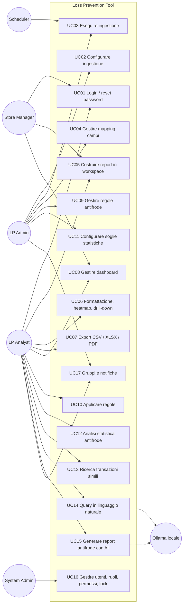
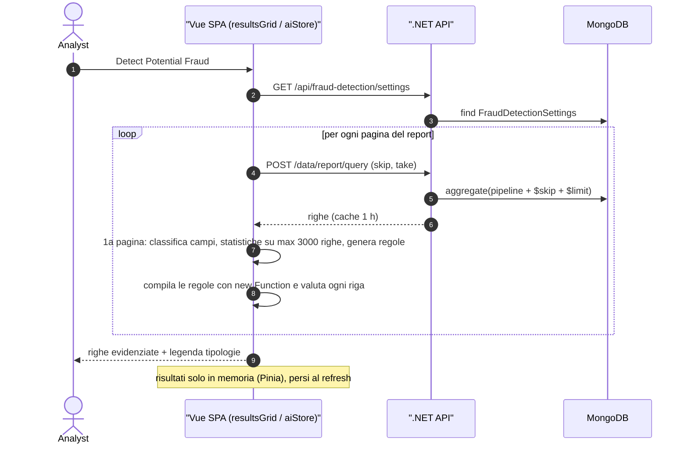
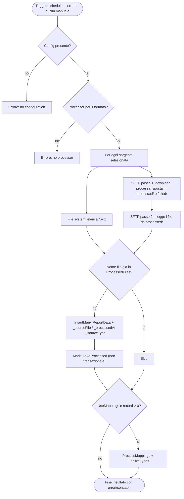
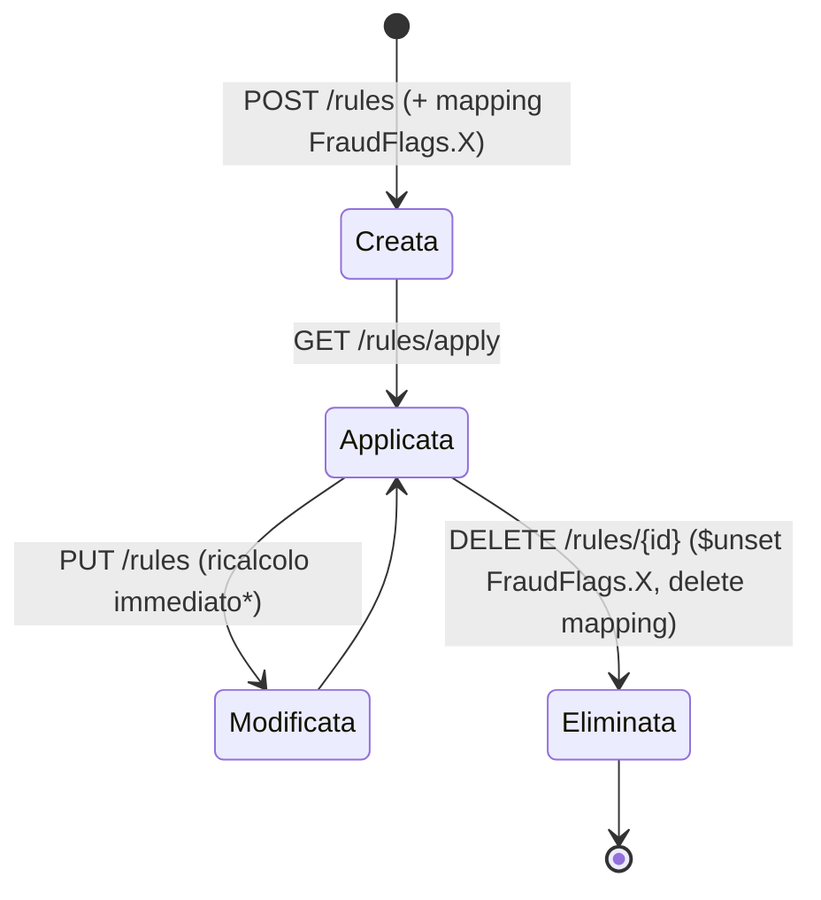
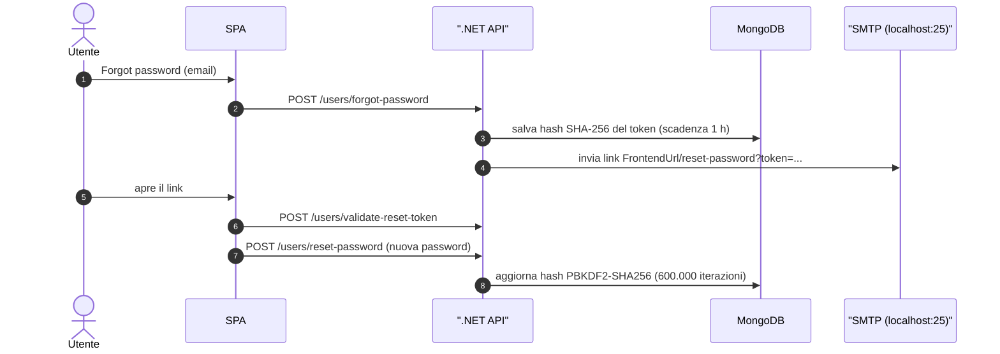
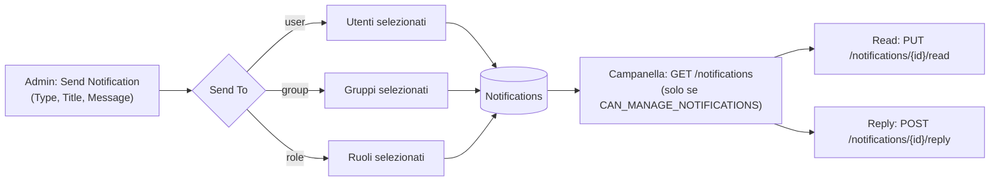
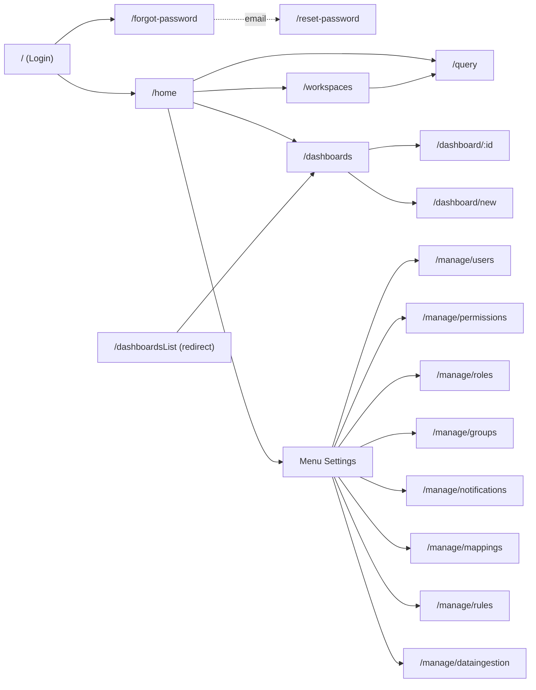

<!-- IMPACT-META
schema: 1
mode: how
step: 02_functional_overview
commit: fc7d820908b8b230fb47a2669920ba7efdb413a8
commit_short: fc7d820
branch: main
worktree: dirty
baseline_date: 2026-10-07T18:19:51+02:00
generated_at: 2026-10-08T09:38:00+02:00
-->
# Functional Overview - Progetto LOSS_PREVENTION (Loss Prevention Tool)

> **Baseline commit:** `fc7d820` (`main`) · worktree `dirty` (modifiche locali solo in `Docs/` e `.github/`; codice applicativo identico al commit)

**Data**: 2026-10-08  
**Versione**: 1.1  
**Autori**: IMPACT REVERSE how (analisi statica del codice + verifica IMPACT)  
**Audience**: Stakeholder tecnici e non tecnici, team di sviluppo, UX designers

---

### Fonti e convenzioni

- **Codice** al commit `fc7d820` (backend .NET 8 FastEndpoints + MongoDB, SPA Vue 3/Vite in `LossPrevention.UI`). Tutti i percorsi sono relativi alla root di progetto `customspa-it-loss-prevention-d098a8b97860/`.
- **Dati di esempio**: dump `Data/LossPrevention/*.bson` (12 collezioni: 10 in uso + `Mappings_old`, `ReportData_old`) e script `Data/MongoDBScripts/00..04`.
- **Documentazione fornitore storica**: `Docs/01_EXECUTIVE_OVERVIEW.md`, `Docs/11_USER_MANUAL.md`, `Docs/09_SECURITY_DOCUMENTATION.md`, `Docs/roadmap.txt` **non esistono al baseline**: erano presenti solo nel commit `593f6de` e sono state rimosse in `d768cd9`. Si consultano con `git show 593f6de:customspa-it-loss-prevention-d098a8b97860/Docs/<file>` (eseguito da `C:\repository\LOSS_PREVENTION`). Sono usate solo per confrontare le dichiarazioni con il codice (§7).
- Legenda maturità: ✅ implementata · 🟡 implementata con limiti significativi · 🔴 assente/non funzionante · ⚠️ difetto di sicurezza.

---

## 1. User Types & Personas

Il codice definisce **un solo meccanismo di profilazione**: permessi `CAN_*` raggruppati in ruoli e assegnati agli utenti, più un filtro facoltativo per utente (`LockField`/`LockValue`). I dati di esempio contengono un solo ruolo, quindi le personas sotto sono **ricostruite** dai raggruppamenti di permessi usati dagli endpoint e dalle schermate.

### 1.1 Ruoli e utenti effettivamente configurati

| Elemento | Valore al baseline | Evidenza |
|----------|--------------------|----------|
| Ruoli presenti | **1**: `Admin`, con tutti i 37 permessi usati dagli endpoint | `Data/LossPrevention/Roles.bson`; `Data/MongoDBScripts/02_AddPermissionsToAdminRole.js` |
| Utenti presenti | `admin` (ruolo Admin) e `lockeddownuser` (`LockField = StoreID`, `LockValue = 1083`) | `Data/LossPrevention/Users.bson` |
| Permessi usati dagli endpoint | **37** `CAN_*` distinti (74 endpoint su 78 hanno `Permissions(...)`; 4 sono `AllowAnonymous`) | `LossPrevention.API/Endpoints/**` |
| Permessi negli script seed | `01_CreatePermissions.js` crea esattamente i 37; `03_CleanupStalePermissions.js` elimina 4 nomi obsoleti (`CAN_LOGIN`, `CAN_ADD_USERS`, `CAN_DELETE_USERS`, `CAN_UPDATE_USERS`). Gli script nominano quindi **41** nomi distinti (37 + 4 obsoleti) | `Data/MongoDBScripts/01_*.js`, `03_*.js` |
| `PERMISSIONS_LIST.md` | L'intestazione dice "40 permissions" ma elenca 41 nomi; include granulari non usati (`CAN_CREATE/VIEW/UPDATE/DELETE_WORKSPACE`, `CAN_CREATE/UPDATE/DELETE_DASHBOARD`, `CAN_ANALYZE_DATA`) e non contiene `CAN_VIEW_WORKSPACES`, `CAN_MANAGE_WORKSPACES`, `CAN_VIEW_GROUPS`, `CAN_VIEW_NOTIFICATIONS` | `Data/MongoDBScripts/PERMISSIONS_LIST.md` |
| Ruoli "Administrator / Analyst / Viewer" | Descritti solo nel manuale fornitore storico (`Docs/11_USER_MANUAL.md` §"Default Roles", commit `593f6de`); **non** sono creati da alcuno script | `git show 593f6de:…/Docs/11_USER_MANUAL.md` |

### 1.2 Personas (ricostruite)

| Persona | Obiettivi | Permessi chiave (dai 37) | Schermate (route) | Note |
|---------|-----------|--------------------------|-------------------|------|
| **Laura – LP Analyst** (centrale) | Costruire report, cercare anomalie, confrontare transazioni simili, condividere dashboard | `CAN_VIEW_REPORT`, `CAN_VIEW_WORKSPACES`, `CAN_MANAGE_WORKSPACES`, `CAN_VIEW_DASHBOARD`, `CAN_MANAGE_DASHBOARDS`, `CAN_APPLY_RULE`, `CAN_VIEW_FRAUD_SETTINGS`, `CAN_VIEW_NOTIFICATIONS` | `/home`, `/workspaces`, `/query`, `/dashboards`, `/dashboard/:id` | Uso intensivo di `resultsGrid.vue` (export, "Detect Potential Fraud", distanza) |
| **Marco – Store/Region Manager** (perimetro limitato) | Vedere solo i dati del proprio negozio | `CAN_VIEW_REPORT`, `CAN_VIEW_DASHBOARD`, `CAN_VIEW_WORKSPACES` | `/home`, `/dashboards`, `/query` | Esempio reale: `lockeddownuser` con `StoreID = 1083`. Il filtro è applicato **solo nel browser** (`src/helpers/fieldLock.ts`); l'API non filtra (⚠️) |
| **Giulia – LP Administrator** | Configurare ingestione, mapping, regole, soglie statistiche, notifiche | `CAN_MANAGE_DATA_INGESTION`, `CAN_*_MAPPINGS`, `CAN_CREATE/UPDATE/DELETE_RULE`, `CAN_MANAGE_FRAUD_SETTINGS`, `CAN_MANAGE_NOTIFICATIONS`, `CAN_MANAGE_GROUPS` | `/manage/dataingestion`, `/manage/mappings`, `/manage/rules`, `/manage/notifications`, `/manage/groups` | Le voci di menu dipendono da permessi diversi da quelli degli endpoint (§1.3) |
| **Paolo – System Administrator** | Gestire utenti, ruoli, permessi, lock per utente | `CAN_CREATE/VIEW/UPDATE/DELETE_USER`, `CAN_CREATE/VIEW/UPDATE/DELETE/ASSIGN_ROLE`, `CAN_CREATE/VIEW/UPDATE/DELETE/ASSIGN_PERMISSION` | `/manage/users`, `/manage/roles`, `/manage/permissions` | Corrisponde al ruolo `Admin` del dump |
| **Scheduler (attore di sistema)** | Avviare l'ingestione ricorrente | n/a (in-process) | n/a | `DataIngestionBackgroundService` (polling ogni 60 s) |
| **LLM locale (sistema esterno)** | Tradurre domande in query/report | n/a | n/a | Ollama su `http://localhost:11434` chiamato dal browser (`src/stores/aiStore.ts:88`) |

### 1.3 Visibilità del menu "Settings" vs autorizzazione API

Il menu ⚙ in `src/App.vue` (righe 72-101) mostra le voci in base ai permessi letti dal JWT nel browser (`hasPermission`, righe 282-311). Le condizioni non coincidono con i permessi richiesti dagli endpoint:

| Voce di menu | Condizione UI (`App.vue`) | Permesso richiesto dall'API | Effetto con i seed attuali |
|--------------|---------------------------|-----------------------------|----------------------------|
| Manage Users | `CAN_ADD_USERS` ∨ `CAN_DELETE_USERS` ∨ `CAN_UPDATE_USERS` ∨ `CAN_VIEW_USER` ∨ `CAN_CREATE_USER` ∨ `CAN_UPDATE_USER` (314-323) | `CAN_*_USER` | Visibile per Admin |
| Manage Permissions | solo `CAN_ADD_USERS` ∨ `CAN_UPDATE_USERS` (325-329) | `CAN_*_PERMISSION` | **Nascosta anche per Admin** (nomi eliminati da `03_CleanupStalePermissions.js`); la route `/manage/permissions` resta raggiungibile da URL |
| Manage Roles | solo `CAN_ADD_USERS` ∨ `CAN_UPDATE_USERS` (331-335) | `CAN_*_ROLE` | **Nascosta anche per Admin**; route `/manage/roles` raggiungibile da URL |
| Manage Groups | `CAN_ADD_USERS` ∨ `CAN_UPDATE_USERS` ∨ `CAN_MANAGE_GROUPS` (337-343) | `CAN_VIEW_GROUPS` / `CAN_MANAGE_GROUPS` | Visibile per Admin |
| Manage Rules | `CAN_UPDATE_MAPPINGS` (359-363) | `CAN_*_RULE` | Incoerente (permesso di un'altra area) |
| Manage Data Ingestion | `CAN_CREATE_TRANSACTION` (365-369) | `CAN_VIEW/MANAGE_DATA_INGESTION` | Incoerente |

Il router (`src/router/index.ts:56-70`) verifica solo che il token sia valido (`requiresAuth`), senza controlli per permesso.

---

## 2. Core Use Cases

Sono documentati 17 casi d'uso, che coprono tutte le 78 classi endpoint e le 18 route della SPA. Il diagramma mostra le relazioni attore → caso d'uso (notazione use-case UML resa come flowchart).



| ID | Use case | Attore | Endpoint (permesso) · componente | Note funzionali |
|----|----------|--------|-----------------------------------|-----------------|
| UC01 | Login, forgot/reset password | Tutti | `POST /users/login`, `/users/forgot-password`, `/users/validate-reset-token`, `/users/reset-password` (anonimi) · `Login.vue`, `ForgotPassword.vue`, `ResetPassword.vue` | Token JWT valido `ExpiryHours = 1` (`appsettings.json`); logout automatico alla scadenza (`loginStore.scheduleExpiryLogout`, `src/stores/loginStore.ts:54-62`); token di reset valido 1 h (`PasswordResetService.cs:19`) |
| UC02 | Configurare sorgente, formato, schedule | LP Admin | `GET /api/data-ingestion` (`CAN_VIEW_DATA_INGESTION`); `PUT`, `DELETE`, `PATCH …/sources`, `PATCH …/schedule`, `DELETE …/schedule`, `PUT …/recurrence-options` (`CAN_MANAGE_DATA_INGESTION`) · `manage/dataingestion.vue` | Sorgenti SFTP / File System; formati CSV / XML / JSON (`dataIngestionStore.ts:9-17`); schedule one-time o recurring; in UI ricorrenza Daily / Weekly (`dataIngestionStore.ts:29-32`), il backend gestisce anche `monthly` (giorno 1) |
| UC03 | Eseguire ingestione | LP Admin / Scheduler | `POST /api/data-ingestion/run` (`CAN_MANAGE_DATA_INGESTION`) · `DataIngestionBackgroundService` | Aggiunge `_sourceFile`, `_processedAt`, `_sourceType`; registra `ProcessedFiles`; su SFTP sposta i file in `processed/` o `failed/` |
| UC04 | Gestire mapping | LP Admin | `GET/POST/PUT/DELETE /data/mappings` (`CAN_VIEW/CREATE/UPDATE/DELETE_MAPPINGS`) · `manage/mappings.vue` | Name, Alias, Data Type, Collection, Longest Length, flag Visible/Calculated/Lookup/Array. `IsLookup` è solo un flag, senza logica |
| UC05 | Report builder | Analyst | `POST /data/report/query` (`CAN_VIEW_REPORT`); `/workspaces*` (`CAN_VIEW_WORKSPACES` / `CAN_MANAGE_WORKSPACES`) · `queryBuilderTabs.vue`, `selectFields.vue`, `conditionGroup.vue` | Tab multipli per workspace; campi con alias, group-by, aggregazioni, campi calcolati, prefix/suffix; condizioni AND/OR annidate |
| UC06 | Formattazione e heatmap | Analyst | `POST /data/report/query` · `formattingRow.vue`, `toolbar.vue`, `heatmapPreview.vue` | Heatmap: pipeline `$match` + `$group` + `$project` con `take = 100000` (`toolbar.vue:172-199`) e drill-down |
| UC07 | Export | Analyst | Solo client · `resultsGrid.vue` (papaparse, xlsx, pdfmake) | Pagina corrente, tutte le pagine, righe selezionate, solo righe "fraud"; PDF portrait / landscape |
| UC08 | Dashboard | Analyst / Manager | `/dashboards*` (`CAN_VIEW_DASHBOARD` / `CAN_MANAGE_DASHBOARDS`) · `dashboardsList.vue`, `dashboard.vue` | Blocchi chart / text / image / tabular su griglia (`dashboard.vue:176-206`) |
| UC09 | CRUD regole | LP Admin | `POST /rules`, `PUT /rules`, `DELETE /rules/{id}`, `GET /rules`, `GET /rules/{id}` (`CAN_CREATE/UPDATE/DELETE/VIEW_RULE`) · `manage/rules.vue` | Regola = un campo + valore uguale **oppure** range min/max, opzionale somma su array, flag Enabled |
| UC10 | Applicare regole | Analyst / Admin | `GET /rules/apply` (`CAN_APPLY_RULE`) · pulsante "Apply Rules" in `rules.vue:21` | Ricalcola `FraudFlags` su **tutta** la collezione `ReportData`; avvio solo manuale |
| UC11 | Soglie statistiche | LP Admin | `GET /api/fraud-detection/settings` (`CAN_VIEW_FRAUD_SETTINGS`); `POST`, `PUT …/{id}` (`CAN_MANAGE_FRAUD_SETTINGS`) · `FraudSettingsDialog.vue` | 22 categorie di soglie (`FraudDetectionSettings.cs:29-50`); Reset, Reset All, Export / Import JSON (`FraudSettingsDialog.vue:378-387`) |
| UC12 | Analisi statistica antifrode | Analyst | Pulsante "Detect Potential Fraud" (`resultsGrid.vue:148-152`) → `aiStore.analyzeFraudInData` | Eseguita nel browser pagina per pagina; evidenzia le righe; risultati non salvati |
| UC13 | Transazioni simili | Analyst | `POST /distance` (`CAN_VIEW_REPORT`) · menu contestuale "Euclidean Distance" (`resultsGrid.vue:267-271`), `distanceDialog.vue`, `distanceTable.vue`, `radarChart.vue` | Top-10 per score (50% campi in comune + 50% distanza normalizzata sul massimo); minimo 3 campi numerici |
| UC14 | NLQ | Analyst | `naturalLanguageQuery.vue` → `aiStore.generateQuery` → Ollama | Converte la domanda in campi + condizioni usando i mapping |
| UC15 | Report antifrode con AI | Analyst | Dialog "AI Report Generator" (`queryBuilderTabs.vue:99-117`) → `aiStore.generateFraudReports` → Ollama | Genera template di report per 6 famiglie di frode |
| UC16 | Utenti, ruoli, permessi, lock | Sys Admin | `/users*`, `/roles*`, `/permissions*` (`CAN_*_USER`, `CAN_*_ROLE`, `CAN_*_PERMISSION`) · `users.vue`, `roles.vue`, `permissions.vue` | Dialog utente con "Lock User By Field (optional)" e valore (`users.vue:93-102`) |
| UC17 | Gruppi e notifiche | Admin / Analyst | `/groups*` (`CAN_VIEW_GROUPS` / `CAN_MANAGE_GROUPS`); `GET /notifications` (`CAN_VIEW_NOTIFICATIONS`); `POST`, `DELETE /{id}`, `PUT /{id}/read`, `POST /{id}/reply` (`CAN_MANAGE_NOTIFICATIONS`) · `groups.vue`, `notifications.vue`, campanella in `App.vue:16-69` | Destinatari user / group / role (`NotificationDocument.ToType`); risposta; mark-as-read |

---

## 3. Feature Catalog

Il catalogo raggruppa le funzionalità per area e indica dove sono implementate (BE = API .NET, FE = browser) e quanto sono mature.

| Area | Feature | Implementazione | Maturità | Evidenza |
|------|---------|-----------------|----------|----------|
| **Accesso** | Login JWT, logout a scadenza, reset password via email | BE + FE | ✅ | `LoginEndpoint.cs`, `PasswordResetService.cs`, `loginStore.ts` |
| | Gestione utenti / ruoli / permessi | BE + FE | 🟡 | 37 permessi usati dagli endpoint; voci "Manage Permissions/Roles" nascoste dal menu (§1.3) |
| | UserLock (filtro dati per utente) | **Solo FE** | ⚠️ | `src/helpers/fieldLock.ts`; nessun filtro lato API |
| **Dati** | Ingestione CSV / XML / JSON da File System / SFTP | BE | 🟡 | `FileProcessingCoordinator.cs`; roadmap storica: "DONE, need to test" |
| | Schedulazione | BE (polling 60 s) | 🟡 | Ricorrente daily / weekly (UI) + monthly (solo BE); **one-time mai eseguito automaticamente** (`DataIngestionBackgroundService.cs:55`) |
| | Flag "Manual Load Only" | FE + persistenza | 🔴 | Salvato (`DataIngestionService.cs:43`) ma mai letto dallo scheduler |
| | Batch console XML | Console (path `C:\xmlstore5\xml` hardcoded) | 🟡 | `LossPrevention.DataIngestionService/Program.cs:76` |
| | Upload XML via API (`/data/create-transactions`) | BE | 🔴 | Risponde "Inserted" ma non persiste (`CreateTransactionEndpoint.cs:49`) |
| | Mapping automatico campi + tipi | BE | ✅ | `MappingService.ProcessMappings` |
| | Retention TTL | BE | ✅ | TTL su `BeginDateTime`, 180 giorni (`appsettings.json`; dump: 15.552.000 s) |
| | Lookup tables | Flag `IsLookup` senza logica | 🔴 | `MappingItem.cs` |
| **Reporting** | Report designer, expression editor, prefix/suffix, conditional formatting | FE | ✅ | `selectFields.vue`, `formattingRow.vue` |
| | Heatmap + drill-down | FE | ✅ | `toolbar.vue`, `heatmapPreview.vue` |
| | Export CSV / XLSX / PDF | FE | ✅ | `resultsGrid.vue:1862, 1922, 1941` |
| | Dashboard | BE + FE | ✅ | `/dashboards*`, `dashboard.vue` |
| **Antifrode** | Rule engine | BE | 🟡 | 3 regole nel dump `Rules.bson`; 13 dopo `04_AddLossPreventionRules.js` (= `rules_export.json`); un solo campo per regola, solo manuale |
| | Applicazione automatica regole in ingestione | — | 🔴 | Nessuna chiamata al rule engine in `FileProcessingCoordinator` |
| | Motore statistico (30 etichette `fraudType`) | **Solo FE** | 🟡 | `aiStore.ts:696-1520`; non persistito |
| | Soglie configurabili | BE (storage) + FE (uso) | ✅ | 22 categorie |
| | Similarity (euclidea, top-10) | BE | 🟡 | Senza normalizzazione delle scale (`DistanceHelper.cs:8-25`) |
| **AI** | NLQ | FE → Ollama locale | 🟡 | Non deployabile in multi-utente |
| | Generazione report antifrode | FE → Ollama locale | 🟡 | `aiStore.generateFraudReports` (riga 308) |
| | AI configuration (token, creatività) | — | 🔴 | Parametri hardcoded (`aiStore.ts:8-17`) |
| **Collaborazione** | Gruppi | BE + FE | ✅ | `/groups*` |
| | Notifiche + reply | BE + FE | 🟡 | Nessun push; `GET /notifications` restituisce **tutte** le notifiche (`ListNotificationsEndpoint.cs:30-31`); `IsRead` globale per notifica |
| **Trasversali** | Audit log | — | 🔴 | Nessun log di audit nel codice |
| | Multi-tenancy, SSO, branding | — | 🔴 | Solo pianificate (roadmap storica) |

---

## 4. User Journeys

Ogni journey riporta il percorso nominale (happy path), gli scenari di errore osservati nel codice e i valori quantitativi ricavabili. Tempi end-to-end (es. "minuti per completare") **N/A — non ricavabile dal codice: nessuna misura, telemetria o test di usabilità nel repository**.

### 4.1 Journey A – Dalla consegna dei file al primo report

**Happy path**
1. Admin apre ⚙ → **Manage Data Ingestion** (`/manage/dataingestion`), sceglie *SFTP*, formato *XML*, host / porta / utente / password / cartella, attiva *Use Field Mappings*, imposta *Recurring – Daily 02:00* → `PUT /api/data-ingestion`.
2. Il background service controlla ogni 60 s; alle 02:00 (finestra ±1 min, ora locale del server) chiama `FileProcessingCoordinator.RunIngestionAsync`: scarica i file, li converte, li sposta in `processed/`, li reinserisce in `ReportData`, registra `ProcessedFiles` e rigenera i `Mappings`.
3. Analyst apre **/workspaces** → crea un workspace → apre **/query**, aggiunge un tab ("Report Name"), seleziona campi, condizioni, group-by → `POST /data/report/query`.
4. Applica formattazione e heatmap, salva (`PUT /workspaces/{id}`) ed esporta XLSX.

**Error scenarios**

| Scenario | Comportamento osservato | Evidenza |
|----------|------------------------|----------|
| Credenziali SFTP errate / host irraggiungibile | Run manuale: l'API risponde HTTP 500 (`RunDataIngestionEndpoint`), axios va nel ramo `catch` e il toast mostra solo `Data ingestion failed: <errore HTTP>`, senza l'elenco `errors`; run schedulato: errore solo nei log del server | `dataingestion.vue:458-472`; `DataIngestionBackgroundService.cs` |
| File già processato | Saltato (controllo per nome file in `ProcessedFiles`, sia File System sia SFTP) | `FileProcessingCoordinator.cs:270, 349` |
| Nessuna configurazione / sorgente / tipo file / processor | `InvalidOperationException` → HTTP 500 con messaggio | `FileProcessingCoordinator.cs:59-83` |
| Schedule "one-time" | Mai eseguito dallo scheduler (solo run manuale) | `DataIngestionBackgroundService.cs:55` |
| Pipeline non valida o `take ≤ 0` | HTTP 400 con il messaggio dell'eccezione | `GetReportDataEndpoint.cs:45, 85-88` |
| Dati appena caricati non visibili | La risposta di `/data/report/query` resta in cache 1 h per la stessa pipeline | `GetReportDataEndpoint.cs:81` |

**Quantificazione**: polling 60 s; finestra di esecuzione ±1 min; page size predefinita 50 righe (opzioni 10/25/50/100/1000, `resultsGrid.vue:613-615`); cache query 1 h.

### 4.2 Journey B – Analisi statistica antifrode

**Happy path**: sul report aperto l'analista preme **Detect Potential Fraud**. Il browser scarica tutte le pagine del report e le valuta con regole generate dalla prima pagina; le righe sospette vengono evidenziate e si può attivare *Show Only Fraud* o esportare solo le righe fraud.



**Error scenarios**: pagina vuota → snackbar "No data on current page to analyze" (`resultsGrid.vue:1133-1135`); l'utente può annullare il ciclo; un'espressione generata non valida restituisce `false` (`try/catch` in `aiStore.ts:1769`), quindi la riga non viene segnalata senza alcun avviso.

**Quantificazione**: campione statistico ≤ 3.000 righe (`aiStore.ts:1546`); confidenza sintetica `min(85 + 5·n, 99)` (`aiStore.ts:1893`); una richiesta HTTP per pagina.

### 4.3 Journey C – Regole server-side

**Happy path**: Admin apre ⚙ → **Manage Rules** → *Add Rule* (`rules.vue:71-161`) e crea *ExcessiveVoids* (`VoidsCount` in [3, 9999], Range Check) → `POST /rules` crea anche la mapping `FraudFlags.ExcessiveVoids` → l'Analyst preme **Apply Rules** → `GET /rules/apply` ricalcola i flag su tutti i documenti → la colonna booleana è disponibile nei report.

**Error scenarios**
- Modifica di una regola (`PUT /rules`): il ricalcolo scrive il risultato nel campo radice `<RuleName>` invece che in `FraudFlags.<RuleName>` (`RulesService.cs:147`) e la mapping non viene rinominata, perché la ricerca usa il nome senza prefisso `FraudFlags.` (`RulesService.cs:155`).
- Errore durante `Apply Rules`: i flag sono già stati rimossi con `$unset` (`RulesService.cs:40-41`), quindi la collezione resta senza flag fino a una nuova esecuzione.
- Campo inesistente nel documento: nessun valore trovato, la regola restituisce `false` (`Helpers/RuleHelper.cs:13, 23`); con `SumValues` attivo la somma vale 0 e viene comunque confrontata con il range.

**Quantificazione**: un `ReplaceOne` per documento (`RulesService.cs:58`); su 3.000 documenti del dump ≈ 3.000 scritture per esecuzione.

### 4.4 Journey D – Transazione simile

**Happy path**: nella griglia l'analista apre il menu contestuale su una riga → **Euclidean Distance** → nel dialog sceglie l'intervallo (1 Day / 1 Week / 1 Month / 6 Months / 1 Year, `distanceDialog.vue:61-65`), i campi data, il campo identificativo e i campi di confronto → `POST /distance` → tabella dei top-10 con score e radar chart.

**Error scenarios**: meno di 3 campi numerici utilizzabili → nessun risultato (`DistanceDataservice.cs:98`); campo chiave non stringa → eccezione su `AsString` (`DistanceDataservice.cs:176`); intervallo ampio → tutti i documenti del periodo caricati in memoria (`DistanceDataservice.cs:39`).

**Quantificazione**: risultati massimi 10 (`DistanceDataservice.cs:119`); score = 0,5·match campi + 0,5·(1 − d/d_max) (`DistanceDataservice.cs:109-111`).

### 4.5 Journey E – Accesso, scadenza sessione e reset password

**Happy path**: login (`POST /users/login`) → JWT salvato in `localStorage` (`loginStore.ts:92-93`) → redirect a `/home`. Dopo 1 h il timer scade e l'utente viene disconnesso (`loginStore.ts:54-62`). Password dimenticata: `/forgot-password` → email con link `{FrontendUrl}/reset-password?token=…` (`EmailService.cs:29`) → nuova password.

**Error scenarios**: credenziali errate → `v-alert` di errore in `Login.vue:26-31`; token di reset scaduto (> 1 h) o già usato → rifiutato (`PasswordResetService.cs:85-95` in validazione, `:111-118` in reset); SMTP non raggiungibile (`localhost:25`, `EnableSsl = false`) → email non inviata.

### 4.6 Journey F – Utente con perimetro limitato (Store Manager)

**Happy path**: il System Admin crea l'utente in `/manage/users`, imposta "Lock User By Field" = `StoreID` e valore `1083` (`users.vue:93-102`). Al login il token contiene `LockField` / `LockValue` (`LoginEndpoint.cs:65-67`). La SPA aggiunge il filtro alle query della griglia (`resultsGrid.vue:1687`) e della heatmap (`toolbar.vue:180`).

**Error scenarios**: i blocchi grafico delle dashboard (`chartblock.vue`, `buildPipeline` alla riga 88) non applicano il lock; i blocchi tabellari lo applicano ma senza conversione di tipo, perché a `getUserLockFromToken` viene passato `[]` (`tabularBlock.vue:259`), quindi su un campo numerico il confronto con la stringa `"1083"` può non trovare righe. L'API non impone il filtro: una chiamata diretta a `POST /data/report/query` o `POST /distance` restituisce dati di tutti i negozi (⚠️).

---

## 5. Process Flows

Questa sezione riporta i flussi principali come diagrammi di processo (BPMN semplificato) e di stato.

### 5.1 Ingestione (BPMN semplificato)



Note: i file su File System **non** vengono spostati; la ricorrenza è `daily`, `weekly` (giorni selezionati) o `monthly` (giorno 1) in ora locale (`DataIngestionBackgroundService.cs:117-145`); `LastRunAt` viene impostato ma non salvato (righe 86-87).

### 5.2 Ciclo di vita di una regola



\* Il ricalcolo in `UpdateRuleAsync` scrive il valore in un campo radice con il nome della regola invece che in `FraudFlags.<nome>` (`RulesService.cs:147`, difetto).

### 5.3 Reset password



### 5.4 Notifiche



La SPA carica le notifiche solo se l'utente ha `CAN_MANAGE_NOTIFICATIONS` (`App.vue:164-175`), anche se l'endpoint di lettura richiede `CAN_VIEW_NOTIFICATIONS`; l'API restituisce tutte le notifiche senza filtrare per destinatario.

---

## 6. Wireframes & UI Mockups

Il repository non contiene mockup grafici né file di design. I wireframe sotto sono **ricostruiti dai template `.vue`** (41 SFC) e riportano label e controlli reali; le dimensioni sono indicative.

### 6.1 Mappa di navigazione (18 route in `src/router/index.ts:22-48`)



### 6.2 Shell applicativa e Home (`App.vue:1-105`, `home.vue`)

```text
+--------------------------------------------------------------------------------+
| Welcome <username>          [Home] [Workspaces] [Dashboards] [Logout] (bell) (gear)|
+--------------------------------------------------------------------------------+
| Welcome to Loss Prevention                                                      |
| Recent Dashboards [View All] | Recent Workspaces [View All] | Alerts & Notifications [View All] |
|  - Test Dashboard  <data>    |  - <workspace>  <data>       |  - <titolo> [read][delete]        |
+--------------------------------------------------------------------------------+
(ogni riga delle liste è cliccabile e apre dashboard / workspace)
(bell) -> popup: elenco non lette [Open][Read][Dismiss] | Mark all read | Manage Notifications
(gear) -> Manage Users / Permissions / Roles / Groups / Notifications / Field Mappings / Rules / Data Ingestion
```

Il pulsante "Query" della barra è commentato (`App.vue:148`); `/query` si raggiunge da Home (`home.vue:133`) o da Workspaces (`workspace.vue:82`). Le date dei workspace in Home sono `new Date()` (valore fittizio).

### 6.3 Query Builder + griglia risultati (`queryBuilderTabs.vue`, `selectFields.vue`, `toolbar.vue`, `resultsGrid.vue`)

```text
+--------------------------------------------------------------------------------+
| Query Builder                       [Design/View switch]  [+ tab]              |
| [Tab 1 (edit)(x)] [Tab 2 (edit)(x)] ...                                         |
+------------------------------+-------------------------------------------------+
| Fields: [+][+list][A-Z][eye][clear] | Toolbar: [Save][Copy Report][Chart][AI Assistant][Heat Map] |
| Field | Alias | Grp | Aggregate | Format | Actions(fx, copy, x) | Conditions: gruppi AND/OR annidati |
+------------------------------+-------------------------------------------------+
| Sort by [..] Order [..] Records per page [50]   [Export v] [Detect Potential Fraud] [gear] [Show Only Fraud] |
| AG Grid: righe (evidenziate se sospette)  -- menu contestuale: Euclidean Distance, Export Selected Rows ... |
+--------------------------------------------------------------------------------+
Dialog "AI Report Generator": Fraud Detection Question, NQL Query (Optional), [Generate Report] [Close]
Dialog "Heat Map": X Axis, Y Axis, Metric (e.g., Count or Sum), anteprima + drill-down
```

### 6.4 Dashboard (`dashboard.vue`, `dashboardGrid.vue`, `dashboardEditorBar.vue`)

```text
+--------------------------------------------------------------------------------+
| <nome dashboard>                       [Save] [Revert]                          |
| [+ Chart] [+ Text] [+ Image] [+ Tabular]                                        |
| +-----------------+ +----------------------+                                    |
| | Chart block     | | Tabular block (AG Grid)|  <- blocchi trascinabili e ridimensionabili (vue-grid-layout-v3) |
| +-----------------+ +----------------------+                                    |
+--------------------------------------------------------------------------------+
Dialog "Save Dashboard": Name [Cancel][Save]
```

### 6.5 Amministrazione (pattern comune: tabella + dialog)

| Schermata | Azioni lista | Campi del dialog (label reali) | Evidenza |
|-----------|--------------|--------------------------------|----------|
| Manage Rules | Add Rule, Apply Rules, Refresh | Rule Name, Description, Document Field, Range Check, Match Value / Min Value / Max Value, Enabled, Sum Values | `rules.vue:20-161` |
| Manage Users | Add User, Refresh | Username, Email, First Name, Last Name, Registration Date, Active, Roles, Password, Lock User By Field (optional), Value for … | `users.vue:21-108` |
| Manage Field Mappings | Add Mapping, Refresh | Name, Alias, Data Type, Collection Name, Longest Length, Is Visible, Is Calculated, Is Lookup, Is Array | `mappings.vue:22-66` |
| Manage Notifications | Send Notification, Refresh; per riga: view, mark read, reply, delete | Type, Title, Message, Send To, Select Users / Groups / Roles; Reply: Your Reply | `notifications.vue:24-292` |
| Manage Data Ingestion | Set/Edit Schedule, Save, Run (`dataingestion.vue:116, 197-198`) | Data Source Configuration (Source, File Type, SFTP host/port/user/password/remote dir oppure path), Field Mapping Configuration (Use Field Mappings), Load Configuration (Manual Load Only), Schedule (One-time data+ora / Recurring Daily-Weekly + giorni) | `dataingestion.vue:1-170` |

---

## 7. Verifica funzionalità dichiarate dal fornitore

Questa sezione confronta le dichiarazioni della documentazione del fornitore con il codice al commit `fc7d820`. Fonti:
- `README.md` (presente al baseline);
- `Docs/01_EXECUTIVE_OVERVIEW.md`, `Docs/09_SECURITY_DOCUMENTATION.md`, `Docs/11_USER_MANUAL.md`, `Docs/roadmap.txt`: documentazione fornitore **storica**, presente solo nel commit `593f6de` e rimossa in `d768cd9`. Consultabile con `git show 593f6de:customspa-it-loss-prevention-d098a8b97860/Docs/<file>`.

Ogni dichiarazione citata è stata verificata con questo comando.

### 7.1 Motore di fraud detection

| Dichiarazione (fonte) | Esito | Evidenza nel codice |
|-----------------------|-------|---------------------|
| "Configurable rule-based fraud detection engine with 15+ fraud types" (`README.md`) | ✅ **Presente (base)** | `RulesService.cs`, `RuleHelper.cs`: una regola = **un solo campo**, uguaglianza (case-insensitive) o range numerico, opzionale somma su array. Nessuna combinazione AND/OR, peso, finestra temporale o aggregazione per entità. "15+ tipi": 13 regole server (`rules_export.json`) + 30 etichette euristiche client (`aiStore.ts`) |
| "Real-time fraud analysis using configurable thresholds" (`01_EXECUTIVE_OVERVIEW.md:10`, storico) | ❌ **Non presente** | Regole applicate solo su richiesta (`GET /rules/apply`) su tutta la collezione; analisi statistica on-demand nel browser |
| "Rule Engine, Ability to switch on to be applied on ingestion automatically - DONE, need to test" (`roadmap.txt`, storico) | ❌ **Non trovata** | Nessun flag in `DataIngestionConfiguration`, nessuna chiamata al rule engine in `FileProcessingCoordinator` |
| "Cash shortages" (`01_EXECUTIVE_OVERVIEW.md:20`, storico) | ❌ Non trovata | Nessuna regola o euristica dedicata |
| "Comprehensive Audit Trail: Track all fraud investigations and actions" (`01_EXECUTIVE_OVERVIEW.md:83`, storico) | ❌ Non presente | Nessun log di audit, nessun salvataggio dei risultati delle analisi |

### 7.2 Analisi statistica

| Dichiarazione (fonte) | Esito | Evidenza |
|-----------------------|-------|----------|
| "Statistical anomaly detection (percentiles, standard deviations)" (`01_EXECUTIVE_OVERVIEW.md:11`, storico) | ✅ **Presente, solo client-side** | `aiStore.computeStats` (chiamato a riga 1568): percentili, media e σ sui campi classificati come importo o conteggio, con soglie da `FraudDetectionSettings`. Statistiche calcolate **sulla prima pagina** (max 3.000 righe) e riusate per l'intero dataset |
| Velocity, temporal, split, sweethearting, return fraud, cross-transaction | ✅ Presenti (euristiche) | `generateFraudRules` (`aiStore.ts:1534`) richiama i builder alle righe 1582, 1591, 1600, 1609, 1618, 1627 |
| "Pattern recognition for suspicious activities" (`01_EXECUTIVE_OVERVIEW.md:12`, storico) | 🟡 Parziale | Euristiche e regex sui nomi campo (`SEMANTIC_PATTERNS`, `aiStore.ts:111`), non algoritmi di pattern mining |
| "Euclidean Distance Analysis" (`README.md`) | ✅ Presente | `DistanceDataService` + `DistanceHelper` (server) |
| "K-Nearest Neighbors (KNN): Behavioral profiling and pattern matching" (`01_EXECUTIVE_OVERVIEW.md:25`, storico) | 🟡 **Parziale** | Ricerca dei 10 vicini più simili, ma **senza** normalizzazione delle feature (i campi con scale diverse dominano la distanza), senza classificazione k-NN e senza profilo comportamentale. La stessa roadmap storica elenca "K-Nearest Neighbors (KNN), ensure functionality is working as expected" e "Behavioral Profiling" tra i *Suggested Next Steps* |
| "Reduced False Positives: Configurable thresholds" (`01_EXECUTIVE_OVERVIEW.md:82`, storico) | ✅ Presente | 22 categorie di soglie persistite in `FraudDetectionSettings` |

### 7.3 Componente AI

| Dichiarazione (fonte) | Esito | Evidenza |
|-----------------------|-------|----------|
| "AI-Powered Natural Language Queries" (`01_EXECUTIVE_OVERVIEW.md:24`, storico; `README.md`) | ✅ **Presente con vincoli forti** | `aiStore.generateQuery` (riga 249) → `fetch("http://localhost:11434/api/generate")` (riga 88), modello `qwen2.5:14b` (riga 8), temperatura 0.05. Richiede **Ollama sulla macchina di ogni utente**; nessun proxy backend, nessuna configurazione per ambiente |
| "AI Report Generation - DONE" (`roadmap.txt`, storico) | ✅ Presente | `generateFraudReports` (riga 308): template di report (titolo, campi, condizioni) per 6 famiglie di frode |
| Etichetta di analisi antifrode "AI" | ⚠️ **Non è AI** | `analyzeFraudInData` (riga 1667) è interamente **deterministica/statistica**; l'LLM non viene invocato |
| Modelli ML addestrati / scoring predittivo | ❌ Assenti | Nessuna libreria ML (ML.NET, ONNX, TensorFlow.js) nelle dipendenze |
| "Nice to have - AI Configuration - Ability to set tokens, creativity configuration" (`roadmap.txt`, storico) | ❌ Non presente | Parametri hardcoded in `aiStore.ts:8-17` |

### 7.4 Altre dichiarazioni rilevanti

| Dichiarazione (fonte) | Esito | Evidenza |
|-----------------------|-------|----------|
| "Field-Level Security: Lock specific data fields" (`README.md`); "Field-level access control for data locking" (`01_EXECUTIVE_OVERVIEW.md:47`, storico) | ⚠️ Solo UI | `fieldLock.ts`; nessun filtro server |
| "Role-Based Access Control: 41 granular permissions" (`README.md`); "RBAC with 41+ permissions" (`01_EXECUTIVE_OVERVIEW.md:44`, storico) | 🟡 Precisazione | **37** permessi usati dagli endpoint e creati da `01_CreatePermissions.js`; 41 è il numero di nomi distinti negli script seed (37 + 4 obsoleti eliminati da `03_CleanupStalePermissions.js`) |
| Ruoli predefiniti Administrator / Analyst / Viewer (`11_USER_MANUAL.md` §"Default Roles", storico) | ❌ Non presenti | Dump e script creano solo `Admin` |
| "✅ Audit logging" (`09_SECURITY_DOCUMENTATION.md:596`, storico) | ❌ Assente | Nessun evento `USER_LOGIN` o simile nel codice; la roadmap storica elenca "Logging/Auditing Section" tra le attività da fare |
| "Real-time notification system" (`01_EXECUTIVE_OVERVIEW.md:51`, storico) | 🟡 | Caricamento all'avvio e su refresh, nessun push |
| "Nuxt 3 for SSR" (`README.md`) | ❌ | SPA Vite (`package.json` script `dev/build/preview`); `nuxt.config.ts` presente ma non usato |
| "Export capabilities (PDF, Excel, CSV)" (`01_EXECUTIVE_OVERVIEW.md:39`, storico) | ✅ | `resultsGrid.vue` |

**Sintesi**: le tre famiglie dichiarate (fraud detection, analisi statistica, AI) **esistono** nel codice ma sono meno mature di quanto descritto. Il rule engine è elementare; statistica e AI girano nel browser, senza persistenza né audit; l'AI dipende da un LLM locale non deployabile in architettura multi-utente; non esiste machine learning. L'effort di completamento è stimato in [19_modernization_estimation_spec.md](19_modernization_estimation_spec.md).

---

## Reference Documents

- **Deep Dive Analysis**: [00_deep_dive.md](00_deep_dive.md)
- **Context**: [01_context.md](01_context.md)
- Documenti IMPACT correlati: [03_non_functional_overview.md](03_non_functional_overview.md) · [04_constraints.md](04_constraints.md) · [05_principles.md](05_principles.md) · [06_software_architecture.md](06_software_architecture.md) · [07_code.md](07_code.md) · [08_data.md](08_data.md) · [09_infrastructure_architecture.md](09_infrastructure_architecture.md) · [10_deployment.md](10_deployment.md) · [11_development_environment.md](11_development_environment.md) · [12_operation_and_support.md](12_operation_and_support.md) · [13_decision_log.md](13_decision_log.md) · [14_metrics.md](14_metrics.md) · [15_fp_cocomo.md](15_fp_cocomo.md) · [16_frontend_deep_assessment.md](16_frontend_deep_assessment.md) · [17_backend_deep_assessment.md](17_backend_deep_assessment.md) · [18_antipattern_deep_dive.md](18_antipattern_deep_dive.md) · [19_modernization_estimation_spec.md](19_modernization_estimation_spec.md)
- Specifiche funzionali dettagliate del fornitore (storiche, solo commit `593f6de`): `Docs/11_USER_MANUAL.md`, `Docs/05_API_DOCUMENTATION.md`, `Docs/FRAUD_DETECTION_API.md`, `Docs/DISTANCE_ANALYSIS_QUICK_START.md`. Consultabili con `git show 593f6de:customspa-it-loss-prevention-d098a8b97860/Docs/<file>`.

---

## Change Log

| Versione | Data | Autore | Modifiche |
|----------|------|--------|-----------|
| 1.0 | 2026-10-07 | REVERSE how (FULL) | Creazione documento (sostituisce run 2026-10-05) |
| 1.1 | 2026-10-08 | IMPACT verify | Header/baseline `dirty`. Aggiunti: §1.1 ruoli e utenti reali (solo `Admin`; `lockeddownuser` `StoreID = 1083`), §1.3 incoerenze menu ↔ permessi API, colonna permessi nei use case, journey E-F, error scenarios e quantificazione per ogni journey, flussi 5.3-5.4, §6 Wireframes & UI Mockups. Corretti: dedup `ProcessedFiles` anche su File System e flusso SFTP in due passi (§5.1), ricorrenza `monthly` solo backend, schedule one-time mai eseguito, precisazione 37/41 permessi. Fonti fornitore marcate come storiche (`593f6de`, rimosse in `d768cd9`) e riverificate; Reference Documents completi |
