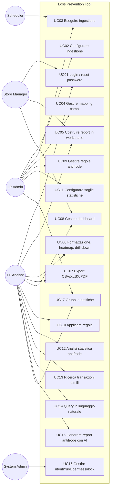
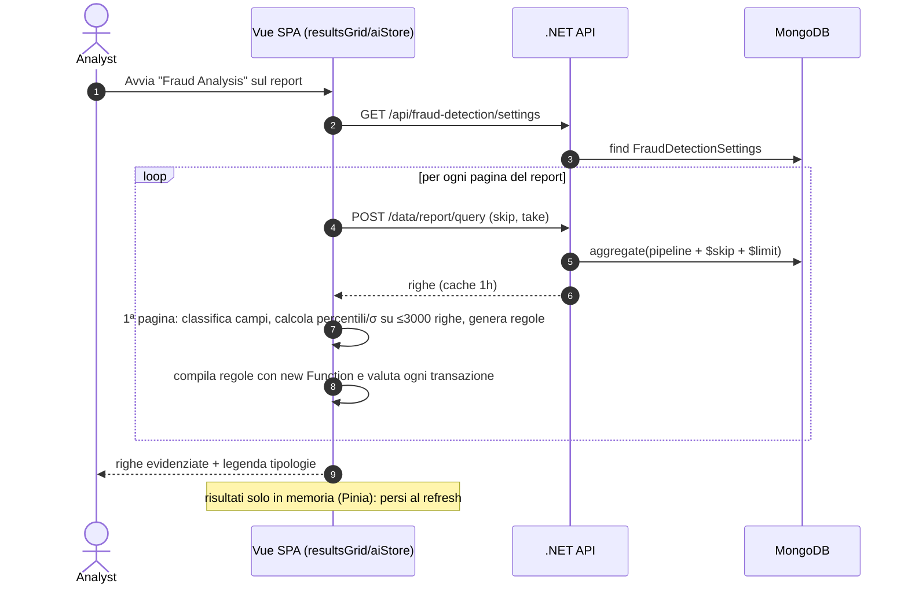
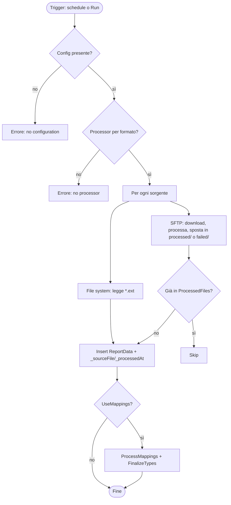
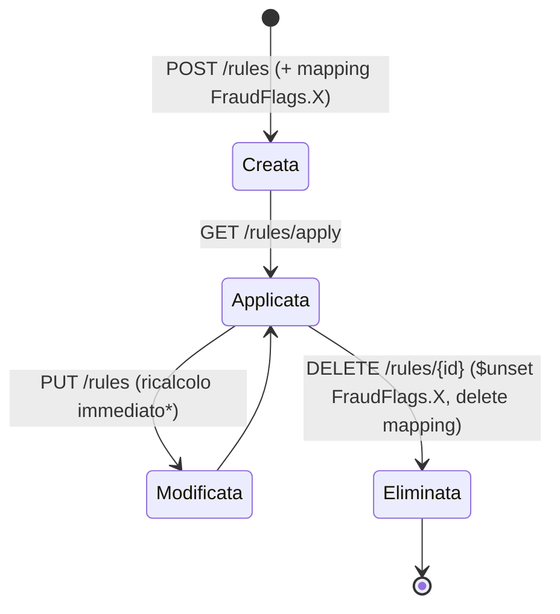

<!-- REVERSE-META
schema: 1
mode: how
step: 02_functional_overview
commit: 593f6decec3a642d5567754dd795b19560bb0afb
commit_short: 593f6de
branch: main
worktree: clean
baseline_date: 2026-10-05T10:14:05+00:00
generated_at: 2026-10-07T14:40:00Z
-->
# Functional Overview - Progetto LOSS_PREVENTION (Loss Prevention Tool)

> **Baseline commit:** `593f6de` (`main`) · worktree `clean`

**Data**: 2026-10-07 · **Versione**: 1.0 · **Autori**: REVERSE how (analisi statica) · **Audience**: stakeholder tecnici e non tecnici, team di sviluppo, UX

---

## 1. User Types & Personas

| Persona | Descrizione | Permessi chiave (seed) | Schermate |
|---------|-------------|------------------------|-----------|
| **Laura – LP Analyst** | Analista centrale loss prevention; costruisce report, lancia analisi antifrode, cerca casi simili | `CAN_VIEW_REPORT`, `CAN_MANAGE_WORKSPACES`, `CAN_VIEW_DASHBOARD`, `CAN_APPLY_RULE`, `CAN_VIEW_FRAUD_SETTINGS` | `/query`, `/workspaces`, `/dashboards`, `/home` |
| **Marco – Store/Region Manager** | Vede solo i dati del suo perimetro (`LockField=StoreId`, `LockValue=…`) | `CAN_VIEW_REPORT`, `CAN_VIEW_DASHBOARD` | `/dashboards`, `/query` |
| **Giulia – LP Administrator** | Configura regole, soglie, mapping, ingestione, notifiche | `CAN_CREATE/UPDATE/DELETE_RULE`, `CAN_MANAGE_FRAUD_SETTINGS`, `CAN_*_MAPPINGS`, `CAN_MANAGE_DATA_INGESTION`, `CAN_MANAGE_NOTIFICATIONS` | `/manage/*` |
| **Paolo – System Administrator** | Utenti, ruoli, permessi, gruppi | `CAN_*_USER`, `CAN_*_ROLE`, `CAN_*_PERMISSION`, `CAN_MANAGE_GROUPS` | `/manage/users`, `/manage/roles`, `/manage/permissions`, `/manage/groups` |
| **Sistema (scheduler)** | Background service che avvia l'ingestione | n/a | n/a |

---

## 2. Core Use Cases

| ID | Use case | Attore | Endpoint / componente | Note funzionali |
|----|----------|--------|----------------------|-----------------|
| UC01 | Login, forgot/reset password | Tutti | `POST /users/login`, `/users/forgot-password`, `/users/validate-reset-token`, `/users/reset-password` · `Login.vue`, `ForgotPassword.vue`, `ResetPassword.vue` | Sessione 1 h, logout automatico a scadenza (`loginStore.scheduleExpiryLogout`) |
| UC02 | Configurare sorgenti, formato, schedule | LP Admin | `GET/PUT/DELETE /api/data-ingestion`, `PATCH .../sources`, `PATCH .../schedule`, `PUT .../recurrence-options` · `dataingestion.vue` | Sorgenti: File System, SFTP; formati XML/CSV/JSON; ricorrenza daily/weekly |
| UC03 | Eseguire ingestione | LP Admin / Scheduler | `POST /api/data-ingestion/run` · `DataIngestionBackgroundService` | Arricchisce con `_sourceFile`, `_processedAt`, `_sourceType`; registra `ProcessedFiles`; sposta su SFTP in `processed/` |
| UC04 | Gestire mapping | LP Admin | `GET/POST/PUT/DELETE /data/mappings` · `mappings.vue` | Alias, tipo, visibilità, flag `IsLookup` (flag senza logica associata) |
| UC05 | Report builder | Analyst | `POST /data/report/query`, `/workspaces*` · `queryBuilderTabs.vue`, `selectFields.vue`, `conditionGroup.vue` | Tab multipli, group-by + aggregazioni, condizioni AND/OR annidate, campi calcolati |
| UC06 | Formattazione e heatmap | Analyst | `formattingRow.vue`, `heatmapPreview.vue` | Conditional formatting, heatmap con drill-down |
| UC07 | Export | Analyst | `resultsGrid.vue` (papaparse, xlsx, pdfmake) | Pagina corrente, tutte le pagine, solo righe "fraud" |
| UC08 | Dashboard | Analyst | `/dashboards*` · `dashboard.vue`, `chartblock.vue`, `tabularBlock.vue` | Blocchi chart/tabella/testo/immagine su grid layout |
| UC09 | CRUD regole | LP Admin | `/rules*` · `rules.vue` | Regola = campo + valore uguale **oppure** range min/max, opzionale somma su array |
| UC10 | Applicare regole | Analyst/Admin | `GET /rules/apply` | Ricalcola `FraudFlags` su **tutta** la collezione; avvio solo manuale |
| UC11 | Soglie statistiche | LP Admin | `/api/fraud-detection/settings*` · `FraudSettingsDialog.vue` | 22 categorie di soglie; import/export JSON |
| UC12 | Analisi statistica antifrode | Analyst | `aiStore.analyzeFraudInData` in `resultsGrid.vue` | Eseguita nel browser pagina per pagina; evidenzia righe; risultati non salvati |
| UC13 | Transazioni simili | Analyst | `POST /distance` · `distanceDialog.vue`, `distanceTable.vue`, `radarChart.vue` | Top-10 per score (50% campi comuni + 50% distanza normalizzata sul max) |
| UC14 | NLQ | Analyst | `naturalLanguageQuery.vue` → `aiStore.generateQuery` → Ollama | Converte la domanda in campi + condizioni sul modello dei mapping |
| UC15 | Report antifrode AI | Analyst | `aiStore.generateFraudReports` → Ollama | Genera template di report per 6 famiglie di frode |
| UC16 | Utenti, ruoli, permessi, lock | Sys Admin | `/users*`, `/roles*`, `/permissions*` · `users.vue`, `roles.vue`, `permissions.vue` | `LockField/LockValue` per utente |
| UC17 | Gruppi e notifiche | Admin/Analyst | `/groups*`, `/notifications*` · `groups.vue`, `notifications.vue` | Destinatari user/group/role, risposta, mark-as-read |

---

## 3. Feature Catalog

| Area | Feature | Implementazione | Maturità |
|------|---------|-----------------|----------|
| **Accesso** | Login JWT, logout a scadenza, reset password via email | BE + FE | ✅ |
| | Gestione utenti/ruoli/permessi (37 permessi) | BE + FE | ✅ |
| | UserLock (filtro dati per utente) | **Solo FE** | ⚠️ non sicuro |
| **Dati** | Ingestione XML/CSV/JSON da FS/SFTP | BE | 🟡 "need to test" |
| | Schedulazione daily/weekly | BE (polling 60 s) | 🟡 |
| | Batch console XML | Console (path hardcoded) | 🟡 tool di sviluppo |
| | Upload XML via API (`/data/create-transactions`) | BE | 🔴 non persiste |
| | Mapping automatico campi + tipi | BE | ✅ |
| | Retention TTL | BE | ✅ |
| | Lookup tables | Flag `IsLookup` senza logica | 🔴 non implementata |
| **Reporting** | Report designer, expression editor, prefix/suffix, conditional formatting | FE | ✅ |
| | Heatmap + drill-down | FE | ✅ |
| | Export CSV/XLSX/PDF | FE | ✅ |
| | Dashboard | BE + FE | ✅ |
| **Antifrode** | Rule engine (13 regole seed) | BE | 🟡 semplice, solo manuale |
| | Applicazione automatica regole in ingestione | — | 🔴 non trovata nel codice |
| | Motore statistico (30 tipologie) | **Solo FE** | 🟡 non persistito |
| | Soglie configurabili | BE (storage) + FE (uso) | ✅ |
| | Similarity (euclidea, top-10) | BE | 🟡 senza normalizzazione |
| **AI** | NLQ | FE → Ollama locale | 🟡 non deployabile così |
| | Generazione report antifrode | FE → Ollama locale | 🟡 |
| | AI configuration (token, creatività) | — | 🔴 "nice to have" in roadmap |
| **Collaborazione** | Gruppi | BE + FE | ✅ |
| | Notifiche + reply | BE + FE | 🟡 no real-time, nessun filtro per destinatario lato API |
| **Trasversali** | Audit log | — | 🔴 assente |
| | Multi-tenancy, SSO, branding | — | 🔴 pianificate |

Legenda: ✅ implementata · 🟡 implementata con limiti significativi · 🔴 assente/non funzionante · ⚠️ difetto di sicurezza

---

## 4. User Journeys

### 4.1 Journey A – Dalla consegna dei file al primo report

1. Admin apre **Manage → Data Ingestion**, seleziona *SFTP*, formato *XML*, credenziali, cartella, ricorrenza *daily 02:00*, *Use mappings* = on → `PUT /api/data-ingestion`.
2. Alle 02:00 (±1 min) il background service esegue `FileProcessingCoordinator.RunIngestionAsync`: scarica i file, li converte, li inserisce, sposta i file in `processed/`, registra `ProcessedFiles`, rigenera i `Mappings`.
3. Analyst apre **/query**, crea un tab, seleziona campi, condizioni, group-by → `POST /data/report/query` (pipeline aggregata, paginata).
4. Applica formattazione/heatmap, salva il workspace (`PUT /workspaces/{id}`), esporta XLSX.

**Error scenarios**: credenziali SFTP errate → errore registrato solo nei log (nessuna notifica utente); file già processato → saltato; formato non corrispondente → `InvalidOperationException` nel risultato.

### 4.2 Journey B – Analisi antifrode

### 4.3 Journey C – Regole server-side
Admin crea la regola *ExcessiveVoids* (`VoidsCount` in [3, 9999]) → `POST /rules` crea anche la mapping `FraudFlags.ExcessiveVoids` → Analyst preme **Apply Rules** → `GET /rules/apply` ricalcola i flag su tutti i documenti → la colonna booleana è disponibile nei report.

### 4.4 Journey D – Transazione simile
Dalla griglia l'analista seleziona una transazione e i campi di confronto → `POST /distance` → top-10 transazioni con score, % campi usati, radar chart di confronto. Richiede almeno 3 campi numerici in comune.

---

## 5. Process Flows

### 5.1 Ingestione (BPMN semplificato)

### 5.2 Ciclo di vita di una regola

\* Il ricalcolo in `UpdateRuleAsync` scrive il valore in un campo radice con il nome della regola invece che in `FraudFlags.<nome>` (difetto).

---

## 6. Verifica funzionalità dichiarate dal fornitore

Fonte delle dichiarazioni: `Docs/01_EXECUTIVE_OVERVIEW.md`, `README.md`, `Docs/09_SECURITY_DOCUMENTATION.md`, `Docs/roadmap.txt`. Verifica eseguita sul codice al commit `593f6de`.

### 6.1 Motore di fraud detection

| Dichiarazione | Esito | Evidenza nel codice |
|---------------|-------|---------------------|
| "Configurable rule-based fraud detection engine" | ✅ **Presente (base)** | `RulesService.cs`, `RuleHelper.cs`: una regola = **un solo campo** con uguaglianza (case-insensitive) o range numerico, opzionale somma su array. Nessuna combinazione AND/OR, nessun peso/score, nessuna finestra temporale, nessuna aggregazione per entità |
| "15+ fraud types" (README) | ✅ Presente | 13 regole seed server (`rules_export.json`) + 30 tipologie euristiche client (`aiStore.ts`) |
| "Real-time fraud analysis" | ❌ **Non presente** | Regole applicate solo su richiesta (`GET /rules/apply`) su tutta la collezione; analisi statistica on-demand nel browser |
| Applicazione automatica delle regole in ingestione (roadmap "DONE, need to test") | ❌ **Non trovata** | Nessun flag in `DataIngestionConfiguration`, nessuna chiamata al rule engine in `FileProcessingCoordinator` |
| "Cash shortages" tra le tipologie | ❌ Non trovata | Nessuna regola/euristica dedicata |
| "Comprehensive audit trail" delle indagini | ❌ Non presente | Nessun log di audit, nessun salvataggio dei risultati di analisi |

### 6.2 Analisi statistica

| Dichiarazione | Esito | Evidenza |
|---------------|-------|----------|
| "Statistical anomaly detection (percentiles, standard deviations)" | ✅ **Presente, solo client-side** | `aiStore.computeStats`: p05…p999, media, σ su campi classificati come importo/conteggio; soglie da `FraudDetectionSettings`. Statistiche calcolate **sulla prima pagina** (max 3.000 righe) e riusate per l'intero dataset |
| Velocity, temporal, split, sweethearting, return fraud, cross-transaction | ✅ Presenti (euristiche) | `buildVelocityRules`, `buildTemporalRules`, `buildSplitTransactionRules`, `buildSweetheartingRules`, `buildReturnFraudRules`, `buildCrossTransactionRules` |
| "Pattern recognition" | 🟡 Parziale | Riconoscimento tramite euristiche e regex sui nomi campo (`SEMANTIC_PATTERNS`), non algoritmi di pattern mining |
| "Euclidean Distance Analysis" | ✅ Presente | `DistanceDataService` + `DistanceHelper` (server) |
| "K-Nearest Neighbors (KNN): Behavioral profiling" | 🟡 **Parziale** | Esiste una ricerca dei 10 vicini più simili; **nessuna** normalizzazione delle feature (campi con scale diverse dominano la distanza), nessuna classificazione k-NN, nessun profilo comportamentale. La roadmap stessa elenca "KNN, ensure functionality is working" e "Behavioral Profiling" come **next steps** |
| "Reduced false positives: configurable thresholds" | ✅ Presente | 22 categorie di soglie persistite su `FraudDetectionSettings` |

### 6.3 Componente AI

| Dichiarazione | Esito | Evidenza |
|---------------|-------|----------|
| "AI-Powered Natural Language Queries" | ✅ **Presente con vincoli forti** | `aiStore.generateQuery` → `fetch("http://localhost:11434/api/generate")`, modello `qwen2.5:14b`, temperatura 0.05. Richiede **Ollama sulla macchina di ogni utente**; nessun backend proxy, nessuna configurazione per ambiente |
| "AI-powered report generation" (roadmap DONE) | ✅ Presente | `generateFraudReports`: genera template di report (titolo, campi, condizioni) per 6 famiglie di frode |
| "AI fraud analysis" (etichetta UI) | ⚠️ **Non è AI** | L'analisi antifrode di `analyzeFraudInData` è interamente **deterministica/statistica**; l'LLM non viene invocato |
| Modelli ML addestrati / scoring predittivo | ❌ Assenti | Nessuna libreria ML (ML.NET, ONNX, TensorFlow.js) nelle dipendenze |
| "AI Configuration – tokens, creativity" | ❌ Non presente | Parametri hardcoded in `aiStore.ts` (roadmap: "Nice to have") |

### 6.4 Altre dichiarazioni rilevanti

| Dichiarazione | Esito | Evidenza |
|---------------|-------|----------|
| "Field-level access control for data locking" | ⚠️ Solo UI | `fieldLock.ts`; nessun filtro server |
| "RBAC with 41+ permissions" | 🟡 37 permessi | `01_CreatePermissions.js` / endpoint |
| "Audit logging" (✅ in `09_SECURITY_DOCUMENTATION.md`) | ❌ Assente | Nessun evento `USER_LOGIN` o simile nel codice; roadmap: "Logging/Auditing Section" da fare |
| "Real-time notification system" | 🟡 | Caricamento all'avvio e su refresh, nessun push |
| "Nuxt 3 SSR" | ❌ | SPA Vite; Nuxt non usato |
| "Export PDF, Excel, CSV" | ✅ | `resultsGrid.vue` |

**Sintesi**: le tre famiglie dichiarate (fraud detection, analisi statistica, AI) **esistono** nel codice ma con un livello di maturità inferiore a quanto descritto: il rule engine è elementare, la statistica e l'AI girano nel browser senza persistenza/audit, l'AI dipende da un LLM locale non deployabile in architettura multi-utente e non esiste machine learning. L'effort di completamento è stimato nel documento 19 (Modernization Estimation) §7.

---

## Reference Documents
- 00_deep_dive.md · 01_context.md

## Change Log

| Versione | Data | Autore | Modifiche |
|----------|------|--------|-----------|
| 1.0 | 2026-10-07 | REVERSE how (FULL) | Creazione documento (sostituisce run 2026-10-05) |
