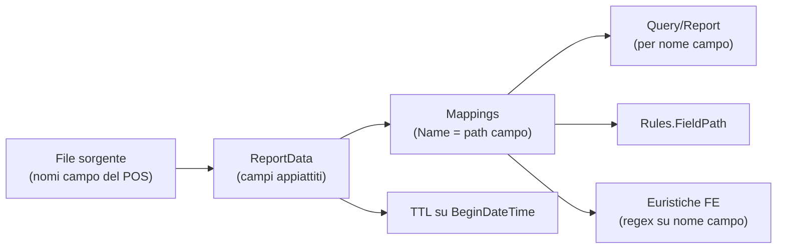

<!-- REVERSE-META
schema: 1
mode: how
step: 04_constraints
commit: 593f6decec3a642d5567754dd795b19560bb0afb
commit_short: 593f6de
branch: main
worktree: clean
baseline_date: 2026-10-05T10:14:05+00:00
generated_at: 2026-10-07T14:40:00Z
-->
# Constraints - Progetto LOSS_PREVENTION

> **Baseline commit:** `593f6de` (`main`) · worktree `clean`

**Data**: 2026-10-07 · **Versione**: 1.0 · **Autori**: REVERSE how · **Audience**: team tecnico, architetti, developer

---

## 1. Vincoli Tecnologici

| ID | Vincolo | Evidenza | Impatto sulle scelte |
|----|---------|----------|----------------------|
| C-T01 | **.NET 8** come runtime backend | `<TargetFramework>net8.0</TargetFramework>` in tutti i csproj | Fine supporto 10-nov-2026: upgrade a .NET 10 obbligato a breve |
| C-T02 | **FastEndpoints 6** come framework API | `PackageReference FastEndpoints 6.0.0`; 78 classi `Endpoint<…>` | Autorizzazione basata su claim `permissions`; cambiare framework = riscrivere tutti gli endpoint |
| C-T03 | **MongoDB** come unico datastore, accesso con driver nativo | `MongoDB.Driver 3.4.0`; `IMongoRepository<T>` espone `Collection` | Builder `Builders<T>` usati nei servizi → forte accoppiamento a Mongo; Cosmos DB (Mongo API) proposto in roadmap ha limitazioni su aggregation/TTL da verificare |
| C-T04 | **Dati transazionali schema-less** | `XmlToBsonConverterHelper.ConvertFlattened`, `MappingService.ProcessMappings` | Nessuna validazione strutturale; indici e regole dipendono dai nomi campo dei file sorgente |
| C-T05 | **Vue 3 + Vuetify 3 + Pinia** | `package.json` | Logica antifrode in TypeScript nel browser |
| C-T06 | **LLM Ollama su `localhost:11434`** con modello `qwen2.5:14b` | `aiStore.ts` | Richiede GPU/CPU adeguata sulla postazione utente (~9 GB per un modello 14B quantizzato) oppure introduzione di un gateway |
| C-T07 | **SFTP con password** | `SftpClient(host, port, user, password)` | Nessun supporto chiavi SSH / host key pinning |
| C-T08 | **SMTP senza TLS** | `EnableSsl = false` (commento: "smtp4dev") | Configurato per sviluppo; non usabile con provider reali |

## 2. Vincoli Architetturali

| ID | Vincolo | Evidenza |
|----|---------|----------|
| C-A01 | Monolite con **scheduler in-process** (`AddHostedService<DataIngestionBackgroundService>`) | `Program.cs` — più istanze API eseguirebbero l'ingestione più volte |
| C-A02 | **Cache in-process** (`AddMemoryCache`) | Non condivisa tra istanze |
| C-A03 | **Query costruite dal client** come pipeline Mongo | `GetReportDataRequest.QueryPipeline: List<object>` |
| C-A04 | **Logica antifrode statistica nel client** | `aiStore.ts`, `fraudDetectionStore.ts` |
| C-A05 | Shared database tra API, background service e console | stessa `MongoDbSettings` |
| C-A06 | Single-tenant: un solo `DatabaseName` da configurazione | `appsettings.json` |
| C-A07 | Un solo documento di configurazione ingestione e un solo documento di soglie globali | `GetConfigurationAsync()`, `GET /api/fraud-detection/settings` |

## 3. Vincoli di Sicurezza e Normativi

| ID | Vincolo | Origine |
|----|---------|---------|
| C-S01 | GDPR: dati personali di dipendenti/clienti, profilazione | Dominio |
| C-S02 | Controllo a distanza dei lavoratori (art. 4 L. 300/1970) | Dominio (Italia) |
| C-S03 | PCI-DSS se presenti dati carta | Regole `KeyedCardEntry`, campi tender |
| C-S04 | Token JWT simmetrico con chiave in configurazione | `JwtSettings.SecretKey` |
| C-S05 | Sessione 1 h senza refresh token | `ExpiryHours: 1`, logout automatico FE |

## 4. Vincoli Operativi e di Progetto

| ID | Vincolo | Evidenza |
|----|---------|----------|
| C-O01 | CORS ammesso solo per `http://localhost:5173/5174` | `Program.cs` — deploy richiede modifica codice |
| C-O02 | Swagger esposto solo in Development | `app.Environment.IsDevelopment()` |
| C-O03 | Retention transazioni basata su `BeginDateTime` | TTL index: documenti senza quel campo **non scadono mai** |
| C-O04 | Job console legato a Windows path `C:\xmlstore5\xml` | `DataIngestionService/Program.cs` |
| C-O05 | Nessun dato reale disponibile per test | `roadmap.txt`: "Waiting for Custom" |
| C-O06 | Deploy target proposto: Azure (Functions/Container Apps, Cosmos vCore o Atlas) | `roadmap.txt`, `Docs/04_DEPLOYMENT_GUIDE.md` |

## 5. Vincoli Dati

Ogni componente a valle dipende dai **nomi dei campi** prodotti dai file sorgente: un cambio di formato del POS rompe regole, report salvati, TTL ed euristiche (classificate con regex come `/refund.*amount/i`).

---

## Reference Documents
- 00_deep_dive.md · 01_context.md · 02_functional_overview.md · 03_non_functional_overview.md

## Change Log

| Versione | Data | Autore | Modifiche |
|----------|------|--------|-----------|
| 1.0 | 2026-10-07 | REVERSE how (FULL) | Creazione documento (sostituisce run 2026-10-05) |
