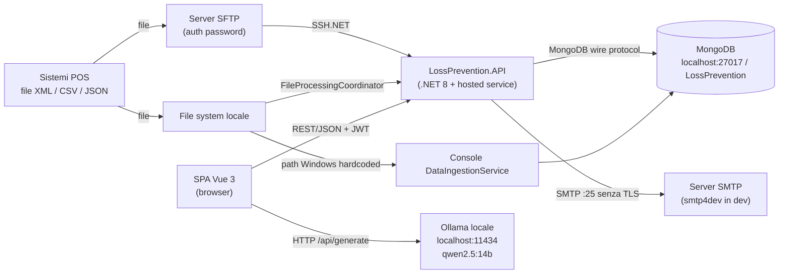
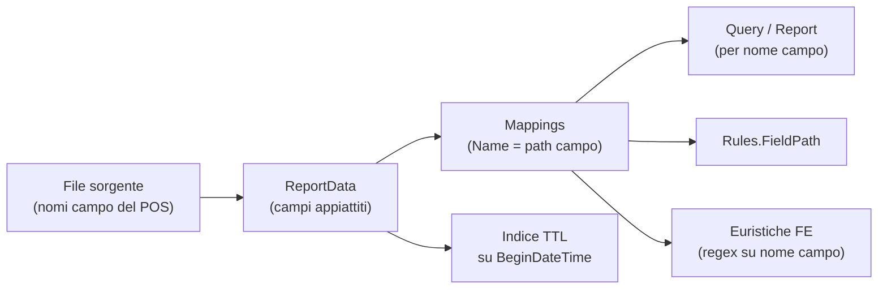

<!-- IMPACT-META
schema: 1
mode: how
step: 04_constraints
commit: fc7d820908b8b230fb47a2669920ba7efdb413a8
commit_short: fc7d820
branch: main
worktree: dirty
baseline_date: 2026-10-07T18:19:51+02:00
generated_at: 2026-10-08T09:38:00+02:00
-->
# Constraints - Progetto LOSS_PREVENTION

> **Baseline commit:** `fc7d820` (`main`) · worktree `dirty` (modifiche locali solo in `Docs/` e `.github/`; codice applicativo identico al commit)

**Data**: 2026-10-08  
**Versione**: 1.1  
**Autori**: IMPACT REVERSE how (analisi statica del codice + verifica IMPACT)  
**Audience**: Team tecnico, architetti, developer

---

### Fonti e convenzioni

- **Codice** al commit `fc7d820`, citato come `file:riga`.
- **Documentazione storica del fornitore**: `Docs/roadmap.txt`, `Docs/01_EXECUTIVE_OVERVIEW.md`, `Docs/04_DEPLOYMENT_GUIDE.md` e `Docs/09_SECURITY_DOCUMENTATION.md` **non esistono al baseline**. Erano presenti solo nel commit `593f6de` (import iniziale, 2026-10-05) e sono state rimosse nel commit `d768cd9` ("Delete …/Docs directory"). Si leggono, dalla root `C:\repository\LOSS_PREVENTION`, con:
  `git show 593f6de:customspa-it-loss-prevention-d098a8b97860/Docs/<file>`
  Le loro affermazioni sono **intenzioni/dichiarazioni**, non vincoli verificati nel codice.
- Ogni vincolo ha un ID stabile (`C-xxx`), riusato dai documenti successivi. Corrispondenza con gli ID della versione 1.0: C-O01 → C-I04, C-O02 → C-I03, C-O03 → C-D01, C-O04 → C-D04, C-O05 → C-P05, C-O06 → C-P06; C-S01 → C-L01, C-S02 → C-L03, C-S03 → C-L04, C-S04 e C-S05 → C-I02. C-T01..08 e C-A01..07 sono invariati.

---

## Sezioni Principali

## 1. Time, Budget, Resources

Il codice non contiene informazioni su tempi, budget o risorse. Le uniche indicazioni vengono dalla roadmap storica del fornitore, che fissava finestre di 3 e 3-6 mesi e privilegiava soluzioni a basso costo.

| ID | Vincolo | Evidenza | Impatto sulle scelte |
|----|---------|----------|----------------------|
| C-P01 | Finestra di consegna iniziale **entro 3 mesi**, poi roadmap **3-6 mesi** | `roadmap.txt:1` "Suggested Deliverables - Within 3 Months Time frame"; `roadmap.txt:62` "Initial Roadmap - 3-6 Months" (storico, `593f6de`) | Spinta verso soluzioni tattiche (logica nel client, scheduler in-process) a scapito di test e CI |
| C-P02 | **Contenimento dei costi** di hosting | `roadmap.txt:52` "Azure Functions - Spins up only when needed - reduces costs"; `roadmap.txt:56` "Development can be done locally to reduce costs" (storico) | Preferenza per serverless/consumo e sviluppo in locale; il codice attuale (API ASP.NET + hosted service) non è però compatibile con Azure Functions senza riscrittura |
| C-P03 | Ambienti separati **Sales/UAT** e **Production** | `roadmap.txt:56` (storico) | Il codice ha un solo `appsettings.json` e CORS hardcoded su `localhost` (`Program.cs:29`): servono configurazioni per ambiente |
| C-P04 | Stato del prodotto a "febbraio 2026": lookup tables, ottimizzazione "large datasets (1000+ rows)" e test su dati reali **ancora in sviluppo** | `01_EXECUTIVE_OVERVIEW.md:103-122` (storico) | Prestazioni e correttezza su volumi reali non validate (vedi [03_non_functional_overview.md](03_non_functional_overview.md) NFR-PERF-00) |
| C-P05 | **Nessun dato reale** per i test | `roadmap.txt:27` "Real world data to test with … - Waiting for Custom" (storico); nel repository c'è solo un dump di sviluppo con ≈ 3.000 documenti `ReportData` (`Data/LossPrevention`) | Regole e soglie statistiche calibrate su dati sintetici |
| C-P06 | Target di deploy **proposto** dal fornitore: Azure (Front Door, Static Web Apps, Functions/App Service, Cosmos DB API Mongo o Atlas, Key Vault), in alternativa on-premise (IIS o Kestrel), ibrido o Docker/Kubernetes | `04_DEPLOYMENT_GUIDE.md:17, 34-46, 83`; `01_EXECUTIVE_OVERVIEW.md:135-149` (storici, `593f6de`) | Nessun artefatto di deploy nel repository (né Dockerfile né IaC): la scelta della piattaforma è ancora aperta (vedi [09_infrastructure_architecture.md](09_infrastructure_architecture.md)) |
| C-P07 | Budget | **N/A — non ricavabile dal codice**: nessun dato economico nel repository né nella documentazione storica | — |

---

## 2. Technology Constraints

Lo stack è imposto dal codice esistente: .NET 8 + FastEndpoints + MongoDB lato server, Vue 3 + Vuetify lato client, LLM locale via Ollama. Alcune scelte (MongoDB, schema-less, logica nel browser) vincolano fortemente ogni evoluzione.

| ID | Vincolo | Evidenza | Impatto sulle scelte |
|----|---------|----------|----------------------|
| C-T01 | **.NET 8** come runtime backend | `<TargetFramework>net8.0</TargetFramework>` nei 5 csproj | Fine supporto Microsoft 10/11/2026: upgrade a .NET 10 LTS obbligato a breve |
| C-T02 | **FastEndpoints 6.0.0** come framework API | `PackageReference FastEndpoints 6.0.0` (`01. LossPrevention.API.csproj`); 78 classi endpoint (74 con `Permissions(...)`, 4 `AllowAnonymous`) | Autorizzazione basata sul claim `permissions`; cambiare framework significa riscrivere tutti gli endpoint |
| C-T03 | **MongoDB** come unico datastore, driver nativo `MongoDB.Driver 3.4.0` | `IMongoRepository<T>` espone `Collection` (`IMongoRepository.cs:170`, `MongoRepository.cs:27`); `Builders<T>` usati nei servizi (es. `RulesService.cs:40-41`) | Forte accoppiamento a Mongo. Cosmos DB (API Mongo), proposto nella roadmap storica (`roadmap.txt:53`), va verificato su aggregation pipeline e indici TTL prima di adottarlo |
| C-T04 | **Dati transazionali schema-less** | `XmlToBsonConverterHelper.ConvertFlattened`; mapping generati dai dati (`MappingService.ProcessMappings`) | Nessuna validazione strutturale; indici, regole e report dipendono dai nomi dei campi dei file sorgente (vedi §3.2) |
| C-T05 | **Vue 3.5 + Vuetify 3.7 + Pinia 2.2 + Vite 6** | `LossPrevention.UI/package.json` | La logica antifrode statistica vive in TypeScript nel browser (`aiStore.ts`, 1.994 righe) |
| C-T06 | **LLM Ollama su `localhost:11434`**, modello `qwen2.5:14b` | `aiStore.ts:8` (`MODEL`), `aiStore.ts:88` (`fetch("http://localhost:11434/api/generate")`) | Ogni postazione utente deve eseguire Ollama con il modello 14B (circa 9 GB in versione quantizzata Q4) oppure va introdotto un gateway LLM lato server |
| C-T07 | **SFTP solo con password** | `new SftpClient(host, port, username, password)` (`SftpFileProcessingService.cs:56`); nessun uso di chiavi o host key | Nessun supporto a chiavi SSH / host key pinning; la password SFTP è salvata in chiaro in Mongo (`DataIngestionConfiguration.cs:19`) e riesposta dal DTO (`DataIngestionConfigurationDTO.cs:13`) |
| C-T08 | **SMTP senza TLS** | `EmailService.cs:63-64` (`EnableSsl = false; // smtp4dev doesn't use SSL`); `Email:SmtpHost=localhost`, `SmtpPort=25` in `appsettings.json` | Configurato per smtp4dev in sviluppo; non utilizzabile con provider reali senza modifica del codice |
| C-T09 | **Browser moderno** con `fetch`, ES modules e `localStorage` (token e username) | Build Vite 6; `loginStore.ts` | Nessun supporto a browser legacy; sessione legata al singolo browser |

### 2.1 Vincoli architetturali derivati dal codice

| ID | Vincolo | Evidenza | Impatto |
|----|---------|----------|---------|
| C-A01 | Monolite con **scheduler in-process** | `AddHostedService<DataIngestionBackgroundService>()` (`Program.cs:111`) | Più istanze API eseguirebbero l'ingestione più volte: lo scale-out richiede uno scheduler single-leader |
| C-A02 | **Cache in-process** | `AddMemoryCache()` (`Program.cs:49`) | Non condivisa tra istanze; nessuna invalidazione dopo ingestione o regole |
| C-A03 | **Query costruite dal client** come pipeline Mongo | `GetReportDataRequest.QueryPipeline: List<object>`; `BsonDocument.Parse` (`GetReportDataEndpoint.cs:66-69`) | Il contratto API coincide con il linguaggio di query di Mongo: cambiare DB significa cambiare anche il client |
| C-A04 | **Logica antifrode statistica nel client** | `aiStore.ts` (`analyzeFraudInData`, riga 1667), `fraudDetectionStore.ts` | Risultati non persistiti né auditabili; dipendenza dalla potenza della postazione |
| C-A05 | **Database condiviso** tra API, background service e console | stessa sezione `MongoDbSettings`; console `LossPrevention.DataIngestionService` che scrive in `ReportData` | Nessun confine di ownership dei dati |
| C-A06 | **Single-tenant**: un solo `DatabaseName` | `appsettings.json` → `MongoDbSettings:DatabaseName = LossPrevention` | Il "white-label per cliente" dichiarato nella documentazione storica (`01_EXECUTIVE_OVERVIEW.md:155-156`) richiede un'istanza per cliente |
| C-A07 | Un solo documento di configurazione ingestione e un solo documento di soglie globali | `GetConfigurationAsync()`; `GET /api/fraud-detection/settings` | Nessuna configurazione per negozio o per sorgente |

---

## 3. Existing Systems & Reuse

Il sistema dipende da sistemi esterni esistenti (file POS, SFTP, MongoDB, SMTP, Ollama) e da un dump dati di sviluppo. Il diagramma mostra il panorama di integrazione al baseline.

### 3.1 Sistemi e asset esistenti

| ID | Sistema / asset | Uso nel codice | Vincolo che impone |
|----|-----------------|----------------|--------------------|
| C-E01 | **File transazionali POS** (XML, CSV, JSON) | 3 strategie `IFileProcessingService` (XML, CSV, JSON) registrate in `Program.cs:102-104`; campi come `StoreID`, `OperatorID`, `BeginDateTime`, `Tender.CardNumber` | Il formato del POS è un input non controllato: ogni cambio di nomi campo si propaga a valle (§3.2) |
| C-E02 | **Server SFTP** del cliente | `SftpFileProcessingService` (download + spostamento in `processed/`) | Solo autenticazione con password; nessuna verifica host key |
| C-E03 | **MongoDB** (`mongodb://localhost:27017`, db `LossPrevention`) | `appsettings.json`; 13 collezioni configurate in `MongoDbSettings` | Seed e migrazioni con script `mongosh` manuali `00..04` in `Data/MongoDBScripts` |
| C-E04 | **Dump di sviluppo** | `Data/LossPrevention/*.bson` (≈ 3.000 documenti `ReportData` con campo `_sourceFile`; collezioni `Mappings_old` e `ReportData_old`) | Unico dataset disponibile; PAN già mascherati (es. `472805******1016`) |
| C-E05 | **Server SMTP** | `EmailService.cs:63-64` (`localhost:25`, `EnableSsl=false`) | Necessario per reset password e notifiche via email |
| C-E06 | **Ollama** (LLM locale) | `aiStore.ts:88` | Deve girare sulla stessa macchina del browser dell'utente |
| C-E07 | **Configurazione FE** | `src/api/api.ts:4` → `baseURL: import.meta.env.VITE_API_BASE_URL`; nessun file `.env` nel repository | Il base URL dell'API va fornito a build time |
| C-E08 | Componenti riusabili interni | `MongoRepository<T>` generico; `RuleHelper` (`Application/Helpers/RuleHelper.cs`); `PasswordHasher` PBKDF2 | Riutilizzabili come base del refactoring; il repository va però "chiuso" (oggi espone `Collection`) |

### 3.2 Vincoli sui dati

Ogni componente a valle dipende dai **nomi dei campi** prodotti dai file sorgente: un cambio di formato del POS rompe regole, report salvati, TTL ed euristiche.

| ID | Vincolo | Evidenza |
|----|---------|----------|
| C-D01 | Retention basata **solo** su `BeginDateTime`: i documenti senza quel campo non scadono mai | Indice TTL creato da `DatabaseInitializationService.cs:98-109` |
| C-D02 | Durata retention da configurazione: 180 giorni nel repository, **90 giorni** di default se la chiave manca | `appsettings.json` → `DataRetention:TransactionRetentionDays = 180`; default in `DatabaseInitializationService.cs:23`; il dump riporta `expireAfterSeconds = 15552000` (= 180 giorni) in `ReportData.metadata.json` |
| C-D03 | Le euristiche statistiche classificano i campi con regex sul nome | es. `refund_amount: [/refund.*amount\|return.*amount\|…/i]` (`aiStore.ts:117`) |
| C-D04 | Il job console legge i file da un path Windows hardcoded | `Directory.GetFiles(@"C:\xmlstore5\xml")` (`LossPrevention.DataIngestionService/Program.cs:76`) |

---

## 4. Integration Standards

Le integrazioni usano standard di fatto (REST/JSON, JWT, SFTP, SMTP, protocollo Mongo) ma senza versioning, contratti formali o canali sicuri configurati.

| ID | Integrazione | Standard / protocollo | Evidenza | Vincolo / gap |
|----|--------------|-----------------------|----------|---------------|
| C-I01 | SPA → API | REST/JSON con FastEndpoints | 78 endpoint | **Nessun versioning API** (0 occorrenze di `Version(`/`AddApiVersioning`); rotte miste con prefisso `/api/...` (es. `/api/data-ingestion`) e senza prefisso (es. `/users/id/{UserId}`, `/rules/{id}`) |
| C-I02 | Autenticazione | JWT Bearer **HS256** con claim `permissions` | `LoginEndpoint.cs:72` (`SecurityAlgorithms.HmacSha256`); validazione in `Program.cs:62-76` | Chiave simmetrica in `appsettings.json` (`JwtSettings:SecretKey`); scadenza 1 h (`ExpiryHours: 1`), nessun refresh token |
| C-I03 | Documentazione API | OpenAPI/Swagger | `Program.cs:54, 121-126` (`UseSwaggerGen/UseSwaggerUi` solo in Development) | Nessun contratto pubblicato per ambienti non di sviluppo |
| C-I04 | CORS | Policy `AllowVueDev` | `Program.cs:24-34` (`WithOrigins("http://localhost:5173", "http://localhost:5174")`), `Program.cs:128` | Origini hardcoded: il deploy richiede una modifica del codice |
| C-I05 | Trasporto | HTTP | Nessun `UseHttpsRedirection` / `UseHsts` | TLS delegato a un eventuale reverse proxy, non previsto nel repository |
| C-I06 | Ingestione file | SFTP (SSH.NET 2025.1.0) | `SftpFileProcessingService.cs:56` | Solo password |
| C-I07 | Email | SMTP | `EmailService.cs:63-64` | Nessun TLS |
| C-I08 | LLM | HTTP JSON verso `/api/generate` di Ollama, `format: "json"`, `stream: false` | `aiStore.ts:87-99` | Chiamata diretta dal browser, senza autenticazione né proxy |
| C-I09 | Datastore | MongoDB wire protocol, connection string senza credenziali | `appsettings.json` → `mongodb://localhost:27017` | Nessuna autenticazione/TLS verso il DB nella configurazione versionata |

---

## 5. Team Size & Skills

La storia git non permette di ricostruire il team reale: il codice è stato importato in un solo commit. Le competenze richieste si deducono invece dallo stack.

| ID | Aspetto | Evidenza | Vincolo |
|----|---------|----------|---------|
| C-R01 | Dimensione del team | 13 commit, tutti dell'autore `saristot` tra il 2026-10-05 e il 2026-10-07; il codice applicativo arriva in blocco con il commit `593f6de` | **N/A — non ricavabile dal codice**: la storia di sviluppo originale (autori, durata, ritmo) non è presente nel repository |
| C-R02 | Competenze backend | .NET 8 / C#, FastEndpoints, MongoDB.Driver e aggregation pipeline, FluentValidation, SSH.NET, BackgroundService | Profilo .NET senior con esperienza MongoDB |
| C-R03 | Competenze frontend | Vue 3 Composition API, TypeScript, Pinia, Vuetify, AG Grid, Chart.js, Tabulator, Vite | Profilo frontend Vue senior: la logica di dominio è nei file più grandi (`resultsGrid.vue` 2.271 righe, `aiStore.ts` 1.994 righe) |
| C-R04 | Competenze dati/AI | Prompt engineering su LLM locale (Ollama/Qwen), statistica descrittiva (z-score, distanza euclidea) | Necessario per mantenere `aiStore.ts` e `DistanceDataservice` |
| C-R05 | Competenze di dominio | Loss prevention retail, struttura dei file POS, normativa lavoro/privacy (§6) | Conoscenza di dominio non documentata nel codice |
| C-R06 | Competenze DevOps | Nessuna pipeline, Dockerfile o IaC nel repository | Da costruire da zero (la roadmap storica prevedeva "Devops setup - Automatic Deployments", `roadmap.txt:70`) |

---

## 6. Legal Constraints (GDPR, Accessibility, Licensing, Log Retention)

Il sistema tratta dati personali di dipendenti e clienti a fini di controllo antifrode: è soggetto a GDPR e, in Italia, alla disciplina sul controllo a distanza dei lavoratori. Accessibilità, licenze e retention dei log non sono indirizzate nel codice.

### 6.1 GDPR e normativa sul lavoro

| ID | Vincolo | Origine / evidenza | Stato nel codice |
|----|---------|--------------------|------------------|
| C-L01 | **GDPR**: dati personali di dipendenti (`OperatorID`, es. `OP928`) e clienti; profilazione per l'individuazione di frodi | Dominio; campi in `ReportData` | Nessuna minimizzazione/pseudonimizzazione all'ingestione; nessun registro dei trattamenti |
| C-L02 | **Diritto alla cancellazione** | La documentazione storica (`09_SECURITY_DOCUMENTATION.md:302`, `593f6de`) dichiarava "Right to erasure implemented via deletion endpoints" e un `DELETE /api/users/{id}` che "anonymizes data" | Esiste solo `DELETE /users/id/{UserId}` (`DeleteUserByIdEndpoint.cs:20`), che elimina l'utente applicativo (`UserService.cs:113-116`) senza anonimizzazione; **nessuna** cancellazione dei dati transazionali per interessato |
| C-L03 | **Controllo a distanza dei lavoratori** (art. 4 L. 300/1970, Statuto dei Lavoratori) | Dominio (Italia): analisi per operatore di cassa | Requisito organizzativo (accordo sindacale o autorizzazione) esterno al codice; va verificato prima del rilascio |
| C-L04 | **PCI-DSS** se arrivano dati carta | Regole su `KeyedCardEntry`; campo `Tender.CardNumber` | Nel dump i PAN sono già mascherati (`472805******1016`); il codice non maschera né rifiuta PAN in chiaro |
| C-L05 | Sicurezza del trattamento (art. 32 GDPR) | Vedi [03_non_functional_overview.md](03_non_functional_overview.md) §2.5 | Lacune: pipeline arbitraria dal client, lock solo lato client, hash password esposti, segreti in configurazione |

### 6.2 Accessibilità

| ID | Vincolo | Evidenza |
|----|---------|----------|
| C-L06 | Requisiti di accessibilità (es. WCAG 2.1 AA / EN 301 549 se richiesti dal committente) | **Non indirizzati**: 1 solo attributo `aria-` (`App.vue:19`) e 1 solo `alt=` in `src/`; nessun test a11y; interfaccia solo in inglese, senza i18n |

### 6.3 Licensing

| ID | Componente | Licenza | Vincolo / nota |
|----|------------|---------|----------------|
| C-L07 | Codice del prodotto | Nessun file `LICENSE` nel repository | **N/A — non ricavabile dal codice**: titolarità e licenza d'uso non dichiarate. La documentazione storica cita "White-label options" e "Customizable branding per client" (`01_EXECUTIVE_OVERVIEW.md:152-156`) |
| C-L08 | Pacchetti .NET (FastEndpoints, MongoDB.Driver, FluentValidation, SSH.NET, Newtonsoft.Json, Microsoft.Extensions.*) | MIT / Apache-2.0 | Nessun vincolo copyleft |
| C-L09 | `ag-grid-community` / `ag-grid-vue3` ^35 | MIT (edizione Community) | Le funzioni Enterprise (pivot, row grouping server-side, export Excel nativo) richiedono licenza commerciale |
| C-L10 | `xlsx` ^0.18.5 (SheetJS) | Apache-2.0 | È l'ultima versione pubblicata su npm, con vulnerabilità note; le versioni successive sono distribuite solo dal CDN SheetJS |
| C-L11 | Altri pacchetti FE (Vue, Vuetify, Pinia, Chart.js, chartjs-chart-matrix, pdfmake, papaparse, tabulator-tables, axios) | MIT | Nessun vincolo copyleft |
| C-L12 | Dipendenze dichiarate ma non usate: `nuxt`, `@nuxt/devtools`, `jspdf`, `jspdf-autotable`, `grid-layout-plus` | MIT | Superficie di licenza e vulnerabilità inutile; da rimuovere |
| C-L13 | Modello LLM `qwen2.5:14b` (`aiStore.ts:8`) | Apache-2.0 (licenza del modello Qwen2.5 14B, da riverificare per uso commerciale) | Va verificato da un legale prima dell'uso in produzione |

### 6.4 Log Retention

| ID | Vincolo | Evidenza | Stato |
|----|---------|----------|-------|
| C-L14 | Retention dei log applicativi | Logging solo su console di default (`appsettings.json` → `Logging:LogLevel:Default = Information`) | **Nessuna retention implementata**: i log non vengono persistiti |
| C-L15 | Audit log con retention di 1 anno | Dichiarato nella documentazione storica (`09_SECURITY_DOCUMENTATION.md:304` "Audit logs: 1-year retention" e riga 555 "Log Retention: 1 year minimum", `593f6de`) | **Non implementato** nel codice |
| C-L16 | Retention dei dati transazionali | Indice TTL su `BeginDateTime`: 180 giorni configurati, 90 di default (vedi C-D01/C-D02) | Implementata solo per `ReportData`; nessuna retention per `Notifications` o per i token di reset |

---

## Reference Documents

- **Deep Dive Analysis**: [00_deep_dive.md](00_deep_dive.md)
- **Context**: [01_context.md](01_context.md)
- **Functional Overview**: [02_functional_overview.md](02_functional_overview.md)
- **Non-Functional Overview**: [03_non_functional_overview.md](03_non_functional_overview.md)
- Documenti IMPACT correlati: [05_principles.md](05_principles.md) · [06_software_architecture.md](06_software_architecture.md) · [07_code.md](07_code.md) · [08_data.md](08_data.md) · [09_infrastructure_architecture.md](09_infrastructure_architecture.md) · [10_deployment.md](10_deployment.md) · [11_development_environment.md](11_development_environment.md) · [12_operation_and_support.md](12_operation_and_support.md) · [13_decision_log.md](13_decision_log.md) · [14_metrics.md](14_metrics.md) · [15_fp_cocomo.md](15_fp_cocomo.md) · [16_frontend_deep_assessment.md](16_frontend_deep_assessment.md) · [17_backend_deep_assessment.md](17_backend_deep_assessment.md) · [18_antipattern_deep_dive.md](18_antipattern_deep_dive.md) · [19_modernization_estimation_spec.md](19_modernization_estimation_spec.md)

---

## Change Log

| Versione | Data | Autore | Modifiche |
|----------|------|--------|-----------|
| 1.0 | 2026-10-07 | REVERSE how (FULL) | Creazione documento (sostituisce run 2026-10-05) |
| 1.1 | 2026-10-08 | IMPACT verify | Header/baseline `dirty`. Documento ristrutturato nelle 6 sezioni del prompt; ID C-T/C-A mantenuti, C-O e C-S redistribuiti. Aggiunti: §1 Time/Budget/Resources (roadmap storica, budget N/A); §3 Existing Systems (diagramma del panorama di integrazione, tabella sistemi/asset); §4 Integration Standards (REST senza versioning, JWT HS256, CORS, SFTP, SMTP, Ollama, Mongo); §5 Team & Skills (team N/A, competenze dallo stack); §6 Legal suddiviso in GDPR, accessibilità, licensing, log retention. Corretti: retention 180 giorni configurata / 90 di default; vincoli con evidenza `file:riga`; documenti fornitore (`roadmap.txt`, `01_EXECUTIVE_OVERVIEW.md`, `04_DEPLOYMENT_GUIDE.md`, `09_SECURITY_DOCUMENTATION.md`) citati come storici (`593f6de`, rimossi in `d768cd9`). Reference Documents completi |
