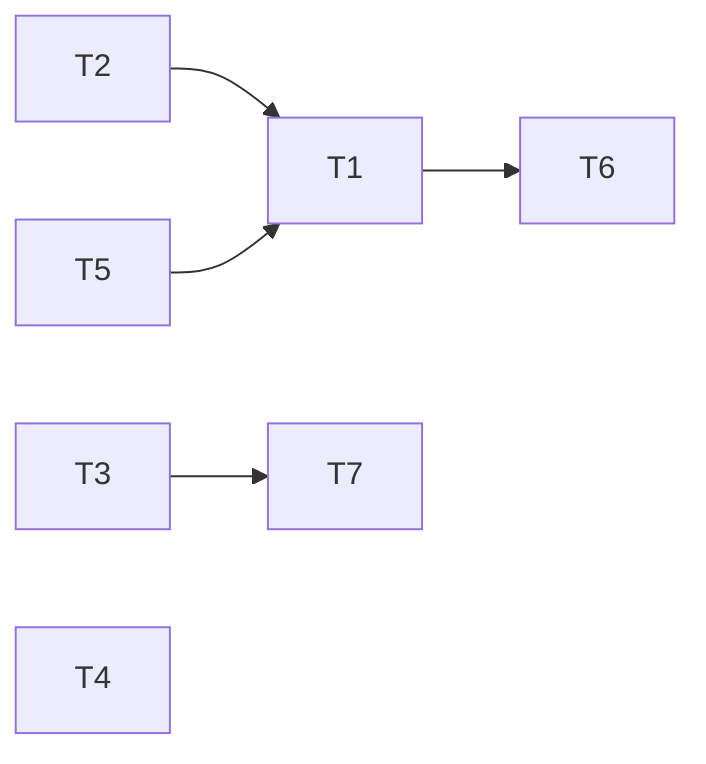

<!-- REVERSE-META
schema: 1
mode: how
step: 05_principles
commit: 593f6decec3a642d5567754dd795b19560bb0afb
commit_short: 593f6de
branch: main
worktree: clean
baseline_date: 2026-10-05T10:14:05+00:00
generated_at: 2026-10-07T14:40:00Z
-->
# Principles - Progetto LOSS_PREVENTION

> **Baseline commit:** `593f6de` (`main`) · worktree `clean`

**Data**: 2026-10-07 · **Versione**: 1.0 · **Autori**: REVERSE how · **Audience**: team tecnico, architetti, developer

Il repository non dichiara principi architetturali. Questo documento **ricostruisce i principi impliciti** osservati nel codice, ne valuta l'applicazione e propone i principi target.

---

## 1. Principi impliciti osservati

| # | Principio (implicito) | Evidenza positiva | Violazioni | Grado di adesione |
|---|-----------------------|-------------------|-----------|-------------------|
| P1 | **Separazione a layer** (API / Application / Domain / Infrastructure) | 5 progetti, DTO e request/response separati in `Handlers/` | 20 endpoint usano direttamente `IMongoRepository<T>`; mapping DTO↔entità inline negli endpoint FraudDetection (388/407 righe) | 🟡 Medio |
| P2 | **REPR / un endpoint per classe** (FastEndpoints) | 78 file endpoint, ognuno con `Configure()` + `HandleAsync()` | — | 🟢 Alto |
| P3 | **Least privilege via permessi dichiarativi** | `Permissions("CAN_…")` su 74/78 endpoint | Row-level lock solo client; query arbitrarie | 🟡 Medio |
| P4 | **Schema-on-read** | Mapping generati dai dati, tipi finalizzati a posteriori | Nessuna validazione input dei file | 🟢 Coerente |
| P5 | **Generic repository** | `MongoRepository<TDocument>` unico | Espone `Collection` → leaky abstraction (`_repo.Collection.UpdateManyAsync`) | 🟡 Medio |
| P6 | **Strategy per formati** | `IFileProcessingService` (XML/CSV/JSON) + `FileProcessingCoordinator` | `XmlProcessingService.InsertManyAsync` → `NotImplementedException` (residuo) | 🟢 Alto |
| P7 | **Configurazione esternalizzata** | `MongoDbSettings`, `JwtSettings`, `DataRetention` | Secret in chiaro nel repo; CORS, SMTP SSL, URL LLM, path console hardcoded | 🔴 Basso |
| P8 | **Fat client / smart UI** | Report builder ricco e reattivo | Logica di business e di sicurezza nel browser | 🔴 Problematico |
| P9 | **Security by design (credenziali)** | PBKDF2 600k, upgrade hash, token reset hashati | Hash esposti dall'API, nessun rate limiting | 🟡 Medio |

## 2. Esempi concreti

**P2 – REPR (positivo)** — `LossPrevention.API/Endpoints/Rules/ApplyRulesEndpoint.cs`:
```csharp
public override void Configure()
{
    Get("/rules/apply");
    Permissions("CAN_APPLY_RULE");
}
```

**P1 – violazione** — `Endpoints/FraudDetection/CreateFraudDetectionSettingsEndpoint.cs` contiene ~300 righe di mapping manuale DTO→entità e accesso diretto al repository, duplicate quasi integralmente in `UpdateFraudDetectionSettingsEndpoint.cs`.

**P8 – violazione** — `UI/src/stores/aiStore.ts:1769`:
```ts
const fn = new Function("row", `try { return (${rule.condition}) } catch { return false }`);
```
La logica antifrode è generata come stringhe JS e compilata nel browser: non riusabile dal backend, non testabile in isolamento, non auditabile.

**P5 – leaky abstraction** — `RulesService.cs`:
```csharp
await _reportDataRepository.Collection.UpdateManyAsync(FilterDefinition<BsonDocument>.Empty, unsetUpdate);
```

## 3. Principi target proposti

| # | Principio | Razionale | Regola verificabile (fitness function) |
|---|-----------|-----------|----------------------------------------|
| T1 | **Server is the source of truth** per sicurezza e decisioni antifrode | Compliance, audit, riproducibilità | Nessun filtro di sicurezza solo in `src/helpers`; i risultati antifrode sono persistiti |
| T2 | **Zero trust sugli input di query** | Evitare data exfiltration | Pipeline validata da whitelist di stage/operatori; test che rifiutano `$lookup`/`$out`/`$merge`/`$unionWith`/`$function`/`$where` |
| T3 | **Endpoint sottili, servizi spessi** | Testabilità | ArchUnitNET: nessun tipo in `LossPrevention.API.Endpoints` dipende da `IMongoRepository<>` |
| T4 | **Config per ambiente, secret fuori dal repo** | Sicurezza | Secret scanning in CI (gitleaks); `appsettings.json` senza valori sensibili |
| T5 | **Batch e calcoli pesanti vicino ai dati** | Performance | Nessun `GetAllAsync()` su `ReportData`; operazioni massive via `BulkWrite`/pipeline update |
| T6 | **Explainable fraud detection** | Uso su dipendenti, AI Act/GDPR | Ogni flag salva regola, versione soglie, valori e timestamp |
| T7 | **Test-first sugli algoritmi** | Regole e distanze sono pure funzioni | Coverage ≥ 80% su `RuleHelper`, `DistanceHelper`, motore statistico |



---

## Reference Documents
- 00_deep_dive.md · 01_context.md · 02_functional_overview.md · 03_non_functional_overview.md · 04_constraints.md

## Change Log

| Versione | Data | Autore | Modifiche |
|----------|------|--------|-----------|
| 1.0 | 2026-10-07 | REVERSE how (FULL) | Creazione documento (sostituisce run 2026-10-05) |
