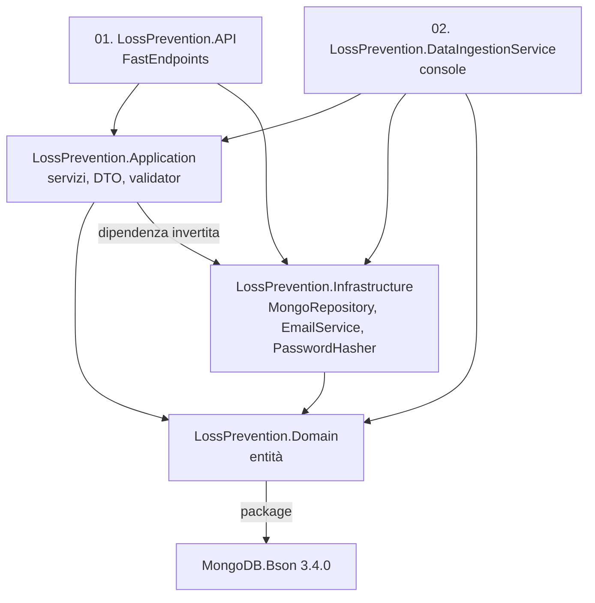
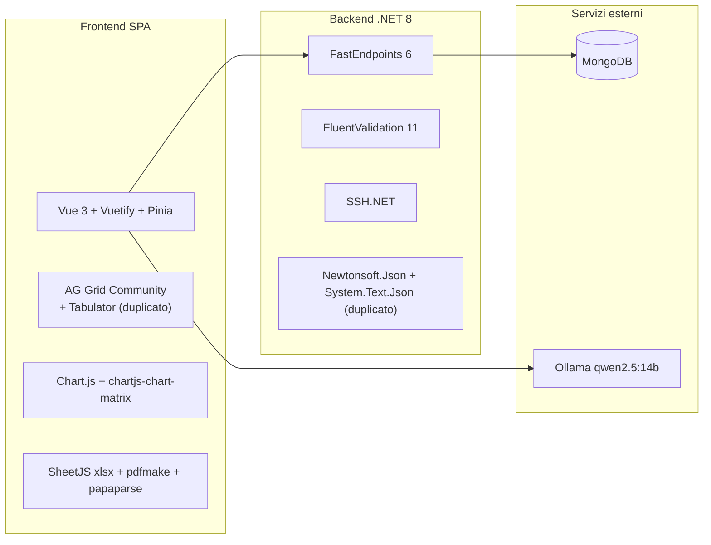
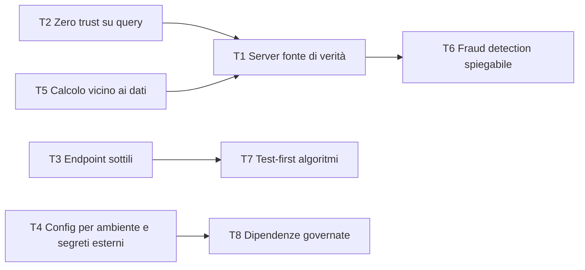

<!-- IMPACT-META
schema: 1
mode: how
step: 05_principles
commit: fc7d820908b8b230fb47a2669920ba7efdb413a8
commit_short: fc7d820
branch: main
worktree: dirty
baseline_date: 2026-10-07T18:19:51+02:00
generated_at: 2026-10-08T09:38:00+02:00
-->
# Principles - Progetto LOSS_PREVENTION

> **Baseline commit:** `fc7d820` (`main`) · worktree `dirty` (modifiche locali solo in `Docs/` e `.github/`; codice applicativo identico al commit)

**Data**: 2026-10-08  
**Versione**: 1.1  
**Autori**: IMPACT REVERSE how (analisi statica del codice + verifica IMPACT)  
**Audience**: Team tecnico, architetti, developer

---

### Metodo e convenzioni

- Il repository **non dichiara principi** di architettura o sviluppo: nessun README tecnico, ADR, `.editorconfig` o guida di contribuzione. Questo documento **ricostruisce i principi impliciti** dal codice al commit `fc7d820`, ne misura l'adesione e propone i principi target.
- Scala di adesione: 🟢 Alto (applicato con poche eccezioni) · 🟡 Medio (applicato con violazioni rilevanti) · 🔴 Basso (assente o contraddetto).
- La documentazione storica del fornitore (`Docs/roadmap.txt`, ecc.) **non esiste al baseline**: era presente solo nel commit `593f6de` ed è stata rimossa in `d768cd9`. Si legge con `git show 593f6de:customspa-it-loss-prevention-d098a8b97860/Docs/<file>` dalla root `C:\repository\LOSS_PREVENTION`.

---

## Sezioni Principali

## 1. Architectural Principles

Il backend segue una stratificazione a 5 progetti e il pattern REPR di FastEndpoints; il dato è schema-on-read. Questi principi sono però indeboliti da dipendenze invertite, astrazioni che "perdono" e da una forte quota di logica nel client.

### 1.1 Principi architetturali impliciti

| # | Principio (implicito) | Evidenza positiva | Violazioni | Adesione |
|---|-----------------------|-------------------|-----------|----------|
| P1 | **Separazione a layer** (API / Application / Domain / Infrastructure + console) | 5 progetti; request/response in `Application/Handlers/Requests`, DTO in `Application/DTO` | `LossPrevention.Application` **referenzia** `LossPrevention.Infrastructure` (`LossPrevention.Application.csproj`), quindi la dipendenza è invertita rispetto alla Clean Architecture; il Domain dipende da `MongoDB.Bson 3.4.0`; 20 endpoint usano direttamente `IMongoRepository<T>`; mapping DTO↔entità inline negli endpoint FraudDetection (388/407 righe) | 🟡 Medio |
| P2 | **REPR / un endpoint per classe** (FastEndpoints) | 78 classi endpoint, ognuna con `Configure()` + `HandleAsync()` | — | 🟢 Alto |
| P3 | **Least privilege con permessi dichiarativi** | `Permissions("CAN_…")` su 74/78 endpoint (4 `AllowAnonymous`: `LoginEndpoint`, `ForgotPasswordEndpoint`, `ResetPasswordEndpoint`, `ValidateResetTokenEndpoint`) | Row-level lock applicato solo nel client (`fieldLock.ts`); pipeline di query arbitraria dal client (`GetReportDataEndpoint.cs:66-69`); 37 permessi usati dagli endpoint, 41 definiti negli script di seed, quindi il catalogo non è allineato | 🟡 Medio |
| P4 | **Schema-on-read** | Mapping generati dai dati (`MappingService.ProcessMappings`), tipi finalizzati a posteriori | Nessuna validazione dei file in ingresso; i nomi dei campi sorgente diventano il contratto (vedi [04_constraints.md](04_constraints.md) §3.2) | 🟢 Coerente |
| P5 | **Generic repository** | Un solo `MongoRepository<TDocument>` riusato da tutti i servizi | Espone `Collection` (`IMongoRepository.cs:170`, `MongoRepository.cs:27`): leaky abstraction usata in `RulesService.cs:41, 58` | 🟡 Medio |
| P6 | **Monolite modulare con job in-process** | Ingestione schedulata come `BackgroundService` nello stesso processo dell'API (`Program.cs:111`) | Impedisce lo scale-out (vedi [03_non_functional_overview.md](03_non_functional_overview.md) NFR-AV-01) | 🟡 Medio |
| P7 | **Configurazione esternalizzata** | `MongoDbSettings`, `JwtSettings`, `DataRetention`, `Email` in `appsettings.json` | Segreto JWT in chiaro nel repository; CORS (`Program.cs:29`), SMTP SSL (`EmailService.cs:64`), URL LLM (`aiStore.ts:88`) e path della console (`DataIngestionService/Program.cs:76`) hardcoded | 🔴 Basso |
| P8 | **Fat client / smart UI** | Report builder ricco e reattivo | Logica di business (motore statistico, `aiStore.ts`) e di sicurezza (lock) nel browser | 🔴 Problematico |
| P9 | **Security by design sulle credenziali** | PBKDF2-SHA256 600.000 iterazioni con upgrade degli hash legacy (`PasswordHasher.cs:9-10`); token di reset hashati, validi 1 h | Hash e salt restituiti dall'API (`GetUsersEndpoint.cs:36`); nessun rate limiting | 🟡 Medio |

### 1.2 Struttura delle dipendenze tra progetti (as-is)



### 1.3 Esempi concreti

**P2 – REPR (positivo)** — `LossPrevention.API/Endpoints/Rules/ApplyRulesEndpoint.cs:18-19`:
```csharp
Get("/rules/apply");
Permissions("CAN_APPLY_RULE");
```

**P5 – leaky abstraction** — `LossPrevention.Application/Services/Data/Rules/RulesService.cs:40-41`:
```csharp
var unsetUpdate = Builders<BsonDocument>.Update.Unset("FraudFlags");
await _reportDataRepository.Collection.UpdateManyAsync(FilterDefinition<BsonDocument>.Empty, unsetUpdate);
```

**P8 – violazione** — `LossPrevention.UI/src/stores/aiStore.ts:1768-1773`:
```ts
const fn = new Function(
  "row",
  `try { return (${rule.condition}) } catch { return false }`
);
```
Le regole antifrode sono generate come stringhe JS e compilate nel browser: non riusabili dal backend, non testabili in isolamento, non auditabili.

---

## 2. Design Principles (SOLID, DRY, KISS)

Il codice applica in modo corretto DI e Strategy, ma viola DRY e KISS proprio nei punti più critici del dominio (configurazione antifrode e motore statistico).

| Principio | Adesione | Evidenza positiva | Violazione (evidenza) |
|-----------|----------|-------------------|-----------------------|
| **S** – Single Responsibility | 🔴 Basso | Endpoint piccoli per le entità semplici (es. `DeleteUserByIdEndpoint`) | `aiStore.ts` (1.994 righe) mescola client LLM, generazione regole, metriche cross-transazione e analisi; `resultsGrid.vue` 2.271 righe (griglia, export, analisi, paginazione); `GetFraudDetectionSettingsEndpoint` 222 righe |
| **O** – Open/Closed | 🟢 Alto | Nuovo formato file = nuova classe `IFileProcessingService` + 1 registrazione (`Program.cs:102-104`) | Punto di estensione `IXmlEnrichmentRule` previsto ma senza implementazioni (codice speculativo) |
| **L** – Liskov Substitution | 🟡 Medio | XML/CSV/JSON intercambiabili nel `FileProcessingCoordinator` | `XmlProcessingService.InsertManyAsync` lancia `NotImplementedException("Use FileProcessingCoordinator.RunIngestionAsync instead")` (`XmlProcessingService.cs:43`) |
| **I** – Interface Segregation | 🟡 Medio | Interfacce di servizio per area (`IRuleConfigurationService`, `IPasswordResetService`, `IMappingService`, …) | `IMongoRepository<T>` "grassa": CRUD, aggregazioni, indici **e** `Collection` grezza |
| **D** – Dependency Inversion | 🟡 Medio | Constructor injection ovunque; servizi registrati in `Program.cs:83-107` | Application dipende da Infrastructure (§1.2); `PasswordHasher` è una `static class` (`PasswordHasher.cs:5`), non sostituibile nei test; `AddSingleton<MongoDbSettings>()` (`Program.cs:83`) accanto alle `IOptions` |
| **DRY** | 🔴 Basso | Helper condivisi (`RuleHelper`, `DistanceHelper`) | `CreateFraudDetectionSettingsEndpoint` (388 righe) e `UpdateFraudDetectionSettingsEndpoint` (407 righe) contengono lo stesso mapping manuale DTO→entità; `UpdateDashboardValidator` definito **due volte** (`Validators/CreateDashboardValidator.cs:18`, namespace `LossPrevention.Application.Dashboards.Validation`, e `Validators/UpdateDashboardValidator.cs:6`, namespace `LossPrevention.Application.Handlers.Requests.Dashboard`) |
| **KISS** | 🔴 Basso | `DistanceHelper.ComputeDistance` (distanza euclidea in 18 righe, `DistanceHelper.cs:8-25`) | `buildGenericFraudRuleTemplates` CCN 87 / 254 NLOC (`aiStore.ts:1203-1530`); `enrichWithCrossTransactionMetrics` CCN 43 (righe 986-1142); `analyzeFraudInData` CCN 34 (righe 1667-1922), misurati con lizard. Il `ServiceProvider` temporaneo costruito per leggere `JwtSettings` (`Program.cs:41-47`, con un commento "Load rules from MongoDB" che non corrisponde al codice) |
| **YAGNI** | 🟡 Medio | — | Dipendenze npm non usate (`nuxt`, `jspdf`, `jspdf-autotable`, `grid-layout-plus`); flag `ManualLoad` salvato ma mai letto; endpoint `POST /data/create-transactions` che non persiste. La roadmap storica chiedeva già "Refactor - Clean up code, remove any YAGNI code and ensure DRY is adhered to" (`roadmap.txt:43`, `593f6de`) |

**Esempio OCP/Strategy (positivo)** — `LossPrevention.API/Program.cs:101-104`:
```csharp
// File Processing Services (XML, CSV, JSON)
builder.Services.AddScoped<IFileProcessingService, XmlProcessingService>();
builder.Services.AddScoped<IFileProcessingService, CsvProcessingService>();
builder.Services.AddScoped<IFileProcessingService, JsonProcessingService>();
```

**Esempio KISS/DIP (negativo)** — `LossPrevention.API/Program.cs:41-47`:
```csharp
// Load rules from MongoDB using a temporary provider
var tempServices = new ServiceCollection();
tempServices.AddInfrastructureServices(builder.Configuration);
tempServices.AddRepositoryServiceCollection(builder.Configuration);
using var tempProvider = tempServices.BuildServiceProvider();
var settings = tempProvider.GetRequiredService<IOptions<JwtSettings>>().Value;
```
Basterebbe `builder.Configuration.GetSection("JwtSettings").Get<JwtSettings>()`; il provider temporaneo duplica le registrazioni di Infrastructure.

---

## 3. Development Principles

Non esistono pratiche di sviluppo codificate: niente test, CI, branching o code review tracciabili. La roadmap storica le indicava come obiettivi, ma il codice al baseline non le implementa.

| Pratica | Stato AS-IS (evidenza) | Adesione | Indicazione storica / target |
|---------|------------------------|----------|------------------------------|
| Test automatici | 0 progetti di test .NET; nessuno script `test` in `package.json` (script: `dev`, `build`, `preview`) | 🔴 Assente | "Unit Tests as part of pipeline" (`roadmap.txt:71`, storico) |
| CI/CD | Nessun workflow, pipeline o Dockerfile per il codice applicativo | 🔴 Assente | "Devops setup - Automatic Deployments" (`roadmap.txt:70`, storico) |
| Branching / versioning | 13 commit di un solo autore (`saristot`, 2026-10-05..07); il codice è arrivato in blocco con `593f6de`; nessun tag | 🔴 Non ricostruibile | "Branching Strategy for ease of development" (`roadmap.txt:65`, storico) |
| Code review | **N/A — non ricavabile dal codice**: nessuna PR o storia di review nel repository | — | Review obbligatoria su ogni PR |
| Build riproducibile | `package-lock.json` non allineato a `package.json` (`npm ci` fallisce); range `^` su tutte le dipendenze; 12 import con case errato e un import irrisolvibile (`ScheduleForm.vue:27`) | 🔴 Basso | Build CI verde su Linux |
| Gestione del debito | 13 `TODO` nel C#, 4 nel frontend; 57 `console.log` e 6 `Console.WriteLine` | 🟡 Medio | Debito tracciato in backlog, lint che blocca `console.log` |
| Dati di test | Solo dump di sviluppo (`Data/LossPrevention`); nessun dato reale ("Waiting for Custom", `roadmap.txt:27`, storico) | 🟡 Medio | Dataset anonimizzato rappresentativo |

---

## 4. Coding Standards

Non sono configurati standard automatici (né `.editorconfig`, né linter/formatter, né analyzer bloccanti). Le uniche impostazioni di qualità sono `Nullable`/`ImplicitUsings` in C# e `strict: true` in TypeScript; le convenzioni di nomi sono applicate in modo incoerente.

### 4.1 Configurazione degli standard

| Aspetto | Backend (C#) | Frontend (TS/Vue) |
|---------|--------------|-------------------|
| Strumenti di stile | Nessun `.editorconfig` né `Directory.Build.props` | Nessuna configurazione ESLint/Prettier |
| Analisi statica | `Nullable` e `ImplicitUsings` abilitati nei 5 csproj; nessun `TreatWarningsAsErrors` | `tsconfig.json:6` `"strict": true`; `vue-tsc ^1.2.0` installato ma non usato negli script |
| Validazione input | FluentValidation 11.11.0, ma solo 4 validator (tutti per le dashboard) | Validazione nei form Vuetify |
| Gestione errori | 31 blocchi `catch (Exception …)`, spesso con `ex.Message` restituito al client | `try/catch` con toast; 57 `console.log` |

### 4.2 Convenzioni di naming (incoerenze rilevate)

| Ambito | Esempi | Problema |
|--------|--------|----------|
| File C# | `DistanceDataservice.cs`, `ReportDataservice`, `IDistanceDataservice` | "service" minuscolo, diverso dal resto (`RulesService`, `UserService`) |
| Progetti | `01. LossPrevention.API.csproj`, `02. LossPrevention.DataIngestionService.csproj` | Prefissi numerici con punto e spazio nel nome del progetto |
| Namespace | `Domain/Entities/Workspaces/{Query,Tab,Workspace}.cs` → `LossPrevention.Application.Entities.Workspaces`, mentre `Condition.cs` e `Field.cs` nella stessa cartella → `LossPrevention.Domain.Entities.Workspaces`; Dashboards/Groups/Notifications → `LossPrevention.Domain.Dashboards` (senza `.Entities`) | Namespace che non riflette cartella e layer |
| Collocazione | `DatabaseInitializationService` (classe concreta) in `Application/Interfaces/Data/`; `IndexService` nel file `IndexSuggestionHelper.cs`; `RuleConfigurationService` nel file `RulesService.cs` | Nome file / cartella diverso dal tipo |
| File FE | `rolestore.ts`, `workspacestore.ts`, `chartblock.vue` accanto a `PasswordResetStore.ts`, `loginStore.ts`, `resultsGrid.vue` | Mix di minuscolo, camelCase e PascalCase; causa i 12 import con case errato |
| Pacchetto FE | `package.json` → `"name": "workflowbuilder"` | Nome non correlato al prodotto (residuo di template) |
| Commenti | `// NEW: Include ManualLoad` (5 occorrenze, es. `DataIngestionService.cs:43, 62, 87`) | Commenti "cronologici" invece che descrittivi |

---

## 5. Technology Selection Principles

Le scelte tecnologiche privilegiano framework open source mainstream e leggeri. Mancano però una governance delle dipendenze (duplicati, pacchetti non usati, versioni disallineate) e un principio esplicito di selezione.

### 5.1 Principi impliciti di selezione

| Principio implicito | Evidenza | Valutazione |
|---------------------|----------|-------------|
| Framework leggeri invece di MVC classico | FastEndpoints 6.0.0 (+ `.Security`, `.Swagger`) al posto dei controller ASP.NET | 🟢 Coerente con REPR |
| Database documentale per dati eterogenei | MongoDB.Driver 3.4.0, mapping dinamici | 🟢 Coerente con schema-on-read |
| UI framework completo di componenti | Vue ^3.5.12, Vuetify ^3.7.3, Pinia ^2.2.4, vue-router ^4.6.3, Vite ^6.3.5, TypeScript ^5 | 🟢 Stack moderno |
| AI on-premise / locale | Ollama + `qwen2.5:14b` (`aiStore.ts:8`) | 🟡 Nessun dato verso cloud, ma deploy non scalabile |
| Governance versioni | `Microsoft.Extensions.*` 9.0.4 su `net8.0`; `Microsoft.AspNetCore.Http.Features 5.0.17` (obsoleto) nell'Application; `vue-tsc ^1.2.0` molto indietro rispetto a TypeScript 5 | 🔴 Assente |
| Una libreria per esigenza | Due serializzatori (`Newtonsoft.Json 13.0.3` e `System.Text.Json`); due griglie (`ag-grid-vue3` in `resultsGrid.vue`/`tabularBlock.vue`, `tabulator-tables` in `distanceTable.vue`); due layout (`vue-grid-layout-v3` usato in `dashboardGrid.vue`, `grid-layout-plus` non usato); due librerie PDF (`pdfmake` usato, `jspdf` non usato); `axios` usato sia tramite `api/api.ts` sia direttamente in `userStore.ts` | 🔴 Violato |

### 5.2 Mappa delle scelte tecnologiche



---

## 6. Buy vs Build Philosophy

Il progetto **compra (open source) le commodity tecniche** e **costruisce in casa** anche componenti per cui esistono soluzioni consolidate: autenticazione/RBAC, scheduler, motore regole. È la principale fonte di rischio e di manutenzione.

| Capability | Scelta | Evidenza | Valutazione |
|------------|--------|----------|-------------|
| Framework API | **Buy (OSS)** FastEndpoints | `01. LossPrevention.API.csproj` | 🟢 Adeguato |
| Persistenza | **Buy (OSS)** MongoDB + driver | `MongoDB.Driver 3.4.0` | 🟢 Adeguato |
| Griglie, grafici, export | **Buy (OSS)** AG Grid Community, Chart.js, SheetJS, pdfmake, papaparse | `package.json`; uso in `resultsGrid.vue`, `heatmapPreview.vue` | 🟢 Adeguato (attenzione ai limiti della licenza Community, vedi [04_constraints.md](04_constraints.md) C-L09) |
| Trasferimento file | **Buy (OSS)** SSH.NET | `SftpFileProcessingService.cs:56` | 🟢 Adeguato |
| LLM | **Buy (OSS)** Ollama + Qwen2.5 | `aiStore.ts:8, 88` | 🟡 Scelta valida, integrazione da centralizzare |
| Autenticazione e RBAC | **Build**: utenti, ruoli, permessi su Mongo, JWT emesso da `LoginEndpoint.cs:72`, `PasswordHasher` PBKDF2 custom | Nessun ASP.NET Core Identity o IdP esterno (Entra ID, Keycloak) | 🔴 Rischio: niente MFA, lockout, SSO né audit |
| Scheduler | **Build**: polling ogni minuto (`DataIngestionBackgroundService.cs:13, 41`) | Nessun Quartz.NET / Hangfire | 🔴 Stato non persistito (`LastRunAt`), nessuno storico, non clusterizzabile |
| Motore regole | **Build**: `RuleHelper` + `RuleConfigurationService` (file `Services/Data/Rules/RulesService.cs`) | Nessuna libreria di rules engine | 🟡 Semplice e adeguato al dominio, ma senza versioning delle regole |
| Motore statistico antifrode | **Build** in TypeScript nel browser (`aiStore.ts`) | — | 🔴 Da spostare lato server e testare |
| Mapping dei dati | **Build**: schema-on-read (`MappingService`, `XmlToBsonConverterHelper`) | — | 🟢 Specifico del dominio, giustificato |
| Distanza tra transazioni | **Build**: `DistanceHelper.ComputeDistance` (distanza euclidea, `Math.Sqrt` alla riga 24) | — | 🟢 Semplice, giustificato |

---

## 7. Principi target proposti

I principi target traducono le violazioni rilevate in regole verificabili automaticamente (fitness function), da usare come guida per [06_software_architecture.md](06_software_architecture.md) e [19_modernization_estimation_spec.md](19_modernization_estimation_spec.md).

| # | Principio | Razionale | Regola verificabile (fitness function) |
|---|-----------|-----------|----------------------------------------|
| T1 | **Il server è la fonte di verità** per sicurezza e decisioni antifrode | Compliance, audit, riproducibilità | Nessun filtro di sicurezza solo nel client; i risultati antifrode sono persistiti |
| T2 | **Zero trust sugli input di query** | Evitare esfiltrazione di dati | Pipeline validata da whitelist di stage/operatori; test che rifiutano `$lookup`, `$out`, `$merge`, `$unionWith`, `$function`, `$where` |
| T3 | **Endpoint sottili, servizi spessi** | Testabilità | ArchUnitNET: nessun tipo in `LossPrevention.API.Endpoints` dipende da `IMongoRepository<>` |
| T4 | **Configurazione per ambiente, segreti fuori dal repository** | Sicurezza | Secret scanning in CI (es. gitleaks); `appsettings.json` senza valori sensibili |
| T5 | **Batch e calcoli pesanti vicino ai dati** | Prestazioni | Nessun `GetAllAsync()` su `ReportData`; operazioni massive con `BulkWrite` / update via pipeline |
| T6 | **Fraud detection spiegabile** | Uso su dipendenti (GDPR, Statuto dei Lavoratori) | Ogni flag salva regola, versione delle soglie, valori e timestamp |
| T7 | **Test-first sugli algoritmi** | Regole e distanze sono funzioni pure | Coverage ≥ 80% su `RuleHelper`, `DistanceHelper` e motore statistico |
| T8 | **Una libreria per esigenza, dipendenze governate** | Superficie di vulnerabilità e licenze | Audit dipendenze in CI; 0 pacchetti non usati; versioni `Microsoft.Extensions.*` allineate al runtime |



---

## Reference Documents

- **Deep Dive Analysis**: [00_deep_dive.md](00_deep_dive.md)
- **Context**: [01_context.md](01_context.md)
- **Functional Overview**: [02_functional_overview.md](02_functional_overview.md)
- **Non-Functional Overview**: [03_non_functional_overview.md](03_non_functional_overview.md)
- **Constraints**: [04_constraints.md](04_constraints.md)
- Documenti IMPACT correlati: [06_software_architecture.md](06_software_architecture.md) · [07_code.md](07_code.md) · [08_data.md](08_data.md) · [09_infrastructure_architecture.md](09_infrastructure_architecture.md) · [10_deployment.md](10_deployment.md) · [11_development_environment.md](11_development_environment.md) · [12_operation_and_support.md](12_operation_and_support.md) · [13_decision_log.md](13_decision_log.md) · [14_metrics.md](14_metrics.md) · [15_fp_cocomo.md](15_fp_cocomo.md) · [16_frontend_deep_assessment.md](16_frontend_deep_assessment.md) · [17_backend_deep_assessment.md](17_backend_deep_assessment.md) · [18_antipattern_deep_dive.md](18_antipattern_deep_dive.md) · [19_modernization_estimation_spec.md](19_modernization_estimation_spec.md)

---

## Change Log

| Versione | Data | Autore | Modifiche |
|----------|------|--------|-----------|
| 1.0 | 2026-10-07 | REVERSE how (FULL) | Creazione documento (sostituisce run 2026-10-05) |
| 1.1 | 2026-10-08 | IMPACT verify | Header/baseline `dirty`. Documento ristrutturato nelle 6 sezioni del prompt; P1-P9 mantenuti in §1. Aggiunti: diagramma delle dipendenze tra progetti, con la dipendenza Application→Infrastructure e il Domain legato a `MongoDB.Bson`; §2 SOLID/DRY/KISS/YAGNI con evidenze, CCN misurati con lizard e snippet; §3 Development Principles; §4 Coding Standards (configurazione e incoerenze di naming/namespace); §5 Technology Selection (librerie duplicate o inutilizzate, mappa tecnologica); §6 Buy vs Build; principio target T8. Mermaid dei principi target con tutti i nodi etichettati (prima T4 era isolato e senza etichetta). Corretti: snippet `new Function` riportato come nel codice (`aiStore.ts:1768-1773`), riferimenti `file:riga`, citazioni della roadmap marcate come storiche (`593f6de`, rimosse in `d768cd9`). Reference Documents completi |
