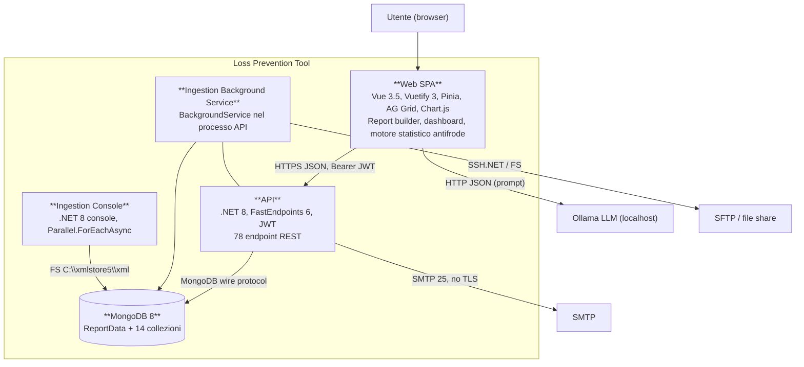
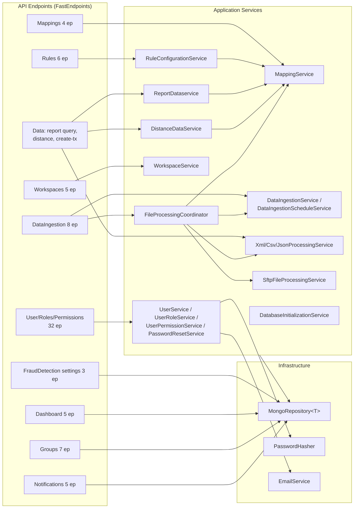
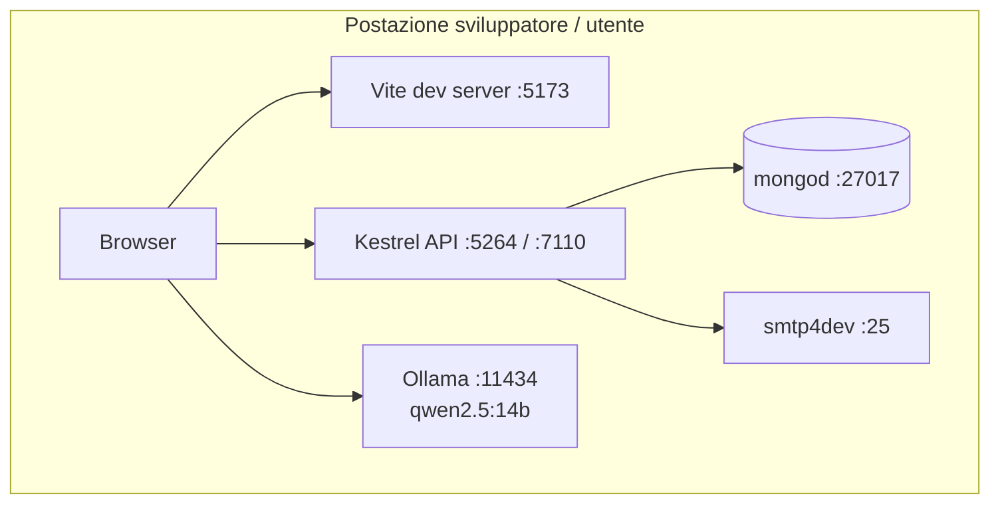
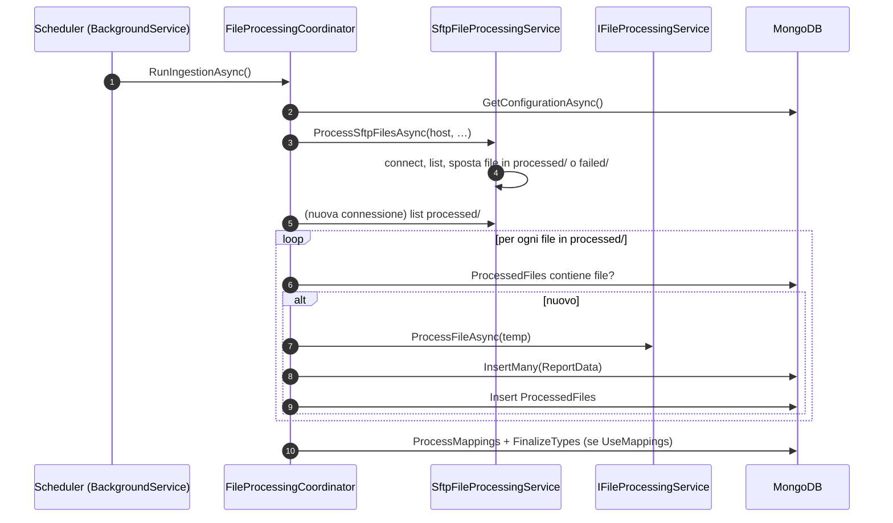

<!-- REVERSE-META
schema: 1
mode: how
step: 06_software_architecture
commit: 593f6decec3a642d5567754dd795b19560bb0afb
commit_short: 593f6de
branch: main
worktree: clean
baseline_date: 2026-10-05T10:14:05+00:00
generated_at: 2026-10-07T14:40:00Z
-->
# Software Architecture - Progetto LOSS_PREVENTION

> **Baseline commit:** `593f6de` (`main`) · worktree `clean`

**Data**: 2026-10-07 · **Versione**: 1.0 · **Autori**: REVERSE how · **Audience**: team tecnico, architetti, developer

---

## 1. Architecture Style & Patterns

| Livello | Stile / pattern | Dove |
|---------|-----------------|------|
| Sistema | **Monolite modulare** + processo batch separato, database condiviso | soluzione `.sln` |
| Backend | **Layered** (API → Application → Domain, Infrastructure trasversale) | 5 progetti |
| API | **REPR** (Request-Endpoint-Response) con FastEndpoints | `Endpoints/**` |
| Persistenza | **Generic Repository** su MongoDB | `MongoRepository<T>` |
| Ingestione | **Strategy** + **Coordinator** | `IFileProcessingService`, `FileProcessingCoordinator` |
| Arricchimento | **Chain of rules** (`IXmlEnrichmentRule`) | previsto, nessuna regola registrata |
| Scheduling | **Polling Background Service** | `DataIngestionBackgroundService` (60 s) |
| Frontend | **SPA con store centralizzati** (Pinia) e componenti "smart" | `src/stores`, `src/components` |
| Antifrode | **Rule engine dichiarativo** (server) + **heuristic engine generato a runtime** (client) | `RuleHelper` / `aiStore` |

## 2. Containers & Technology Choices (C4 Level 2)

| Container | Tecnologia | Responsabilità | Scelta motivata? |
|-----------|-----------|----------------|------------------|
| Web SPA | Vue 3 + Vite | UI, query builder, statistica antifrode, chiamate LLM | Nuxt dichiarato ma non usato |
| API | .NET 8 + FastEndpoints | Auth, CRUD configurazioni, query, regole, distance, ingestione | Coerente con performance FastEndpoints |
| Background service | `IHostedService` | Ingestione schedulata | Semplice ma non scalabile orizzontalmente |
| Console | .NET console | Bulk load XML di sviluppo | Tool interno (path hardcoded) |
| MongoDB | 8.x | Persistenza dati transazionali schema-less e configurazioni | Adatto a dati POS eterogenei |

## 3. Component Diagram (C4 Level 3 – API)

Componenti frontend principali:

| Componente | Righe | Responsabilità |
|-----------|-------|----------------|
| `components/reports/resultsGrid.vue` | 2.271 | Griglia risultati, campi calcolati (`eval`), export, avvio analisi antifrode, evidenziazione |
| `stores/aiStore.ts` | 1.994 | LLM (NLQ, report template), classificazione semantica campi, statistiche, 30 euristiche, valutazione |
| `components/reports/selectFields.vue` | 823 | Selezione campi/aggregazioni |
| `stores/fraudDetectionStore.ts` | 728 | Soglie, default, import/export, metadati frodi |
| `components/reports/queryBuilderTabs.vue` | 693 | Tab di report, salvataggio workspace |
| `components/reports/FraudSettingsDialog.vue` | 595 | Editor soglie |

## 4. Deployment Diagram (AS-IS di sviluppo)

Il deployment di produzione **non è definito** nel codice; la proposta del fornitore (Azure) è descritta nel documento 09 (Infrastructure Architecture).

## 5. Integration Architecture

| Integrazione | Stile | Sincrono? | Sicurezza | Gestione errori |
|-------------|-------|-----------|-----------|-----------------|
| SPA ↔ API | REST/JSON | Sì | JWT Bearer, CORS localhost | Toast FE; `SendErrorsAsync` BE |
| SPA ↔ Ollama | HTTP JSON `/api/generate` | Sì (fino a minuti) | Nessuna | `try/catch` con log console |
| API ↔ SFTP | File transfer (pull) | Batch | Password, no host-key check | Errori aggregati in `FileProcessingResult.Errors` |
| API ↔ FS | Lettura directory | Batch | Permessi OS | idem |
| API ↔ SMTP | SMTP | Sì | Nessun TLS | log |

## 6. Architectural Risks & Mitigation

| # | Rischio | Prob. | Impatto | Mitigazione proposta |
|---|---------|-------|---------|----------------------|
| R1 | Data exfiltration/manomissione via pipeline arbitraria | Alta | Critico | Query DSL lato server o whitelist stage; utente DB read-only per le query |
| R2 | Bypass row-level lock | Alta | Critico | Iniettare `$match` sul lock lato server in ogni query/distance/export |
| R3 | Risultati antifrode non riproducibili | Alta | Alto | Motore statistico server-side + collezione `FraudFindings` |
| R4 | Funzioni AI non funzionanti in produzione | Alta | Alto | AI gateway nel backend (Ollama server / Azure OpenAI) con configurazione |
| R5 | Scale-out impossibile (cache + scheduler in-process) | Media | Alto | Cache distribuita/invalida su eventi; scheduler con lock distribuito (Hangfire/Quartz con store Mongo) |
| R6 | Degrado performance su volumi reali | Alta | Alto | Indici, bulk ops, rimozione `GetAllAsync` su `ReportData` |
| R7 | Accoppiamento ai nomi campo POS | Media | Medio | Mapping semantico esplicito (`semanticType`) gestito in UI |
| R8 | Fine supporto .NET 8 | Certa | Medio | Upgrade .NET 10 |

---

## Reference Documents
- 00_deep_dive.md · 01_context.md · 02_functional_overview.md · 03_non_functional_overview.md · 04_constraints.md · 05_principles.md

## Change Log

| Versione | Data | Autore | Modifiche |
|----------|------|--------|-----------|
| 1.0 | 2026-10-07 | REVERSE how (FULL) | Creazione documento (sostituisce run 2026-10-05) |
