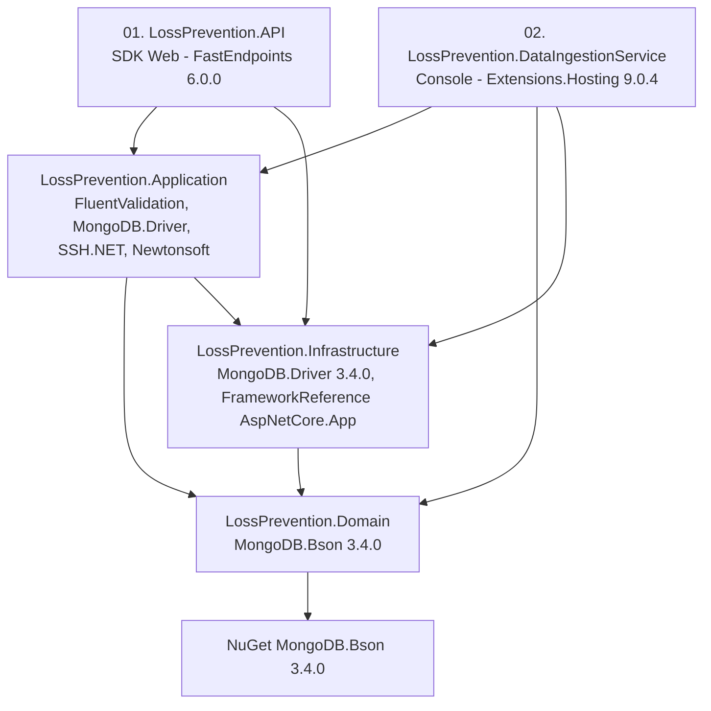
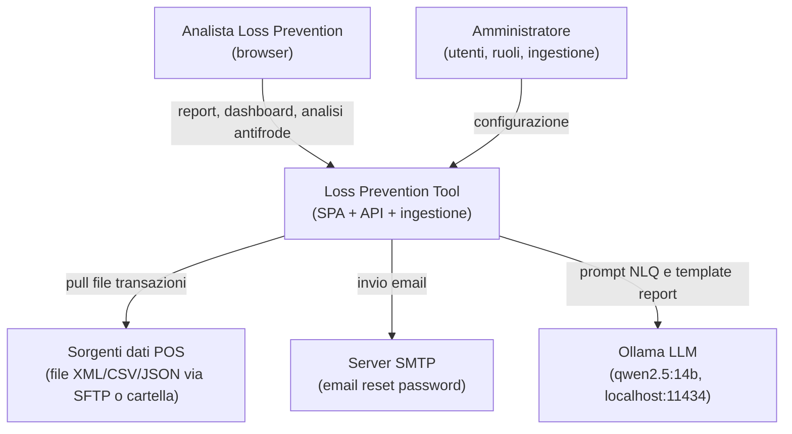
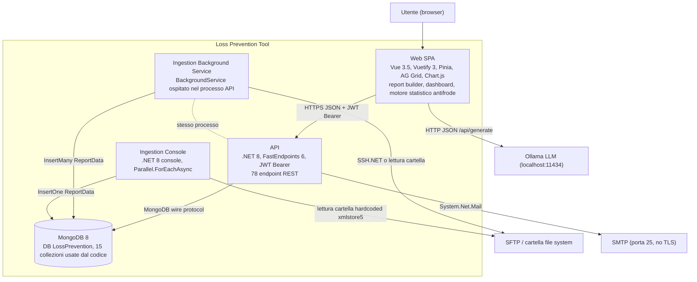
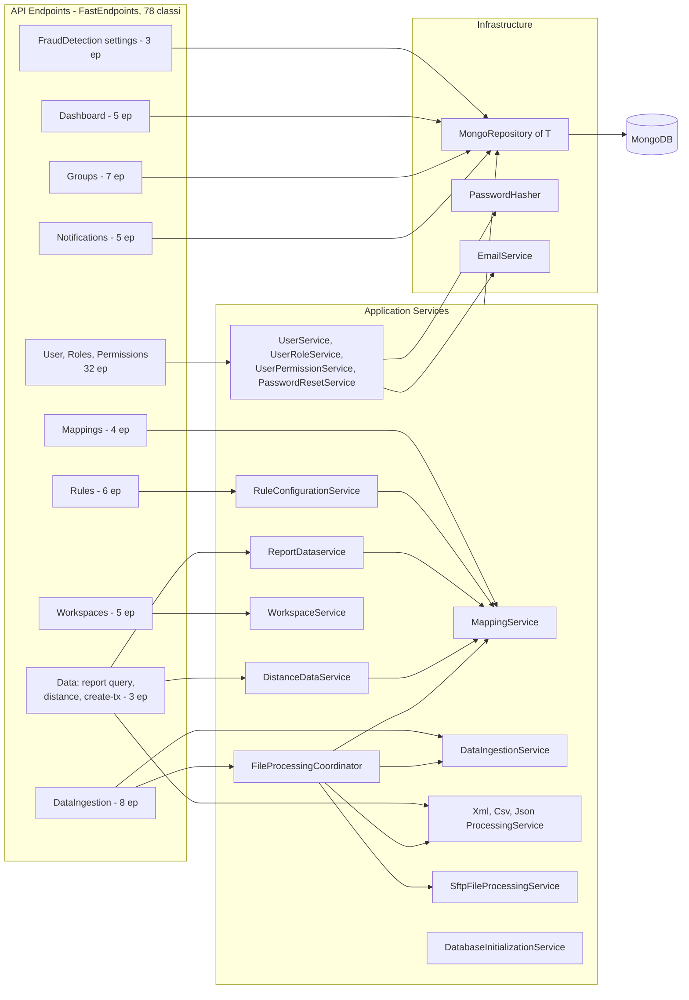
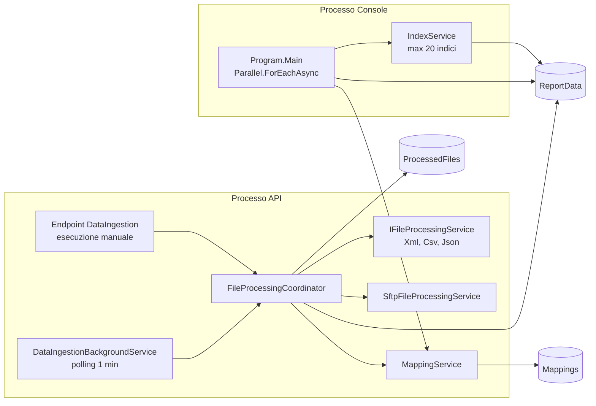
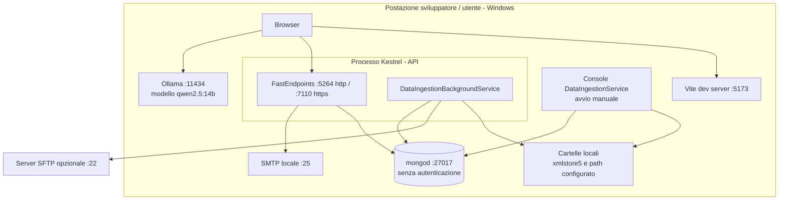
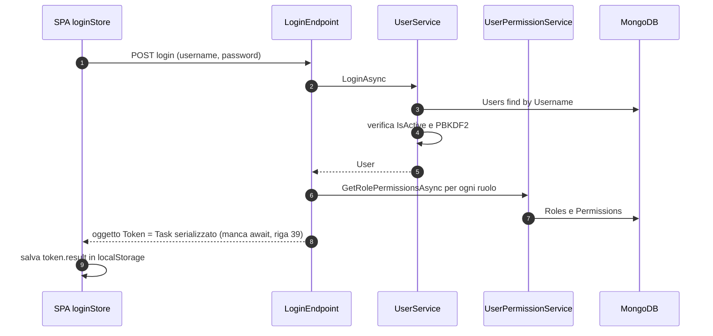
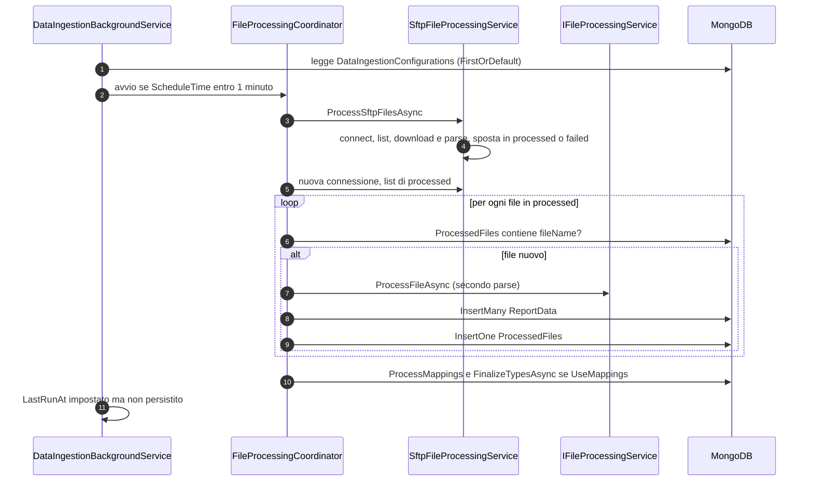
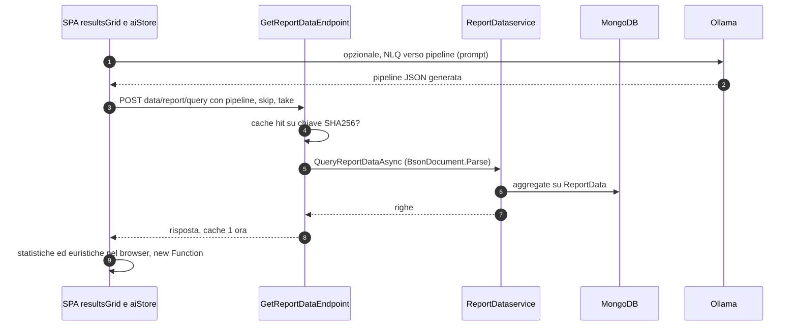

<!-- IMPACT-META
schema: 1
mode: how
step: 06_software_architecture
commit: fc7d820908b8b230fb47a2669920ba7efdb413a8
commit_short: fc7d820
branch: main
worktree: dirty
baseline_date: 2026-10-07T18:19:51+02:00
generated_at: 2026-10-08T09:21:30+02:00
-->
# Software Architecture - Progetto LOSS_PREVENTION

> **Baseline commit:** `fc7d820` (`main`) · worktree `dirty` (modifiche locali solo in `Docs/` e `.github/`; codice applicativo identico al commit)

**Data**: 2026-10-08  
**Versione**: 1.1  
**Autori**: IMPACT REVERSE how (verifica 2026-10-08)  
**Audience**: Team tecnico, architetti, developer

---

## Sezioni Principali

1. [Architecture Style & Patterns](#1-architecture-style--patterns) — stile, grafo reale delle dipendenze tra progetti, pattern con evidenze
2. [Containers & Technology Choices](#2-containers--technology-choices) — C4 Level 1 (contesto) e Level 2 (container)
3. [Component Diagram](#3-component-diagram) — C4 Level 3 di API, ingestione e SPA
4. [Deployment Diagram](#4-deployment-diagram) — vista di deployment AS-IS ricavabile dal codice
5. [Integration Architecture](#5-integration-architecture) — integrazioni, contratti, sequenze
6. [Architectural Risks Mitigation](#6-architectural-risks-mitigation) — rischi architetturali e mitigazioni

Convenzioni: i percorsi sono relativi a `customspa-it-loss-prevention-d098a8b97860/`; `file:N` indica il numero di riga al commit `fc7d820`.

---

## 1. Architecture Style & Patterns

**Sintesi.** Il sistema è un **monolite modulare a layer** (5 progetti .NET 8 in un'unica soluzione) con un database documentale condiviso (MongoDB) e una **SPA Vue 3** che contiene una quota rilevante della logica di business. La stratificazione è solo nominale: `Application` dipende da `Infrastructure` e `Domain` dipende dal driver MongoDB, quindi **non** si tratta di una Clean/Hexagonal Architecture.

### 1.1 Stile architetturale per livello

| Livello | Stile / pattern | Evidenza |
|---------|-----------------|----------|
| Sistema | **Monolite modulare** + processo batch separato (console), **database condiviso** | `LossPrevention.sln` (5 progetti); stesso DB `LossPrevention` in `LossPrevention.API/appsettings.json` e `LossPrevention.DataIngestionService/appsettings.json` |
| Backend | **Layered "rilassato"**: API → Application → Infrastructure → Domain (Application salta verso Infrastructure) | `ProjectReference` nei 5 csproj (vedi §1.2) |
| API | **REPR** (Request-Endpoint-Response) con FastEndpoints 6.0.0, una classe per endpoint | 78 classi in `LossPrevention.API/Endpoints/**` |
| Persistenza | **Generic Repository** su MongoDB con "escape hatch" `Collection` | `LossPrevention.Infrastructure/Repositories/MongoRepository.cs:27` |
| Ingestione | **Strategy** (`IFileProcessingService` ×3) + **Coordinator** | `LossPrevention.API/Program.cs:102-105` |
| Arricchimento | **Chain of rules** (`IXmlEnrichmentRule`) | interfaccia presente, **nessuna implementazione** registrata → no-op |
| Scheduling | **Polling Background Service** in-process (ogni 1 min) | `Application/Services/DataIngestion/DataIngestionBackgroundService.cs:13,28,41` |
| Frontend | **SPA** con store centralizzati (Pinia, 15 store) e componenti "smart" | `LossPrevention.UI/src/stores`, `src/components` |
| Antifrode | **Rule engine dichiarativo** server-side + **motore euristico** generato a runtime nel browser | `Application/Helpers/RuleHelper.cs`, `UI/src/stores/aiStore.ts` (`new Function` a riga 1769) |

### 1.2 Grafo reale delle dipendenze tra progetti

Riferimenti verificati nei file `*.csproj` (tutti `net8.0`):

| Progetto | csproj | Riferimenti a progetto | Pacchetti principali | File C# / righe non vuote |
|----------|--------|------------------------|----------------------|---------------------------|
| API | `LossPrevention.API/01. LossPrevention.API.csproj` | Application, Infrastructure | FastEndpoints 6.0.0, FastEndpoints.Security 6.0.0, FastEndpoints.Swagger 6.0.0, Microsoft.Extensions.Configuration(+Binder) 9.0.4 | 79 / 4.347 |
| Application | `LossPrevention.Application/LossPrevention.Application.csproj` | Domain, **Infrastructure** | FluentValidation 11.11.0, MongoDB.Bson/Driver 3.4.0, Newtonsoft.Json 13.0.3, SSH.NET 2025.1.0, Microsoft.AspNetCore.Http.Features **5.0.17** (obsoleto) | 121 / 5.005 |
| Infrastructure | `LossPrevention.Infrastructure/LossPrevention.Infrastructure.csproj` | Domain | MongoDB.Driver 3.4.0, Microsoft.Extensions.* 9.0.4, FrameworkReference `Microsoft.AspNetCore.App` | 10 / 784 |
| Domain | `LossPrevention.Domain/LossPrevention.Domain.csproj` | — | **MongoDB.Bson 3.4.0** (attributi `[BsonId]`, `[BsonElement]` nelle entità) | 21 / 519 |
| Console | `LossPrevention.DataIngestionService/02. LossPrevention.DataIngestionService.csproj` | Application, Domain, Infrastructure | Microsoft.Extensions.Hosting 9.0.4 | 1 / 105 |

Nessun progetto di test, nessun Dockerfile, nessuna pipeline CI/CD nel repository.

### 1.3 Deviazioni dallo stile dichiarato

| # | Deviazione | Evidenza | Conseguenza |
|---|-----------|----------|-------------|
| A1 | `Application` → `Infrastructure` (dipendenza verso il basso "concreta") | `ProjectReference` in `LossPrevention.Application.csproj`; i servizi iniettano `IMongoRepository<T>` (in Infrastructure) e usano `MongoDbSettings`/`PasswordHasher` | Nessuna inversione delle dipendenze: la logica applicativa non è testabile senza MongoDB e non è sostituibile la persistenza |
| A2 | `Domain` dipende da `MongoDB.Bson` | `LossPrevention.Domain.csproj`; es. `Entities/Users/User.cs` usa `ObjectId` e `[BsonId]` | Modello di dominio accoppiato al formato di persistenza |
| A3 | Endpoint che accedono direttamente ai repository saltando l'Application layer | 4 endpoint Dashboard, 3 FraudDetection, 7 Groups, 5 Notifications iniettano `IMongoRepository<...>` | Logica di business (mapping, validazioni) dispersa negli endpoint |
| A4 | Namespace incoerenti con il progetto | `DataIngestionBackgroundService` (in Application) ha namespace `LossPrevention.Infrastructure.Services`; `Workspace`/`Tab`/`Query` (in Domain) hanno namespace `LossPrevention.Application.Entities.Workspaces`; `MappingHelper` ha namespace `FraudDetectionApp.Helpers` | Navigazione e refactoring difficili |
| A5 | Logica di business nel browser | `aiStore.ts` (1.994 righe): statistiche, 30 euristiche antifrode, NLQ via LLM | Risultati non riproducibili né auditabili lato server |

### 1.4 Catalogo pattern con evidenze

| Pattern | Implementazione | Evidenza |
|---------|-----------------|----------|
| Dependency Injection (MS DI) | Registrazioni nel composition root + extension method di Infrastructure | `API/Program.cs:83-111`; `Infrastructure/InfrastructureServiceExtensions.cs:23-149` |
| Factory registration per repository | 14 factory `IMongoRepository<T>` (13 tipi; `User` registrato due volte) | `InfrastructureServiceExtensions.cs:42-149` (duplicato a 65-77) |
| Options pattern | `MongoDbSettings`, `JwtSettings` via `Options.Create` | `InfrastructureServiceExtensions.cs:26-31` |
| Cache-aside | `IMemoryCache` sui risultati di query (TTL 1 h, chiave SHA256) | `API/Endpoints/Data/GetReportDataEndpoint.cs:55,81` |
| Hosted service | `DataIngestionBackgroundService` (scope per ciclo) | `DataIngestionBackgroundService.cs:49`; `Program.cs:111` |
| Startup initializer | `DatabaseInitializationService.InitializeAsync` (TTL index) | `Program.cs:115-119`; `Application/Interfaces/Data/DatabaseInitializationService.cs:43-116` |
| Static helper | `BsonHelper`, `RuleHelper`, `DistanceHelper`, `XmlToBsonConverterHelper`, `PasswordHasher` | `Application/Helpers/*.cs`, `Infrastructure/Helpers/PasswordHasher.cs` |
| Claims-based authorization | Claim `permissions` nel JWT + `Permissions("CAN_...")` negli endpoint (37 permessi distinti) | `API/Endpoints/User/Users/LoginEndpoint.cs:48-68` |

---

## 2. Containers & Technology Choices

**Sintesi.** In esecuzione esistono 3 processi applicativi (SPA servita da Vite, API Kestrel che ospita anche lo scheduler di ingestione, console di bulk load) più MongoDB; le dipendenze esterne sono file POS (SFTP o file system), SMTP e un LLM Ollama invocato **direttamente dal browser**.

### 2.1 C4 Level 1 — System Context

### 2.2 C4 Level 2 — Containers

### 2.3 Container: responsabilità e scelte tecnologiche

| Container | Tecnologia | Processo / porta | Responsabilità | Evidenza | Valutazione della scelta |
|-----------|-----------|------------------|----------------|----------|--------------------------|
| Web SPA | Vue 3.5.14, Vite 6.4.1, Vuetify 3.7.3, Pinia 2.2.4, Axios 1.13.1 | Vite dev server (porta di default 5173) | UI, query builder, dashboard, statistica antifrode, chiamate LLM | `LossPrevention.UI/package.json`, `src/main.ts`, `src/api/api.ts` | Stack moderno; `nuxt` è dipendenza ma l'app **non** usa Nuxt (montata con `createApp`) |
| API | .NET 8, FastEndpoints 6.0.0, JwtBearer | Kestrel `http://localhost:5264`, `https://localhost:7110` | Autenticazione, CRUD configurazioni, query report, regole, distance, ingestione on-demand | `Program.cs`, `Properties/launchSettings.json` | FastEndpoints coerente con REPR e performance; Swagger solo in Development (`Program.cs:121`) |
| Ingestion Background Service | `BackgroundService` | Nel processo API | Ingestione schedulata (polling 1 min, finestra ±1 min su `ScheduleTime`) | `DataIngestionBackgroundService.cs` | Semplice ma **non scalabile orizzontalmente** (ogni istanza API eseguirebbe lo scheduler) |
| Ingestion Console | .NET 8 console + Generic Host | Processo separato, manuale | Bulk load XML di sviluppo da `C:\xmlstore5\xml` | `DataIngestionService/Program.cs:76` | Tool interno (path hardcoded, nessun parametro) |
| MongoDB | MongoDB 8.3.2 (da `Data/LossPrevention/prelude.json`) | `mongodb://localhost:27017` senza credenziali | Persistenza transazioni schema-less e configurazioni | `appsettings.json` | Adatto a dati POS eterogenei; nessuna autenticazione configurata |

### 2.4 Scelte tecnologiche trasversali

| Area | Scelta | Versione | Nota architetturale |
|------|--------|----------|---------------------|
| Runtime | .NET 8 (LTS) | `net8.0` | Fine supporto 10-nov-2026 |
| Accesso dati | MongoDB.Driver | 3.4.0 | Nessun ODM/ORM; repository generico |
| Validazione | FluentValidation | 11.11.0 | 2 validator Dashboard, di fatto **non attivi** (vedi [07_code.md §3](07_code.md#3-framework-usage-mvc-orm-di)) |
| SFTP | SSH.NET | 2025.1.0 | Nessuna verifica host key |
| JSON | Newtonsoft.Json + System.Text.Json | 13.0.3 / BCL | Due librerie per lo stesso scopo |
| Email | `System.Net.Mail.SmtpClient` | BCL | API sconsigliata per nuovi sviluppi |
| LLM | Ollama `qwen2.5:14b` | — | Invocato dal browser (`aiStore.ts:8`, `:88`) |

---

## 3. Component Diagram

**Sintesi.** Il C4 Level 3 mostra che gli endpoint si appoggiano in parte a servizi applicativi e in parte direttamente ai repository; tutti i componenti convergono su `MongoRepository<T>`, mentre la SPA concentra la logica antifrode in `aiStore.ts`.

### 3.1 C4 Level 3 — API

### 3.2 Catalogo componenti backend

| Componente | Tipo / lifetime DI | Responsabilità | Dipendenze principali | Evidenza |
|-----------|--------------------|----------------|-----------------------|----------|
| `UserService` | Scoped | Login (verifica `IsActive`, PBKDF2, upgrade hash legacy), CRUD utenti | `IMongoRepository<User>`, `PasswordHasher` | `Application/Services/Users/UserService.cs:185-216` |
| `UserRoleService` / `UserPermissionService` | Scoped | CRUD ruoli/permessi, rimozione riferimenti a cascata "manuale" | repository Users/Roles/Permissions | `UserRoleService.cs:59-79`, `UserPermissionService.cs:117-133` |
| `PasswordResetService` | Scoped | Token reset (32 byte, hash SHA256, scadenza 1 h) + email | `IEmailService`, repo `PasswordResetToken` | `Application/Services/Users/PasswordResetService.cs` |
| `ReportDataservice` | Scoped | Aggregation pipeline su `ReportData`, proiezione campi visibili | repo `BsonDocument`, `MappingService` | `Application/Services/Data/ReportDataservice.cs` |
| `DistanceDataService` | Scoped | Similarità euclidea (top 10) su intervallo di date | repo `BsonDocument`, `MappingService` | `Application/Services/Data/DistanceDataservice.cs:22` |
| `RuleConfigurationService` | Scoped | CRUD regole, `ApplyRulesAsync` su tutto `ReportData` | repo Rules/ReportData, `MappingService` | `Application/Services/Data/Rules/RulesService.cs:15` |
| `MappingService` | Scoped | Inferenza schema (`ProcessMappings`), `FinalizeTypesAsync` | repo Mappings/ReportData | `Application/Services/Data/MappingService.cs` |
| `WorkspaceService` | Scoped | CRUD workspace (nessun owner) | repo `Workspace` | `Application/Services/Workspaces/WorkspaceService.cs` |
| `DataIngestionService` | Scoped | Configurazione ingestione (documento singolo) | repo `DataIngestionConfiguration` | `Application/Services/DataIngestion/DataIngestionService.cs` |
| `DataIngestionScheduleService` | Scoped | CRUD `DataIngestionSchedules` | repo `DataIngestionSchedule` | Registrato in `Program.cs:99` ma **mai iniettato** da alcun componente |
| `FileProcessingCoordinator` | Scoped | Orchestrazione ingestione, idempotenza su `ProcessedFiles` | processor, SFTP, Mapping | `FileProcessingCoordinator.cs:385-409` |
| `SftpFileProcessingService` | Scoped | Download/spostamento file SFTP (timeout 30 s) | SSH.NET | `SftpFileProcessingService.cs:56-59` |
| `DataIngestionBackgroundService` | Hosted (singleton) | Polling schedulazione | `IServiceProvider` (scope per ciclo) | `DataIngestionBackgroundService.cs:11-49` |
| `DatabaseInitializationService` | Scoped (eseguito allo startup) | Creazione indice TTL `ttl_BeginDateTime` | `IMongoRepository<BsonDocument>` | `DatabaseInitializationService.cs:23,43-116` |
| `MongoRepository<T>` | Scoped (factory) | CRUD, aggregate, indici, `Collection` | `IMongoClient` (**Scoped**) | `Infrastructure/Repositories/MongoRepository.cs`, `InfrastructureServiceExtensions.cs:33-37` |
| `EmailService` | Scoped | SMTP senza TLS | `IConfiguration` | `Infrastructure/Services/EmailService.cs:17-24` |

### 3.3 C4 Level 3 — Ingestione (API in-process e console)

Differenze tra i due percorsi di ingestione: la console (`DataIngestionService/Program.cs`) inserisce documento per documento (`InsertOneAsync`, riga 102), **non** scrive `ProcessedFiles` né `_sourceType`, chiama `ProcessMappings("ReportData", 1000)` (riga 114) e crea indici suggeriti (riga 117); il coordinator dell'API usa `InsertMany`, scrive `ProcessedFiles` e, con `UseMappings`, invoca `ProcessMappings("ReportData", int.MaxValue)`.

### 3.4 Componenti principali della SPA

| Componente | Righe | Responsabilità |
|-----------|-------|----------------|
| `src/components/reports/resultsGrid.vue` | 2.271 | Griglia risultati, campi calcolati (`eval` a riga 1377), export, avvio analisi antifrode, lock di riga client-side (riga 1687) |
| `src/stores/aiStore.ts` | 1.994 | LLM (NLQ, template report), classificazione semantica campi, statistiche, 30 euristiche, valutazione con `new Function` |
| `src/components/reports/selectFields.vue` | 823 | Selezione campi/aggregazioni |
| `src/stores/fraudDetectionStore.ts` | 728 | Soglie, default, import/export, metadati frodi |
| `src/components/reports/queryBuilderTabs.vue` | 694 | Tab di report, salvataggio workspace |
| `src/components/reports/FraudSettingsDialog.vue` | 595 | Editor soglie |
| `src/api/api.ts` | 21 | Istanza Axios (`VITE_API_BASE_URL`) + header `Authorization` da `localStorage` |

Totale SPA: 41 SFC `.vue` (40 in `src/components` + `App.vue`), 15 store Pinia, router con 18 voci di path.

---

## 4. Deployment Diagram

**Sintesi.** Il codice definisce solo un deployment **di sviluppo su singola postazione** (tutti gli endpoint su `localhost`); non esistono artefatti di deployment per ambienti server (Dockerfile, IaC, pipeline), per cui la topologia di produzione non è ricavabile dal codice.

### 4.1 Deployment AS-IS (sviluppo)

### 4.2 Nodi, artefatti e configurazione

| Nodo | Artefatto | Configurazione | Evidenza |
|------|-----------|----------------|----------|
| Browser | Bundle SPA (`vite build` → `dist/`, non versionato) | `VITE_API_BASE_URL` (nessun file `.env` nel repository) | `LossPrevention.UI/src/api/api.ts:3-5`, `.gitignore` |
| Vite dev server | `npm run dev` | Porta default 5173 (nessuna porta in `vite.config.js`); CORS API ammette 5173 e 5174 | `vite.config.js`, `Program.cs:29` |
| Kestrel | `LossPrevention.API.dll` | Profili `http` 5264, `https` 7110+5264, IIS Express 55993/44348; `ASPNETCORE_ENVIRONMENT=Development` | `LossPrevention.API/Properties/launchSettings.json` |
| Console | `LossPrevention.DataIngestionService.exe` | `appsettings.json` locale (6 nomi collezione); cartella `C:\xmlstore5\xml` hardcoded | `DataIngestionService/Program.cs:76` |
| MongoDB | `mongod` 8.x | `mongodb://localhost:27017`, DB `LossPrevention` | `appsettings.json` (`MongoDbSettings`) |
| SMTP | server locale | `Email:SmtpHost=localhost`, porta 25, `EnableSsl=false` | `appsettings.json`, `EmailService.cs` |
| Ollama | runtime LLM | URL hardcoded `http://localhost:11434/api/generate` | `UI/src/stores/aiStore.ts:8,88` |

### 4.3 Deployment di produzione

N/A — non ricavabile dal codice: il repository non contiene Dockerfile, manifest Kubernetes, template IaC né pipeline CI/CD, e la configurazione è interamente `localhost`.

Nota storica: la documentazione del fornitore `Docs/04_DEPLOYMENT_GUIDE.md` (presente solo nel commit `593f6de`, rimossa in `d768cd9`; consultabile con `git show 593f6de:customspa-it-loss-prevention-d098a8b97860/Docs/04_DEPLOYMENT_GUIDE.md` dalla root `C:\repository\LOSS_PREVENTION`) proponeva tre opzioni (Azure Cloud, On-Premise, Docker/Kubernetes); per Azure: Front Door, Static Web Apps per la SPA, Azure Functions / App Service per l'API, Cosmos DB (API MongoDB) o MongoDB Atlas. **Nessuna** di queste opzioni è riflessa nel codice (nessun progetto Azure Functions, nessun Dockerfile). La topologia target è trattata in [09_infrastructure_architecture.md](09_infrastructure_architecture.md) e [10_deployment.md](10_deployment.md).

### 4.4 Vincoli di deployment imposti dal codice

| Vincolo | Evidenza | Impatto |
|---------|----------|---------|
| CORS hardcoded su `localhost:5173/5174` | `Program.cs:24-34` | Ogni ambiente diverso richiede modifica del codice |
| Scheduler e cache in-process | `Program.cs:49,111` | Una sola istanza API: con più istanze ingestione duplicata e cache incoerente |
| Inizializzazione DB bloccante allo startup | `Program.cs:115-119`, eccezione rilanciata da `DatabaseInitializationService` | L'API non parte se MongoDB non è raggiungibile |
| Nessun `UseHttpsRedirection`, HSTS, health check | `Program.cs:121-131` | TLS e probe vanno delegati a un reverse proxy |
| LLM su `localhost` del client | `aiStore.ts:88` | Ogni postazione utente deve eseguire Ollama |
| Swagger solo in Development | `Program.cs:121-126` | Nessuna documentazione API in ambienti non-dev |

---

## 5. Integration Architecture

**Sintesi.** Tutte le integrazioni sono sincrone punto-punto o batch su file; non esistono code, eventi, retry o circuit breaker. L'unico contratto formale è la REST API (78 endpoint, JWT HS256), documentata via Swagger solo in Development.

### 5.1 Catalogo integrazioni

| Integrazione | Stile | Sincrono? | Sicurezza | Gestione errori / resilienza | Evidenza |
|-------------|-------|-----------|-----------|------------------------------|----------|
| SPA ↔ API | REST/JSON | Sì | JWT Bearer (claim `permissions`, `LockField`, `LockValue`), CORS localhost | Toast FE; `AddError`/`SendErrorsAsync` con `ex.Message` lato BE | `api.ts`, `LoginEndpoint.cs:48-68` |
| SPA ↔ Ollama | HTTP JSON `/api/generate` | Sì (fino a minuti) | Nessuna | `try/catch` + `console.log` | `aiStore.ts:88` |
| API/Console ↔ MongoDB | Wire protocol (driver 3.4.0) | Sì | Nessuna autenticazione, nessun TLS | Default driver; nessun retry applicativo | `appsettings.json`, `MongoRepository.cs` |
| Background ↔ SFTP | File transfer (pull) | Batch | Utente/password in chiaro nel DB, nessuna verifica host key | File spostati in `processed/` o `failed/`; errori in `FileProcessingResult.Errors` | `SftpFileProcessingService.cs:56-59` |
| Background/Console ↔ File system | Lettura directory | Batch | Permessi OS | Idempotenza per nome file (solo API) | `FileProcessingCoordinator.cs:385-409`, console `Program.cs:76` |
| API ↔ SMTP | SMTP | Sì | Nessun TLS (`EnableSsl=false`) | Eccezione propagata | `EmailService.cs` |

### 5.2 Contratto REST

| Aspetto | Implementazione |
|---------|-----------------|
| Endpoint | 78 classi FastEndpoints: User/Roles/Permissions 32, DataIngestion 8, Groups 7, Rules 6, Dashboard 5, Notifications 5, Workspaces 5, Mappings 4, Data 3, FraudDetection 3 |
| Anonimi | 4 (`Login`, `ForgotPassword`, `ResetPassword`, `ValidateResetToken`) |
| Autorizzazione | `Permissions("CAN_...")` su 37 permessi distinti (i seed ne definiscono 41) |
| Token | JWT simmetrico HMAC-SHA256, issuer `LossPrevention`, audience `User`, durata 1 h (`JwtSettings`) |
| Versioning | Nessuno (Swagger `v1.0` solo descrittivo, `Program.cs:54-61`) |
| Documentazione | NSwag via FastEndpoints.Swagger, solo in Development |

### 5.3 Sequenza — Login

### 5.4 Sequenza — Ingestione schedulata

### 5.5 Sequenza — Report e analisi antifrode

---

## 6. Architectural Risks Mitigation

**Sintesi.** I rischi principali derivano da sicurezza demandata al client (pipeline arbitrarie, row-level lock solo nel browser), logica antifrode non server-side e componenti in-process che impediscono lo scale-out; seguono difetti di configurazione e accoppiamento tra layer.

| # | Rischio | Evidenza | Prob. | Impatto | Mitigazione proposta |
|---|---------|----------|-------|---------|----------------------|
| R1 | Esfiltrazione/manomissione dati tramite pipeline di aggregazione arbitraria inviata dal client | `GetReportDataEndpoint.cs:68` (`BsonDocument.Parse` su input) | Alta | Critico | DSL di query lato server o whitelist di stage (`$match`, `$group`, `$project`…); utente DB read-only per le query |
| R2 | Bypass del row-level lock (`LockField/LockValue` applicati solo nel browser) | Claim in `LoginEndpoint.cs:65-68`, mai letti dal backend; applicazione in `UI/src/helpers/fieldLock.ts` | Alta | Critico | Iniettare `$match` sul lock lato server in query, distance ed export |
| R3 | Risultati antifrode non riproducibili/auditabili | `aiStore.ts` (statistiche e regole nel browser, nessuna persistenza) | Alta | Alto | Motore statistico server-side + collezione dei findings |
| R4 | Funzioni AI non utilizzabili fuori dalla postazione di sviluppo | `aiStore.ts:8,88` (`localhost:11434`) | Alta | Alto | AI gateway nel backend con configurazione per ambiente |
| R5 | Scale-out impossibile | `IMemoryCache` (`Program.cs:49`) + scheduler in-process (`Program.cs:111`) | Media | Alto | Cache distribuita; scheduler con lock distribuito o job separato |
| R6 | Degrado performance su volumi reali | `RulesService.cs:34,58,141` (`GetAllAsync` su `ReportData` + `ReplaceOne` per documento); `DistanceDataservice.cs:39`; solo indici `_id` e TTL | Alta | Alto | Bulk write, indici sui campi filtrati, paginazione server-side |
| R7 | Accoppiamento tra layer (Application → Infrastructure, Domain → MongoDB.Bson) | csproj (§1.2) | Certa | Medio | Introdurre astrazioni di persistenza in Application, spostare attributi BSON in class map di Infrastructure |
| R8 | Configurazione errata nelle regole: `MongoDbSettings` registrato vuoto | `Program.cs:83` + `CreateRuleEndpoint.cs:15,56` e `UpdateRuleEndpoint.cs:15,62` → `CollectionName` vuoto nelle mapping `FraudFlags`, escluse da `DistanceDataservice.cs:49` | Certa | Medio | Rimuovere la registrazione e iniettare `IOptions<MongoDbSettings>` |
| R9 | `IMongoClient` registrato **Scoped** (nuovo client e pool connessioni per richiesta) | `InfrastructureServiceExtensions.cs:33-37` | Certa | Medio | Registrare `IMongoClient` come singleton |
| R10 | Segreti nel repository e override da variabili d'ambiente inefficace | `JwtSettings:SecretKey` in `appsettings.json`; `Program.cs:36-38` riaggiunge `appsettings.json` dopo le sorgenti di default, quindi i valori del file prevalgono sulle variabili d'ambiente | Certa | Alto | Secret store (Key Vault/user-secrets), rimuovere `AddJsonFile` ridondante |
| R11 | Fine supporto .NET 8 (10-nov-2026) e pacchetto obsoleto `Microsoft.AspNetCore.Http.Features 5.0.17` | csproj | Certa | Medio | Upgrade a .NET 10 LTS, rimozione del pacchetto |
| R12 | Accoppiamento ai nomi campo POS (regole, euristiche, TTL su `BeginDateTime` assente nei dati) | Regole seed corrette in `Data/MongoDBScripts/04_AddLossPreventionRules.js:13-27`; vedi [08_data.md](08_data.md) | Media | Medio | Mapping semantico esplicito e validazione dei campi referenziati |

---

## Reference Documents

- **Deep Dive Analysis**: [00_deep_dive.md](00_deep_dive.md)
- **Context**: [01_context.md](01_context.md)
- **Functional Overview**: [02_functional_overview.md](02_functional_overview.md)
- **Non-Functional Overview**: [03_non_functional_overview.md](03_non_functional_overview.md)
- **Constraints**: [04_constraints.md](04_constraints.md)
- **Principles**: [05_principles.md](05_principles.md)
- Documenti successivi correlati: [07_code.md](07_code.md) · [08_data.md](08_data.md) · [09_infrastructure_architecture.md](09_infrastructure_architecture.md) · [10_deployment.md](10_deployment.md) · [17_backend_deep_assessment.md](17_backend_deep_assessment.md) · [18_antipattern_deep_dive.md](18_antipattern_deep_dive.md)

---

## Change Log

| Versione | Data | Autore | Modifiche |
|----------|------|--------|-----------|
| 1.0 | 2026-10-07 | REVERSE how (FULL) | Creazione documento (sostituisce run 2026-10-05) |
| 1.1 | 2026-10-08 | IMPACT verify | Aggiunti C4 L1 e grafo reale delle dipendenze tra progetti (Application→Infrastructure, Domain→MongoDB.Bson), deviazioni di layering, catalogo componenti con lifetime DI, C4 L3 ingestione, tabelle nodi/vincoli di deployment, contratto REST e sequenze login/report; corretta l'etichetta redatta "******" in "HTTPS JSON + JWT Bearer" e la sintassi Mermaid; riferimento al vendor doc Azure reso storico (`593f6de`/`d768cd9`); aggiunti rischi R7-R12 (MongoDbSettings vuoto, IMongoClient Scoped, override config); righe `queryBuilderTabs.vue` 693→694; Reference Documents completi |
