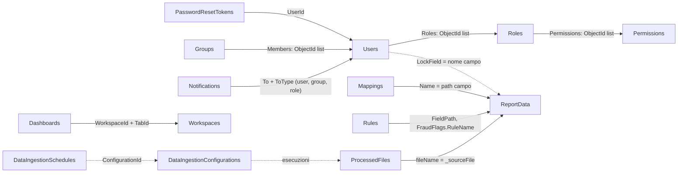
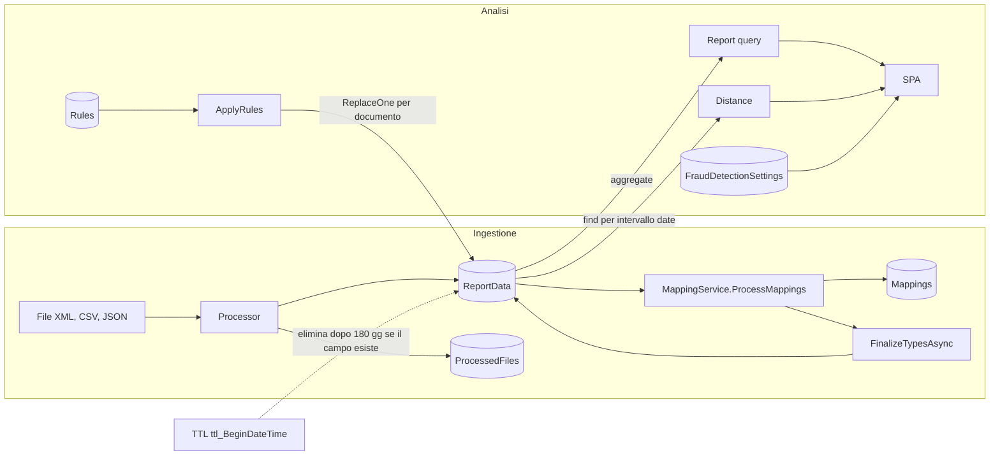
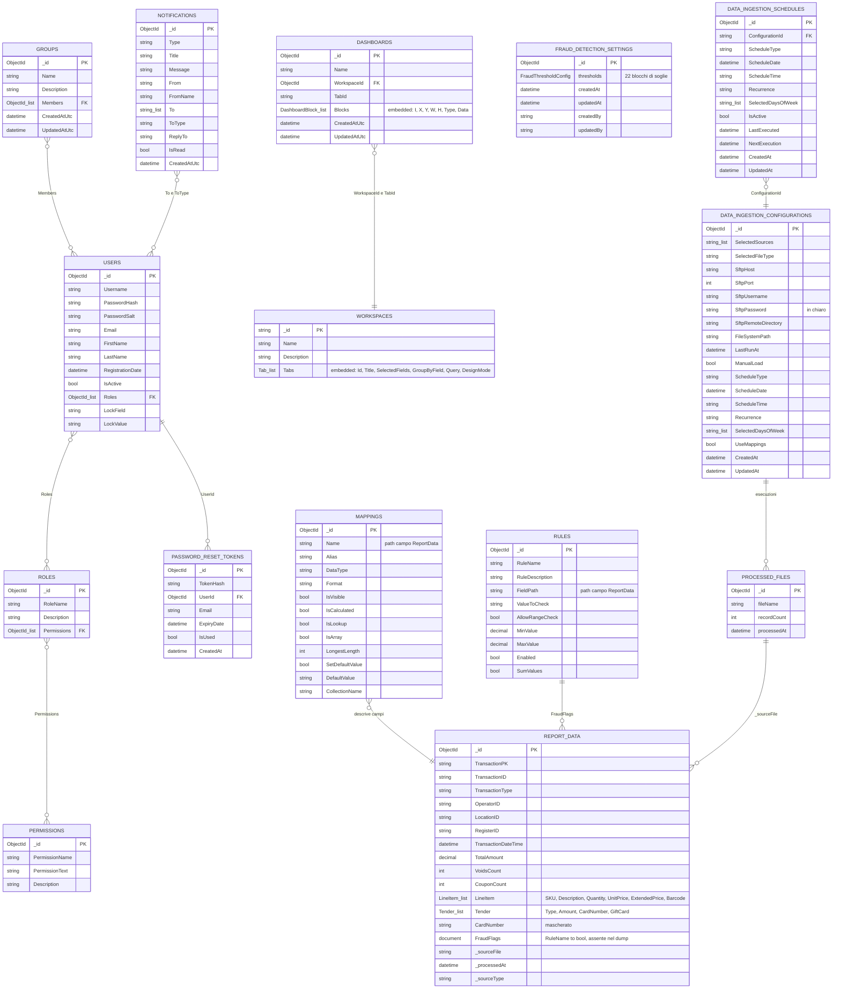

<!-- IMPACT-META
schema: 1
mode: how
step: 08_data
commit: fc7d820908b8b230fb47a2669920ba7efdb413a8
commit_short: fc7d820
branch: main
worktree: dirty
baseline_date: 2026-10-07T18:19:51+02:00
generated_at: 2026-10-08T09:29:30+02:00
-->
# Data - Progetto LOSS_PREVENTION

> **Baseline commit:** `fc7d820` (`main`) · worktree `dirty` (modifiche locali solo in `Docs/` e `.github/`; codice applicativo identico al commit)

**Data**: 2026-10-08  
**Versione**: 1.1  
**Autori**: IMPACT REVERSE how (verifica 2026-10-08)  
**Audience**: Team tecnico, architetti, developer

---

## Sezioni Principali

1. [Logical Data Model (ER Diagram)](#1-logical-data-model-er-diagram)
2. [Physical Data Model](#2-physical-data-model)
3. [Data Ownership & Governance](#3-data-ownership--governance)
4. [Data Storage & Partitioning](#4-data-storage--partitioning)
5. [Backup & Archive Strategy](#5-backup--archive-strategy)
6. [Data Retention Policy](#6-data-retention-policy)
7. [Log Management](#7-log-management)
8. [ERD Diagram (Mermaid)](#erd-diagram-mermaid)

Fonti: entità in `LossPrevention.Domain/Entities/**`, registrazioni repository in `LossPrevention.Infrastructure/InfrastructureServiceExtensions.cs`, accessi diretti `Collection`/`GetCollection` nei servizi, dump `Data/LossPrevention` (`*.bson` + `*.metadata.json`, letti con un parser BSON) e seed `Data/MongoDBScripts`. Percorsi relativi a `customspa-it-loss-prevention-d098a8b97860/`.

---

## 1. Logical Data Model (ER Diagram)

**Sintesi.** Il modello logico ruota attorno a un'unica entità transazionale schema-less (`ReportData`, transazioni POS) descritta dai metadati `Mappings` e marcata dalle `Rules`; attorno ci sono le aree Identity & Access, configurazione dell'ingestione, collaborazione (workspace, dashboard, gruppi, notifiche) e soglie antifrode. Tutte le relazioni sono logiche: MongoDB non applica vincoli referenziali.

### 1.1 Aree e entità

| Area | Entità (classe C#) | Collezione | Ruolo |
|------|--------------------|-----------|-------|
| Dati analitici | `BsonDocument` | `ReportData` | Transazioni POS (testata, righe `LineItem`, pagamenti `Tender`/carta, flag `FraudFlags`) |
| Metadati analitici | `MappingItem` | `Mappings` | Catalogo campi di `ReportData` (alias, tipo, visibilità) |
| Regole | `RuleConfiguration` | `Rules` | Regole a campo singolo che producono `FraudFlags.<RuleName>` |
| Soglie antifrode | `FraudDetectionSettings` (+22 blocchi `*Threshold`) | `FraudDetectionSettings` | Parametri del motore statistico client-side |
| Identity & Access | `User`, `Role`, `Permission`, `PasswordResetToken` | `Users`, `Roles`, `Permissions`, `PasswordResetTokens` | Autenticazione, RBAC, reset password, lock di riga (`LockField/LockValue`) |
| Ingestione | `DataIngestionConfiguration`, `DataIngestionSchedule`, `BsonDocument` | `DataIngestionConfigurations`, `DataIngestionSchedules`, `ProcessedFiles` | Sorgente/schedulazione e registro dei file importati |
| Collaborazione | `Workspace` (+`Tab`, `Field`, `Query`, `Condition`), `DashboardDocument` (+`DashboardBlock`), `GroupDocument`, `NotificationDocument` | `Workspaces`, `Dashboards`, `Groups`, `Notifications` | Report salvati, dashboard, gruppi utenti, messaggi |

### 1.2 Diagramma logico (relazioni)

Il diagramma con gli attributi reali è nella sezione [ERD Diagram (Mermaid)](#erd-diagram-mermaid).



### 1.3 Relazioni e integrità

| Da → A | Campo | Cardinalità | Integrità gestita dal codice | Evidenza |
|--------|-------|-------------|------------------------------|----------|
| Users → Roles | `Roles` (lista ObjectId) | N:M | Alla cancellazione di un ruolo il ruolo è rimosso dagli utenti (non atomico) | `UserRoleService.cs:59-79` |
| Roles → Permissions | `Permissions` (lista ObjectId) | N:M | Alla cancellazione di un permesso è rimosso dai ruoli (non atomico) | `UserPermissionService.cs:117-133` |
| PasswordResetTokens → Users | `UserId` | N:1 | Nessuna pulizia alla cancellazione dell'utente | `UserService.cs:113-116` |
| Groups → Users | `Members` | N:M | Nessuna pulizia | `GroupDocument` |
| Notifications → Users/Groups/Roles | `To` (lista stringhe) + `ToType` | N:M polimorfica | Nessuna; la lista notifiche non filtra per destinatario | `ListNotificationsEndpoint.cs:30-31` |
| Dashboards → Workspaces | `WorkspaceId` (ObjectId) + `TabId` (string) | N:1 | Nessuna: eliminando un workspace le dashboard restano orfane; **tipo disallineato** (`Workspaces._id` è salvato come stringa) | `DashboardDocument.cs:11-14`, `WorkspaceService.cs:49,75-87` |
| Mappings → ReportData | `Name` (path campo) + `CollectionName` | 1:1 per campo | Rigenerate per campionamento | `MappingService.ProcessMappings` |
| Rules → ReportData | `FieldPath` (input), `FraudFlags.<RuleName>` (output) | 1:N | Nessuna verifica che `FieldPath` esista | `RulesService.cs` |
| ProcessedFiles → ReportData | `fileName` = `_sourceFile` | 1:N | Solo per l'ingestione via API | `FileProcessingCoordinator.cs:298,368,385-409` |
| DataIngestionSchedules → DataIngestionConfigurations | `ConfigurationId` | N:1 | Collezione mai usata a runtime | `Program.cs:99` |
| Users → ReportData | `LockField`/`LockValue` (nome e valore di un campo) | — | Applicato solo nel browser | `UI/src/helpers/fieldLock.ts` |

---

## 2. Physical Data Model

**Sintesi.** Un solo database MongoDB (`LossPrevention`) senza schema validation né migrazioni. Il codice usa **15 collezioni** (13 da configurazione + 2 con nome hardcoded); il dump versionato contiene **12 collezioni**: 10 in comune con il codice e 2 di backup manuale (`Mappings_old`, `ReportData_old`). Gli unici indici secondari sono il TTL su `ReportData.BeginDateTime` e quelli dinamici creati dalla console.

### 2.1 Data store

| Elemento | Valore | Evidenza |
|----------|--------|----------|
| DBMS | MongoDB 8.3.2 (dump creato con mongodump 100.13.0) | `Data/LossPrevention/prelude.json` |
| Database | `LossPrevention` | `MongoDbSettings.DatabaseName` in `appsettings.json` |
| Connessione | `mongodb://localhost:27017` senza credenziali né TLS | `LossPrevention.API/appsettings.json` |
| Driver | MongoDB.Driver / MongoDB.Bson 3.4.0 | csproj Application/Infrastructure/Domain |
| Accesso | `MongoRepository<T>` (14 registrazioni, 13 tipi) + accesso diretto `Collection` / `GetCollection` | `InfrastructureServiceExtensions.cs:42-149`, `FileProcessingCoordinator.cs:391,409` |
| Schema management | Nessuno: niente migrazioni, niente `$jsonSchema`; `InsertMany` con `BypassDocumentValidation=true` | `MongoRepository.cs:82` |
| Script | Seed JS manuali (`Data/MongoDBScripts/00..04`) | §2.6 |

### 2.2 Riconciliazione collezioni: codice vs dump

| # | Collezione | Origine del nome nel codice | Tipo C# | Registrazione / accesso | Nel dump | Documenti | Byte `.bson` |
|---|-----------|-----------------------------|---------|-------------------------|----------|-----------|--------------|
| 1 | `ReportData` | `CollectionName_ReportData` | `BsonDocument` | repository `BsonDocument` | Sì | 3.000 | 3.528.608 |
| 2 | `Mappings` | `CollectionName_MappingConfiguration` | `MappingItem` | repository | Sì | 52 | 12.500 |
| 3 | `Rules` | `CollectionName_RulesConfiguration` | `RuleConfiguration` | repository | Sì | 3 | 643 |
| 4 | `Users` | `CollectionName_Users` | `User` | repository (registrato 2 volte) | Sì | 2 | 625 |
| 5 | `Roles` | `CollectionName_Roles` | `Role` | repository | Sì | 1 | 677 |
| 6 | `Permissions` | `CollectionName_Permissions` | `Permission` | repository | Sì | 37 | 5.790 |
| 7 | `Workspaces` | `CollectionName_Workspaces` | `Workspace` | repository | Sì | 3 | 10.495 |
| 8 | `Dashboards` | `CollectionName_Dashboards` | `DashboardDocument` | repository | Sì | 1 | 146 |
| 9 | `DataIngestionConfigurations` | `CollectionName_DataIngestionConfigurations` | `DataIngestionConfiguration` | repository | Sì | 1 | 410 |
| 10 | `ProcessedFiles` | literal `"ProcessedFiles"` | `BsonDocument` | `Collection.Database.GetCollection` | Sì | 3.000 | 258.000 |
| 11 | `PasswordResetTokens` | literal `"PasswordResetTokens"` | `PasswordResetToken` | repository (`InfrastructureServiceExtensions.cs:83`) | **No** | — | — |
| 12 | `FraudDetectionSettings` | `CollectionName_FraudDetectionSettings` | `FraudDetectionSettings` | repository | **No** | — | — |
| 13 | `DataIngestionSchedules` | `CollectionName_DataIngestionSchedules` | `DataIngestionSchedule` | repository (servizio mai iniettato) | **No** | — | — |
| 14 | `Notifications` | `CollectionName_Notifications` | `NotificationDocument` | repository | **No** | — | — |
| 15 | `Groups` | `CollectionName_Groups` | `GroupDocument` | repository | **No** | — | — |
| 16 | `Mappings_old` | — (non referenziata) | — | — | Sì (solo dump) | 12 | 3.134 |
| 17 | `ReportData_old` | — (non referenziata) | — | — | Sì (solo dump) | 100 | 22.505 |

Totale dump: 25 file (12 `.bson` + 12 `.metadata.json` + `prelude.json`), 3.845.860 byte. Le 5 collezioni assenti dal dump vengono create da MongoDB al primo inserimento.

### 2.3 Schema fisico delle collezioni di configurazione

| Collezione | Chiave primaria | Campi (nome BSON = nome proprietà, salvo indicazione) |
|-----------|-----------------|--------------------------------------------------------|
| `Users` | `_id` ObjectId | `Username`, `PasswordHash`, `PasswordSalt`, `Email`, `FirstName`, `LastName`, `RegistrationDate`, `IsActive`, `Roles` (ObjectId[]), `LockField?`, `LockValue?` |
| `Roles` | `_id` ObjectId | `RoleName`, `Description`, `Permissions` (ObjectId[]) |
| `Permissions` | `_id` ObjectId | `PermissionName`, `PermissionText`, `Description` |
| `PasswordResetTokens` | `_id` (string C# rappresentato come ObjectId) | `TokenHash`, `UserId` (ObjectId), `Email`, `ExpiryDate`, `IsUsed`, `CreatedAt` |
| `Mappings` | `_id` ObjectId | `Name`, `Alias`, `DataType`, `Format`, `IsVisible`, `IsCalculated`, `IsLookup`, `IsArray`, `LongestLength`, `SetDefaultValue`, `DefaultValue`, `CollectionName` (`Mappings_old` ha in più `Path`) |
| `Rules` | `_id` ObjectId | `RuleName`, `RuleDescription`, `FieldPath`, `ValueToCheck`, `AllowRangeCheck`, `MinValue` (decimal?), `MaxValue` (decimal?), `Enabled`, `SumValues` |
| `FraudDetectionSettings` | `_id` ObjectId | **camelCase**: `thresholds` (22 sotto-documenti: `HighValue` … `ReturnFraud`), `createdAt`, `updatedAt`, `createdBy`, `updatedBy` |
| `DataIngestionConfigurations` | `_id` (string come ObjectId) | `SelectedSources`, `SelectedFileType`, `SftpHost`, `SftpPort` (default 22), `SftpUsername`, `SftpPassword` (in chiaro), `SftpRemoteDirectory`, `FileSystemPath`, `LastRunAt?`, `ManualLoad`, `ScheduleType`, `ScheduleDate?`, `ScheduleTime?`, `Recurrence`, `SelectedDaysOfWeek`, `CreatedAt`, `UpdatedAt`, `UseMappings` |
| `DataIngestionSchedules` | `_id` (string come ObjectId) | `ConfigurationId`, `ScheduleType`, `ScheduleDate`, `ScheduleTime`, `Recurrence`, `SelectedDaysOfWeek`, `IsActive`, `LastExecuted`, `NextExecution`, `CreatedAt`, `UpdatedAt` |
| `ProcessedFiles` | `_id` ObjectId | `fileName`, `recordCount`, `processedAt` (camelCase, `BsonDocument` costruito a mano) |
| `Workspaces` | `_id` **string** (`ObjectId.GenerateNewId().ToString()`) | `Name`, `Description`, `Tabs[]` → `Id`, `Title`, `Description`, `SelectedFields[]` (`Name`, `Alias`, `DataType`, `GroupBy`, `Aggregation`, `IsCalculated`, `Expression`, `Prefix`, `Suffix`, `Visible`), `GroupByField`, `Query` (`Type`, `Conditions[]` → `Field`, `Operator`, `Value`; `Id`), `DesignMode` |
| `Dashboards` | `_id` ObjectId | `Name`, `WorkspaceId` (ObjectId), `TabId` (string), `Blocks[]` (`I`, `X`, `Y`, `W`, `H`, `Type`, `Data` BsonDocument), `CreatedAtUtc`, `UpdatedAtUtc` |
| `Groups` | `_id` ObjectId | `Name`, `Description`, `Members` (ObjectId[]), `CreatedAtUtc`, `UpdatedAtUtc` |
| `Notifications` | `_id` ObjectId | `Type`, `Title`, `Message`, `From`, `FromName`, `To` (string[]), `ToType`, `ReplyTo`, `IsRead`, `CreatedAtUtc` |

### 2.4 Struttura di `ReportData` (rilevata sui 3.000 documenti del dump)

| Gruppo | Campi (tipo BSON) | Presenza |
|--------|-------------------|----------|
| Testata | `TransactionPK`, `TransactionID`, `TransactionType` (Sale 2.397 / Refund 231 / Return 230 / Void 142), `OperatorID`, `LocationID`, `RegisterID`, `TransactionDateTime` (date), `TotalAmount` (decimal), `TrainingModeFlag`, `CancelFlag`, `VoidsCount` (int), `CouponCount` (int), `PreExistingRuleFlag` | 3.000 |
| Righe (array) | `LineItem[]`: `SKU`, `Description`, `Quantity`, `UnitPrice`, `ExtendedPrice`, `Barcode` (long) | 2.671 |
| Righe (piatte) | `SKU`, `Description`, `Quantity`, `UnitPrice`, `ExtendedPrice`, `Barcode` alla radice | 329 |
| Pagamento (piatto) | `Type`, `Amount` | 2.556 |
| Carta (piatto) | `CardNumber`, `CardBrand`, `Last4`, `Expiry`, `EntryMethod`, `ApprovalCode`, `CardPresent`, `AuthorizationResponse` | 2.101 |
| Pagamenti (array) | `Tender[]` (incl. `GiftCardNumber`, `GiftCardAction`, `GiftCardBalanceAfter`) | 444 |
| Lineage | `_sourceFile`, `_processedAt` (date), `_sourceType` (sempre `filesystem`) | 3.000 |
| Flag regole | `FraudFlags.*` | **0** (le regole non sono mai state applicate a questo dump) |
| TTL | `BeginDateTime` | **0** |

Dimensione media documento ≈ 1.176 byte (3.528.608 / 3.000). `TransactionDateTime` copre 2025-08-13 → 2025-11-12; `_processedAt` = 2026-05-13. La coesistenza di `LineItem[]` e `SKU` piatto (e di `Tender[]` e `Type/Amount` piatti) deriva dall'appiattimento XML→BSON quando un file contiene uno solo o più elementi ripetuti. `ReportData_old` (100 documenti) ha invece flag booleani alla radice (`HighRefund`, `HighValueTransaction`, `HighVoid`, `IsVoid`, `LowValueTransaction`, `OutsideBusinessHours`) e campi `Timestamp`, `TotalAmount`, `TransactionID`, `TransactionType`: è uno schema precedente.

### 2.5 Indici

| Collezione | Indice | Chiavi | Opzioni | Origine | Presente nel dump |
|-----------|--------|--------|---------|---------|-------------------|
| Tutte le 12 del dump | `_id_` | `{_id: 1}` | — | Default MongoDB | Sì (`*.metadata.json`) |
| `ReportData` | `ttl_BeginDateTime` | `{BeginDateTime: 1}` | `expireAfterSeconds: 15552000` (180 gg) | `DatabaseInitializationService.cs:97-105` allo startup API | Sì (`ReportData.metadata.json`) |
| `ReportData` | dinamici `<campo>_1` (max 20) | ascendenti su campi top-level bool/date/array/string/int/long/decimal dei primi 100 documenti | — | `IndexService.ProcessIndexesAsync` (`Services/Data/IndexSuggestionHelper.cs:20-38`) → `MongoRepository.CreateIndexesAsync` (`:29-40`), solo dalla console | No |
| Collezioni solo-codice (5) | nessuno oltre `_id` | — | — | — | — |

Indici **mancanti** rispetto agli accessi del codice: `Users.Username` (login, unicità), `Roles.RoleName`, `Permissions.PermissionName`, `ProcessedFiles.fileName` (lookup a ogni file: oggi collection scan, nessuna unicità), `PasswordResetTokens.TokenHash` + TTL su `ExpiryDate`, `ReportData.TransactionDateTime` (filtro range in `DistanceDataservice.cs:34-39`), `Mappings.{CollectionName, Name}`. La documentazione fornitore `Docs/06_DATABASE_DATA_MODEL.md` (presente solo nel commit `593f6de`, rimossa in `d768cd9`; `git show 593f6de:customspa-it-loss-prevention-d098a8b97860/Docs/06_DATABASE_DATA_MODEL.md`) elencava indici unici su `Users.Username`/`Email`, `Roles.RoleName`, `Permissions.PermissionName` e indici su `ReportData.StoreID`/`Total`: **non esistono** né nel codice né nel dump.

### 2.6 Seed e contenuto del dump

| Script | Effetto |
|--------|---------|
| `00_CleanupDuplicatePermissions.js` | Rimuove permessi duplicati (mantiene la prima occorrenza) |
| `01_CreatePermissions.js` | Crea 37 permessi `CAN_*` |
| `02_AddPermissionsToAdminRole.js` | Associa i permessi al ruolo Admin |
| `03_CleanupStalePermissions.js` | Rimuove 4 permessi obsoleti (`CAN_LOGIN`, `CAN_ADD_USERS`, `CAN_DELETE_USERS`, `CAN_UPDATE_USERS`) e i loro riferimenti nei ruoli (totale nomi distinti negli script: 41) |
| `04_AddLossPreventionRules.js` | Corregge `FieldPath` errati (`Total`→`TotalAmount`, `TenderType`/`Tender.Type`→`Type`, righe 13-24), elimina `IsGiftCard` (riga 27), inserisce 11 regole se assenti (righe 37-155) |
| `rules_export.json` | Export di 13 regole = stato atteso dopo lo script 04 |

Il dump **non** riflette lo script 04: `Rules` contiene 3 regole (`LowValueTransaction`, `HighValueTransaction` con `FieldPath: "Total"`, `IsGiftCard` con `FieldPath: "TenderType"`), tutte riferite a campi inesistenti in `ReportData`. Altre anomalie: utente `lockeddownuser` con `LockField: "StoreID"` (campo assente: esiste `LocationID`); hash password di entrambi gli utenti in formato legacy (senza prefisso `v2:`, 10.000 iterazioni); le 52 mapping hanno tutte `CollectionName: "ReportData"` e nessuna riguarda `FraudFlags`.

---

## 3. Data Ownership & Governance

**Sintesi.** Non esistono ruoli formali di data owner/steward né classificazione dei dati nel codice; l'ownership è implicita nel componente che scrive ciascuna collezione. Il dato transazionale contiene identificativi operatore e dati di pagamento mascherati, accessibili a chiunque abbia `CAN_VIEW_REPORT` senza filtri server-side.

### 3.1 Ownership tecnica (scrittori e lettori)

| Collezione | Scritta da | Letta da | Permessi API principali |
|-----------|-----------|----------|-------------------------|
| `ReportData` | `FileProcessingCoordinator` (API), console `DataIngestionService`, `RuleConfigurationService` (flag), `MappingService.FinalizeTypesAsync` (tipi) | `ReportDataservice`, `DistanceDataService`, `RuleConfigurationService`, `MappingService` | `CAN_VIEW_REPORT` e permessi regole/ingestione |
| `Mappings` | `MappingService`, endpoint Mappings, `RuleConfigurationService` | Report, distance, SPA | permessi Mappings |
| `Rules` | endpoint Rules | `RuleConfigurationService` | permessi Rules |
| `FraudDetectionSettings` | endpoint FraudDetection (direct repository) | SPA (motore statistico) | permessi FraudDetection |
| `Users`, `Roles`, `Permissions` | `UserService`, `UserRoleService`, `UserPermissionService`, seed | Login, admin | permessi User/Roles/Permissions |
| `PasswordResetTokens` | `PasswordResetService` | `PasswordResetService` | anonimi (`ForgotPassword`, `ResetPassword`, `ValidateResetToken`) |
| `DataIngestionConfigurations` | `DataIngestionService` | Coordinator, background service | permessi DataIngestion |
| `ProcessedFiles` | `FileProcessingCoordinator` | `FileProcessingCoordinator` | — (interno) |
| `Workspaces`, `Dashboards` | `WorkspaceService`, endpoint Dashboard | SPA | permessi Workspaces/Dashboard; **nessun owner**: dati condivisi tra tutti gli utenti |
| `Groups`, `Notifications` | endpoint Groups/Notifications | SPA | nessun filtro per destinatario (`ListNotificationsEndpoint.cs:30-31`) |

### 3.2 Classificazione dei dati (ricavata dai campi)

| Categoria | Campi | Collezioni | Protezione attuale |
|-----------|-------|-----------|--------------------|
| Credenziali | `PasswordHash`, `PasswordSalt` | `Users` | PBKDF2; **restituiti** da `GetUsersEndpoint.cs:36` |
| Segreti di integrazione | `SftpPassword` | `DataIngestionConfigurations` | In chiaro |
| Token | `TokenHash` | `PasswordResetTokens` | Hash SHA256 |
| Dati personali (dipendenti/utenti) | `Username`, `Email`, `FirstName`, `LastName`; `OperatorID` | `Users`, `PasswordResetTokens`, `ReportData` | Nessun mascheramento |
| Dati di pagamento | `CardNumber` (mascherato, es. `472805******1016`, 2.545 valori), `Last4`, `Expiry`, `CardBrand`, `ApprovalCode`, `GiftCardNumber` | `ReportData` | Mascheramento PAN all'origine (prime 6 + ultime 4); nessun ulteriore controllo |
| Dati di business | importi, articoli, punti vendita | `ReportData` | Lock di riga solo client-side |

### 3.3 Lineage e qualità



| Aspetto | Stato | Evidenza |
|---------|-------|----------|
| Lineage | `_sourceFile`, `_processedAt`, `_sourceType` su ogni transazione (API: `sftp`/`filesystem`; console: senza `_sourceType`) | `FileProcessingCoordinator.cs:298-300,368-370` |
| Tipizzazione | Inferita per campionamento (`ProcessMappings` su 1.000 o `int.MaxValue` documenti) e conversione `FinalizeTypesAsync` (solo documenti con `_id` nel giorno corrente, fuso Londra) | `MappingService.cs` |
| Validazione | Nessuna validazione di schema; `BypassDocumentValidation=true` | `MongoRepository.cs:82` |
| Audit | Solo `createdAt/updatedAt/createdBy/updatedBy` su `FraudDetectionSettings`, `CreatedAtUtc/UpdatedAtUtc` su dashboard/gruppi; nessun audit su utenti, ruoli, regole | entità Domain |
| Data owner / steward | N/A — non ricavabile dal codice: nessun metadato o processo di ownership | — |

---

## 4. Data Storage & Partitioning

**Sintesi.** Tutti i dati risiedono in un singolo `mongod` locale, in un unico database e — per le transazioni — in un'unica collezione `ReportData`; non ci sono sharding, partizionamento temporale, bucketing né separazione hot/cold.

| Aspetto | Stato | Evidenza |
|---------|-------|----------|
| Topologia | Singolo nodo `localhost:27017` (replica set/sharding non configurati nella connection string) | `appsettings.json` |
| Partizionamento | Nessuno: una sola collezione `ReportData` per tutti i punti vendita e periodi | — |
| Sharding | Nessuno | — |
| Crescita | `ReportData` cresce con le transazioni (≈ 1,2 KB/doc nel dump); `ProcessedFiles` +1 documento per file (≈ 86 byte/doc), senza limite | §2.2 |
| File temporanei | File SFTP scaricati in `Path.GetTempPath()` e cancellati dopo il parse | `FileProcessingCoordinator.cs:281,320`; `SftpFileProcessingService.cs:153,191` |
| Storage dei file sorgente | SFTP: spostati in `processed/` o `failed/` sul server remoto (mai cancellati); file system: lasciati nella cartella sorgente | `SftpFileProcessingService.cs:33-34`; `FileProcessingCoordinator.cs:246` |
| Volumi reali di produzione | N/A — non ricavabile dal codice: il dump contiene solo dati di sviluppo (3.000 transazioni) | — |

Chiavi di partizionamento candidate (raccomandazione, non implementata): `TransactionDateTime` (collezione time-series o bucket mensili, coerente con la retention) e `LocationID` (shard key composta `{LocationID, TransactionDateTime}`).

---

## 5. Backup & Archive Strategy

**Sintesi.** Il codice non implementa backup né archiviazione. L'unica evidenza di backup è il dump `mongodump` versionato in Git, che contiene anche dati sensibili; le collezioni `_old` sono copie manuali ad-hoc.

| Aspetto | Stato | Evidenza |
|---------|-------|----------|
| Backup automatico | Assente (nessuno script, job o configurazione) | ricerca nel repository |
| Backup manuale | Dump completo in `Data/LossPrevention` (mongodump 100.13.0, MongoDB 8.3.2), versionato in Git | `prelude.json` |
| Rischio del dump versionato | Contiene hash password, email utenti, configurazione ingestione e 3.000 transazioni con dati carta mascherati | §3.2 |
| Archiviazione | Assente; `Mappings_old` e `ReportData_old` sono copie manuali di schemi precedenti, non referenziate dal codice | §2.2 |
| Archiviazione prima della scadenza TTL | Assente: il TTL cancella definitivamente | §6 |
| RPO / RTO | N/A — non ricavabile dal codice: nessun requisito o procedura definiti | — |

Nota storica: `Docs/12_MAINTENANCE_OPERATIONS.md` del fornitore (presente solo nel commit `593f6de`, rimosso in `d768cd9`; `git show 593f6de:customspa-it-loss-prevention-d098a8b97860/Docs/12_MAINTENANCE_OPERATIONS.md`) proponeva uno script `backup-lossprevention.sh` (`mongodump --gzip`, archivio `tar.gz`, conservazione 30 giorni, cron giornaliero alle 01:00, upload opzionale su Azure Blob). Lo script **non** è presente nel repository.

---

## 6. Data Retention Policy

**Sintesi.** L'unica politica implementata è un indice TTL su `ReportData.BeginDateTime` (180 giorni da configurazione), che però non si applica ai dati osservati perché il campo non esiste; le altre collezioni crescono senza limiti.

### 6.1 Meccanismo TTL implementato

```csharp
// LossPrevention.Application/Interfaces/Data/DatabaseInitializationService.cs
_retentionDays = configuration.GetValue<int>("DataRetention:TransactionRetentionDays", 90);   // :23
// EnsureTtlIndexAsync (:43-116): se esiste già un TTL su BeginDateTime -> return;
// se esiste un indice non-TTL su BeginDateTime -> DropOneAsync; poi:
var indexKeys = Builders<BsonDocument>.IndexKeys.Ascending("BeginDateTime");
// ExpireAfter = TimeSpan.FromDays(_retentionDays), Name = "ttl_BeginDateTime"         // :97-105
// in caso di errore: _logger.LogError(...); throw;  -> l'API non parte
```

| Aspetto | Comportamento |
|---------|---------------|
| Durata | `DataRetention:TransactionRetentionDays` = 180 in `appsettings.json` (default nel codice 90) → `expireAfterSeconds: 15552000` nel dump |
| Campo | `BeginDateTime`: **assente** in tutti i 3.000 documenti del dump (presente `TransactionDateTime`) → nessun documento scade |
| Cambio durata | Se l'indice TTL esiste già viene saltato: modificare la configurazione **non** aggiorna `expireAfterSeconds` (servirebbe `collMod`) |
| Tipo | Il TTL agisce solo su valori BSON date; `FinalizeTypesAsync` converte i tipi solo per i documenti del giorno corrente |
| Console | Non crea il TTL (solo l'API esegue `DatabaseInitializationService`) |

### 6.2 Retention per collezione

| Collezione | Politica effettiva | Rischio |
|-----------|--------------------|---------|
| `ReportData` | TTL 180 gg su `BeginDateTime` (inefficace sui dati osservati) | Crescita illimitata; dati personali e di pagamento conservati indefinitamente |
| `ProcessedFiles` | Nessuna | Crescita illimitata; se ripulita, i file ancora presenti in `processed/` verrebbero reingeriti |
| `PasswordResetTokens` | Scadenza logica 1 h (`ExpiryDate`), nessun TTL; i token usati/scaduti non vengono mai cancellati | Accumulo di email e hash token |
| `Notifications` | Nessuna | Crescita illimitata |
| `Users`, `Roles`, `Permissions`, `Rules`, `Mappings`, `Workspaces`, `Dashboards`, `Groups`, `FraudDetectionSettings`, `DataIngestionConfigurations`, `DataIngestionSchedules` | Fino a cancellazione manuale via API | Basso volume |
| `Mappings_old`, `ReportData_old` | Nessuna (solo nel dump) | Dati obsoleti |

Requisiti normativi di conservazione (es. GDPR, PCI-DSS): N/A — non ricavabile dal codice. Nota storica: `Docs/12_MAINTENANCE_OPERATIONS.md` (solo `593f6de`) suggeriva una pulizia manuale `deleteMany({ _processedAt: { $lt: cutoff } })` a 180 giorni "se il TTL non funziona": non implementata.

---

## 7. Log Management

**Sintesi.** I log applicativi vanno solo sui provider di default di `Microsoft.Extensions.Logging` (console/debug) e su `Console.WriteLine`; non esistono file di log, rotazione, centralizzazione, retention dei log né audit trail persistito.

| Aspetto | Stato | Evidenza |
|---------|-------|----------|
| Provider | Default `WebApplication.CreateBuilder` / `Host.CreateDefaultBuilder` (Console, Debug, EventSource, EventLog su Windows) | `Program.cs` API e console |
| Livelli | `Default: Information`, `Microsoft.AspNetCore: Warning` | `appsettings.json` (API e console) |
| Logger strutturato | `ILogger<T>` solo in 4 classi: `DatabaseInitializationService`, `DataIngestionBackgroundService`, `FileProcessingCoordinator`, `SftpFileProcessingService` | grep `ILogger<` |
| Output non strutturato | 6 `Console.WriteLine` backend; 57 `console.log` frontend (incluso il base URL API e mappe semantiche) | vedi [07_code.md §5](07_code.md#5-exception-handling--logging) |
| Sink su file / centralizzazione | Assenti (nessun Serilog/NLog/OpenTelemetry/Application Insights) | csproj |
| Rotazione e retention log | N/A — nessun file di log prodotto dal codice | — |
| Audit di sicurezza | Assente: login riusciti/falliti, reset password, modifiche a ruoli/permessi/regole non sono registrati | — |
| Dati sensibili nei log | Il coordinator logga nomi file ed errori; nessun log di password/token individuato; il frontend logga dati di report in console | `FileProcessingCoordinator.cs` |
| Storico esecuzioni ingestione | Solo `ProcessedFiles` (nome file, record, data); `LastRunAt` non persistito | `DataIngestionBackgroundService.cs` |

Nota storica: la documentazione fornitore `12_MAINTENANCE_OPERATIONS.md` (solo `593f6de`) faceva riferimento a `/var/log/lossprevention/api.log` e a eventi `LOGIN_FAILED`: né il file né l'evento esistono nel codice.

---

## ERD Diagram (Mermaid)

Attributi e tipi dalle classi C# in `LossPrevention.Domain/Entities/**` (tipi BSON semplificati in token singoli; `_list` = array). `REPORT_DATA` riporta i campi osservati nel dump; `PROCESSED_FILES` è costruita a mano nel codice.



Le relazioni sono **logiche** (riferimenti per `ObjectId`, per stringa o per nome campo): MongoDB non applica integrità referenziale; le uniche cascade gestite dal codice sono la rimozione di un ruolo dagli utenti e di un permesso dai ruoli (§1.3).

---

## Reference Documents

- **Deep Dive Analysis**: [00_deep_dive.md](00_deep_dive.md)
- **Context**: [01_context.md](01_context.md)
- **Functional Overview**: [02_functional_overview.md](02_functional_overview.md)
- **Non-Functional Overview**: [03_non_functional_overview.md](03_non_functional_overview.md)
- **Constraints**: [04_constraints.md](04_constraints.md)
- **Principles**: [05_principles.md](05_principles.md)
- **Software Architecture**: [06_software_architecture.md](06_software_architecture.md)
- **Code**: [07_code.md](07_code.md)
- Documenti successivi correlati: [09_infrastructure_architecture.md](09_infrastructure_architecture.md) · [12_operation_and_support.md](12_operation_and_support.md) · [17_backend_deep_assessment.md](17_backend_deep_assessment.md) · [19_modernization_estimation_spec.md](19_modernization_estimation_spec.md)

---

## Change Log

| Versione | Data | Autore | Modifiche |
|----------|------|--------|-----------|
| 1.0 | 2026-10-07 | REVERSE how (FULL) | Creazione documento (sostituisce run 2026-10-05) |
| 1.1 | 2026-10-08 | IMPACT verify | Ristrutturato nelle 7 sezioni del prompt + ERD; riconciliazione collezioni codice (15) vs dump (12, non "13 + 2 _old"); Rules nel dump 3 (non 13 seed) con FieldPath errati; ReportData senza `FraudFlags` né `BeginDateTime`; schema fisico per collezione, tabella indici (metadata.json, DatabaseInitializationService, IndexService) e indici mancanti; tipo disallineato Dashboards.WorkspaceId/Workspaces._id; aggiunte sezioni Ownership & Governance (classificazione dati, lineage), Storage & Partitioning, Backup & Archive, Retention per collezione, Log Management; ERD con campi reali e tipi a token singolo; vendor doc citati come storici (`593f6de`/`d768cd9`); Reference Documents completi |
