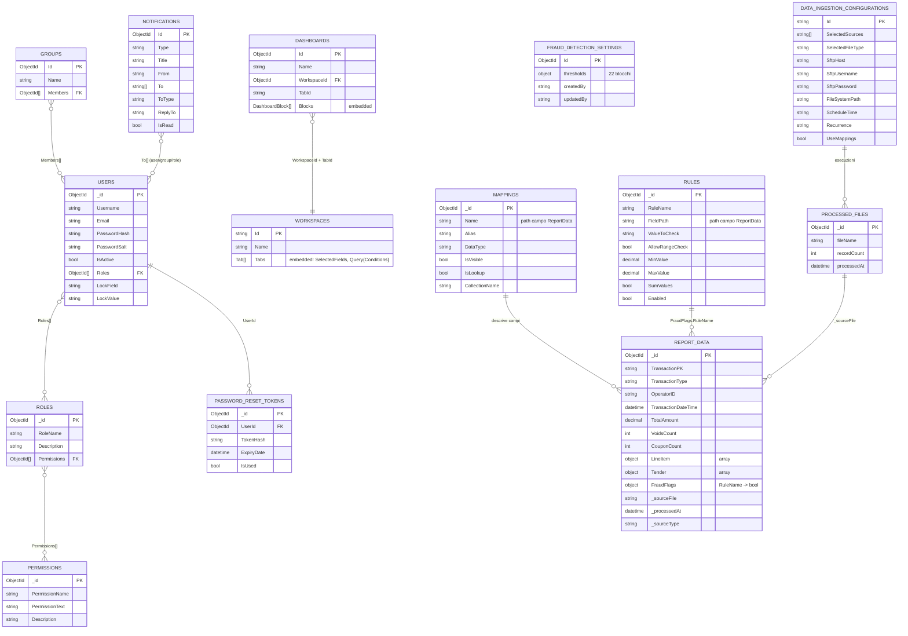
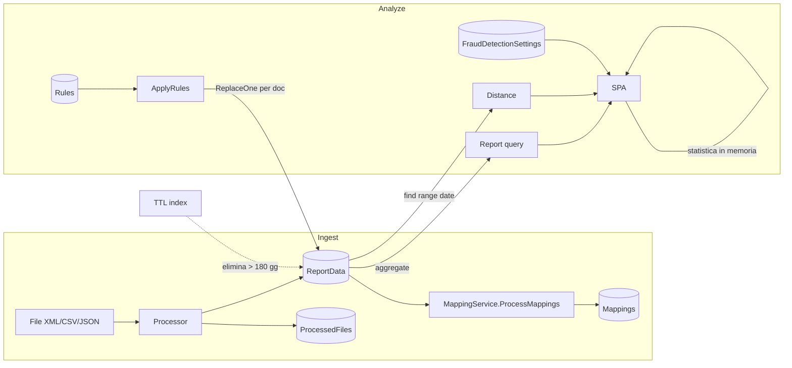

<!-- REVERSE-META
schema: 1
mode: how
step: 08_data
commit: 593f6decec3a642d5567754dd795b19560bb0afb
commit_short: 593f6de
branch: main
worktree: clean
baseline_date: 2026-10-05T10:14:05+00:00
generated_at: 2026-10-07T14:40:00Z
-->
# Data - Progetto LOSS_PREVENTION

> **Baseline commit:** `593f6de` (`main`) · worktree `clean`

**Data**: 2026-10-07 · **Versione**: 1.0 · **Autori**: REVERSE how · **Audience**: team tecnico, architetti, developer

---

## 1. Data Store

| Elemento | Valore |
|----------|--------|
| DBMS | MongoDB 8.3.2 (dump `Data/LossPrevention/prelude.json`) |
| Database | `LossPrevention` (`MongoDbSettings.DatabaseName`) |
| Accesso | `MongoDB.Driver 3.4.0` tramite `MongoRepository<T>` + accessi diretti a `Collection` |
| Schema management | Nessuno (no migration); seed JS manuali in `Data/MongoDBScripts` |
| Dump versionato | 13 collezioni + 2 `_old` (≈ 3,8 MB): `ReportData` 3.000 documenti, `ProcessedFiles` 3.000 |

## 2. Catalogo collezioni

| Collezione | Entità C# | Scrittura da | Lettura da | Note |
|-----------|-----------|--------------|-----------|------|
| `ReportData` | `BsonDocument` (schema-less) | Ingestione, console, rule engine | Report query, distance, rules | Unico dato transazionale; TTL 180 gg su `BeginDateTime` |
| `Mappings` | `MappingItem` | `MappingService`, endpoints mappings, rules | Report, distance, FE | 52 mapping nel dump |
| `Rules` | `RuleConfiguration` | `/rules` | Rule engine | 13 regole seed |
| `FraudDetectionSettings` | `FraudDetectionSettings` | `/api/fraud-detection/settings` | FE (motore statistico) | Documento singolo, 22 blocchi di soglie |
| `DataIngestionConfigurations` | `DataIngestionConfiguration` | `/api/data-ingestion*` | Coordinator, background service | Contiene `SftpPassword` in chiaro |
| `DataIngestionSchedules` | `DataIngestionSchedule` | `DataIngestionScheduleService` | — | Registrata ma lo schedule effettivo vive nella configurazione |
| `ProcessedFiles` | `BsonDocument` | Coordinator | Coordinator | Idempotenza per **nome file** |
| `Users` | `User` | `/users*` | Login, admin | Hash PBKDF2 + salt, `Roles: ObjectId[]`, `LockField/LockValue` |
| `Roles` | `Role` | `/roles*` | Login (claim) | `Permissions: ObjectId[]` |
| `Permissions` | `Permission` | `/permissions*`, seed | Login | 37 permessi |
| `PasswordResetTokens` | `PasswordResetToken` | Forgot password | Reset | Token hashato, scadenza 1 h; nessun TTL index |
| `Workspaces` | `Workspace` (+ `Tab`, `Field`, `Query`, `Condition`) | `/workspaces*` | FE | Nessun owner: tutti i workspace sono condivisi |
| `Dashboards` | `DashboardDocument` (+ `DashboardBlock`) | `/dashboards*` | FE | `WorkspaceId` + `TabId` |
| `Groups` | `GroupDocument` | `/groups*` | Notifiche | `Members: ObjectId[]` |
| `Notifications` | `NotificationDocument` | `/notifications*` | FE | `To: string[]`, `ToType` (user/group/role) |

## 3. ERD Diagram (Mermaid)

Le relazioni sono **logiche** (riferimenti per `ObjectId` o per nome campo): MongoDB non applica integrità referenziale e il codice non gestisce cancellazioni a cascata (es. eliminando un ruolo non vengono aggiornati gli utenti; eliminando un workspace le dashboard collegate restano orfane).

## 4. Struttura di `ReportData` (dal dump)

Campi rilevati nella collezione `Mappings` del dump (52):

| Gruppo | Campi (tipo) |
|--------|--------------|
| Testata | `TransactionPK`, `TransactionID`, `TransactionType` (Sale/Return/Refund/Void…), `OperatorID`, `LocationID`, `RegisterID`, `TransactionDateTime` (Date), `TotalAmount` (Decimal), `TrainingModeFlag`, `CancelFlag`, `VoidsCount`, `CouponCount`, `PreExistingRuleFlag` |
| Righe | `LineItem.SKU`, `.Description`, `.Quantity`, `.UnitPrice`, `.ExtendedPrice`, `.Barcode` |
| Pagamenti | `Tender.Type`, `.Amount`, `.CardNumber`, `.CardBrand`, `.Last4`, `.Expiry`, `.EntryMethod`, `.ApprovalCode`, `.CardPresent`, `.AuthorizationResponse`, `.GiftCardNumber`, `.GiftCardAction`, `.GiftCardBalanceAfter` |
| Tecnici | `_sourceFile`, `_processedAt`, `_sourceType`, `FraudFlags.*` |

**Osservazioni**
- I numeri di carta nel dump sono **troncati** (formato prime 6 + ultime 4, verificato su 2.545 valori) → compatibile con la troncatura PCI-DSS; restano comunque dati di pagamento e scadenze carta.
- Il TTL è definito su `BeginDateTime`, ma nei 3.000 documenti del dump il campo `BeginDateTime` è **assente** (presente invece `TransactionDateTime` in tutti) → con questi dati **la retention non si applica** (da verificare sui file reali del cliente).
- La duplicazione `SKU`/`LineItem.SKU` e `Amount`/`Tender.Amount` indica file con strutture diverse ingeriti nella stessa collezione.

## 5. Data Flows

## 6. Data Management

| Tema | Stato |
|------|-------|
| Indici | `_id`, `ttl_BeginDateTime`; il job console può creare indici suggeriti (`IndexService`) ma l'API no |
| Retention | TTL configurabile (`DataRetention:TransactionRetentionDays`, default codice 90, config 180) |
| Backup | Non gestito dal codice |
| Data quality | Tipi inferiti per campionamento (`ProcessMappings` su N documenti, `FinalizeTypesAsync`); nessuna validazione |
| Privacy | Nessun mascheramento lato API; i report restituiscono tutti i campi (vedi difetto D8 nel documento 07) |
| Seed | `01_CreatePermissions.js`, `02_AddPermissionsToAdminRole.js`, `04_AddLossPreventionRules.js`, cleanup duplicati/stale |

---

## Reference Documents
- 00_deep_dive.md · 06_software_architecture.md · 07_code.md

## Change Log

| Versione | Data | Autore | Modifiche |
|----------|------|--------|-----------|
| 1.0 | 2026-10-07 | REVERSE how (FULL) | Creazione documento (sostituisce run 2026-10-05) |
