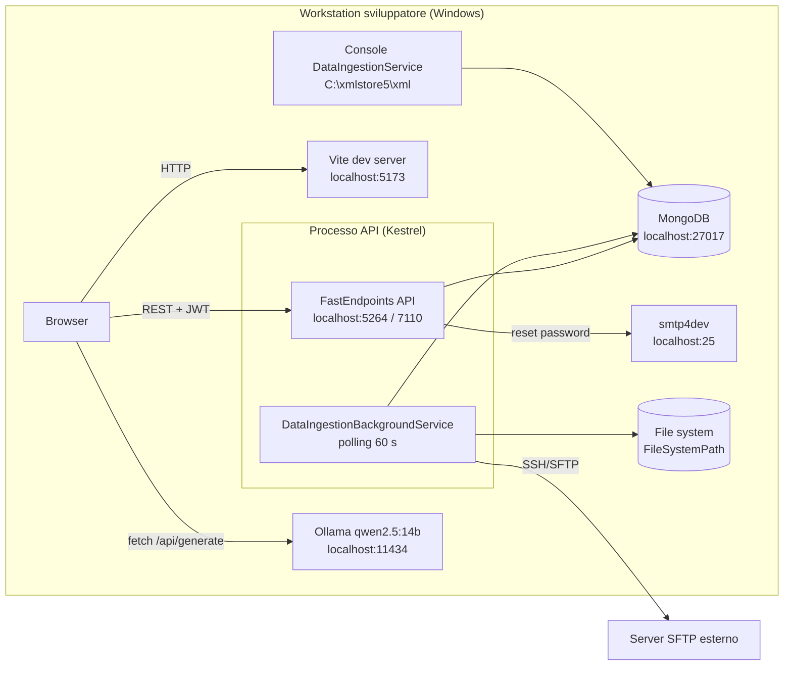

<!-- IMPACT-META
schema: 1
mode: how
step: 09_infrastructure_architecture
commit: fc7d820908b8b230fb47a2669920ba7efdb413a8
commit_short: fc7d820
branch: main
worktree: dirty
baseline_date: 2026-10-07T18:19:51+02:00
generated_at: 2026-10-08T09:41:39.009+02:00
-->
# Infrastructure Architecture - Progetto LOSS_PREVENTION

> **Baseline commit:** `fc7d820` (`main`) · worktree `dirty` (modifiche locali solo in `Docs/` e `.github/`; codice applicativo identico al commit)

**Data**: 2026-10-08  
**Versione**: 1.1  
**Autori**: REVERSE how (IMPACT) · verifica IMPACT verify  
**Audience**: Team tecnico, architetti, developer, operations

---

## Sezioni Principali

Questo documento descrive l'infrastruttura fisica/virtuale e la topologia di rete del Loss Prevention Tool. Ogni sezione separa in modo esplicito:

- **AS-IS** — ciò che è ricavabile dal codice e dalla configurazione al commit `fc7d820` (con riferimento `file:riga`);
- **TO-BE** — raccomandazioni o proposte (del fornitore o di questa analisi), che **non** sono implementate nel repository.

**Fonti di evidenza utilizzate**

| Fonte | Percorso | Contenuto rilevante |
|-------|----------|---------------------|
| Bootstrap API | `LossPrevention.API/Program.cs` | CORS, pipeline middleware, DI, hosted service, init DB |
| Profili di avvio | `LossPrevention.API/Properties/launchSettings.json` | Porte Kestrel / IIS Express, ambiente `Development` |
| Configurazione API | `LossPrevention.API/appsettings.json` | MongoDB, JWT, SMTP, retention, logging |
| Configurazione console | `LossPrevention.DataIngestionService/appsettings.json` | MongoDB (sottoinsieme collezioni) |
| Console batch | `LossPrevention.DataIngestionService/Program.cs` | Path file hardcoded, parallelismo |
| Ingestione schedulata | `LossPrevention.Application/Services/DataIngestion/*.cs` | Background service, SFTP, file system |
| Frontend | `LossPrevention.UI/vite.config.js`, `src/api/api.ts`, `src/stores/aiStore.ts` | Dev server, base URL API, chiamata LLM |
| Dati di sviluppo | `Data/LossPrevention/` (mongodump), `Data/MongoDBScripts/` | Dump di 12 collezioni (10 in uso + `Mappings_old`, `ReportData_old`), 5 script di seed ordinati `00..04` |
| Documentazione fornitore (storica) | `Docs/04_DEPLOYMENT_GUIDE.md`, `Docs/03_SETUP_INSTALLATION.md`, `Docs/12_MAINTENANCE_OPERATIONS.md`, `Docs/roadmap.txt` | **Non presenti al baseline**: esistevano solo nel commit `593f6de` e sono state rimosse in `d768cd9`; consultabili con `git show 593f6de:customspa-it-loss-prevention-d098a8b97860/Docs/<file>` (eseguito da `C:\repository\LOSS_PREVENTION`) |

---

## 1. Infrastructure Overview

**Sintesi.** Il repository non contiene alcun artefatto infrastrutturale (IaC, container, manifest, pipeline): l'unica infrastruttura ricostruibile dal codice è quella di **sviluppo locale su workstation Windows**, con tutti i servizi su `localhost`. L'architettura cloud Azure è solo una proposta del fornitore, parzialmente incompatibile con il codice attuale.

### 1.1 Inventario degli artefatti infrastrutturali

| Artefatto cercato | Presente al baseline | Evidenza |
|-------------------|----------------------|----------|
| Dockerfile / `docker-compose.yml` | ❌ No | Nessun file nel repository |
| Manifest Kubernetes / Helm | ❌ No | — |
| IaC (Bicep, ARM, Terraform, Pulumi) | ❌ No | — |
| Pipeline CI/CD (`.github/workflows`, `azure-pipelines.yml`) | ❌ No | `.github/` contiene solo `copilot-instructions.md` (modifica locale, non applicativa) |
| `web.config` (IIS) | ❌ No | Generabile solo da `dotnet publish` |
| `appsettings.{Environment}.json` | ❌ No | Solo `appsettings.json` in API e console |
| File `.env*` per il frontend | ❌ No | `src/api/api.ts:4` legge `VITE_API_BASE_URL` ma nessun `.env` è versionato |
| `launchSettings.json` | ✅ Sì | Solo profili di sviluppo (`Development`) |
| Dump database di sviluppo | ✅ Sì | `Data/LossPrevention/` — 12 collezioni, 3,85 MB, `prelude.json`: `ServerVersion 8.3.2`, `ToolVersion 100.13.0` |
| Script di inizializzazione DB | ✅ Sì | `Data/MongoDBScripts/00..04_*.js` |
| `nuxt.config.ts` | ⚠️ Presente ma inutilizzato | Gli script npm usano `vite` (`package.json:7-9`); l'app **non** è Nuxt/SSR |

### 1.2 Componenti runtime AS-IS (sviluppo locale)

| # | Componente | Tecnologia | Processo / host | Indirizzo | Evidenza |
|---|-----------|------------|-----------------|-----------|----------|
| 1 | SPA | Vue 3 + Vite 6 (dev server) | `npm run dev` | `http://localhost:5173` (Vite usa `5174` se `5173` è occupata) | `package.json:7`; origini CORS in `Program.cs:29`; verificato: `VITE v6.4.4 ready … Local: http://localhost:5173/` |
| 2 | API REST | ASP.NET Core 8 + FastEndpoints 6.0.0 su Kestrel | `dotnet run` (profili `http`/`https`) | `http://localhost:5264`, `https://localhost:7110` | `launchSettings.json:16,25` |
| 2b | API REST (alternativa) | IIS Express | profilo `IIS Express` | `http://localhost:55993`, SSL `44348` | `launchSettings.json:7-8,31-36` |
| 3 | Scheduler ingestione | `BackgroundService` **in-process** nell'API | stesso processo dell'API | — (polling ogni 60 s) | `Program.cs:111`; `DataIngestionBackgroundService.cs:13,28,41` |
| 4 | Ingestione bulk | Console .NET 8 (`02. LossPrevention.DataIngestionService`) | esecuzione manuale | legge `C:\xmlstore5\xml` | `DataIngestionService/Program.cs:76` |
| 5 | Database | MongoDB (driver 3.4.0) | `mongod` locale | `mongodb://localhost:27017`, DB `LossPrevention` | `API/appsettings.json:13-14`; `DataIngestionService/appsettings.json:10-11` |
| 6 | SMTP | `System.Net.Mail.SmtpClient` | smtp4dev (dal commento nel codice) | `localhost:25`, `EnableSsl=false` | `appsettings.json:36-37`; `EmailService.cs:63-66` |
| 7 | Sorgente SFTP | SSH.NET 2025.1.0 | server esterno | host/porta/credenziali salvate in MongoDB (`DataIngestionConfigurations`) | `FileProcessingCoordinator.cs:180-211`; `SftpFileProcessingService.cs:56` |
| 8 | Sorgente file system | `Directory.GetFiles` | disco locale o share | percorso da configurazione DB (nel dump: `C:\xmlxstore4\transactions_xml`) | `FileProcessingCoordinator.cs:137-153` |
| 9 | LLM | Ollama, modello `qwen2.5:14b` | **workstation dell'utente** (chiamata dal browser) | `http://localhost:11434/api/generate` | `aiStore.ts:8,88` |
| 10 | Storage temporaneo | `Path.GetTempPath()` | disco dell'host API | `%TEMP%` | `SftpFileProcessingService.cs:153`; `FileProcessingCoordinator.cs:281` |

### 1.3 Diagramma AS-IS

### 1.4 Proposta del fornitore (storica) e compatibilità con il codice

La guida `Docs/04_DEPLOYMENT_GUIDE.md` (documentazione fornitore, presente solo nel commit `593f6de`, rimossa in `d768cd9`) descrive alle righe 34-46 un'architettura Azure: **Azure Front Door (CDN + WAF) → Azure Static Web Apps (UI) + Azure Functions / App Service (API) → Azure Cosmos DB (MongoDB API) o MongoDB Atlas**, con **Application Insights** (Step 5) e **Key Vault** per i segreti (riga 83). `Docs/roadmap.txt` (stessa provenienza storica), sezione "Suggested Deployment(Azure)", indica: Azure Functions, "Mongo API for Cosmos or Container Apps … VCore", in alternativa infrastruttura del cliente o Atlas, "Load balancing - SOA - At least 2 applications for uptime", ambienti separati "Sales/UAT and Production".

| Elemento proposto | Compatibilità con il codice AS-IS | Motivazione (evidenza) |
|-------------------|-----------------------------------|------------------------|
| Azure Functions per l'API | ❌ Non compatibile senza riprogettazione | L'API è un host ASP.NET Core con `BackgroundService` (`Program.cs:111`), `IMemoryCache` (`Program.cs:49`) e init DB sincrona all'avvio (`Program.cs:115-119`): modello incompatibile con l'esecuzione serverless on-demand |
| Azure App Service / Container Apps | ✅ Compatibile | Host Kestrel standard; richiede però CORS configurabile e scheduler a istanza singola (§4) |
| Static Web Apps per la SPA | ✅ Compatibile con configurazione | Router in modalità `createWebHistory()` (`router/index.ts:52`) → serve un fallback verso `index.html`; `VITE_API_BASE_URL` va fissata a build-time |
| Cosmos DB for MongoDB (vCore) | ⚠️ Da verificare | Il codice usa indice TTL (`DatabaseInitializationService.cs:97-105`) e pipeline di aggregazione arbitrarie composte dalla UI (`POST /data/report/query`): la compatibilità degli operatori va testata |
| MongoDB Atlas | ✅ Compatibile | Stesso motore MongoDB del dump (`ServerVersion 8.3.2`) |
| Application Insights / Key Vault | ⚠️ Non integrati | Nessun pacchetto di telemetria né provider Key Vault nei `.csproj` |

---

## 2. Network Architecture

**Sintesi.** AS-IS tutti i flussi sono su `localhost`, senza TLS verso i servizi di backend (MongoDB, SMTP) e con una chiamata diretta browser → LLM. Il codice non contiene alcuna configurazione di rete per ambienti condivisi (reverse proxy, HTTPS forzato, HSTS, forwarded headers): questi elementi sono prerequisiti TO-BE.

### 2.1 Matrice dei flussi di rete AS-IS

| # | Sorgente → Destinazione | Protocollo / porta | Autenticazione | Cifratura | Evidenza |
|---|-------------------------|--------------------|----------------|-----------|----------|
| F1 | Browser → SPA (Vite) | HTTP/5173 | — | No | `package.json:7` |
| F2 | Browser → API | HTTP/5264 o HTTPS/7110 | JWT Bearer HS256 (header `Authorization` da `localStorage`) | Solo con profilo `https` | `api.ts:10-14`; `Program.cs:63-76` |
| F3 | Browser → Ollama | HTTP/11434 | Nessuna | No | `aiStore.ts:88` |
| F4 | API → MongoDB | TCP/27017 | Nessuna (connection string senza credenziali) | No (nessun `tls=true`) | `appsettings.json:13` |
| F5 | API → SMTP | SMTP/25 | `UseDefaultCredentials = true` (credenziali Windows del processo) | No (`EnableSsl = false`) | `EmailService.cs:63-66` |
| F6 | API (background) → SFTP | SSH/porta da configurazione (`SftpPort`) | Username/password in chiaro dalla collezione `DataIngestionConfigurations` | SSH; **nessuna validazione della host key** (nessun handler `HostKeyReceived` nel codice) | `SftpFileProcessingService.cs:56-61`; `FileProcessingCoordinator.cs:236-244` |
| F7 | API (background) → file system | I/O locale o UNC | Identità del processo API | — | `FileProcessingCoordinator.cs:142-153` |
| F8 | Console → file system / MongoDB | I/O locale + TCP/27017 | Identità utente / nessuna | No | `DataIngestionService/Program.cs:76,101-102` |

> Nota: la porta SFTP ha default `22` nell'entità `DataIngestionConfiguration` (`SftpPort = 22`); il valore effettivo arriva dalla configurazione salvata via UI (`DataIngestionService.cs:38`).

### 2.2 Configurazione HTTP/edge nel codice

| Aspetto | AS-IS | Evidenza | Impatto in un ambiente condiviso |
|---------|-------|----------|----------------------------------|
| CORS | Policy `AllowVueDev` con origini **hardcoded** `http://localhost:5173`, `http://localhost:5174`, `AllowCredentials()` | `Program.cs:24-34,128` | Qualsiasi dominio reale viene bloccato finché il codice non viene modificato |
| Redirect HTTPS / HSTS | Assenti (nessun `UseHttpsRedirection`/`UseHsts`) | `Program.cs:121-132` | TLS deve essere imposto dal reverse proxy |
| Forwarded headers | Assenti (nessun `UseForwardedHeaders`) | `Program.cs` | Dietro proxy, schema e IP client originali non sono visibili all'app |
| Host filtering | `AllowedHosts: "*"` | `appsettings.json:11` | Nessun filtro sull'header `Host` |
| Rate limiting | Assente | `Program.cs` | Endpoint anonimi (`/users/login`, `/users/forgot-password`) esposti a brute force |
| Swagger | Solo se `IsDevelopment()` | `Program.cs:121-126` | In `Production` la documentazione OpenAPI non è esposta |
| Ollama | Chiamato dal browser verso `localhost` | `aiStore.ts:88` | Richiede Ollama **su ogni postazione utente**; non utilizzabile da SPA ospitata centralmente senza modifica |

### 2.3 Topologia di rete TO-BE (proposta)

### 2.4 Requisiti di rete TO-BE derivati dal codice

| Regola | Da → A | Porta | Motivo (evidenza) |
|--------|--------|-------|-------------------|
| Ingress HTTPS | Utenti → WAF/proxy | 443 | Servire SPA e API (oggi solo `localhost`) |
| API → DB | API/worker → MongoDB | 27017 (o porta del servizio gestito) | Unica persistenza (`InfrastructureServiceExtensions.cs:33-37`) |
| Egress SFTP | Worker → server SFTP cliente | 22 (o `SftpPort` configurato) | `SftpFileProcessingService.cs:56` |
| Egress SMTP | API → relay | 587/465 con TLS (TO-BE; oggi 25 senza TLS) | `EmailService.cs:63-64` |
| Accesso share | Worker → file server | SMB 445 (se `FileSystemPath` è UNC) | `FileProcessingCoordinator.cs:142` |
| LLM | API (TO-BE, via backend) → gateway LLM | 11434 o HTTPS | Oggi il browser chiama `localhost:11434` (`aiStore.ts:88`) |

---

## 3. Hardware/VM Specifications

**Sintesi.** Nessuna specifica hardware è presente nel codice. Di seguito i fattori di consumo di risorse **ricavati dal codice**, i volumi del dataset di riferimento e un dimensionamento iniziale **TO-BE** (stima, da validare con test di carico).

### 3.1 Fattori di consumo risorse ricavati dal codice

| Area | Comportamento | Evidenza | Risorsa impattata |
|------|---------------|----------|-------------------|
| Applicazione regole antifrode | Carica **tutta** `ReportData` in memoria, `$unset` di `FraudFlags` su tutta la collezione, poi `ReplaceOne` documento per documento | `RulesService.cs:34,41,58` | RAM API, I/O DB, durata richiesta HTTP |
| Analisi distanza | `FindManyAsync(filter)` senza limite, elaborazione in memoria | `DistanceDataservice.cs:39,90` | RAM / CPU API |
| Cache report | `IMemoryCache` senza `SizeLimit`, scadenza 1 h per combinazione `QueryPipeline+Skip+Take` | `Program.cs:49`; `GetReportDataEndpoint.cs:81,92-97` | RAM API (crescita non limitata) |
| Ingestione SFTP | File scaricato in `MemoryStream` + copia su file temporaneo; download ripetuto in una seconda fase | `SftpFileProcessingService.cs:148-161`; `FileProcessingCoordinator.cs:277-288` | RAM, disco `%TEMP%`, banda |
| Mapping post-ingestione | `ProcessMappings("ReportData", int.MaxValue)` | `FileProcessingCoordinator.cs:108` | CPU/RAM API |
| Console bulk | `Parallel.ForEachAsync` con `MaxDegreeOfParallelism = Environment.ProcessorCount` | `DataIngestionService/Program.cs:23,85-89` | Tutti i core dell'host |
| Bundle SPA | JS unico **6.020 kB** (gzip 2.113 kB), CSS 1.180 kB, font MDI ~3,6 MB complessivi | Build verificata (`npm run build`, Vite 6.4.4, 789 moduli) | Banda / CDN |
| LLM | Modello `qwen2.5:14b` (14 miliardi di parametri) eseguito sulla postazione utente | `aiStore.ts:8` | GPU/RAM del client |

### 3.2 Dataset di riferimento (dump versionato)

| Collezione | Documenti | Dimensione `.bson` |
|------------|-----------|--------------------|
| `ReportData` | 3.000 | 3.528.608 B |
| `ProcessedFiles` | 3.000 | 258.000 B |
| `ReportData_old` | 100 | 22.505 B |
| `Mappings` / `Mappings_old` | 52 / 12 | 12.500 / 3.134 B |
| `Workspaces` | 3 | 10.495 B |
| `Permissions` | 37 | 5.790 B |
| Altre (`Users` 2, `Roles` 1, `Rules` 3, `Dashboards` 1, `DataIngestionConfigurations` 1) | 8 | < 1 kB ciascuna |
| **Totale cartella dump** | — | **3.845.860 B (~3,7 MiB)** |

Il dataset è di dimensione dimostrativa (transazioni con `TransactionDateTime` da 2025-08-13 a 2025-11-12): **non** è indicativo dei volumi di produzione, che non sono ricavabili dal codice.

### 3.3 Requisiti workstation di sviluppo (storici)

`Docs/03_SETUP_INSTALLATION.md` (fornitore, presente solo in `593f6de`, righe 49-61): minimo 8 GB RAM, 10 GB disco, dual-core; raccomandato 16 GB RAM, 50 GB SSD, quad-core. Per eseguire anche Ollama con `qwen2.5:14b` in locale serve memoria aggiuntiva/GPU, da dimensionare in base alla quantizzazione scelta.

### 3.4 Dimensionamento iniziale TO-BE (stima, non derivata dal codice)

| Ruolo | Dimensionamento iniziale | Motivazione |
|-------|--------------------------|-------------|
| API | 2 vCPU / 4 GB × 2 istanze | Elaborazioni in memoria (§3.1); da rivedere dopo la paginazione di `ApplyRulesAsync` |
| Worker ingestione | 2 vCPU / 4 GB, disco temporaneo ≥ 2× dimensione del lotto file | Parsing e doppio download SFTP |
| MongoDB | Replica set a 3 nodi, 4 vCPU / 16 GB, SSD ≥ 100 GB | Volume reale dipendente dalla retention (`TransactionRetentionDays: 180`) |
| Gateway LLM | GPU con memoria adeguata a un modello 14B o servizio gestito | `qwen2.5:14b` |
| Hosting SPA | Storage statico + CDN | Bundle ~6 MB non suddiviso |

---

## 4. Redundancy & Failover

**Sintesi.** AS-IS ogni componente è a istanza singola e non esiste ridondanza. Il codice contiene inoltre alcuni comportamenti che **impediscono** di scalare orizzontalmente l'API in sicurezza finché non vengono corretti.

### 4.1 Ostacoli alla ridondanza presenti nel codice

| # | Ostacolo | Evidenza | Effetto con più istanze | Mitigazione TO-BE |
|---|----------|----------|-------------------------|-------------------|
| R1 | Scheduler di ingestione in-process in ogni istanza API | `Program.cs:111` | N istanze eseguono N ingestioni nella stessa finestra | Estrarre il worker (istanza singola) o lock distribuito su MongoDB |
| R2 | `LastRunAt` aggiornato solo in memoria, mai salvato | `DataIngestionBackgroundService.cs:86-87` | Il controllo anti-doppia esecuzione (`< 50 s`, righe 100-104) non è efficace: anche con **una** istanza la finestra ±1 min (righe 117-124) può far scattare due esecuzioni | Persistere `LastRunAt` con update condizionale atomico |
| R3 | Idempotenza file non atomica | `FileProcessingCoordinator.cs:349-377,387-411`; `ProcessedFiles.metadata.json` (solo indice `_id`) | Due esecuzioni concorrenti possono importare lo stesso file | Indice univoco su `ProcessedFiles.fileName` + inserimento prima dell'elaborazione |
| R4 | Cache locale per istanza | `Program.cs:49`; `GetReportDataEndpoint.cs:81` | Risultati diversi tra istanze fino a 1 h; nessuna invalidazione dopo ingestione o `GET /rules/apply` | Cache distribuita o invalidazione esplicita |
| R5 | Init DB a ogni avvio con eccezione rilanciata | `Program.cs:115-119`; `DatabaseInitializationService.cs:36-40,111-115` | Avvio simultaneo di più istanze può competere su drop/creazione dell'indice; un errore blocca l'avvio | Eseguire l'init come job di deploy una sola volta |
| R6 | `MongoClient` registrato `Scoped` | `InfrastructureServiceExtensions.cs:33-37` | Un client per richiesta; la pratica raccomandata da MongoDB è un client singleton | Registrazione `Singleton` |
| R7 | Connection string a host singolo | `appsettings.json:13` | Nessun failover automatico del DB | Connection string di replica set / SRV |

Elementi **già compatibili** con la ridondanza: autenticazione JWT stateless (stessa `JwtSettings.SecretKey` su tutte le istanze, `Program.cs:63-76`) e assenza di sessione server.

### 4.2 Failover AS-IS vs TO-BE

| Componente | AS-IS | TO-BE |
|-----------|-------|-------|
| API | Processo singolo, nessun health endpoint | ≥ 2 istanze dietro bilanciatore con health probe (`/health` da implementare) |
| Worker ingestione | In-process nell'API | Processo dedicato a istanza singola, riavvio automatico |
| MongoDB | `mongod` singolo | Replica set 3 nodi o servizio gestito |
| SFTP / SMTP / LLM | Dipendenze esterne senza retry/circuit breaker | Retry con backoff e alert sui fallimenti |

---

## 5. Disaster Recovery

**Sintesi.** Il codice non implementa backup, restore né procedure di DR. Il dump in `Data/LossPrevention/` è un dataset di sviluppo, non un backup. Obiettivi RPO/RTO non sono definiti.

### 5.1 Dati da proteggere (dal codice)

| Categoria | Collezioni / file | Ricostruibile? | Note |
|-----------|-------------------|----------------|------|
| Configurazione applicativa | `Rules`, `Mappings`, `FraudDetectionSettings`, `DataIngestionConfigurations` | Parzialmente (`04_AddLossPreventionRules.js`, `rules_export.json`) | `DataIngestionConfigurations` contiene la password SFTP in chiaro (`DataIngestionService.cs:40,59`) |
| Sicurezza | `Users`, `Roles`, `Permissions`, `Groups`, `PasswordResetTokens` | `Permissions` sì (script `01`), gli altri no | Hash PBKDF2 (`PasswordHasher.cs:9-10,21`) |
| Contenuti utente | `Workspaces`, `Dashboards`, `Notifications` | No | Solo da backup |
| Dati transazionali | `ReportData`, `ProcessedFiles` | Sì, se i file sorgente sono conservati | I file SFTP vengono spostati in `processed/` e **non cancellati** (`SftpFileProcessingService.cs:179-180`); per reimportarli occorre ripulire `ProcessedFiles` |
| Segreti/configurazione host | `appsettings.json` (JWT `SecretKey`, connection string) | No | Oggi versionati in Git |

### 5.2 Retention e TTL (impatto su DR)

All'avvio dell'API viene creato l'indice TTL `ttl_BeginDateTime` con `ExpireAfter = TransactionRetentionDays` (180 giorni da `appsettings.json:9`; default **90** se la chiave manca, `DatabaseInitializationService.cs:23,97-105`). Due conseguenze verificate:

1. **Il TTL non ha effetto sui dati del dump**: i 3.000 documenti di `ReportData` hanno la data in `TransactionDateTime` e **non** hanno il campo `BeginDateTime` (verificato decodificando `ReportData.bson`); MongoDB non fa scadere documenti privi del campo indicizzato. La retention dipende quindi dal formato dei file sorgente.
2. Se l'indice TTL esiste già, un cambio di `TransactionRetentionDays` **non** viene applicato (`DatabaseInitializationService.cs:67-71`): serve un intervento manuale (`collMod` o drop/ricreazione).

### 5.3 Procedura DR TO-BE (raccomandata)

1. Backup giornaliero (`mongodump --gzip --archive` o backup gestito con point-in-time recovery), conservazione 30 giorni (valore proposto anche dal fornitore in `Docs/12_MAINTENANCE_OPERATIONS.md`, riga 233, documento storico presente solo in `593f6de`).
2. Secret (JWT, SFTP, connection string) in un secret store con backup proprio.
3. Conservazione dei file sorgente in `processed/` per la durata della retention, per consentire la ricostruzione di `ReportData`.
4. Test di restore trimestrale con misura di RPO/RTO effettivi.
5. Rimozione del dump da Git (contiene record utente con hash password e configurazione di ingestione).

**RPO/RTO**: N/A — non ricavabile dal codice: nessun requisito di disponibilità né SLA è definito nel repository. I valori del fornitore (RTO 15 min API, 1 h DB, 4 h server, `12_MAINTENANCE_OPERATIONS.md` righe 617-622, storico) sono proposte non implementate.

---

## 6. Environments (Dev, Test, Staging, Prod)

**Sintesi.** Il solo ambiente definito nel codice è `Development` locale. Il codice non distingue gli ambienti se non per l'esposizione di Swagger, e il modo in cui è caricata la configurazione rende inefficaci gli override per ambiente.

### 6.1 Matrice ambienti

| Ambiente | AS-IS | Definizione nel codice | TO-BE (da `roadmap.txt`, storico) |
|----------|-------|------------------------|-----------------------------------|
| Dev | ✅ Locale | `ASPNETCORE_ENVIRONMENT=Development` in tutti e 3 i profili (`launchSettings.json:17-19,27-29,34-36`) | Locale ("Development can be done locally to reduce costs") |
| Test / QA | ❌ | — | Non citato separatamente |
| Staging / Sales-UAT | ❌ | — | "Separate Environments for Sales/UAT and Production" |
| Production | ❌ | Nessun `appsettings.Production.json` | ≥ 2 istanze API ("At least 2 applications for uptime") |

### 6.2 Differenze di comportamento per ambiente (AS-IS)

| Aspetto | Development | Altri ambienti |
|---------|-------------|----------------|
| Swagger/OpenAPI (`/swagger`) | Esposto (`Program.cs:121-126`) | Non esposto |
| CORS | `localhost:5173/5174` | Identico (hardcoded) → SPA su altro dominio bloccata |
| Configurazione | `appsettings.json` | Identica (nessun file per ambiente) |
| URL SPA | `.env.local` dello sviluppatore | Variabile `VITE_API_BASE_URL` fissata **al momento della build** → un artefatto SPA per ambiente |

### 6.3 Vincolo di configurazione: override per ambiente inefficaci

- **API**: `Program.cs:37-39` aggiunge di nuovo `appsettings.json` **dopo** le sorgenti predefinite di `WebApplication.CreateBuilder` (che includono `appsettings.{Environment}.json`, variabili d'ambiente e argomenti). L'ultima sorgente aggiunta prevale: per ogni chiave presente in `appsettings.json` (es. `MongoDbSettings:ConnectionString`, `JwtSettings:SecretKey`) le variabili d'ambiente (`MongoDbSettings__ConnectionString`) e un eventuale `appsettings.Production.json` **vengono ignorati**.
- **Console**: i servizi sono registrati con un `ConfigurationBuilder` costruito a mano che legge solo `appsettings.json` (`DataIngestionService/Program.cs:31-35,58-59`): variabili d'ambiente e argomenti non sono considerati.
- Entrambi usano `SetBasePath(Directory.GetCurrentDirectory())` con `optional: false`: il processo deve partire con working directory contenente `appsettings.json`.

TO-BE: rimuovere la ri-aggiunta di `appsettings.json`, introdurre `appsettings.{Environment}.json` e secret store; rendere CORS e URL frontend configurabili.

---

## 7. Infrastructure Ownership

**Sintesi.** La proprietà dell'infrastruttura non è definita nel codice: non esistono IaC, CODEOWNERS né runbook. La storia Git mostra un unico autore e un'importazione in blocco del codice.

### 7.1 Evidenze AS-IS

| Aspetto | Evidenza |
|---------|----------|
| Repository | `https://github.com/saristot/LOSS_PREVENTION.git`, solo branch `main` |
| Storia | 13 commit di un unico autore; il codice è stato importato in `593f6de` ("add codice"); i commit successivi aggiungono/rimuovono solo documentazione |
| Owner file / team | Nessun `CODEOWNERS` |
| Infrastruttura | Nessun artefatto (§1.1) |
| Opzioni citate dal fornitore | `roadmap.txt` (storico): "Alternatively use Custom's/Customers Infrastructure or look at Atlas" |

### 7.2 Modello di responsabilità TO-BE (proposta)

| Ambito | Responsabile proposto | Attività |
|--------|----------------------|----------|
| Hosting API/worker/SPA | Team piattaforma del cliente o del fornitore (da decidere) | Provisioning, patching, scaling |
| Database | DBA / servizio gestito (Atlas) | Backup, replica, monitoraggio |
| Segreti | Security / piattaforma | Rotazione JWT, credenziali SFTP/SMTP |
| SFTP sorgente | Cliente (sistemi POS) | Disponibilità, credenziali, cartelle `processed/`/`failed/` |
| LLM | Da definire | Hosting modello o servizio gestito |
| Codice applicativo | Fornitore / team di sviluppo | Rilasci, correzioni |

---

## 8. Sintesi gap infrastrutturali (AS-IS → TO-BE)

| # | Gap | Priorità | Riferimento |
|---|-----|----------|-------------|
| G1 | Nessun artefatto di deploy/IaC | Alta | §1.1 |
| G2 | CORS hardcoded su `localhost` | Alta (bloccante per qualsiasi ambiente condiviso) | §2.2 |
| G3 | Override di configurazione per ambiente inefficaci | Alta | §6.3 |
| G4 | Scheduler in-process e idempotenza non atomica | Alta (bloccante per ≥ 2 istanze) | §4.1 R1-R3 |
| G5 | LLM raggiungibile solo da `localhost` del browser | Media | §2.2 |
| G6 | MongoDB senza autenticazione/TLS; SMTP senza TLS; SFTP senza verifica host key | Alta | §2.1 |
| G7 | Nessun backup/DR; TTL inefficace sul formato dati del dump | Alta | §5 |

---

## Reference Documents

- **Deep Dive Analysis**: [00_deep_dive.md](00_deep_dive.md)
- **Context**: [01_context.md](01_context.md)
- **Functional Overview**: [02_functional_overview.md](02_functional_overview.md)
- **Non-Functional Overview**: [03_non_functional_overview.md](03_non_functional_overview.md)
- **Constraints**: [04_constraints.md](04_constraints.md)
- **Principles**: [05_principles.md](05_principles.md)
- **Software Architecture**: [06_software_architecture.md](06_software_architecture.md)
- **Code**: [07_code.md](07_code.md)
- **Data**: [08_data.md](08_data.md)

Documenti correlati successivi: [10_deployment.md](10_deployment.md) · [11_development_environment.md](11_development_environment.md) · [12_operation_and_support.md](12_operation_and_support.md) · [17_backend_deep_assessment.md](17_backend_deep_assessment.md) · [19_modernization_estimation_spec.md](19_modernization_estimation_spec.md)

---

## Change Log

| Versione | Data | Autore | Modifiche |
|----------|------|--------|-----------|
| 1.0 | 2026-10-07 | REVERSE how (FULL) | Creazione documento (sostituisce run 2026-10-05) |
| 1.1 | 2026-10-08 | IMPACT verify | Riscrittura completa per profondità: inventario artefatti, tabella componenti con porte verificate (`launchSettings.json`, Vite 5173 verificato), matrice flussi di rete (SFTP senza verifica host key, SMTP `UseDefaultCredentials`), configurazione edge, fattori di consumo risorse e dataset del dump (conteggi verificati), ostacoli alla ridondanza (LastRunAt non persistito, ProcessedFiles senza indice univoco, init DB), DR con evidenza che il TTL `BeginDateTime` non si applica ai dati del dump, vincolo di precedenza della configurazione (`Program.cs:37-39`), ownership, sintesi gap; documentazione fornitore citata come storica (`593f6de`, rimossa in `d768cd9`); Reference Documents completi; header `worktree: dirty` |
