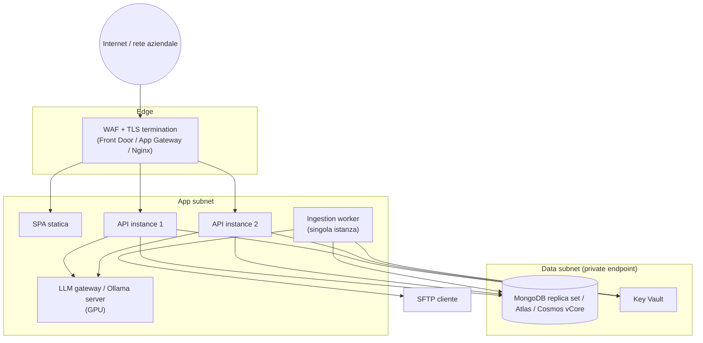

<!-- REVERSE-META
schema: 1
mode: how
step: 09_infrastructure_architecture
commit: 593f6decec3a642d5567754dd795b19560bb0afb
commit_short: 593f6de
branch: main
worktree: clean
baseline_date: 2026-10-05T10:14:05+00:00
generated_at: 2026-10-07T14:40:00Z
-->
# Infrastructure Architecture - Progetto LOSS_PREVENTION

> **Baseline commit:** `593f6de` (`main`) · worktree `clean`

**Data**: 2026-10-07 · **Versione**: 1.0 · **Autori**: REVERSE how · **Audience**: team tecnico, architetti, ops

---

## 1. Infrastructure Overview

Il repository **non contiene alcun artefatto infrastrutturale** (IaC, Dockerfile, compose, manifest, pipeline). L'unica infrastruttura deducibile dal codice è quella di **sviluppo locale**:

| Componente | Evidenza | Indirizzo |
|-----------|----------|-----------|
| API Kestrel | `Properties/launchSettings.json` | `http://localhost:5264`, `https://localhost:7110` (IIS Express `55993/44348`) |
| Vite dev server | CORS `AllowVueDev` | `http://localhost:5173`, `5174` |
| MongoDB | `appsettings.json` (`mongodb://` senza credenziali) | locale |
| SMTP | `Email.SmtpHost = localhost:25` | smtp4dev (commento nel codice) |
| Ollama | `aiStore.ts` | `http://localhost:11434` |
| File store batch | `DataIngestionService/Program.cs` | `C:\xmlstore5\xml` |

La documentazione del fornitore (`Docs/04_DEPLOYMENT_GUIDE.md`) propone un'architettura Azure: Front Door (CDN+WAF) → Static Web Apps (SPA) + **Azure Functions / App Service** (API) → Cosmos DB for MongoDB o MongoDB Atlas, con Application Insights e Key Vault. **Nota**: il backend attuale è un'applicazione ASP.NET Core con `BackgroundService`, non un progetto Azure Functions; il deploy su Functions richiederebbe una riprogettazione (lo scheduler in-process non è compatibile con il modello serverless). App Service o Container Apps sono compatibili senza modifiche strutturali.

## 2. Network Architecture

AS-IS: tutto su `localhost`. TARGET proposto (compatibile con il codice dopo le modifiche minime):

Requisiti di rete derivati dal codice: uscita SSH/22 verso SFTP, uscita SMTP (con TLS), accesso al DB su rete privata; la SPA non deve più contattare `localhost:11434`.

## 3. Hardware/VM Specifications

Nessuna specifica nel codice. Stime indicative per il TARGET:

| Ruolo | Dimensionamento iniziale | Motivazione |
|-------|--------------------------|-------------|
| API | 2 vCPU / 4 GB × 2 istanze | Aggregazioni e `DistanceDataService` caricano dati in memoria |
| Worker ingestione | 2 vCPU / 4 GB | Parsing file e bulk insert |
| MongoDB | 3 nodi replica set, 4 vCPU / 16 GB, SSD ≥ 100 GB | Volume dipendente da retention (180 gg) |
| LLM | GPU ≥ 16 GB VRAM o servizio gestito | `qwen2.5:14b` |

## 4. Redundancy & Failover
AS-IS: nessuna. Vincoli: `IMemoryCache` e scheduler in-process → ridondanza API possibile solo dopo aver estratto lo scheduler in un worker singolo o con lock distribuito.

## 5. Disaster Recovery
AS-IS: nessuna procedura. Esiste un dump mongodump di sviluppo versionato (da **rimuovere** dal repository per motivi di riservatezza). TARGET: backup giornaliero con point-in-time recovery, RPO ≤ 24 h, RTO ≤ 4 h, test di restore trimestrale.

## 6. Environments

| Ambiente | AS-IS | TARGET (da `roadmap.txt`) |
|----------|-------|---------------------------|
| Dev | Locale (unico definito) | Locale |
| Sales/UAT | — | Ambiente dedicato |
| Production | — | Ambiente dedicato, ≥ 2 istanze API |

Nessun file `appsettings.Development.json`/`Production.json` → la configurazione per ambiente va introdotta.

## 7. Infrastructure Ownership
Non definita. `roadmap.txt` indica tre opzioni: infrastruttura del fornitore, del cliente, o MongoDB Atlas.

---

## Reference Documents
- 00_deep_dive.md · 06_software_architecture.md · 10_deployment.md

## Change Log

| Versione | Data | Autore | Modifiche |
|----------|------|--------|-----------|
| 1.0 | 2026-10-07 | REVERSE how (FULL) | Creazione documento (sostituisce run 2026-10-05) |
