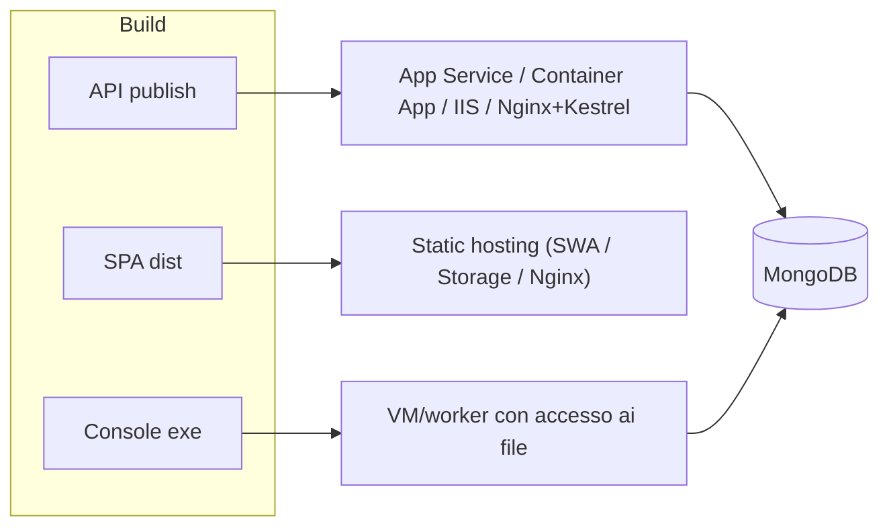
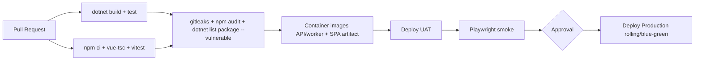

<!-- REVERSE-META
schema: 1
mode: how
step: 10_deployment
commit: 593f6decec3a642d5567754dd795b19560bb0afb
commit_short: 593f6de
branch: main
worktree: clean
baseline_date: 2026-10-05T10:14:05+00:00
generated_at: 2026-10-07T14:40:00Z
-->
# Deployment - Progetto LOSS_PREVENTION

> **Baseline commit:** `593f6de` (`main`) · worktree `clean`

**Data**: 2026-10-07 · **Versione**: 1.0 · **Autori**: REVERSE how · **Audience**: team tecnico, DevOps

---

## 1. Deployment Topology

AS-IS: **nessuna automazione di deploy**. Il deploy è manuale secondo `Docs/04_DEPLOYMENT_GUIDE.md` (az CLI, `dotnet publish`, SWA CLI, IIS/Nginx on-premise). Unità di deploy individuate dal codice:

| Unità | Comando di build | Output | Note |
|-------|------------------|--------|------|
| API (+ background ingestion) | `dotnet publish "LossPrevention.API/01. LossPrevention.API.csproj" -c Release` | cartella publish | Include `DataIngestionBackgroundService` |
| SPA | `npm ci && npm run build` (in `LossPrevention.UI`) | `dist/` | `VITE_API_BASE_URL` da `.env.production` |
| Console ingestion | `dotnet publish "LossPrevention.DataIngestionService/…csproj"` | exe | Tool di bulk load; path hardcoded |
| DB seed | `mongosh Data/MongoDBScripts/0X_*.js` | — | Ordine numerico |

## 2. Software-to-Infrastructure Mapping

## 3. Resource Allocation
Non definita nel codice (nessun limite container, nessun `appsettings` di tuning). Vedi stime nel documento 09 §3.

## 4. Deployment Strategy
AS-IS: non applicabile. Prerequisiti di codice per strategie blue-green/rolling:
1. CORS da configurazione (oggi hardcoded su localhost).
2. Scheduler di ingestione separato o con lock distribuito (altrimenti due slot attivi eseguono due ingestioni).
3. Health endpoint per lo swap.
4. Migrazioni dati idempotenti (oggi solo TTL index all'avvio, idempotente).

## 5. Rollback Procedures
Nessuna. Il codice non ha versioning di API né di schema; le uniche operazioni distruttive automatiche all'avvio sono la **drop** dell'indice regolare su `BeginDateTime` per sostituirlo con TTL (`DatabaseInitializationService`) — non reversibile automaticamente.

## 6. High Availability Configuration
Assente. Vincoli: cache e scheduler in-process; MongoClient Scoped (aumenta connessioni con più istanze).

## 7. Data Replication
Delegata a MongoDB (replica set / servizio gestito); non configurata nel codice (connection string senza `replicaSet`/`retryWrites`).

## 8. Pipeline CI/CD proposta

---

## Reference Documents
- 09_infrastructure_architecture.md · 11_development_environment.md

## Change Log

| Versione | Data | Autore | Modifiche |
|----------|------|--------|-----------|
| 1.0 | 2026-10-07 | REVERSE how (FULL) | Creazione documento (sostituisce run 2026-10-05) |
