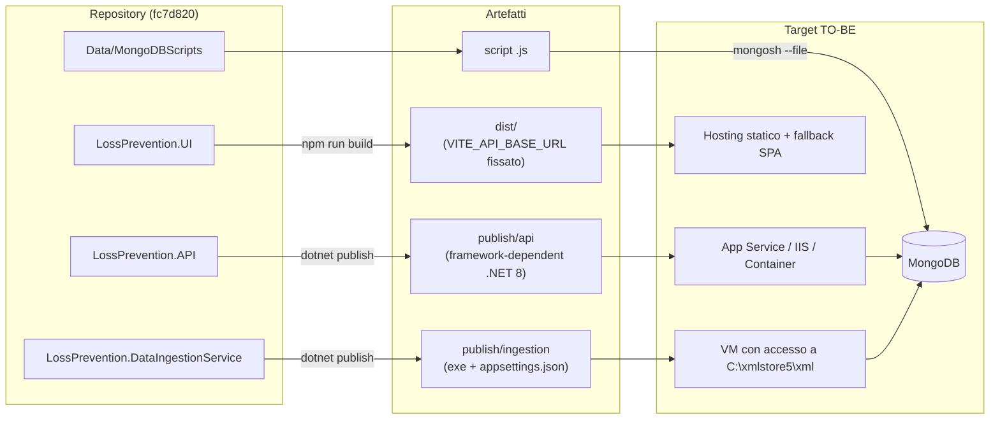
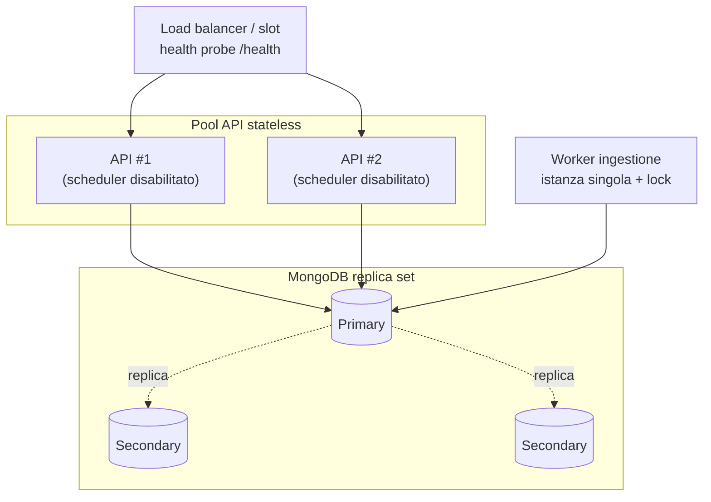
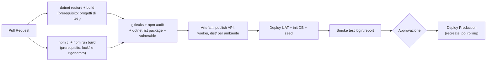

<!-- IMPACT-META
schema: 1
mode: how
step: 10_deployment
commit: fc7d820908b8b230fb47a2669920ba7efdb413a8
commit_short: fc7d820
branch: main
worktree: dirty
baseline_date: 2026-10-07T18:19:51+02:00
generated_at: 2026-10-08T09:41:39.009+02:00
-->
# Deployment - Progetto LOSS_PREVENTION

> **Baseline commit:** `fc7d820` (`main`) · worktree `dirty` (modifiche locali solo in `Docs/` e `.github/`; codice applicativo identico al commit)

**Data**: 2026-10-08  
**Versione**: 1.1  
**Autori**: REVERSE how (IMPACT) · verifica IMPACT verify  
**Audience**: Team tecnico, DevOps, release manager

---

## Sezioni Principali

Questo documento descrive come il software del Loss Prevention Tool viene (o potrebbe essere) distribuito sull'infrastruttura descritta in [09_infrastructure_architecture.md](09_infrastructure_architecture.md). Al commit `fc7d820` **non esiste alcuna automazione di deploy**: tutto ciò che segue come **AS-IS** è ricavato da codice, file di progetto e configurazione; tutto ciò che è **TO-BE** è una proposta non implementata.

**Fonti di evidenza**

| Fonte | Contenuto |
|-------|-----------|
| `LossPrevention.sln` | 5 progetti `net8.0` (VisualStudioVersion 17.11), nessun progetto di test |
| `LossPrevention.API/01. LossPrevention.API.csproj` | SDK `Microsoft.NET.Sdk.Web`, FastEndpoints 6.0.0 |
| `LossPrevention.DataIngestionService/02. LossPrevention.DataIngestionService.csproj` | `OutputType Exe`; `appsettings.json` copiato in output e publish (righe 14-20) |
| `LossPrevention.API/Program.cs` | Sequenza di avvio, init DB, hosted service, pipeline |
| `LossPrevention.UI/package.json`, `vite.config.js`, `src/api/api.ts` | Build SPA, variabile `VITE_API_BASE_URL` |
| `Data/MongoDBScripts/00..04_*.js`, `Data/LossPrevention/` | Seed e dump del database |
| `Docs/04_DEPLOYMENT_GUIDE.md` (storico) | Guida del fornitore: **non presente al baseline**, solo nel commit `593f6de`, rimossa in `d768cd9` (`git show 593f6de:customspa-it-loss-prevention-d098a8b97860/Docs/04_DEPLOYMENT_GUIDE.md`) |

---

## 1. Deployment Topology

**Sintesi.** Le unità di deploy ricavabili dal codice sono quattro: API (con lo scheduler di ingestione al suo interno), SPA statica, console di ingestione bulk e script di seed MongoDB. Non esistono Dockerfile, pipeline o IaC, quindi la topologia di produzione non è definita nel repository.

### 1.1 Unità di deploy (AS-IS)

| Unità | Comando di build/pubblicazione | Output | Configurazione richiesta | Note verificate |
|-------|-------------------------------|--------|--------------------------|-----------------|
| **API** (incluso `DataIngestionBackgroundService`) | `dotnet publish ".\LossPrevention.API\01. LossPrevention.API.csproj" -c Release -o .\publish\api` | Cartella framework-dependent (`01. LossPrevention.API.dll` + `appsettings.json`) | `appsettings.json` nella **working directory** del processo (`Program.cs:37-39`) | Il nome del `.csproj` contiene spazi e un punto: usare sempre le virgolette. Build .NET **non verificata** su questa macchina (SDK assente) |
| **SPA** | `npm install --no-package-lock` + `npm run build` in `LossPrevention.UI` | `dist/` (`index.html` + `assets/`) | `VITE_API_BASE_URL` **a build-time** (`api.ts:4`) | `npm ci` fallisce (lockfile non allineato, §11). Build verificata su Windows: 789 moduli, JS 6.020 kB |
| **Console ingestione bulk** | `dotnet publish ".\LossPrevention.DataIngestionService\02. LossPrevention.DataIngestionService.csproj" -c Release -o .\publish\ingestion` | Eseguibile + `appsettings.json` (`.csproj:15-19`) | `appsettings.json` nella working directory (`Program.cs:31-35`); file XML in `C:\xmlstore5\xml` (hardcoded, `Program.cs:76`) | Esecuzione manuale una tantum; nessun registro dei file elaborati (rieseguirla duplica i dati) |
| **Seed database** | `mongosh "<connection-string>" --file .\Data\MongoDBScripts\0X_*.js` | — | Database `LossPrevention` (hardcoded con `getSiblingDB`) | Ordine e prerequisiti in §5.3 e in [11_development_environment.md](11_development_environment.md) |

> **Correzione rispetto alla versione precedente**: la SPA **non** legge `.env.production` dal repository: nessun file `.env*` è versionato. La guida fornitore storica (`04_DEPLOYMENT_GUIDE.md`, righe 187-188 e 466) indica `VITE_API_URL` con suffisso `/api`, che **non corrisponde** al codice: la variabile letta è `VITE_API_BASE_URL` e la maggior parte delle rotte non ha prefisso `/api` (es. `POST /users/login`, `GET /rules/apply`; solo `/api/data-ingestion*` e `/api/fraud-detection/settings*` lo hanno).

### 1.2 Sequenza di avvio dell'API (determinante per il deploy)

| Passo | Operazione | Evidenza | Effetto sul deploy |
|-------|-----------|----------|--------------------|
| 1 | `WebApplication.CreateBuilder` + CORS `AllowVueDev` (solo `localhost:5173/5174`) | `Program.cs:24-34` | Va modificato il codice per ogni dominio reale |
| 2 | Ri-aggiunta di `appsettings.json` dalla directory corrente (`optional: false`) | `Program.cs:37-39` | Avvio fallisce se la cwd non contiene il file; variabili d'ambiente **non** sovrascrivono le chiavi presenti nel file |
| 3 | Lettura `JwtSettings` da un `ServiceProvider` temporaneo | `Program.cs:42-47` | La chiave JWT deve essere nel file |
| 4 | Registrazione FastEndpoints, Swagger, JWT, servizi, `AddHostedService<DataIngestionBackgroundService>` | `Program.cs:49-111` | Ogni istanza API avvia anche lo scheduler |
| 5 | `IDatabaseInitializationService.InitializeAsync()` **prima** di accettare richieste | `Program.cs:115-119` | Richiede MongoDB raggiungibile; in caso di errore l'eccezione è rilanciata (`DatabaseInitializationService.cs:36-40`) e il processo termina |
| 6 | Swagger solo in `Development` | `Program.cs:121-126` | — |
| 7 | `UseCors` → `UseAuthentication` → `UseAuthorization` → `UseFastEndpoints` → `Run` | `Program.cs:128-132` | Nessun HTTPS redirect, nessun health check |
| 8 | Lo scheduler attende 10 s, poi controlla la configurazione ogni 60 s | `DataIngestionBackgroundService.cs:28,41` | Un'ingestione può partire entro ~1 minuto dal deploy se l'orario coincide |

### 1.3 Topologie di destinazione (TO-BE)

| Opzione | Origine | API | SPA | Database | Compatibilità con il codice AS-IS |
|---------|---------|-----|-----|----------|-----------------------------------|
| A — Azure PaaS | Guida fornitore storica, righe 34-46 | App Service / Container Apps (Azure Functions proposto dal fornitore **non** compatibile, vedi 09 §1.4) | Static Web Apps | Atlas o Cosmos DB for MongoDB (vCore, da verificare) | Richiede CORS e configurazione esternalizzati |
| B — On-premise Windows | Guida fornitore storica (IIS) | IIS + ASP.NET Core Module (in-process) | IIS sito statico con URL Rewrite verso `index.html` | MongoDB replica set | Verificare che la working directory sia la cartella dell'app (requisito di `Program.cs:38`) |
| C — Container | Guida fornitore storica (Docker, riga 605 con `npm ci`) | Immagine `mcr.microsoft.com/dotnet/aspnet:8.0` | Nginx con `try_files ... /index.html` | Servizio gestito | `npm ci` richiede prima la rigenerazione del lockfile |

---

## 2. Software-to-Infrastructure Mapping

**Sintesi.** Ogni componente software è mappato sull'host che lo esegue e sulle dipendenze di rete/configurazione che il codice richiede. La tabella seguente è la base per qualsiasi piano di deploy.

### 2.1 Mappa componente → infrastruttura

| Componente software | Host AS-IS (dev) | Host TO-BE | Dipendenze runtime | Chiavi di configurazione (valori mascherati) |
|---------------------|------------------|-----------|--------------------|----------------------------------------------|
| FastEndpoints API (78 endpoint) | Kestrel `localhost:5264`/`7110` o IIS Express `55993`/`44348` | App Service / IIS / container (≥ 2 istanze dopo i fix di 09 §4) | MongoDB, SMTP | `MongoDbSettings:ConnectionString`, `MongoDbSettings:DatabaseName`, 13 `CollectionName_*`, `JwtSettings:SecretKey` (`****`, GUID versionato in `appsettings.json:30`), `Issuer`, `Audience`, `ExpiryHours`, `Email:*`, `DataRetention:TransactionRetentionDays` |
| `DataIngestionBackgroundService` | Nello stesso processo dell'API | Worker dedicato a istanza singola | MongoDB, SFTP, file system | Configurazione **nel DB** (`DataIngestionConfigurations`: sorgente, schedule, `FileSystemPath`, `SftpHost/Port/Username/Password` in chiaro) |
| SPA Vue 3 | Vite dev server `localhost:5173` | Hosting statico + CDN | API, Ollama (dal browser) | `VITE_API_BASE_URL` (build-time); Ollama `http://localhost:11434` hardcoded (`aiStore.ts:88`) |
| Console ingestione | Esecuzione manuale | VM/job con accesso alla cartella XML | MongoDB, file system locale | `appsettings.json` (6 `CollectionName_*`); path `C:\xmlstore5\xml` nel codice |
| Seed scripts | `mongosh` locale | Job di deploy una tantum | MongoDB | DB `LossPrevention` nel codice degli script |
| Email reset password | smtp4dev `localhost:25` | Relay SMTP aziendale | — | `Email:SmtpHost`, `SmtpPort` (stringa `"25"`), `FromEmail`, `FromName`, `FrontendUrl` (usato per il link `{FrontendUrl}/reset-password?token=…`, `EmailService.cs:29`) |

### 2.2 Parametri che cambiano tra ambienti

| Parametro | Dove si trova oggi | Valore dev | Va cambiato in deploy? | Modifica di codice necessaria? |
|-----------|--------------------|-----------|------------------------|-------------------------------|
| Origini CORS | `Program.cs:29` | `http://localhost:5173`, `http://localhost:5174` | Sì | **Sì** (hardcoded) |
| Connection string MongoDB | `appsettings.json:13` | `mongodb://localhost:27017` (senza credenziali) | Sì | No, ma il file deve essere modificato (gli override per variabile d'ambiente sono annullati da `Program.cs:37-39`) |
| Chiave firma JWT | `appsettings.json:30` | `****` (versionata in Git) | Sì, e ruotata | No |
| URL frontend nelle email | `appsettings.json:40` | `http://localhost:5173` | Sì | No |
| SMTP | `appsettings.json:36-37` | `localhost:25`, SSL off | Sì | **Sì** per abilitare TLS (`EnableSsl = false` hardcoded, `EmailService.cs:64`) |
| URL API per la SPA | `.env.local` dello sviluppatore | es. `http://localhost:5264` | Sì | No (ma una build per ambiente) |
| Endpoint LLM | `aiStore.ts:88` | `http://localhost:11434/api/generate` | Sì | **Sì** |
| Cartella XML console | `DataIngestionService/Program.cs:76` | `C:\xmlstore5\xml` | Sì | **Sì** |

---

## 3. Resource Allocation (CPU, Memory)

**Sintesi.** Il codice non definisce limiti di CPU/memoria (nessun container, nessuna configurazione GC/Kestrel). Sono invece ricavabili i parametri applicativi che determinano il consumo di risorse; il dimensionamento è una stima TO-BE.

### 3.1 Parametri applicativi che influenzano le risorse (AS-IS)

| Parametro | Valore | Evidenza | Impatto |
|-----------|--------|----------|---------|
| Intervallo polling scheduler | 60 s, ritardo iniziale 10 s | `DataIngestionBackgroundService.cs:13,28` | CPU trascurabile; una query DB al minuto per istanza |
| Timeout operazioni SFTP | 30 s | `SftpFileProcessingService.cs:59` | Thread bloccato fino al timeout se l'host non risponde |
| Parallelismo console | `Environment.ProcessorCount` | `DataIngestionService/Program.cs:23,85-89` | Usa tutti i core |
| Mapping post-ingestione | `ProcessMappings("ReportData", int.MaxValue)` | `FileProcessingCoordinator.cs:108` | Picco CPU/RAM proporzionale ai documenti |
| Applicazione regole | Tutta `ReportData` in memoria | `RulesService.cs:34` | Memoria ∝ dimensione collezione; richiesta HTTP lunga |
| Cache report | 1 h per chiave, nessun limite di dimensione | `GetReportDataEndpoint.cs:81`; `Program.cs:49` | Memoria API crescente |
| Retention TTL | 180 giorni (default 90) | `appsettings.json:9`; `DatabaseInitializationService.cs:23` | Spazio disco DB (vedi 09 §5.2 sul campo `BeginDateTime`) |
| Scadenza JWT | 1 h | `appsettings.json:33`; `LoginEndpoint.cs:78` | Nessun refresh token: nuovo login ogni ora |
| Scadenza token reset password | 1 h | `PasswordResetService.cs:19` | — |
| Hash password | PBKDF2-SHA256 600.000 iterazioni | `PasswordHasher.cs:9,21` | ~CPU significativa per ogni login: da considerare nel dimensionamento e nel rate limiting |

### 3.2 Allocazione TO-BE (stima iniziale)

| Unità | CPU | Memoria | Istanze | Note |
|-------|-----|---------|---------|------|
| API | 2 vCPU | 4 GB | 2 | Solo dopo aver separato lo scheduler (R1, 09 §4.1) |
| Worker ingestione | 2 vCPU | 4 GB + disco temporaneo | 1 | Doppio download SFTP (`FileProcessingCoordinator.cs:226-338`) |
| SPA | — | — | CDN | Bundle 6 MB non suddiviso: abilitare compressione |
| MongoDB | 4 vCPU | 16 GB | 3 (replica set) | Volume reale N/A — non ricavabile dal codice: nessuna stima di transazioni/giorno |

---

## 4. Deployment Strategy (Blue-Green, Canary, Rolling)

**Sintesi.** AS-IS nessuna strategia: il deploy è un'operazione manuale non documentata nel repository. Le strategie standard sono applicabili solo dopo alcuni interventi sul codice, elencati sotto.

### 4.1 Applicabilità delle strategie

| Strategia | Applicabile oggi? | Bloccanti nel codice | Prerequisiti |
|-----------|-------------------|----------------------|--------------|
| Recreate (stop → deploy → start) | ✅ Sì | — | Finestra di manutenzione; MongoDB raggiungibile all'avvio |
| Rolling | ⚠️ Con rischio | Scheduler su ogni istanza (`Program.cs:111`); cache per istanza; init DB concorrente (`Program.cs:115-119`) | Worker separato; init DB come step di deploy |
| Blue-Green | ⚠️ Con rischio | Entrambi gli slot eseguono lo scheduler → doppia ingestione; nessun health endpoint per lo swap; CORS hardcoded | Disattivare lo scheduler nello slot inattivo (oggi impossibile senza modificare il codice); endpoint `/health` |
| Canary | ❌ No | Nessun versionamento API; SPA e API devono essere compatibili; nessuna telemetria per confrontare le versioni | Telemetria (12 §1), feature flag |

### 4.2 Strategia raccomandata (TO-BE)

1. **Fase 1 (codice AS-IS)**: *Recreate* con finestra di manutenzione, una sola istanza API.
2. **Fase 2 (dopo i fix)**: *Rolling* su ≥ 2 istanze API + worker dedicato, con health probe.
3. **Fase 3**: *Blue-Green* con slot swap (App Service) o due deployment (container), smoke test automatizzati prima dello swap.

### 4.3 Checklist di deploy manuale (applicabile al codice AS-IS)

| # | Passo | Comando / verifica |
|---|-------|--------------------|
| 1 | Backup del database | `mongodump --uri "<connection-string>" --db LossPrevention --gzip --archive=LossPrevention_<data>.gz` |
| 2 | Aggiornare CORS nel codice per il dominio reale | `Program.cs:29` |
| 3 | Preparare `appsettings.json` di destinazione (connection string, chiave JWT nuova, SMTP, `FrontendUrl`) | Non usare il file versionato con la chiave di sviluppo |
| 4 | Pubblicare l'API | `dotnet publish ".\LossPrevention.API\01. LossPrevention.API.csproj" -c Release -o .\publish\api` |
| 5 | Costruire la SPA con l'URL dell'ambiente | `$env:VITE_API_BASE_URL="https://api.<dominio>"; npm run build` |
| 6 | Fermare l'API, sostituire i file, avviare con cwd = cartella di publish | Verificare nel log `Database initialization completed successfully` |
| 7 | Pubblicare `dist/` con fallback SPA verso `index.html` | Router `createWebHistory()` (`router/index.ts:52`) |
| 8 | Eseguire eventuali script di seed nuovi | `mongosh "<connection-string>" --file <script>` |
| 9 | Smoke test | `POST /users/login`, caricamento dashboard, `GET /api/data-ingestion` |

---

## 5. Rollback Procedures

**Sintesi.** Non esiste alcuna procedura di rollback. Il rollback del codice è un ri-deploy dell'artefatto precedente; il rollback dei dati è possibile solo da backup, perché diverse operazioni automatiche o manuali sono **irreversibili**.

### 5.1 Operazioni irreversibili presenti nel codice

| Operazione | Quando avviene | Evidenza | Reversibile? |
|-----------|----------------|----------|--------------|
| Drop di un indice regolare su `BeginDateTime` | Avvio API | `DatabaseInitializationService.cs:89-94` | Sì, ricreando l'indice (ma al riavvio verrà ridroppato) |
| Creazione indice TTL `ttl_BeginDateTime` | Avvio API, solo se assente | `DatabaseInitializationService.cs:97-105` | **No** per i documenti già scaduti: MongoDB li cancella subito dopo la creazione |
| `$unset` di `FraudFlags` su tutta `ReportData` + riscrittura | `GET /rules/apply` | `RulesService.cs:41,58` | Solo da backup |
| Cancellazione configurazione ingestione | `DELETE /api/data-ingestion` | `DataIngestionService.cs:176-180` | Solo da backup |
| Spostamento file SFTP in `processed/`/`failed/` | Ogni ingestione SFTP | `SftpFileProcessingService.cs:179-180,201-238` | Manuale sul server SFTP |
| Script `00`, `03` (`deleteOne` su `Permissions`), `04` (`deleteOne` regola `IsGiftCard`, `updateMany` dei `FieldPath`) | Esecuzione manuale | `00_…js:46`, `03_…js:28`, `04_…js:14-27` | Solo da backup |

### 5.2 Procedura di rollback TO-BE

1. **Prima di ogni deploy**: backup (`mongodump`) e conservazione degli artefatti precedenti (`publish/api`, `dist/`).
2. **Rollback applicativo**: fermare l'API, ripristinare la cartella di publish precedente, riavviare; ripubblicare la `dist/` precedente.
3. **Rollback dati** (solo se il deploy ha eseguito script o `GET /rules/apply`): `mongorestore --uri "<connection-string>" --gzip --archive=LossPrevention_<data>.gz --nsInclude "LossPrevention.*" --drop`.
4. **Verifica**: login, report, configurazione ingestione; controllare che lo scheduler non abbia avviato ingestioni durante la finestra.

### 5.3 Ordine e idempotenza degli script di seed

| Script | Operazioni | Idempotente | Prerequisiti |
|--------|-----------|-------------|--------------|
| `00_CleanupDuplicatePermissions.js` | `deleteOne` dei duplicati in `Permissions` | Sì | — |
| `01_CreatePermissions.js` | `updateOne` se esiste, altrimenti `insertOne` (per `PermissionName`, righe 80-93) | Sì | — |
| `02_AddPermissionsToAdminRole.js` | `$set` di **tutti** i permessi sul ruolo `Admin` | Sì | Ruolo `RoleName: "Admin"` esistente (righe 7, 20-33: se manca stampa un esempio di `insertOne` e non fa nulla) |
| `03_CleanupStalePermissions.js` | Elimina `CAN_LOGIN`, `CAN_ADD_USERS`, `CAN_DELETE_USERS`, `CAN_UPDATE_USERS` e gli ID orfani dai ruoli | Sì | Dopo `02` |
| `04_AddLossPreventionRules.js` | Corregge `FieldPath`, elimina `IsGiftCard`, inserisce regole mancanti | Sì (inserimento solo se assente, righe 165-175) | — |

---

## 6. High Availability Configuration

**Sintesi.** AS-IS non esiste alta affidabilità: un processo API, un `mongod`, nessun bilanciatore, nessun health check. Il codice va adeguato prima che l'HA sia possibile (dettaglio in [09_infrastructure_architecture.md](09_infrastructure_architecture.md) §4).

### 6.1 Stato AS-IS

| Requisito HA | Stato | Evidenza |
|--------------|-------|----------|
| Più istanze API | ❌ Non sicuro | Scheduler, cache, init DB per istanza |
| Health/readiness probe | ❌ Assente | Nessun `AddHealthChecks`/`MapHealthChecks`; nessuna rotta `/health` tra i 78 endpoint. L'endpoint `/health` della guida fornitore (`12_MAINTENANCE_OPERATIONS.md` righe 654-691, storico) **non è implementato** |
| Sessioni | ✅ Stateless (JWT) | `Program.cs:63-76` |
| Graceful shutdown scheduler | ✅ Parziale | `stoppingToken` rispettato in `Task.Delay` (`DataIngestionBackgroundService.cs:28,41`) |
| Retry verso MongoDB | Default del driver | Nessuna opzione nel codice |
| MongoDB ridondato | ❌ | Host singolo nella connection string |

### 6.2 Configurazione HA TO-BE

Prerequisiti di codice: (1) endpoint `/health` con controllo MongoDB; (2) flag di configurazione per abilitare lo scheduler solo sul worker; (3) `LastRunAt` persistito con update atomico; (4) indice univoco su `ProcessedFiles.fileName`; (5) `MongoClient` singleton; (6) CORS da configurazione.

---

## 7. Data Replication

**Sintesi.** La replica dei dati è interamente delegata a MongoDB e non è configurata: la connection string punta a un singolo host senza opzioni di replica, e il codice non usa transazioni né read/write concern espliciti.

### 7.1 AS-IS

| Aspetto | Stato | Evidenza |
|---------|-------|----------|
| Connection string | `mongodb://localhost:27017` (nessun `replicaSet`, `retryWrites`, `tls`, credenziali) | `appsettings.json:13` |
| Transazioni multi-documento | Non usate | Nessuna occorrenza di `StartSession`/`WithTransaction` |
| Write concern / read preference | Default del driver | Nessuna configurazione in `InfrastructureServiceExtensions.cs` |
| Operazioni multi-step non atomiche | `RulesService.ApplyRulesAsync` (unset globale + replace per documento); ingestione file (insert + `ProcessedFiles`) | `RulesService.cs:41,58`; `FileProcessingCoordinator.cs:349-377` |
| Copia dati tra ambienti | Solo tramite dump versionato `Data/LossPrevention/` (12 collezioni, MongoDB 8.3.2) | `prelude.json` |

### 7.2 Raccomandazioni TO-BE

1. Replica set a 3 nodi o servizio gestito; connection string con `replicaSet`/SRV, `retryWrites=true`, `tls=true` e credenziali da secret store.
2. Le operazioni multi-step (`ApplyRulesAsync`, ingestione) beneficerebbero di transazioni o di un modello a staging per non lasciare stati parziali in caso di failover.
3. Dati non di produzione: non copiare il dump versionato (contiene utenti e configurazione) in ambienti condivisi; usare seed dedicati.

---

## 8. Pipeline CI/CD proposta (TO-BE)

**Sintesi.** Proposta di pipeline coerente con lo stack; i passi marcati come "prerequisito" falliscono sul codice AS-IS.

| Step | Stato sul codice AS-IS |
|------|------------------------|
| `dotnet build` | Non verificato (SDK assente sulla macchina di analisi) |
| `dotnet test` | N/A — nessun progetto di test nella soluzione |
| `npm ci` | ❌ Fallisce (`EUSAGE`, lockfile non sincronizzato: es. `Missing: vue-tsc@2.2.12 from lock file`) |
| `npm run build` | ✅ Su Windows; ❌ su agent Linux per i 12 import con maiuscole/minuscole errate (vedi 11 §5) |
| `vue-tsc --noEmit` | ❌ Crash (vue-tsc 1.8.27 incompatibile con TypeScript 5.9.3 installato) |
| Secret scanning | Rileverebbe `JwtSettings:SecretKey` in `appsettings.json` |

---

## Reference Documents

- **Deep Dive Analysis**: [00_deep_dive.md](00_deep_dive.md)
- **Context**: [01_context.md](01_context.md)
- **Functional Overview**: [02_functional_overview.md](02_functional_overview.md)
- **Non-Functional Overview**: [03_non_functional_overview.md](03_non_functional_overview.md)
- **Constraints**: [04_constraints.md](04_constraints.md)
- **Principles**: [05_principles.md](05_principles.md)
- **Software Architecture**: [06_software_architecture.md](06_software_architecture.md)
- **Code**: [07_code.md](07_code.md)
- **Data**: [08_data.md](08_data.md)
- **Infrastructure Architecture**: [09_infrastructure_architecture.md](09_infrastructure_architecture.md)

Documenti correlati successivi: [11_development_environment.md](11_development_environment.md) · [12_operation_and_support.md](12_operation_and_support.md) · [19_modernization_estimation_spec.md](19_modernization_estimation_spec.md)

---

## Change Log

| Versione | Data | Autore | Modifiche |
|----------|------|--------|-----------|
| 1.0 | 2026-10-07 | REVERSE how (FULL) | Creazione documento (sostituisce run 2026-10-05) |
| 1.1 | 2026-10-08 | IMPACT verify | Espansione completa: unità di deploy con comandi quotati per i `.csproj` con spazi, sequenza di avvio API (`Program.cs:24-132`), mappa componente→infrastruttura con chiavi mascherate, parametri da cambiare tra ambienti, parametri applicativi di risorsa, matrice di applicabilità strategie, checklist deploy manuale, operazioni irreversibili e idempotenza script di seed, HA/replica AS-IS vs TO-BE, stato reale degli step CI. Correzioni: `npm ci` → fallisce (lockfile), `.env.production` → nessun `.env` versionato, guida fornitore (con `VITE_API_URL` errata) citata come storica (`593f6de`, rimossa in `d768cd9`); endpoint `/health` dichiarato non implementato; Reference Documents completi; header `worktree: dirty` |
