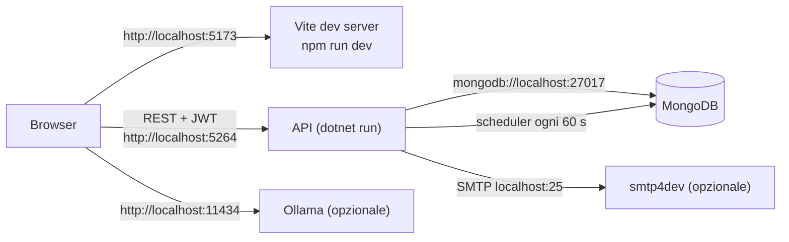

<!-- IMPACT-META
schema: 1
mode: how
step: 11_development_environment
commit: fc7d820908b8b230fb47a2669920ba7efdb413a8
commit_short: fc7d820
branch: main
worktree: dirty
baseline_date: 2026-10-07T18:19:51+02:00
generated_at: 2026-10-08T09:41:39.009+02:00
-->
# Development Environment - Progetto LOSS_PREVENTION

> **Baseline commit:** `fc7d820` (`main`) · worktree `dirty` (modifiche locali solo in `Docs/` e `.github/`; codice applicativo identico al commit)

**Data**: 2026-10-08  
**Versione**: 1.1  
**Autori**: REVERSE how (IMPACT) · verifica IMPACT verify  
**Audience**: Sviluppatori (onboarding), tech lead

---

## Sezioni Principali

Questa guida serve a rendere operativo uno sviluppatore sul Loss Prevention Tool su **Windows**, l'unico sistema operativo su cui la build del frontend funziona al commit `fc7d820` (vedi §4.3). Ogni comando è marcato:

- ✅ **verificato**: eseguito durante questa analisi (Windows, Node v22.14.0, npm 10.9.2, PowerShell 7.6);
- ⚠️ **non verificato**: derivato dal codice/configurazione ma non eseguito perché lo strumento non era disponibile (.NET SDK, `mongosh`, `mongorestore`, Ollama non installati sulla macchina di analisi).

La guida fornitore `Docs/03_SETUP_INSTALLATION.md` e la strategia di test `Docs/13_TESTING_QA.md` **non esistono al baseline**: erano presenti solo nel commit `593f6de` e sono state rimosse in `d768cd9` (consultabili con `git show 593f6de:customspa-it-loss-prevention-d098a8b97860/Docs/<file>` da `C:\repository\LOSS_PREVENTION`). Sono citate solo come fonte storica, verificando ogni affermazione ripresa.

---

## 1. Prerequisites & Dependencies

**Sintesi.** Servono .NET 8 SDK, Node.js con npm, MongoDB con i relativi tool a riga di comando e, facoltativamente, smtp4dev e Ollama. Il repository non fissa versioni di toolchain (nessun `global.json`, `.nvmrc` o campo `engines`).

### 1.1 Strumenti

| Strumento | Versione | Obbligatorio | Fonte / evidenza |
|-----------|----------|--------------|------------------|
| .NET SDK | 8.0.x (qualsiasi SDK ≥ 8 che compili `net8.0`; nessun `global.json`) | Sì | `<TargetFramework>net8.0</TargetFramework>` in tutti i 5 `.csproj` |
| Visual Studio 2022 | ≥ 17.11 consigliato (la soluzione è salvata con `VisualStudioVersion = 17.11`) — in alternativa VS Code | Consigliato | `LossPrevention.sln` |
| Node.js / npm | Verificato con Node **22.14.0** / npm **10.9.2**; Vite 6 richiede Node ≥ 18 | Sì | `package.json` (`vite ^6.3.5`); guida storica indicava Node ≥ 18 (`03_SETUP_INSTALLATION.md:24`) |
| MongoDB Server | Il dump è stato creato con **MongoDB 8.3.2** (`Data/LossPrevention/prelude.json`); il driver è MongoDB.Driver 3.4.0 | Sì | La guida storica indicava ≥ 6.0 (`03_SETUP_INSTALLATION.md:30`); README indica 7.0+ |
| MongoDB Shell `mongosh` | Recente | Sì (seed) | Header di `04_AddLossPreventionRules.js:5` |
| MongoDB Database Tools (`mongorestore`, `mongodump`) | Il dump è stato creato con **ToolVersion 100.13.0** | Sì (dump) | `prelude.json` |
| smtp4dev (o altro SMTP su `localhost:25` senza TLS) | — | Solo per il reset password | `appsettings.json:36-37`; commento in `EmailService.cs:64` |
| Ollama + modello `qwen2.5:14b` | — | Solo per le funzioni AI | `aiStore.ts:8,88` |
| Git | — | Sì | — |

### 1.2 Dipendenze applicative principali

| Area | Pacchetti (versioni dichiarate) |
|------|---------------------------------|
| API | FastEndpoints / .Security / .Swagger **6.0.0**; Microsoft.Extensions.Configuration(.Binder) 9.0.4 |
| Application | MongoDB.Driver / MongoDB.Bson **3.4.0**, SSH.NET 2025.1.0, FluentValidation 11.11.0, Newtonsoft.Json 13.0.3, Microsoft.AspNetCore.Http.Features 5.0.17 (obsoleto) |
| Infrastructure | MongoDB.Driver 3.4.0, `FrameworkReference Microsoft.AspNetCore.App` |
| Console | Microsoft.Extensions.Hosting 9.0.4 |
| UI | vue ^3.5.12, vuetify ^3.7.3, pinia ^2.2.4, vue-router ^4.6.3, axios ^1.9.0, ag-grid 35, chart.js 4, xlsx, jspdf, pdfmake; devDependencies vite ^6.3.5, typescript ^5.0.0, vue-tsc ^1.2.0, `nuxt ^3.0.0` (inutilizzato) |

### 1.3 Requisiti hardware

N/A — non ricavabile dal codice: nessun requisito è definito nel repository. La guida storica del fornitore (`03_SETUP_INSTALLATION.md:52-59`) indicava minimo 8 GB RAM / 10 GB disco / dual-core, consigliato 16 GB / 50 GB SSD / quad-core; per eseguire `qwen2.5:14b` in locale serve memoria aggiuntiva (GPU consigliata).

---

## 2. IDE Setup & Configuration

**Sintesi.** Il repository non contiene configurazioni condivise di stile, lint o analisi statica; l'unica configurazione IDE versionata è la raccomandazione dell'estensione Vue per VS Code.

| Elemento | Stato AS-IS | Evidenza |
|----------|-------------|----------|
| `.vscode/extensions.json` | Raccomanda solo `Vue.volar` | `LossPrevention.UI/.vscode/extensions.json` |
| `.vscode/settings.json`, `launch.json` | Assenti | La `.gitignore` della UI ignora `.vscode/*` tranne `extensions.json` |
| `.editorconfig`, `Directory.Build.props`, `*.ruleset` | Assenti | Ricerca nel repository |
| ESLint / Prettier | Assenti (nessun file di config, nessuno script `lint`) | `package.json` (script solo `dev`, `build`, `preview`) |
| TypeScript | `strict: true`, ma nessuno script di type-check | `tsconfig.json`; `vue-tsc` non eseguibile (§4.3) |
| Nullable reference types .NET | `enable` in tutti i progetti | `.csproj` |
| Profili di debug API | `http`, `https`, `IIS Express` | `Properties/launchSettings.json` |

**Configurazione consigliata**

- **Visual Studio 2022**: aprire `LossPrevention.sln`, impostare `01. LossPrevention.API` come progetto di avvio, profilo `https` (apre `/swagger`).
- **VS Code**: estensioni *Vue - Official* (`Vue.volar`), *C# Dev Kit*, *MongoDB for VS Code*; aprire la cartella `customspa-it-loss-prevention-d098a8b97860`.
- TO-BE: aggiungere `.editorconfig`, ESLint + Prettier e uno script `type-check` dopo aver allineato `vue-tsc` (§4.3).

---

## 3. Repository Setup & Branching

**Sintesi.** Il codice si trova in una **sottocartella** del repository Git; esiste un solo branch (`main`) e nessuna strategia di branching definita.

### 3.1 Clonazione (PowerShell)

```powershell
git clone https://github.com/saristot/LOSS_PREVENTION.git
Set-Location .\LOSS_PREVENTION\customspa-it-loss-prevention-d098a8b97860
```

### 3.2 Struttura

| Percorso | Contenuto |
|----------|-----------|
| `LossPrevention.sln` | Soluzione con 5 progetti `net8.0` |
| `LossPrevention.API/` | Host ASP.NET Core + FastEndpoints (`01. LossPrevention.API.csproj`) |
| `LossPrevention.Application/`, `LossPrevention.Domain/`, `LossPrevention.Infrastructure/` | Servizi, entità, repository MongoDB |
| `LossPrevention.DataIngestionService/` | Console di caricamento bulk XML (`02. LossPrevention.DataIngestionService.csproj`) |
| `LossPrevention.UI/` | SPA Vue 3 + Vite (`package.json` con nome `workflowbuilder`) |
| `Data/LossPrevention/` | Dump `mongodump` di 12 collezioni (10 in uso + `Mappings_old`, `ReportData_old`) |
| `Data/MongoDBScripts/` | Script di seed `00..04`, `rules_export.json`, `PERMISSIONS_LIST.md` |
| `Docs/` | Documentazione IMPACT |

### 3.3 Storia e branching

| Aspetto | AS-IS |
|---------|-------|
| Branch | Solo `main` |
| Commit | 13, un solo autore; codice importato in blocco in `593f6de` ("add codice"); commit successivi solo documentazione |
| Strategia di branching | Non definita (la `roadmap.txt` storica elenca "Branching Strategy" come attività da fare) |
| Hook / CI | Nessuno |

### 3.4 Note su `.gitignore` e file tracciati

| Aspetto | Dettaglio | Conseguenza |
|---------|-----------|-------------|
| `.gitignore` radice | Template Visual Studio; ignora `[Bb]in/`, `[Oo]bj/`, `node_modules/` e **`.github/`** (riga 369) | Una futura cartella `.github/workflows` verrebbe ignorata (nel worktree è presente una modifica locale non applicativa che aggiunge eccezioni `!.github/`) |
| `.env` | **Non** ignorato dalla `.gitignore` radice; la `.gitignore` della UI ignora `*.local` | Usare `.env.local` (mai `.env`) per valori locali |
| Artefatti di tool tracciati | 5 file `*.csproj.lscache` e `LossPrevention.UI/.vite/deps/_metadata.json`, `package.json` | Rumore nei diff; candidati alla rimozione |
| `package-lock.json` | Tracciato ma **non sincronizzato** con `package.json` | `npm ci` fallisce (§4.2) |
| Segreti | `JwtSettings:SecretKey` (GUID, mascherato) versionato in `LossPrevention.API/appsettings.json:30` | Non riutilizzare fuori dallo sviluppo locale |

---

## 4. Build Instructions

**Sintesi.** Il backend si compila con `dotnet build` (non verificato: SDK assente sulla macchina di analisi); il frontend si installa con `npm install` (non `npm ci`) e si compila con `npm run build`, verificato su Windows.

### 4.1 Backend (.NET) — ⚠️ non verificato

```powershell
# dalla cartella customspa-it-loss-prevention-d098a8b97860
dotnet --list-sdks                         # deve elencare un SDK 8.x o superiore
dotnet restore .\LossPrevention.sln
dotnet build .\LossPrevention.sln -c Debug
```

I nomi dei progetti contengono spazi e un punto: per comandi su un singolo progetto usare le virgolette, ad esempio `dotnet build ".\LossPrevention.API\01. LossPrevention.API.csproj"`.

### 4.2 Frontend — ✅ verificato

```powershell
Set-Location .\LossPrevention.UI
npm install --no-package-lock --no-audit --no-fund   # ✅ 921 pacchetti, ~3 min; non modifica il lockfile
[IO.File]::WriteAllText("$PWD\.env.local", "VITE_API_BASE_URL=http://localhost:5264`n")   # UTF-8 senza BOM
npm run build                                          # ✅ 789 moduli, ~1 min 10 s
```

| Comando | Esito verificato | Dettaglio |
|---------|------------------|-----------|
| `npm ci` | ❌ Fallisce | `npm error code EUSAGE` — "`npm ci` can only install packages when your package.json and package-lock.json … are in sync"; es. `Missing: vue-tsc@2.2.12 from lock file`, `@volar/typescript@2.4.15` |
| `npm install --no-package-lock …` | ✅ | Versioni effettive diverse dal lockfile: vite 6.4.4 (lock 6.4.1), vue 3.5.43 (lock 3.5.14), typescript 5.9.3 (lock 5.6.3), nuxt 3.21.11 (lock 3.17.3) |
| `npm run build` | ✅ (Windows) | Output `dist/`: JS **6.020,10 kB** (gzip 2.112,95 kB), CSS 1.180,35 kB, font MDI. Avvisi: uso di `eval` in `resultsGrid.vue` (~riga 918) e chunk > 500 kB |
| `npx vue-tsc --noEmit` | ❌ Crash | `Search string not found: "/supportedTSExtensions = .*(?=;)/"` — vue-tsc 1.8.27 incompatibile con TypeScript 5.9.3 |
| `npm run dev` | ✅ | `VITE v6.4.4 ready`, `http://localhost:5173/` (HTTP 200) |

> **Perché `npm install --no-package-lock`**: evita di riscrivere `package-lock.json` (file tracciato). Chi è incaricato di correggere il lockfile deve eseguire `npm install` senza flag e committare il risultato; solo dopo `npm ci` funzionerà.
>
> **Perché non `echo … > .env.local`**: in Windows PowerShell 5.1 la redirezione `>` scrive UTF-16 LE; Vite non legge correttamente la variabile e `baseURL` risulta `undefined` (le chiamate partono verso `http://localhost:5173`). `[IO.File]::WriteAllText` scrive UTF-8 senza BOM.

### 4.3 Problemi noti di build del frontend

| # | Problema | Evidenza | Effetto | Workaround / fix |
|---|----------|----------|---------|------------------|
| B1 | **12 import con maiuscole/minuscole errate** | `workspaceStore`→`workspacestore.ts` (`dashboard.vue:123`, `dashboardsList.vue:132`, `tabularBlock.vue:43`, `queryBuilderTabs.vue:131`, `workspace.vue:58`, `home.vue:89`); `roleStore`→`rolestore.ts` (`roles.vue:96`, `users.vue:133`); `./chartBlock.vue`→`chartblock.vue` (`dashboardGrid.vue:85`); `./fraudSettingsDialog.vue`→`FraudSettingsDialog.vue` (`resultsGrid.vue:511`); `../stores/passwordResetStore`→`PasswordResetStore.ts` (`ForgotPassword.vue:49`, `ResetPassword.vue:86`) | Build **fallisce su Linux/macOS** (file system case-sensitive); funziona su Windows | Sviluppare su Windows; fix: allineare gli import ai nomi reali dei file |
| B2 | **1 import irrisolvibile** su ogni sistema operativo | `ScheduleForm.vue:27` importa `@/store/useDataIngestionStore` (percorso inesistente; lo store reale è `@/stores/dataIngestionStore`, usato da `dataingestion.vue:215`) | Non blocca la build (componente orfano, non importato da nessuno); in `npm run dev` richiedere il modulo dà **HTTP 500** "Failed to resolve import" (✅ verificato) | Correggere l'import o eliminare il componente |
| B3 | Lockfile non sincronizzato | §4.2 | `npm ci` inutilizzabile (CI) | Rigenerare il lockfile |
| B4 | `vue-tsc` non funzionante | §4.2 | Nessun type-check | Aggiornare `vue-tsc` a 2.x |
| B5 | Bundle unico da 6 MB | Output build | Avvisi Vite; caricamento lento | Code splitting / lazy routes |

In totale gli import non risolvibili su file system case-sensitive sono **13** (B1 + B2), coerentemente con il fact sheet IMPACT.

### 4.4 Console di ingestione — ⚠️ non verificato

```powershell
dotnet build ".\LossPrevention.DataIngestionService\02. LossPrevention.DataIngestionService.csproj"
```

`appsettings.json` viene copiato nell'output (`.csproj:15-19`), ma il programma lo cerca nella **directory corrente** (`Program.cs:31-35`): eseguirla dalla cartella del progetto (vedi §7.4).

---

## 5. Test Execution

**Sintesi.** **Nel repository non esiste alcun framework di test e nessun test.** Non è quindi possibile eseguire la suite né un singolo test; la sola verifica automatica disponibile è la build.

### 5.1 Evidenze AS-IS

| Verifica | Risultato |
|----------|-----------|
| Progetti `*.Tests` / riferimenti a xUnit, NUnit, MSTest nella soluzione | Nessuno (5 progetti, tutti applicativi) |
| `vitest`, `jest`, `@vue/test-utils`, `playwright`, `cypress` in `package.json` | Nessuno |
| Script `test` in `package.json` | Assente (solo `dev`, `build`, `preview`) |
| File `*.spec.*` / `*.test.*` in `src/` | Nessuno |
| Pipeline CI che esegua test | Nessuna |
| `Docs/13_TESTING_QA.md` (storico, solo in `593f6de`) | Descrive xUnit, Vitest, Playwright, k6, OWASP ZAP e GitHub Actions — **nulla è implementato** |

### 5.2 Come eseguire un singolo test

N/A — non ricavabile dal codice: non esiste alcun framework di test né alcun test. Una volta introdotti i framework (TO-BE), i comandi saranno:

```powershell
# Backend (TO-BE, dopo aver creato es. tests\LossPrevention.Application.Tests con xUnit)
dotnet test .\LossPrevention.sln
dotnet test .\LossPrevention.sln --filter "FullyQualifiedName~PasswordHasherTests.VerifyPassword_LegacyHash"

# Frontend (TO-BE, dopo `npm install -D vitest @vue/test-utils jsdom`)
npx vitest run
npx vitest run src/stores/__tests__/loginStore.spec.ts -t "login salva il token"
```

### 5.3 Verifica manuale disponibile oggi

| Verifica | Come |
|----------|------|
| API | Swagger UI su `https://localhost:7110/swagger` (solo `Development`, `Program.cs:121-126`) |
| Login | `POST /users/login` con body `{ "username": "…", "password": "…" }` → `{ "token": "…" }` |
| Frontend | `npm run build` (✅) + navigazione manuale |

### 5.4 Priorità di test consigliate (TO-BE)

1. `PasswordHasher` (formato `v2:` e legacy, `PasswordHasher.cs:12-47`).
2. `DataIngestionBackgroundService.ShouldRunNow` (finestre ±1 min, giorni della settimana, mensile solo il giorno 1).
3. `RulesService` e `FraudDetectionSettings` (regole antifrode).
4. Test di integrazione con MongoDB in container per ingestione e idempotenza (`ProcessedFiles`).

---

## 6. Database Setup

**Sintesi.** Due percorsi: (A) ripristinare il dump versionato, che include utenti, ruolo `Admin` con 37 permessi e 3.000 transazioni; (B) creare un database minimo con gli script di seed, che però **non** creano alcun utente. Il nome del database `LossPrevention` è fisso negli script.

### 6.1 Avvio di MongoDB

```powershell
mongosh "mongodb://localhost:27017" --eval "db.runCommand({ ping: 1 })"   # ⚠️ deve restituire { ok: 1 }
```

La connection string di sviluppo è `mongodb://localhost:27017` senza credenziali (`appsettings.json:13` in entrambi i progetti).

### 6.2 Opzione A — Ripristino del dump (consigliata) — ⚠️ non verificato

```powershell
# dalla cartella customspa-it-loss-prevention-d098a8b97860
mongorestore --uri "mongodb://localhost:27017" --nsInclude "LossPrevention.*" --nsExclude "LossPrevention.*_old" --drop .\Data
```

| Contenuto del dump | Documenti |
|--------------------|-----------|
| `ReportData` | 3.000 (`TransactionDateTime` dal 2025-08-13 al 2025-11-12) |
| `ProcessedFiles` | 3.000 |
| `Mappings` | 52 |
| `Permissions` | 37 |
| `Roles` | 1 (`Admin`, 37 permessi) |
| `Users` | 2 (attivi, ruolo `Admin`, hash in formato legacy) |
| `Rules` 3, `Workspaces` 3, `Dashboards` 1, `DataIngestionConfigurations` 1 | — |
| `Mappings_old` 12, `ReportData_old` 100 | Collezioni obsolete, escluse dal comando sopra |

Avvertenze:

- `ReportData.metadata.json` contiene già l'indice TTL `ttl_BeginDateTime` (`expireAfterSeconds 15552000` = 180 giorni). I documenti del dump **non** hanno il campo `BeginDateTime` (verificato), quindi non vengono cancellati dal TTL.
- `DataIngestionConfigurations` punta a `FileSystemPath = C:\xmlxstore4\transactions_xml` con `ScheduleType one-time`: lo scheduler non la esegue (vedi §8).
- Le password degli utenti del dump non sono ricavabili dal codice: per accedere usare il reset password (§6.4).

### 6.3 Opzione B — Seed minimo con gli script — ⚠️ non verificato

Ordine obbligatorio (gli script usano `db.getSiblingDB('LossPrevention')`):

```powershell
$uri = "mongodb://localhost:27017"
mongosh $uri --file .\Data\MongoDBScripts\00_CleanupDuplicatePermissions.js
mongosh $uri --file .\Data\MongoDBScripts\01_CreatePermissions.js
# Prerequisito di 02: il ruolo Admin deve esistere (02 altrimenti stampa un esempio e non fa nulla)
mongosh $uri --eval "db.getSiblingDB('LossPrevention').Roles.insertOne({ RoleName: 'Admin', Description: 'Admin Permissions', Permissions: [] })"
mongosh $uri --file .\Data\MongoDBScripts\02_AddPermissionsToAdminRole.js
mongosh $uri --file .\Data\MongoDBScripts\03_CleanupStalePermissions.js
mongosh $uri --file .\Data\MongoDBScripts\04_AddLossPreventionRules.js
```

| Script | Effetto | Idempotente |
|--------|---------|-------------|
| `00` | Rimuove permessi duplicati | Sì |
| `01` | Crea/aggiorna i permessi per `PermissionName` | Sì |
| `02` | Assegna **tutti** i permessi al ruolo `Admin` | Sì |
| `03` | Elimina `CAN_LOGIN`, `CAN_ADD_USERS`, `CAN_DELETE_USERS`, `CAN_UPDATE_USERS` e gli ID orfani nei ruoli | Sì |
| `04` | Corregge i `FieldPath` delle regole, elimina `IsGiftCard`, inserisce le regole mancanti | Sì |

**Primo utente.** Nessuno script crea utenti e `POST /users/create` richiede il permesso `CAN_CREATE_USER` (quindi un utente già autenticato). Procedura manuale (✅ generazione dell'hash verificata con PowerShell 7.6; compatibile con `PasswordHasher.cs:22`, formato `v2:600000:<base64>` con salt di 16 byte):

```powershell
$plain = Read-Host "Password"
$salt = [byte[]]::new(16); [Security.Cryptography.RandomNumberGenerator]::Create().GetBytes($salt)
$kdf  = [Security.Cryptography.Rfc2898DeriveBytes]::new($plain, $salt, 600000, [Security.Cryptography.HashAlgorithmName]::SHA256)
$hash = "v2:600000:" + [Convert]::ToBase64String($kdf.GetBytes(32)); $saltB64 = [Convert]::ToBase64String($salt)
mongosh "mongodb://localhost:27017" --eval "var d=db.getSiblingDB('LossPrevention'); var r=d.Roles.findOne({RoleName:'Admin'}); d.Users.insertOne({ Username:'admin', Email:'admin@lossprevention.local', FirstName:'Admin', LastName:'Local', IsActive:true, RegistrationDate:new Date(), Roles:[r._id], PasswordHash:'$hash', PasswordSalt:'$saltB64' })"
```

I campi corrispondono a quelli dei documenti `Users` del dump (`Email`, `FirstName`, `IsActive`, `LastName`, `PasswordHash`, `PasswordSalt`, `RegistrationDate`, `Roles`, `Username`).

### 6.4 Accesso con gli utenti del dump (reset password)

1. Avviare smtp4dev in ascolto su `localhost:25`.
2. `POST /users/forgot-password` (anonimo) con l'username o l'email di un utente del dump (`ForgotPasswordEndpoint.cs:39`).
3. Aprire in smtp4dev il link `http://localhost:5173/reset-password?token=…` (`EmailService.cs:29`, `FrontendUrl` da `appsettings.json:40`); il token scade dopo 1 h (`PasswordResetService.cs:19`).

### 6.5 Inizializzazione automatica all'avvio dell'API

All'avvio `DatabaseInitializationService` (`Program.cs:115-119`):

1. legge `DataRetention:TransactionRetentionDays` (180; default 90);
2. se esiste già un indice TTL su `BeginDateTime` non fa nulla (`DatabaseInitializationService.cs:67-71`);
3. altrimenti elimina un eventuale indice regolare su `BeginDateTime` e crea `ttl_BeginDateTime` (righe 89-105);
4. in caso di errore (es. MongoDB spento) l'eccezione è rilanciata e **l'API non parte**.

Gli indici suggeriti (fino a 20 indici a campo singolo) sono creati solo dalla console di ingestione (`IndexService.ProcessIndexesAsync`, `IndexSuggestionHelper.cs:21-39`).

---

## 7. Local Development Workflow

**Sintesi.** Per lavorare in locale servono quattro processi: MongoDB, API, dev server Vite e (facoltativi) smtp4dev e Ollama. L'unica combinazione di porte accettata dal CORS dell'API è il frontend su `5173` o `5174`.

### 7.1 Topologia locale



### 7.2 Porte e URL

| Servizio | URL | Evidenza |
|----------|-----|----------|
| API profilo `http` | `http://localhost:5264` | `launchSettings.json:16` |
| API profilo `https` | `https://localhost:7110` (+ `http://localhost:5264`), apre `/swagger` | `launchSettings.json:25-26` |
| API IIS Express | `http://localhost:55993`, SSL `44348` | `launchSettings.json:7-8` |
| SPA | `http://localhost:5173` (porta predefinita di Vite; `5174` se occupata) | `vite.config.js` senza `server.port`; CORS `Program.cs:29` |
| Swagger | `<api>/swagger` (solo `Development`) | `Program.cs:121-126` |
| MongoDB | `localhost:27017` | `appsettings.json:13` |
| SMTP | `localhost:25` | `appsettings.json:36-37` |
| Ollama | `http://localhost:11434/api/generate` | `aiStore.ts:88` |

### 7.3 Avvio passo-passo (PowerShell, 3 terminali)

```powershell
# Terminale 1 — API (eseguire DALLA cartella del progetto: Program.cs:38 legge appsettings.json dalla directory corrente)
Set-Location .\LossPrevention.API
dotnet dev-certs https --trust            # solo la prima volta, per il profilo https
dotnet run --launch-profile http          # oppure: --launch-profile https

# Terminale 2 — SPA
Set-Location .\LossPrevention.UI
npm run dev                               # ✅ http://localhost:5173

# Terminale 3 — servizi opzionali
ollama pull qwen2.5:14b; ollama serve     # funzioni AI
```

`VITE_API_BASE_URL` in `.env.local` deve contenere l'origine dell'API **senza** `/api` e senza slash finale (le chiamate usano percorsi assoluti come `/users/login`, `loginStore.ts:73`, e `/api/data-ingestion/run`, `dataingestion.vue:458`). Se si usa il profilo `https`, impostarla a `https://localhost:7110`. Dopo ogni modifica di `.env.local` riavviare `npm run dev`.

### 7.4 Console di ingestione bulk (facoltativa)

```powershell
New-Item -ItemType Directory -Force C:\xmlstore5\xml   # path hardcoded in Program.cs:76
# copiare i file XML di transazione nella cartella, poi:
Set-Location .\LossPrevention.DataIngestionService
dotnet run
```

Attenzione: la console inserisce i documenti con `InsertOneAsync` (`Program.cs:101-102`) senza registrare `ProcessedFiles`: **ogni riesecuzione duplica i dati**. A fine run esegue i mapping, crea gli indici suggeriti e finalizza i tipi.

### 7.5 Ingestione dall'interfaccia (API)

Configurazione e avvio manuale via UI (pagina Data Ingestion) o API, con permesso `CAN_MANAGE_DATA_INGESTION`:

| Azione | Endpoint |
|--------|----------|
| Leggere la configurazione | `GET /api/data-ingestion` (`CAN_VIEW_DATA_INGESTION`) |
| Salvare la configurazione | `PUT /api/data-ingestion` |
| Eseguire subito | `POST /api/data-ingestion/run` |
| Schedule / sorgenti / ricorrenza | `PATCH /api/data-ingestion/schedule`, `PATCH /api/data-ingestion/sources`, `PUT /api/data-ingestion/recurrence-options` |
| Cancellare schedule / configurazione | `DELETE /api/data-ingestion/schedule`, `DELETE /api/data-ingestion` |

Dopo l'ingestione le regole antifrode **non** vengono applicate automaticamente: eseguire `GET /rules/apply` (`CAN_APPLY_RULE`).

### 7.6 Ciclo di modifica

| Modifica | Effetto |
|----------|---------|
| File `.vue`/`.ts` | Hot Module Replacement di Vite, immediato |
| Codice C# | Riavviare `dotnet run` (oppure `dotnet watch run --launch-profile http` ⚠️ non verificato) |
| `appsettings.json` | Riavvio dell'API |
| Permessi di un ruolo | Effetto solo dopo un **nuovo login** (claim `permissions` emessi nel token, `LoginEndpoint.cs:61`) |

---

## 8. Troubleshooting Guide

**Sintesi.** Problemi ricorrenti ricavati dal codice e dalle verifiche eseguite, con causa e soluzione.

| # | Sintomo | Causa (evidenza) | Soluzione |
|---|---------|------------------|-----------|
| T1 | `npm ci` → `EUSAGE … not in sync` | Lockfile non allineato | `npm install --no-package-lock` (§4.2) |
| T2 | Build fallisce su Linux/macOS: `Could not resolve "../stores/passwordResetStore"` (o `workspaceStore`, `roleStore`, …) | 12 import con case errato (§4.3 B1) | Usare Windows o correggere gli import |
| T3 | In dev, errore 500 `Failed to resolve import "@/store/useDataIngestionStore"` | `ScheduleForm.vue:27` (§4.3 B2) | Non aprire/importare il componente; correggere l'import |
| T4 | `npx vue-tsc` termina con `Search string not found` | vue-tsc 1.8.27 vs TypeScript 5.9.3 | Aggiornare vue-tsc a 2.x |
| T5 | Chiamate verso `http://localhost:5173/users/login` (404) o log `API base URL: undefined` | `VITE_API_BASE_URL` assente o `.env.local` in UTF-16 (`api.ts:4,7`) | Ricreare `.env.local` come in §4.2 e riavviare Vite |
| T6 | Errore CORS nel browser | SPA su porta diversa da `5173`/`5174` (es. `5175` se entrambe occupate) o su `127.0.0.1` (`Program.cs:29`) | Liberare la porta 5173 / usare `localhost` |
| T7 | L'API termina all'avvio con errore di connessione | MongoDB spento: init DB rilancia l'eccezione (`DatabaseInitializationService.cs:36-40`) | Avviare `mongod` |
| T8 | `FileNotFoundException: appsettings.json` all'avvio | Directory corrente diversa dalla cartella del progetto (`Program.cs:37-39`, `optional: false`) | Eseguire `dotnet run` dalla cartella del progetto |
| T9 | Variabili d'ambiente (`MongoDbSettings__ConnectionString`) ignorate | `appsettings.json` ri-aggiunto per ultimo (`Program.cs:37-39`) | Modificare `appsettings.json` locale (senza committare) |
| T10 | Login con credenziali errate risponde **500** invece di 401 | `UserService.LoginAsync` lancia `UnauthorizedAccessException`, non gestita da `LoginEndpoint` (nessun exception handler globale) | Comportamento AS-IS; verificare username/password o usare il reset (§6.4) |
| T11 | 401 su tutte le chiamate dopo circa un'ora | JWT scaduto (`ExpiryHours: 1`), nessun refresh | Rifare login |
| T12 | 403 su un'azione | Permesso mancante nel token | Assegnare il permesso al ruolo e rifare login |
| T13 | Avviso certificato su `https://localhost:7110` | Certificato di sviluppo non attendibile | `dotnet dev-certs https --trust` |
| T14 | Funzioni AI senza risposta | Ollama non in esecuzione o modello mancante (`aiStore.ts:8,88`) | `ollama serve`; `ollama pull qwen2.5:14b`. Se il browser blocca la chiamata cross-origin, verificare la configurazione `OLLAMA_ORIGINS` di Ollama (⚠️ non verificato) |
| T15 | Report con dati non aggiornati | Cache in memoria 1 h per pipeline/skip/take, senza invalidazione (`GetReportDataEndpoint.cs:81`) | Riavviare l'API |
| T16 | Ingestione schedulata mai eseguita | `ScheduleType` `one-time` è **ignorato** dallo scheduler (`DataIngestionBackgroundService.cs:55`); la UI la mostra comunque come "Scheduled" | Usare `recurring` oppure `POST /api/data-ingestion/run` |
| T17 | Ingestione eseguita due volte nello stesso minuto | `LastRunAt` non persistito (`DataIngestionBackgroundService.cs:86-87`) | Comportamento AS-IS; i file già presenti in `ProcessedFiles` vengono saltati |
| T18 | File non reimportato | Nome file già presente in `ProcessedFiles` (`FileProcessingCoordinator.cs:349`) | Rimuovere il documento corrispondente da `ProcessedFiles` |
| T19 | Schedulazione settimanale non scatta | Confronto con i nomi inglesi di `DayOfWeek` e ora locale del server (`DataIngestionBackgroundService.cs:97,137`) | Verificare giorni e fuso orario dell'host |
| T20 | Email di reset non ricevuta | SMTP non in ascolto su `localhost:25` (`EnableSsl=false`) | Avviare smtp4dev |
| T21 | Dati duplicati dopo la console | Nessun controllo `ProcessedFiles` nella console | Svuotare `ReportData` prima di rieseguire |

---

## Reference Documents

- **Deep Dive Analysis**: [00_deep_dive.md](00_deep_dive.md)
- **Context**: [01_context.md](01_context.md)
- **Functional Overview**: [02_functional_overview.md](02_functional_overview.md)
- **Non-Functional Overview**: [03_non_functional_overview.md](03_non_functional_overview.md)
- **Constraints**: [04_constraints.md](04_constraints.md)
- **Principles**: [05_principles.md](05_principles.md)
- **Software Architecture**: [06_software_architecture.md](06_software_architecture.md)
- **Code**: [07_code.md](07_code.md)
- **Data**: [08_data.md](08_data.md)
- **Infrastructure Architecture**: [09_infrastructure_architecture.md](09_infrastructure_architecture.md)
- **Deployment**: [10_deployment.md](10_deployment.md)

Documenti correlati successivi: [12_operation_and_support.md](12_operation_and_support.md) · [16_frontend_deep_assessment.md](16_frontend_deep_assessment.md) · [17_backend_deep_assessment.md](17_backend_deep_assessment.md)

---

## Change Log

| Versione | Data | Autore | Modifiche |
|----------|------|--------|-----------|
| 1.0 | 2026-10-07 | REVERSE how (FULL) | Creazione documento (sostituisce run 2026-10-05) |
| 1.1 | 2026-10-07 | REVERSE how (FULL) | Aggiunto esito build frontend su Linux |
| 1.1 | 2026-10-08 | IMPACT verify | Riscrittura completa con comandi Windows verificati: `npm ci` → fallisce (EUSAGE), sostituito da `npm install --no-package-lock`; `echo > .env.local` → `[IO.File]::WriteAllText` (UTF-8); build Windows verificata (789 moduli, JS 6.020 kB), `vue-tsc` in crash, dev server su 5173 verificato; problemi di build dettagliati (12 import con case errato + 1 import irrisolvibile in `ScheduleForm.vue:27` = 13); sezione test con dichiarazione esplicita di assenza di framework e comandi TO-BE per il singolo test; setup DB corretto (ordine 00→01→ruolo Admin→02→03→04, primo utente, reset password, contenuto del dump verificato); porte da `launchSettings.json`; troubleshooting esteso (T1-T21); documentazione fornitore citata come storica (`593f6de`, rimossa in `d768cd9`); Reference Documents completi; header `worktree: dirty` |
