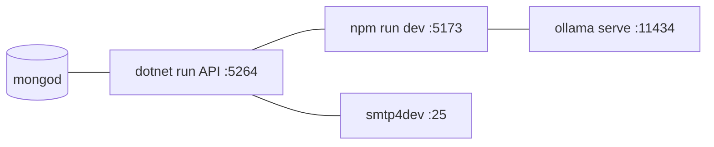

<!-- REVERSE-META
schema: 1
mode: how
step: 11_development_environment
commit: 593f6decec3a642d5567754dd795b19560bb0afb
commit_short: 593f6de
branch: main
worktree: clean
baseline_date: 2026-10-05T10:14:05+00:00
generated_at: 2026-10-07T14:40:00Z
-->
# Development Environment - Progetto LOSS_PREVENTION

> **Baseline commit:** `593f6de` (`main`) · worktree `clean`

**Data**: 2026-10-07 · **Versione**: 1.1 · **Autori**: REVERSE how · **Audience**: sviluppatori

---

## 1. Prerequisites & Dependencies

| Strumento | Versione | Fonte |
|-----------|----------|-------|
| .NET SDK | 8.0.x | `TargetFramework net8.0` |
| Node.js / npm | ≥ 18 (Vite 6 richiede ≥ 18) | `Docs/03_SETUP_INSTALLATION.md` |
| MongoDB | ≥ 6.0 (dump creato con 8.3.2) + Database Tools (`mongorestore`) | `prelude.json` |
| Ollama + modello `qwen2.5:14b` | — | solo per funzioni AI |
| smtp4dev (o altro SMTP) | — | reset password |

## 2. IDE Setup & Configuration
Visual Studio 2022 (≥ 17.8) o VS Code; `.vscode/` presente solo nel progetto UI. Nessun `.editorconfig`, nessun ESLint/Prettier, nessun analyzer .NET configurato → si consiglia di aggiungerli prima di nuovi sviluppi.

## 3. Repository Setup & Branching

```bash
git clone https://github.com/saristot/LOSS_PREVENTION.git
cd LOSS_PREVENTION/customspa-it-loss-prevention-d098a8b97860
```
Il codice è in una **sottocartella** del repository. Nessuna branching strategy definita.

## 4. Build Instructions

```bash
# Backend
dotnet restore LossPrevention.sln
dotnet build LossPrevention.sln -c Debug
# Frontend
cd LossPrevention.UI
npm ci
echo "VITE_API_BASE_URL=http://localhost:5264" > .env.local
npm run dev          # http://localhost:5173
```
**Attenzione**: al commit `593f6de` `npm run build` **fallisce su Linux/macOS** per 12 import con maiuscole/minuscole errate (funziona solo su Windows); vedi documento 16 §8.

Note: il csproj dell'API ha nome con spazio e prefisso (`"01. LossPrevention.API.csproj"`) → quotare i path negli script. La build .NET non è stata verificata in questa analisi (runtime non avviabile nel sandbox).

## 5. Test Execution
**Nessun test esiste.** Non ci sono progetti `*.Tests`, né `vitest`/`jest`/`playwright` nel `package.json`. `Docs/13_TESTING_QA.md` descrive una strategia di test che **non è implementata** nel repository.

## 6. Database Setup

```bash
# Ripristino del dump di sviluppo versionato (contiene dati di esempio e utenti)
mongorestore --db LossPrevention Data/LossPrevention
# oppure seed minimo
mongosh LossPrevention Data/MongoDBScripts/01_CreatePermissions.js
mongosh LossPrevention Data/MongoDBScripts/02_AddPermissionsToAdminRole.js
mongosh LossPrevention Data/MongoDBScripts/04_AddLossPreventionRules.js
```
All'avvio l'API crea il TTL index su `ReportData.BeginDateTime`.

## 7. Local Development Workflow


1. Avviare MongoDB, smtp4dev, (opzionale) Ollama con `ollama pull qwen2.5:14b`.
2. `dotnet run --project "LossPrevention.API/01. LossPrevention.API.csproj" --launch-profile https` → Swagger su `/swagger`.
3. `npm run dev` nella UI.
4. Per il bulk load: copiare XML in `C:\xmlstore5\xml` (Windows) ed eseguire la console.

## 8. Troubleshooting Guide

| Sintomo | Causa probabile (dal codice) | Soluzione |
|---------|-----------------------------|-----------|
| CORS error dal browser | Origine diversa da `localhost:5173/5174` | Aggiungere l'origine in `Program.cs` (o renderla configurabile) |
| 401 su tutte le chiamate | Token scaduto (1 h) o `SecretKey` diversa tra emissione e validazione | Rifare login; controllare `JwtSettings` |
| 403 su un'azione | Permesso mancante nel ruolo (claim emessi al login) | Assegnare il permesso e **rifare login** |
| Funzioni AI non rispondono | Ollama non in esecuzione su localhost o modello non scaricato | `ollama serve`, `ollama pull qwen2.5:14b` |
| Report mostra dati vecchi | Cache in-memory di 1 h sulla query | Riavviare API o cambiare query |
| Ingestione schedulata non parte | `ScheduleType` = `one-time` o orario fuori finestra ±1 min | Impostare `recurring` + orario |
| Email reset non arriva | SMTP senza TLS su `localhost:25` | Usare smtp4dev in sviluppo |
| `Could not resolve "../stores/passwordResetStore"` in build | Import case-sensitive su Linux | Allineare gli import al nome reale dei file |

---

## Reference Documents
- 00_deep_dive.md · 10_deployment.md · 12_operation_and_support.md

## Change Log

| Versione | Data | Autore | Modifiche |
|----------|------|--------|-----------|
| 1.0 | 2026-10-07 | REVERSE how (FULL) | Creazione documento (sostituisce run 2026-10-05) |
| 1.1 | 2026-10-07 | REVERSE how (FULL) | Aggiunto esito build frontend su Linux |
