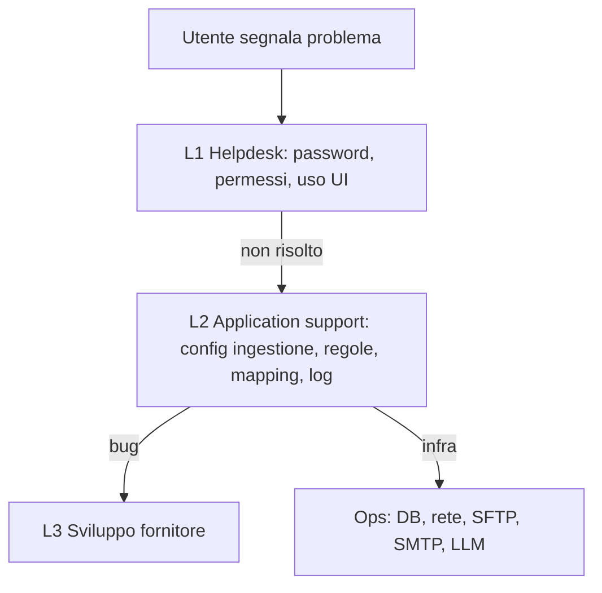

<!-- REVERSE-META
schema: 1
mode: how
step: 12_operation_and_support
commit: 593f6decec3a642d5567754dd795b19560bb0afb
commit_short: 593f6de
branch: main
worktree: clean
baseline_date: 2026-10-05T10:14:05+00:00
generated_at: 2026-10-07T14:40:00Z
-->
# Operation and Support - Progetto LOSS_PREVENTION

> **Baseline commit:** `593f6de` (`main`) · worktree `clean`

**Data**: 2026-10-07 · **Versione**: 1.0 · **Autori**: REVERSE how · **Audience**: operations, supporto, tech lead

---

## 1. Monitoring & Alerting

| Aspetto | AS-IS | Gap |
|---------|-------|-----|
| Health check | Assente (`AddHealthChecks` non usato) | Nessun probe per bilanciatori/orchestratori |
| Metriche | Assenti | Nessuna misura di latenza, errori, durata ingestione |
| Tracing | Assente | Nessun OpenTelemetry |
| Alert | Assenti | Fallimento ingestione notato solo leggendo i log |

Metriche minime proposte: durata e record per ingestione, file falliti, durata `ApplyRules`, P95 `/data/report/query`, errori 5xx, login falliti.

## 2. Logging & Log Access

| Componente | Meccanismo | Esempi |
|-----------|-----------|--------|
| API | `ILogger` console (Logging default) | `"Scheduled ingestion completed: {Files} files, {Records} records"` |
| Servizi | `ILogger<T>` in ingestion/SFTP/DB init; `Console.WriteLine` (6) | `"Target not found."` |
| Console batch | `Console.WriteLine` | `"Completed in {s} Seconds"` |
| Frontend | 57 `console.log` | log diagnostici in produzione |
| Audit | **Assente** | Nessuna traccia di chi ha visto/esportato/modificato dati |

## 3. Configuration Management

| Chiave | File | Default | Note |
|--------|------|---------|------|
| `MongoDbSettings.*` | `appsettings.json` (API e console) | DB `LossPrevention`, 14 nomi collezione | Console ha un sottoinsieme |
| `JwtSettings.SecretKey/Issuer/Audience/ExpiryHours` | API | `LossPrevention`/`User`/1 h | Secret versionato: **ruotare** |
| `DataRetention.TransactionRetentionDays` | API | 180 | Applicato solo all'avvio (cambio richiede drop manuale dell'indice TTL esistente: il codice non aggiorna `expireAfterSeconds`) |
| `Email.*` | API | localhost:25 | `FrontendUrl` per link di reset |
| `VITE_API_BASE_URL` | `.env` UI | — | Non versionato |
| Config ingestione e soglie antifrode | MongoDB | — | Modificabili da UI |

## 4. Diagnostics & Troubleshooting

| Problema | Diagnostica |
|----------|-------------|
| Ingestione non eseguita | Verificare `DataIngestionConfigurations` (`ScheduleType`, `ScheduleTime`, `Recurrence`), log "Scheduled ingestion triggered" |
| File non importati | `ProcessedFiles` (idempotenza per nome file: un file rinominato viene reimportato, un file corretto con lo stesso nome viene ignorato); cartella SFTP `failed/` |
| Flag antifrode mancanti | Le regole non sono applicate automaticamente: eseguire `GET /rules/apply` |
| Dati non scadono | TTL su `BeginDateTime`: verificare che i documenti abbiano quel campo come Date |
| Utente vede dati non suoi | Il lock è solo UI → atteso finché non si implementa il filtro server |

## 5. Backup & Restore Procedures
Non presenti nel codice. Proposta: `mongodump --gzip --archive` giornaliero (o backup gestito Atlas/Cosmos), retention 30 gg, test di restore trimestrale; escludere i dump dal repository Git.

## 6. Maintenance Tasks

| Task | Frequenza | Oggi |
|------|-----------|------|
| Ri-applicazione regole dopo ingestione | Ogni ingestione | Manuale |
| Pulizia `PasswordResetTokens` scaduti | Settimanale | Assente (nessun TTL) |
| Verifica/creazione indici | Dopo nuovi formati | Solo console (`IndexService`) |
| Rotazione secret JWT/SFTP | Trimestrale | Assente |
| Aggiornamento dipendenze (npm audit: 71 vuln.) | Mensile | Assente |
| Upgrade .NET 8 → 10 | Entro nov-2026 | Da pianificare |

## 6.1 Flusso operativo di supporto proposto

## 7. Support Escalation
Nessun runbook nel codice; `Docs/12_MAINTENANCE_OPERATIONS.md` del fornitore descrive procedure generiche. `roadmap.txt`: "Testing – We will need users to give feedback with reproducible steps" → il processo di supporto è ancora da definire.

---

## Reference Documents
- 09_infrastructure_architecture.md · 10_deployment.md · 11_development_environment.md

## Change Log

| Versione | Data | Autore | Modifiche |
|----------|------|--------|-----------|
| 1.0 | 2026-10-07 | REVERSE how (FULL) | Creazione documento (sostituisce run 2026-10-05) |
