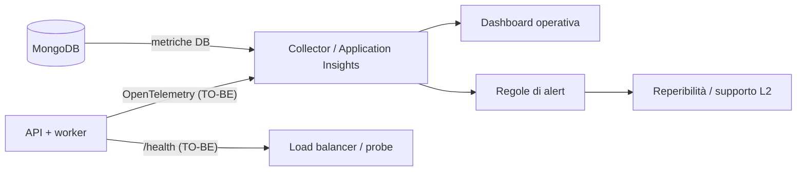
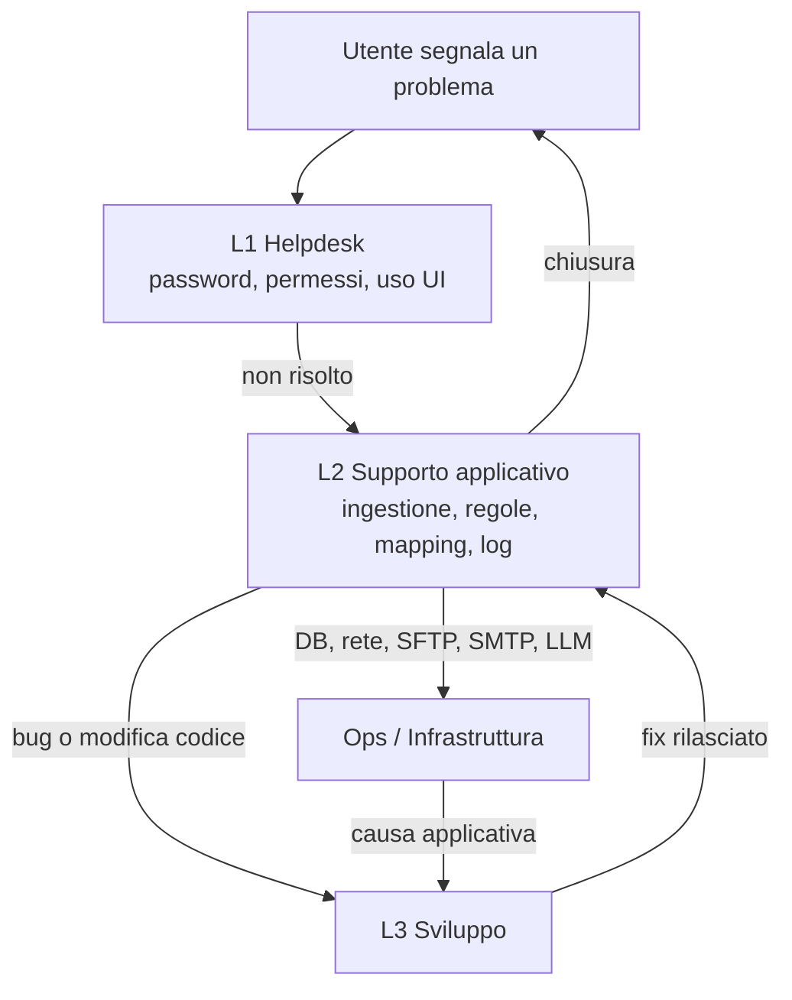

<!-- IMPACT-META
schema: 1
mode: how
step: 12_operation_and_support
commit: fc7d820908b8b230fb47a2669920ba7efdb413a8
commit_short: fc7d820
branch: main
worktree: dirty
baseline_date: 2026-10-07T18:19:51+02:00
generated_at: 2026-10-08T09:41:39.009+02:00
-->
# Operation and Support - Progetto LOSS_PREVENTION

> **Baseline commit:** `fc7d820` (`main`) · worktree `dirty` (modifiche locali solo in `Docs/` e `.github/`; codice applicativo identico al commit)

**Data**: 2026-10-08  
**Versione**: 1.1  
**Autori**: REVERSE how (IMPACT) · verifica IMPACT verify  
**Audience**: Operations, supporto applicativo (L1/L2), tech lead

---

## Sezioni Principali

Questo documento raccoglie ciò che serve per gestire e supportare il Loss Prevention Tool in esercizio: monitoraggio, log, configurazione, diagnostica, backup, manutenzione ed escalation. Il codice al commit `fc7d820` offre **strumenti operativi molto limitati** (solo log su console di 4 classi di servizio, nessun health check, nessuna metrica, nessun backup), quindi molte sezioni distinguono:

- **AS-IS**: ciò che il codice fa oggi, con evidenza `file:riga`;
- **TO-BE**: procedure e strumenti raccomandati, non implementati.

La guida operativa del fornitore `Docs/12_MAINTENANCE_OPERATIONS.md` e `Docs/roadmap.txt` **non esistono al baseline**: erano presenti solo nel commit `593f6de` e sono state rimosse in `d768cd9` (consultabili con `git show 593f6de:customspa-it-loss-prevention-d098a8b97860/Docs/<file>` da `C:\repository\LOSS_PREVENTION`). Le procedure che descrivono (es. endpoint `/health`, log in `/var/log/lossprevention/api.log`, servizio systemd `lossprevention-api`) **non sono implementate** nel codice.

---

## 1. Monitoring & Alerting

**Sintesi.** AS-IS non esiste alcuna forma di monitoraggio applicativo: nessun health check, nessuna metrica, nessun tracing, nessun alert. Gli unici segnali disponibili sono i log su console dei servizi di ingestione/inizializzazione e alcuni dati persistiti in MongoDB.

### 1.1 Stato AS-IS

| Capacità | Stato | Evidenza |
|----------|-------|----------|
| Health / readiness endpoint | ❌ Assente | Nessun `AddHealthChecks`/`MapHealthChecks` in `Program.cs`; nessuna rotta `/health` tra i 78 endpoint. Il `HealthCheckEndpoint` proposto dal fornitore (`12_MAINTENANCE_OPERATIONS.md` righe 654-691, storico) non esiste |
| Metriche (latenza, errori, throughput) | ❌ Assenti | Nessun pacchetto OpenTelemetry/Prometheus/Application Insights nei `.csproj` |
| Tracing distribuito | ❌ Assente | — |
| APM / RUM frontend | ❌ Assente | Solo `console.log` (57 occorrenze nel frontend) |
| Alerting | ❌ Assente | I fallimenti dell'ingestione schedulata producono solo un log `Error` (`DataIngestionBackgroundService.cs:91`) |
| Notifiche in-app | Collezione `Notifications` | Non collegata a eventi operativi (ingestione/regole) |

### 1.2 Segnali operativi disponibili oggi

| Segnale | Dove | Come usarlo |
|---------|------|-------------|
| Avvio API completato | Log `Database initialization completed successfully` (`DatabaseInitializationService.cs:34`) | Conferma che MongoDB è raggiungibile e l'indice TTL è stato verificato |
| Scheduler attivo | Log `Data Ingestion Background Service is starting` (`DataIngestionBackgroundService.cs:25`) | Verifica post-deploy |
| Esito ingestione schedulata | Log `Scheduled ingestion completed: {Files} files, {Records} records` / `…completed with errors: {Errors}` / `Scheduled ingestion failed` (righe 74-91) | Unica traccia dell'esito: `LastRunAt` non è salvato |
| Esito ingestione manuale | Risposta JSON di `POST /api/data-ingestion/run`: `success`, `filesProcessed`, `recordsInserted`, `durationSeconds`, `errors`, `message`; HTTP 500 se fallisce (`RunDataIngestionEndpoint.cs:25-59`) | Diagnosi immediata da UI/API |
| Storico file importati | Collezione `ProcessedFiles` (`fileName`, `recordCount`, `processedAt`, `FileProcessingCoordinator.cs:399-410`) | Conteggio file/record per periodo |
| File SFTP falliti | Cartella remota `failed/` (`SftpFileProcessingService.cs:201-220`) | Controllo giornaliero |
| Tracciabilità dei documenti | Campi `_sourceFile`, `_processedAt`, `_sourceType` aggiunti a ogni documento `ReportData` | Risalire al file di origine |

### 1.3 KPI e alert raccomandati (TO-BE)

| KPI | Fonte proposta | Soglia di alert suggerita |
|-----|----------------|---------------------------|
| Disponibilità API | Endpoint `/health` (da implementare, con ping MongoDB) | 2 probe consecutive fallite |
| Esito ingestione | Log strutturato / metrica `ingestion_runs{result}` | Qualsiasi esecuzione fallita; nessuna esecuzione riuscita nelle ultime 24 h con schedule attivo |
| Record ingeriti per esecuzione | `recordsInserted` | 0 record per 2 esecuzioni consecutive |
| File in `failed/` | Listing SFTP | > 0 |
| Durata `GET /rules/apply` | Metrica di durata richiesta | > valore di riferimento misurato |
| Latenza P95 `POST /data/report/query` | Metrica HTTP | Da definire dopo baseline |
| Errori 5xx | Metrica HTTP | > 1% su 5 min |
| Login falliti | Log/metrica `/users/login` (oggi risponde 500, §4.3) | Picchi anomali (brute force) |
| Spazio disco MongoDB | Monitoraggio DB | > 80% |



---

## 2. Logging & Log Access

**Sintesi.** L'API usa il logging predefinito di ASP.NET Core (nessun sink su file o strutturato), con livello `Information` e `Warning` per `Microsoft.AspNetCore`. Solo 4 classi di servizio scrivono log tramite `ILogger`; gli endpoint non registrano nulla e non esiste un audit trail.

### 2.1 Configurazione AS-IS

| Aspetto | Valore | Evidenza |
|---------|--------|----------|
| Livello predefinito | `Information` | `LossPrevention.API/appsettings.json:2-6` (identico nella console, righe 2-7) |
| `Microsoft.AspNetCore` | `Warning` | idem |
| Provider | Predefiniti di `WebApplication.CreateBuilder`: Console, Debug, EventSource e, su Windows, EventLog | Nessuna configurazione di provider in `Program.cs` |
| Sink file / strutturati (Serilog, NLog, OTel) | Assenti | Nessun pacchetto nei `.csproj` |
| Correlation ID / request logging | Assenti | Nessun `UseHttpLogging`/middleware |
| Audit (chi ha visto/esportato/modificato) | **Assente** | Nessuna collezione o log di audit |

**Dove leggere i log (AS-IS)**: dipende dall'host, perché i log vanno solo su console/stdout.

| Hosting | Accesso |
|---------|---------|
| `dotnet run` / Visual Studio | Finestra del terminale / Output di Visual Studio |
| IIS (TO-BE) | Solo se `stdoutLogEnabled` è abilitato nel `web.config` generato da `dotnet publish`; altrimenti Event Viewer per gli eventi Warning+ ⚠️ non verificato |
| Container / App Service (TO-BE) | `docker logs` / Log stream di App Service |

### 2.2 Catalogo dei log emessi

| Componente | Chiamate `ILogger` | Eventi principali (livello) |
|-----------|--------------------|-----------------------------|
| `DatabaseInitializationService` | 7 | `Starting database initialization...` (Info); `TTL index on BeginDateTime already exists` (Info); `Dropping existing regular index '{IndexName}'…` (Info); `Created TTL index on BeginDateTime with {RetentionDays} days retention` (Info); `Failed to create TTL index on BeginDateTime` (Error) |
| `DataIngestionBackgroundService` | 7 | `…is starting` / `…is stopping` (Info); `Scheduled ingestion triggered` (Info); `Scheduled ingestion completed…` (Info); `…completed with errors: {Errors}` (Warning); `Scheduled ingestion failed` (Error); `Error in Data Ingestion Background Service` (Error) |
| `FileProcessingCoordinator` | 17 | `Starting data ingestion...`; `Processing files from: {Path}`; `Found {Count} files to process`; `File already processed, skipping: {FileName}`; `Data ingestion completed. Files: …, Records: …, Duration: …s` (Info); `No documents extracted from file` / `Processed folder does not exist` (Warning); `Error processing file: {File}`, `Data ingestion failed` (Error) |
| `SftpFileProcessingService` | 13 | `Connecting to SFTP server {Host}:{Port}`; `Found {Count} {FileType} files in {Directory}`; `Moved {FileName} to processed folder`; `Creating processed/failed folder` (Info); `Failed to delete temp file` (Warning); `Error processing SFTP file`, `Failed to move file to failed folder`, `SFTP processing failed` (Error) |
| `Console.WriteLine` (6) | — | `DistanceDataservice.cs:86` (`Target not found.`), `MappingService.cs:336,421`, console `Program.cs:80,108,122` (`Starting Processing`, errori per file, `Completed in {s} Seconds`) |
| Endpoint FastEndpoints (78) | **0** | Nessun log; 16 file di endpoint contengono `try/catch`, 13 restituiscono `ex.Message` al client |
| Frontend | 57 `console.log` | Include il log dell'URL API a ogni caricamento (`api.ts:7`) |

Nota di riservatezza: i log SFTP includono host, porta e directory ma **non** la password; nessun log contiene token o password.

### 2.3 Raccomandazioni TO-BE

1. Logging strutturato (Serilog o OpenTelemetry) con sink centralizzato e retention definita (il fornitore proponeva rotazione giornaliera con 30 file, `12_MAINTENANCE_OPERATIONS.md` righe 432-449, storico).
2. Middleware di request logging con correlation ID; logging delle eccezioni negli endpoint invece di restituire `ex.Message`.
3. Audit trail per login, export, modifiche a regole/configurazione ingestione, `GET /rules/apply`.
4. Rimozione dei `console.log` dal bundle di produzione.

---

## 3. Configuration Management

**Sintesi.** La configurazione è distribuita su tre livelli: `appsettings.json` (API e console), MongoDB (configurazione funzionale modificabile da UI) e variabile di build della SPA. Diversi valori operativi sono **hardcoded** nel codice e il modo in cui l'API carica la configurazione rende inefficaci variabili d'ambiente e file per ambiente.

### 3.1 Precedenza della configurazione (AS-IS)

- **API**: `Program.cs:37-39` aggiunge di nuovo `appsettings.json` (dalla directory corrente, `optional: false`) **dopo** le sorgenti standard. Per ogni chiave presente nel file, variabili d'ambiente (`Sezione__Chiave`), argomenti da riga di comando e `appsettings.{Environment}.json` sono **ignorati**.
- **Console**: i servizi usano un `ConfigurationBuilder` che legge solo `appsettings.json` (`DataIngestionService/Program.cs:31-35,58-59`).
- **Modifica di un valore** = modifica del file `appsettings.json` sull'host + riavvio del processo (nessun reload dei valori già letti; `JwtSettings` è letto una sola volta all'avvio, `Program.cs:42-47`).

### 3.2 Chiavi `appsettings.json` — API

| Chiave | Valore dev (mascherato dove sensibile) | Riga | Uso |
|--------|----------------------------------------|------|-----|
| `Logging:LogLevel:Default` / `Microsoft.AspNetCore` | `Information` / `Warning` | 2-6 | Livelli di log |
| `DataRetention:TransactionRetentionDays` | `180` (default codice 90) | 8-10 | TTL `ReportData.BeginDateTime`, applicato solo alla prima creazione dell'indice |
| `AllowedHosts` | `*` | 11 | Host filtering |
| `MongoDbSettings:ConnectionString` | `mongodb://localhost:27017` (nessuna credenziale) | 13 | Connessione DB |
| `MongoDbSettings:DatabaseName` | `LossPrevention` | 14 | Nome DB |
| `MongoDbSettings:CollectionName_*` | **13 chiavi**: `Mappings`, `Rules`, `Users`, `Roles`, `Permissions`, `ReportData`, `Workspaces`, `Dashboards`, `DataIngestionConfigurations`, `DataIngestionSchedules`, `Notifications`, `Groups`, `FraudDetectionSettings` | 15-27 | Nomi collezione |
| `JwtSettings:SecretKey` | `****` (GUID di 36 caratteri **versionato in Git**) | 30 | Firma HS256 dei token |
| `JwtSettings:Issuer` / `Audience` / `ExpiryHours` | `LossPrevention` / `User` / `1` | 31-33 | Validazione e scadenza token |
| `Email:SmtpHost` / `SmtpPort` | `localhost` / `"25"` (stringa) | 36-37 | Invio email reset |
| `Email:FromEmail` / `FromName` | `noreply@lossprevention.local` / `Loss Prevention System` | 38-39 | Mittente |
| `Email:FrontendUrl` | `http://localhost:5173` | 40 | Link `{FrontendUrl}/reset-password?token=…` (`EmailService.cs:29`) |

**Console** (`LossPrevention.DataIngestionService/appsettings.json`): stessi `Logging` e `MongoDbSettings:ConnectionString`/`DatabaseName`, ma solo **6** chiavi `CollectionName_*` (righe 12-17: `Mappings`, `Rules`, `Users`, `Roles`, `Permissions`, `ReportData`).

### 3.3 Configurazione persistita in MongoDB (modificabile da UI)

| Collezione | Contenuto | Note operative |
|-----------|-----------|----------------|
| `DataIngestionConfigurations` | `SelectedSources` (`filesystem`/`sftp`), `SelectedFileType`, `FileSystemPath`, `UseMappings`, `ManualLoad`, schedule (`ScheduleType` default `one-time`, `ScheduleDate`, `ScheduleTime`, `Recurrence`, `SelectedDaysOfWeek`), `LastRunAt` (mai aggiornato in DB), `SftpHost`, `SftpPort` (default 22), `SftpUsername`, `SftpRemoteDirectory`, **`SftpPassword` in chiaro** | La password è salvata in chiaro (`DataIngestionService.cs:40,59`) e **restituita alla UI** da `GET /api/data-ingestion` (`GetDataIngestionConfigurationEndpoint.cs:41`) |
| `FraudDetectionSettings` | Soglie/parametri antifrode | `/api/fraud-detection/settings` |
| `Rules` | Regole antifrode | Seed `04_AddLossPreventionRules.js`, export `rules_export.json` |
| `Mappings` | Mapping campi | Applicati in ingestione se `UseMappings` |
| `Roles` / `Permissions` | RBAC | Seed `00..03` |

### 3.4 Valori hardcoded (richiedono modifica del codice)

| Valore | Evidenza |
|--------|----------|
| Origini CORS `http://localhost:5173`, `http://localhost:5174` | `Program.cs:29` |
| Endpoint e modello LLM `http://localhost:11434/api/generate`, `qwen2.5:14b` | `aiStore.ts:8,88` |
| SMTP `EnableSsl = false`, `UseDefaultCredentials = true` | `EmailService.cs:64-65` |
| Collezioni `PasswordResetTokens` e `ProcessedFiles` | `InfrastructureServiceExtensions.cs:83`; `FileProcessingCoordinator.cs:391,409` |
| Intervallo scheduler 60 s, ritardo iniziale 10 s | `DataIngestionBackgroundService.cs:13,28` |
| Timeout SFTP 30 s, cartelle `processed`/`failed` | `SftpFileProcessingService.cs:59,201-220` |
| Cache report 1 h | `GetReportDataEndpoint.cs:81` |
| Scadenza token reset 1 h | `PasswordResetService.cs:19` |
| Cartella XML della console `C:\xmlstore5\xml` | `DataIngestionService/Program.cs:76` |

### 3.5 Frontend

| Variabile | Uso | Nota |
|-----------|-----|------|
| `VITE_API_BASE_URL` | `baseURL` di axios (`api.ts:4`) | Incorporata **al momento della build**: un cambio di URL richiede una nuova build. Nessun file `.env*` versionato |

### 3.6 Inventario segreti

| Segreto | Dove si trova oggi | Rischio | TO-BE |
|---------|--------------------|---------|-------|
| Chiave firma JWT | `appsettings.json:30`, versionata | Chiunque abbia accesso al repository può firmare token validi | Secret store + rotazione |
| Password SFTP | MongoDB in chiaro, esposta via API | Esposizione a utenti con `CAN_VIEW_DATA_INGESTION` | Cifratura / secret store, non restituirla mai |
| Credenziali MongoDB | Assenti (DB senza autenticazione) | Accesso libero al DB in rete | Abilitare autenticazione + TLS |
| Hash e salt password utenti | `Users` | `GET /users` restituisce `PasswordHash` e `PasswordSalt` (`GetUsersEndpoint.cs:36`) | Escludere dai DTO |
| Dump di sviluppo | `Data/LossPrevention/` in Git (utenti, configurazione) | Dati personali/hash nel repository | Rimuovere dal repository |

---

## 4. Diagnostics & Troubleshooting

**Sintesi.** Gli strumenti diagnostici disponibili sono i log su console, Swagger (solo in `Development`) e le query dirette su MongoDB. Di seguito un runbook per sintomo, con i comandi da usare.

### 4.1 Strumenti diagnostici

| Strumento | Uso | Limiti |
|-----------|-----|--------|
| Log console | Inizializzazione DB, ingestione, SFTP | Nessun log negli endpoint |
| Swagger UI `/swagger` | Prova degli endpoint | Solo con `ASPNETCORE_ENVIRONMENT=Development` (`Program.cs:121-126`) |
| `mongosh` | Stato dati, indici, configurazione | Accesso diretto al DB richiesto |
| Strumenti sviluppatore del browser | Errori CORS, 401/403, console | — |

### 4.2 Query diagnostiche MongoDB (⚠️ non eseguite: `mongosh` non disponibile sulla macchina di analisi)

```javascript
use LossPrevention
// Configurazione ingestione senza esporre la password
db.DataIngestionConfigurations.findOne({}, { SftpPassword: 0 })
// Ultimi file importati
db.ProcessedFiles.find().sort({ processedAt: -1 }).limit(20)
// Indici di ReportData (verificare ttl_BeginDateTime ed expireAfterSeconds)
db.ReportData.getIndexes()
// Documenti senza campo BeginDateTime (non soggetti a TTL)
db.ReportData.countDocuments({ BeginDateTime: { $exists: false } })
// Documenti di un file specifico
db.ReportData.countDocuments({ _sourceFile: "<nomefile>" })
// Token di reset scaduti (nessun TTL)
db.PasswordResetTokens.countDocuments({ ExpiryDate: { $lt: new Date() } })
```

### 4.3 Runbook per sintomo

| Sintomo | Diagnosi | Causa nel codice | Azione |
|---------|----------|------------------|--------|
| L'API non parte | Log `Error during database initialization` | MongoDB non raggiungibile; l'eccezione è rilanciata (`DatabaseInitializationService.cs:36-40`) | Ripristinare MongoDB, riavviare |
| L'API non parte con `FileNotFoundException` | Working directory | `appsettings.json` letto dalla cwd (`Program.cs:38`) | Avviare dalla cartella dell'app |
| Ingestione schedulata mai eseguita | `findOne` su `DataIngestionConfigurations` | `ScheduleType: one-time` **ignorato** dallo scheduler (`DataIngestionBackgroundService.cs:55`); orario fuori finestra ±1 min; giorni in inglese per il settimanale; mensile solo il giorno 1 (riga 142); ora locale del server (`DateTime.Now`, riga 97) | Usare `recurring` o `POST /api/data-ingestion/run` |
| Ingestione eseguita due volte | Log `Scheduled ingestion triggered` ripetuto nello stesso minuto, o da più istanze | `LastRunAt` non persistito (righe 86-87); scheduler su ogni istanza | Una sola istanza; i file già in `ProcessedFiles` vengono saltati, ma il controllo non è atomico |
| File non importato | Log `File already processed, skipping` | Nome già in `ProcessedFiles` (idempotenza per **nome**: un file corretto con lo stesso nome viene ignorato) | `db.ProcessedFiles.deleteOne({ fileName: "<nome>" })` e rieseguire |
| File in `failed/` su SFTP | Log `Error processing SFTP file` | Errore di parsing o di trasferimento | Correggere il file e ricaricarlo nella cartella sorgente |
| `POST /api/data-ingestion/run` → 500 | Campo `errors` / `message` della risposta | Errore restituito con dettagli (`RunDataIngestionEndpoint.cs:39-59`) | Analizzare il messaggio e i log |
| Flag antifrode mancanti dopo ingestione | — | Le regole non sono applicate automaticamente | `GET /rules/apply` (`CAN_APPLY_RULE`); operazione pesante (§6) |
| Report non aggiornato | — | Cache in memoria 1 h per pipeline/skip/take, senza invalidazione e **non distinta per utente** (`GetReportDataEndpoint.cs:81,92-97`) | Riavviare l'API |
| Utente vede dati fuori dal proprio perimetro | Claim `LockField`/`LockValue` nel token | Il filtro è applicato solo dalla UI: nessun uso server-side (`LoginEndpoint.cs:67-68` è l'unico consumatore) | Comportamento AS-IS (vedi 17/18) |
| Login con credenziali errate → 500 | Log/console | `UnauthorizedAccessException` non gestita in `LoginEndpoint` | Comportamento AS-IS; verificare credenziali |
| 401 dopo un'ora | — | `ExpiryHours: 1`, nessun refresh token | Nuovo login |
| 403 dopo modifica permessi | — | I permessi sono nel token (`LoginEndpoint.cs:61`) | Nuovo login |
| Errore CORS | Console browser | Origine non in `Program.cs:29` | Modifica del codice |
| Email di reset non arriva | Log assenti per l'email | SMTP `localhost:25`, nessun TLS | Verificare il relay SMTP |
| Funzioni AI non rispondono | Console browser | Ollama non raggiungibile dal browser dell'utente (`aiStore.ts:88`) | Avviare Ollama sulla postazione |
| Dati non scadono | `getIndexes()` + `countDocuments` sopra | Il TTL usa `BeginDateTime`; i documenti del dump hanno solo `TransactionDateTime` | Verificare il formato dei file sorgente; valutare il TTL sul campo corretto |
| Cambio di retention senza effetto | `getIndexes()` | Indice TTL esistente non aggiornato (`DatabaseInitializationService.cs:67-71`) | `collMod` (§6.2) |

---

## 5. Backup & Restore Procedures

**Sintesi.** Nel codice non esistono procedure di backup o restore. Il dump in `Data/LossPrevention/` è un dataset di sviluppo versionato in Git, **non** un backup. Le procedure seguenti sono raccomandazioni TO-BE con comandi standard di MongoDB Database Tools.

### 5.1 Ambito del backup

| Elemento | Contenuto | Priorità |
|----------|-----------|----------|
| Database `LossPrevention` | Tutte le collezioni (transazioni, regole, mapping, utenti, ruoli, configurazione ingestione, workspace, dashboard) | Critica |
| `appsettings.json` di ogni host | Connection string, chiave JWT, SMTP, retention | Alta (in un secret store) |
| File sorgente nelle cartelle `processed/` SFTP / file system | Consentono di ricostruire `ReportData` | Media |
| Artefatti di deploy (publish API, `dist/`) | Rollback applicativo | Media |

### 5.2 Comandi (TO-BE, ⚠️ non eseguiti)

```powershell
# Backup completo compresso
mongodump --uri "<connection-string>" --db LossPrevention --gzip --archive="D:\backup\LossPrevention_$(Get-Date -Format yyyyMMdd_HHmm).gz"

# Restore completo (sovrascrive le collezioni)
mongorestore --uri "<connection-string>" --gzip --archive="D:\backup\LossPrevention_<data>.gz" --nsInclude "LossPrevention.*" --drop

# Restore di una sola collezione (es. Rules)
mongorestore --uri "<connection-string>" --gzip --archive="D:\backup\LossPrevention_<data>.gz" --nsInclude "LossPrevention.Rules" --drop
```

### 5.3 Politica raccomandata

| Aspetto | Proposta |
|---------|----------|
| Frequenza | Giornaliera + prima di ogni deploy, di `GET /rules/apply` su dati di produzione e di ogni script di seed |
| Retention | 30 giorni (valore proposto anche nello script storico del fornitore, `12_MAINTENANCE_OPERATIONS.md` righe 233 e 260, con cron alle 01:00, riga 268) |
| Servizio gestito | Se Atlas/vCore: backup continui con point-in-time restore |
| Test di restore | Trimestrale, su ambiente separato, misurando i tempi |
| Cifratura | Archivi cifrati (contengono hash password e password SFTP in chiaro) |

**Avvertenze sul restore**

- I metadati di `ReportData` includono l'indice TTL `ttl_BeginDateTime`: dopo il restore MongoDB rimuove i documenti con `BeginDateTime` più vecchio della retention.
- Dopo un restore riavviare l'API per svuotare la cache in memoria dei report.
- Se si ripristina `ReportData` senza `ProcessedFiles` (o viceversa), l'idempotenza dell'ingestione diventa incoerente: ripristinarle insieme.

**RPO/RTO**: N/A — non ricavabile dal codice: nessun requisito di disponibilità o SLA è definito nel repository (i valori del fornitore, `12_MAINTENANCE_OPERATIONS.md` righe 617-622, sono proposte storiche non implementate).

---

## 6. Maintenance Tasks

**Sintesi.** Nessuna attività di manutenzione è automatizzata. Di seguito le attività ricavate dal codice, con frequenza suggerita e comando o procedura.

### 6.1 Attività ricorrenti

| # | Attività | Frequenza suggerita | AS-IS | Procedura |
|---|----------|---------------------|-------|-----------|
| M1 | Applicazione regole antifrode dopo l'ingestione | A ogni ingestione | Manuale | `GET /rules/apply`. Attenzione: carica tutta `ReportData` in memoria, rimuove `FraudFlags` da tutti i documenti e li riscrive uno per uno (`RulesService.cs:34-58`): eseguire fuori orario e dopo un backup |
| M2 | Controllo file in `failed/` e log di errore | Giornaliera | Manuale | §4.3 |
| M3 | Pulizia `PasswordResetTokens` scaduti | Settimanale | Assente (nessun TTL, collezione hardcoded) | `db.PasswordResetTokens.deleteMany({ ExpiryDate: { $lt: new Date() } })` |
| M4 | Verifica indici e piani di query | Mensile / dopo nuovi formati file | Indici suggeriti creati solo dalla console (`IndexSuggestionHelper.cs:21-39`, fino a 20 indici a campo singolo) | `db.ReportData.getIndexes()`; rimuovere indici inutili |
| M5 | Pulizia `%TEMP%` dell'host API | Mensile | File temporanei SFTP eliminati in `finally` (warning se fallisce, `SftpFileProcessingService.cs:195`) | Verificare residui `*.xml`/`*.json` con nome GUID |
| M6 | Archiviazione cartelle `processed/` SFTP | Mensile | I file vengono spostati, mai cancellati (`SftpFileProcessingService.cs:179-180`) | Archiviare oltre la retention |
| M7 | Aggiornamento dipendenze npm | Mensile | Assente | `npm audit --package-lock-only` sul lockfile tracciato: **71 vulnerabilità** (4 low, 15 moderate, 46 high, 6 critical; ✅ verificato il 2026-10-08, il risultato dipende dal database advisory del giorno) |
| M8 | Aggiornamento dipendenze NuGet | Mensile | Assente | `dotnet list .\LossPrevention.sln package --vulnerable --include-transitive` (⚠️ non verificato: SDK assente); `Microsoft.AspNetCore.Http.Features 5.0.17` è obsoleto |
| M9 | Rotazione chiave JWT | Trimestrale e subito (è versionata) | Assente | Cambiare `JwtSettings:SecretKey` e riavviare: **tutti i token emessi diventano invalidi** |
| M10 | Rotazione password SFTP | Secondo policy del cliente | Assente | `PUT /api/data-ingestion` dalla UI |
| M11 | Pulizia collezioni obsolete `Mappings_old`, `ReportData_old` | Una tantum | Presenti nel dump | Verificare che non siano usate, poi `drop()` |
| M12 | Upgrade runtime .NET 8 | Prima della fine del supporto di .NET 8 (10-11-2026) | Da pianificare | Retarget a .NET 10 LTS |

### 6.2 Attività straordinarie

| Attività | Procedura |
|----------|-----------|
| Cambio retention dei dati | Il codice non aggiorna un indice TTL esistente. `db.runCommand({ collMod: "ReportData", index: { name: "ttl_BeginDateTime", expireAfterSeconds: <giorni*86400> } })` e aggiornare `TransactionRetentionDays` per coerenza (⚠️ non verificato) |
| Reimportare un file | `db.ProcessedFiles.deleteOne({ fileName: "<nome>" })`; `db.ReportData.deleteMany({ _sourceFile: "<nome>" })`; rimettere il file nella cartella sorgente; `POST /api/data-ingestion/run` |
| Azzerare la configurazione di ingestione | `DELETE /api/data-ingestion` (cancella **tutte** le configurazioni, `DataIngestionService.cs:176-180`) |
| Aggiornare permessi/regole | Eseguire gli script di seed nell'ordine `00 → 01 → 02 → 03 → 04` (idempotenti, vedi [10_deployment.md](10_deployment.md) §5.3); gli utenti devono rifare login |
| Svuotare la cache report | Riavvio dell'API (nessun endpoint di invalidazione) |

---

## 7. Support Escalation

**Sintesi.** Nel repository non esiste alcun processo di supporto: nessun runbook, contatto, SLA o classificazione di severità. Il modello seguente è una proposta TO-BE basata sulle competenze richieste dal codice.

### 7.1 Evidenze AS-IS

| Aspetto | Stato |
|---------|-------|
| Runbook / on-call | Assenti |
| Contatti | N/A — non ricavabile dal codice: l'unico contatto nella documentazione storica è il segnaposto `ops-team@yourdomain.com` (`12_MAINTENANCE_OPERATIONS.md` riga 792, presente solo in `593f6de`) |
| SLA / tempi di risposta | N/A — non ricavabile dal codice: nessun requisito definito |
| Raccolta feedback | `roadmap.txt` (storica): "Testing - We will need users to give feedback with reproducable steps" |
| Strumenti di ticketing | N/A — non ricavabile dal codice |

### 7.2 Livelli di supporto proposti (TO-BE)

| Livello | Ambito | Competenze / accessi necessari |
|---------|--------|--------------------------------|
| L1 — Helpdesk | Reset password (flusso `forgot-password`), utente disattivato, permessi mancanti (nuovo login), uso della UI | UI con permessi di gestione utenti/ruoli |
| L2 — Supporto applicativo | Configurazione e schedule dell'ingestione, file in `failed/`, `ProcessedFiles`, regole e mapping, `GET /rules/apply`, lettura dei log | Accesso ai log, `mongosh` in sola lettura, permessi `CAN_MANAGE_DATA_INGESTION`, `CAN_APPLY_RULE` |
| L3 — Sviluppo | Bug, modifiche a valori hardcoded (CORS, LLM, SMTP TLS), performance | Repository, ambienti di test |
| Ops / Infrastruttura | MongoDB, rete, SFTP, SMTP, hosting LLM, backup/restore, certificati | Accesso amministrativo all'infrastruttura |



### 7.3 Severità proposte (TO-BE)

| Severità | Esempi | Escalation |
|----------|--------|-----------|
| S1 — Bloccante | API non avviabile, MongoDB non disponibile, login impossibile per tutti | Immediata a Ops + L3 |
| S2 — Alta | Ingestione fallita o non eseguita, regole non applicate, dati incoerenti | L2 entro la giornata |
| S3 — Media | Funzioni AI non disponibili, report lenti, email di reset non recapitate | L2 |
| S4 — Bassa | Richieste di modifica, problemi estetici | Backlog L3 |

### 7.4 Informazioni da raccogliere per ogni segnalazione

1. Utente (username) e ora esatta (UTC e locale; lo scheduler usa l'ora locale del server).
2. Pagina/azione e messaggio mostrato (screenshot, console del browser).
3. Per ingestione: risposta di `POST /api/data-ingestion/run` o estratto log, nome file, sorgente (`filesystem`/`sftp`).
4. Per dati: pipeline del report o filtro usato, `_sourceFile` dei documenti coinvolti.
5. Versione del deploy (commit) e ambiente.

---

## Reference Documents

- **Deep Dive Analysis**: [00_deep_dive.md](00_deep_dive.md)
- **Context**: [01_context.md](01_context.md)
- **Functional Overview**: [02_functional_overview.md](02_functional_overview.md)
- **Non-Functional Overview**: [03_non_functional_overview.md](03_non_functional_overview.md)
- **Constraints**: [04_constraints.md](04_constraints.md)
- **Principles**: [05_principles.md](05_principles.md)
- **Software Architecture**: [06_software_architecture.md](06_software_architecture.md)
- **Code**: [07_code.md](07_code.md)
- **Data**: [08_data.md](08_data.md)
- **Infrastructure Architecture**: [09_infrastructure_architecture.md](09_infrastructure_architecture.md)
- **Deployment**: [10_deployment.md](10_deployment.md)
- **Development Environment**: [11_development_environment.md](11_development_environment.md)

Documenti correlati successivi: [13_decision_log.md](13_decision_log.md) · [14_metrics.md](14_metrics.md) · [17_backend_deep_assessment.md](17_backend_deep_assessment.md) · [18_antipattern_deep_dive.md](18_antipattern_deep_dive.md)

---

## Change Log

| Versione | Data | Autore | Modifiche |
|----------|------|--------|-----------|
| 1.0 | 2026-10-07 | REVERSE how (FULL) | Creazione documento (sostituisce run 2026-10-05) |
| 1.1 | 2026-10-08 | IMPACT verify | Espansione completa: segnali operativi disponibili e KPI/alert TO-BE; configurazione e catalogo dei log (7+7+17+13 chiamate `ILogger`, 6 `Console.WriteLine`, nessun log negli endpoint); precedenza della configurazione (`Program.cs:37-39`), tabella chiavi mascherate (correzione: 13 `CollectionName_*` nell'API, non 14; 6 nella console), configurazione in MongoDB, valori hardcoded, inventario segreti (incluso `GET /users` che restituisce hash/salt); query diagnostiche e runbook per sintomo; backup/restore con comandi e avvertenze TTL; manutenzione M1-M12 (npm audit 71 vulnerabilità ora verificato con dettaglio per severità); escalation con livelli, severità e checklist. Documentazione fornitore citata come storica (`593f6de`, rimossa in `d768cd9`); Reference Documents completi; header `worktree: dirty` |
