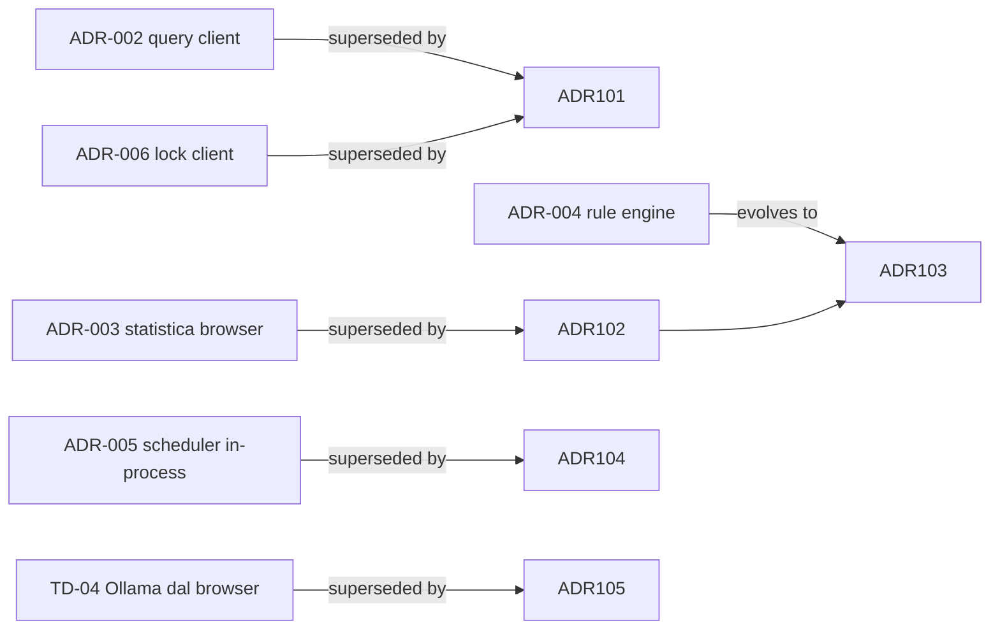

<!-- REVERSE-META
schema: 1
mode: how
step: 13_decision_log
commit: 593f6decec3a642d5567754dd795b19560bb0afb
commit_short: 593f6de
branch: main
worktree: clean
baseline_date: 2026-10-05T10:14:05+00:00
generated_at: 2026-10-07T14:40:00Z
-->
# Decision Log - Progetto LOSS_PREVENTION

> **Baseline commit:** `593f6de` (`main`) · worktree `clean`

**Data**: 2026-10-07 · **Versione**: 1.0 · **Autori**: REVERSE how · **Audience**: architetti, tech lead

Nessun ADR è presente nel repository. Le decisioni seguenti sono **ricostruite dal codice** (stato *Accepted – implicit*). Per ciascuna si indica la valutazione e, dove serve, una decisione proposta (*Proposed*).

---

## 1. Technology Decisions

| ID | Decisione | Alternative plausibili | Valutazione |
|----|-----------|------------------------|-------------|
| TD-01 | Backend .NET 8 + FastEndpoints | ASP.NET Minimal API, Controllers | ✅ Adeguata; FastEndpoints semplifica permessi e validazione |
| TD-02 | MongoDB come unico store | PostgreSQL + JSONB, SQL Server | ✅ Coerente con dati POS eterogenei; ⚠️ aggregazioni dinamiche esposte al client |
| TD-03 | Vue 3 + Vuetify + Pinia | React/MUI, Angular | ✅ Adeguata |
| TD-04 | LLM locale Ollama `qwen2.5:14b` | Azure OpenAI, LLM server-side self-hosted | 🟡 Buona per privacy dei dati, ma integrazione dal browser non deployabile |
| TD-05 | AG Grid + Tabulator | Una sola grid | 🟡 Duplicazione |
| TD-06 | JWT simmetrico con claim di permesso | OIDC/IdP esterno | 🟡 Semplice; SSO pianificato richiederà IdP |

## 2. Architectural Decisions (ADR ricostruiti)

### ADR-001 — Schema-on-read per le transazioni
- **Contesto**: file POS di formati diversi.
- **Decisione**: appiattire ogni file in BSON e derivare lo schema in `Mappings` campionando i dati.
- **Conseguenze**: + onboarding di nuovi formati senza codice; − nessuna validazione, dipendenza dai nomi campo.
- **Stato**: Accepted (implicit) — mantenere, aggiungendo validazione e mapping semantico esplicito.

### ADR-002 — Query builder lato client che genera pipeline Mongo
- **Decisione**: il frontend costruisce la pipeline (`queryUtils.ts`) e il backend la esegue.
- **Conseguenze**: + massima flessibilità; − **vulnerabilità critica** (query injection, bypass lock), cache non sicura.
- **Stato**: Accepted (implicit) → **Proposed: Superseded** da ADR-101.

### ADR-003 — Motore statistico antifrode nel browser
- **Decisione**: calcolare statistiche e regole euristiche in `aiStore.ts`.
- **Conseguenze**: + zero carico server, interattività; − risultati non persistiti, non auditabili, limitati dalla memoria del browser, soglie calcolate sulla prima pagina.
- **Stato**: Accepted (implicit) → **Proposed: Superseded** da ADR-102.

### ADR-004 — Rule engine a singolo campo con flag materializzati
- **Decisione**: salvare `FraudFlags.<Rule>` su ogni documento e creare la mapping booleana corrispondente.
- **Conseguenze**: + i flag sono interrogabili come campi normali; − ricalcolo totale a ogni applicazione, regole poco espressive.
- **Stato**: Accepted (implicit) → evolvere con ADR-103.

### ADR-005 — Scheduler di ingestione in-process (polling 60 s)
- **Conseguenze**: + semplicità; − blocca lo scale-out, nessuno storico esecuzioni.
- **Stato**: Accepted (implicit) → **Proposed** ADR-104.

### ADR-006 — Row-level security tramite claim JWT interpretati dal client
- **Stato**: Accepted (implicit) → **Rejected in revisione**: sostituire con enforcement server (ADR-101).

### ADR-007 — Retention con TTL index
- **Stato**: Accepted — buona scelta; da allineare al campo data effettivo dei file.

## 3. Pattern Decisions

| Pattern | Dove | Esito |
|---------|------|-------|
| REPR (FastEndpoints) | API | ✅ |
| Generic Repository | Infrastructure | 🟡 leaky (`Collection` esposta) |
| Strategy (file processors) | Ingestion | ✅ |
| Rule chain (`IXmlEnrichmentRule`) | Ingestion | ⚪ predisposto, inutilizzato |
| Cache-aside (`IMemoryCache`) | Report query | 🟡 senza invalidazione |
| Code generation a runtime (`new Function`, `eval`) | FE | 🔴 rischio sicurezza/manutenibilità |

## 4. Trade-offs Analysis

| Trade-off | Scelta attuale | Costo nascosto |
|-----------|---------------|----------------|
| Flessibilità vs sicurezza (ADR-002) | Flessibilità | Data breach possibile |
| Velocità di sviluppo vs auditabilità (ADR-003) | Velocità | Inutilizzabilità probatoria dei risultati |
| Semplicità vs scalabilità (ADR-005, cache) | Semplicità | Singola istanza |
| Privacy LLM locale vs operabilità (TD-04) | Privacy | AI non disponibile agli utenti senza Ollama locale |

## 5. Alternative Solutions Considered (proposte)

### ADR-101 (Proposed) — Query DSL validata lato server
Il client invia un modello di query (campi, filtri, group-by, aggregazioni — già presente in `Tab`/`Query`/`Condition`) e il **server** genera la pipeline, aggiunge il `$match` di `LockField/LockValue` e limita gli stage ammessi.

### ADR-102 (Proposed) — Fraud Analysis Service server-side
Spostare `computeStats` e i `build*Rules` in un servizio .NET (job asincrono), persistere i risultati in `FraudFindings` (transazione, tipologia, severità, valori, versione soglie, run-id) con audit.

### ADR-103 (Proposed) — Regole composte
Estendere `RuleConfiguration` con condizioni multiple (AND/OR), finestre temporali e aggregazioni per entità; esecuzione via pipeline `$set`/`$merge` invece di `ReplaceOne` per documento; applicazione automatica post-ingestione.

### ADR-104 (Proposed) — Job scheduler persistente
Hangfire/Quartz con storage Mongo o worker dedicato con lock distribuito; storico esecuzioni consultabile in UI.

### ADR-105 (Proposed) — AI Gateway
Endpoint backend `/ai/*` che inoltra a Ollama server-side o Azure OpenAI con configurazione (modello, token, temperatura — "AI Configuration" in roadmap), autenticazione, logging dei prompt e limiti.

## 6. Decision Context & Rationale

Razionale comune: rendere il sistema **sicuro, auditabile e scalabile** senza cambiare stack, riusando il modello di query già esistente (`Workspace/Tab/Query/Condition`) e gli algoritmi già scritti (porting da TypeScript a C#).

---

## Reference Documents
- 04_constraints.md · 05_principles.md · 06_software_architecture.md · 07_code.md

## Change Log

| Versione | Data | Autore | Modifiche |
|----------|------|--------|-----------|
| 1.0 | 2026-10-07 | REVERSE how (FULL) | Creazione documento (sostituisce run 2026-10-05) |
