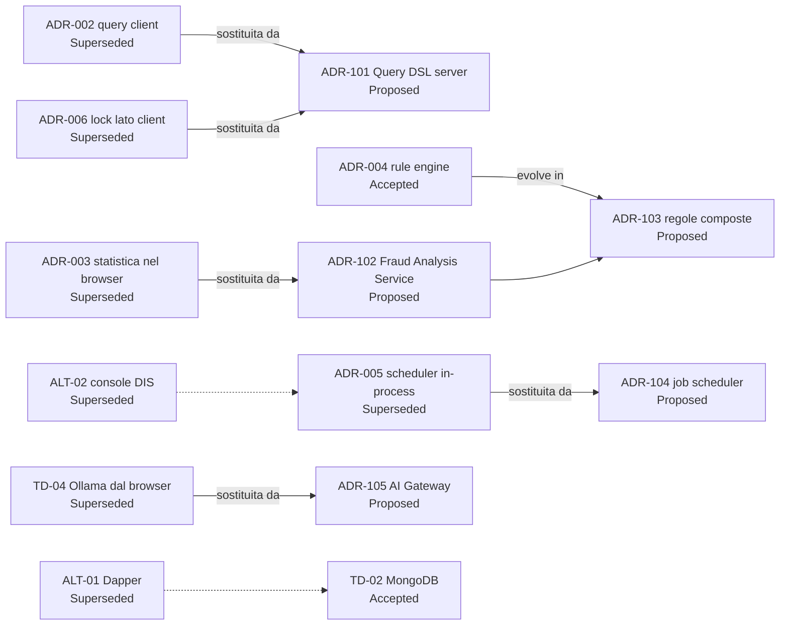

<!-- IMPACT-META
schema: 1
mode: how
step: 13_decision_log
commit: fc7d820908b8b230fb47a2669920ba7efdb413a8
commit_short: fc7d820
branch: main
worktree: dirty
baseline_date: 2026-10-07T18:19:51+02:00
generated_at: 2026-10-08T09:36:49+02:00
-->
# Decision Log - Progetto LOSS_PREVENTION

> **Baseline commit:** `fc7d820` (`main`) · worktree `dirty` (modifiche locali solo in `Docs/` e `.github/`; codice applicativo identico al commit)

**Data**: 2026-10-08  
**Versione**: 1.1  
**Autori**: REVERSE how (IMPACT) · verifica IMPACT 2026-10-08  
**Audience**: Team tecnico, architetti, developer, tech lead

> Il repository **non contiene ADR**. Le decisioni seguenti sono **ricostruite dal codice** al commit `fc7d820`; ogni voce riporta l'evidenza (file:riga) e uno stato:
> - **Accepted** — decisione in vigore, *inferita dal codice*;
> - **Superseded** — decisione in vigore che questa analisi raccomanda di sostituire (indica la proposta che la sostituisce), oppure alternativa abbandonata visibile nel codice;
> - **Proposed** — *raccomandazione* dell'analista, non presente nel codice.

---

## Sezioni Principali

1. [Technology Decisions](#1-technology-decisions)
2. [Architectural Decisions (ADRs)](#2-architectural-decisions-adrs)
3. [Pattern Decisions](#3-pattern-decisions)
4. [Trade-offs Analysis](#4-trade-offs-analysis)
5. [Alternative Solutions Considered](#5-alternative-solutions-considered)
6. [Decision Context & Rationale](#6-decision-context--rationale)

---

## 1. Technology Decisions

Lo stack scelto è mainstream e recente (.NET 8, Vue 3, MongoDB); i punti deboli sono la duplicazione di librerie e l'integrazione AI dal browser.

| ID | Decisione (inferita dal codice) | Evidenza | Alternative plausibili | Stato | Valutazione |
|----|-------------------------------|----------|------------------------|-------|-------------|
| TD-01 | Backend .NET 8 + **FastEndpoints 6.0.0** (pattern REPR) con Swagger | `LossPrevention.API.csproj` (FastEndpoints 6.0.0, .Security, .Swagger); `Program.cs:53` `AddFastEndpoints()`, `Program.cs:124` `UseSwaggerGen()` | ASP.NET Minimal API, MVC Controllers | Accepted | ✅ Adeguata; permessi dichiarativi (`Permissions("CAN_…")` su 74/78 endpoint) |
| TD-02 | **MongoDB** (driver 3.4.0) come unico store | `InfrastructureServiceExtensions.cs:33` (`IMongoClient`), `:48-147` registrazioni `MongoRepository<>`; 15 collezioni | PostgreSQL + JSONB, SQL Server (vedi ALT-01 Dapper) | Accepted | ✅ Coerente con dati POS eterogenei; ⚠️ aggregazioni dinamiche esposte al client (ADR-002) |
| TD-03 | Frontend **Vue 3 + Vite 6 + Vuetify 3 + Pinia** (SPA) | `package.json:27,31,25,44`; `main.ts:2,6,17,19`; script `dev: vite` (`package.json:7`) | React/MUI, Angular, Nuxt SSR (vedi ALT-03) | Accepted | ✅ Adeguata |
| TD-04 | LLM locale **Ollama `qwen2.5:14b`** chiamato dal browser | `stores/aiStore.ts:8` (modello), `:88` `fetch` verso `localhost:11434` | Azure OpenAI, gateway LLM server-side | Superseded → ADR-105 | 🟡 Buona per la privacy dei dati, ma non deployabile: ogni utente deve avere Ollama locale |
| TD-05 | Due librerie di griglia: **AG Grid** e **Tabulator** | AG Grid `main.ts:12`, `resultsGrid.vue`, `tabularBlock.vue`; Tabulator `distanceTable.vue`; `package.json:13-14,26` | Una sola libreria | Accepted | 🟡 Duplicazione (bundle, competenze) |
| TD-06 | **JWT simmetrico** (HMAC-SHA256) con claim `permissions` e `LockField/LockValue` | `Program.cs:64-74` (`AddJwtBearer`, `SymmetricSecurityKey`); `LoginEndpoint.cs:48-80`; `SecretKey` in `appsettings.json` | OIDC / IdP esterno (Entra ID) | Accepted | 🟡 Semplice; SSO pianificato richiederà un IdP; chiave versionata |
| TD-07 | Hashing password **PBKDF2-SHA256 600.000 iterazioni** con migrazione da formato legacy | `Infrastructure/Helpers/PasswordHasher.cs:21,44` (prefisso `v2:`, legacy 10.000) | BCrypt/Argon2, IdP esterno | Accepted | ✅ Allineato alle raccomandazioni OWASP correnti |
| TD-08 | Export PDF con **pdfmake**, XLSX con **SheetJS `xlsx` 0.18.5** | `resultsGrid.vue:513` (pdfmake), `:1922`, `:1944` | jsPDF (dichiarato ma non usato, ALT-04) | Accepted | 🟡 `xlsx` 0.18.5 ha advisory high senza fix su npm |

---

## 2. Architectural Decisions (ADRs)

Sette decisioni architetturali sono ricostruite dal codice; quattro sono marcate *Superseded* perché questa analisi raccomanda di sostituirle (proposte in §5).

### ADR-001 — Schema-on-read per le transazioni
- **Contesto**: file POS (XML, CSV, JSON) di formati diversi per cliente.
- **Decisione (inferita)**: appiattire ogni file in un documento BSON e derivare lo schema in `Mappings` campionando i dati.
- **Evidenza**: `XmlToBsonConverterHelper.cs:9` `ConvertFlattened`, `:17` `FlattenElement`; `XmlProcessingService.cs:26,36`; `MappingService.cs:147` `ProcessMappings`, `:223` `FinalizeTypesAsync`; 3 strategie `IFileProcessingService` (`Program.cs:102-104`).
- **Conseguenze**: + onboarding di nuovi formati senza codice; − nessuna validazione, dipendenza dai nomi campo, tipi inferiti a posteriori.
- **Stato**: **Accepted** — mantenere, aggiungendo validazione e mapping semantico esplicito.

### ADR-002 — Query builder lato client che genera pipeline MongoDB
- **Decisione (inferita)**: il frontend costruisce la pipeline di aggregazione e il backend la esegue così com'è, con cache in memoria.
- **Evidenza**: `helpers/queryUtils.ts:63` `buildTypeAwareCondition`; `GetReportDataEndpoint.cs` (`POST /data/report/query`) → `ReportDataservice.cs:25` `QueryReportDataAsync`; cache `IMemoryCache` 1 h (`GetReportDataEndpoint.cs:55-81`) con chiave SHA-256 di pipeline+skip+take (`:92-96`) **non legata all'utente**.
- **Conseguenze**: + massima flessibilità del report builder; − query injection, bypass del lock di riga, risultati in cache condivisi tra utenti con lock diversi.
- **Stato**: **Superseded** (raccomandazione) da ADR-101.

### ADR-003 — Motore statistico antifrode nel browser
- **Decisione (inferita)**: calcolare statistiche, regole euristiche e analisi nel client.
- **Evidenza**: `stores/aiStore.ts:555` `computeStats`, `:1203` `buildGenericFraudRuleTemplates` (CCN 87), `:1535` `generateFraudRules`, `:1667` `analyzeFraudInData`; codice generato a runtime con `new Function` (`:1769`) ed `eval` (`resultsGrid.vue:1377`).
- **Conseguenze**: + nessun carico server, interattività; − risultati non persistiti né auditabili, limitati dalla memoria del browser, soglie calcolate sul primo blocco di dati.
- **Stato**: **Superseded** (raccomandazione) da ADR-102.

### ADR-004 — Rule engine a singolo campo con flag materializzati
- **Decisione (inferita)**: salvare `FraudFlags.<Rule>` su ogni documento e creare la mapping booleana corrispondente.
- **Evidenza**: `RulesService.cs:32-78` `ApplyRulesAsync` (`UpdateMany` + `Unset` `:40-41`, `ReplaceOneAsync` per documento `:58`, ricostruzione mapping `:68-78`); `:97-113` la creazione aggiunge la mapping `FraudFlags.<RuleName>`; `:180-201` la cancellazione rimuove il flag da tutti i documenti. Applicazione solo manuale (`GET /rules/apply`). Difetto: `UpdateRuleAsync` scrive il flag in radice (`:147`) anziché in `FraudFlags.`.
- **Conseguenze**: + flag interrogabili come campi normali; − ricalcolo completo a ogni applicazione, regole poco espressive (un campo, valore o range).
- **Stato**: **Accepted** → evoluzione proposta in ADR-103.

### ADR-005 — Scheduler di ingestione in-process
- **Decisione (inferita)**: `BackgroundService` nell'API che controlla ogni minuto se eseguire l'ingestione.
- **Evidenza**: `DataIngestionBackgroundService.cs:13` intervallo 1 min, `:28` ritardo iniziale 10 s; `Program.cs:111` `AddHostedService`.
- **Conseguenze**: + semplicità; − con più istanze dell'API l'ingestione verrebbe eseguita più volte (nessun lock distribuito); nessuno storico esecuzioni oltre a `ProcessedFiles`.
- **Stato**: **Superseded** (raccomandazione) da ADR-104.

### ADR-006 — Row-level security tramite claim JWT interpretati dal client
- **Decisione (inferita)**: il lock di riga (`LockField`/`LockValue`) è un claim del token applicato dal frontend.
- **Evidenza**: claim emessi in `LoginEndpoint.cs:67-68`; decodifica nel browser in `helpers/fieldLock.ts:2-10` (`localStorage` + `atob`); configurazione in `users.vue:268-273` e `UserService.cs:100-103`; nessun filtro lato server nelle query.
- **Conseguenze**: + implementazione rapida; − il vincolo è aggirabile chiamando direttamente l'API.
- **Stato**: **Superseded** (raccomandazione) da ADR-101 (enforcement server-side).

### ADR-007 — Retention con TTL index
- **Decisione (inferita)**: cancellazione automatica delle transazioni dopo N giorni.
- **Evidenza**: `DatabaseInitializationService.cs:23` (`DataRetention:TransactionRetentionDays`, default 90), `:97-105` creazione indice `ttl_BeginDateTime`.
- **Conseguenze**: + volume controllato senza job; − dipende dalla presenza di `BeginDateTime` come `Date` nei documenti (con lo schema-on-read non è garantito).
- **Stato**: **Accepted** — buona scelta; da allineare al campo data effettivo dei file.

---

## 3. Pattern Decisions

I pattern principali sono applicati in modo coerente nell'API; alcuni sono predisposti ma inutilizzati o applicati in modo parziale.

| Pattern | Dove (evidenza) | Stato | Esito |
|---------|-----------------|-------|-------|
| REPR (Request-Endpoint-Response) | 78 classi in `LossPrevention.API/Endpoints/**` | Accepted | ✅ |
| Generic Repository | `MongoRepository.cs`; espone `Collection` (`:27`) e crea un proprio `MongoClient` (`:22`) | Accepted | 🟡 Astrazione "leaky"; 20/78 endpoint usano il repository direttamente, bypassando Application |
| Strategy (processori di file) | 3 `IFileProcessingService` (`Program.cs:102-104`) selezionati per `SupportedFileType` | Accepted | ✅ |
| Chain of responsibility (`IXmlEnrichmentRule`) | `XmlEnrichmentService.cs:8-10` | Accepted (predisposto) | ⚪ Nessuna implementazione registrata |
| Cache-aside (`IMemoryCache`) | `Program.cs:49`; `GetReportDataEndpoint.cs:55-81` | Accepted | 🟡 Senza invalidazione e senza scoping per utente |
| Hosted service / polling scheduler | `DataIngestionBackgroundService.cs` | Accepted | 🟡 Vedi ADR-005 |
| Code generation a runtime | `aiStore.ts:1769` (`new Function`), `resultsGrid.vue:1377` (`eval`) | Accepted | 🔴 Rischio sicurezza/manutenibilità |
| Store centralizzato (Pinia) | 15 store in `src/stores` | Accepted | 🟡 `aiStore.ts` (1.994 righe) concentra logica di business |

---

## 4. Trade-offs Analysis

Le scelte attuali privilegiano velocità di sviluppo e flessibilità a scapito di sicurezza, auditabilità e scalabilità.

| Trade-off | Scelta attuale | Beneficio ottenuto | Costo nascosto |
|-----------|---------------|--------------------|----------------|
| Flessibilità vs sicurezza (ADR-002, ADR-006) | Flessibilità | Report builder libero | Accesso a dati fuori dal perimetro dell'utente |
| Velocità di sviluppo vs auditabilità (ADR-003) | Velocità | Analisi senza backend | Risultati non riproducibili né utilizzabili come prova |
| Semplicità vs scalabilità (ADR-005, cache in memoria) | Semplicità | Nessuna infrastruttura aggiuntiva | Una sola istanza API possibile |
| Privacy LLM locale vs operabilità (TD-04) | Privacy | Nessun dato inviato a terzi | AI non disponibile senza Ollama locale |
| Schema-on-read vs integrità (ADR-001, ADR-007) | Flessibilità | Nuovi formati senza codice | Nessuna validazione; TTL efficace solo se `BeginDateTime` è una data |

---

## 5. Alternative Solutions Considered

Il codice mostra alternative valutate e abbandonate (ALT, evidenze nel repository); seguono le alternative raccomandate da questa analisi (ADR-1xx, *Proposed*).

### 5.1 Alternative abbandonate (inferite dal codice)

| ID | Alternativa | Evidenza | Stato | Decisione che l'ha sostituita |
|----|-------------|----------|-------|-------------------------------|
| ALT-01 | Persistenza relazionale con **Dapper** | `LossPrevention.Infrastructure/Repositories/DapperRepository.cs`: 205 righe, interamente commentato (184 righe di commento, 0 di codice) | Superseded | TD-02 MongoDB |
| ALT-02 | Ingestione con **console separata** (`LossPrevention.DataIngestionService`) da cartella locale | `DataIngestionService/Program.cs:76` percorso fisso `C:\xmlstore5\xml`, `:85` `Parallel.ForEachAsync`, `:114` `ProcessMappings`, `:119` `FinalizeTypesAsync`; unica a registrare `IndexService` | Superseded (resta nella solution) | ADR-005 scheduler in-process + SFTP |
| ALT-03 | **Nuxt 3 con SSR** | `nuxt.config.ts:4` `ssr: true`; `nuxt` in `package.json:22`, mai importato; build con Vite | Superseded | TD-03 SPA Vite |
| ALT-04 | **jsPDF / jspdf-autotable** per l'export PDF | `package.json:20` e seguenti, nessun import in `src` | Superseded | TD-08 pdfmake |
| ALT-05 | **grid-layout-plus** per le dashboard | `package.json:18`, nessun import; si usa `vue-grid-layout-v3` (`dashboardGrid.vue:84`) | Superseded | `vue-grid-layout-v3` |
| ALT-06 | Schema precedente di dati e mapping | dump `Data/LossPrevention/Mappings_old.bson`, `ReportData_old.bson` | Superseded | ADR-001 schema attuale |

### 5.2 Alternative raccomandate (Proposed)

| ID | Proposta | Sostituisce | Contenuto |
|----|----------|-------------|-----------|
| ADR-101 | **Query DSL validata lato server** | ADR-002, ADR-006 | Il client invia un modello di query (campi, filtri, group-by, aggregazioni — già presente in `Workspace/Tab/Query/Condition`); il server genera la pipeline, aggiunge il `$match` su `LockField/LockValue`, limita gli stage ammessi e include l'utente nella chiave di cache |
| ADR-102 | **Fraud Analysis Service server-side** | ADR-003 | Porting di `computeStats` e `build*Rules` in un servizio .NET (job asincrono); risultati persistiti in una collezione `FraudFindings` (transazione, tipologia, severità, valori, versione soglie, run-id) con audit; eliminazione di `eval`/`new Function` |
| ADR-103 | **Regole composte** | evolve ADR-004 | Condizioni multiple (AND/OR), finestre temporali, aggregazioni per entità; esecuzione con pipeline `$set`/`$merge` invece di `ReplaceOne` per documento; applicazione automatica post-ingestione |
| ADR-104 | **Job scheduler persistente** | ADR-005 | Hangfire/Quartz con storage MongoDB o worker dedicato con lock distribuito; storico esecuzioni in UI |
| ADR-105 | **AI Gateway** | TD-04 | Endpoint backend `/ai/*` verso Ollama server-side o Azure OpenAI, con configurazione modello/token/temperatura (voce "AI Configuration" di `Docs/roadmap.txt`, documentazione fornitore storica presente solo nel commit `593f6de`, rimossa in `d768cd9`), autenticazione, logging prompt e limiti |

---

## 6. Decision Context & Rationale

Il contesto è quello di un prodotto in fase di prototipazione rapida (13 commit, nessun test, nessun ADR): le scelte ricostruite massimizzano la velocità di consegna delle funzioni visibili. Le proposte mirano a renderlo **sicuro, auditabile e scalabile senza cambiare stack**, riusando il modello di query esistente (`Workspace/Tab/Query/Condition`) e gli algoritmi già scritti (porting da TypeScript a C#).

| Decisione | Driver di contesto | Rationale |
|-----------|--------------------|-----------|
| TD-02, ADR-001 | Formati POS eterogenei, nessuno schema comune | Documenti flessibili + mapping derivate evitano sviluppo per ogni cliente |
| ADR-002, ADR-003 | Report builder e analisi interattive come elemento di vendita | Massima libertà lato UI con backend minimale |
| TD-04 | Dati transazionali sensibili | LLM locale evita di inviare dati a terzi |
| ADR-005 | Un solo deploy, nessuna infrastruttura dedicata | Scheduler nello stesso processo dell'API |
| ADR-101…105 | Uso in produzione su dati reali (voce roadmap "Real world data testing") | Chiudere i rischi di sicurezza e rendere i risultati verificabili prima di estendere le funzionalità |

L'ordine consigliato di adozione delle proposte e il relativo effort sono in [19_modernization_estimation_spec.md](19_modernization_estimation_spec.md) §7.1 (G1–G7).

---

## Reference Documents

- **Deep Dive Analysis**: [00_deep_dive.md](00_deep_dive.md)
- **Context**: [01_context.md](01_context.md)
- **Functional Overview**: [02_functional_overview.md](02_functional_overview.md)
- **Non-Functional Overview**: [03_non_functional_overview.md](03_non_functional_overview.md)
- **Constraints**: [04_constraints.md](04_constraints.md)
- **Principles**: [05_principles.md](05_principles.md)
- **Software Architecture**: [06_software_architecture.md](06_software_architecture.md)
- **Code**: [07_code.md](07_code.md)
- **Data**: [08_data.md](08_data.md)
- **Infrastructure Architecture**: [09_infrastructure_architecture.md](09_infrastructure_architecture.md)
- **Deployment**: [10_deployment.md](10_deployment.md)
- **Development Environment**: [11_development_environment.md](11_development_environment.md)
- **Operation and Support**: [12_operation_and_support.md](12_operation_and_support.md)

---

## Change Log

| Versione | Data | Autore | Modifiche |
|----------|------|--------|-----------|
| 1.0 | 2026-10-07 | REVERSE how (FULL) | Creazione documento (sostituisce run 2026-10-05) |
| 1.1 | 2026-10-08 | IMPACT verify | Evidenza file:riga per ogni TD/ADR/pattern; stati normalizzati (Accepted/Superseded/Proposed) con distinzione inferita dal codice vs raccomandazione (ADR-006 "Rejected" → Superseded); aggiunti TD-07 (PBKDF2), TD-08 (pdfmake/xlsx), alternative abbandonate ALT-01…06 (Dapper, console DIS, Nuxt SSR, jsPDF, grid-layout-plus, collezioni `_old`), difetto `UpdateRuleAsync`, cache non legata all'utente; tabella driver/rationale; diagramma Mermaid con etichette quotate; documentazione fornitore citata come storica (`593f6de` → `d768cd9`); Reference Documents completi |
