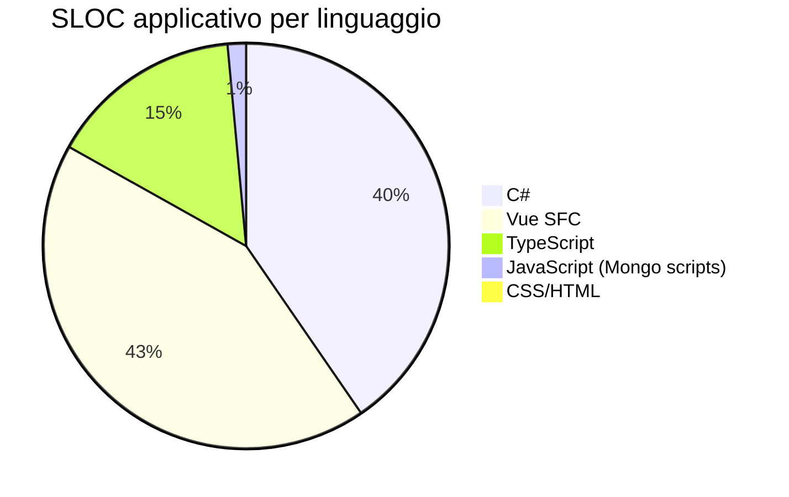

<!-- REVERSE-META
schema: 1
mode: how
step: 14_metrics
commit: 593f6decec3a642d5567754dd795b19560bb0afb
commit_short: 593f6de
branch: main
worktree: clean
baseline_date: 2026-10-05T10:14:05+00:00
generated_at: 2026-10-07T14:40:00Z
-->
# Metrics - Progetto LOSS_PREVENTION

> **Baseline commit:** `593f6de` (`main`) · worktree `clean`

**Data**: 2026-10-07 · **Versione**: 1.0 · **Autori**: REVERSE how · **Audience**: team tecnico, architetti, PM

---

## 1. Total Lines of Code (SLOC)

| Perimetro | SLOC (code) |
|-----------|-------------|
| **Applicativo** (C#, Vue, TS, JS, CSS, HTML) | **25.208** |
| di cui backend C# | 10.143 |
| di cui frontend (Vue + TS + CSS + HTML) | 14.697 |
| di cui script DB (JS) | 368 |
| Configurazione/dati (JSON) | 14.205 (prevalentemente `package-lock.json`, `rules_export.json`, metadata dump) |
| Documentazione (Markdown) | 13.910 |

## 2. Total Lines of Code (cloc 2.02)

Analisi effettuata con cloc sul repository completo (esclusi `node_modules`, `.vite`, `docs`, `.git`):

```
Linguaggio            Files      Blank    Comment      Code
──────────────────────────────────────────────────────────
JSON                     21          1          0     14205
Markdown                 19       3895          0     13910
Vuejs Component          41       1614        723     10720
C#                      232       1506        617     10143
TypeScript               29        601        546      3868
JavaScript                6         61         71       368
CSS                       1         15          3        96
MSBuild script            5         23          0        94
Text                      1         14          0        76
Visual Studio Solution    1          1          1        47
HTML                      1          0          0        13
SVG                       1          0          0         1
──────────────────────────────────────────────────────────
TOTALE                  358       7731       1961     53541
```

Le 617 righe di commento C# includono le 204 righe di `DapperRepository.cs` interamente commentate (codice morto).

## 3. Language Distribution (codice applicativo)



Dettaglio Vue SFC: script 5.600 · template 4.043 · style 1.296 (righe non vuote).

Per progetto (cloc, tutti i file del progetto):

| Progetto | File | SLOC |
|----------|------|------|
| LossPrevention.API | 82 | 4.414 |
| LossPrevention.Application | 122 | 4.782 |
| LossPrevention.Domain | 22 | 523 |
| LossPrevention.Infrastructure | 11 | 477 |
| LossPrevention.DataIngestionService | 3 | 141 |
| LossPrevention.UI/src | 70 | 14.663 |

## 4. Complexity Metrics (lizard)

| Perimetro | NLOC | Funzioni | NLOC medio | CCN medio | Funzioni CCN > 15 |
|-----------|------|----------|------------|-----------|-------------------|
| Backend C# | 10.140 | 475 | 14,9 | **2,5** | 6 |
| Frontend TS/Vue | 6.142 | 569 | 8,9 | **3,1** | 14 |

Top 5 hotspot: `buildGenericFraudRuleTemplates` (CCN 87, 254 NLOC), `enrichWithCrossTransactionMetrics` (43), `dataIngestionStore.save` (36), `analyzeFraudInData` (34), `chartblock.buildPipeline` (28). Elenco completo nel documento 07 (Code) §3.

File più grandi: `resultsGrid.vue` 2.271 righe · `aiStore.ts` 1.994 · `selectFields.vue` 823 · `fraudDetectionStore.ts` 728 · `queryBuilderTabs.vue` 693 · `FraudSettingsDialog.vue` 595.

## 5. Module/Component Count

| Elemento | Numero |
|----------|--------|
| Progetti .NET | 5 |
| Endpoint REST | 78 (24 POST, 27 GET, 11 PUT, 14 DELETE, 2 PATCH) |
| Endpoint anonimi | 4 |
| Registrazioni DI servizi applicativi (API) | 20 (incl. 3 `IFileProcessingService`) |
| Entità di dominio | 19 file in `Domain/Entities` |
| Collezioni MongoDB | 15 |
| Permessi | 37 |
| Componenti Vue | 41 |
| Store Pinia | 15 |
| Route | 17 |
| Regole antifrode seed (server) | 13 |
| Tipologie euristiche antifrode (client) | 30 |
| Blocchi di soglie configurabili | 22 |

## 6. Dependency Metrics

| Ecosistema | Dirette | Vulnerabilità note |
|-----------|---------|--------------------|
| NuGet | 15 pacchetti (5 csproj) | Non verificato con `dotnet list package --vulnerable` (runtime non disponibile); `Microsoft.AspNetCore.Http.Features 5.0.17` deprecato |
| npm | 21 dependencies + 12 devDependencies | **71** (`npm audit`): 6 critical · 46 high · 15 moderate · 4 low |

Dirette con severità high/critical: `@nuxt/devtools` (critical, non usata), `jspdf` e `jspdf-autotable` (critical, non usate), `nuxt` (high, non usata), `axios` (high, fix disponibile), `vite` (high, fix disponibile), `vue` (high via dipendenze, fix disponibile), `xlsx` (high, **nessun fix** su npm). Dipendenze dichiarate ma non importate: `nuxt`, `jspdf`, `jspdf-autotable`, `grid-layout-plus`, `vuedraggable`.

## 7. Code Quality Metrics

| Indicatore | Valore |
|-----------|--------|
| `catch (Exception)` generici (BE) | 31 |
| `Console.WriteLine` (BE) | 6 |
| `console.log` (FE) | 57 |
| `TODO/FIXME/HACK` | 4 |
| `eval` / `new Function` (FE) | 1 / 1 |
| Endpoint che usano direttamente il repository | 20 / 78 (26%) |
| Codice morto stimato | ~250 righe C# + 5 dipendenze npm |
| Duplicazione evidente | Mapping DTO↔entità soglie antifrode duplicato in Create/Update endpoint (~300 righe ciascuno) |
| Lint / analyzer configurati | 0 |

## 8. Test Coverage Metrics

| Indicatore | Valore |
|-----------|--------|
| Progetti di test | 0 |
| Test unitari | 0 |
| Test E2E | 0 |
| Coverage | **0%** |


---

## Reference Documents
- 00_deep_dive.md · 07_code.md · 13_decision_log.md

## Change Log

| Versione | Data | Autore | Modifiche |
|----------|------|--------|-----------|
| 1.0 | 2026-10-07 | REVERSE how (FULL) | Creazione documento (sostituisce run 2026-10-05) |
