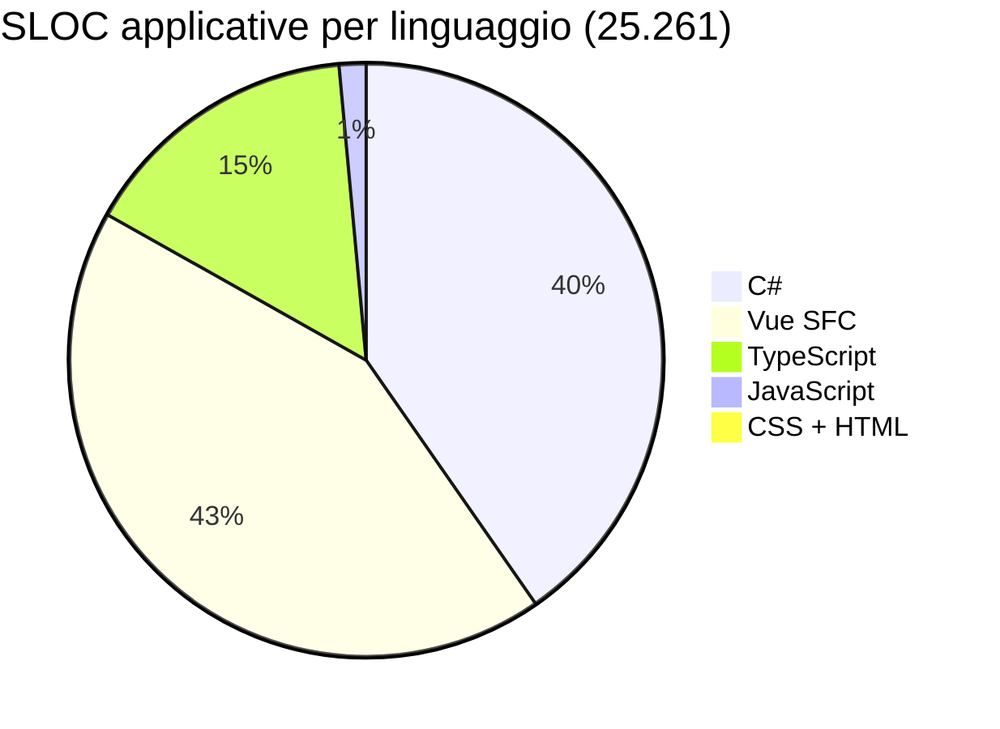
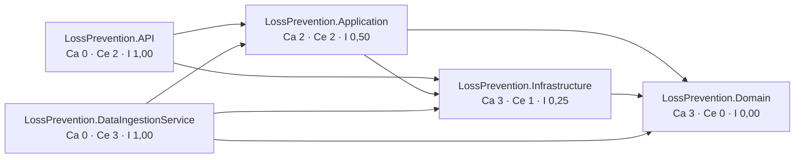
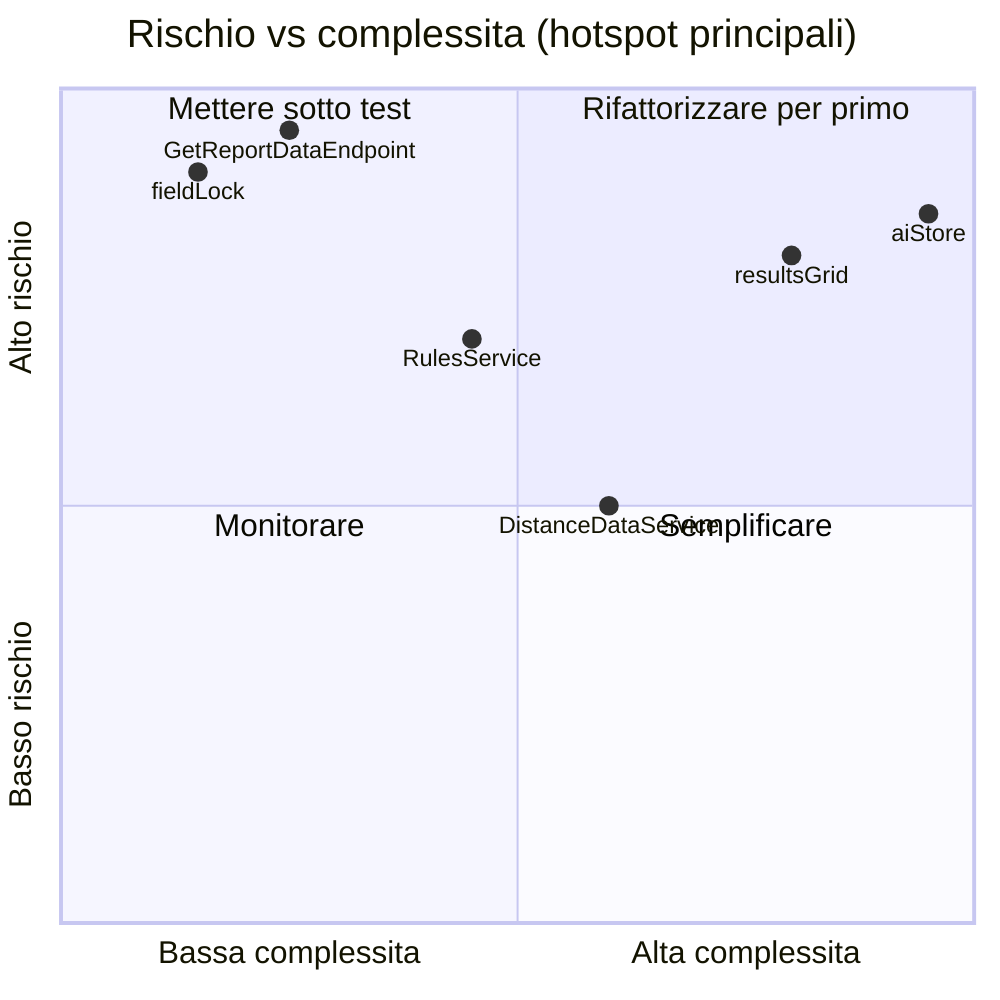

<!-- IMPACT-META
schema: 1
mode: how
step: 14_metrics
commit: fc7d820908b8b230fb47a2669920ba7efdb413a8
commit_short: fc7d820
branch: main
worktree: dirty
baseline_date: 2026-10-07T18:19:51+02:00
generated_at: 2026-10-08T09:26:01+02:00
-->
# Metrics - Progetto LOSS_PREVENTION

> **Baseline commit:** `fc7d820` (`main`) · worktree `dirty` (modifiche locali solo in `Docs/` e `.github/`; codice applicativo identico al commit)

**Data**: 2026-10-08  
**Versione**: 1.1  
**Autori**: REVERSE how (IMPACT) · verifica IMPACT 2026-10-08  
**Audience**: Team tecnico, architetti, developer, PM (input per le stime di [15_fp_cocomo.md](15_fp_cocomo.md) e [19_modernization_estimation_spec.md](19_modernization_estimation_spec.md))

---

## Sezioni Principali

0. [Metodo di misura e riproducibilità](#0-metodo-di-misura-e-riproducibilità)
1. [Total Lines of Code (SLOC)](#1-total-lines-of-code-sloc)
2. [Language Distribution](#2-language-distribution)
3. [Complexity Metrics](#3-complexity-metrics)
4. [Module/Component Count](#4-modulecomponent-count)
5. [Dependency Metrics](#5-dependency-metrics)
6. [Code Quality Metrics](#6-code-quality-metrics)
7. [Test Coverage Metrics](#7-test-coverage-metrics)

---

## 0. Metodo di misura e riproducibilità

Tutte le metriche sono misurate sul **contenuto del commit `fc7d820`** (estratto con `git archive`), così da non essere influenzate dalle modifiche locali in `Docs/`. Gli strumenti sono cloc 2.10 (SLOC), lizard 1.24.1 (complessità ciclomatica), PowerShell (verifica incrociata e conteggi puntuali) e `npm audit` (vulnerabilità).

| Misura | Strumento / comando (eseguiti da `C:\repository\LOSS_PREVENTION`) |
|--------|-------------------------------------------------------------------|
| Estrazione baseline | `git archive --format=tar -o fc7d820.tar fc7d820` → `tar -xf fc7d820.tar -C <dir>` |
| SLOC repository completo | `cloc-2.10.exe <dir>\customspa-it-loss-prevention-d098a8b97860` (binario ufficiale `AlDanial/cloc` v2.10; `npx cloc` non utilizzabile perché richiede Perl, assente sulla macchina) |
| SLOC per progetto | `cloc-2.10.exe <progetto>` per ciascuna cartella `LossPrevention.*`, `Data`, `Docs` |
| SLOC delle sole sezioni `<script>` dei `.vue` | script Python che estrae il contenuto di ogni blocco `<script …>…</script>` dei 41 SFC in file `.ts` temporanei, poi `cloc` sui file estratti |
| Complessità ciclomatica (CCN) | `pip install lizard` → `python -m lizard -l csharp LossPrevention.API LossPrevention.Application LossPrevention.Domain LossPrevention.Infrastructure LossPrevention.DataIngestionService` e `python -m lizard -l typescript -l vue LossPrevention.UI\src` (output `--csv` per gli hotspot) |
| Vulnerabilità npm | `npm audit --package-lock-only --json` in `LossPrevention.UI` (eseguito il 2026-10-08; il risultato dipende dalla data dell'advisory DB) |

Verifica incrociata PowerShell (righe **non vuote** = codice + commento cloc), eseguibile sul working tree perché il codice è identico al commit:

```powershell
cd C:\repository\LOSS_PREVENTION\customspa-it-loss-prevention-d098a8b97860
foreach ($p in 'LossPrevention.API','LossPrevention.Application','LossPrevention.Domain',
               'LossPrevention.Infrastructure','LossPrevention.DataIngestionService') {
  $files = Get-ChildItem $p -Recurse -File -Filter *.cs | Where-Object { $_.FullName -notmatch '\\(bin|obj)\\' }
  $nb = ($files | ForEach-Object { Get-Content $_.FullName | Where-Object { $_.Trim() -ne '' } } | Measure-Object).Count
  "{0,-38} files={1,4} nonblank={2,6}" -f $p, $files.Count, $nb }
$fe = Get-ChildItem LossPrevention.UI\src -Recurse -File -Include *.vue,*.ts
"UI/src (*.vue,*.ts) files={0} nonblank={1}" -f $fe.Count, (($fe | % { Get-Content $_.FullName | ? { $_.Trim() -ne '' } }) | Measure-Object).Count
```

| Perimetro | File | Righe non vuote (PowerShell) | cloc code + comment | Esito |
|-----------|------|------------------------------|---------------------|-------|
| LossPrevention.API (C#) | 79 | 4.347 | 4.312 + 35 | ✅ coincide |
| LossPrevention.Application (C#) | 121 | 5.005 | 4.763 + 242 | ✅ |
| LossPrevention.Domain (C#) | 21 | 519 | 513 + 6 | ✅ |
| LossPrevention.Infrastructure (C#) | 10 | 784 | 459 + 325 | ✅ |
| LossPrevention.DataIngestionService (C#) | 1 | 105 | 96 + 9 | ✅ |
| LossPrevention.UI/src (`.vue` + `.ts`) | 69 | 15.836 | (10.773 + 670) + (3.847 + 546) | ✅ |

---

## 1. Total Lines of Code (SLOC)

Il repository contiene **25.261 SLOC applicative** (C#, Vue, TypeScript, JavaScript, CSS, HTML) su un totale di 42.444 righe di codice cloc; il resto è `package-lock.json` (14.001), documentazione Markdown e file di build. La **baseline di stima** (SLOC logiche usate per backfiring e COCOMO nei documenti 15 e 19) è di **19.774 SLOC**.

### 1.1 Total Lines of Code (cloc 2.10) — repository completo

Analisi effettuata con cloc 2.10 sull'intero albero del commit `fc7d820` (nessuna esclusione; `node_modules`, `bin`, `obj` non sono versionati):

```
Linguaggio               Files      Blank    Comment      Code
──────────────────────────────────────────────────────────────
JSON                        23          1          0     14216
Vuejs Component             41       1614        670     10773
C#                         232       1506        617     10143
TypeScript                  29        601        546      3868
Markdown                    24        767        220      2825
JavaScript                   6         61         71       368
CSS                          1         15          3        96
MSBuild script               5         23          0        94
Visual Studio Solution       1          1          1        47
HTML                         1          0          0        13
SVG                          1          0          0        1
──────────────────────────────────────────────────────────────
TOTALE                     364       4589       2128     42444
```

Note di lettura:
- **JSON 14.216**: `LossPrevention.UI/package-lock.json` 14.001 righe (generato), `package.json` 48, `appsettings.json` API 42 + DIS 19 e `launchSettings.json` 39 (= 100), `tsconfig.json` 25, `rules_export.json` 15, 12 `*.metadata.json` + `prelude.json` del dump Mongo 13 (1 riga ciascuno, minificati), `.vite/deps` 2 file di cache Vite versionati 11, `.vscode/extensions.json` 3.
- **Markdown 2.825**: 21 documenti IMPACT presenti in `Docs/` **al commit `fc7d820`** (2.577), `README.md` 132, `Data/MongoDBScripts/PERMISSIONS_LIST.md` 113, `LossPrevention.UI/README.md` 3. La documentazione del fornitore (`Docs/01_EXECUTIVE_OVERVIEW.md` … `Docs/roadmap.txt`, 17 file, ≈17.500 righe) **non esiste alla baseline**: era presente solo nel commit `593f6de` ed è stata rimossa in `d768cd9` (consultabile con `git show 593f6de:customspa-it-loss-prevention-d098a8b97860/Docs/<file>`); non è conteggiata.
- **JavaScript 368**: 5 script Mongo in `Data/MongoDBScripts` (357) + `LossPrevention.UI/vite.config.js` (11).
- I file `.bson` del dump (`Data/LossPrevention`, 12 collezioni) sono binari e non sono conteggiati.

### 1.2 Librerie di terze parti incluse nel sorgente (analisi obbligatoria)

Verifica eseguita cercando file minificati (`*.min.js`, `*.min.css`), cartelle `vendor/`, `lib/`, `assets/js` e copie di librerie note dentro `src/` e nei progetti .NET.

| Elemento | Percorso | Tipo | Trattamento nel conteggio |
|----------|----------|------|---------------------------|
| Nessuna libreria di terze parti copiata nel sorgente | — | — | Nessuna esclusione necessaria: tutte le librerie (Vuetify, AG Grid, Tabulator, Chart.js, xlsx, pdfmake, FastEndpoints, MongoDB.Driver, SSH.NET …) sono referenziate come pacchetti npm/NuGet |
| `package-lock.json` | `LossPrevention.UI/` | File generato da npm | Incluso nella tabella cloc (JSON) ma **escluso** dalle SLOC applicative |
| `.vite/deps/_metadata.json`, `.vite/deps/package.json` | `LossPrevention.UI/.vite/` | Cache di build Vite versionata per errore | Esclusa dalle SLOC applicative |
| `vite.svg` | `LossPrevention.UI/public/` | Asset del template Vite | Escluso |

### 1.3 Sintesi per perimetro

| Perimetro | SLOC (cloc code) | Composizione |
|-----------|------------------|--------------|
| **Applicativo** | **25.261** | C# 10.143 + Vue 10.773 + TS 3.868 + JS 368 + CSS 96 + HTML 13 |
| di cui backend C# (5 progetti) | 10.143 | 232 file |
| di cui frontend (`LossPrevention.UI`) | 14.761 | Vue 10.773 + TS 3.868 (28 in `src` + `nuxt.config.ts` 21) + CSS 96 + HTML 13 + `vite.config.js` 11 |
| di cui script DB (`Data/MongoDBScripts/*.js`) | 357 | 5 script ordinati `00`…`04` |
| Build/config (MSBuild, `.sln`, JSON, SVG) | 14.358 | di cui `package-lock.json` 14.001 |
| Documentazione (Markdown) | 2.825 | vedi §1.1 |
| **Totale cloc** | **42.444** | |

### 1.4 Per progetto (cloc, tutti i file della cartella)

| Progetto / cartella | File | Blank | Comment | Code | Dettaglio |
|---------------------|------|-------|---------|------|-----------|
| LossPrevention.API | 82 | 562 | 35 | 4.414 | C# 79 file / 4.312; JSON 2 / 81; csproj 21 |
| LossPrevention.Application | 122 | 744 | 242 | 4.782 | C# 121 / 4.763; csproj 19 |
| LossPrevention.Domain | 22 | 79 | 6 | 523 | C# 21 / 513 (di cui 19 file in `Entities`) |
| LossPrevention.Infrastructure | 11 | 118 | 325 | 477 | C# 10 / 459; 184 righe di commento sono `DapperRepository.cs` interamente commentato |
| LossPrevention.DataIngestionService | 3 | 26 | 9 | 141 | C# 1 / 96 (`Program.cs`) |
| LossPrevention.UI (intera cartella) | 81 | 2.234 | 1.219 | 28.853 | di cui `package-lock.json` 14.001 |
| └ LossPrevention.UI/src | 70 | 2.229 | 1.219 | 14.716 | Vue 41 / 10.773; TS 28 / 3.847; CSS 1 / 96 |
| Data | 20 | 92 | 71 | 498 | JS 5 / 357; MD 1 / 113; JSON 14 / 28 |
| Docs (IMPACT al commit) | 21 | 697 | 220 | 2.577 | |
| Root (`README.md`, `.sln`) | 2 | 37 | 1 | 179 | |
| **Totale** | **364** | **4.589** | **2.128** | **42.444** | |

### 1.5 Baseline di stima (SLOC logiche)

Questa è l'unica baseline dimensionale usata in [15_fp_cocomo.md](15_fp_cocomo.md) e [19_modernization_estimation_spec.md](19_modernization_estimation_spec.md).

| Componente | SLOC logiche | Origine |
|------------|--------------|---------|
| C# | 10.143 | cloc, linguaggio C# |
| TypeScript | 3.868 | cloc, linguaggio TypeScript (include `nuxt.config.ts`, 21 SLOC) |
| Vue — solo blocchi `<script>` | 5.395 | cloc sui 41 blocchi `<script>` estratti (blank 1.054, comment 486) |
| JavaScript | 368 | cloc (script Mongo + `vite.config.js`) |
| **Totale baseline** | **19.774** (19,774 KSLOC) | |
| Escluso: template/style/tag dei `.vue` | 5.378 | 10.773 − 5.395 |
| Escluso: CSS + HTML | 109 | markup/stili |

---

## 2. Language Distribution

Il codice applicativo è diviso quasi a metà tra backend C# (40%) e frontend Vue/TypeScript (59%); oltre metà del frontend è logica di script, segno che una parte rilevante della logica di business risiede nel browser.



| Linguaggio | SLOC | % applicativo |
|-----------|------|---------------|
| Vue SFC | 10.773 | 42,6% |
| C# | 10.143 | 40,2% |
| TypeScript | 3.868 | 15,3% |
| JavaScript | 368 | 1,5% |
| CSS + HTML | 109 | 0,4% |

Composizione dei 41 SFC Vue (righe non vuote, conteggio Python per blocco): template 4.043 · script 5.881 (di cui 5.395 SLOC logiche, vedi §1.5) · style 1.296; le restanti righe sono i tag di apertura/chiusura dei blocchi.

### 2.1 File più grandi (righe fisiche, `(Get-Content <file>).Count`)

| # | File | Righe fisiche | Righe non vuote |
|---|------|---------------|-----------------|
| 1 | `LossPrevention.UI/src/components/reports/resultsGrid.vue` | 2.271 | 1.971 |
| 2 | `LossPrevention.UI/src/stores/aiStore.ts` | 1.994 | 1.703 |
| 3 | `LossPrevention.UI/src/components/reports/selectFields.vue` | 823 | 732 |
| 4 | `LossPrevention.UI/src/stores/fraudDetectionStore.ts` | 728 | 674 |
| 5 | `LossPrevention.UI/src/components/reports/queryBuilderTabs.vue` | 694 | 594 |
| 6 | `LossPrevention.UI/src/components/reports/FraudSettingsDialog.vue` | 595 | 541 |
| 7 | `dataingestion.vue` | 567 | 502 |
| 8 | `notifications.vue` | 562 | 497 |
| 9 | `dashboard.vue` | 449 | 383 |
| 10 | `heatmapPreview.vue` | 448 | 398 |
| 11 | `home.vue` | 432 | 377 |
| 12 | `LossPrevention.Application/Services/Data/MappingService.cs` | 428 | 351 |
| 13 | `LossPrevention.Application/Services/DataIngestion/FileProcessingCoordinator.cs` | 424 | 358 |
| 14 | `LossPrevention.API/Endpoints/FraudDetection/UpdateFraudDetectionSettingsEndpoint.cs` | 407 | 392 |
| 15 | `App.vue` | 397 | 341 |

I primi due file (frontend) contengono da soli il 16,7% delle righe non vuote del frontend `src` (3.674 / 15.836).

---

## 3. Complexity Metrics

La complessità media è bassa (CCN 2,5 backend, 3,1 frontend), ma concentrata in pochi hotspot: 20 funzioni superano CCN 15 e la più complessa (`buildGenericFraudRuleTemplates`, CCN 87) è nel motore antifrode lato browser.

| Perimetro (lizard 1.24.1) | NLOC lizard (totale file) | Funzioni | NLOC medio/funz. | CCN medio | Funzioni CCN > 10 | Funzioni CCN > 15 (warning lizard) |
|---------------------------|-------------|----------|------------------|-----------|-------------------|------------------------------------|
| Backend C# (5 progetti) | 10.140 | 475 | 14,9 | **2,5** | 17 | 6 |
| Frontend `src` — TypeScript | 3.857 | 296 | 11,3 | 3,5 | 17 | 10 |
| Frontend `src` — Vue | 2.285 | 273 | 6,4 | 2,7 | 7 | 4 |
| **Frontend totale** | 6.142 | 569 | 8,9 | **3,1** | 24 | 14 |

Nota: per i `.vue` lizard misura solo le funzioni riconosciute dal suo `VueReader`; il suo NLOC non è confrontabile con le SLOC cloc e viene usato **solo** per CCN e conteggio funzioni.

### 3.1 Hotspot (CCN > 15)

| CCN | NLOC | Funzione | File:riga |
|-----|------|----------|-----------|
| 87 | 254 | `buildGenericFraudRuleTemplates` | `stores/aiStore.ts:1203` |
| 43 | 124 | `enrichWithCrossTransactionMetrics` | `stores/aiStore.ts:986` |
| 36 | 55 | `save` | `stores/dataIngestionStore.ts:164` |
| 34 | 131 | `analyzeFraudInData` | `stores/aiStore.ts:1667` |
| 28 | 44 | `buildPipeline` | `components/dashboard/chartblock.vue:69` |
| 24 | 68 | `UpdateDataIngestionConfigurationEndpoint.HandleAsync` | `Endpoints/DataIngestion/UpdateDataIngestionConfigurationEndpoint.cs:23` |
| 21 | 66 | `BsonHelper.TryToDateTimeUtc` | `Application/Helpers/BsonHelper.cs:269` |
| 21 | 35 | `BsonHelper.ConvertToMappedType` | `Application/Helpers/BsonHelper.cs:115` |
| 21 | 61 | `classifyFields` | `stores/aiStore.ts:379` |
| 21 | 43 | `buildTypeAwareCondition` | `helpers/queryUtils.ts:63` |
| 20 | 122 | `DistanceDataService.GetDistanceAsync` | `Application/Services/Data/DistanceDataservice.cs:22` |
| 20 | 29 | `BsonHelper.TryToBoolean` | `Application/Helpers/BsonHelper.cs:236` |
| 20 | 33 | `handleDrill` | `components/reports/heatmapPreview.vue:400` |
| 20 | 23 | funzione anonima | `components/manage/dataingestion.vue:123` |
| 19 | 17 | `NotificationMapping.ToDocument` | `Application/Mappings/NotificationMapping.cs:25` |
| 18 | 65 | `buildVelocityRules` | `stores/aiStore.ts:620` |
| 16 | 65 | `buildSweetheartingRules` | `stores/aiStore.ts:838` |
| 16 | 50 | `detectUniqueTransactionFields` | `stores/fraudDetectionStore.ts:595` |
| 16 | 35 | `afterDraw` | `components/reports/heatmapPreview.vue:273` |
| 16 | 23 | `load` | `stores/dataIngestionStore.ts:230` |

Funzione più lunga del backend: `CreateFraudDetectionSettingsEndpoint.MapToEntity` (162 NLOC, CCN 1 — mapping campo-per-campo, vedi §6).

---

## 4. Module/Component Count

Il sistema è composto da 5 progetti .NET con 78 endpoint e da una SPA con 41 componenti e 15 store; i dati sono in 15 collezioni MongoDB.

| Elemento | Numero | Evidenza / metodo |
|----------|--------|-------------------|
| Progetti .NET | 5 | `LossPrevention.sln` (API, Application, Domain, Infrastructure, DataIngestionService) |
| Progetti di test | 0 | nessun `.csproj` con xUnit/NUnit/MSTest |
| Endpoint REST (classi FastEndpoints) | 78 | `LossPrevention.API/Endpoints/**`: 27 GET · 24 POST · 11 PUT · 2 PATCH · 14 DELETE |
| Endpoint anonimi | 4 | `AllowAnonymous()`: login, forgot-password, reset-password, validate-reset-token |
| Permessi `CAN_*` usati dagli endpoint | 37 | `Permissions("CAN_…")` |
| Permessi `CAN_*` definiti negli script seed | 41 | `Data/MongoDBScripts/01_CreatePermissions.js` |
| Servizi applicativi registrati in DI (API) | 20 | `Program.cs` (`AddScoped`, incl. 3 `IFileProcessingService` XML/CSV/JSON) + 1 `AddHostedService` + 1 singleton `MongoDbSettings` |
| Validator FluentValidation | 2 file | solo `CreateDashboardValidator.cs`, `UpdateDashboardValidator.cs` |
| Entità di dominio | 19 file | `LossPrevention.Domain/Entities/**` (+ 2 eccezioni) |
| Classi in `FraudDetectionSettings.cs` | 24 | radice + `FraudThresholdConfig` + 22 blocchi di soglia |
| Collezioni MongoDB usate dal codice | 15 | 13 da `MongoDbSettings` + `PasswordResetTokens` + `ProcessedFiles` |
| Collezioni nel dump `Data/LossPrevention` | 12 | 12 coppie `.bson`/`.metadata.json` (incl. `Mappings_old`, `ReportData_old`); mancano nel dump `Groups`, `Notifications`, `DataIngestionSchedules`, `FraudDetectionSettings`, `PasswordResetTokens` |
| Mapping di campo nel dump (`Mappings.bson`) | 52 | tutti su `ReportData` |
| Componenti Vue (SFC) | 41 | `LossPrevention.UI/src/**/*.vue` |
| Store Pinia | 15 | `LossPrevention.UI/src/stores` |
| Route (voci `path:` in `router/index.ts`) | 18 | 17 route con componente + 1 redirect alias (`/dashboardsList`) |
| Regole antifrode server nel seed | 11 / 13 | 11 in `04_AddLossPreventionRules.js`; 13 in `rules_export.json` |
| Tipologie euristiche antifrode lato client | 30 | valori distinti di `fraudType` in `aiStore.ts` |
| Blocchi di soglie configurabili | 22 | classi `*Threshold` in `FraudDetectionSettings.cs` |

---

## 5. Dependency Metrics

Le dipendenze dirette sono 15 pacchetti NuGet distinti e 33 pacchetti npm; il frontend ha 71 vulnerabilità note, molte su dipendenze dichiarate ma non usate.

### 5.1 Dipendenze tra progetti (accoppiamento)



Ca = accoppiamento afferente, Ce = efferente, I = Ce/(Ca+Ce). Nessun ciclo. Anomalia: `Application → Infrastructure` (dipendenza verso il basso dal livello applicativo all'infrastruttura) e `Domain → MongoDB.Bson` (attributi di persistenza nel dominio).

A livello di servizio, `IMappingService` è il nodo più accoppiato (Ca = 10): è iniettato in 4 servizi (`RulesService`, `ReportDataservice`, `DistanceDataService`, `FileProcessingCoordinator`) e in 6 endpoint (`GetReportDataEndpoint`, `GetDistanceEndpoint`, `Create/Get/Update/DeleteMappingEndpoint`).

### 5.2 Pacchetti

| Ecosistema | Dirette | Dettaglio | Vulnerabilità note |
|-----------|---------|-----------|--------------------|
| NuGet | 15 pacchetti distinti (18 riferimenti in 5 `.csproj`) | FastEndpoints 6.0.0 (+Security, +Swagger), FluentValidation 11.11.0, MongoDB.Driver/Bson 3.4.0, SSH.NET 2025.1.0, Newtonsoft.Json 13.0.3, Microsoft.AspNetCore.Http.Features 5.0.17, Microsoft.Extensions.* 9.0.4 (Configuration, Configuration.Binder, Configuration.Abstractions, DependencyInjection.Abstractions, Options, Hosting) | N/A — non ricavabile: SDK .NET non disponibile per `dotnet list package --vulnerable`. `Microsoft.AspNetCore.Http.Features 5.0.17` è un pacchetto obsoleto (ASP.NET Core 5) |
| npm | 21 `dependencies` + 12 `devDependencies` | vedi `LossPrevention.UI/package.json` | **71** (`npm audit --package-lock-only`, 2026-10-08): 6 critical · 46 high · 15 moderate · 4 low |

Dirette con advisory (npm audit): `@nuxt/devtools` (critical), `jspdf` (critical), `jspdf-autotable` (critical), `nuxt` (high), `axios` (high), `vite` (high), `vue` (high, via dipendenze), `vue-tsc` (moderate) — fix disponibile; `xlsx` (high) — **nessun fix** sul registry npm.

Dipendenze dichiarate ma **mai importate** in `src/`: `nuxt` (presente solo `nuxt.config.ts`, l'app è una SPA Vite), `jspdf`, `jspdf-autotable` (il PDF usa `pdfmake`), `grid-layout-plus` (si usa `vue-grid-layout-v3`), `vuedraggable`. Nota operativa: `package-lock.json` non è allineato a `package.json` (`npm ci` fallisce).

---

## 6. Code Quality Metrics

Mancano strumenti di qualità automatici (0 linter/analyzer) e sono presenti duplicazione significativa, codice morto e logging non strutturato.

| Indicatore | Valore | Metodo / evidenza |
|-----------|--------|-------------------|
| `catch (Exception …)` generici (BE) | 31 | `Select-String 'catch\s*\(\s*Exception\b'` sui `.cs` |
| `Console.WriteLine` (BE) | 6 | `DistanceDataservice.cs:86`, `MappingService.cs:336,421`, `DataIngestionService/Program.cs:80,108,122` |
| `console.log` (FE) | 57 | 134 includendo `console.warn/error/debug/info` |
| `TODO/FIXME/HACK` (case-sensitive) | 4 | `GetUserRolesPermissionEndpoint.cs:36`, `UserService.cs:160`, `DapperRepository.cs:59`, `queryBuilderTabs.vue:477` |
| `eval` / `new Function` (FE) | 1 / 1 | `resultsGrid.vue:1377` / `aiStore.ts:1769` |
| Endpoint che usano direttamente `IMongoRepository<>` | 20 / 78 (26%) | bypass del livello Application |
| Codice morto | `DapperRepository.cs` 205 righe fisiche (184 commento, 0 codice); interfaccia `IXmlEnrichmentRule` senza implementazioni; `nuxt.config.ts` (21 SLOC, Nuxt non usato); 5 dipendenze npm non importate | cloc per file, grep |
| Duplicazione | `MapThresholdsToDTO` (162 NLOC) copiata in 3 endpoint (`Create/Get/UpdateFraudDetectionSettingsEndpoint`) e `MapToEntity` (162 NLOC) in 2 → 810 NLOC di cui 648 duplicati | lizard CSV |
| Doppio `MongoClient` | `InfrastructureServiceExtensions.cs:33` (scoped) + `new MongoClient` in `MongoRepository.cs:22` | grep |
| Import case-sensitive errati | 13 (build rotta su Linux/macOS) + 1 import irrisolvibile (`ScheduleForm.vue:27` → `@/store/useDataIngestionStore`) | vedi [16_frontend_deep_assessment.md](16_frontend_deep_assessment.md) |
| Lint / analyzer / formatter configurati | 0 | nessun `.editorconfig`, ESLint, Prettier, `Directory.Build.props`, StyleCop |
| Script npm di qualità | 0 | solo `dev`, `build`, `preview` |



Posizionamento qualitativo: asse X da CCN/dimensione (§3, §2.1); asse Y da impatto sicurezza/dati (pipeline Mongo arbitraria in `GetReportDataEndpoint`, lock di riga applicato solo in `helpers/fieldLock.ts`, `ReplaceOne` per documento in `RulesService.ApplyRulesAsync`).

---

## 7. Test Coverage Metrics

Non esiste alcun test automatico: la copertura è 0% e non è misurabile alcuna metrica di qualità dei test.

| Indicatore | Valore | Evidenza |
|-----------|--------|----------|
| Progetti di test .NET | 0 | nessun riferimento a xUnit/NUnit/MSTest/`Microsoft.NET.Test.Sdk` |
| File di test FE (`*.spec.ts`, `*.test.ts`) | 0 | ricerca ricorsiva |
| Test E2E (Playwright/Cypress) | 0 | nessuna configurazione |
| Script `test` in `package.json` | assente | |
| Pipeline CI che esegue test | assente | nessuna CI/CD nel repository |
| Coverage | **0%** | |

---

## Reference Documents

- **Deep Dive Analysis**: [00_deep_dive.md](00_deep_dive.md)
- **Context**: [01_context.md](01_context.md)
- **Functional Overview**: [02_functional_overview.md](02_functional_overview.md)
- **Non-Functional Overview**: [03_non_functional_overview.md](03_non_functional_overview.md)
- **Constraints**: [04_constraints.md](04_constraints.md)
- **Principles**: [05_principles.md](05_principles.md)
- **Software Architecture**: [06_software_architecture.md](06_software_architecture.md)
- **Code**: [07_code.md](07_code.md)
- **Data**: [08_data.md](08_data.md)
- **Infrastructure Architecture**: [09_infrastructure_architecture.md](09_infrastructure_architecture.md)
- **Deployment**: [10_deployment.md](10_deployment.md)
- **Development Environment**: [11_development_environment.md](11_development_environment.md)
- **Operation and Support**: [12_operation_and_support.md](12_operation_and_support.md)
- **Decision Log**: [13_decision_log.md](13_decision_log.md)
- Documenti che usano questa baseline: [15_fp_cocomo.md](15_fp_cocomo.md), [19_modernization_estimation_spec.md](19_modernization_estimation_spec.md)

---

## Change Log

| Versione | Data | Autore | Modifiche |
|----------|------|--------|-----------|
| 1.0 | 2026-10-07 | REVERSE how (FULL) | Creazione documento (sostituisce run 2026-10-05) |
| 1.1 | 2026-10-08 | IMPACT verify | Ricalcolo con cloc 2.10 sul contenuto di `fc7d820` (Vue 10.720→10.773, applicativo 25.208→25.261, totale ricalcolato); aggiunti metodo riproducibile e verifica PowerShell, tabella librerie incluse, baseline di stima 19.774 SLOC (script Vue 5.600→5.395), CCN verificati con lizard 1.24.1 e hotspot con file:riga, accoppiamento Ca/Ce, file più grandi ricontati (`queryBuilderTabs.vue` 693→694); corretti route 17→18 voci, regole seed 13→11/13, Dapper 204→205 righe fisiche (184 commento), duplicazione soglie (~300 righe→810 NLOC); documentazione fornitore citata come storica (`593f6de`→`d768cd9`); Reference Documents completi |
