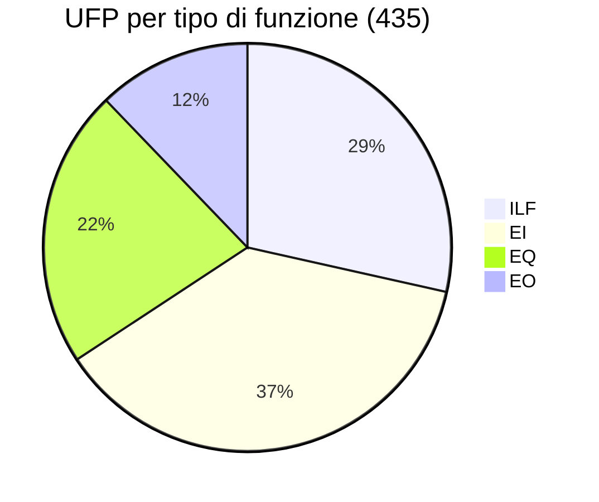
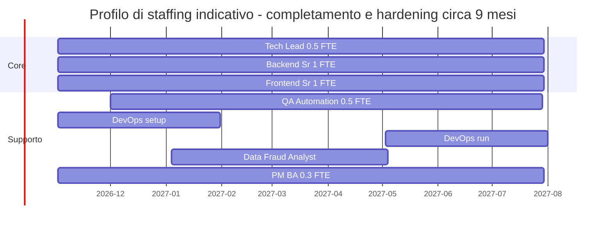

<!-- IMPACT-META
schema: 1
mode: how
step: 15_fp_cocomo
commit: fc7d820908b8b230fb47a2669920ba7efdb413a8
commit_short: fc7d820
branch: main
worktree: dirty
baseline_date: 2026-10-07T18:19:51+02:00
generated_at: 2026-10-08T09:34:49+02:00
-->
# FP & COCOMO II - Progetto LOSS_PREVENTION

> **Baseline commit:** `fc7d820` (`main`) · worktree `dirty` (modifiche locali solo in `Docs/` e `.github/`; codice applicativo identico al commit)

**Data**: 2026-10-08  
**Versione**: 1.1  
**Autori**: REVERSE how (IMPACT) · verifica IMPACT 2026-10-08  
**Audience**: Team tecnico, architetti, developer, PM, procurement

> **Scopo**: misurare la **dimensione funzionale** del sistema AS-IS e stimarne il **costo di (ri)costruzione** (valore di sostituzione, utile in una due diligence). L'effort per **completare** le funzionalità in sviluppo/pianificate e gli scenari di modernizzazione sono in [19_modernization_estimation_spec.md](19_modernization_estimation_spec.md).
>
> **Baseline** (identica a [14_metrics.md](14_metrics.md) §1.5): **19.774 SLOC logiche** (C# 10.143 + TS 3.868 + script Vue 5.395 + JS 368). Ipotesi economiche parametriche: 1 PM = 20 gg = 160 h; tariffa blended **400 €/gg** (8.000 €/PM). Tutti i calcoli sono stati rieseguiti in Python; arrotondamento half-up solo nella presentazione.

---

## Sezioni Principali

1. [Function Points Calculation](#1-function-points-calculation)
2. [Backfiring Method (LOC to FP)](#2-backfiring-method-loc-to-fp)
3. [COCOMO II Models (Organic, Semi-detached, Embedded)](#3-cocomo-ii-models-organic-semi-detached-embedded)
4. [Effort Estimation (Person-Months)](#4-effort-estimation-person-months)
5. [Duration Estimation (Calendar Months)](#5-duration-estimation-calendar-months)
6. [Cost Estimation](#6-cost-estimation)
7. [Team Mix Proposal](#7-team-mix-proposal)
8. [Staffing Profile](#8-staffing-profile)

---

## 1. Function Points Calculation

Il conteggio IFPUG (CPM 4.3, Unadjusted) dal codice dà **435 UFP**: 124 FP di dati (15 ILF, 0 EIF) e 311 FP transazionali (78 endpoint REST + 10 funzioni elaborate interamente nel browser). Ogni elemento è tracciato alla classe/collezione da cui deriva.

### 1.1 Regole di conteggio adottate

- **Confine applicativo**: API .NET + SPA Vue + MongoDB. Sono esterni: server SFTP (sorgente file), Ollama (servizio di elaborazione LLM), SMTP.
- **ILF**: ogni collezione MongoDB mantenuta dall'applicazione (15, da `MongoDbSettings` + `PasswordResetTokens` + `ProcessedFiles`). DET = proprietà dell'entità (o campi mappati per `ReportData`); RET = sotto-documenti/array strutturati.
- **EIF = 0**: i file SFTP vengono importati e memorizzati in `ReportData` → sono **EI**, non EIF; Ollama non mantiene un gruppo di dati referenziato dall'applicazione ma esegue elaborazioni → non è un EIF. *(La v1.0 contava 2 EIF × 5 = 10 FP.)*
- **Transazioni**: ogni endpoint FastEndpoints è un processo elementare: POST/PUT/PATCH/DELETE che modificano un ILF = **EI**; GET/POST di sola lettura senza dati derivati = **EQ**; letture con calcoli/aggregazioni o dati derivati = **EO**. `GET /rules/apply` è EI perché modifica `ReportData` e `Mappings`. `POST /users/login` è EQ (legge Users/Roles/Permissions e restituisce il token, nessun ILF aggiornato).
- **Funzioni solo FE**: elaborazioni che producono output derivati nel browser (NLQ, analisi statistica, export, grafici) sono conteggiate come EO/EQ/EI aggiuntive perché non passano da un endpoint dedicato.
- **Pesi IFPUG**: EI 3/4/6 · EO 4/5/7 · EQ 3/4/6 · ILF 7/10/15 · EIF 5/7/10 (Low/Average/High).
- **Matrici di complessità** (standard IFPUG):

| ILF/EIF | DET 1–19 | DET 20–50 | DET 51+ |
|---------|----------|-----------|---------|
| RET 1 | L | L | A |
| RET 2–5 | L | A | H |
| RET 6+ | A | H | H |

| EI | DET 1–4 | DET 5–15 | DET 16+ | | EO / EQ | DET 1–5 | DET 6–19 | DET 20+ |
|----|---------|----------|---------|---|---------|---------|----------|---------|
| FTR 0–1 | L | L | A | | FTR 0–1 | L | L | A |
| FTR 2 | L | A | H | | FTR 2–3 | L | A | H |
| FTR 3+ | A | H | H | | FTR 4+ | A | H | H |

- **VAF** non applicato (UFP = AFP; il fattore di aggiustamento è opzionale in ISO/IEC 20926).

### 1.2 ILF — Internal Logical Files (124 FP)

| # | ILF (collezione) | Entità / evidenza | DET | RET | Complessità | FP |
|---|------------------|-------------------|-----|-----|-------------|----|
| 1 | `ReportData` | documenti XML/CSV/JSON appiattiti; campi = 52 mapping nel dump `Mappings.bson` | 52 | 2 (transazione, `FraudFlags`) | High | 15 |
| 2 | `FraudDetectionSettings` | `FraudDetectionSettings.cs`: 24 classi, 118 proprietà, 22 blocchi di soglia | 118 | 22+ | High | 15 |
| 3 | `Workspaces` | Workspace → Tab → Query → Condition/Field | 27 | 5 | Average | 10 |
| 4 | `Dashboards` | `Dashboard` + layout widget | 14 | 2 | Low | 7 |
| 5 | `Users` | `User` (incl. `LockField`/`LockValue`, hash/salt) | 12 | 1 | Low | 7 |
| 6 | `Roles` | `Role` | 4 | 1 | Low | 7 |
| 7 | `Permissions` | `Permission` | 4 | 1 | Low | 7 |
| 8 | `PasswordResetTokens` | `PasswordResetService` (hash SHA-256, scadenza) | 7 | 1 | Low | 7 |
| 9 | `Mappings` | `MappingItem` (Name, Alias, DataType, IsVisible, IsLookup, …) | 14 | 1 | Low | 7 |
| 10 | `Rules` | `RuleConfiguration` | 10 | 1 | Low | 7 |
| 11 | `Groups` | `GroupDocument` | 6 | 1 | Low | 7 |
| 12 | `Notifications` | `NotificationDocument` (incl. risposte) | 11 | 1 | Low | 7 |
| 13 | `DataIngestionConfigurations` | sorgenti SFTP/cartella, formato, mapping | 19 | 1 | Low | 7 |
| 14 | `DataIngestionSchedules` | ricorrenza, ora, giorni | 12 | 1 | Low | 7 |
| 15 | `ProcessedFiles` | fileName, recordCount, processedAt | 3 | 1 | Low | 7 |
| | **Totale ILF** | 2 High + 1 Average + 12 Low | | | | **124** |

*(v1.0: `FraudDetectionSettings` Average → High (118 DET); `Dashboards` e `Users` Average → Low (DET < 20); totale 125 → 124.)*

### 1.3 Transazioni da endpoint (78 endpoint, 265 FP)

| # | Area | Endpoint (classe) | Metodo e path | Tipo | FTR / DET (motivazione) | Complessità | FP |
|---|------|-------------------|---------------|------|--------------------------|-------------|----|
| 1 | Dashboard | `CreateDashboardEndpoint` | `POST /dashboards` | EI | FTR 1 (Dashboards), DET 14 | Low | 3 |
| 2 | Dashboard | `DeleteDashboardEndpoint` | `DELETE /dashboards/{id}` | EI | FTR 1, DET 1 | Low | 3 |
| 3 | Dashboard | `GetDashboardEndpoint` | `GET /dashboards/{id}` | EQ | FTR 1, DET 14 | Low | 3 |
| 4 | Dashboard | `ListDashboardsEndpoint` | `GET /dashboards` | EQ | FTR 1, DET 14 | Low | 3 |
| 5 | Dashboard | `UpdateDashboardEndpoint` | `PUT /dashboards/{id}` | EI | FTR 1, DET 14 | Low | 3 |
| 6 | Data | `CreateTransactionEndpoint` | `POST /data/create-transactions` | EI | FTR 1 (ReportData), DET 16+ (XML appiattito) | Average | 4 |
| 7 | Data | `GetDistanceEndpoint` | `POST /distance` | EO | FTR 2 (ReportData, Mappings), DET 20+, dati derivati (distanza euclidea) | High | 7 |
| 8 | Data | `GetReportDataEndpoint` | `POST /data/report/query` | EO | FTR 2 (ReportData, Mappings), DET 20+, aggregazioni | High | 7 |
| 9 | DataIngestion | `ClearDataIngestionConfigurationEndpoint` | `DELETE /api/data-ingestion` | EI | FTR 1 | Low | 3 |
| 10 | DataIngestion | `ClearDataIngestionScheduleEndpoint` | `DELETE /api/data-ingestion/schedule` | EI | FTR 1 | Low | 3 |
| 11 | DataIngestion | `GetDataIngestionConfigurationEndpoint` | `GET /api/data-ingestion` | EQ | FTR 2 (Config, Schedule), DET 6-19 | Average | 4 |
| 12 | DataIngestion | `RunDataIngestionEndpoint` | `POST /api/data-ingestion/run` | EI | FTR 4 (Config, ReportData, Mappings, ProcessedFiles), DET 16+ | High | 6 |
| 13 | DataIngestion | `UpdateDataIngestionConfigurationEndpoint` | `PUT /api/data-ingestion` | EI | FTR 1, DET 19 (16+) | Average | 4 |
| 14 | DataIngestion | `UpdateDataIngestionScheduleEndpoint` | `PATCH /api/data-ingestion/schedule` | EI | FTR 1, DET 12 | Low | 3 |
| 15 | DataIngestion | `UpdateDataIngestionSourcesEndpoint` | `PATCH /api/data-ingestion/sources` | EI | FTR 1, DET <16 | Low | 3 |
| 16 | DataIngestion | `UpdateRecurrenceOptionsEndpoint` | `PUT /api/data-ingestion/recurrence-options` | EI | FTR 1, DET <16 | Low | 3 |
| 17 | FraudDetection | `CreateFraudDetectionSettingsEndpoint` | `POST /api/fraud-detection/settings` | EI | FTR 1, DET 118 (16+) | Average | 4 |
| 18 | FraudDetection | `GetFraudDetectionSettingsEndpoint` | `GET /api/fraud-detection/settings` | EQ | FTR 1, DET 20+ | Average | 4 |
| 19 | FraudDetection | `UpdateFraudDetectionSettingsEndpoint` | `PUT /api/fraud-detection/settings/{id}` | EI | FTR 1, DET 118 (16+) | Average | 4 |
| 20 | Groups | `AddMemberToGroupEndpoint` | `POST /groups/{groupId}/members/{userId}` | EI | FTR 2, DET 2 | Low | 3 |
| 21 | Groups | `CreateGroupEndpoint` | `POST /groups` | EI | FTR 1, DET 6 | Low | 3 |
| 22 | Groups | `DeleteGroupEndpoint` | `DELETE /groups/{id}` | EI | FTR 1 | Low | 3 |
| 23 | Groups | `GetGroupEndpoint` | `GET /groups/{id}` | EQ | FTR 1, DET 6 | Low | 3 |
| 24 | Groups | `ListGroupsEndpoint` | `GET /groups` | EQ | FTR 1, DET 6 | Low | 3 |
| 25 | Groups | `RemoveMemberFromGroupEndpoint` | `DELETE /groups/{groupId}/members/{userId}` | EI | FTR 1-2, DET 2 | Low | 3 |
| 26 | Groups | `UpdateGroupEndpoint` | `PUT /groups/{id}` | EI | FTR 1, DET 6 | Low | 3 |
| 27 | Mappings | `CreateMappingEndpoint` | `POST /data/mappings` | EI | FTR 1, DET 14 | Low | 3 |
| 28 | Mappings | `DeleteMappingEndpoint` | `DELETE /data/mappings/{id}` | EI | FTR 1 | Low | 3 |
| 29 | Mappings | `GetMappingsEndpoint` | `GET /data/mappings` | EQ | FTR 1, DET 14 | Low | 3 |
| 30 | Mappings | `UpdateMappingEndpoint` | `PUT /data/mappings/{id}` | EI | FTR 1, DET 14 | Low | 3 |
| 31 | Notifications | `CreateNotificationEndpoint` | `POST /notifications` | EI | FTR 1 (repository diretto), DET 11 | Low | 3 |
| 32 | Notifications | `DeleteNotificationEndpoint` | `DELETE /notifications/{id}` | EI | FTR 1 | Low | 3 |
| 33 | Notifications | `ListNotificationsEndpoint` | `GET /notifications` | EQ | FTR 1, DET 11 | Low | 3 |
| 34 | Notifications | `MarkAsReadEndpoint` | `PUT /notifications/{id}/read` | EI | FTR 1, DET 2 | Low | 3 |
| 35 | Notifications | `ReplyToNotificationEndpoint` | `POST /notifications/{id}/reply` | EI | FTR 1, DET <16 | Low | 3 |
| 36 | Rules | `ApplyRulesEndpoint` | `GET /rules/apply` | EI | Modifica ReportData (FraudFlags) e Mappings: FTR 3, DET 5-15 | High | 6 |
| 37 | Rules | `CreateRuleEndpoint` | `POST /rules` | EI | FTR 2 (Rules, Mappings), DET 10 | Average | 4 |
| 38 | Rules | `DeleteRuleEndpoint` | `DELETE /rules/{id}` | EI | FTR 3 (Rules, ReportData, Mappings), DET 1-4 | Average | 4 |
| 39 | Rules | `GetAllRulesEndpoint` | `GET /rules` | EQ | FTR 1, DET 10 | Low | 3 |
| 40 | Rules | `GetRuleByIdEndpoint` | `GET /rules/{id}` | EQ | FTR 1, DET 10 | Low | 3 |
| 41 | Rules | `UpdateRuleEndpoint` | `PUT /rules` | EI | FTR 2 (Rules, Mappings), DET 10 | Average | 4 |
| 42 | Permissions | `AddPermissionToRoleEndpoint` | `POST /permissions/add-permission` | EI | FTR 2, DET 2 | Low | 3 |
| 43 | Permissions | `CreatePermissionEndpoint` | `POST /permissions/create` | EI | FTR 1, DET 4 | Low | 3 |
| 44 | Permissions | `DeletePermissionEndpoint` | `DELETE /permissions/delete` | EI | FTR 1 | Low | 3 |
| 45 | Permissions | `GetAllPermissionsEndpoint` | `GET /permissions/all` | EQ | FTR 1, DET 4 | Low | 3 |
| 46 | Permissions | `GetPermissionByIdEndpoint` | `GET /permissions/by-id` | EQ | FTR 1, DET 4 | Low | 3 |
| 47 | Permissions | `GetPermissionByNameEndpoint` | `GET /permissions/by-name` | EQ | FTR 1, DET 4 | Low | 3 |
| 48 | Permissions | `GetRolePermissionsEndpoint` | `GET /permissions` | EQ | FTR 2, DET 1-5 | Low | 3 |
| 49 | Permissions | `RemovePermissionFromRoleEndpoint` | `DELETE /permissions` | EI | FTR 2, DET 2 | Low | 3 |
| 50 | Permissions | `UpdatePermissionEndpoint` | `PUT /permissions/update` | EI | FTR 1, DET 4 | Low | 3 |
| 51 | Permissions | `UserHasPermissionEndpoint` | `GET /permissions/user` | EQ | FTR 3, DET 1-5 | Low | 3 |
| 52 | Roles | `AddUserToRoleEndpoint` | `POST /roles/user` | EI | FTR 2, DET 2 | Low | 3 |
| 53 | Roles | `CreateRoleEndpoint` | `POST /roles` | EI | FTR 1, DET 4 | Low | 3 |
| 54 | Roles | `DeleteRoleEndpoint` | `DELETE /roles/delete` | EI | FTR 1 | Low | 3 |
| 55 | Roles | `GetAllRolesEndpoint` | `GET /roles/all` | EQ | FTR 1, DET 4 | Low | 3 |
| 56 | Roles | `GetRoleByIdEndpoint` | `GET /roles/by-id` | EQ | FTR 1, DET 4 | Low | 3 |
| 57 | Roles | `GetRoleByNameEndpoint` | `GET /roles/by-name` | EQ | FTR 1, DET 4 | Low | 3 |
| 58 | Roles | `GetUserRolesEndpoint` | `GET /users/roles` | EQ | FTR 2, DET 1-5 | Low | 3 |
| 59 | Roles | `RemoveRoleFromUserEndpoint` | `DELETE /roles/remove-role` | EI | FTR 2, DET 2 | Low | 3 |
| 60 | Roles | `UpdateRoleEndpoint` | `PUT /roles/update` | EI | FTR 1, DET 4 | Low | 3 |
| 61 | Roles | `UserIsInRoleEndpoint` | `GET /roles/is-in-role` | EQ | FTR 2, DET 1-5 | Low | 3 |
| 62 | Users | `CreateUserEndpoint` | `POST /users/create` | EI | FTR 2 (Users, Roles), DET 12 | Average | 4 |
| 63 | Users | `DeleteUserByIdEndpoint` | `DELETE /users/id/{UserId}` | EI | FTR 1 | Low | 3 |
| 64 | Users | `ForgotPasswordEndpoint` | `POST /users/forgot-password` | EI | FTR 2 (Users, PasswordResetTokens), DET 1-4 (+ e-mail) | Low | 3 |
| 65 | Users | `GetUserByIdEndpoint` | `GET /users/id/{Id}` | EQ | FTR 1, DET 12 | Low | 3 |
| 66 | Users | `GetUserByUsernameEndpoint` | `GET /users/username/{Username}` | EQ | FTR 1, DET 12 | Low | 3 |
| 67 | Users | `GetUserRolesPermissionEndpoint` | `GET /users/rolesandpermissions/{Id}` | EQ | FTR 3, DET 6-19 | Average | 4 |
| 68 | Users | `GetUsersEndpoint` | `GET /users` | EQ | FTR 1, DET 12 | Low | 3 |
| 69 | Users | `LoginEndpoint` | `POST /users/login` | EQ | FTR 3 (Users, Roles, Permissions), DET 6-19 | Average | 4 |
| 70 | Users | `ResetPasswordEndpoint` | `POST /users/reset-password` | EI | FTR 2, DET 1-4 | Low | 3 |
| 71 | Users | `UpdateUserEndpoint` | `POST /users/update` | EI | FTR 2 (Users, Roles), DET 12 | Average | 4 |
| 72 | Users | `ValidatePasswordEndpoint` | `POST /users/validatepassword` | EQ | FTR 1, DET 1-5 | Low | 3 |
| 73 | Users | `ValidateResetTokenEndpoint` | `POST /users/validate-reset-token` | EQ | FTR 1, DET 1-5 | Low | 3 |
| 74 | Workspaces | `CreateWorkspace` | `POST /workspaces` | EI | FTR 1, DET 27 (16+) | Average | 4 |
| 75 | Workspaces | `DeleteWorkspaceEndpoint` | `DELETE /workspaces/{id}` | EI | FTR 1 | Low | 3 |
| 76 | Workspaces | `GetAllWorkspacesEndpoint` | `GET /workspaces` | EQ | FTR 1, DET 27 (20+) | Average | 4 |
| 77 | Workspaces | `GetWorkspaceEndpoint` | `GET /workspaces/{id}` | EQ | FTR 1, DET 27 (20+) | Average | 4 |
| 78 | Workspaces | `UpdateWorkspaceEndpoint` | `PUT /workspaces/{id}` | EI | FTR 1, DET 27 (16+) | Average | 4 |
| | **Totale endpoint** | | | | | | **265** |

Subtotali per area: Dashboard 5 endpoint = 15 FP · Data 3 endpoint = 18 FP · DataIngestion 8 endpoint = 29 FP · FraudDetection 3 endpoint = 12 FP · Groups 7 endpoint = 21 FP · Mappings 4 endpoint = 12 FP · Notifications 5 endpoint = 15 FP · Rules 6 endpoint = 24 FP · Permissions 10 endpoint = 30 FP · Roles 10 endpoint = 30 FP · Users 12 endpoint = 40 FP · Workspaces 5 endpoint = 19 FP.

### 1.4 Funzioni elaborate solo nel frontend (10 funzioni, 46 FP)

| # | Funzione (evidenza) | Tipo | Complessità | FP | Motivazione |
|---|---------------------|------|-------------|----|-------------|
| 1 | NLQ → pipeline (aiStore.generateQuery, aiStore.ts:249) | EO | Average | 5 | Linguaggio naturale → pipeline Mongo via LLM; FTR Mappings + output pipeline |
| 2 | Generazione template report AI (aiStore.generateFraudReports, aiStore.ts:308) | EO | Average | 5 | Template di report generati da LLM sui campi mappati |
| 3 | Analisi statistica antifrode (aiStore.analyzeFraudInData/generateFraudRules, aiStore.ts:1535/1667) | EO | High | 7 | Statistiche, z-score, regole euristiche (30 tipologie) su ReportData + soglie: FTR ≥ 2, DET 20+ |
| 4 | Export CSV (resultsGrid.vue:1866) | EO | Low | 4 | Export dei risultati griglia |
| 5 | Export PDF (resultsGrid.vue:1922) | EO | Low | 4 | Export dei risultati griglia (pdfmake) |
| 6 | Export XLSX (resultsGrid.vue:1944) | EO | Low | 4 | Export dei risultati griglia (xlsx) |
| 7 | Heatmap + drill-down (heatmapPreview.vue:273/400) | EO | Average | 5 | Aggregazione per heatmap con drill-down |
| 8 | Grafici dashboard (chartblock.vue:69 buildPipeline) | EO | Average | 5 | Pipeline di aggregazione per i widget grafici |
| 9 | Export soglie antifrode JSON (FraudSettingsDialog.vue:528) | EQ | Low | 3 | Download delle soglie correnti, nessun dato derivato |
| 10 | Import soglie antifrode JSON (FraudSettingsDialog.vue:540-545) | EI | Average | 4 | Upload JSON che aggiorna FraudDetectionSettings (DET 16+, FTR 1) |
| | **Totale funzioni FE** | | | **46** | |

### 1.5 Riepilogo

| Tipo | Low | Average | High | N. elementi | FP |
|------|-----|---------|------|-------------|----|
| EI | 34 × 3 | 12 × 4 | 2 × 6 | 48 | 162 |
| EO | 3 × 4 | 4 × 5 | 3 × 7 | 10 | 53 |
| EQ | 24 × 3 | 6 × 4 | 0 | 30 | 96 |
| ILF | 12 × 7 | 1 × 10 | 2 × 15 | 15 | 124 |
| EIF | 0 | 0 | 0 | 0 | 0 |
| **UFP** | | | | **103** | **435** |

### 1.6 FP per modulo funzionale (usati dallo Strangler Fig in 19 §4.2)

| Modulo | Composizione | UFP |
|--------|--------------|-----|
| Identity | endpoint Users 40 + Roles 30 + Permissions 30 + ILF Users, Roles, Permissions, PasswordResetTokens 28 | 128 |
| Reporting | Dashboard 15 + `/data/report/query` 7 + Mappings 12 + Workspaces 19 + ILF ReportData, Mappings, Dashboards, Workspaces 39 + FE NLQ, template AI, export ×3, heatmap, grafici 32 | 124 |
| Fraud Analysis | Rules 24 + FraudDetection 12 + `/distance` 7 + ILF Rules, FraudDetectionSettings 22 + FE analisi statistica, export/import soglie 14 | 79 |
| Ingestion | DataIngestion 29 + `create-transactions` 4 + ILF DataIngestionConfigurations, DataIngestionSchedules, ProcessedFiles 21 | 54 |
| Notifications & Groups | Notifications 15 + Groups 21 + ILF Notifications, Groups 14 | 50 |
| **Totale** | | **435** |

---

## 2. Backfiring Method (LOC to FP)

Il backfiring converte le SLOC logiche in FP con i fattori LOC/FP della specifica di stima (tabella in [19_modernization_estimation_spec.md](19_modernization_estimation_spec.md) §1): **401,5 FP**, l'8,3% in meno del conteggio IFPUG.

| Linguaggio | Logical SLOC (cloc 2.10) | Fattore LOC/FP | FP |
|-----------|--------------------------|----------------|----|
| C# | 10.143 | 54 | 187,83 |
| TypeScript | 3.868 | 45 | 85,96 |
| Vue — solo `<script>` (TS) | 5.395 | 45 | 119,89 |
| JavaScript (script Mongo + `vite.config.js`) | 368 | 47 | 7,83 |
| Template/style Vue, CSS, HTML | 5.487 | ignorati | — |
| **Totale** | **19.774** | 49,25 (medio effettivo) | **401,51** |

$$FP_{backfiring} = \frac{10143}{54}+\frac{3868}{45}+\frac{5395}{45}+\frac{368}{47} = 401{,}51$$

**Riconciliazione**: UFP / backfiring = 435 / 401,51 = **1,083** (+8,3%). Intervallo di riferimento **402–435 FP**, valore centrale **≈ 418 FP**. Lo scostamento è fisiologico: il motore antifrode e le funzioni AI risiedono in pochi file molto densi (`aiStore.ts`), mentre i 78 endpoint CRUD sono numerosi ma brevi.

---

## 3. COCOMO II Models (Organic, Semi-detached, Embedded)

Si riportano i tre modi del COCOMO 81 base (classificazione richiesta) e il modello COCOMO II Post-Architecture, usato come stima di riferimento: **78,3 PM**.

### 3.1 COCOMO 81 base — tre modi

Formule: $PM = a \times KSLOC^{b}$, $TDEV = c \times PM^{d}$, con KSLOC = 19,774.

| Modo | a | b | c | d | PM | TDEV (mesi) | Staff medio | Applicabilità |
|------|---|---|---|---|----|-------------|-------------|---------------|
| Organic | 2,4 | 1,05 | 2,5 | 0,38 | **55,1** | 11,5 | 4,8 | ✅ Team piccolo, dominio noto, stack mainstream (CRUD, ingestion) |
| Semi-detached | 3,0 | 1,12 | 2,5 | 0,35 | **84,9** | 11,8 | 7,2 | ✅ Componenti analitiche (statistica antifrode, distanza, query builder) |
| Embedded | 3,6 | 1,20 | 2,5 | 0,32 | 129,3 | 11,8 | 10,9 | ❌ Nessun vincolo hardware/real-time stringente |

### 3.2 COCOMO II Post-Architecture (riferimento)

Formule: $PM = A \times KSLOC^{E} \times \prod EM_i$ con $E = B + 0{,}01 \times \sum SF_j$; $TDEV = C \times PM^{F}$ con $F = D + 0{,}2 \times (E - B)$. Costanti COCOMO II.2000: **A = 2,94, B = 0,91, C = 3,67, D = 0,28**.

| Scale factor | Livello | Valore | Motivazione |
|--------------|---------|--------|-------------|
| PREC (precedentedness) | Nominal | 3,72 | Dominio retail loss prevention noto, ma motore statistico nuovo |
| FLEX (development flexibility) | Nominal | 3,04 | Requisiti di prodotto, nessun vincolo contrattuale rigido noto |
| RESL (architecture/risk resolution) | Nominal | 4,24 | Architettura a livelli definita; rischi (sicurezza, performance) non risolti |
| TEAM (team cohesion) | Nominal | 3,29 | N/A — non ricavabile dal codice; assunto nominale |
| PMAT (process maturity) | Nominal | 4,68 | Nessuna evidenza di processo maturo (0 test, 0 CI), né di processo assente |
| **ΣSF** | | **18,97** | |

| Effort multiplier | Valore | Motivazione |
|-------------------|--------|-------------|
| RELY, DATA, CPLX, RUSE, DOCU, TIME, STOR, PVOL, ACAP, PCAP, PCON, APEX, PLEX, LTEX, TOOL, SITE, SCED (17) | 1,00 (Nominal) | Affidabilità: perdita economica recuperabile; complessità: gestione dati + euristiche; nessuna evidenza per scostarsi dal nominale |
| **ΠEM** | **1,00** | |

| Grandezza | Calcolo | Risultato |
|-----------|---------|-----------|
| E | 0,91 + 0,01 × 18,97 | **1,0997** |
| KSLOC^E | 19,774^1,0997 | 26,627 |
| PM | 2,94 × 26,627 × 1,00 | **78,28 PM** |
| F | 0,28 + 0,2 × (1,0997 − 0,91) | **0,31794** |
| TDEV | 3,67 × 78,28^0,31794 | **14,68 mesi** |
| Staff medio | 78,28 / 14,68 | **5,33 FTE** |

---

## 4. Effort Estimation (Person-Months)

Le stime vanno da 35 PM (produttività media per FP, "as-built") a 78 PM (COCOMO II, prodotto realizzato con standard industriali completi).

| Metodo | Base | Effort | Note |
|--------|------|--------|------|
| PDR 14 h/FP | 401,51 FP (backfiring) | 5.621 h = 702,6 gg = **35,1 PM** | Benchmark industry medio |
| PDR 14 h/FP | 435 UFP (IFPUG) | 6.090 h = 761,3 gg = **38,1 PM** | |
| COCOMO 81 Organic | 19,774 KSLOC | **55,1 PM** | |
| COCOMO 81 Semi-detached | 19,774 KSLOC | **84,9 PM** | |
| **COCOMO II Post-Arch.** | 19,774 KSLOC, nominale | **78,3 PM** | Riferimento: include test, documentazione e processo completi |

Il sistema attuale **non** include test, CI/CD, hardening né documentazione tecnica allineata: l'effort realmente speso è plausibilmente vicino alla stima PDR (35–38 PM). Effort storico effettivo: N/A — non ricavabile dal codice (13 commit, nessun metadato di effort).

---

## 5. Duration Estimation (Calendar Months)

| Metodo | Durata | Staff medio |
|--------|--------|-------------|
| COCOMO II | **14,7 mesi** | 5,3 FTE |
| COCOMO 81 Organic | 11,5 mesi | 4,8 FTE |
| COCOMO 81 Semi-detached | 11,8 mesi | 7,2 FTE |
| PDR 401,5 FP con team di 3 FTE | 35,1 / 3 = **11,7 mesi** | 3 FTE |
| PDR 435 FP con team di 3 FTE | 38,1 / 3 = **12,7 mesi** | 3 FTE |

---

## 6. Cost Estimation

| Scenario | PM | Costo (8.000 €/PM) |
|----------|----|--------------------|
| Valore di ricostruzione "as-built" (PDR, 401,5 FP) | 35,1 | **≈ 281,1 k€** |
| Valore di ricostruzione "as-built" (PDR, 435 UFP) | 38,1 | ≈ 304,5 k€ |
| COCOMO 81 Organic | 55,1 | ≈ 440,8 k€ |
| Prodotto equivalente "industrial grade" (COCOMO II) | 78,3 | **≈ 626,3 k€** |
| COCOMO 81 Semi-detached | 84,9 | ≈ 678,9 k€ |

**Intervallo di valore di sostituzione: 0,28 – 0,63 M€** (PDR backfiring – COCOMO II). La tariffa è parametrica: costo = PM × 20 gg × tariffa giornaliera.

---

## 7. Team Mix Proposal

Il team proposto per evoluzione/completamento (vedi 19 §7) è di circa 3,9 FTE, con competenze dettate dagli hotspot del codice.

| Ruolo | FTE | Competenze | Motivazione nel codice |
|-------|-----|-----------|------------------------|
| Tech Lead / Architect .NET | 0,5 | FastEndpoints, MongoDB aggregation, sicurezza | Pipeline Mongo arbitraria, JWT, lock di riga |
| Senior Backend .NET | 1,0 | Porting motore statistico, rule engine, job | `RulesService`, `MappingService`, `FileProcessingCoordinator` |
| Senior Frontend Vue | 1,0 | Refactoring `resultsGrid.vue` (2.271 righe) / `aiStore.ts` (1.994 righe), test | CCN 87 in `buildGenericFraudRuleTemplates` |
| Data / Fraud Analyst | 0,3 | Validazione euristiche e soglie su dati reali | 30 tipologie euristiche, 22 blocchi di soglia |
| QA Automation | 0,5 | xUnit/Testcontainers, Vitest, Playwright | 0 test |
| DevOps | 0,3 | CI/CD, container, cloud | nessuna pipeline né Dockerfile |
| PM / BA | 0,3 | Backlog, requisiti case management/multi-tenancy | voci Planned senza requisiti |
| **Totale** | **3,9** | | |

---

## 8. Staffing Profile

Profilo indicativo per ~9 mesi di completamento + hardening (Scenario C di 19): core team costante, supporto a picchi.

---

## Reference Documents

- **Deep Dive Analysis**: [00_deep_dive.md](00_deep_dive.md)
- **Context**: [01_context.md](01_context.md)
- **Functional Overview**: [02_functional_overview.md](02_functional_overview.md)
- **Non-Functional Overview**: [03_non_functional_overview.md](03_non_functional_overview.md)
- **Constraints**: [04_constraints.md](04_constraints.md)
- **Principles**: [05_principles.md](05_principles.md)
- **Software Architecture**: [06_software_architecture.md](06_software_architecture.md)
- **Code**: [07_code.md](07_code.md)
- **Data**: [08_data.md](08_data.md)
- **Infrastructure Architecture**: [09_infrastructure_architecture.md](09_infrastructure_architecture.md)
- **Deployment**: [10_deployment.md](10_deployment.md)
- **Development Environment**: [11_development_environment.md](11_development_environment.md)
- **Operation and Support**: [12_operation_and_support.md](12_operation_and_support.md)
- **Decision Log**: [13_decision_log.md](13_decision_log.md)
- **Metrics**: [14_metrics.md](14_metrics.md)
- Documento successivo: [19_modernization_estimation_spec.md](19_modernization_estimation_spec.md)

---

## Change Log

| Versione | Data | Autore | Modifiche |
|----------|------|--------|-----------|
| 1.0 | 2026-10-07 | REVERSE how (FULL) | Creazione documento (sostituisce run 2026-10-05) |
| 1.1 | 2026-10-08 | IMPACT verify | Conteggio IFPUG reso tracciabile (15 ILF con DET/RET, 78 endpoint e 10 funzioni FE classificati con FTR/DET, matrici e pesi): UFP ≈486→435 (EIF 10→0, ILF 125→124, EI 174→162, EQ 112→96, EO 65→53); backfiring 406→401,5 (script Vue 5.600→5.395); KSLOC 19,98→19,774; COCOMO II 79,2→78,3 PM, 634→626 k€, staff 5,4→5,3; PDR 35,5→35,1 PM / 284→281 k€; aggiunti COCOMO 81 a tre modi con numeri, tabelle scale factor/effort multiplier e costanti, FP per modulo; gantt staffing con date valide; Reference Documents completi |
