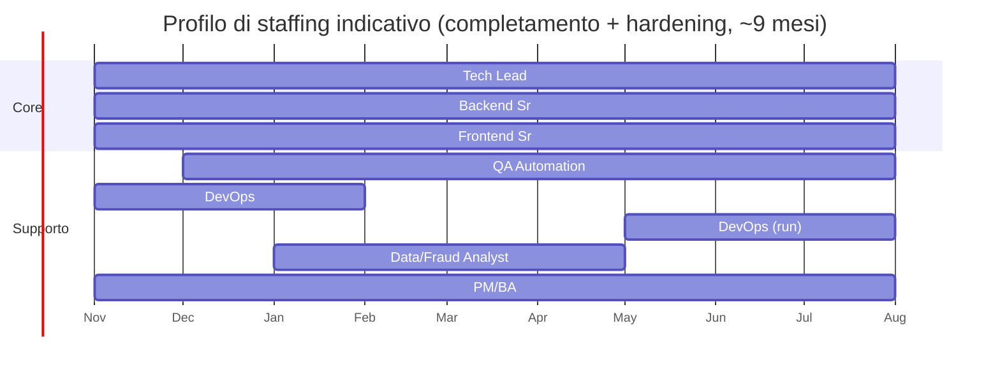

<!-- REVERSE-META
schema: 1
mode: how
step: 15_fp_cocomo
commit: 593f6decec3a642d5567754dd795b19560bb0afb
commit_short: 593f6de
branch: main
worktree: clean
baseline_date: 2026-10-05T10:14:05+00:00
generated_at: 2026-10-07T14:40:00Z
-->
# FP & COCOMO II - Progetto LOSS_PREVENTION

> **Baseline commit:** `593f6de` (`main`) · worktree `clean`

**Data**: 2026-10-07 · **Versione**: 1.0 · **Autori**: REVERSE how · **Audience**: PM, architetti, procurement

> **Scopo**: stimare la **dimensione funzionale** e il **costo di (ri)costruzione** del sistema AS-IS. È un indicatore del valore di sostituzione del software, utile in una due diligence. L'effort per **completare** le funzionalità in sviluppo/pianificate è nel documento 19 (Modernization Estimation) §7.

Ipotesi economiche (parametri modificabili): 1 PM = 20 giorni-uomo = 160 h; tariffa blended **400 €/gg** (8.000 €/PM).

---

## 1. Function Points Calculation (IFPUG, approssimazione da codice)

Conteggio derivato da collezioni (ILF), integrazioni (EIF) ed endpoint/funzioni UI (EI/EO/EQ). VAF = 1,00 (non calcolato).

| Tipo | Elementi | Complessità ipotizzata | FP |
|------|----------|------------------------|----|
| **ILF** | `ReportData` (alta) | 1 × 15 | 15 |
| | `FraudDetectionSettings`, `Workspaces`, `Dashboards`, `Users` (media) | 4 × 10 | 40 |
| | `Mappings`, `Rules`, `Roles`, `Permissions`, `PasswordResetTokens`, `Groups`, `Notifications`, `DataIngestionConfigurations`, `DataIngestionSchedules`, `ProcessedFiles` (bassa) | 10 × 7 | 70 |
| **EIF** | SFTP/File source, LLM Ollama | 2 × 5 | 10 |
| **EI** | 47 endpoint di scrittura (14 DELETE × 3 + 33 POST/PUT/PATCH × 4) | | 174 |
| **EQ** | 26 GET + validate password + validate reset token (28 × 4) | | 112 |
| **EO** | Report query (7), distance (7), apply rules (7), NLQ (6), AI report templates (6), analisi statistica (7), export CSV/XLSX/PDF (3 × 5), heatmap drill-down (5), chart dashboard (5) | | 65 |
| **Totale UFP** | | | **≈ 486** |

## 2. Backfiring Method (LOC → FP)

| Linguaggio | Logical SLOC | Fattore LOC/FP | FP |
|-----------|--------------|----------------|----|
| C# | 10.143 | 54 | 187,8 |
| TypeScript | 3.868 | 45 | 86,0 |
| Vue (solo `<script>`, TS) | 5.600 | 45 | 124,4 |
| JavaScript (script Mongo) | 368 | 47 | 7,8 |
| Template Vue / CSS / HTML | 5.448 | ignorati | — |
| **Totale FP AS-IS** | | | **≈ 406** |

Scostamento IFPUG vs backfiring: +20% (486 vs 406) → **intervallo di riferimento 406–486 FP**, valore centrale ~445 FP.

## 3. COCOMO II Models

Formula post-architecture: `PM = 2,94 × KSLOC^E × ΠEM`, `TDEV = 3,67 × PM^(0,28 + 0,2·(E − 0,91))`.

| Parametro | Valore | Motivazione |
|-----------|--------|-------------|
| KSLOC | 19,98 | C# + TS + script Vue + JS (template/stili esclusi) |
| Scale factors ΣSF | 18,97 (nominali) | Nessuna evidenza di processo maturo |
| E | 1,0997 | 0,91 + 0,01 × 18,97 |
| EM (RELY, CPLX, …) | 1,00 | Nominali (affidabilità: perdita economica recuperabile; complessità: gestione dati + euristiche) |

| Modello (classificazione COCOMO 81 di riferimento) | Applicabilità |
|---------------------------------------------------|---------------|
| Organic | ✅ Team piccolo, dominio noto, stack mainstream |
| Semi-detached | ✅ Parti analitiche (statistica, similarity) |
| Embedded | ❌ Nessun vincolo hard real-time |

## 4. Effort Estimation (Person-Months)

| Metodo | Effort | Note |
|--------|--------|------|
| PDR 14 h/FP × 406 FP | 5.684 h = **35,5 PM** (711 gg) | Benchmark industry medio |
| PDR 14 h/FP × 486 FP | 6.804 h = **42,5 PM** (851 gg) | Con conteggio IFPUG |
| COCOMO II (19,98 KSLOC nominale) | **79,2 PM** | Include overhead di processo, test e documentazione completi (oggi assenti) |

Il sistema attuale **non** include test, CI/CD, hardening e documentazione tecnica allineata: l'effort realmente speso dal fornitore è plausibilmente vicino alla stima PDR (35–43 PM); la stima COCOMO rappresenta il costo di un prodotto equivalente **realizzato con standard industriali completi**.

## 5. Duration Estimation (Calendar Months)

| Metodo | Durata | Staff medio |
|--------|--------|-------------|
| COCOMO II | **14,7 mesi** | 5,4 FTE |
| PDR (team 3 FTE) | ~12 mesi | 3 FTE |

## 6. Cost Estimation

| Scenario | PM | Costo (8.000 €/PM) |
|----------|----|--------------------|
| Valore di ricostruzione "as-built" (PDR, 406 FP) | 35,5 | **≈ 284 k€** |
| Valore di ricostruzione "as-built" (PDR, 486 FP) | 42,5 | ≈ 340 k€ |
| Prodotto equivalente "industrial grade" (COCOMO II) | 79,2 | **≈ 634 k€** |

**Intervallo di valore di sostituzione: 0,28 – 0,63 M€.**

## 7. Team Mix Proposal (per evoluzione/completamento)

| Ruolo | FTE | Competenze |
|-------|-----|-----------|
| Tech Lead / Architect .NET | 0,5 | FastEndpoints, MongoDB aggregation, sicurezza |
| Senior Backend .NET | 1,0 | Porting motore statistico, rule engine, job |
| Senior Frontend Vue | 1,0 | Refactoring `resultsGrid`/`aiStore`, test |
| Data/Fraud Analyst | 0,3 | Validazione euristiche e soglie su dati reali |
| QA Automation | 0,5 | xUnit/Testcontainers, Vitest, Playwright |
| DevOps | 0,3 | CI/CD, container, Azure |
| PM/BA | 0,3 | Backlog, requisiti case management/multi-tenancy |

## 8. Staffing Profile

---

## Reference Documents
- 14_metrics.md · 19_modernization_estimation_spec.md

## Change Log

| Versione | Data | Autore | Modifiche |
|----------|------|--------|-----------|
| 1.0 | 2026-10-07 | REVERSE how (FULL) | Creazione documento (sostituisce run 2026-10-05) |
