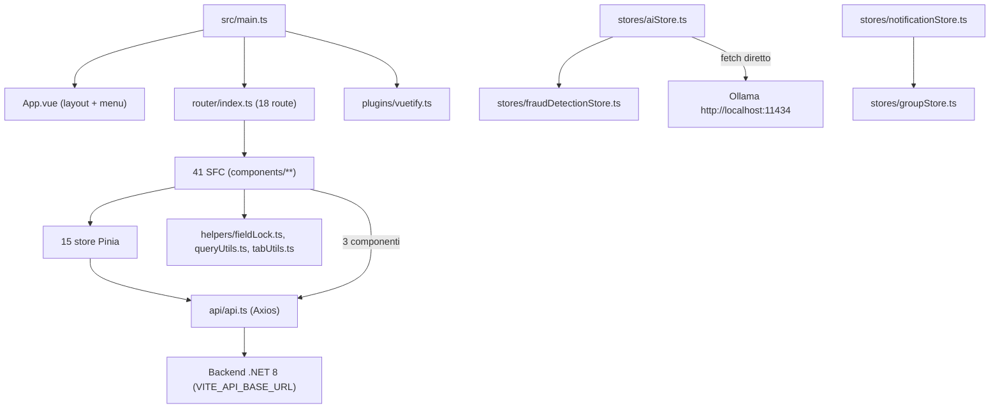
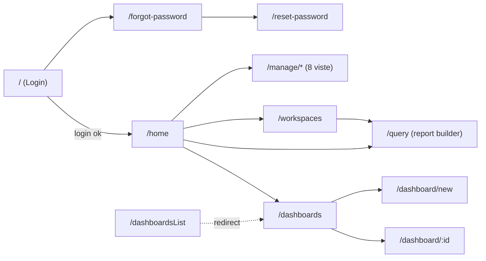
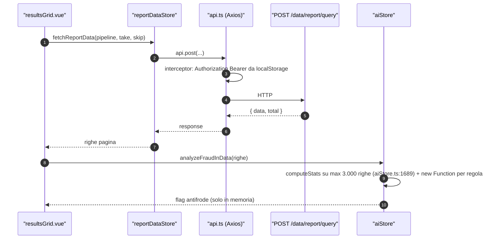

<!-- IMPACT-META
schema: 1
mode: how
step: 16_frontend_deep_assessment
commit: fc7d820908b8b230fb47a2669920ba7efdb413a8
commit_short: fc7d820
branch: main
worktree: dirty
baseline_date: 2026-10-07T18:19:51+02:00
generated_at: 2026-10-08T09:41:25+02:00
-->
# Frontend Deep Assessment - Progetto LOSS_PREVENTION

> **Baseline commit:** `fc7d820` (`main`) · worktree `dirty` (modifiche locali solo in `Docs/` e `.github/`; codice applicativo identico al commit)

**Data**: 2026-10-08 · **Versione**: 1.1 · **Autori**: REVERSE how / IMPACT verify · **Audience**: Frontend Architect, Tech Lead, Senior Frontend Developer

> **Adattamento del prompt (Angular → Vue 3).** Il prompt di riferimento è scritto per Angular/Micro Frontend; il frontend analizzato (`LossPrevention.UI/`) è una SPA **Vue 3 + Vite 6 + Vuetify 3 + Pinia**. Ogni requisito è stato mappato sull'equivalente Vue; dove non esiste un equivalente è indicato `N/A per stack Vue: <motivo>`.

| Concetto Angular nel prompt | Equivalente analizzato in questo progetto |
|---|---|
| Module Federation / remote modules | Nessuno: SPA monolitica, unico entry `src/main.ts` |
| `angular.json`, Angular CLI | `vite.config.js`, `package.json` scripts, `tsconfig.json` |
| NgRx Store / selectors / effects | Pinia (`defineStore`), getter, action asincrone |
| RxJS, `takeUntil`, `async` pipe | N/A per stack Vue: RxJS non è dipendenza; equivalente = cleanup in `onBeforeUnmount`, `watch` stop handle |
| `ChangeDetectionStrategy.OnPush`, Zone.js | Reattività Vue (Proxy), `markRaw`/`shallowRef`; Zone.js N/A |
| `@Input`/`@Output`, `EventEmitter` | `defineProps` / `defineEmits` |
| `*ngFor trackBy` | `v-for` + `:key` |
| CDK Virtual Scroll | Virtual scrolling manuale / AG Grid row virtualization |
| AuthGuard / CanActivate | `router.beforeEach` (vue-router 4) |
| Keycloak Angular adapter | Autenticazione custom: JWT emesso da `POST /users/login` del backend .NET |
| `DomSanitizer` | Escape automatico dei template Vue; rischio solo con `v-html`/`eval` |
| Angular Material theming | Tema Vuetify (`src/plugins/vuetify.ts`) |
| Jasmine/Karma, Protractor/Cypress | Nessun framework di test presente (target suggerito: Vitest + Playwright) |

---

## Executive Summary

Il frontend è una SPA Vue 3 funzionalmente ricca (report builder, dashboard, motore antifrode statistico lato client, integrazione LLM), ma **non compilabile su Linux**, priva di test/lint/type-check e con logica di sicurezza e di business eseguita nel browser. La salute complessiva è **3,4 / 10**.

### Overall Health Score: **3,4 / 10**

Derivazione: media aritmetica semplice (pesi uguali) degli 11 punteggi di dimensione, ciascuno 0–10 e motivato con evidenze nelle sezioni indicate.

| # | Dimensione (sezione) | Voto | Evidenza principale |
|---|---|---|---|
| D1 | Architettura & routing (§1) | 5 | SPA a layer semplice; 18 route statiche senza lazy loading; guard solo `requiresAuth` (`router/index.ts:56-70`) |
| D2 | State management (§2) | 5 | 15 store Pinia coerenti; `aiStore.ts` 1.994 righe; stato antifrode solo in memoria |
| D3 | Component architecture, template & styling (§3) | 5 | 41 SFC, `<script setup>` in 39/41; god component `resultsGrid.vue` 2.271 righe |
| D4 | Services & HTTP (§4) | 5 | Un client Axios con interceptor request; nessun interceptor di risposta/retry; `fetch` diretto a Ollama |
| D5 | Security (§5) | 2 | `eval` (`resultsGrid.vue:1377`), `new Function` (`aiStore.ts:1769`), lock e permessi decisi dal client, JWT in `localStorage` e loggato (`App.vue:292`) |
| D6 | Performance (§6) | 4 | Bundle JS unico 5.726,55 kB (2.028,16 kB gzip); listener non rimosso (`resultsGrid.vue:635`); `markRaw` e virtual scroll presenti |
| D7 | Testing (§7) | 0 | Nessun test unit/component/E2E |
| D8 | Build & deployment (§8) | 2 | `npm ci` fallisce (lock non sincronizzato); 12 import con case errato non risolvibili su FS case-sensitive (+ import irrisolvibile nell'orfano `ScheduleForm.vue`); nessun type-check in build |
| D9 | Accessibility (§9) | 3 | 1 solo attributo `aria-*` in tutto `src/`; `lang="en"` su UI; base Vuetify accessibile |
| D10 | Developer experience (§10) | 3 | `strict: true` ma 336 `: any`; nessun ESLint/Prettier; README template Vite |
| D11 | Third-party dependencies (§11) | 3 | 71 vulnerabilità npm (6 critical, 46 high); 6 dipendenze runtime/dev inutilizzate |

**Calcolo**: (5 + 5 + 5 + 5 + 2 + 4 + 0 + 2 + 3 + 3 + 3) / 11 = 37 / 11 = **3,36 → 3,4 / 10**.

> Nota di versione: la v1.0 riportava 4,5/10 senza derivazione; il valore è stato ricalcolato con la scorecard sopra.

**Top 3 Issues**
1. 🔴 **Sicurezza nel client** — `eval(expr)` su espressioni di campi calcolati salvate nei workspace (`components/reports/resultsGrid.vue:1377`) + JWT in `localStorage` (`api/api.ts:11`, `stores/loginStore.ts:92-93`) ⇒ XSS persistente con furto del token; row-level lock applicato solo dal browser (`helpers/fieldLock.ts:1-48`).
2. 🔴 **Build non riproducibile** — `npm ci` fallisce (`EUSAGE`, lock non sincronizzato con `package.json`) e 12 import con maiuscole/minuscole errate + 1 import inesistente (`ScheduleForm.vue:27`) rendono la build impossibile su Linux/macOS: nessuna pipeline CI/container è attivabile.
3. 🟠 **Logica di business nel browser** — motore antifrode statistico e generazione regole in `stores/aiStore.ts` (1.994 righe, `buildGenericFraudRuleTemplates` CCN 87) eseguiti con `new Function` (`aiStore.ts:1769`), risultati non persistiti né auditabili; LLM raggiunto direttamente su `http://localhost:11434` (`aiStore.ts:88`).

**Top 3 Recommendations**
1. ✅ Eliminare `eval`/`new Function` (parser di espressioni whitelisted) e spostare lock/permessi/analisi antifrode sul backend — chiude le vulnerabilità critiche (vedi FE-TD3, FE-TD4, FE-TD1).
2. ✅ Ripristinare una build riproducibile: correggere i 12 import con case errato (e `ScheduleForm.vue`), rigenerare `package-lock.json`, aggiungere `vue-tsc --noEmit` + ESLint allo script di build — sblocca CI/CD Linux (FE-TD8, FE-TD6).
3. ✅ Bonificare le dipendenze: rimuovere le 6 inutilizzate (incluse `jspdf`/`jspdf-autotable` critical e `nuxt`), aggiornare `axios`/`vite`/`vue`, sostituire `xlsx` 0.18.5 — riduce drasticamente le 71 vulnerabilità (FE-TD5).

### Metrics Snapshot

| Metrica | Attuale | Target | Stato |
|---|---|---|---|
| Bundle JS iniziale | 5.726,55 kB (2.028,16 kB gzip), 1 chunk | < 1 MB gzip iniziale, chunk per route | 🔴 |
| CSS | 1.095,06 kB (163,75 kB gzip) | < 300 kB | 🔴 |
| FCP / LCP / TTI / CLS | N/A — non misurati (nessun ambiente deployato, Lighthouse non eseguibile) | < 1,8 s / < 2,5 s / < 3,8 s / < 0,1 | ⚪ |
| Test coverage | 0 % (nessun test) | > 60 % | 🔴 |
| WCAG score | N/A — nessun audit automatico eseguibile senza ambiente; 1 attributo `aria-*` nel codice | > 95 % | 🔴 (qualitativo) |
| Vulnerabilità npm | 71 (6 C / 46 H / 15 M / 4 L) | 0 C/H | 🔴 |
| Build su Linux | ❌ (12 import con case errato) | ✅ | 🔴 |
| Funzioni con CCN > 15 | 14 (max 87) | 0 | 🟠 |

---

## 1. Architettura Micro Frontend

L'applicazione **non** è un micro frontend: è una SPA monolitica Vue 3 con un solo entry point e un solo bundle. Le richieste del prompt su Module Federation sono quindi riportate come N/A, mentre routing e bundle sono analizzati sull'unica applicazione.

### 1.1 Module Federation Analysis

- **Identificazione moduli**: N/A per stack Vue: nessuna configurazione Module Federation (nessun `@originjs/vite-plugin-federation` o `ModuleFederationPlugin`; `vite.config.js` registra solo `@vitejs/plugin-vue` e l'alias `@`). Unico "host" = `src/main.ts`:

```ts
// src/main.ts
const app = createApp(App);
app.use(createPinia());
app.use(router);
app.use(vuetify); // Use Vuetify
app.use(ToastPlugin); // Use Toast notifications
app.mount("#app");
```

- **Meta-framework dichiarato ma non usato**: `nuxt.config.ts` (sintassi Nuxt 2 `buildModules`, `ssr: true`) e le dipendenze `nuxt` 3.17.3 / `@nuxt/devtools` 1.7.0 sono presenti, ma nessun file importa `nuxt` e gli script sono `vite`/`vite build`/`vite preview`. Il `README.md` di root e la documentazione storica del fornitore dichiarano "Nuxt 3 SSR" (es. `Docs/01_EXECUTIVE_OVERVIEW.md:66` e `Docs/07_FRONTEND_ARCHITECTURE.md:23,836` — documentazione fornitore **presente solo nel commit `593f6de`, rimossa in `d768cd9`**; consultabile con `git show 593f6de:customspa-it-loss-prevention-d098a8b97860/Docs/07_FRONTEND_ARCHITECTURE.md` eseguito da `C:\repository\LOSS_PREVENTION`): l'affermazione è **falsa** al baseline.
- **Shared dependencies / versioning**: N/A per stack Vue (nessun remote); tutte le librerie sono nel bundle unico.
- **Dependency graph interno** (layer, verificato sugli import): `components → stores → api/api.ts → backend`; `aiStore.ts:3` importa `fraudDetectionStore`; `notificationStore.ts:3` importa `groupStore`. Grafo store/helper/api **aciclico** (verifica manuale degli import di `stores/`, `helpers/`, `api/`, `router/`; `madge` non applicabile agli SFC: il parser fallisce sui template).



- **Bundle size analysis** (build eseguita il 2026-10-08 su copia Windows del sorgente, `npm install` + `vite build`, Vite 6.4.1, Node 22.14.0): 705 moduli trasformati, **un solo chunk JS** `index-*.js` 5.726,55 kB (gzip 2.028,16 kB), CSS 1.095,06 kB (gzip 163,75 kB), font MDI woff2 403 kB / woff 588 kB / ttf 1,3 MB / eot 1,3 MB; tempo di build 1 min 04 s; Vite segnala `Use of eval ... is strongly discouraged` (resultsGrid.vue). Lazy chunks: 0. Shared vs duplicated code: N/A (un solo chunk). Vendor bundle: non separato (nessun `manualChunks`). Tree-shaking: limitato da `import * as components from "vuetify/components"` e `* as directives` (`plugins/vuetify.ts:3-4`, registra **tutti** i componenti Vuetify) e da `ModuleRegistry.registerModules([AllCommunityModule])` di AG Grid (`main.ts:12-13`).

### 1.2 Routing Architecture

Il routing è centralizzato in `src/router/index.ts` (72 righe) con `createWebHistory()`; protegge solo l'autenticazione, non l'autorizzazione.

- **Root routing**: **18 entry** in `routes` (17 con componente + 1 redirect `/dashboardsList` → `dashboards-list`, riga 30). Pubbliche: `/`, `/forgot-password`, `/reset-password`; tutte le altre `meta.requiresAuth: true`. Nessuna route catch-all 404.
- **Lazy loading**: assente — tutte le 16 viste sono importate staticamente (`router/index.ts:2-17`).
- **Route guard**: unico `router.beforeEach` (`router/index.ts:56-70`) che chiama `loginStore.validateToken()` e reindirizza a `login` se `requiresAuth && !isLoggedIn`. **Nessun controllo di permesso per route**: un utente autenticato privo di `CAN_*` può aprire `/manage/users` digitando l'URL (il backend risponde 403 sulle API, ma la vista viene montata).
- **Menu vs permessi**: il menu in `App.vue` è filtrato da `hasPermission()` (`App.vue:282-311`) che decodifica il JWT dal `localStorage`; i computed `canManageUsers`/`canViewPermissions`/`canViewRoles`/`canManageGroups` (`App.vue:314-340`) usano anche `CAN_ADD_USERS`, `CAN_DELETE_USERS`, `CAN_UPDATE_USERS`, che **nessun endpoint richiede** (esistono solo negli script seed `Data/MongoDBScripts/*.js`): visibilità del menu non allineata all'autorizzazione reale. L'attività era prevista dalla roadmap del fornitore ("API - Permissions - Review - Ensure all are correct and present. Remove features that the user does not have access to on the UI.", `Docs/roadmap.txt:44` — **presente solo nel commit `593f6de`, rimosso in `d768cd9`**; `git show 593f6de:customspa-it-loss-prevention-d098a8b97860/Docs/roadmap.txt`).
- **Deep linking**: supportato (history mode, route parametriche `/dashboard/:id` con `props: true`); richiede rewrite lato web server verso `index.html` (non configurato nel repo).
- **Navigation flow**:



- **Back navigation**: gestita nativamente da vue-router; `dashboard.vue:444-448` registra/rimuove un handler `beforeunload` per modifiche non salvate (nessun `onBeforeRouteLeave`).

## 2. State Management

Lo stato è gestito con **Pinia** (15 store, 12 in Options API e 3 in Setup API, 4.445 righe totali) secondo il flusso `componente → action dello store → api.ts → backend`. Il punto critico è `aiStore.ts`, che concentra LLM, statistica e regole, e la persistenza affidata a `localStorage`.

### 2.1 State Architecture

| Store | Righe | Stile | Responsabilità | Note |
|---|---|---|---|---|
| `aiStore.ts` | 1.994 | Options | LLM (Ollama), NLQ, classificazione campi, statistica, generazione/esecuzione regole antifrode | God store; `MODEL = "qwen2.5:14b"` riga 8 |
| `fraudDetectionStore.ts` | 728 | Options | Soglie antifrode, metadati frodi, cache regole | `DEFAULT_FRAUD_THRESHOLDS` (riga 177) definiti **solo** nel FE: l'entità backend `FraudDetectionSettings` non ha default |
| `dataIngestionStore.ts` | 275 | Options | Configurazione ingestione | `save` CCN 36 (righe 164-228) |
| `notificationStore.ts` | 259 | Options | Notifiche, permessi notifiche | Decodifica JWT lato client (righe 47-66) |
| `loginStore.ts` | 150 | Setup | JWT, scadenza, logout automatico | Legge `response.data?.token?.result` (riga 78) |
| `groupStore.ts` | 145 | Options | Gruppi | — |
| `rolestore.ts` | 133 | Options | Ruoli | Nome file minuscolo, importato come `roleStore` |
| `userStore.ts` | 114 | Options | Utenti | Importa `axios` direttamente (riga 4) oltre a `api` |
| `reportDataStore.ts` | 104 | Options | Query report, distance | — |
| `workspacestore.ts` | 102 | Setup | Workspace attivo | `activeWorkspaceId` in `localStorage` (righe 74, 79) |
| `permissionStore.ts` | 100 | Options | Permessi | — |
| `ruleStore.ts` | 93 | Options | Regole backend | — |
| `dashboardStore.ts` | 90 | Options | Dashboard | — |
| `PasswordResetStore.ts` | 87 | Setup | Reset password | Nome file PascalCase, importato in camelCase |
| `mappingStore.ts` | 71 | Options | Mapping campi | — |

- **Locale vs globale**: tutti gli store sono globali (Pinia); lo stato locale è in `ref`/`reactive` nei componenti. Stato condiviso tra micro frontend: N/A (nessun MFE).
- **Data flow** (esempio report): `resultsGrid.vue:1192` → `reportStore.fetchReportData(pipelineCache, pageSize, skip)` → `api.post('/data/report/query')` → `GetReportDataEndpoint`. 14 store su 15 chiamano `api.*`; 3 componenti chiamano l'API senza store (`dataingestion.vue:458`, `groups.vue:205`, `notifications.vue:451,460`).



- **Side effects / error handling**: action `async` con `try/catch` locali; 48 `console.error`, toast via `vue-toast-notification`; nessun handler globale (`app.config.errorHandler` assente in `main.ts`).
- **State persistence**: `localStorage` usato per `token`, `username`, scadenza (`loginStore.ts:92-120`), `activeWorkspaceId` (`workspacestore.ts:74,79`), notifiche lette (`notificationStore.ts:49,213`; `notifications.vue:347-358`). Nessun `sessionStorage`, nessun cookie. Rehydration: `loginStore.initializeFromStorage()` (`App.vue:135`). Sincronizzazione tra tab: assente (nessun listener `storage`). Lo stato antifrode (`fraudMetadataMap`, `fraudRulesCache`) vive solo in memoria: un refresh perde l'analisi.

### 2.2 Performance State

- **Memoization**: getter Pinia e 93 `computed()`; 10 usi di `storeToRefs`. `markRaw` applicato una volta alla cache delle regole generate (`aiStore.ts:1652`; importato ma non usato in `fraudDetectionStore.ts:2`); `shallowRef` per l'istanza Chart.js (`heatmapPreview.vue:56`). Si tratta di buone pratiche, equivalenti Vue dell'esclusione dal change tracking, ma applicate in modo sporadico: i dataset di righe restano reattivi in profondità.
- **Change detection**: N/A per stack Vue (nessun OnPush/Zone.js); la reattività è granulare via Proxy. 29 `watch()`.
- **Memory leaks**: `resultsGrid.vue:635` registra `document.addEventListener('click', ...)` in `onMounted` **senza** rimozione in `onBeforeUnmount` → leak a ogni montaggio della griglia. Corretti: `dashboard.vue:444-448` (`beforeunload`), `setInterval` con `clearInterval` in `aiStore.ts:1980` e `fraudDetectionStore.ts:692`, `destroy()` dei grafici in `chartblock.vue`, `heatmapPreview.vue`, `radarChart.vue`. `takeUntil`/`async pipe`: N/A per stack Vue.

## 3. Component Architecture

I 41 SFC usano quasi tutti `<script setup>` (39/41) e Vuetify; la complessità è concentrata in pochi componenti molto grandi che mescolano presentazione, accesso dati e logica di dominio.

### 3.1 Component Design

- **Inventario** (righe totali): `reports/resultsGrid.vue` 2.271 · `reports/selectFields.vue` 823 · `reports/queryBuilderTabs.vue` 694 · `reports/FraudSettingsDialog.vue` 595 · `manage/dataingestion.vue` 567 · `manage/notifications.vue` 562 · `dashboard/dashboard.vue` 449 · `heatmapPreview.vue` 448 · `home.vue` 432 · `App.vue` 397; restanti 31 SFC < 400 righe.
- **Smart vs presentational**: smart (accedono a store/API) 28; presentational (solo props/emits, es. `conditionRow.vue`, `formattingRow.vue`, `textblock.vue`, `imageblock.vue`, `*ConfigDialog.vue`) 13 → rapporto ≈ 68 % / 32 % (classificazione automatica: SFC che contengono `use*Store(` o chiamate `api.`).
- **Shared components**: nessuna libreria comune; cartelle per feature (`components/reports`, `dashboard`, `manage`, `workspace`).
- **Complessità** (lizard, 569 funzioni FE, CCN medio 3,09): 14 funzioni CCN > 15, 24 > 10, 11 funzioni > 50 NLOC. Top: `buildGenericFraudRuleTemplates` (`aiStore.ts:1203-1530`, CCN 87), `enrichWithCrossTransactionMetrics` (`aiStore.ts:986-1142`, CCN 43), `save` (`dataIngestionStore.ts:164-228`, CCN 36), `analyzeFraudInData` (`aiStore.ts:1667-1922`, CCN 34), `buildPipeline` (`chartblock.vue:69-124`, CCN 28).
- **Comunicazione**: 24 `defineProps`, 17 `defineEmits`, 1 `provide/inject`; comunicazione cross-view via store Pinia. EventEmitter/Subject: N/A per stack Vue.
- **Riuso/duplicazione**: jscpd (min 50 token) su `src/`: 31 cloni, 854 righe duplicate (**3,42 %**). Doppie librerie con stessa responsabilità: AG Grid (`resultsGrid.vue`, `tabularBlock.vue:44`) **e** Tabulator (`distanceTable.vue:25`); `vue-grid-layout-v3` (`dashboardGrid.vue:84`) **e** `grid-layout-plus` (non usata).

### 3.2 Template & Styling

- **Template complexity**: righe non vuote nei blocchi `<template>` = 4.125 su 41 SFC (media **100,6** righe/template); massimi `resultsGrid.vue` 466, `FraudSettingsDialog.vue` 405, `selectFields.vue` 291, `notifications.vue` 283. Logica nel template: espressioni inline con type annotation, es. `queryBuilderTabs.vue:17` `@copy-tab="({ index }: { index: number }) => duplicateSelectedTabFromIndex(index)"` (segnalato come errore di sintassi da `vue-tsc`, §10). `v-for` totali 24; tutti con `:key` (0 senza key rilevati). Direttive custom: nessuna (solo direttive Vuetify).
- **Styling**: 30 blocchi `<style>` tutti `scoped` (≈ ViewEncapsulation.Emulated); nessun preprocessore (0 `lang="scss"`); CSS globale `src/style.css` 114 righe (99 non vuote) vs 1.356 righe non vuote di stile nei componenti (rapporto globale/componenti ≈ 7 % / 93 %); theming via `createVuetify` con defaults `density: 'compact'` (`plugins/vuetify.ts`); CSS custom properties: 0 `var(--…)`; responsive: 2 `@media`, 46 usi della griglia/breakpoint Vuetify (`cols=`, `md=`, `useDisplay`).

## 4. Services & HTTP

Esiste un solo client HTTP (`src/api/api.ts`, 21 righe) usato da 14 store e 3 componenti; non ci sono servizi applicativi separati dagli store, né gestione centralizzata di errori, retry o versioning.

### 4.1 Service Layer

- **Tipologie**: API service = `api/api.ts`; business logic = store Pinia (`aiStore`, `fraudDetectionStore`) e helper puri (`helpers/queryUtils.ts`, `tabUtils.ts`); utility = `helpers/fieldLock.ts`; state = store.
- **HTTP client**:

```ts
// src/api/api.ts
const api = axios.create({ baseURL: import.meta.env.VITE_API_BASE_URL });
console.log('API base URL:', import.meta.env.VITE_API_BASE_URL);   // riga 7
api.interceptors.request.use((config) => {                       // righe 10-18
  const token = localStorage.getItem('token');                   // riga 11
  if (token) config.headers.Authorization = `Bearer ${token}`;
  return config;
});
```

  - Interceptor: solo request (auth). **Nessun interceptor di risposta**: 401/403 non gestiti centralmente (il logout avviene solo per scadenza locale, `loginStore.ts:54-66`). Logging: `console.log` del base URL in produzione.
  - Retry: assente. Caching client: assente (la cache è server-side, 1 h su `/data/report/query`).
  - Typing: 24 `interface` + 1 `type` alias in `src/`; molte risposte tipizzate `any` (336 occorrenze `: any`, 40 `as any`, 12 `<any>`).
- **API integration**: base URL da `VITE_API_BASE_URL` (compile-time, nessun `.env*` versionato né `.env.example`); nessun versioning API (backend senza `/v1`); error handling per-action con toast; mock services: nessuno.
- **LLM**: `fetch("http://localhost:11434/api/generate")` (`aiStore.ts:88`) con modello `qwen2.5:14b` (`aiStore.ts:8`) hardcoded. La documentazione storica del fornitore citava `VITE_OLLAMA_URL`/`VITE_OLLAMA_MODEL` (`Docs/07_FRONTEND_ARCHITECTURE.md:866-867`, **presente solo nel commit `593f6de`, rimossa in `d768cd9`**), variabili **mai lette** dal codice al baseline.

### 4.2 RxJS Patterns

N/A per stack Vue: RxJS non è tra le dipendenze (`package.json`) e non è importato. Equivalenti verificati: promise `async/await` in tutte le action; nessuna "subscription" da gestire salvo `watch` (auto-stop all'unmount) e i listener DOM/timer discussi in §2.2 e §6.2.

## 5. Security Frontend

La sicurezza del frontend è il punto più debole: autenticazione e autorizzazione sono decise in parte dal browser, il token è esposto a qualunque script e sono presenti due primitive di esecuzione di codice dinamico.

### 5.1 Authentication & Authorization

- **Token management** (equivalente Keycloak: JWT custom HS256 del backend): login `POST /users/login`, il token è letto da `response.data?.token?.result` (`loginStore.ts:78`) perché il backend serializza un `Task` non atteso (`LoginEndpoint.cs:39-40`). Nessun refresh token, nessun silent refresh: allo scadere (1 h, `ExpiryHours` in appsettings) il timer `scheduleExpiryLogout` (`loginStore.ts:54-66`) esegue il logout.
- **Token storage**: `localStorage` (`loginStore.ts:92-93`, letto in `api.ts:11`, `fieldLock.ts:2`, `App.vue:284`, `notificationStore.ts:49`). Accessibile da qualsiasi script ⇒ amplifica FE-S1.
- **Route guards / RBAC**: vedi §1.2 — solo autenticazione, nessun RBAC per route; RBAC del menu basato su decodifica client del JWT (`App.vue:282-311`) con nomi permesso non usati dal backend.
- **HTTP security**: CSRF N/A (token Bearer in header, nessun cookie di sessione); **nessuna Content-Security-Policy** (`index.html` non ha `<meta http-equiv>`, nessun header configurato nel repo); XSS: escape automatico Vue, 0 `v-html`, 0 `innerHTML`, ma `eval` annulla la protezione.

| # | Problema | Evidenza | Severità |
|---|---|---|---|
| FE-S1 | `eval(expr)` su espressioni definite dall'utente e salvate nei workspace (condivisi) | `components/reports/resultsGrid.vue:1371-1377` | 🔴 Critica (XSS persistente tra utenti) |
| FE-S2 | Row-level lock calcolato dal client leggendo `LockField`/`LockValue` dal JWT | `helpers/fieldLock.ts:1-48`, usato in `resultsGrid.vue:1687`, `toolbar.vue:180` | 🔴 Critica (bypass banale; il server non filtra) |
| FE-S3 | JWT in `localStorage` | `loginStore.ts:92-93`, `api.ts:11` | 🟠 Alta (combinata con FE-S1) |
| FE-S4 | `new Function("row", ...)` su condizioni che incorporano nomi di campo provenienti dai file importati | `stores/aiStore.ts:1769-1772` | 🟠 Media |
| FE-S5 | Payload JWT e permessi stampati in console | `App.vue:292` (`console.log('JWT Payload:', payload)`), `App.vue:296` | 🟠 Media |
| FE-S6 | Nessuna Content-Security-Policy | `index.html` | 🟠 Media |
| FE-S7 | Permessi menu decisi dal client e con nomi non usati dal backend | `App.vue:314-340` | 🟡 Bassa (UX/sicurezza percepita; il backend resta autoritativo) |
| FE-S8 | LLM locale raggiunto in chiaro dal browser con dati transazionali | `aiStore.ts:88` | 🟡 Bassa (in dev); 🟠 se esteso a server condiviso |

```ts
// components/reports/resultsGrid.vue:1371-1377
const expr = expression.replace(/\b(\w+)\b/g, (m: any) => {
  if (Object.prototype.hasOwnProperty.call(row, m)) {
    return row[m] === undefined || row[m] === null ? '""' : `row["${m}"]`;
  }
  return m;
});
const result = eval(expr);
```

### 5.2 Data Protection

- **Dati sensibili in `localStorage`**: token JWT (contiene `permissions`, `LockField`, `LockValue`), username. Rischio alto in presenza di XSS.
- **Logging**: 127 chiamate console in `src/` (57 `console.log`, 48 `console.error`, 20 `console.warn`, 2 `console.debug`), incluse il payload JWT (`App.vue:292`) e il tipo di mapping del lock (`fieldLock.ts:17`). Nessuna rimozione in build (nessun `esbuild.drop`).
- **Sanitization** (equivalente `DomSanitizer`): non necessaria per l'assenza di `v-html`; non applicata alle espressioni passate a `eval`/`new Function`.
- **Input validation**: 12 `<v-form>` e 34 binding `:rules=` Vuetify (validatori inline: required, email, lunghezza); nessuna libreria di schema (zod/yup/vee-validate); custom validator di business: nessuno (le soglie antifrode non sono validate lato client né server).

## 6. Performance Optimization

Le prestazioni di caricamento sono penalizzate dal bundle unico da 5,7 MB; a runtime il costo principale è l'analisi antifrode eseguita nel browser pagina per pagina.

### 6.1 Loading Performance

- **Lazy loading**: nessuna route lazy, nessun `defineAsyncComponent`; preloading strategy N/A.
- **Bundle optimization**: code splitting assente (1 chunk); vendor non separato; Vuetify e AG Grid registrati interamente (§1.1); librerie pesanti caricate all'avvio: pdfmake + `vfs_fonts` (`resultsGrid.vue:513-514`), xlsx (`resultsGrid.vue:515`), papaparse (`resultsGrid.vue:512`), Chart.js. Polyfill/differential loading: N/A per Vite 6 (target ES moderni, nessun legacy plugin).
- **Asset optimization**: immagini: 1 tag `/<v-img>` e solo `public/vite.svg` (1,5 kB); font MDI completo in 4 formati (≈ 3,6 MB complessivi su disco, il browser scarica solo woff2 403 kB) importato globalmente (`main.ts:3`); script di terze parti esterni: nessuno.

### 6.2 Runtime Performance

- **Change detection**: N/A (vedi §2.2); `markRaw` sulla cache regole e `shallowRef` sui grafici riducono l'overhead della reattività, ma non sono applicati ai dataset delle righe.
- **Liste**: `v-for` sempre con `:key`; AG Grid virtualizza le righe; `selectFields.vue` implementa un virtual scrolling manuale (righe ~102, 290, 340, 354); debounce su `heatmapPreview.vue:71`. `requestAnimationFrame`: non usato.
- **Analisi antifrode**: per ogni pagina fetch + valutazione di tutte le regole su tutte le righe (O(pagine × regole × righe)); statistiche calcolate su un campione di max 3.000 righe (`aiStore.ts:1546`, `aiStore.ts:1689`); attesa fissa `setTimeout(..., 3000)` in `resultsGrid.vue:1258`.
- **Memory management**: vedi §2.2 (leak `resultsGrid.vue:635`; timer e chart correttamente distrutti).

## 7. Testing Strategy

Non esiste alcuna forma di test automatico nel frontend; le priorità indicate puntano alle funzioni pure più critiche.

### 7.1 Unit Testing

- **Coverage**: 0 % (nessun file `*.spec.ts`/`*.test.ts`, nessuno script `test` in `package.json`, nessun framework installato). Coverage per modulo: N/A. Percorsi critici non testati: `aiStore.ts` (`computeStats`, `classifyFields`, `build*Rules`, `analyzeFraudInData`), `helpers/queryUtils.ts:63-122` (`buildTypeAwareCondition`, CCN 21), `helpers/fieldLock.ts`, `loginStore.ts`.
- **Test quality** (framework, mocking, async): N/A — nessun test presente. Raccomandato Vitest + `@vue/test-utils` + `@pinia/testing`.

### 7.2 E2E Testing

Framework: nessuno; coverage dei flussi critici: 0; flakiness: N/A — non ricavabile (nessuna CI e nessun log). La guida test del fornitore riportava coverage "TBD" e proponeva Vitest (`Docs/13_TESTING_QA.md:33-40,76`, **presente solo nel commit `593f6de`, rimossa in `d768cd9`**).

## 8. Build & Deployment

Al baseline la build non è riproducibile: il lockfile non è allineato e su file system case-sensitive 12 import non si risolvono. Non esistono artefatti di deploy, pipeline o configurazioni per ambiente.

### 8.1 Build Configuration

- **Configurazione** (equivalente `angular.json`): `vite.config.js` con solo `plugins: [vue()]` e alias `@ → src`; nessuna distinzione dev/prod oltre ai default Vite; nessuna configurazione Rollup custom. `tsconfig.json`: `strict: true`, `sourceMap: true`.
- **Riproducibilità**: `npm ci --dry-run` **fallisce** (`EUSAGE: package.json and package-lock.json ... are not in sync`; npm segnala `Missing: vue-tsc@2.2.12 from lock file`). La v1.0 di questo documento affermava "verificato con `npm ci && npm run build`, Node 24": **non corretto** — la build è stata verificata con `npm install` + `vite build` su copia Windows (FS case-insensitive) il 2026-10-08.
- **Import non risolvibili su Linux/macOS (13)** — 12 differenze di maiuscole/minuscole + 1 percorso inesistente:

| # | Import nel codice | File reale | Occorrenze (file:riga) |
|---|---|---|---|
| 1-6 | `@/stores/workspaceStore` | `stores/workspacestore.ts` | `dashboard.vue:123`, `dashboardsList.vue:132`, `tabularBlock.vue:43`, `queryBuilderTabs.vue:131`, `workspace.vue:58`, `home.vue:89` |
| 7-8 | `@/stores/roleStore` | `stores/rolestore.ts` | `roles.vue:96`, `users.vue:133` |
| 9 | `./chartBlock.vue` | `chartblock.vue` | `dashboardGrid.vue:85` |
| 10 | `./fraudSettingsDialog.vue` | `FraudSettingsDialog.vue` | `resultsGrid.vue:511` |
| 11-12 | `../stores/passwordResetStore` | `stores/PasswordResetStore.ts` | `ForgotPassword.vue:49`, `ResetPassword.vue:86` |
| 13 | `@/store/useDataIngestionStore` (default import) | inesistente; lo store reale è l'export nominato `useDataIngestionStore` in `stores/dataIngestionStore.ts:7` | `ScheduleForm.vue:27` (componente non referenziato: non rompe la build Windows, ma è dead code non compilabile) |

  > Nota: il fact sheet IMPACT indica "13" ma ne elenca 12; il 13° è l'import inesistente di `ScheduleForm.vue`.

- **Type-check**: non eseguito in build (`"build": "vite build"`). Esito manuale: `vue-tsc` 1.8.27 (versione nel lock) **va in crash** con TypeScript 5.6 (`Search string not found: "for (const existingRoot of buildInfoVersionMap.roots)"`); con `vue-tsc` 2.2.12 si ottengono 4 errori di sintassi (TS1005 ×3, TS1136 ×1) in `queryBuilderTabs.vue:17`; in presenza di errori sintattici `tsc` non emette i diagnostici semantici, quindi il numero di errori di tipo resta **N/A — non ricavabile finché l'errore sintattico non viene corretto**.
- **Environment configuration**: solo `VITE_API_BASE_URL` (compile-time); nessun file `.env*` versionato, nessuna configurazione runtime (`config.json`), feature flag: nessuno.
- **Build performance**: 1 min 04 s su workstation Windows (singola misura); build incrementale = HMR del dev server Vite; cache: `.vite/deps/_metadata.json` **versionato per errore** (non escluso da `.gitignore`).

### 8.2 Deployment Strategy

- **Artefatti**: `dist/index.html` + `dist/assets/` (1 JS, 1 CSS, 4 font MDI); nomi con hash di contenuto (cache busting nativo Vite); source map in produzione: **non generate** (default Vite `build.sourcemap: false`; `tsconfig sourceMap` non influisce sul bundle).
- **Versioning**: `package.json` `"name": "workflowbuilder"`, `"version": "0.0.0"`, mai incrementata; nessun tag Git; nessuna strategia di rollback.
- **Deploy**: nessun Dockerfile, pipeline o configurazione web server nel repo. La guida del fornitore proponeva Azure Static Web Apps o Nginx (`Docs/04_DEPLOYMENT_GUIDE.md:36,172,288,399`, **presente solo nel commit `593f6de`, rimossa in `d768cd9`**): indicazione storica, non verificabile al baseline.

## 9. Accessibility (a11y)

L'accessibilità si appoggia interamente ai default di Vuetify; nel codice applicativo non c'è lavoro esplicito su ARIA, focus o contrasto.

### 9.1 WCAG 2.1 Compliance

- **Semantic HTML**: layout Vuetify (`v-app`, `v-navigation-drawer`, `v-main`) che genera landmark `<nav>`/`<main>`; `index.html` ha `lang="en"` mentre i testi UI sono in inglese (coerente) ma `<title>` è "Vite + Vue" (non descrittivo).
- **ARIA**: **1** solo attributo `aria-*` in tutto `src/` (`App.vue:19`); nessun `role` custom; nessuna live region per toast/notifiche oltre a quanto fornisce `vue-toast-notification`.
- **Keyboard navigation**: affidata ai componenti Vuetify; menu contestuali custom della griglia e heatmap cliccabile (`heatmapPreview.vue:400-440`, `handleDrill`) non hanno handler da tastiera; nessun skip link; focus management nei dialog: default Vuetify.
- **Color contrast**: N/A — non misurabile senza rendering; la heatmap e l'evidenziazione delle frodi comunicano informazioni **solo con il colore**.

### 9.2 A11y Testing

Nessuno strumento (axe-core, Lighthouse, pa11y) e nessun test automatico. 1 solo ``/`<v-img>` nel codice.

## 10. Developer Experience

TypeScript è attivo in modalità `strict`, ma l'uso massiccio di `any`, l'assenza di lint/format e di type-check in build ne annullano i benefici.

### 10.1 Code Quality

- **Linting**: nessun ESLint/TSLint (nessun file di configurazione né dipendenza); lint in CI: N/A (nessuna CI).
- **Formatting**: nessun Prettier/EditorConfig.
- **TypeScript**: `strict: true` in `tsconfig.json`; `lang="ts"` in 31/41 SFC (10 SFC in JavaScript: `chartblock.vue`, `chartConfigDialog.vue`, `conditionRow.vue`, `dashboardGrid.vue`, `formattingRow.vue`, `imageblock.vue`, `imageConfigDialog.vue`, `tabularDialog.vue`, `textblock.vue`, `textConfigDialog.vue`); `any`: 336 `: any`, 40 `as any`, 12 `<any>`; interface vs type alias: 24 / 1. `@types/vue-router` 2.0.0 è un pacchetto obsoleto (vue-router 4 include i tipi).

### 10.2 Documentation

- JSDoc: 64 blocchi `/** */` su 69 file `.vue/.ts`, concentrati in `aiStore.ts`/`fraudDetectionStore.ts`.
- README UI: template Vite non modificato ("Vue 3 + Vite"); README di root con link a `docs/0X_*.md` inesistenti e claim Nuxt SSR falso.
- Storybook/Compodoc: assenti.

### 10.3 Development Workflow

- **Hot reload**: Vite dev server (HMR nativo); `.vscode/extensions.json` versionato.
- **Debugging**: source map in dev (default Vite); in produzione nessuna.
- **Error handling**: nessun `app.config.errorHandler`, nessun `onErrorCaptured`; errori gestiti localmente con `console.error` + toast.

## 11. Third-Party Dependencies

Le dipendenze sono recenti per il core (Vue 3.5, Vite 6) ma il lockfile contiene 71 vulnerabilità note, sei pacchetti non usati e una libreria (`xlsx`) senza fix su npm.

### 11.1 Dependency Analysis

Metodo: versioni installate dal `package-lock.json` (copia in area di lavoro, `npm install`), ultime versioni con `npm view <pkg> version` e audit con `npm audit --package-lock-only` (2026-10-08, npm 10.9.2 / Node 22.14.0), utilizzo verificato con grep sugli import.

| Pacchetto | Lock | Ultima (npm) | Uso nel codice | Audit | Licenza | Azione |
|---|---|---|---|---|---|---|
| `vue` | 3.5.14 | 3.5.43 | core | High | MIT | Aggiornare patch |
| `vue-router` | 4.6.3 | 5.4.0 | `router/index.ts` | — | MIT | Restare su 4.x aggiornata; valutare 5 |
| `pinia` | 2.2.4 | 4.0.3 | 15 store | — | MIT | Aggiornare a 3.x/4.x con test |
| `vuetify` | 3.7.3 | 4.2.4 | UI | — | MIT | Aggiornare 3.x; 4 = major |
| `axios` | 1.13.1 | 1.20.0 | `api/api.ts`, `userStore.ts:4` | High | MIT | Aggiornare |
| `ag-grid-community` / `ag-grid-vue3` | 35.0.0 | 36.2.0 | `main.ts:12`, `resultsGrid.vue:504`, `tabularBlock.vue:44` | — | MIT | Aggiornare minor |
| `tabulator-tables` | 6.3.1 | 6.6.1 | solo `distanceTable.vue:25` | — | MIT | Valutare rimozione (duplica AG Grid) |
| `chart.js` | 4.5.0 | 4.5.1 | chartblock/heatmap/radar | — | MIT | — |
| `chartjs-chart-matrix` | 3.0.0 | 3.0.0 | `heatmapPreview.vue:10` | — | MIT | — |
| `pdfmake` | 0.2.20 | 0.3.11 | `resultsGrid.vue:513-514` | — | MIT | Aggiornare |
| `papaparse` | 5.5.3 | 5.7.0 | `resultsGrid.vue:512` | — | MIT | Aggiornare |
| `xlsx` | 0.18.5 | 0.18.5 (npm) | `resultsGrid.vue:515` | High, **nessun fix su npm** | Apache-2.0 | Sostituire (es. `exceljs`) o usare la distribuzione ufficiale SheetJS fuori npm |
| `json5` | 2.2.3 | corrente | `aiStore.ts:2` | — | MIT | — |
| `vue-grid-layout-v3` | 3.1.2 | corrente | `dashboardGrid.vue:84` | — | **non dichiarata** nel `package.json` del pacchetto | Verificare licenza (rischio legale) |
| `vue-toast-notification`, `@mdi/font` | 3.1.3 / 7.4.47 | correnti | `main.ts` | — | MIT / Apache-2.0 | — |
| `jspdf` / `jspdf-autotable` | 3.0.3 / 5.0.2 | 4.2.1 / 5.0.8 | **non usate** | **Critical** | MIT | Rimuovere |
| `nuxt` / `@nuxt/devtools` | 3.17.3 / 1.7.0 | 4.6.0 / 4.0.0-beta.4 | **non usate** | High / **Critical** | MIT | Rimuovere con `nuxt.config.ts` |
| `grid-layout-plus` | 1.1.0 | — | **non usata** | — | MIT | Rimuovere |
| `vuedraggable` (dev) | 4.1.0 | — | **non usata** | — | MIT | Rimuovere |
| `@vitejs/plugin-vue-jsx` (dev) | 1.3.10 | 5.1.6 | non registrato in `vite.config.js` | — | MIT | Rimuovere |
| `@types/vue-router` (dev) | 2.0.0 | — | obsoleto | — | MIT | Rimuovere |
| `vite` (dev) | 6.4.1 | 8.3.3 | build | High | MIT | Aggiornare 6.x patch, poi major |
| `typescript` (dev) | 5.6.3 | 7.0.2 | — | — | Apache-2.0 | Allineare a `vue-tsc` |
| `vue-tsc` (dev) | 1.8.27 | 3.3.12 | non nello script build | Moderate | MIT | Aggiornare a 2.x/3.x e aggiungere a `build` |
| `@vitejs/plugin-vue` (dev) | 5.2.4 | 6.0.9 | build | — | MIT | — |

- **Audit totale**: **71** vulnerabilità = 6 critical, 46 high, 15 moderate, 4 low. Dirette: critical `@nuxt/devtools`, `jspdf`, `jspdf-autotable`; high `axios`, `nuxt`, `vite`, `vue`, `xlsx`; moderate `vue-tsc`. Transitive critical: `shell-quote`, `simple-git`, `tar` (portate da `nuxt`/`@nuxt/devtools`). Rimuovendo i 6 pacchetti inutilizzati si elimina la maggior parte delle critical.
- **CVE puntuali**: N/A — gli identificativi CVE/GHSA sono nel report `npm audit --json` (non riportati singolarmente: rieseguire `npm audit` sul lock per il dettaglio aggiornato).
- **Bundle impact** (stima qualitativa, nessun `rollup-plugin-visualizer` disponibile): AG Grid AllCommunityModule, Vuetify completo, pdfmake + `vfs_fonts`, xlsx, Chart.js sono i contributori principali del chunk da 5,7 MB.

### 11.2 Upgrade Path

- **Framework**: Vue 3.5.14 → 3.5.43 (patch, effort ≤ 0,5 gg); Vite 6 → 8 (2 major, 1–2 gg + verifica plugin); Vuetify 3.7 → 3.x ultima (1 gg) e 4.x (major, 3–5 gg di regressione UI); Pinia 2 → 3/4 (1–2 gg); vue-router 4 → 5 (1–2 gg).
- **Breaking changes principali**: Vuetify 4 (componenti/stili), Pinia 3 (rimozione API deprecate), Vite 7+ (Node ≥ 20.19, target browser), `vue-tsc` 2+ (richiede correzione dell'errore sintattico di `queryBuilderTabs.vue:17`).
- **Prerequisito**: test di regressione (oggi assenti) e build Linux funzionante.

## 12. Metrics & KPI

Le metriche di codice sono state misurate sul sorgente al baseline; le metriche runtime (Core Web Vitals) non sono misurabili senza un ambiente in esecuzione.

### 12.1 Performance Metrics

| Metrica | Target | Valore | Note |
|---|---|---|---|
| First Contentful Paint (FCP) | < 1,8 s | N/A — non misurato | Nessun deploy/Lighthouse; il bundle da 2,0 MB gzip rende probabile il superamento su reti mobili (stima qualitativa) |
| Time to Interactive (TTI) | < 3,8 s | N/A — non misurato | idem |
| Largest Contentful Paint (LCP) | < 2,5 s | N/A — non misurato | idem |
| Cumulative Layout Shift (CLS) | < 0,1 | N/A — non misurato | — |
| Total bundle size | — | JS 5.726,55 kB + CSS 1.095,06 kB (gzip 2.028,16 + 163,75 kB); lazy chunks 0 | build 2026-10-08 |
| Core Web Vitals score | Good | N/A — non misurato | — |

### 12.2 Code Metrics

| Metrica | Valore | Metodo |
|---|---|---|
| File `src/` | 69 (`.vue` 41 + `.ts` 28) + `style.css` | conteggio file |
| Righe non vuote `.vue`+`.ts` | **15.836** (canonico IMPACT) | righe non vuote |
| Righe per tipo | TS (`.ts`) 4.393 · SFC script 5.961 · SFC template 4.125 · SFC style 1.356 · `style.css` 99 | righe non vuote per blocco |
| Per modulo | `stores/` 4.445 righe totali (15 file) · `components/reports/` (resultsGrid, selectFields, queryBuilderTabs, FraudSettingsDialog…) è il modulo più grande | `Get-Content` |
| Cyclomatic complexity | 569 funzioni, CCN medio 3,09, 14 > 15, 24 > 10, max 87 | lizard |
| Maintainability Index | N/A — non calcolabile: nessuno strumento MI disponibile per SFC Vue; proxy = CCN/NLOC sopra | — |
| Duplication rate | 3,42 % (31 cloni, 854 righe) | jscpd 4, min 50 token |
| Test coverage | 0 % | nessun test |
| Componenti / store / route | 41 / 15 / 18 entry (17 viste + 1 redirect) | — |

> La v1.0 riportava "14.663 SLOC" (righe di codice `cloc`, senza commenti): il valore canonico IMPACT è 15.836 righe non vuote; la differenza dipende dal metodo (commenti inclusi).

## 13. Issues & Technical Debt

Il debito frontend è concentrato su sicurezza (esecuzione dinamica, enforcement client-side) e sull'impossibilità di costruire/testare in modo riproducibile.

### 13.1 Critical Issues

1. **Security**: FE-S1 `eval` (`resultsGrid.vue:1377`), FE-S2 lock client-side (`fieldLock.ts`), FE-S3 JWT in `localStorage`, FE-S4 `new Function` (`aiStore.ts:1769`), 6 critical npm.
2. **Performance**: bundle unico 5,7 MB; leak `resultsGrid.vue:635`; analisi antifrode O(pagine × regole × righe) nel browser.
3. **Accessibility**: 1 attributo ARIA; informazioni solo cromatiche (heatmap, evidenziazione frodi); controlli custom non accessibili da tastiera.
4. **Code smells**: god file `resultsGrid.vue` (2.271) e `aiStore.ts` (1.994), CCN 87, 336 `any`, librerie duplicate, dead code (`ScheduleForm.vue`, `nuxt.config.ts`).

### 13.2 Technical Debt

| ID | Priorità | Descrizione (cosa e dove) | Impatto | Sforzo | Raccomandazione |
|---|---|---|---|---|---|
| FE-TD3 | P1 | `eval` nei campi calcolati (`resultsGrid.vue:1366-1385`) | XSS persistente, furto JWT | 2–3 gg | Parser di espressioni whitelisted (es. `expr-eval`/`jsep`) + validazione server al salvataggio workspace |
| FE-TD4 | P1 | Lock dati e permessi decisi dal client (`fieldLock.ts`, `App.vue:282-340`, `notificationStore.ts:47-66`) | Bypass autorizzazione/GDPR | 1 gg FE + backend (BE-02) | Filtro lock e permessi solo server-side; il FE usa un endpoint `/me/permissions` |
| FE-TD8 | P1 | 12 import con case errato + import orfano irrisolvibile (`ScheduleForm.vue`) + lock npm non sincronizzato | Nessuna CI/CD Linux possibile | 0,5–1 gg | Rinominare import/file, rimuovere/correggere `ScheduleForm.vue`, rigenerare lock |
| FE-TD5 | P1 | 71 vulnerabilità, 6 dipendenze inutilizzate, `xlsx` senza fix | Supply chain | 1–2 gg | Rimozione, `npm audit fix`, sostituzione `xlsx` |
| FE-TD9 | P1 | JWT in `localStorage` + `console.log` del payload (`App.vue:292`) | Esposizione token | 0,5 gg (log) + 3–5 gg (cookie HttpOnly con BE) | Rimuovere log; cookie HttpOnly + refresh token |
| FE-TD1 | P2 | `aiStore.ts` god store (LLM + statistica + regole + `new Function`) | Manutenibilità, testabilità, sicurezza | 8–12 gg | Split in moduli puri + porting motore su backend |
| FE-TD2 | P2 | `resultsGrid.vue` god component | Manutenibilità, regressioni | 6–10 gg | Estrarre export, campi calcolati, evidenziazione frodi, menu in componenti/composable |
| FE-TD6 | P2 | Assenza test, lint, type-check | Qualità, regressioni | 10–15 gg baseline | Vitest + Playwright + ESLint + `vue-tsc --noEmit` nello script build |
| FE-TD7 | P2 | Nessun guard di permesso su route; nomi permesso menu non allineati | UX/sicurezza percepita | 2–3 gg | `meta.permissions` + controllo nel `beforeEach` |
| FE-TD10 | P2 | Bundle unico 5,7 MB, Vuetify/AG Grid importati interi | Tempo di caricamento | 2–3 gg | Route lazy, `vite-plugin-vuetify` (auto-import), moduli AG Grid selettivi, `manualChunks` |
| FE-TD11 | P2 | LLM hardcoded `localhost:11434` | Non deployabile | 1 gg FE + gateway BE | AI gateway backend + config per ambiente |
| FE-TD12 | P3 | Leak listener `resultsGrid.vue:635` | Memoria | 0,5 h | `removeEventListener` in `onBeforeUnmount` |
| FE-TD13 | P3 | A11y: ARIA, tastiera, colore | Esclusione utenti, rischio normativo | 5–8 gg | Audit axe + correzioni WCAG 2.1 AA |
| FE-TD14 | P3 | Librerie duplicate (Tabulator, grid-layout-plus), `@types/vue-router`, `.vite/` versionata | Rumore, bundle | 1–2 gg | Libreria grid unica, pulizia repo |

**Totale stimato**: 43–66,5 gg-persona (somma dei minimi e dei massimi delle righe; FE-TD12 ≈ 0,06 gg è trascurato; le quote backend sono escluse).

## 14. Recommendations

Le raccomandazioni sono ordinate per orizzonte temporale e collegate agli ID di debito.

### 14.1 Quick Wins (< 1 settimana)

- Correggere i 12 import con case errato, sistemare `ScheduleForm.vue` e rigenerare `package-lock.json` (FE-TD8) — 0,5–1 gg.
- Rimuovere `jspdf`, `jspdf-autotable`, `nuxt`, `@nuxt/devtools`, `grid-layout-plus`, `vuedraggable`, `@vitejs/plugin-vue-jsx`, `@types/vue-router`, `nuxt.config.ts`; `npm audit fix` (FE-TD5) — 1 gg.
- Sostituire `eval` con un valutatore whitelisted (FE-TD3) — 2–3 gg.
- Rimuovere `console.log` del JWT/permessi e `console.log` del base URL; `esbuild.drop: ['console','debugger']` in produzione — 0,5 gg.
- Aggiungere `vue-tsc --noEmit` (dopo fix di `queryBuilderTabs.vue:17`) + ESLint (`plugin:vue/vue3-recommended`, `no-eval`, `no-new-func`) — 1 gg.
- Correggere il leak di `resultsGrid.vue:635` — 0,5 h.

### 14.2 Short Term (1–3 mesi)

- Guard di permesso su route e menu allineati ai permessi realmente richiesti dal backend (FE-TD7).
- Spostare analisi antifrode e lock su API backend asincrone; il FE mostra progress e risultati persistiti (FE-TD1, FE-TD4).
- Route lazy + Vuetify auto-import + split di `resultsGrid.vue` (FE-TD2, FE-TD10).
- Vitest sulle funzioni pure di `aiStore`/`queryUtils` e Playwright sui journey login → report → export (FE-TD6).
- AI gateway backend e configurazione per ambiente (FE-TD11).

### 14.3 Long Term (6–12 mesi)

- Cookie HttpOnly + refresh token al posto di `localStorage` (FE-TD9).
- Audit e adeguamento WCAG 2.1 AA, i18n (FE-TD13).
- Libreria grid unica e design system interno (FE-TD14); upgrade Vuetify 4 / Pinia 3+.

---

## Metrics Dashboard

Riepilogo delle metriche chiave misurate (dettaglio in §12).

| Area | Metrica | Valore | Target | Stato |
|---|---|---|---|---|
| Build | Build Linux / `npm ci` | ❌ / ❌ | ✅ / ✅ | 🔴 |
| Bundle | JS iniziale (gzip) | 2.028,16 kB | < 1.000 kB | 🔴 |
| Bundle | Chunk lazy | 0 | ≥ 1 per area funzionale | 🔴 |
| Qualità | CCN medio / max | 3,09 / 87 | < 5 / < 15 | 🟠 |
| Qualità | Duplicazione | 3,42 % | < 5 % | 🟢 |
| Qualità | `any` espliciti | 388 (336 + 40 + 12) | < 50 | 🔴 |
| Test | Coverage | 0 % | > 60 % | 🔴 |
| Sicurezza | Vuln. critical/high | 6 / 46 | 0 / 0 | 🔴 |
| Sicurezza | `eval`/`new Function` | 1 / 1 | 0 / 0 | 🔴 |
| A11y | Attributi ARIA | 1 | — | 🔴 |
| Runtime | FCP/LCP/TTI/CLS | N/A | Good | ⚪ |

## Action Plan

Roadmap prioritizzata con stima di effort (giorni-persona di uno sviluppatore frontend senior).

### Phase 1: Critical Fixes (2–4 settimane)
- [ ] FE-TD8 Build riproducibile (import, lock) — 0,5–1 gg
- [ ] FE-TD5 Bonifica dipendenze — 1–2 gg
- [ ] FE-TD3 Rimozione `eval` — 2–3 gg
- [ ] FE-TD9 (parte 1) Rimozione log sensibili — 0,5 gg
- [ ] FE-TD12 Leak listener — 0,5 h
- [ ] FE-TD6 (parte 1) ESLint + `vue-tsc` in build — 1 gg

### Phase 2: Performance & Sicurezza applicativa (1–2 mesi)
- [ ] FE-TD10 Code splitting e tree-shaking — 2–3 gg
- [ ] FE-TD7 Guard di permesso — 2–3 gg
- [ ] FE-TD4 Lock/permessi server-side (con BE-02) — 1 gg FE
- [ ] FE-TD11 AI gateway (con backend) — 1 gg FE
- [ ] FE-TD6 (parte 2) Vitest + Playwright baseline — 9–14 gg

### Phase 3: Technical Debt (3–6 mesi)
- [ ] FE-TD1 Split/porting `aiStore.ts` — 8–12 gg
- [ ] FE-TD2 Split `resultsGrid.vue` — 6–10 gg
- [ ] FE-TD9 (parte 2) Cookie HttpOnly + refresh — 3–5 gg
- [ ] FE-TD13 A11y WCAG 2.1 AA — 5–8 gg
- [ ] FE-TD14 Pulizia librerie duplicate — 1–2 gg

---

## Appendice — Metodo e strumenti

| Attività | Strumento / comando | Esito |
|---|---|---|
| Conteggi file/righe | PowerShell `Get-ChildItem`/`Get-Content` sul sorgente al baseline | ✅ |
| Complessità | lizard (TS + Vue) | ✅ 569 funzioni |
| Duplicazione | `npx jscpd@4 src --min-tokens 50` | ✅ 3,42 % |
| Dipendenze | `npm view <pkg> version`, `npm audit --package-lock-only` (copia del lock) | ✅ |
| Riproducibilità | `npm ci --dry-run` | ❌ lock non sincronizzato |
| Build | `npm install` + `vite build` su copia Windows | ✅ 1 m 04 s |
| Type-check | `npx vue-tsc --noEmit` (1.8.27 e 2.2.12) | ❌ crash / 4 errori sintattici |
| Dipendenze circolari | `madge` | N/A per SFC (parser); verifica manuale store/helper aciclica |
| Core Web Vitals, a11y runtime | Lighthouse/axe | N/A — nessun ambiente in esecuzione |

## Reference Documents

- [00_deep_dive.md](00_deep_dive.md)
- [01_context.md](01_context.md)
- [02_functional_overview.md](02_functional_overview.md)
- [03_non_functional_overview.md](03_non_functional_overview.md)
- [04_constraints.md](04_constraints.md)
- [05_principles.md](05_principles.md)
- [06_software_architecture.md](06_software_architecture.md)
- [07_code.md](07_code.md)
- [08_data.md](08_data.md)
- [09_infrastructure_architecture.md](09_infrastructure_architecture.md)
- [10_deployment.md](10_deployment.md)
- [11_development_environment.md](11_development_environment.md)
- [12_operation_and_support.md](12_operation_and_support.md)
- [13_decision_log.md](13_decision_log.md)
- [14_metrics.md](14_metrics.md)
- [15_fp_cocomo.md](15_fp_cocomo.md)
- [17_backend_deep_assessment.md](17_backend_deep_assessment.md)
- [18_antipattern_deep_dive.md](18_antipattern_deep_dive.md)
- [19_modernization_estimation_spec.md](19_modernization_estimation_spec.md)

## Change Log

| Versione | Data | Autore | Modifiche |
|----------|------|--------|-----------|
| 1.0 | 2026-10-07 | REVERSE how (FULL) | Creazione documento (sostituisce run 2026-10-05) |
| 1.1 | 2026-10-07 | REVERSE how (FULL) | Esito build reale: import case-sensitive, dimensione bundle |
| 1.1 | 2026-10-08 | IMPACT verify | Copertura completa sezioni 1–14 del prompt con mappatura Angular→Vue; scorecard a 11 dimensioni con calcolo esplicito (4,5 → 3,4/10); corretti: route 17→18, import rotti 12→13 (12 case + 1 inesistente), `npm ci` fallisce (non "verificato"), SLOC→15.836 righe non vuote, `queryBuilderTabs.vue` 694 righe, default soglie solo FE; aggiunti tabella dipendenze lock/latest/licenze, esito `vue-tsc`, duplicazione jscpd, leak listener, log JWT, Metrics Dashboard, Action Plan; riferimenti storici ai Docs fornitore (`593f6de`/`d768cd9`); header e riferimenti aggiornati |
