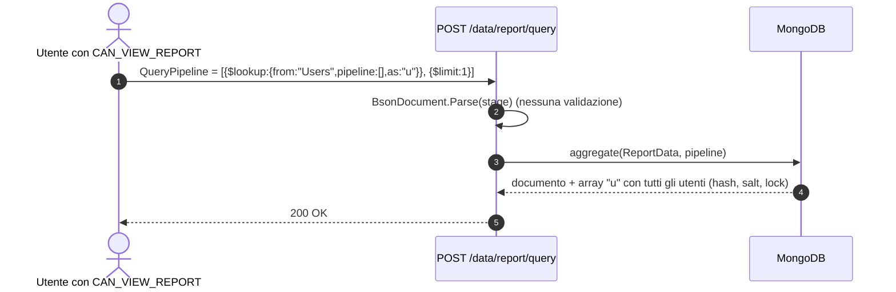
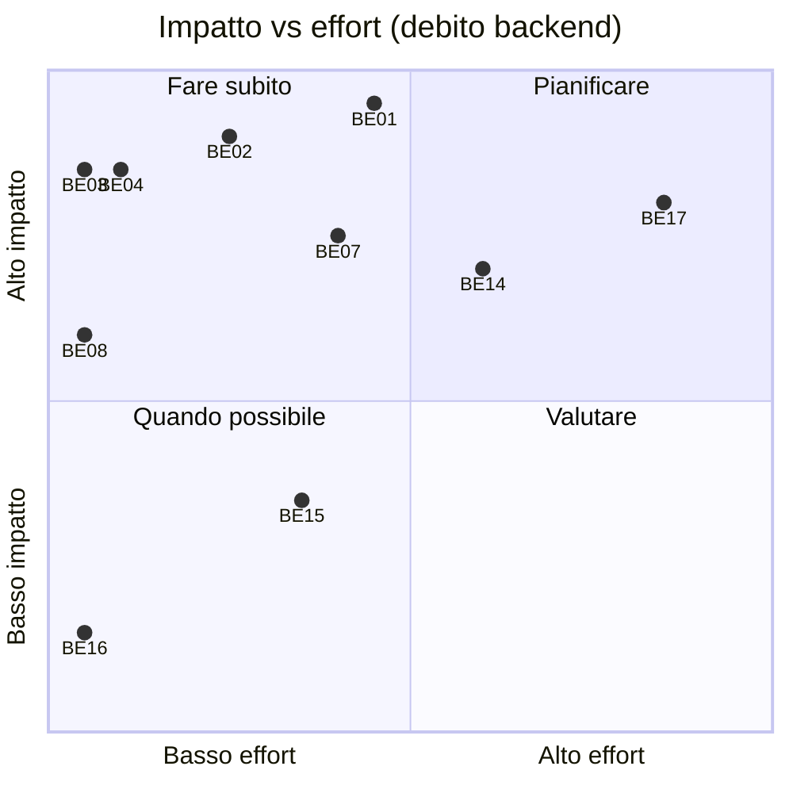
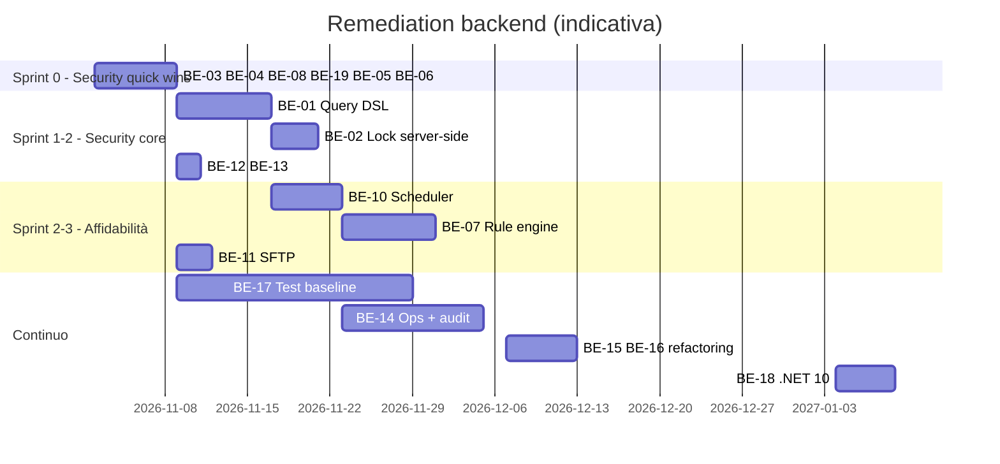

<!-- REVERSE-META
schema: 1
mode: how
step: 17_backend_deep_assessment
commit: 593f6decec3a642d5567754dd795b19560bb0afb
commit_short: 593f6de
branch: main
worktree: clean
baseline_date: 2026-10-05T10:14:05+00:00
generated_at: 2026-10-07T14:40:00Z
-->
# Backend Deep Assessment - Progetto LOSS_PREVENTION

> **Baseline commit:** `593f6de` (`main`) · worktree `clean`

**Data**: 2026-10-07 · **Versione**: 1.0 · **Autori**: REVERSE how · **Audience**: backend architect, tech lead, CTO

> Il template di riferimento è orientato a Java/Spring: le sezioni sono state mappate sull'equivalente .NET (csproj ↔ Maven module, FastEndpoints ↔ Spring MVC, MongoDB.Driver ↔ JPA, ecc.).

---

## 1. Executive Summary

### Overall Health Score: **5,0 / 10**

| Dimensione | Voto | Commento |
|-----------|------|----------|
| Architettura | 6 | Layering chiaro, REPR coerente; leakage del driver Mongo nei servizi |
| Sicurezza | 3 | Buon hashing, ma query injection, lock solo client, hash esposti, secret versionato |
| Persistenza/performance | 4 | Full-scan in memoria su rule engine e distance; `MongoClient` scoped |
| Qualità codice | 6 | CCN medio 2,5; hotspot limitati; namespace incoerenti, dead code |
| Testing | 0 | Nessun test |
| Operabilità | 3 | No health, metriche, audit; scheduler in-process |
| Stack/aggiornamento | 8 | .NET 8 + librerie recenti |

### Top 5 Critical Issues (impatto business)

| # | Issue | Impatto business |
|---|-------|------------------|
| 1 | `POST /data/report/query` esegue pipeline arbitrarie | Esfiltrazione di utenti/hash e dati di tutti i negozi; possibile scrittura/cancellazione |
| 2 | Row-level lock non applicato dal server | Violazione GDPR e del principio di necessità per manager di negozio |
| 3 | `GET /users` espone hash e salt | Compromissione account amministrativi |
| 4 | Rule engine O(N) in memoria e non automatico | Flag antifrode non aggiornati e tempi inaccettabili su volumi reali |
| 5 | Nessun test e nessun audit log | Impossibile garantire correttezza e tracciabilità delle decisioni antifrode |

### Top 5 Recommendations (ROI)

| # | Raccomandazione | Effort | ROI |
|---|----------------|--------|-----|
| 1 | Query DSL server-side + lock enforcement | 8–12 gg | Chiude 2 vulnerabilità critiche |
| 2 | DTO utente senza hash; secret in Key Vault; rotazione JWT | 1–2 gg | Rischio critico eliminato con costo minimo |
| 3 | Rule engine con `UpdateMany`/pipeline update + trigger post-ingestione | 5–8 gg | Da O(N) round-trip a poche operazioni server-side |
| 4 | Baseline test (xUnit + Testcontainers Mongo) su servizi core | 15–20 gg | Abilita refactoring sicuro |
| 5 | `MongoClient` singleton, health checks, logging strutturato, audit | 6–10 gg | Operabilità e compliance |

### Metrics Snapshot

| Metrica | Valore |
|---------|--------|
| Progetti | 5 · 232 file C# · 10.143 SLOC |
| Endpoint | 78 (74 protetti da permesso) |
| Funzioni / CCN medio / CCN > 15 | 475 / 2,5 / 6 |
| Endpoint con accesso diretto al repository | 20 |
| `catch (Exception)` | 31 |
| Test | 0 |

---

## 2. Detailed Technical Analysis

### 2.1 Architettura modulare (≙ Maven multi-module)

| Progetto | Riferimenti | Responsabilità | Osservazioni |
|----------|-------------|----------------|--------------|
| `01. LossPrevention.API` | Application, Infrastructure | Host, endpoint, DI, auth | Cartella vuota `Endpoints\Login\` dichiarata nel csproj |
| `LossPrevention.Application` | Domain, Infrastructure | Servizi, DTO, helper | Contiene anche un `BackgroundService` con namespace Infrastructure |
| `LossPrevention.Domain` | — | Entità | Modello anemico (solo proprietà) |
| `LossPrevention.Infrastructure` | Domain | Repository, DI, hashing, email | Dipende da `Microsoft.AspNetCore.App` |
| `02. LossPrevention.DataIngestionService` | Application, Domain, Infrastructure | Bulk load | Path hardcoded, regole caricate e ignorate |

### 2.2 Domain model & business logic
Modello **anemico**: tutte le regole stanno nei servizi/helper. Logica di dominio rilevante:
- `RuleHelper` (valutazione regole, traversal di array), `DistanceHelper` (euclidea), `BsonHelper` (coercizione tipi, CCN 20-21), `XmlToBsonConverterHelper` (flatten + inferenza tipi), `MappingService` (scoperta schema, 428 righe).
- Il motore antifrode statistico **non esiste nel backend** (solo nel frontend).

### 2.3 Persistence layer (≙ JPA/Hibernate)

| Tema | Osservazione | Evidenza |
|------|-------------|----------|
| Repository | Generico, espone `Collection` | `Infrastructure/Repositories/MongoRepository.cs` |
| Lifetime client | `AddScoped<IMongoClient>` → nuovo client e pool per ogni scope | `InfrastructureServiceExtensions.cs` |
| Full scan | `ApplyRulesAsync` e `UpdateRuleAsync` usano `GetAllAsync()` su `ReportData` | `RulesService.cs` |
| N+1 / round-trip | `ReplaceOneAsync` per ogni documento | `RulesService.cs` |
| Doppia aggregazione | count + pagina per ogni query report | `ReportDataservice.cs` |
| Indici | Solo TTL creato dall'API | `DatabaseInitializationService.cs` |
| Transazioni | Nessuna (insert dati + `ProcessedFiles` non atomici) | `FileProcessingCoordinator.cs` |

### 2.4 API layer

- **Design**: REST "pragmatico" con incoerenze: verbi nell'URL (`/permissions/create`, `/users/update` via POST, `/roles/delete`), operazione di scrittura via GET (`GET /rules/apply`), prefisso `/api` solo su data-ingestion e fraud-detection.
- **Documentazione**: Swagger NSwag solo in Development; summary presenti su parte degli endpoint.
- **Security**:
  - Permessi dichiarativi su 74/78 endpoint ✅
  - `GetReportDataEndpoint`: `BsonDocument.Parse(x.ToString())` per ogni stage → **query injection** 🔴
  - `GetDistanceEndpoint`: campi data e campi di confronto scelti dal client, nessun lock 🔴
  - `GetUsersEndpoint`: hash/salt in risposta 🔴
  - `ListNotificationsEndpoint`: nessun filtro per destinatario 🟠
  - Messaggi di eccezione restituiti al client 🟡
  - Nessun rate limiting su `/users/login` e `/users/forgot-password` 🟠

### 2.5 Microservices
Non applicabile (monolite). La separazione futura più naturale è un **worker** per ingestione/analisi antifrode.

### 2.6 Integration layer

| Integrazione | Valutazione |
|-------------|-------------|
| SFTP (SSH.NET) | Password in chiaro su DB; nessuna verifica host key; file scaricato e parsato 2 volte; rielenca tutta `processed/` a ogni run |
| File system | Path da configurazione; console con path hardcoded |
| SMTP | `SmtpClient` senza TLS, credenziali di default |
| Messaging | Assente |

### 2.7 Caching strategy
`IMemoryCache` solo sulle query report, chiave = SHA256(pipeline, skip, take), TTL 1 h. Problemi: non invalidata dopo ingestione/`ApplyRules`; non dipende dall'utente (oggi irrilevante perché il lock è client-side, ma diventa un leak quando il lock sarà server-side); non distribuita.

### 2.8 Security backend

| Area | Stato |
|------|-------|
| Autenticazione | JWT HS256, 1 h, issuer/audience validati ✅; nessun refresh/revoca; token restituito come `Task` serializzato |
| Password | PBKDF2-SHA256 600k + upgrade legacy ✅; confronto non a tempo costante (`string.Equals`) 🟡 |
| Reset password | Token hashato, 1 h, invalidazione precedenti ✅; nessun TTL index sui token |
| Autorizzazione | Claim `permissions` ✅; nessun enforcement row-level 🔴 |
| Secret | JWT secret reale in `appsettings.json` versionato 🔴; SFTP password in chiaro 🟠 |
| Trasporto | No HTTPS redirection/HSTS 🟠 |
| CORS | Hardcoded localhost (blocca produzione) |

### 2.9 Performance & scalability

| Hotspot | Complessità | Rischio su 1 M documenti |
|---------|-------------|--------------------------|
| `ApplyRulesAsync` | carica N doc + N `ReplaceOne` | Memoria GB, ore di esecuzione |
| `UpdateRuleAsync` | N `UpdateOne` | idem |
| `GetDistanceAsync` | carica tutti i doc nell'intervallo + O(N·F) | Timeout HTTP |
| `MappingService.ProcessMappings(…, int.MaxValue)` dopo ingestione | scansione completa | Lento a ogni ingestione |
| Query report | doppia aggregazione senza indici | Lenta, mitigata da cache |

Scalabilità orizzontale bloccata da scheduler e cache in-process.

### 2.10 Batch processing
- `DataIngestionBackgroundService`: polling 60 s, finestra ±1 min, `LastRunAt` non persistito → possibile doppia esecuzione; `monthly` gestito nel codice ma non nel modello (`"daily" | "weekly"`).
- Console: `Parallel.ForEachAsync` con `MaxDegree = ProcessorCount`, insert singolo; costanti `ChannelCapacity`/`BatchSize` dichiarate ma non usate.

### 2.11 Error handling & logging
31 `catch (Exception)`; alcuni silenziosi (move SFTP fallito); `ILogger` usato nei servizi di ingestione; nessun logging strutturato/correlation-id; nessun audit.

### 2.12 Testing strategy
Nessun progetto di test. Componenti facilmente testabili: `RuleHelper`, `DistanceHelper`, `BsonHelper`, `XmlToBsonConverterHelper`, `PasswordHasher` (funzioni statiche pure).

### 2.13 Build & deployment / Configuration / Dependencies

| Tema | Stato |
|------|-------|
| Build | `dotnet build` standard; nomi csproj con spazi |
| Container | Assente |
| CI/CD | Assente |
| Config per ambiente | Assente |
| Dipendenze | 15 pacchetti NuGet unici; `Microsoft.AspNetCore.Http.Features 5.0.17` deprecato; doppia libreria JSON; `Microsoft.Extensions.*` 9.0.4 su runtime 8 (compatibili) |
| Upgrade path | .NET 8 → .NET 10 LTS (fine supporto .NET 8: 10-nov-2026) |

### 2.14 Observability, DB operations
Nessun health check/metriche/tracing; nessuna migrazione schema; indici gestiti solo dal job console.

---

## 3. Technical Debt Register

| ID | Debito | Categoria | Severità | Effort (gg) | Dipende da |
|----|--------|-----------|----------|-------------|-----------|
| BE-01 | Pipeline arbitraria → Query DSL server-side + whitelist | Security | Critica | 6–8 | — |
| BE-02 | Lock row-level server-side (query, distance, export, rules) | Security | Critica | 2–4 | BE-01 |
| BE-03 | Hash/salt fuori dai DTO | Security | Critica | 0,5 | — |
| BE-04 | Secret fuori dal repo + rotazione + rimozione dump dal Git (history rewrite) | Security | Critica | 1–2 | — |
| BE-05 | `CreateTransactionEndpoint` non funzionante | Bug | Alta | 0,5–1 | — |
| BE-06 | `await` mancante in Login (contratto token) | Bug | Media | 0,5 (+FE) | — |
| BE-07 | Rule engine: bulk update, fix `UpdateRuleAsync`, trigger post-ingestione | Perf/Bug | Alta | 5–8 | BE-10 |
| BE-08 | `MongoClient` singleton | Perf | Alta | 0,5 | — |
| BE-09 | Distance: query con proiezione, normalizzazione feature, limiti | Perf/Qualità | Media | 3–5 | — |
| BE-10 | Scheduler persistente, `LastRunAt` persistito, storico esecuzioni | Reliability | Alta | 4–6 | — |
| BE-11 | SFTP: host key pinning, password cifrata, singolo download/parse | Security/Perf | Alta | 2–3 | — |
| BE-12 | Notifiche filtrate per destinatario | Security | Alta | 1 | — |
| BE-13 | Rate limiting login/forgot | Security | Media | 1 | — |
| BE-14 | Health checks, logging strutturato, audit log | Ops/Compliance | Alta | 8–12 | — |
| BE-15 | Endpoint → servizi (20 endpoint), dedup mapping soglie | Manutenibilità | Media | 4–6 | — |
| BE-16 | Rimozione dead code (Dapper, console rules, NotImplemented) | Manutenibilità | Bassa | 0,5 | — |
| BE-17 | Test baseline xUnit + Testcontainers | Qualità | Alta | 15–20 | — |
| BE-18 | Upgrade .NET 10 | Lifecycle | Media | 3–5 | BE-17 |
| BE-19 | CORS/HTTPS/HSTS da configurazione | Security/Ops | Alta | 1 | — |

**Totale debito backend: ≈ 59–85 gg.**

### Effort/Impact matrix

---

## 4. Action Plan & Roadmap

**Milestone**: M1 (fine sprint 0) nessuna vulnerabilità critica "a costo zero" aperta · M2 query e lock sicuri · M3 rule engine scalabile e automatico · M4 test ≥ 60% servizi core, audit attivo, .NET 10.

**Risk mitigation**: introdurre i test di caratterizzazione **prima** di BE-07/BE-15; eseguire BE-01 con feature flag e confronto risultati vecchia/nuova pipeline sui workspace salvati.

---

## 5. Recommendations

### 5.1 Quick Wins (< 2 settimane)
BE-03, BE-04, BE-05, BE-06, BE-08, BE-12, BE-13, BE-16, BE-19.

### 5.2 Short Term (1–3 mesi)
BE-01, BE-02, BE-07, BE-10, BE-11, BE-14, BE-17; spostamento del motore statistico nel backend (vedi documento 19 §7).

### 5.3 Long Term (6–12 mesi)
Worker separato per ingestione/analisi, multi-tenancy, SSO (OIDC), .NET 10, observability completa (OpenTelemetry).

### 5.4 Non-Functional Improvements
Indici gestiti da codice, cache distribuita con invalidazione su eventi di ingestione/regole, ProblemDetails uniformi, rate limiting globale.

---

## 6. Capacity Planning

| Risorsa | Stima iniziale | Driver |
|---------|---------------|--------|
| API | 2 × (2 vCPU, 4 GB) | Aggregazioni, distance |
| Worker | 1 × (2–4 vCPU, 4–8 GB) | Ingestione, regole, analisi statistica |
| MongoDB | replica set 3 nodi, 16 GB RAM | Working set `ReportData` (retention 180 gg) |
| LLM | GPU 16 GB o servizio gestito | `qwen2.5:14b` |

**Cost optimization**: worker on-demand (Container Apps jobs), Mongo gestito con autoscaling storage, LLM condiviso via gateway anziché su ogni postazione.

---

## Appendix
- Strumenti usati: cloc 2.02, lizard, grep/ripgrep, analisi manuale. Non eseguiti: build, test, `dotnet list package --vulnerable`, profiling (runtime .NET non disponibile nel sandbox).

## Reference Documents
- 06_software_architecture.md · 07_code.md · 08_data.md · 14_metrics.md

## Change Log

| Versione | Data | Autore | Modifiche |
|----------|------|--------|-----------|
| 1.0 | 2026-10-07 | REVERSE how (FULL) | Creazione documento (sostituisce run 2026-10-05) |
