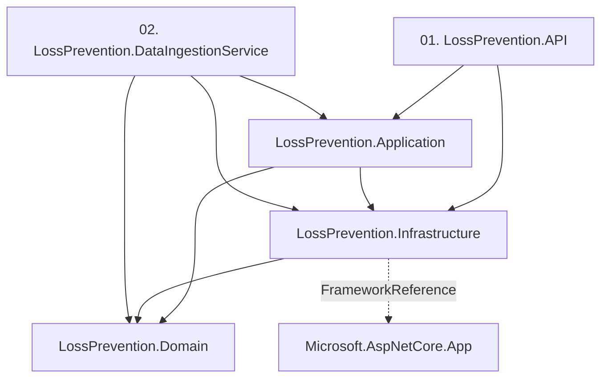
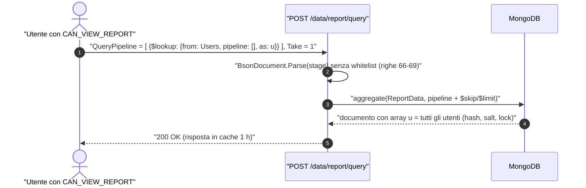
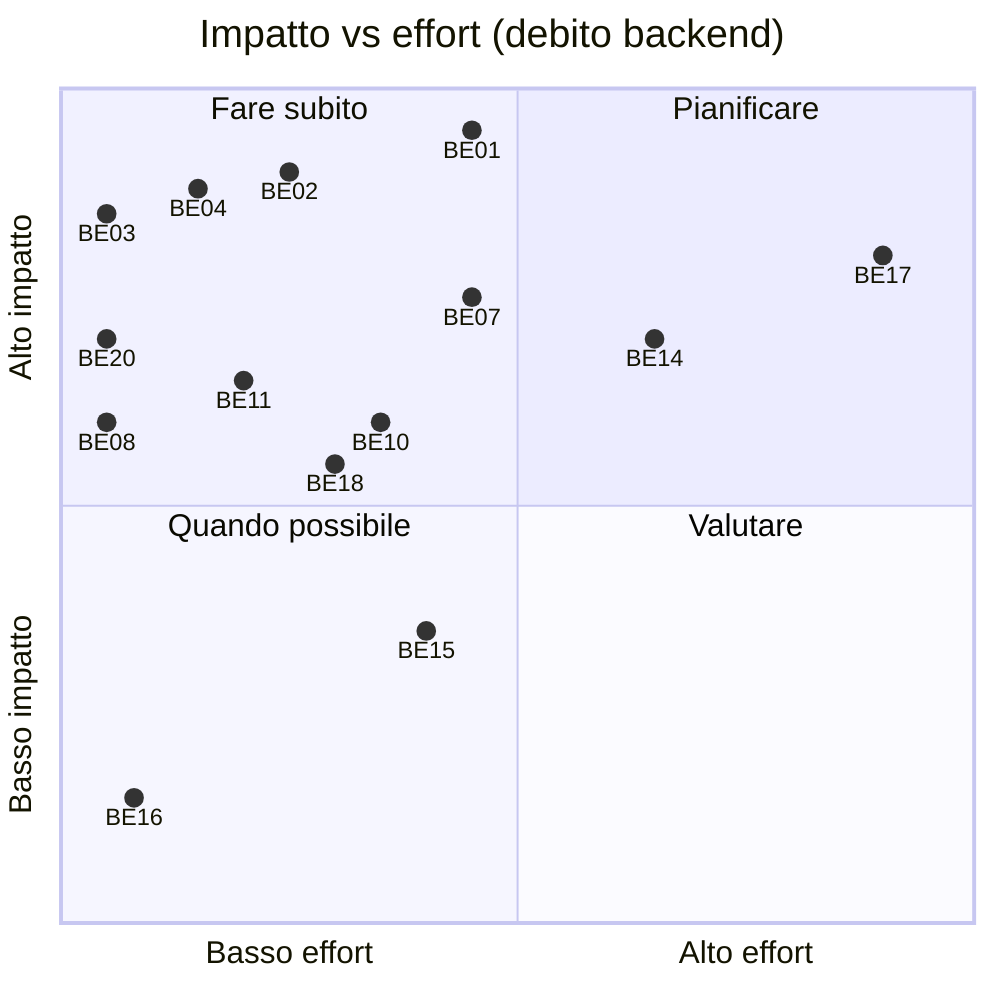
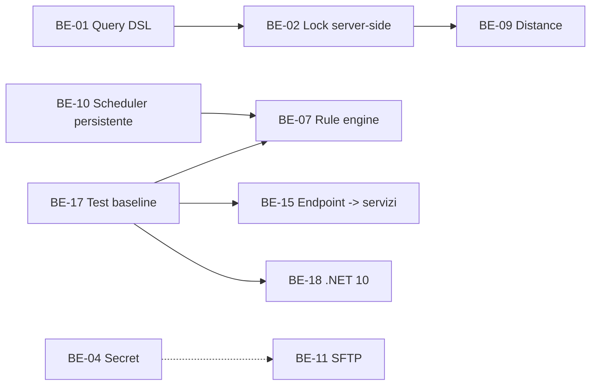
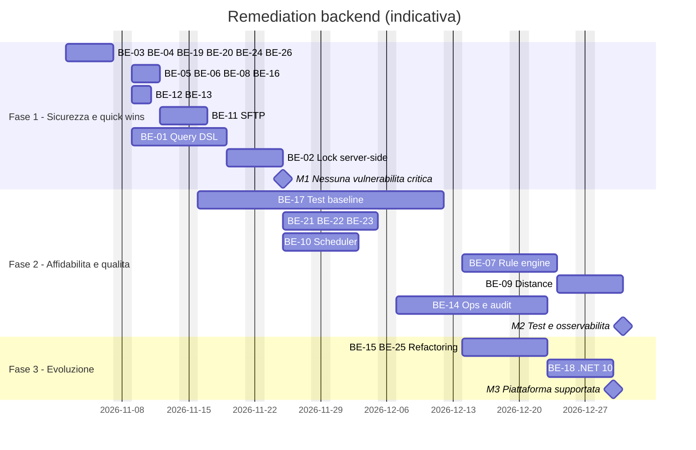
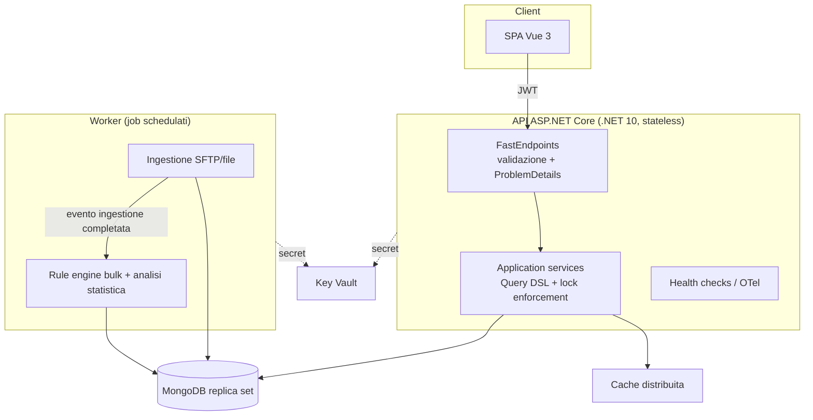

<!-- IMPACT-META
schema: 1
mode: how
step: 17_backend_deep_assessment
commit: fc7d820908b8b230fb47a2669920ba7efdb413a8
commit_short: fc7d820
branch: main
worktree: dirty
baseline_date: 2026-10-07T18:19:51+02:00
generated_at: 2026-10-08T10:05:26+02:00
-->
# Backend Deep Assessment - Progetto LOSS_PREVENTION

> **Baseline commit:** `fc7d820` (`main`) · worktree `dirty` (modifiche locali solo in `Docs/` e `.github/`; codice applicativo identico al commit)

**Data**: 2026-10-08 · **Versione**: 1.1 · **Autori**: REVERSE how / IMPACT verify · **Audience**: Backend Architect, Tech Lead, Senior Backend Developer, CTO

> **Adattamento del prompt (Java/Spring Boot → .NET 8).** Il prompt di riferimento è scritto per Java/Spring Boot; il backend analizzato è **.NET 8 + FastEndpoints 6 + MongoDB.Driver 3.4**. Ogni requisito è stato mappato sull'equivalente .NET indicato sotto; i requisiti senza equivalente sono marcati `N/A per stack .NET: <motivo>`.

| Requisito Java/Spring nel prompt | Equivalente .NET analizzato |
|---|---|
| Maven multi-module, `pom.xml`, parent POM/BOM | Soluzione `LossPrevention.sln` con 5 progetti `.csproj` (SDK-style), `PackageReference`, `ProjectReference` |
| Spring Boot / Spring MVC `@RestController` | ASP.NET Core 8 minimal hosting + **FastEndpoints** (pattern REPR: una classe per endpoint) |
| JPA/Hibernate, Spring Data repositories | **MongoDB.Driver** + repository generico `MongoRepository<T>`; nessun ORM relazionale |
| Flyway / Liquibase | Nessun tool di migrazione; script `Data/MongoDBScripts/*.js` e codice di inizializzazione |
| Spring Security, `@PreAuthorize` | `AddAuthentication().AddJwtBearer` + `Permissions("CAN_*")` di FastEndpoints (claim `permissions`) |
| Bean Validation (JSR-380), `@Valid` | FluentValidation (FastEndpoints `Validator<T>`) + validazioni manuali negli handler |
| `@ControllerAdvice` | Middleware/exception handler ASP.NET Core, `ProblemDetails` (assenti) |
| `@Transactional` | Sessioni/transazioni MongoDB (`IClientSessionHandle`), assenti |
| Spring Cache `@Cacheable` / Hibernate L2 | `IMemoryCache` (1 punto d'uso); L2 cache N/A |
| Spring Boot Actuator, Micrometer | `AddHealthChecks`, OpenTelemetry/`System.Diagnostics.Metrics` (assenti) |
| SLF4J/Logback, MDC | `ILogger<T>` (Microsoft.Extensions.Logging), scope di logging (usati in 4 file) |
| `@Scheduled`, Spring Batch | `BackgroundService` (`DataIngestionBackgroundService`) + console app di bulk load |
| RestTemplate/WebClient | `HttpClient` (nessun uso), SSH.NET per SFTP, `SmtpClient` |
| JUnit/Mockito/TestContainers | xUnit/NUnit, Moq/NSubstitute, `WebApplicationFactory`, Testcontainers.MongoDb (nessuno presente) |
| `mvn dependency:tree`, OWASP Dependency-Check | `dotnet list package --vulnerable/--outdated` (SDK non disponibile in analisi) → sostituito da interrogazione API NuGet |
| HikariCP, Tomcat thread pool, GC JVM | Connection pool del `MongoClient`, thread pool .NET/Kestrel, GC .NET (`ServerGarbageCollector`) |
| Java 17/21 LTS, Spring Boot LTS | .NET 8 LTS (fine supporto 10-nov-2026) → .NET 10 LTS |

---

## Executive Summary

Il backend è un monolite modulare .NET 8 con layering leggibile ma **non pronto per la produzione**: espone una superficie di attacco critica (pipeline MongoDB arbitrarie dal client, hash delle password e password SFTP restituiti dalle API, secret versionati), non applica server-side il row-level lock, non ha test né osservabilità e implementa il rule engine con full scan e scritture documento per documento.

### Overall Health Score: **3,9 / 10**

**Assessment Date**: 2026-10-08 · **Codebase Version**: commit `fc7d820` (`main`) · **Total**: 232 file C#, **10.760 righe non vuote** (canonico IMPACT; 10.143 SLOC cloc, vedi [14_metrics.md](14_metrics.md)) · **Moduli analizzati**: 5 progetti `.csproj` (net8.0)

### Architecture Quality Assessment

Scorecard sulle 7 dimensioni richieste dal prompt, voti 0–10 con evidenza; il punteggio complessivo è la media aritmetica semplice (pesi uguali).

| Dimensione | Score | Status | Evidenza principale (sezione) |
|-----------|-------|--------|-------------------------------|
| Modularity | 6/10 | 🟠 | 5 progetti aciclici, REPR coerente (§1); ma Application → Infrastructure (inversione), entità Domain accoppiate a `MongoDB.Bson` (22 attributi `[Bson*]`), namespace incoerenti |
| Security | 3/10 | 🔴 | PBKDF2 600k ✅ e permessi su 74/78 endpoint ✅; ma pipeline arbitraria (`GetReportDataEndpoint.cs:66-71`), hash/salt in `UserDTO.cs:7-8`, password SFTP restituita da `GET /api/data-ingestion`, JWT secret versionato, lock non applicato dal server, 2 advisory High su SSH.NET (§4.3, §8) |
| Performance | 4/10 | 🔴 | `MongoClient` scoped (`InfrastructureServiceExtensions.cs:33-37`), full scan + `ReplaceOneAsync` per documento (`RulesService.cs:34-58`), doppia aggregazione per query (`ReportDataservice.cs:40-52`); cache 1 h e indici TTL presenti (§3, §9) |
| Scalability | 4/10 | 🔴 | API stateless JWT ✅; scheduler in-process con `LastRunAt` in memoria, `IMemoryCache` locale, nessun lock distribuito ⇒ una sola istanza sicura (§9.2) |
| Testability | 2/10 | 🔴 | 0 test; DI costruttore ovunque e helper statici puri (`RuleHelper`, `DistanceHelper`, `BsonHelper`, `PasswordHasher`) facilmente testabili; 20 endpoint accedono direttamente al repository (§11) |
| Maintainability | 6/10 | 🟠 | CCN medio 2,5, 6 funzioni CCN > 15; duplicazione 8,58 % (FraudDetection Create/Update 341 righe clonate), dead code (Dapper 205 righe commentate) (§15) |
| Observability | 2/10 | 🔴 | `ILogger` in soli 4 file, 6 `Console.WriteLine`, nessun health check, metrica, tracing o audit log (§10, §16) |

**Calcolo**: (6 + 3 + 4 + 4 + 2 + 6 + 2) / 7 = 27 / 7 = 3,857 → **3,9 / 10**.

> Nota di versione: la v1.0 riportava 5,0/10 su 7 dimensioni diverse da quelle del prompt (inclusa "Stack/aggiornamento" = 8) e senza calcolo esplicito; il valore è stato ricalcolato sulle dimensioni del prompt.

**Overall Assessment**: salute **scarsa**. Le fondamenta (REPR, DI, PBKDF2, JWT validato) sono recuperabili, ma prima di qualsiasi esposizione in rete va completata la Fase 1 della roadmap (§19.1: vulnerabilità P1 e quick wins, ≈ 18,5–25,5 gg).

### Top 5 Critical Issues

#### 1. 🔴 Pipeline di aggregazione arbitraria dal client (Priority: CRITICAL)
- **Impact**: HIGH — `POST /data/report/query` converte ogni stage ricevuto con `BsonDocument.Parse(x.ToString())` ed esegue l'aggregazione su `ReportData` senza whitelist (`GetReportDataEndpoint.cs:66-71`, `ReportDataservice.cs:40-52`).
- **Affected**: tutti gli utenti con `CAN_VIEW_REPORT`.
- **Business Impact**: con `$lookup`/`$unionWith` si leggono **altre collection** (`Users` con hash/salt, `PasswordResetTokens`, `DataIngestionConfigurations` con password SFTP); stage costosi senza limiti causano DoS. La scrittura via `$out`/`$merge` è invece bloccata di fatto perché il server accoda sempre `$count` o `$limit` (righe 41 e 50): la v1.0 la indicava come possibile, ed è stata corretta.
- **Effort**: 6–8 gg · **Recommendation**: DSL di query server-side con whitelist di stage/operatori/campi (BE-01).

#### 2. 🔴 Credenziali esposte dalle API e nel repository (Priority: CRITICAL)
- **Impact**: HIGH — `UserDTO` include `PasswordHash`/`PasswordSalt` (`UserDTO.cs:7-8`), restituiti da 5 endpoint (`GetUsersEndpoint.cs:36`, `GetUserByIdEndpoint.cs:56-57`, `GetUserByUsernameEndpoint.cs:55-56`, `GetUserRolesPermissionEndpoint.cs:59-60`, `CreateUserEndpoint.cs:63-64`); `GET /api/data-ingestion` restituisce `SftpPassword` in chiaro (`GetDataIngestionConfigurationEndpoint.cs:41`); `JwtSettings.SecretKey` (36 caratteri, valore omesso) versionato in `appsettings.json`; dump `Data/LossPrevention/*.bson` versionato con hash utenti e password SFTP.
- **Business Impact**: compromissione account e forgiatura di JWT validi da parte di chiunque abbia accesso al repository.
- **Effort**: 2,5–3,5 gg · **Recommendation**: BE-03 + BE-04.

#### 3. 🔴 Row-level lock non applicato dal server (Priority: CRITICAL)
- **Impact**: HIGH — il login inserisce `LockField`/`LockValue` nel JWT (`LoginEndpoint.cs:65-69`), ma nessun servizio backend li legge: il filtro è applicato solo dal frontend (`helpers/fieldLock.ts`).
- **Business Impact**: un manager di negozio vede i dati di tutti i negozi (GDPR, principio di necessità).
- **Effort**: 2–4 gg (dopo BE-01) · **Recommendation**: BE-02.

#### 4. 🟠 Rule engine e accesso dati non scalabili (Priority: HIGH)
- **Impact**: MEDIUM-HIGH — `ApplyRulesAsync` carica l'intera collection (`RulesService.cs:34`) e riscrive ogni documento con `ReplaceOneAsync` (`:57-58`); `UpdateRuleAsync` scrive il flag alla radice del documento anziché in `FraudFlags.*` (`:147`, bug); `MongoClient` scoped crea un pool per richiesta.
- **Business Impact**: tempi e memoria proporzionali al volume; flag antifrode errati dopo un aggiornamento di regola.
- **Effort**: 5,5–8,5 gg · **Recommendation**: BE-07 + BE-08.

#### 5. 🟠 Nessun test, osservabilità o audit (Priority: HIGH)
- **Impact**: MEDIUM — 0 progetti di test, nessun health check, log strutturato, metrica o audit trail delle decisioni antifrode.
- **Business Impact**: regressioni non rilevabili, MTTR elevato, nessuna tracciabilità per contestazioni o verifiche di compliance.
- **Effort**: 23–32 gg · **Recommendation**: BE-17 + BE-14.

### Top 5 Recommendations (with ROI)

> Il ROI è espresso qualitativamente: costi infrastrutturali, tariffe e volumi di produzione non sono ricavabili dal codice (N/A — non ricavabile dal codice: nessun dato economico o di carico nel repository).

| # | Raccomandazione | Effort | Impatto atteso | ROI |
|---|---|---|---|---|
| 1 | DTO utente senza hash, password SFTP mai restituita né in chiaro, secret in vault + rotazione (BE-03, BE-04) | 2,5–3,5 gg | Chiude 2 vettori critici con costo minimo | ⭐⭐⭐⭐⭐ |
| 2 | Query DSL server-side + lock enforcement (BE-01, BE-02) | 8–12 gg | Elimina esfiltrazione cross-collection e violazione row-level | ⭐⭐⭐⭐⭐ |
| 3 | `MongoClient` singleton + rule engine con update bulk server-side (BE-08, BE-07) | 5,5–8,5 gg | Da N round-trip a poche operazioni; corregge il bug di `UpdateRuleAsync` | ⭐⭐⭐⭐ |
| 4 | Baseline test xUnit + Testcontainers.MongoDb (BE-17) | 15–20 gg | Abilita refactoring e upgrade sicuri | ⭐⭐⭐⭐ |
| 5 | Health checks, logging strutturato, exception handler + ProblemDetails, audit (BE-14, BE-21) | 10–15 gg | Operabilità e compliance | ⭐⭐⭐ |

### Metrics Snapshot

#### Performance Metrics

| Metric | Current | Target | Status |
|---|---|---|---|
| P95 / P99 latency, throughput, error rate | N/A — non ricavabile dal codice: nessun ambiente in esecuzione, log o APM | p95 < 500 ms su `/data/report/query` | ⚪ |
| Query DB per richiesta report | 2 aggregazioni + 1 lettura mapping nel servizio + 1 lettura mapping inutilizzata nell'endpoint (`GetReportDataEndpoint.cs:64`) | 1 aggregazione (`$facet`) | 🟠 |
| Scritture per `ApplyRules` | N `ReplaceOneAsync` (N = documenti `ReportData`) | 1 `UpdateMany`/pipeline update per regola | 🔴 |

#### Code Quality Metrics

| Metric | Current | Target | Status |
|---|---|---|---|
| Test coverage | 0 % | > 70 % servizi core | 🔴 |
| Cyclomatic complexity | 475 funzioni, media 2,5, 6 > 15, 17 > 10, max 24 | < 10 per metodo | 🟢 media / 🟠 hotspot |
| Code duplication | 8,58 % (56 cloni, 1.052 righe) | < 5 % | 🟠 |
| Metodi > 50 NLOC | 18 | 0 | 🟠 |
| Tech debt ratio / maintainability rating | N/A — non ricavabile dal codice: SonarQube non eseguito | A | ⚪ |

#### Security Metrics

| Metric | Current | Target | Status |
|---|---|---|---|
| Advisory sui pacchetti diretti | 2 High (SSH.NET 2025.1.0) | 0 | 🔴 |
| Pacchetti deprecati | 1 (`Microsoft.AspNetCore.Http.Features` 5.0.17) | 0 | 🟠 |
| Pacchetti diretti non all'ultima stable | 14/15 (unica eccezione `Microsoft.AspNetCore.Http.Features`, ferma a 5.0.17 perché deprecata) | < 20 % | 🔴 |
| Security hotspot nel codice | 8 (BE-01, 02, 03, 04, 11, 12, 13, 19) | 0 | 🔴 |

#### Operational Metrics

| Metric | Current | Target | Status |
|---|---|---|---|
| Uptime, MTTR, MTBF, deployment frequency | N/A — non ricavabile dal codice: nessun ambiente, pipeline o storico incidenti | 99,5 % / < 1 h | ⚪ |
| Health check / metriche / tracing | 0 / 0 / 0 | presenti | 🔴 |

---


## Detailed Technical Analysis

### 1. Modular Architecture Assessment (≙ Maven Multi-Module)

La soluzione è un monolite modulare di 5 progetti con dipendenze acicliche; il layering è riconoscibile ma presenta un'inversione (Application → Infrastructure) e confini di namespace incoerenti.

#### 1.1 Multi-Module Structure

**Mappatura**: `pom.xml` padre/BOM → `LossPrevention.sln` + `.csproj` SDK-style; non esistono `Directory.Build.props`, `Directory.Packages.props` (Central Package Management), `global.json`, `nuget.config` né `.editorconfig` ⇒ versioni e proprietà sono ripetute in ogni progetto.

| Progetto (`.csproj`) | Target | File C# | Righe non vuote | ProjectReference | Responsabilità |
|---|---|---|---|---|---|
| `01. LossPrevention.API` | net8.0 (Web SDK) | 79 | 4.347 | Application, Infrastructure | Host Kestrel, 78 endpoint FastEndpoints, DI, JWT |
| `LossPrevention.Application` | net8.0 | 121 | 5.005 | Domain, Infrastructure | Servizi, DTO, handler request/response, helper, validator |
| `LossPrevention.Domain` | net8.0 | 21 | 519 | — (solo `MongoDB.Bson`) | 19 entità + 2 eccezioni |
| `LossPrevention.Infrastructure` | net8.0 | 10 | 784 | Domain + `FrameworkReference Microsoft.AspNetCore.App` | Repository Mongo, DI, `PasswordHasher`, `EmailService` |
| `02. LossPrevention.DataIngestionService` | net8.0 (console) | 1 | 105 | Application, Domain, Infrastructure | Bulk load XML da file system |
| **Totale** | | **232** | **10.760** | | |

Tutti i progetti hanno `Nullable` e `ImplicitUsings` abilitati. I nomi dei `.csproj` contengono spazi e prefissi numerici ("01. …", "02. …"), il che complica gli script CLI e i Dockerfile.



| Criterio del prompt | Valutazione | Evidenza |
|---|---|---|
| Separation of concerns | 🟠 | Application dipende da Infrastructure (in Clean/Onion le dipendenze dovrebbero puntare verso Domain/Application) |
| Dipendenze circolari | ✅ assenti | Grafo sopra aciclico |
| Shared/common module | 🟠 | Nessun progetto "Contracts/Shared"; DTO in Application, usati direttamente dagli endpoint |
| Module boundaries | 🟠 | `DataIngestionBackgroundService` sta in `LossPrevention.Application/Services/DataIngestion/` con namespace `LossPrevention.Infrastructure.Services`; le entità Workspace in Domain usano il namespace `LossPrevention.Application.Entities.Workspaces` |
| Build/versioning | 🟠 | Nessun file di build centrale; versione assembly non impostata |
| Cartelle vuote | 🟡 | `<Folder Include="Endpoints\Login\" />` nel csproj API, mentre il login vive in `Endpoints/User/` |

#### 1.2 Package Structure Analysis

**Mappatura**: package Java → namespace/cartelle C#. L'organizzazione è **per layer** a livello di progetto e **per feature** dentro API (`Endpoints/<Feature>`) e parzialmente in Application.

| Progetto | Cartelle (n. file) |
|---|---|
| API `Endpoints/` | Dashboard 5 · Data 3 · DataIngestion 8 · FraudDetection 3 · Groups 7 · Mappings 4 · Notifications 5 · Rules 6 · User 32 · Workspaces 5 = **78** |
| Application | DTO 21 · Handlers 52 (Requests 47, Responses 5) · Helpers 6 · Interfaces 17 · Mappings 3 · Services 20 · Validators 2 |
| Infrastructure | Configuration 2 · Helpers 1 · Interfaces 1 · Repositories 4 · Services 1 |
| Domain | Entities 19 (in 11 sottocartelle) · Exceptions 2 |

- Naming: suffisso `Endpoint` coerente tranne `Workspaces/CreateWorkspace.cs`; `ReportDataservice`, `IDistanceDataservice` con "s" minuscola (ma la classe in `DistanceDataservice.cs:11` è `DistanceDataService`); il file `IndexSuggestionHelper.cs` contiene la classe `IndexService`.
- Visibilità: le classi sono `public`; non si usano `internal` né `InternalsVisibleTo`, quindi i confini dei layer non sono imposti dal compilatore.
- God package: `Endpoints/User` (32 file: utenti, ruoli, permessi, login, reset password) andrebbe suddiviso in `Users`, `Roles`, `Permissions` e `Auth`.

---

### 2. Domain Model & Business Logic

Il dominio è **anemico**: 19 entità con sole proprietà e 22 attributi `[Bson*]`; tutta la logica sta in servizi, helper statici ed endpoint. Il motore antifrode statistico (z-score, soglie, distanza) è implementato **nel frontend** (`fraudDetectionStore.ts`); il backend esegue solo regole min/max e la distanza euclidea.

#### 2.1 Domain-Driven Design Assessment

| Concetto DDD | Stato | Evidenza |
|---|---|---|
| Entities | Presenti come POCO persistiti | `Domain/Entities/**` (es. `User.cs` 21 righe, `FraudDetectionSettings.cs` 230 righe di sole proprietà) |
| Value Objects | Assenti | soglie, range e coordinate sono `decimal`/`double`/`string` (primitive obsession) |
| Aggregates / invarianti | Assenti | es. l'aggiunta di un membro a un gruppo è fatta nell'endpoint leggendo il documento e riscrivendo l'intera lista `Members` (`AddMemberToGroupEndpoint.cs:56-63`): read-modify-write senza concorrenza ottimistica, quindi con possibili lost update |
| Domain services | Assenti come concetto | la logica è in `Application/Services` e `Application/Helpers` |
| Domain events | Assenti | nessun meccanismo di eventi; ingestione → mapping → regole sono chiamate dirette o manuali |
| Repository | Generico per documento | `IMongoRepository<T>` (Infrastructure) |
| Bounded context | Impliciti | Utenti/IAM, Ingestione, Reporting/Query, Regole/Antifrode, Collaborazione (gruppi, notifiche, workspace, dashboard) |
| Ubiquitous language | Parziale | "ReportData" indica sia le transazioni sia il dataset di analisi; stati come stringhe magiche (`"one-time"`, `"recurring"`, `"daily"`, `"weekly"`) |
| Eccezioni di dominio | Definite ma inutilizzate | `DeleteUserRoleException`, `InvalidCustomerException`: 0 riferimenti nel codice |
| Accoppiamento al driver | 🔴 | entità Domain decorate con `[BsonId]`, `[BsonRepresentation]`, `[BsonElement]` ⇒ il Domain dipende da MongoDB.Bson |

#### 2.2 Business Logic Organization

| Tema del prompt | Equivalente .NET | Stato | Evidenza |
|---|---|---|---|
| Service layer | Classi `*Service` registrate scoped in DI | 🟠 | 20 servizi, ma **20 endpoint** iniettano direttamente `IMongoRepository<T>` (CRUD gruppi, notifiche, dashboard, fraud settings) |
| Transaction management (`@Transactional`) | `IClientSessionHandle` / `WithTransaction` | 🔴 assente | 0 occorrenze di `StartSession`/`TransactionScope`; in `FileProcessingCoordinator` l'`InsertManyAsync` dei dati (`:304`) e la marcatura in `ProcessedFiles` (`:408-410`) non sono atomici ⇒ un crash tra le due causa re-import duplicati |
| Validation | FluentValidation / `AddError` | 🟠 | solo 4 classi validator (dashboard: `CreateDashboardValidator.cs:7,18,29`, `UpdateDashboardValidator.cs:6`, con **due** `UpdateDashboardValidator` per lo stesso request type in namespace diversi); negli altri endpoint, controlli manuali con `AddError` |
| Business rule complexity | lizard | 🟢/🟠 | CCN medio 2,5; hotspot: `UpdateDataIngestionConfigurationEndpoint.HandleAsync` CCN 24 (`:23-101`), `BsonHelper` CCN 20-21, `MappingService` (428 righe) |
| God classes | > 400 righe / molte responsabilità | 🟠 | `MappingService` 428 righe (scoperta schema + CRUD + batch), `FileProcessingCoordinator` 424 righe (orchestrazione, SFTP, parsing, persistenza, idempotenza) |
| Logica nel posto sbagliato | | 🔴 | algoritmo antifrode statistico e row-level lock solo nel frontend; regole caricate e poi ignorate nella console (`DataIngestionService/Program.cs:38-47`) |

Bug di business logic verificati:
- `RulesService.UpdateRuleAsync` (`RulesService.cs:141-155`) aggiorna il flag alla **radice** del documento invece che in `FraudFlags.<campo>`, quindi i flag restano incoerenti con `ApplyRulesAsync`.
- `CreateTransactionEndpoint.cs:49-50` non è funzionante (vedi BE-05).
- `XmlProcessingService.cs:43` lancia `NotImplementedException` su `InsertManyAsync`, pur essendo registrato come `IFileProcessingService` (`Program.cs:102`).
- `IXmlEnrichmentRule` ha 0 implementazioni.

---

### 3. Persistence Layer Deep Dive

**Mappatura**: JPA/Hibernate → MongoDB.Driver 3.4 con repository generico. Le richieste del prompt su lazy loading, entity graph e dirty checking sono `N/A per stack .NET: nessun ORM né change tracking, il driver Mongo mappa i documenti con BsonSerializer`. Restano invece rilevanti la proiezione, gli indici, il pattern N+1 e il pooling.

#### 3.1 JPA/Hibernate Usage (≙ MongoDB.Driver)

| Tema | Osservazione | Evidenza | Gravità |
|---|---|---|---|
| Lifetime client / pool (≙ HikariCP) | `AddScoped<IMongoClient>(… new MongoClient(...))`: un nuovo client, con il suo connection pool, per ogni richiesta HTTP; la guida MongoDB raccomanda un singleton | `InfrastructureServiceExtensions.cs:33-37`; secondo costruttore con `new MongoClient(connectionString)` in `MongoRepository.cs:20-25` | 🔴 |
| Mapping | POCO tipizzati + `BsonDocument` dinamico per `ReportData` | `IMongoRepository<BsonDocument>` in `FileProcessingCoordinator.cs:27` | 🟢 (schema dinamico voluto) |
| Fetch / proiezioni | Nessuna proiezione: si caricano documenti interi anche quando servono pochi campi | `RulesService.cs:34`, `DistanceDataservice.cs:34-36` | 🟠 |
| N+1 (≙ lazy loading) | `ReplaceOneAsync` per documento nel ciclo regole; lookup dei permessi per ruolo nel login | `RulesService.cs:57-58`; `LoginEndpoint.cs:55-63` | 🔴 / 🟡 |
| Full scan | `FindManyAsync(_ => true …)` / `Filter.Empty` | `MappingService.cs:149,163`; `IndexSuggestionHelper.cs:23`; `DataIngestionService.cs:23,178`; `ListNotificationsEndpoint.cs:30` | 🟠 |
| Doppia aggregazione | count + pagina eseguiti come due pipeline separate | `ReportDataservice.cs:40-52` | 🟠 |
| Batch insert | API: `InsertManyAsync` per file ✅; console: `InsertOneAsync` per documento | `FileProcessingCoordinator.cs:304,374`; `DataIngestionService/Program.cs:102` (costante `BatchSize` a `:25` mai usata) | 🟠 |

#### 3.2 Repository Pattern

`IMongoRepository<T>` / `MongoRepository<T>` (Infrastructure) offre CRUD generico; non esistono query method derivati (≙ Spring Data) né specification.

| Problema | Evidenza |
|---|---|
| Astrazione che perde: `public IMongoCollection<TDocument> Collection` esposta ai chiamanti | `MongoRepository.cs:27`; usata per accedere ad **altre** collection, es. `ProcessedFiles` via `Collection.Database.GetCollection` (`FileProcessingCoordinator.cs:390-392, 408-410`) |
| Registrazione duplicata di `IMongoRepository<User>` (la seconda prevale) | `InfrastructureServiceExtensions.cs:65-70` e `:72-77` |
| Nomi di collection hardcoded fuori dalla configurazione | `"PasswordResetTokens"` (`InfrastructureServiceExtensions.cs:83`), `"ProcessedFiles"` (`FileProcessingCoordinator.cs:391`) |
| Creazione di indici generica e ingenua: solo indici single-field ascendenti, `.Take(20)` | `MongoRepository.cs:29-40` |
| Dead code: `DapperRepository` di 205 righe interamente commentate | `LossPrevention.Infrastructure/Repositories/DapperRepository.cs` |
| Bypass del layer servizi: 20 endpoint usano il repository direttamente | es. `ListNotificationsEndpoint.cs:30`, `CreateGroupEndpoint.cs:34` |

#### 3.3 Database Schema Analysis

MongoDB è schemaless: non ci sono vincoli DB, FK né JSON Schema validator. Le 13 collection sono configurate in `appsettings.json` (`MongoDbSettings`), più `PasswordResetTokens` e `ProcessedFiles` hardcoded.

| Aspetto | Stato | Evidenza |
|---|---|---|
| Indici applicativi | Solo TTL su `ReportData.BeginDateTime` (expireAfter = giorni di retention) creato dall'API | `DatabaseInitializationService.cs:43-105` |
| Indici suggeriti | Creati **solo** dal job console tramite `IndexService.ProcessIndexesAsync`, su un campione di 100 documenti | `DataIngestionService/Program.cs:68,116-117`; `IndexSuggestionHelper.cs:23` |
| Unicità | Nessun indice unique su `Users.Username`/`Email`: unicità controllata solo dall'applicazione (race condition possibile) | `UserService.cs:56-67` |
| TTL reset token | Nessun indice TTL su `PasswordResetTokens` (la scadenza è solo logica, `PasswordResetService.cs:65`) | — |
| Retention | `TransactionRetentionDays` = 180 in config, default nel codice 90 | `appsettings.json`; `DatabaseInitializationService.cs:23` |
| Integrità referenziale | Gestita dall'applicazione (id utente in gruppi, ruoli nei permessi); nessuna cancellazione a cascata | `AddMemberToGroupEndpoint.cs:56-59` |
| Normalizzazione | Dati transazionali denormalizzati e "flattened" da XML in `ReportData` (scelta adeguata ai report); metadati `_sourceFile`, `_processedAt`, `_sourceType` | `FileProcessingCoordinator.cs:298-300, 368-370` |
| Dump versionato | `Data/LossPrevention/*.bson` (es. `ReportData.bson` ≈ 3,5 MB; `Users.bson` con hash; `DataIngestionConfigurations.bson` con password SFTP) + script `Data/MongoDBScripts/00…04 *.js` | cartella `Data/` |

---

### 4. API Layer Assessment

L'API espone 78 endpoint FastEndpoints protetti da permessi dichiarativi (74/78), ma con design REST incoerente, documentazione solo in Development e alcune vulnerabilità critiche nel contratto.

#### 4.1 REST API Design

| Verbo | Endpoint |
|---|---|
| GET | 27 |
| POST | 24 |
| PUT | 11 |
| DELETE | 14 |
| PATCH | 2 |
| **Totale** | **78** (4 `AllowAnonymous`, 74 con `Permissions(...)`) |

| Criterio | Stato | Evidenza / esempio |
|---|---|---|
| Naming risorse | 🟠 | 10 route con verbi nell'URL (es. `Post("/permissions/create")` `CreatePermissionEndpoint.cs:17`, `Post("/users/update")` `UpdateUserEndpoint.cs:20`, `Delete("/roles/delete")` `DeleteRoleEndpoint.cs:16`, `Post("/data/create-transactions")` `CreateTransactionEndpoint.cs:18`) |
| Uso dei verbi HTTP | 🔴 | `GET /rules/apply` esegue una **scrittura** massiva (`ApplyRulesEndpoint.cs:18-19`); le query report e distance usano POST (`/data/report/query`, `/distance`) per avere un body (accettabile, ma non idempotente per semantica) |
| Prefissi / versioning | 🔴 | solo 11 route hanno il prefisso `/api` (data-ingestion, fraud-detection); nessun versioning (né `/v1` né header) |
| Status code | 🟠 | uso dei helper FastEndpoints (`SendOkAsync` 72, `SendErrorsAsync` 45, `SendNotFoundAsync` 40, `SendNoContentAsync` 5, `SendCreatedAtAsync` 2, `SendUnauthorizedAsync` 1); creazioni restituite spesso con 200 anziché 201 |
| Contratto risposta login | 🔴 | `CreateTokenAsync` non è atteso (`LoginEndpoint.cs:39`): viene serializzato un `Task`, e il frontend legge `token.result` |
| DTO pattern | 🟠 | request/response dedicati in `Application/Handlers`, ma `UserDTO` espone `PasswordHash`/`PasswordSalt` (`UserDTO.cs:7-8`); mapping manuale (nessun AutoMapper/Mapster) |
| Paginazione | 🟠 | `Skip`/`Take` solo sulla query report; liste (notifiche, gruppi, dashboard, utenti) senza paginazione |
| HATEOAS | N/A per stack .NET: non richiesto dal frontend né adottato; nessun beneficio per una SPA interna |

#### 4.2 API Documentation

| Aspetto | Stato | Evidenza |
|---|---|---|
| OpenAPI (≙ SpringDoc) | `FastEndpoints.Swagger` (NSwag), documento "Loss Prevention API" v1.0 | `Program.cs:53-61` |
| Esposizione | solo in Development | `Program.cs:121-126` |
| Descrizioni | 33 commenti `/// <summary>` in tutto il backend; 54 occorrenze di `Summary(` e 31 di `Description(` nella configurazione degli endpoint; nessun esempio di request/response | grep su `*.cs` |
| Schema di sicurezza | N/A — non ricavabile dal codice senza runtime: la presenza del bearer scheme nel documento generato non è verificabile (SDK non disponibile); nessuna configurazione esplicita in `SwaggerDocument` |
| Contract-first / generazione client | Assente: il frontend usa chiamate axios scritte a mano | `LossPrevention.UI/src/api/api.ts` |

#### 4.3 API Security

| Controllo | Stato | Evidenza |
|---|---|---|
| Autenticazione | ✅ JWT Bearer HS256 con validazione di issuer, audience, lifetime e firma | `Program.cs:63-76` |
| Autorizzazione | ✅ dichiarativa su 74/78 endpoint (`Permissions("CAN_*")`); ❌ nessun controllo row-level/ownership | es. `GetReportDataEndpoint.cs:29` |
| Input validation / injection | 🔴 pipeline arbitraria: `BsonDocument.Parse(x.ToString())` su ogni stage | `GetReportDataEndpoint.cs:66-69` |
| Mass assignment / campi scelti dal client | 🟠 `StartDateField`/`EndDateField` scelti dal client in `/distance` | `GetDistanceEndpoint.cs:39-40` |
| Esposizione dati sensibili | 🔴 hash/salt in 5 risposte; `SftpPassword` in `GET /api/data-ingestion` e nella risposta di update | `GetDataIngestionConfigurationEndpoint.cs:41,83` |
| Information leakage | 🟡 `ex.Message` restituito al client in 13 punti | es. `GetReportDataEndpoint.cs:87`, `ClearDataIngestionConfigurationEndpoint.cs:31` |
| Rate limiting (≙ Bucket4j) | 🔴 assente (`AddRateLimiter` non usato); nessun lockout su `/users/login` né su forgot-password | grep: 0 occorrenze |
| CORS | 🟠 origini hardcoded `http://localhost:5173`, `http://localhost:5174` con `AllowCredentials` | `Program.cs:24-34` |
| CSRF | N/A per stack .NET: token in header `Authorization`, non in cookie ⇒ CSRF non applicabile |
| Notifiche | 🟠 `ListNotificationsEndpoint` restituisce tutte le notifiche (`Filter.Empty`) a chiunque abbia `CAN_VIEW_NOTIFICATIONS` | `ListNotificationsEndpoint.cs:20-21,30` |



---

### 5. Microservices Architecture (if applicable)

Il sistema è un **monolite** (1 API + 1 console batch, database condiviso): i requisiti microservizi sono valutati solo come readiness.

#### 5.1 Service Decomposition
- N/A per stack .NET: monolite, nessun servizio indipendente, service discovery (≙ Eureka) o API gateway (≙ Spring Cloud Gateway).
- Candidati futuri all'estrazione, in base ai bounded context (§2.1): **Worker di ingestione/analisi** (SFTP, parsing, regole, analisi statistica: carico CPU/IO diverso dall'API) e **Identity** (sostituibile con un IdP OIDC).

#### 5.2 Resilience Patterns
| Pattern (≙ Resilience4j) | Equivalente .NET | Stato |
|---|---|---|
| Circuit breaker, retry, timeout, bulkhead | Polly / `Microsoft.Extensions.Http.Resilience` | 🔴 assenti; unico timeout esplicito: SFTP 30 s (`SftpFileProcessingService.cs:59`); nessun `HttpClient` nel backend |
| Retry Mongo | `retryWrites`/`retryReads` del driver (default `true` nel driver 3.x) | 🟢 default del driver, non configurato esplicitamente |
| Fallback | — | 🔴 un errore SFTP/SMTP termina l'operazione con `catch (Exception)` e log |
| Distributed tracing (≙ Sleuth/Zipkin) | OpenTelemetry | 🔴 assente |

---

### 6. Integration Layer Analysis

Le integrazioni sono SFTP (SSH.NET), file system locale e SMTP; il messaging è assente.

#### 6.1 External Integrations

| Integrazione | Implementazione | Problemi | Evidenza |
|---|---|---|---|
| SFTP (SSH.NET 2025.1.0) | `SftpClient` con password | password in chiaro nel DB (`DataIngestionConfiguration.cs:19`) e restituita dall'API; **nessuna verifica della host key** (nessun handler `HostKeyReceived`); timeout 30 s; il file viene scaricato e processato, poi **riscaricato** dalla cartella `processed/` con un secondo client per l'inserimento in DB; a ogni run viene rielencata tutta la cartella `processed/` | `SftpFileProcessingService.cs:56,59`; `FileProcessingCoordinator.cs:226-338` (secondo client `:236-240`, `ListDirectory` `:255`) |
| File system | Lettura di file locali (XML/CSV/JSON) e file temporanei in `Path.GetTempPath()` | path della console hardcoded `C:\xmlstore5\xml` | `DataIngestionService/Program.cs:76`; `FileProcessingCoordinator.cs:281` |
| SMTP | `System.Net.Mail.SmtpClient` (API obsoleta per i nuovi sviluppi) | `EnableSsl = false`, `UseDefaultCredentials = true`, host `localhost:25` | `EmailService.cs:63-66` |
| HTTP verso terzi (≙ RestTemplate/WebClient/Feign) | `HttpClient` | N/A: nessuna chiamata HTTP in uscita dal backend (l'LLM Ollama è chiamato dal frontend) | grep `HttpClient`: 0 |

#### 6.2 Messaging & Event-Driven

N/A per stack .NET: nessun broker (≙ Kafka/RabbitMQ; in .NET MassTransit, Azure Service Bus); la pipeline ingestione → mapping → regole è sincrona (`FileProcessingCoordinator.cs:105-108`) oppure manuale (`GET /rules/apply`). Un evento "ingestione completata" è il punto di disaccoppiamento più naturale per un worker futuro.

---

### 7. Caching Strategy

L'unica cache è `IMemoryCache` sulle query report: utile per ridurre il carico, ma mai invalidata e indipendente dall'utente.

#### 7.1 Application-Level Caching

| Aspetto (≙ Spring Cache/Caffeine/Redis) | Stato | Evidenza |
|---|---|---|
| Provider | `IMemoryCache` in-process | `Program.cs:49` |
| Punti d'uso | 1: `GetReportDataEndpoint` | `GetReportDataEndpoint.cs:55-62,81` |
| Chiave | `report-query:` + Base64(SHA256(request serializzata)) | `GetReportDataEndpoint.cs:92-97` |
| TTL | 1 h assoluto | `:81` |
| Invalidazione | 🔴 assente: dopo ingestione, `ApplyRules` o modifica delle regole si servono dati vecchi fino a 1 h | — |
| Sicurezza | 🟠 la chiave non contiene l'utente né il lock: oggi irrilevante (lock solo client-side), diventa un leak cross-utente quando si introduce BE-02 | — |
| Distribuzione | 🔴 locale per istanza; nessun `IDistributedCache`/Redis | — |
| Cache stampede | 🟡 nessuna protezione (richieste concorrenti identiche eseguono tutte l'aggregazione) | — |

#### 7.2 Second-Level Cache

N/A per stack .NET: nessun ORM con cache di secondo livello (Hibernate L2/EhCache); il driver MongoDB non ha un equivalente. La cache di query è trattata al §7.1.

---


### 8. Security Assessment

La sicurezza è la dimensione più debole: le basi crittografiche sono corrette, ma il perimetro dei dati non è difeso (query arbitrarie, lock solo client, segreti esposti) e mancano i controlli di trasporto e anti-abuso.

#### 8.1 Spring Security Configuration (≙ ASP.NET Core Authentication/Authorization)

| Aspetto | Stato | Evidenza |
|---|---|---|
| Schema di autenticazione | JWT Bearer (`AddJwtBearer`) con `SymmetricSecurityKey` HS256; `ValidateIssuer`, `ValidateAudience`, `ValidateLifetime` e `ValidateIssuerSigningKey` = true; `ClockSkew` non impostato (default 5 min) | `Program.cs:63-76`; firma `LoginEndpoint.cs:72` |
| Lettura della configurazione JWT | Service locator: `ServiceCollection` temporaneo + `BuildServiceProvider()` per leggere `JwtSettings` durante la configurazione | `Program.cs:42-47` |
| Scadenza token | `ExpiryHours` = 1 | `appsettings.json`; `LoginEndpoint.cs:78` |
| Refresh / revoca | 🔴 assenti: nessun refresh token, nessuna blacklist; un token rubato resta valido fino a 1 h | — |
| Claim | `permissions` (uno per permesso), `LockField`/`LockValue` | `LoginEndpoint.cs:55-69` |
| Method security (≙ `@PreAuthorize`) | `Permissions("CAN_*")` per endpoint; 4 endpoint `AllowAnonymous`: login, forgot-password, reset-password, validate-reset-token | `LoginEndpoint.cs:31`, `ForgotPasswordEndpoint.cs:19`, `ResetPasswordEndpoint.cs:19`, `ValidateResetTokenEndpoint.cs:24` |
| Password storage | ✅ PBKDF2-SHA256 600.000 iterazioni con prefisso `v2:`, upgrade trasparente dal legacy a 10.000 iterazioni; 🟡 confronto con `string.Equals` (non a tempo costante; usare `CryptographicOperations.FixedTimeEquals`) | `PasswordHasher.cs:9-10,46` |
| Reset password | ✅ token salvato solo come hash, token precedenti invalidati, scadenza `TokenExpiryHours`; 🟡 nessun TTL index sulla collection | `PasswordResetService.cs:47-53,59-62,65` |
| Trasporto | 🔴 nessun `UseHttpsRedirection` né `UseHsts` | `Program.cs:121-131` |
| Security headers | 🔴 nessun header CSP/X-Content-Type-Options/X-Frame-Options lato API (la CSP compare solo come esempio nella documentazione vendor storica: `git show 593f6de:customspa-it-loss-prevention-d098a8b97860/Docs/09_SECURITY_DOCUMENTATION.md`, riga 426) | — |
| Pipeline middleware | `UseCors` → `UseAuthentication` → `UseAuthorization` → `UseFastEndpoints` (ordine corretto) | `Program.cs:128-131` |

#### 8.2 Data Security

| Tema | Stato | Evidenza |
|---|---|---|
| Crittografia a riposo | 🔴 password SFTP in chiaro nel documento di configurazione; nessuna cifratura a livello di campo (≙ Jasypt/Data Protection API) | `DataIngestionConfiguration.cs:19` |
| Dati sensibili in risposta | 🔴 `PasswordHash`/`PasswordSalt` in `UserDTO` (5 endpoint); `SftpPassword` restituita in chiaro | `UserDTO.cs:7-8`; `GetDataIngestionConfigurationEndpoint.cs:41,83` |
| Row-level security | 🔴 i claim di lock non sono mai letti dal backend | `LoginEndpoint.cs:65-69`; nessun consumo dei claim nei servizi |
| PII nei log | 🟡 log limitati (4 file); nessun mascheramento, ma nemmeno log di payload | — |
| Audit logging | 🔴 assente: nessuna traccia di chi ha modificato regole, soglie, utenti o eseguito export | — |
| Input validation | 🟠 4 validator FluentValidation (solo dashboard); validazione manuale altrove; pipeline report non validata | §2.2, §4.3 |
| SQL/NoSQL injection | 🔴 aggregazione arbitraria (`GetReportDataEndpoint.cs:66-71`); 🟠 nomi di campo scelti dal client in distance (`GetDistanceEndpoint.cs:39-40` → `DistanceDataservice.cs:34-36`) | — |
| XSS | N/A lato backend: l'API restituisce JSON; il rischio di `v-html` è trattato nel [16_frontend_deep_assessment.md](16_frontend_deep_assessment.md) |
| Path traversal | 🟡 i nomi dei file SFTP sono usati solo per l'estensione del file temporaneo (`FileProcessingCoordinator.cs:281`) ⇒ rischio basso | — |

#### 8.3 Secrets Management

| Segreto | Dove | Stato |
|---|---|---|
| `JwtSettings.SecretKey` | `LossPrevention.API/appsettings.json` (valore letterale di 36 caratteri, **qui omesso**) | 🔴 versionato; chiunque abbia accesso al repository può forgiare JWT con qualsiasi permesso |
| Password SFTP | collection `DataIngestionConfigurations` (in chiaro) + dump `Data/LossPrevention/DataIngestionConfigurations.bson` versionato | 🔴 |
| Hash utenti | dump `Data/LossPrevention/Users.bson` versionato | 🟠 (hash PBKDF2, ma la cronologia Git va ripulita) |
| Connection string Mongo | `mongodb://localhost:27017` senza credenziali | 🟢 per lo sviluppo; in produzione serve un vault |
| SMTP | `localhost:25`, nessuna credenziale | 🟢 dev |
| Vault (≙ Spring Cloud Config/HashiCorp) | Equivalente .NET: User Secrets (dev), Azure Key Vault / variabili d'ambiente | 🔴 non usati; nessun `AddUserSecrets`/`AddAzureKeyVault` |
| Rotazione | 🔴 assente; dopo la bonifica del repository è obbligatorio ruotare la chiave JWT e la password SFTP | — |

---

### 9. Performance & Scalability

I colli di bottiglia sono strutturali (pool per richiesta, full scan, N round-trip, doppia aggregazione) e la scalabilità orizzontale è bloccata dallo stato in-process. Nessuna metrica runtime è disponibile: le valutazioni sono statiche.

#### 9.1 Performance Analysis

| Area (prompt) | Equivalente .NET | Stato | Evidenza |
|---|---|---|---|
| Connection pool (≙ HikariCP) | pool interno di `MongoClient` (default `maxPoolSize` 100) | 🔴 un client per scope HTTP ⇒ handshake/TLS e pool ricreati a ogni richiesta | `InfrastructureServiceExtensions.cs:33-37` |
| Thread pool (≙ Tomcat) | ThreadPool .NET / Kestrel | 🟠 chiamate sincrone SSH.NET incapsulate in `Task.Run` (`FileProcessingCoordinator.cs:278`); console con `Parallel.ForEachAsync` e `MaxDegree = ProcessorCount` (`DataIngestionService/Program.cs:23,85-87`) | — |
| Memoria / GC (≙ heap JVM) | GC .NET (Server GC predefinito su ASP.NET Core) | 🔴 caricamento in memoria di tutti i documenti in `ApplyRulesAsync` e `GetDistanceAsync`; file SFTP copiato in `MemoryStream` e poi su disco | `RulesService.cs:34`; `DistanceDataservice.cs:34-36`; `FileProcessingCoordinator.cs:277-288` |
| Concorrenza | `async/await` | 🟢 I/O asincrono quasi ovunque; 🔴 `CreateTokenAsync` non atteso (`LoginEndpoint.cs:39`); nessun lock o concorrenza ottimistica sugli update | — |
| Query | — | 🟠 doppia aggregazione count+pagina (`ReportDataservice.cs:40-52`); `GetAllMappings()` letto e scartato (`GetReportDataEndpoint.cs:64`) | — |

| Hotspot | Complessità | Rischio con 1 M documenti (stima) |
|---|---|---|
| `ApplyRulesAsync` | carica N documenti + N `ReplaceOneAsync` | memoria nell'ordine dei GB, esecuzione molto lunga, timeout HTTP su `GET /rules/apply` |
| `UpdateRuleAsync` | aggiornamento per documento, campo errato | idem + dati incoerenti |
| `GetDistanceAsync` | carica tutti i documenti dell'intervallo + O(N·F) in memoria | timeout |
| `ProcessMappings("ReportData", int.MaxValue)` dopo ogni ingestione | scansione completa a batch | ingestione sempre più lenta al crescere dei dati (`FileProcessingCoordinator.cs:108`) |
| Query report | 2 aggregazioni senza indici sui campi filtrati | lenta; mitigata dalla cache 1 h |

#### 9.2 Scalability Assessment

| Aspetto | Stato | Evidenza |
|---|---|---|
| Statelessness API | 🟢 JWT, nessuna sessione server | — |
| Scheduler in-process | 🔴 `DataIngestionBackgroundService` in ogni istanza: con N istanze → N esecuzioni; `LastRunAt` aggiornato in memoria/config; guardia anti-doppia esecuzione di 50 s solo locale | `DataIngestionBackgroundService.cs:13,28,86,100-101` |
| Cache | 🔴 locale per istanza | `Program.cs:49` |
| Lock distribuito / leader election | 🔴 assente | — |
| Scaling DB | 🟠 replica set/sharding non configurati nel repository; nessuna read preference | `appsettings.json` |
| Capacity planning | vedi §20.1 | — |

#### 9.3 Batch Processing (≙ Spring Batch)

| Job | Implementazione | Problemi | Evidenza |
|---|---|---|---|
| Ingestione schedulata | `BackgroundService` con polling ogni minuto (primo avvio dopo 10 s) e finestra di esecuzione | `DateTime.Now` (ora locale del server) per lo scheduling; caso `monthly` gestito nel codice ma assente nel modello (`"daily"`/`"weekly"`); nessuno storico esecuzioni, nessun restart/checkpoint | `DataIngestionBackgroundService.cs:13,28,97,129,132,140`; `DataIngestionConfiguration.cs:31,34` |
| Ingestione file | `FileProcessingCoordinator` | download doppio da SFTP, idempotenza su `ProcessedFiles` non atomica, `ProcessMappings(int.MaxValue)` sincrono | §6.1, §2.2 |
| Bulk load console | `Parallel.ForEachAsync` su `C:\xmlstore5\xml` | `InsertOneAsync` per documento; `ChannelCapacity`/`BatchSize` dichiarate e non usate; regole caricate e ignorate | `DataIngestionService/Program.cs:23-25,38-47,76,85-87,102` |
| Applicazione regole | sincrona via `GET /rules/apply` | non parte automaticamente dopo l'ingestione; nessun chunking | `ApplyRulesEndpoint.cs:18-19`; `RulesService.cs:34-58` |

---

### 10. Error Handling & Logging

La gestione errori è locale (try/catch in ogni endpoint/servizio) e i messaggi delle eccezioni arrivano al client; il logging è scarso e non strutturato.

#### 10.1 Exception Handling

| Aspetto | Stato | Evidenza |
|---|---|---|
| Handler globale (≙ `@ControllerAdvice`) | 🔴 nessun `UseExceptionHandler`/`IExceptionHandler`; FastEndpoints usa il proprio formato di errore di validazione | `Program.cs:121-131` |
| Formato errori | 🟠 nessun `ProblemDetails` (RFC 9457); risposte `SendErrorsAsync` con chiavi libere (`"query"`, `"clear"`, `"save"`, …) | es. `GetReportDataEndpoint.cs:47,87` |
| Catch generici | 🔴 31 `catch (Exception)` + 4 catch vuoti senza tipo | `BsonHelper.cs:221,280`; `XmlToBsonConverterHelper.cs:149`; `DashboardMapping.cs:89` |
| Leakage | 🟡 `ex.Message` restituito in 13 punti | §4.3 |
| Eccezioni custom | 🟡 2 eccezioni di dominio definite e mai usate | `Domain/Exceptions/*` |
| Errori "silenziosi" | 🟠 errori di riga/file aggiunti a `result.Errors` e loggati, ma il job termina come completato | `FileProcessingCoordinator.cs:324-327` |

#### 10.2 Logging Strategy

| Aspetto (≙ SLF4J/Logback) | Equivalente .NET | Stato |
|---|---|---|
| Framework | `Microsoft.Extensions.Logging` (provider console di default) | 🟠 `ILogger<T>` iniettato in soli **4** file (servizi di ingestione/SFTP/background) |
| Log non strutturati | `Console.WriteLine` | 🟠 6 occorrenze (es. `DistanceDataservice.cs:86`) |
| Livelli | sezione `Logging:LogLevel` di default in `appsettings.json` | 🟢 standard |
| Logging strutturato (JSON) | Serilog / OpenTelemetry Logs | 🔴 assente; dove c'è `ILogger` i message template sono strutturati (es. `FileProcessingCoordinator.cs:116-117`) |
| Correlation id (≙ MDC) | `ILogger.BeginScope`, `Activity.TraceId` | 🔴 assente |
| Log aggregation (≙ ELK) | N/A — non ricavabile dal codice: nessuna configurazione di sink/infrastruttura nel repository |
| Audit | 🔴 assente (§8.2) |

#### 10.3 Monitoring & Alerting

N/A — non ricavabile dal codice: nessuna metrica applicativa, dashboard, alert, SLO o integrazione APM nel repository. Raccomandazione: OpenTelemetry (traces + metrics) con exporter OTLP verso Azure Monitor/Prometheus (vedi §16).

---

### 11. Testing Strategy

Il backend non ha alcun test automatico: è il principale ostacolo a refactoring e upgrade.

#### 11.1 Unit Testing

| Aspetto (≙ JUnit/Mockito) | Equivalente .NET | Stato |
|---|---|---|
| Progetti di test | xUnit/NUnit/MSTest | 🔴 0 progetti, 0 test; coverage 0 % |
| Mocking | Moq/NSubstitute | — |
| Testabilità del codice | DI via costruttore ovunque; interfacce per 17 servizi (`Application/Interfaces`) | 🟢 |
| Candidati immediati (funzioni statiche pure) | `RuleHelper`, `DistanceHelper` (`Sqrt` a `:24`, `TryNormalize` a `:27`), `BsonHelper` (coercizione tipi), `XmlToBsonConverterHelper`, `PasswordHasher` | 🟢 alto valore, basso costo |
| Piano di test documentato | Solo nella documentazione vendor storica, con coverage "TBD" e xunit/vitest citati ma mai introdotti: `git show 593f6de:customspa-it-loss-prevention-d098a8b97860/Docs/13_TESTING_QA.md` (righe 33-40, 68-69, 76) | 🔴 non attuato |

#### 11.2 Integration Testing

| Aspetto (≙ `@SpringBootTest`/TestContainers) | Equivalente .NET | Stato |
|---|---|---|
| Test HTTP end-to-end | `WebApplicationFactory<Program>` o `FastEndpoints.Testing` | 🔴 assenti |
| Database reale | `Testcontainers.MongoDb` / Mongo2Go | 🔴 assenti; il dump in `Data/LossPrevention` può fare da seed |
| Contract testing | Pact / snapshot OpenAPI | 🔴 assente; il contratto con il frontend non è protetto |

#### 11.3 Performance Testing

N/A — non ricavabile dal codice: nessuno script JMeter/Gatling/k6/NBomber né baseline di carico. Priorità consigliate: `POST /data/report/query`, `POST /distance`, `GET /rules/apply` e ingestione su un dataset di almeno 1 M documenti.

---

### 12. Build & Deployment

Build e deploy non sono automatizzati: esiste solo la soluzione Visual Studio, senza container né pipeline.

#### 12.1 Build Configuration

| Aspetto (≙ Maven) | Equivalente .NET | Stato |
|---|---|---|
| Build | `dotnet build LossPrevention.sln` | 🟡 N/A — non eseguito: SDK .NET non disponibile nell'ambiente di analisi |
| Gestione centralizzata versioni | `Directory.Packages.props` | 🔴 assente; versioni ripetute nei csproj |
| SDK pinning | `global.json` | 🔴 assente |
| Analizzatori / regole | `.editorconfig`, `TreatWarningsAsErrors`, `AnalysisLevel` | 🔴 assenti |
| Plugin qualità (≙ Checkstyle/SpotBugs) | Roslyn analyzers, SonarAnalyzer.CSharp | 🔴 assenti |
| Nomi progetto | `01. LossPrevention.API.csproj`, `02. LossPrevention.DataIngestionService.csproj` | 🟡 spazi nei nomi |

#### 12.2 Containerization

🔴 Nessun `Dockerfile` né `docker-compose` nel repository. La documentazione vendor storica descriveva Azure Static Web Apps e Nginx (`git show 593f6de:customspa-it-loss-prevention-d098a8b97860/Docs/04_DEPLOYMENT_GUIDE.md`, righe 36, 172 e 288-401), ma non esistono artefatti corrispondenti. Raccomandato: build multi-stage `mcr.microsoft.com/dotnet/sdk:8.0` → `aspnet:8.0` (chiseled), utente non root, health check.

#### 12.3 CI/CD Pipeline

🔴 Nessuna pipeline (`.github/workflows`, `azure-pipelines.yml` o simili assenti per il codice applicativo). Gli stadi minimi consigliati sono: restore → build → test → `dotnet list package --vulnerable --include-transitive` → analisi statica → container build → deploy. Deployment strategy (blue-green/canary) e rollback: N/A — non ricavabile dal codice.

---

### 13. Configuration Management

La configurazione usa il pattern Options solo in parte e non distingue gli ambienti.

#### 13.1 Application Configuration

| Aspetto (≙ `application.yml`, `@ConfigurationProperties`) | Equivalente .NET | Stato | Evidenza |
|---|---|---|---|
| File | `appsettings.json` (API e console) | 🟠 solo il file base | `LossPrevention.API/appsettings.json`, `LossPrevention.DataIngestionService/appsettings.json` |
| Binding tipizzato | `Options.Create(config.Get<T>())` per `MongoDbSettings` e `JwtSettings` | 🟠 niente `IOptions<T>` con `ValidateOnStart`/`ValidateDataAnnotations`; `AddSingleton<MongoDbSettings>()` duplicato | `InfrastructureServiceExtensions.cs:25-31`; `Program.cs:83` |
| Reload | `reloadOnChange: true` aggiunto esplicitamente, ma nessun consumer usa `IOptionsMonitor` | 🟡 | `Program.cs:37-39` |
| Valori hardcoded | CORS, nomi collection `PasswordResetTokens`/`ProcessedFiles`, path console, intervalli scheduler | 🟠 | `Program.cs:24-34`; §3.2; §9.3 |
| Default incoerenti | retention 180 (config) vs 90 (codice) | 🟡 | `DatabaseInitializationService.cs:23` |
| `AllowedHosts` | `"*"` | 🟡 accettabile dietro reverse proxy | `appsettings.json` |

#### 13.2 Environment Management

| Aspetto | Stato | Evidenza |
|---|---|---|
| Profili (≙ Spring profiles) | 🔴 nessun `appsettings.{Environment}.json`; `ASPNETCORE_ENVIRONMENT=Development` solo in `launchSettings.json` (http://localhost:5264, https://localhost:7110) | `Properties/launchSettings.json` |
| Variabili d'ambiente | 🟡 supportate di default da ASP.NET Core, ma non documentate | — |
| Feature flag | 🔴 assenti (`Microsoft.FeatureManagement` non usato) | — |
| Parità tra ambienti | N/A — non ricavabile dal codice: nessun ambiente diverso da quello locale descritto | — |

---


### 14. Dependencies & Libraries

Il backend dipende da 15 pacchetti NuGet diretti. Uno è deprecato, uno ha 2 advisory High e 14 su 15 non sono all'ultima versione stable. Il runtime .NET 8 esce dal supporto il 10-nov-2026.

#### 14.1 Dependency Analysis

**Metodo** (≙ `mvn dependency:tree` + OWASP Dependency-Check): SDK .NET non disponibile, quindi `dotnet list package --outdated/--vulnerable --include-transitive` non è stato eseguito. Ultime versioni, deprecazioni e advisory sono state lette il 2026-10-08 dall'API pubblica NuGet: `v3-flatcontainer/<id>/index.json` e campo `vulnerabilities`/`deprecation` del `catalogEntry` di registrazione. Le dipendenze transitive non sono valutate.

| Pacchetto | Progetto/i | Versione | Ultima stable | Licenza | Stato |
|---|---|---|---|---|---|
| FastEndpoints, .Security, .Swagger | API | 6.0.0 | 8.3.0 | MIT | 🟠 2 major indietro |
| FluentValidation | Application | 11.11.0 | 12.1.1 | Apache-2.0 | 🟡 1 major indietro (usato in 2 file) |
| **Microsoft.AspNetCore.Http.Features** | Application | 5.0.17 | 5.0.17 (ultima) | MIT | 🔴 **deprecato** su NuGet (motivo "Legacy"); serve solo per `IFormFile` in `CreateTransactionRequest.cs:1` ⇒ sostituire con `<FrameworkReference Include="Microsoft.AspNetCore.App" />` |
| MongoDB.Bson | Domain, Application | 3.4.0 | 3.12.0 | Apache-2.0 | 🟡 minor indietro |
| MongoDB.Driver | Application, Infrastructure | 3.4.0 | 3.12.0 | Apache-2.0 | 🟡 minor indietro |
| Newtonsoft.Json | Application | 13.0.3 | 13.0.4 | MIT | 🟡 doppia libreria JSON: 3 file con `using Newtonsoft`, 4 con `System.Text.Json` |
| **SSH.NET** | Application | 2025.1.0 | 2026.0.0 | MIT | 🔴 **2 advisory High**: GHSA-q939-rpr3-3284, GHSA-mggc-4xg6-vcxf |
| Microsoft.Extensions.Configuration, .Binder | API, Infrastructure | 9.0.4 | 10.0.12 (ultima 9.x: 9.0.20) | MIT | 🟡 9.x su runtime 8 (compatibile), patch 9.0.x non applicate |
| Microsoft.Extensions.Configuration.Abstractions, DependencyInjection.Abstractions, Options | Infrastructure | 9.0.4 | 10.0.12 (ultima 9.x: 9.0.20) | MIT | 🟡 idem |
| Microsoft.Extensions.Hosting | Console | 9.0.4 | 10.0.12 | MIT | 🟡 idem |

| Controllo del prompt | Esito |
|---|---|
| Versioni outdated | 14/15 pacchetti diretti dietro l'ultima stable |
| Vulnerabilità note | 2 High (SSH.NET); nessun advisory sugli altri pacchetti diretti; transitive N/A (SDK assente) |
| Conflitti di versione | Nessun conflitto dichiarato; `MongoDB.Bson` e `MongoDB.Driver` allineati a 3.4.0 in tutti i progetti |
| Dipendenze inutilizzate | `Microsoft.AspNetCore.Http.Features` sostituibile dal framework; codice Dapper commentato (nessun pacchetto Dapper referenziato) |
| Licenze | MIT/Apache-2.0: nessun vincolo copyleft |

#### 14.2 Upgrade Path (≙ Spring Boot / Java LTS)

| Componente | Attuale | Target | Effort | Rischio | Note |
|---|---|---|---|---|---|
| Runtime | .NET 8 LTS (fine supporto 10-nov-2026) | .NET 10 LTS | 3–5 gg (BE-18) | Medio | prerequisito: test baseline (BE-17) |
| SSH.NET | 2025.1.0 | 2026.0.0 | 0,5 gg (BE-20) | Basso | chiude 2 advisory High; da fare subito, indipendentemente dal runtime |
| FastEndpoints | 6.0.0 | 8.x | incluso in BE-18 | Medio | breaking change tra major (API `Send*`, configurazione Swagger) da verificare sul changelog ufficiale |
| MongoDB.Driver | 3.4.0 | 3.12.x | incluso in BE-18 | Basso | stessa major |
| FluentValidation | 11.11 | 12.x | incluso in BE-18 | Basso | 4 validator |
| Microsoft.Extensions.* | 9.0.4 | allineati al runtime target (10.0.x) | incluso in BE-18 | Basso | — |
| Http.Features 5.0.17 | deprecato | rimozione + `FrameworkReference` | 0,1 gg (in BE-16) | Basso | — |
| `SmtpClient` | API sconsigliata per i nuovi sviluppi | MailKit | 0,5–1 gg | Basso | insieme all'abilitazione TLS |

---

### 15. Code Quality Metrics

Complessità media bassa e codice leggibile, ma con hotspot concentrati (endpoint di configurazione ingestione, helper BSON), duplicazione sopra soglia e dead code.

#### 15.1 Static Analysis Results

**Strumenti** (≙ SonarQube/PMD/SpotBugs): `lizard` (complessità), `jscpd` (duplicazione), conteggio righe non vuote e grep. SonarQube/Roslyn analyzers non eseguiti (SDK assente).

| Metrica | Valore | Soglia | Stato |
|---|---|---|---|
| File C# / righe non vuote | 232 / 10.760 | — | — |
| Classi | 264 (0 enum) | — | — |
| Funzioni (lizard) | 475 | — | — |
| CCN medio | 2,5 | < 5 | 🟢 |
| Funzioni CCN > 10 / > 15 | 17 / 6 | 0 | 🟠 |
| CCN massimo | 24: `UpdateDataIngestionConfigurationEndpoint.HandleAsync` (`:23-101`) | ≤ 15 | 🔴 |
| Funzioni > 50 NLOC | 18 | 0 | 🟠 |
| Duplicazione (jscpd) | 56 cloni, 1.052 righe, **8,58 %** | < 5 % | 🟠 |
| Clone principale | `CreateFraudDetectionSettingsEndpoint.cs:47-388` ≈ `UpdateFraudDetectionSettingsEndpoint.cs:66-407` (341 righe) | — | 🔴 |
| File più grandi (servizi) | `MappingService` 428, `FileProcessingCoordinator` 424, `ReportDataservice` 256, `SftpFileProcessingService` 251, `UserService` 220, `RulesService` 211 | < 300 | 🟠 |
| Maintainability Index | N/A — non ricavabile dal codice: richiede gli analizzatori Roslyn/Visual Studio (SDK assente) | — | ⚪ |

#### 15.2 Code Smells & Anti-Patterns

| Smell / violazione SOLID | Evidenza | Principio |
|---|---|---|
| Fat endpoint / business logic negli endpoint | 20 endpoint con accesso diretto al repository; FraudDetection Create/Update da ~340 righe | SRP |
| Dipendenza da concrezioni | `new MongoClient` nel repository (`MongoRepository.cs:20-25`), `new SmtpClient` (`EmailService.cs:63`) | DIP |
| Service locator | `BuildServiceProvider()` in `Program.cs:42-47` | DIP |
| Leaky abstraction | `MongoRepository.Collection` pubblico (`:27`) | ISP/incapsulamento |
| Primitive obsession / magic strings | `ScheduleType`/`Recurrence` come stringhe (`DataIngestionConfiguration.cs:31,34`); 0 enum nel backend | OCP |
| Registrazioni duplicate | `IMongoRepository<User>` (`InfrastructureServiceExtensions.cs:65-77`); `XmlProcessingService` sia come `IXmlProcessingService` sia come `IFileProcessingService` (`Program.cs:90,102`) | — |
| Liskov | `XmlProcessingService.InsertManyAsync` lancia `NotImplementedException` (`:43`) pur implementando l'interfaccia | LSP |
| Dead code | `DapperRepository` (205 righe commentate), `GetAllMappings()` inutilizzato (`GetReportDataEndpoint.cs:64`), costanti console inutilizzate, eccezioni di dominio mai lanciate, cartella `Endpoints\Login\` vuota | — |
| Condizione tautologica | `ReportDataservice.cs:75` (visibilità sempre vera) | — |
| Catch generici | 31 `catch (Exception)` + 4 catch vuoti | — |

L'analisi completa degli antipattern è nel [18_antipattern_deep_dive.md](18_antipattern_deep_dive.md).

#### 15.3 Code Style & Conventions

| Aspetto | Stato |
|---|---|
| Naming .NET (PascalCase, `I` per le interfacce, `Async` per i metodi asincroni) | 🟢 in prevalenza rispettato; eccezioni: classe `ReportDataservice` e interfacce `IReportDataservice`/`IDistanceDataservice` con "s" minuscola, mentre la classe in `DistanceDataservice.cs:11` si chiama `DistanceDataService`; `CreateWorkspace` senza suffisso, file `IndexSuggestionHelper.cs` con classe `IndexService` |
| Namespace coerenti con le cartelle | 🔴 `LossPrevention.Infrastructure.Services` dentro Application; `LossPrevention.Application.Entities.Workspaces` dentro Domain; `LossPrevention.Application.Dashboards.Validation` vs `…Handlers.Requests.Dashboard` per due validator omonimi |
| Documentazione XML | 🟠 33 `/// <summary>` (≈ 0,12 per classe); `GenerateDocumentationFile` non attivo |
| Formattazione / `.editorconfig` | 🔴 assente; commenti con prefissi anomali (`//////` in `GetReportDataEndpoint.cs:54`) |
| Commenti TODO/obsoleti | 🟡 codice commentato in blocco (Dapper) invece di essere rimosso |

---

### 16. Observability & Monitoring

L'osservabilità è quasi nulla: log non strutturati in pochi file, nessuna metrica, traccia o health check.

#### 16.1 Logging & Tracing

| Aspetto (≙ Logback JSON, Sleuth/Zipkin) | Stato |
|---|---|
| Log strutturati JSON | 🔴 provider console di default; nessun Serilog/OTel |
| Copertura | 🔴 `ILogger<T>` in 4 file: `DatabaseInitializationService`, `DataIngestionBackgroundService`, `FileProcessingCoordinator`, `SftpFileProcessingService` |
| Correlation id / trace id | 🔴 assenti |
| Distributed tracing | 🔴 assente (OpenTelemetry non configurato); con un solo servizio basta il tracing HTTP + MongoDB (`MongoDB.Driver` espone eventi diagnostici) |

#### 16.2 Metrics & APM

| Aspetto (≙ Micrometer/Prometheus, APM) | Stato |
|---|---|
| Metriche runtime (GC, thread pool, richieste) | 🔴 non esportate (disponibili con `OpenTelemetry.Instrumentation.AspNetCore/Runtime`) |
| Metriche di business (file ingeriti, record, flag antifrode, durata delle regole) | 🔴 assenti; i conteggi esistono solo nel log di `FileProcessingCoordinator.cs:116-117` |
| APM | N/A — non ricavabile dal codice: nessun agent o configurazione |

#### 16.3 Health Checks (≙ Spring Boot Actuator)

| Aspetto | Stato |
|---|---|
| `AddHealthChecks`/`MapHealthChecks` | 🔴 assenti |
| Liveness/readiness (Kubernetes probes) | N/A per stack .NET: nessun deployment Kubernetes nel repository; raccomandati comunque `/health/live` e `/health/ready` (con check MongoDB, SFTP opzionale) per qualsiasi orchestratore (App Service, Container Apps) |
| Health check delle dipendenze | 🔴 assente |

---

### 17. Database Operations

Lo schema MongoDB evolve in modo implicito, senza migrazioni versionate; indici e retention sono gestiti in parte dall'API e in parte dal job console.

#### 17.1 Database Migrations (≙ Flyway/Liquibase)

| Aspetto | Stato | Evidenza |
|---|---|---|
| Tool di migrazione | 🔴 nessuno (equivalenti .NET/Mongo: Mongo.Migration, `mongodb-migrations`, script versionati applicati in CI) | — |
| Script | `Data/MongoDBScripts/00…04 *.js` versionati ma senza runner né tabella di versione | cartella `Data/MongoDBScripts` |
| Inizializzazione | `DatabaseInitializationService` crea l'indice TTL all'avvio dell'API (scope creato in `Program.cs:115-119`) | `DatabaseInitializationService.cs:43-105` |
| Seed | dump `Data/LossPrevention/*.bson` (contiene dati sensibili: vedi §8.3) | — |
| Rollback | 🔴 assente | — |
| Versionamento schema documenti | 🔴 nessun campo `schemaVersion`; il `ReportData` dinamico dipende dai file ingeriti | — |

#### 17.2 Database Monitoring

N/A — non ricavabile dal codice: nessuna configurazione di profiler MongoDB, slow query log, metriche del pool (`ConnectionPoolCheckedOutEvent`) o alert. Raccomandati: profiler a 100 ms in staging, monitor dei comandi del driver (`ClusterConfigurator.Subscribe`) esportato via OpenTelemetry e verifica che gli indici suggeriti da `IndexService` coprano i filtri dei workspace salvati.

---


### 18. Technical Debt Assessment

Il debito backend è stimato in **67,5–97,5 giorni-persona** su 26 voci (BE-01…BE-26). Le 9 voci P1 sono vulnerabilità o difetti bloccanti e valgono 15,5–22 gg.

#### 18.1 Critical Technical Debt

| # | Debito critico | Rischio | Evidenza | Voce |
|---|---|---|---|---|
| 1 | Aggregazione arbitraria dal client | esfiltrazione cross-collection, DoS | `GetReportDataEndpoint.cs:66-71` | BE-01 |
| 2 | Lock row-level solo client | violazione della segregazione dei dati | `LoginEndpoint.cs:65-69`; `fieldLock.ts` | BE-02 |
| 3 | Hash/salt e password SFTP nelle risposte | compromissione di credenziali | `UserDTO.cs:7-8`; `GetDataIngestionConfigurationEndpoint.cs:41,83` | BE-03, BE-04 |
| 4 | Secret JWT e dump versionati | forgiatura di token amministrativi | `appsettings.json`; `Data/LossPrevention/*.bson` | BE-04 |
| 5 | SFTP senza verifica host key; SSH.NET con 2 advisory High | MITM sulla sorgente dati | `SftpFileProcessingService.cs:56`; §14.1 | BE-11, BE-20 |
| 6 | 0 test automatici | regressioni non rilevate | — | BE-17 |
| 7 | .NET 8 fuori supporto dal 10-nov-2026 | nessuna patch di sicurezza | csproj `net8.0` | BE-18 |

#### 18.2 Technical Debt Inventory

Effort in giorni-persona (gg), stima analitica per singolo sviluppatore senior. "Dipende da" indica i prerequisiti.

**P1 — Critico (fare subito)**

| ID | Location | Description | Impact | Remediation | Effort | Dipende da |
|---|---|---|---|---|---|---|
| BE-01 | `GetReportDataEndpoint.cs:66-71`; `ReportDataservice.cs:25-86` | Pipeline client eseguita senza whitelist | Security (Critica) | Query DSL tipizzata (filtri, ordinamento, proiezione, group su campi mappati) tradotta server-side in pipeline; blocco di `$lookup`, `$unionWith`, `$out`, `$merge`, `$function`, `$where`, `$accumulator` | 6–8 | — |
| BE-02 | servizi report/distance/export/regole | Claim `LockField`/`LockValue` mai applicati dal server | Security (Critica) | Filtro di lock iniettato come primo `$match` in ogni query; chiave di cache per utente/lock | 2–4 | BE-01 |
| BE-03 | `UserDTO.cs:7-8` + 5 endpoint | Hash e salt in risposta | Security (Critica) | DTO di output senza credenziali; test di contratto | 0,5 | — |
| BE-04 | `appsettings.json`; `DataIngestionConfiguration.cs:19`; `GetDataIngestionConfigurationEndpoint.cs:41,83`; `Data/LossPrevention` | Secret versionati e password SFTP in chiaro, letta e restituita dall'API | Security (Critica) | User Secrets/Key Vault, rotazione della chiave JWT, password SFTP cifrata (Data Protection) e write-only nell'API, rimozione dei dump dalla cronologia Git | 2–3 | — |
| BE-05 | `CreateTransactionEndpoint.cs:49-50`; `XmlProcessingService.cs:43` | Endpoint di creazione transazioni non funzionante; `NotImplementedException` | Bug (Alta) | Implementare o rimuovere endpoint e registrazione | 0,5–1 | — |
| BE-11 | `SftpFileProcessingService.cs:56`; `FileProcessingCoordinator.cs:226-338` | Host key non verificata; download e parse doppi | Security/Perf | `HostKeyReceived` con fingerprint configurato; un solo download per file | 2–3 | — |
| BE-12 | `ListNotificationsEndpoint.cs:30` | Notifiche di tutti visibili a tutti | Security (Alta) | Filtro per destinatario/gruppo dell'utente corrente | 1 | — |
| BE-19 | `Program.cs:24-34,121-131` | CORS hardcoded, niente HTTPS redirection/HSTS | Security/Ops | Origini da configurazione per ambiente; `UseHttpsRedirection`, `UseHsts` | 1 | — |
| BE-20 | csproj Application | SSH.NET 2025.1.0 con 2 advisory High | Security | Aggiornamento a 2026.0.0 | 0,5 | — |

**P2 — Alto (prossimo trimestre)**

| ID | Location | Description | Impact | Remediation | Effort | Dipende da |
|---|---|---|---|---|---|---|
| BE-06 | `LoginEndpoint.cs:39-40` | `CreateTokenAsync` non atteso: il token è serializzato come `Task` | Bug/contratto | `await` + contratto `{ token }`, con allineamento del frontend (`token.result`) | 0,5 | — |
| BE-07 | `RulesService.cs:34-58,78,141-155` | Full scan + `ReplaceOne` per documento; bug di `UpdateRuleAsync`; nessun trigger post-ingestione | Perf/Bug | `UpdateMany` con pipeline update per regola, fix del path `FraudFlags.*`, esecuzione asincrona dopo l'ingestione | 5–8 | BE-10, BE-17 |
| BE-08 | `InfrastructureServiceExtensions.cs:33-37`; `MongoRepository.cs:20-25` | `MongoClient` scoped | Perf | `AddSingleton<IMongoClient>`; rimuovere il costruttore con connection string | 0,5 | — |
| BE-09 | `DistanceDataservice.cs:22-185`; `GetDistanceEndpoint.cs:39-40` | Carica tutto l'intervallo in memoria, campi scelti dal client, CCN 20 | Perf/Security | Proiezione, whitelist dei campi, limite di righe, normalizzazione delle feature | 3–5 | BE-02 |
| BE-10 | `DataIngestionBackgroundService.cs:13-140` | Scheduler in-process, `LastRunAt` non persistito, `DateTime.Now` | Reliability | Hangfire/Quartz.NET con job store Mongo, oppure lock distribuito + storico esecuzioni; UTC | 4–6 | — |
| BE-13 | `LoginEndpoint`, `ForgotPasswordEndpoint` | Nessun rate limit né lockout | Security | `AddRateLimiter` (fixed window per IP/utente) + lockout progressivo | 1 | — |
| BE-14 | trasversale | Nessun health check, log strutturato, metrica, audit | Ops/Compliance | `AddHealthChecks` (Mongo), Serilog/OTel, audit trail per regole/soglie/utenti/export | 8–12 | — |
| BE-21 | `Program.cs`; 31 catch generici | Errori non uniformi, `ex.Message` esposto | Ops/Security | `AddProblemDetails` + `IExceptionHandler`; messaggi generici al client | 2–3 | — |
| BE-22 | `UserService.cs:56-67` | Unicità di username/email solo applicativa | Data integrity | Indici unique (collation case-insensitive) + gestione del `DuplicateKey` | 1 | — |

**P3 — Medio (6 mesi)**

| ID | Location | Description | Impact | Remediation | Effort | Dipende da |
|---|---|---|---|---|---|---|
| BE-15 | 20 endpoint con repository; `Create/UpdateFraudDetectionSettingsEndpoint.cs` | Logica negli endpoint, 341 righe clonate | Manutenibilità | Servizi applicativi; mapping unico (Mapperly o mapper condiviso) | 4–6 | BE-17 |
| BE-17 | — | 0 test | Qualità | xUnit + FluentAssertions; unit sugli helper; integrazione con `WebApplicationFactory` + Testcontainers.MongoDb; target ≥ 60 % sui servizi core | 15–20 | — |
| BE-23 | endpoint con `AddError` manuali | Validazione dichiarativa solo sulle dashboard | Qualità/Security | Validator FluentValidation per tutti i request; rimuovere il validator duplicato | 3–5 | — |
| BE-24 | `PasswordHasher.cs:46` | Confronto non a tempo costante | Security (Bassa) | `CryptographicOperations.FixedTimeEquals` | 0,25 | — |
| BE-18 | tutti i csproj | .NET 8 EOL 10-nov-2026; pacchetti indietro | Lifecycle | .NET 10 LTS, FastEndpoints 8, Driver 3.12, FluentValidation 12; `Directory.Packages.props` | 3–5 | BE-17 |

**P4 — Basso (backlog)**

| ID | Location | Description | Impact | Remediation | Effort | Dipende da |
|---|---|---|---|---|---|---|
| BE-16 | `DapperRepository.cs`; `InfrastructureServiceExtensions.cs:65-77`; `GetReportDataEndpoint.cs:64`; `DataIngestionService/Program.cs:24-25,38-47`; csproj API (`Endpoints\Login\`); Application csproj (Http.Features) | Dead code, registrazioni duplicate, pacchetto deprecato | Manutenibilità | Rimozione | 0,5–1 | — |
| BE-25 | namespace/nomi (§15.3) | Incoerenze di naming | Manutenibilità | Allineare namespace e cartelle; enum per `ScheduleType`/`Recurrence` | 1 | — |
| BE-26 | `Program.cs:42-47` | Service locator per `JwtSettings` | Manutenibilità | `IConfigureOptions<JwtBearerOptions>` oppure lettura diretta da `builder.Configuration` | 0,25 | — |

| Priorità | Voci | Effort (gg) |
|---|---|---|
| P1 | 9 | 15,5–22 |
| P2 | 9 | 25–37 |
| P3 | 5 | 25,25–36,25 |
| P4 | 3 | 1,75–2,25 |
| **Totale** | **26** | **67,5–97,5** |

> Nota di versione: la v1.0 riportava ≈ 59–85 gg su 19 voci. L'aumento deriva dalle voci aggiunte (BE-20…BE-26) e dall'estensione di BE-04 alla password SFTP restituita dall'API.

#### 18.3 Dependency Debt

| Dipendenza | Debito | Azione | Voce |
|---|---|---|---|
| .NET 8 | fine supporto 10-nov-2026 | .NET 10 LTS | BE-18 |
| SSH.NET 2025.1.0 | 2 advisory High | 2026.0.0 | BE-20 |
| Microsoft.AspNetCore.Http.Features 5.0.17 | deprecato | `FrameworkReference` | BE-16 |
| FastEndpoints 6.0.0 | 2 major indietro | 8.x | BE-18 |
| Newtonsoft.Json + System.Text.Json | doppia libreria | consolidare su System.Text.Json | BE-25 |
| `System.Net.Mail.SmtpClient` | API sconsigliata | MailKit con TLS | BE-14 |
| Versioni ripetute nei csproj | drift | Central Package Management | BE-18 |

---

### 19. Recommendations & Roadmap

La roadmap ha 3 fasi: prima chiudere le vulnerabilità a basso costo, poi costruire sicurezza strutturale, test e affidabilità, infine evolvere piattaforma e struttura.

#### 19.1 Quick Wins (< 2 settimane — Fase 1, 18,5–25,5 gg con 2 sviluppatori in parallelo)
BE-03, BE-04, BE-05, BE-06, BE-08, BE-12, BE-13, BE-16, BE-19, BE-20, BE-24, BE-26 (8,5–10,5 gg in totale) e, in parallelo, l'avvio di BE-01, BE-02 e BE-11, che completano la Fase 1.

#### 19.2 Short Term (1–3 mesi — Fase 2, 41–60 gg)
BE-17 (test baseline, da avviare per primo), BE-21, BE-22, BE-23, BE-10, BE-07, BE-09, BE-14. Spostare inoltre nel backend il motore statistico antifrode, oggi nel frontend (vedi [19_modernization_estimation_spec.md](19_modernization_estimation_spec.md)).

#### 19.3 Long Term (6–12 mesi — Fase 3, 8–12 gg + evoluzioni)
BE-15, BE-18 (.NET 10), BE-25; estrazione di un worker per ingestione e analisi (§5.1); SSO OIDC al posto dell'identità custom; OpenTelemetry completo; eventuale multi-tenancy.

#### 19.4 Non-Functional Improvements

| NFR | Raccomandazione | Voce |
|---|---|---|
| Performance | Singleton client, update bulk, `$facet` per count+pagina, indici gestiti da codice sui campi dei workspace | BE-07, BE-08, BE-01 |
| Scalability | Scheduler con lock distribuito, `IDistributedCache` (Redis) con invalidazione su ingestione/regole | BE-10 |
| Reliability | Idempotenza dell'ingestione con transazione o upsert su `ProcessedFiles`, retry Polly su SFTP/SMTP | BE-10, BE-11 |
| Security | §8, voci P1 + BE-13, BE-21, BE-23, BE-24 | — |
| Maintainability | Servizi applicativi, CPM, analizzatori Roslyn, `.editorconfig` | BE-15, BE-18, BE-25 |
| Observability | Health checks, OTel, audit | BE-14 |

---

### 20. Resource & Cost Analysis

Dimensionamento e costi non sono ricavabili dal codice. Le tabelle seguenti sono **ipotesi di partenza**, da validare con i volumi reali.

#### 20.1 Resource Requirements

| Risorsa | Stima iniziale (ipotesi) | Driver dal codice |
|---|---|---|
| API | 2 istanze × (2 vCPU, 4 GB) dopo BE-10 (oggi 1 sola istanza sicura) | aggregazioni report, distance in memoria |
| Worker ingestione/regole | 1 × (2–4 vCPU, 4–8 GB) | parsing XML, `ProcessMappings`, applicazione regole |
| MongoDB | replica set 3 nodi, 16 GB RAM | working set `ReportData` con retention 180 gg (`appsettings.json`) |
| LLM | GPU 16 GB o servizio gestito | modello `qwen2.5:14b` chiamato dal frontend su `localhost:11434` (`LossPrevention.UI/src/stores/aiStore.ts:8,88`) |
| Volumi, utenti concorrenti, crescita dati | N/A — non ricavabile dal codice: nessun dato di carico o di produzione | — |

#### 20.2 Cost Optimization
- Worker on-demand (container job schedulati) invece di uno scheduler sempre attivo in ogni istanza API.
- MongoDB gestito con autoscaling dello storage e indici mirati (meno CPU per le aggregazioni).
- Cache distribuita con invalidazione mirata, invece della scadenza fissa a 1 h.
- LLM condiviso tramite gateway, invece di un'istanza su ogni postazione.
- Costi € delle singole voci: N/A — non ricavabile dal codice (nessun listino o contratto); formula: **costo = gg × tariffa giornaliera** (vedi Effort Summary).

---

## Technical Debt Register — Matrici

Matrice impatto/effort e dipendenze tra le voci di remediation.





---

## Action Plan & Roadmap

Piano indicativo in 3 fasi a partire dal 2026-11-02, giorni lavorativi, con 2 sviluppatori backend in parallelo.



| Milestone | Criterio di uscita |
|---|---|
| M1 | Nessuna vulnerabilità critica aperta: BE-01…BE-04, BE-11, BE-12, BE-19 e BE-20 chiusi; secret ruotati |
| M2 | Test ≥ 60 % sui servizi core, rule engine bulk, scheduler persistente, health check e audit attivi |
| M3 | Runtime .NET 10 LTS (prima del 10-nov-2026 se il piano parte prima), endpoint snelli, duplicazione < 5 % |

**Resource allocation (ipotesi)**: 2 sviluppatori backend senior (Fasi 1-3), 0,5 QA/automation (Fase 2), supporto DevOps per vault, rotazione dei secret e pipeline (Fase 1-2).

**Risk mitigation**
- Test di caratterizzazione **prima** di BE-07 e BE-15.
- BE-01 dietro feature flag, con confronto dei risultati tra vecchia e nuova pipeline sui workspace salvati.
- Rotazione della chiave JWT coordinata con il frontend: tutti i token esistenti vengono invalidati.
- Riscrittura della cronologia Git (rimozione dump/secret) concordata con tutti i cloni del repository.

### Effort Summary

| Fase | Voci | Effort (gg) | Costo |
|---|---|---|---|
| Fase 1 | BE-01…06, 08, 11, 12, 13, 16, 19, 20, 24, 26 | 18,5–25,5 | gg × tariffa giornaliera |
| Fase 2 | BE-07, 09, 10, 14, 17, 21, 22, 23 | 41–60 | gg × tariffa giornaliera |
| Fase 3 | BE-15, 18, 25 | 8–12 | gg × tariffa giornaliera |
| **Totale** | 26 voci | **67,5–97,5** | N/A — non ricavabile dal codice: tariffa non disponibile |

---

## Appendices

### Appendix A: Dependency Tree

```text
LossPrevention.sln
├── 01. LossPrevention.API (net8.0, Web)
│   ├── FastEndpoints / .Security / .Swagger 6.0.0
│   ├── Microsoft.Extensions.Configuration / .Binder 9.0.4
│   ├── → LossPrevention.Application
│   └── → LossPrevention.Infrastructure
├── LossPrevention.Application (net8.0)
│   ├── FluentValidation 11.11.0
│   ├── Microsoft.AspNetCore.Http.Features 5.0.17 (DEPRECATO)
│   ├── MongoDB.Bson / MongoDB.Driver 3.4.0
│   ├── Newtonsoft.Json 13.0.3
│   ├── SSH.NET 2025.1.0 (2 advisory High)
│   ├── → LossPrevention.Domain
│   └── → LossPrevention.Infrastructure
├── LossPrevention.Infrastructure (net8.0, FrameworkReference Microsoft.AspNetCore.App)
│   ├── Microsoft.Extensions.Configuration.Abstractions / .Binder / DependencyInjection.Abstractions / Options 9.0.4
│   ├── MongoDB.Driver 3.4.0
│   └── → LossPrevention.Domain
├── LossPrevention.Domain (net8.0)
│   └── MongoDB.Bson 3.4.0
└── 02. LossPrevention.DataIngestionService (net8.0, console)
    ├── Microsoft.Extensions.Hosting 9.0.4
    └── → Application, Domain, Infrastructure
```
Transitive: N/A — non ricavabile senza SDK .NET (`dotnet list package --include-transitive`).

### Appendix B: Performance Benchmarks

N/A — non ricavabile dal codice: nessun benchmark, test di carico o ambiente in esecuzione. I benchmark da produrre (BenchmarkDotNet per gli helper, k6/NBomber per gli endpoint) sono elencati al §11.3.

### Appendix C: Security Vulnerability Details

| ID | Vulnerabilità | CWE / OWASP API 2023 | Location | Scenario | Fix |
|---|---|---|---|---|---|
| S-01 | NoSQL injection tramite pipeline | CWE-943 / OWASP Top 10 A03 Injection | `GetReportDataEndpoint.cs:66-71` | `$lookup` su `Users`/`PasswordResetTokens`/`DataIngestionConfigurations` (vedi diagramma §4.3); stage pesanti per il DoS; `$out`/`$merge` non eseguibili perché il server accoda `$count`/`$limit` | BE-01 |
| S-02 | Autorizzazione a livello di oggetto mancante | CWE-639 / API1 (BOLA) | lock non applicato; `ListNotificationsEndpoint.cs:30` | un utente con lock su un negozio legge i dati di tutti i negozi e tutte le notifiche | BE-02, BE-12 |
| S-03 | Esposizione di proprietà sensibili | CWE-200 / API3 (BOPLA) | `UserDTO.cs:7-8`; `GetDataIngestionConfigurationEndpoint.cs:41,83` | hash/salt per attacchi offline; password SFTP in chiaro | BE-03, BE-04 |
| S-04 | Credenziali hardcoded / in chiaro | CWE-798, CWE-312 | `appsettings.json` (JwtSettings.SecretKey, valore omesso); `DataIngestionConfiguration.cs:19`; dump `.bson` | forgiatura di JWT con permessi arbitrari | BE-04 |
| S-05 | Host key SFTP non verificata | CWE-322 | `SftpFileProcessingService.cs:56` | MITM e iniezione di file di transazioni falsi | BE-11 |
| S-06 | Dipendenza vulnerabile | GHSA-q939-rpr3-3284, GHSA-mggc-4xg6-vcxf (High) | SSH.NET 2025.1.0 | dettagli negli advisory GitHub | BE-20 |
| S-07 | Nessun limite ai tentativi | CWE-307 / API4 | `LoginEndpoint`, `ForgotPasswordEndpoint` | brute force e spam di e-mail di reset | BE-13 |
| S-08 | Trasporto non protetto | CWE-319 | `Program.cs` (no HTTPS redirection/HSTS); `EmailService.cs:63-66` (`EnableSsl = false`) | intercettazione di token ed e-mail di reset | BE-19, BE-14 |
| S-09 | Information exposure tramite errori | CWE-209 | 13 punti con `ex.Message` | dettagli interni (driver/stack) restituiti al client | BE-21 |
| S-10 | Confronto non a tempo costante | CWE-208 | `PasswordHasher.cs:46` | timing attack (rischio basso: confronto di hash derivati) | BE-24 |
| S-11 | Scrittura via GET | CWE-650 | `ApplyRulesEndpoint.cs:18-19` | prefetch/crawler o link malevolo che rilancia le regole | BE-07 |

### Appendix D: Code Quality Report

Funzioni con CCN > 15 (lizard, tutte e 6):

| CCN | NLOC | Funzione | Location |
|---|---|---|---|
| 24 | 68 | `UpdateDataIngestionConfigurationEndpoint.HandleAsync` | `LossPrevention.API/Endpoints/DataIngestion/UpdateDataIngestionConfigurationEndpoint.cs:23-101` |
| 21 | 66 | `BsonHelper.TryToDateTimeUtc` | `LossPrevention.Application/Helpers/BsonHelper.cs:269-347` |
| 21 | 35 | `BsonHelper.ConvertToMappedType` | `BsonHelper.cs:115-162` |
| 20 | 122 | `DistanceDataService.GetDistanceAsync` | `LossPrevention.Application/Services/Data/DistanceDataservice.cs:22-185` |
| 20 | 29 | `BsonHelper.TryToBoolean` | `BsonHelper.cs:236-267` |
| 19 | 17 | `NotificationMapping.ToDocument` | `LossPrevention.Application/Mappings/NotificationMapping.cs:25-41` |

Funzioni più lunghe: 5 metodi di mapping delle soglie da 162 NLOC ciascuno, tutti cloni:
- `CreateFraudDetectionSettingsEndpoint.MapToEntity` (`:50-211`) e `.MapThresholdsToDTO` (`:226-387`);
- `GetFraudDetectionSettingsEndpoint.MapThresholdsToDTO` (`:60-221`);
- `UpdateFraudDetectionSettingsEndpoint.MapToEntity` (`:69-230`) e `.MapThresholdsToDTO` (`:245-406`).

Duplicazione (jscpd): 56 cloni, 1.052 righe, 8,58 %.

### Appendix E: Reference Architecture



### Appendix F: Metodo e strumenti

- **Eseguiti**: conteggio file e righe non vuote (PowerShell), `lizard` (complessità), `jscpd` (duplicazione), grep/ripgrep, lettura manuale di `Program.cs`, configurazione, endpoint e servizi, API NuGet (ultime versioni, deprecazioni, advisory) il 2026-10-08.
- **Non eseguiti**: `dotnet build`, test, `dotnet list package --vulnerable --include-transitive`, profiling e load test (SDK/runtime .NET non disponibili nell'ambiente di analisi).
- **Documentazione vendor storica**: presente solo nel commit `593f6de` e rimossa in `d768cd9`. Si consulta con `git show 593f6de:customspa-it-loss-prevention-d098a8b97860/Docs/<file>`, eseguito da `C:\repository\LOSS_PREVENTION`. Citata solo come contesto, non come evidenza dello stato attuale.

---

## Reference Documents

- [00_deep_dive.md](00_deep_dive.md)
- [01_context.md](01_context.md)
- [02_functional_overview.md](02_functional_overview.md)
- [03_non_functional_overview.md](03_non_functional_overview.md)
- [04_constraints.md](04_constraints.md)
- [05_principles.md](05_principles.md)
- [06_software_architecture.md](06_software_architecture.md)
- [07_code.md](07_code.md)
- [08_data.md](08_data.md)
- [09_infrastructure_architecture.md](09_infrastructure_architecture.md)
- [10_deployment.md](10_deployment.md)
- [11_development_environment.md](11_development_environment.md)
- [12_operation_and_support.md](12_operation_and_support.md)
- [13_decision_log.md](13_decision_log.md)
- [14_metrics.md](14_metrics.md)
- [15_fp_cocomo.md](15_fp_cocomo.md)
- [16_frontend_deep_assessment.md](16_frontend_deep_assessment.md)
- [18_antipattern_deep_dive.md](18_antipattern_deep_dive.md)
- [19_modernization_estimation_spec.md](19_modernization_estimation_spec.md)

## Change Log

| Versione | Data | Autore | Modifiche |
|----------|------|--------|-----------|
| 1.0 | 2026-10-07 | REVERSE how (FULL) | Creazione documento (sostituisce run 2026-10-05) |
| 1.1 | 2026-10-08 | IMPACT verify | Struttura riallineata alle sezioni 1-20 del prompt, con tabella di mappatura Java/Spring → .NET e N/A motivati; scorecard su 7 dimensioni ricalcolata (5,0 → 3,9/10); righe 10.143 SLOC → 10.760 non vuote; rischio della pipeline corretto (esfiltrazione/DoS, non scrittura); aggiunti password SFTP restituita da `GET /api/data-ingestion`, 2 advisory High su SSH.NET, deprecazione di Http.Features e ultime versioni NuGet; debt register esteso a 26 voci P1-P4 (67,5–97,5 gg); aggiunte appendici, documentazione vendor citata come storica e riferimenti completi |
