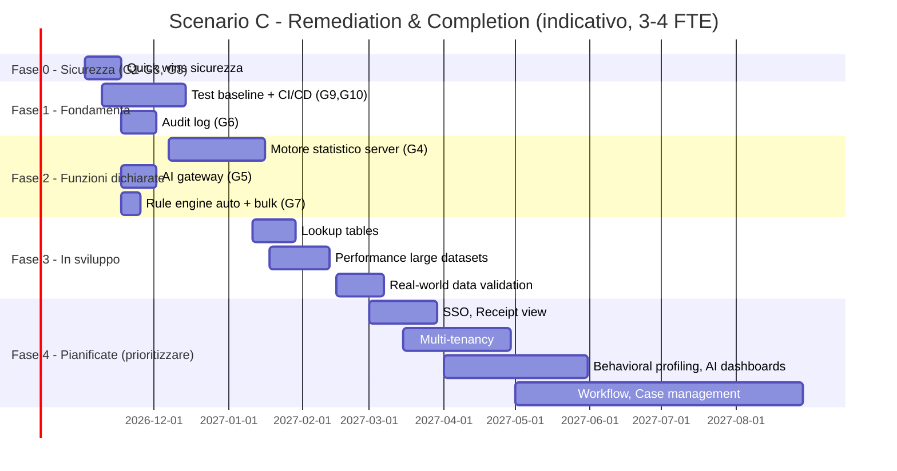

<!-- REVERSE-META
schema: 1
mode: how
step: 19_modernization_estimation_spec
commit: 593f6decec3a642d5567754dd795b19560bb0afb
commit_short: 593f6de
branch: main
worktree: clean
baseline_date: 2026-10-05T10:14:05+00:00
generated_at: 2026-10-07T14:40:00Z
-->
# Modernization Estimation - Progetto LOSS_PREVENTION

> **Baseline commit:** `593f6de` (`main`) · worktree `clean`

**Data**: 2026-10-07 · **Versione**: 1.0 · **Autori**: REVERSE how · **Audience**: committente, PM, procurement, architetti

> Il modulo "Wizard" della specifica richiede risposte del committente (team, obiettivi). In assenza di input sono state adottate **ipotesi esplicite** (§2), facilmente sostituibili: tutti i numeri sono ricalcolabili con le formule riportate. Tariffa blended di riferimento: **400 €/gg** (1 PM = 20 gg = 160 h).

---

## 1. Module 1 — The Scanner (AS-IS)

| Linguaggio | Logical SLOC | LOC/FP | FP |
|-----------|--------------|--------|----|
| C# | 10.143 | 54 | 187,8 |
| TypeScript | 3.868 | 45 | 86,0 |
| Vue `<script>` (TS) | 5.600 | 45 | 124,4 |
| JavaScript | 368 | 47 | 7,8 |
| Template/CSS/HTML | 5.448 | ignorato | — |
| **FP_AsIs** | | | **406** |

Noise reduction applicata: esclusi `node_modules`, `.vite`, `docs`, `.git`, dump BSON, JSON, Markdown. Codice commentato (Dapper) escluso dai logical SLOC.

## 2. Module 2 — The Wizard (ipotesi)

| Q | Domanda | Risposta ipotizzata | Valore | Motivazione |
|---|---------|---------------------|--------|-------------|
| Q1 | Salute del codice | B – funzionante ma difficile da modificare | 1,15 | Nessun test, god file FE, ma CCN medio basso |
| Q2 | Scalabilità | B – picchi prevedibili | 1,10 | Batch notturni, crescita per numero negozi |
| Q3 | Astrazione infrastrutturale | B – Container | 1,15 | Container Apps/App Service proposti in roadmap |
| Q4 | Conoscenza dominio | C – team nuovo/fornitore esterno | 1,30 | Contesto di acquisizione/valutazione del prodotto |
| Q5 | Conoscenza tecnologia target | A – esperti | 0,90 | Stack mainstream .NET/Vue |
| Q6 | DevOps maturity | C – tutto manuale | 1,20 | Nessuna CI/CD, nessun test |
| Q7 | RELY | B – nominale | 1,00 | Perdita economica recuperabile |
| Q8 | CPLX | B nominale (A) / C molto alta (B) | 1,00 / 1,34 | Re-architecting a servizi aumenta complessità |
| Q9 | TEAM | B – team nuovo | +0,05 | |

Target_Complexity_Factor medio (Q1–Q3) = **1,133** → la regola della specifica suggerirebbe *Re-architecting* (> 1,10). **Valutazione dell'analista**: lo stack è già moderno (.NET 8, Vue 3, MongoDB 8) e il monolite è ben stratificato: né un re-platform né un re-architect sono giustificati. Lo scenario raccomandato è **C – Remediation & Completion** (§5, §7). Gli scenari A e B sono riportati per completezza e come benchmark del costo di ricostruzione.

## 3. Module 3 — The Engine

Parametri: PDR base 14 h/FP; COCOMO II E = 0,91 + 0,01 × ΣSF con ΣSF nominale 18,97 → **E = 1,0997** (l'addendo TEAM della specifica è trascurabile: +0,0005); KSLOC_equiv = FP × 50 / 1000 (mix C#/TS).

| Grandezza | Scenario A — Re-platforming | Scenario B — Re-architecting |
|-----------|----------------------------|------------------------------|
| FP_Target | 406 × 1,05 = **426** | 406 × 1,25 = **508** |
| PDR_Final | 14 × 1,3 × 0,9 × 0,85 (CI/CD introdotta) = 13,9 h/FP | 14 × 1,3 × 0,9 × 1,2 = 19,7 h/FP |
| Effort lineare | 5.936 h = **742 gg = 37 PM** | 9.977 h = **1.247 gg = 62 PM** |
| KSLOC_equiv | 21,3 | 25,4 |
| EM | 1,00 | 1,34 |
| COCOMO PM | **85,0 PM** | **138,0 PM** |
| TDEV | 15,1 mesi | 17,6 mesi |
| Staff medio | 5,6 FTE | 7,9 FTE |
| Costo (PDR – COCOMO) | 0,30 – 0,68 M€ | 0,50 – 1,10 M€ |

## 4. Module 4 — The Strategist

| | Scenario A: Re-platforming | Scenario B: Re-architecting | **Scenario C: Remediation & Completion (raccomandato)** |
|---|---|---|---|
| Strategia | Container + Mongo gestito, codice invariato | Strangler Fig verso servizi (Ingestion, Fraud Analysis, Reporting, Identity) | Mantiene stack e monolite; corregge sicurezza, sposta la logica antifrode/AI sul server, completa le feature |
| Costo | 0,30–0,68 M€ | 0,50–1,10 M€ | **0,14–0,22 M€** (§7) |
| Durata | 12–15 mesi | 15–18 mesi | **6–9 mesi** con 3–4 FTE |
| Pro | Basso rischio infrastrutturale | Scalabilità massima | Massimo valore per euro; riusa 100% dello stack |
| Contro | Il debito resta; non chiude le vulnerabilità | Over-engineering per i volumi attesi | Richiede disciplina (test prima dei refactoring) |

### Strangler Fig Generator (budget 6 mesi, per lo Scenario B)
Ordinamento per accoppiamento (dal meno al più connesso, stimato da riferimenti tra servizi):
1. **Identity** (Users/Roles/Permissions/Reset — 32 endpoint, dipendenze solo Infrastructure)
2. **Notifications & Groups** (12 endpoint, repository diretto)
3. **Ingestion worker** (Coordinator, SFTP, processors; dipende da Mapping)
4. **Fraud Analysis** (Rules + statistica + distance; dipende da ReportData e Mapping)
5. **Reporting** (query, workspaces, dashboard; il più accoppiato a Mapping/ReportData)

Con PDR 19,7 h/FP e 3 FTE (≈ 2.880 h in 6 mesi ≈ 146 FP) si estraggono **Identity + Notifications/Groups + Ingestion worker**.

## 5. Scenario C — piano di remediation (sintesi)

## 6. Integrazione Dependency Graph
Accoppiamento tra progetti (Ca/Ce): `Infrastructure` Ca = 3 (API, Application, Console), `Application` Ca = 2, Ce = 2; nessun ciclo. Moduli con Ca + Ce elevato a livello di servizio: `MappingService` (usato da Rules, Report, Distance, Coordinator) → +20% effort sugli interventi che lo toccano (già incluso nelle forchette di §7).

---

## 7. Effort di completamento funzionalità in sviluppo e pianificate

**Fonte dell'elenco**: `Docs/01_EXECUTIVE_OVERVIEW.md` → *Current Status*: **In Development** (3 voci) e **Planned Enhancements** (7 voci); integrato con le lacune emerse dalla verifica delle funzionalità dichiarate (documento 02 §6).

**Metodo**: per le voci funzionali, stima in FP (IFPUG semplificato: ILF/EIF/EI/EO/EQ attesi) × PDR 14 h/FP = **1,75 gg/FP**; per le voci tecniche, stima bottom-up. L'effort comprende analisi di dettaglio, sviluppo, unit test e test funzionale della singola feature; **esclude** PM/coordinamento (+15%, applicato nei totali) e contingency. Le forchette riflettono l'assenza di requisiti dettagliati.

### 7.1 Gap da colmare perché le funzionalità dichiarate siano realmente "presenti" e utilizzabili

| ID | Intervento | Collegamento alla dichiarazione | Effort (gg) |
|----|-----------|----------------------------------|-------------|
| G1 | Row-level lock applicato dal server (query, distance, export, regole) | "Field-level access control" | 8–12 |
| G2 | Query DSL / whitelist pipeline | Sicurezza report | 5–8 |
| G3 | DTO utente senza hash/salt | Sicurezza | 0,5–1 |
| G4 | **Motore statistico antifrode server-side** con persistenza risultati (`FraudFindings`), job asincrono, explainability | "Real-time fraud analysis", "Statistical anomaly detection", "Audit trail" | 25–40 |
| G5 | **AI gateway backend** (Ollama server o Azure OpenAI), config modello/token/temperatura, logging prompt | "AI-Powered NLQ", "AI Configuration" | 10–15 |
| G6 | Audit log (accessi, export, modifiche regole/soglie, esiti analisi) | "Audit logging", "Compliance" | 10–15 |
| G7 | Rule engine: applicazione automatica post-ingestione + bulk update + fix `UpdateRuleAsync` | "Rule engine applied on ingestion" (roadmap) | 5–8 |
| G8 | Fix `create-transactions` e contratto token login | Upload transazioni | 1–2 |
| G9 | Test automatici baseline (BE + FE + E2E) | Qualità/"need to test" | 20–30 |
| G10 | CI/CD + containerizzazione + config per ambiente | Deploy | 8–12 |
| | **Subtotale G** | | **92,5–143** |

### 7.2 Funzionalità "In Development"

| Feature | Stato nel codice | Stima | Effort (gg) |
|---------|------------------|-------|-------------|
| **Lookup tables** | Solo flag `IsLookup` sulle mapping, nessuna logica | 7–10 FP (ILF lookup, CRUD, join in query, UI) | **12–18** |
| **Performance optimization for large datasets** | Assente: full scan su regole/distance, `MongoClient` scoped, nessun indice, doppia aggregazione | bottom-up (indici gestiti, bulk ops, paginazione server, cache invalidabile, profiling) | **15–25** |
| **Real-world data testing & validation** | Bloccato ("Waiting for Custom[er]") | bottom-up (3 dataset, tuning soglie/mapping, fix) | **10–20** |
| | **Subtotale In Development** | | **37–63** |

### 7.3 Funzionalità "Planned"

| Feature | Stato nel codice | Stima | Effort (gg) |
|---------|------------------|-------|-------------|
| **Multi-tenancy** (versione semplificata) | Assente; single DB da config | bottom-up (risoluzione tenant, isolamento DB-per-tenant, config, seed, test) | **30–45** |
| **SSO** | Assente; JWT locale | 6–9 FP (OIDC/Entra ID, mapping ruoli) | **10–16** |
| **Case management tool** (con form editor) | Assente; richiede design | 35–50 FP | **61–88** |
| **Blueprint / workflow automation** (invio report, ecc.) | Assente | 18–26 FP (scheduler, template, email, storico) | **32–46** |
| **Receipt view** | Assente | 4–7 FP | **7–12** |
| **Behavioral profiling** (incl. validazione KNN, normalizzazione feature, profili per operatore/negozio) | Distanza euclidea senza normalizzazione | 15–23 FP | **26–40** |
| **AI dashboard generation** | Assente (esiste generazione template report) | 9–14 FP | **16–25** |
| | **Subtotale Planned** | | **182–272** |

### 7.4 Totali

| Blocco | Effort sviluppo (gg) | + PM 15% (gg) | Costo @ 400 €/gg |
|--------|----------------------|----------------|------------------|
| G – Gap funzionalità dichiarate + hardening | 92,5–143 | 106–164 | **43–66 k€** |
| In Development | 37–63 | 43–72 | **17–29 k€** |
| Planned | 182–272 | 209–313 | **84–125 k€** |
| **Totale** | **311–478** | **358–550** | **143–220 k€** |

Lettura per decisione:
- **Completare solo ciò che è "in sviluppo"**: 43–72 gg (≈ 2–3,5 mesi con 1 FTE; ~1 mese con 3 FTE), 17–29 k€.
- **Rendere affidabili le funzionalità già vendute come complete** (antifrode, statistica, AI, sicurezza): 106–164 gg, 43–66 k€ — **prerequisito** per un uso in produzione su dati reali.
- **Roadmap "Planned" completa**: 209–313 gg, 84–125 k€; il 30–40% è legato a Case management e Workflow, i cui requisiti non sono ancora definiti (contingency consigliata +20%).

### 7.5 Ulteriori voci di `roadmap.txt` non incluse nei totali
DB seeding/setup wizard (8–12 gg), licensing (10–20 gg), branding URL-dependent (8–12 gg), linked reports (8–12 gg), estensione charting (10–15 gg), restrizione dashboard per regione/negozio (coperta in gran parte da G1), estensione alert & notifiche (15–20 gg). **Subtotale aggiuntivo: 59–91 gg** (68–105 gg incl. PM 15%, ≈ 27–42 k€).

### 7.6 Assunzioni e limiti
- Stime da analisi statica del codice; nessuna esecuzione/benchmark.
- Team con competenze .NET/Vue senior; tariffa blended 400 €/gg (parametrica).
- Requisiti di dettaglio non disponibili per Case management, Workflow, Multi-tenancy: forchette ampie.
- Esclusi: licenze/infrastruttura cloud, GPU per LLM, attività di compliance legale (DPIA, accordi sindacali).

---

## Reference Documents
- 02_functional_overview.md · 14_metrics.md · 15_fp_cocomo.md · 17_backend_deep_assessment.md

## Change Log

| Versione | Data | Autore | Modifiche |
|----------|------|--------|-----------|
| 1.0 | 2026-10-07 | REVERSE how (FULL) | Creazione documento (sostituisce run 2026-10-05) |
